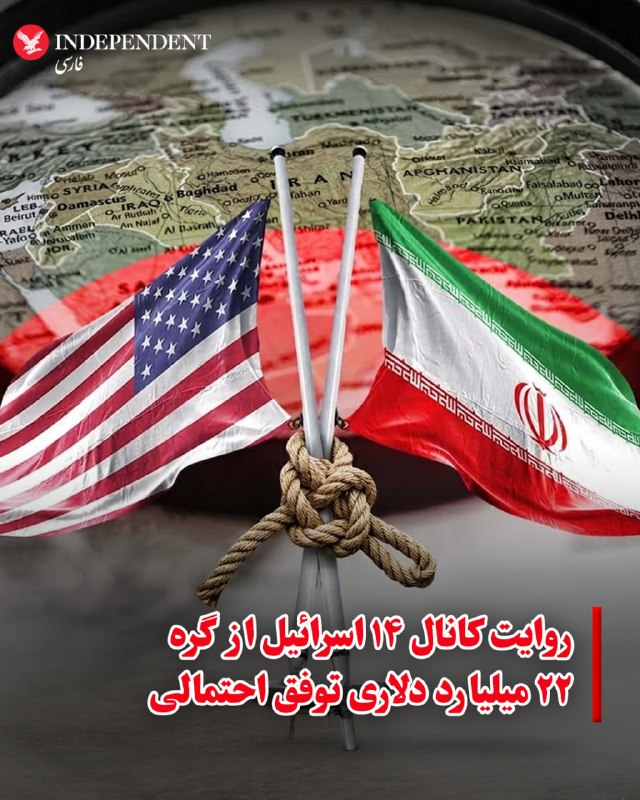
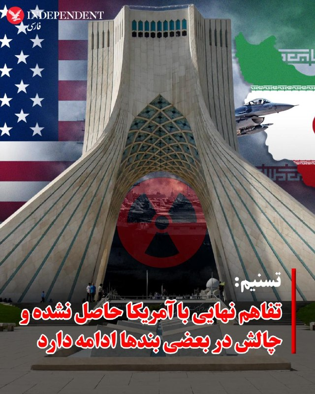
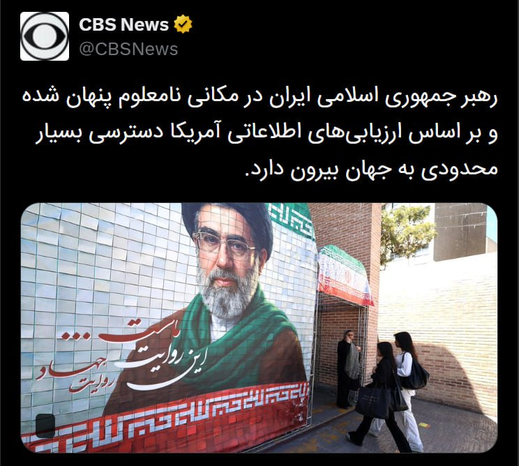
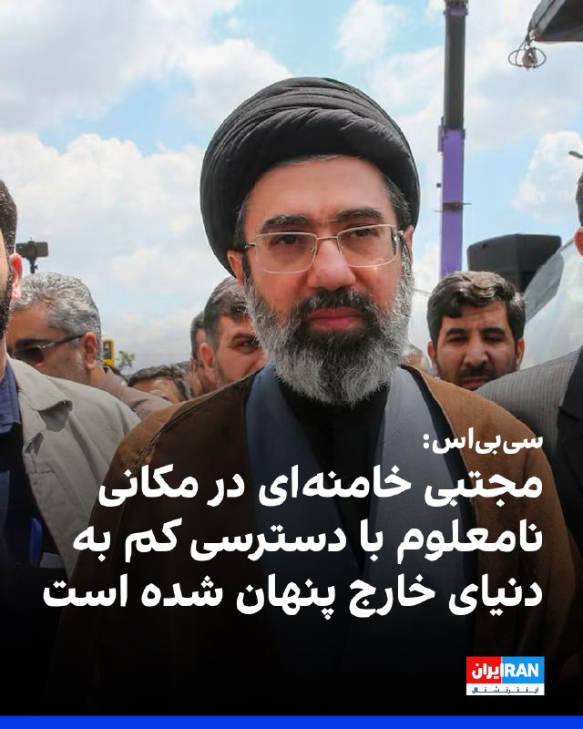
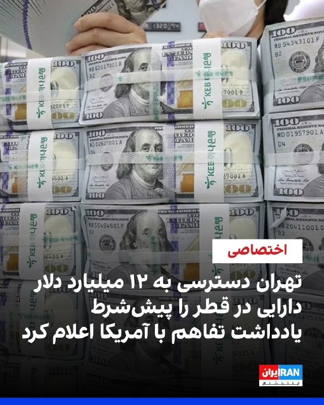
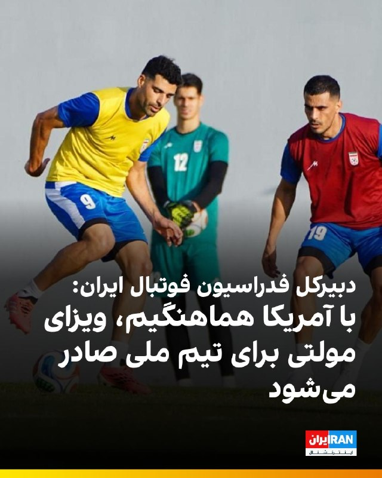
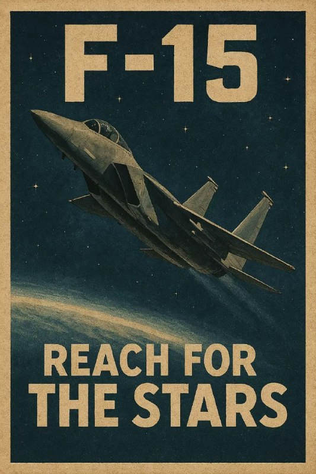
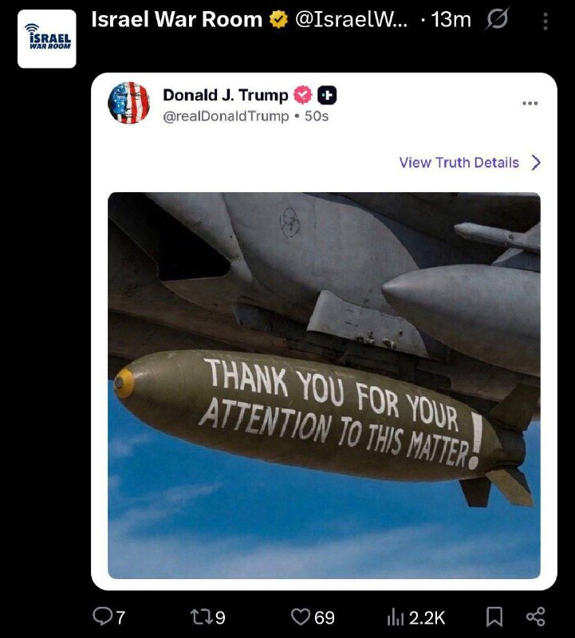
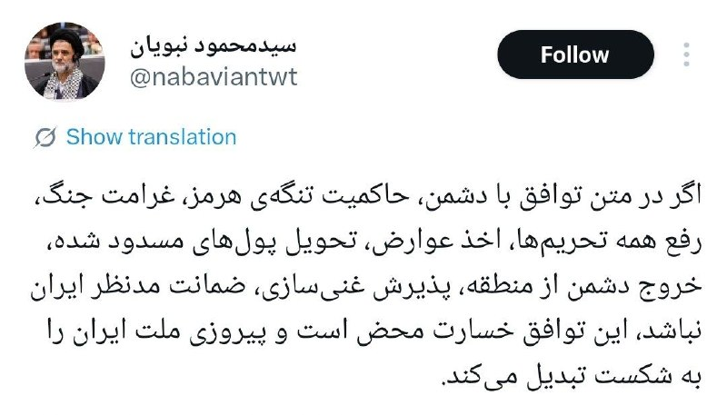

# خواننده تلگرام

<!-- TOP_NAV START -->

<a href="https://github.com/iocollab20/maxman/blob/main/telegram/content/archive_1.md" style="display:inline-block; padding:6px 12px; margin:0 4px; background-color:#2ea44f; color:white; text-decoration:none; border-radius:4px; font-weight:bold;">صفحه بعد</a>

<!-- TOP_NAV END -->

<!-- MSG START -->

---
📅 بروزرسانی: 1405/03/04 03:17
---

## VahidOOnLine — post 242017

  <a href="telegram/content/VahidOOnLine_242017_1779666427.mp4" target="_blank">🎬 Download video</a>

♦️همزمان با افزایش تنش‌ها، حبیب‌الله سیاری، معاون هماهنگ‌کننده ارتش جمهوری اسلامی، روز یکشنبه، در پرسش خبرنگاران درباره روند مذاکرات و گزارش‌های منتشر شده پیرامون احتمال امضای یک توافق اولیه میان تهران و واشنگتن گفت: «من اصلا نمی‌دانم توافق چیست». این اظهارات در حالی مطرح شد که به گزارش کانال ۱۴ اسرائیل، نقطه اختلاف اصلی میان رژیم ایران و آمریکا در نهایی کردن توافق اولیه بر سر ۲۲ میلیارد دلاری است که مقام‌های جمهوری اسلامی خواهان دریافت فوری آن هستند. دونالد ترامپ نیز روز یکشنبه اعلام کرد اگر با ایران به توافق برسد، این توافق «خوب و درست» خواهد بود و شباهتی به توافق هسته‌ای دوره باراک اوباما نخواهد داشت.
‌🇸🇦 Indypersian

🤖 @VahidOOnLine

## VahidOOnLine — post 242016

  

مارکو روبیو، وزیر خارجه آمریکا، درخواست حزب‌الله لبنان، از گروه‌های نیابتی جمهوری اسلامی، برای سرنگونی دولت منتخب دموکراتیک لبنان را محکوم کرد و گفت: «تهدیدهای حزب‌الله مبنی بر خشونت و سرنگونی، اجازه موفقیت نخواهد داشت.»

او در بیانیه‌ای که در وب‌سایت وزارت خارجه آمریکا منتشر شد، گفت حزب‌الله درخواست‌های مکرر دولت مشروع لبنان برای توقف حملات و احترام به آتش‌بس را نادیده گرفته و به شلیک به مواضع اسرائیل و انتقال شبه‌نظامیان و سلاح به جنوب لبنان ادامه داده است.

روبیو این اقدامات را «کارزار عمدی برای بی‌ثبات کردن کشور و حفظ قدرت خود به قیمت آینده مردم لبنان» خواند و گفت حزب‌الله در تلاش است لبنان را به هرج‌ومرج و ویرانی بازگرداند.

او تاکید کرد ایالات متحده در کنار دولت مشروع لبنان برای بازگرداندن اقتدار خود و ساختن آینده‌ای بهتر برای مردم این کشور می‌ایستد و افزود: «دورانی که یک گروه تروریستی، کل یک ملت را گروگان گرفته بود، رو به پایان است.»

‌🏁 🇬🇧 IranintlTV

🤖 @VahidOOnLine

## VahidOOnLine — post 242015

♦️ وزارت دفاع عربستان سعودی روز شنبه با انتشار ویدیویی در اکس اعلام کرد نیروهای پدافند هوایی این کشور با آمادگی کامل فعالیت می‌کنند و سطح آمادگی امنیتی افزایش یافته است. این وزارتخانه اعلام کرد نیروهای پدافند هوایی با استفاده از سامانه‌های پیشرفته رصد و مقابله با تهدیدهای هوایی، امنیت و آرامش زائران حج را تامین می‌کنند. وزارت دفاع عربستان سعودی تاکید کرد این اقدامات در راستای تقویت امنیت و خدمت‌رسانی به زائران در مکه و مناطق مقدس انجام می‌شود.
‌🇸🇦 Indypersian

🤖 @VahidOOnLine

## VahidOOnLine — post 242014

  

♦️به گزارش کانال ۱۴ اسرائیل، نقطه اختلاف اصلی میان رژیم جمهوری اسلامی و آمریکا در نهایی کردن توافق اولیه بر سر ۲۲ میلیارد دلار است؛ مبلغی که مقام‌های جمهوری اسلامی خواهان دریافت فوری آن هستند، در حالی که دولت ترامپ اصرار دارد تهران ابتدا به تعهدات خود عمل کند.
این گزارش می افزاید به رژیم ایران توافقی رویایی» پیشنهاد شده که انتظار می‌رود آن را بپذیرند، اما جمهوری اسلامی در مراحل پایانی مذاکرات با رئیس‌جمهوری آمریکا در حال اتخاذ موضعی سخت‌گیرانه است.
‌🇸🇦 Indypersian

🤖 @VahidOOnLine

## VahidOOnLine — post 242013

  

شبکه خبری سی‌بی‌اس به نقل از مقام‌های آمریکایی آگاه گزارش داد اطلاعات ایالات متحده نشان می‌دهد مجتبی خامنه‌ای، رهبر جمهوری اسلامی، عملا در مکانی نامعلوم پنهان شده و دسترسی بسیار محدودی به دنیای خارج دارد.

بر اساس این گزارش، مقام‌های حکومت ایران تنها از طریق شبکه‌ای پیچیده از پیک‌ها با او ارتباط می‌گیرند و حتی مقام‌های ارشد نیز از محل دقیق او اطلاع ندارند یا راهی برای تماس مستقیم با او ندارند.

سی‌بی‌اس نوشت این اختلال ارتباطی یکی از دلایل کندی در اعلام جزئیات توافق احتمالی تهران و واشینگتن است؛ زیرا پس از ارسال پیشنهادهای آمریکا، دسترسی دشوار به خامنه‌ای می‌تواند پاسخ تهران را با تأخیر قابل‌توجه روبه‌رو کند.

سخنگوی کاخ سفید از اظهارنظر درباره محل اقامت خامنه‌ای یا شیوه ارتباطی مقام‌های جمهوری اسلامی خودداری کرد.

این شبکه همچنین به نقل از مقام‌های آمریکایی نوشت بسیاری از مقام‌های جمهوری اسلامی هفته‌ها را در پناهگاه‌های مستحکم می‌گذرانند و جز در موارد ضروری با یکدیگر گفت‌وگو نمی‌کنند.
‌🏁 🇬🇧 IranintlTV

🤖 @VahidOOnLine

## VahidOOnLine — post 242012

  

♦️مهدی کوهیان، مدیر حقوقی خانه سینما، با تایید احضار تعدادی از سینماگران از جمله سعید روستایی و هومن سیدی به دادسرای فرهنگ و رسانه، اعلام کرد که قوه قضائیه جمهوری اسلامی این کارگردانان سرشناس را به اتهام سنگین «همکاری با دولت‌های متخاصم» متهم کرده است. پیش از این، هومن سیدی، کارگردان و بازیگر همزمان با کشتار مردم ایران در اعتراضات دی‌ماه ۱۴۰۴، در واکنش به برگزاری جشنواره حکومتی فجر در اینستاگرام نوشته بود: «هیچ جشنواره‌ای، هیچ تندیس و هیچ دیده‌شدنی ارزش ایستادن روی سکوب و عبور از جان انسان را ندارد. دیده‌شدن، وقتی به قیمت ندیدن انسان تمام می‌شود، فقط یک معامله‌ ارزان است. سینما وقتی کنار انسان می‌ایستد معنا دارد؛ وقتی از روی او رد می‌شود، دیگر فقط یک تصویر بی ارزش است».
کوهیان با انتقاد از این اقدام دستگاه قضایی جمهوری اسلامی تصریح کرد که طرح چنین عناوین کیفری سنگینی علیه هنرمندانی که سال‌ها برای تولید فرهنگ ایرانی تلاش کرده‌اند، بدون مستندات روشن تنها به تعمیق شکاف‌های اجتماعی و آسیب به انسجام داخلی منجر می‌شود و ابلاغ مداوم آن در احضاریه‌ها، متاسفانه باعث «شکسته شدن تابوی این اتهام بزرگ» شده است. مدیر حقوقی خانه سینما در بخش دیگری از گفتگو با خبرگزاری ایسنا اعلام کرد که تعدادی از این سینماگران برخلاف درخواست صنف برای حفظ سکوت، خبر احضار خود را به رسانه‌ها درز داده‌اند؛ اقدامی که به گفته او «از منظر میهن‌پرستی و تدبیر جمعی به ضرر فضای کلی سینما و کشور بوده است».
‌🇸🇦 Indypersian

🤖 @VahidOOnLine

## VahidOOnLine — post 242011

  

♦️اسرائیل تایمز یکشنبه سوم خردادماه گزارش داد ایال زمیر، رئیس ستاد کل ارتش اسرائیل، اعلام کرد ارتش این کشور آماده بازگشت فوری به جنگ با جمهوری اسلامی و تشدید حملات علیه حزب‌الله است. او همچنین پس از ارزیابی وضعیت میدانی، طرح‌های ادامه نبرد علیه حزب‌الله در لبنان را تایید کرد.

زمیر در بازدید از فرماندهی منطقه شمال و مقر تیپ زرهی ۴۰۱ گفت ارتش اسرائیل مصمم است حملات علیه حزب‌الله را عمیق‌تر کند و به حمله به این گروه «در همه ابعاد» ادامه دهد.

او تاکید کرد امنیت ساکنان و حفظ جان نیروهای اسرائیلی «بالاتر از هر چیز» است و افزود ارتش اسرائیل آماده است فورا به درگیری‌های شدید بازگردد و حکومت «تروریستی» جمهوری اسلامی و توانمندی‌های آن را بیش از پیش تضعیف کند.

اظهارات رئیس ستاد کل ارتش اسرائیل در حالی مطرح می‌شود که آمریکا و جمهوری اسلامی در حال مذاکره برای دستیابی به توافقی احتمالی هستند؛ توافقی که گزارش شده ممکن است شامل بندی درباره توقف درگیری‌ها در لبنان باشد.

زمیر همچنین از عملکرد تیپ ۴۰۱ تمجید کرد و برای مئیر بیدرمن، فرمانده این تیپ که هفته گذشته در جنوب لبنان به‌شدت زخمی شد، آرزوی بهبودی سریع کرد.
‌🇸🇦 Indypersian

🤖 @VahidOOnLine

## VahidOOnLine — post 242010

  <a href="telegram/content/VahidOOnLine_242010_1779666432.mp4" target="_blank">🎬 Download video</a>

دادگاهی در بحرین، ۹ متهم را به اتهام همکاری با سپاه پاسداران به حبس ابد محکوم کرده است.
به گزارش رویترز، این افراد به اتهام «انجام اقدامات خصمانه و تروریستی علیه بحرین» و همکاری با سپاه پاسداران محکوم شده‌اند. دو متهم دیگر نیز به سه سال زندان محکوم شده‌اند.
براساس اعلام دادستانی، این افراد متهم به جمع‌آوری اطلاعات از اماکن حساس و تسهیل انتقال‌های مالی مرتبط بوده‌اند.
این پرونده پس از آن مطرح شد که وزارت کشور بحرین اعلام کرد در ماه مه ۴۱ نفر را در ارتباط با شبکه‌ای مرتبط با سپاه پاسداران بازداشت کرده است. مقامات بحرینی مدعی شده‌اند این شبکه با هدف اقدامات امنیتی علیه کشور فعالیت داشته است.
در همین حال، تنش‌ها میان ایران و کشورهای منطقه پس از درگیری‌های اخیر و حملات متقابل در خلیج فارس افزایش یافته است؛ هرچند تهران همواره این اتهامات را رد کرده و آنها را سیاسی می‌داند.
‌🏁 🇬🇧 ManotoTV

🤖 @VahidOOnLine

## VahidOOnLine — post 242009

  <a href="telegram/content/VahidOOnLine_242009_1779666433.mp4" target="_blank">🎬 Download video</a>

خبرگزاری رویترز به نقل از یک مقام دولت آمریکا گزارش داده است که جمهوری‌اسلامی در اصل با کنار گذاشتن ذخایر اورانیوم نزدیک به سطح تسلیحاتی خود موافقت کرده است.
به گفته این مقام ارشد در دولت ترامپ، واشنگتن معتقد است رهبر جمهوری اسلامی چارچوب کلی این توافق را تایید کرده است. با این حال هنوز از سوی تهران تأیید رسمی یا توضیحی درباره معنای دقیق «موافقت اصولی» ارائه نشده است.
این مقام آمریکایی همچنین در واکنش به گزارش‌هایی مبنی بر اینکه جمهوری‌اسلامی با کنار گذاشتن ذخایر اورانیوم غنی‌شده موافقت نکرده، گفته است: «موضوع این نیست که آیا، بلکه چگونه.»
در همین حال، منابع جمهوری‌اسلامی به رویترز گفته‌اند که در مراحل بعدی مذاکرات می‌توان «فرمول‌های عملی» برای حل این مسئله پیدا کرد؛ از جمله رقیق‌سازی اورانیوم تحت نظارت آژانس بین‌المللی انرژی اتمی.
بر اساس گزارش آژانس بین‌المللی انرژی اتمی، جمهوری‌اسلامی در حال حاضر ۴۴۰.۹ کیلوگرم اورانیوم با غنای ۶۰ درصد در اختیار دارد؛ سطحی که از نظر فنی تنها یک گام کوتاه تا سطح تسلیحاتی ۹۰ درصد فاصله دارد.
‌🏁 🇬🇧 ManotoTV

🤖 @VahidOOnLine

## VahidOOnLine — post 242008

دونالد ترامپ جونیور، پسر رئیس‌جمهور‌ آمریکا در شبکه اکس، با بازنشر پستی مرتبط با مذاکرات آمریکا با جمهوری‌اسلامی نوشته است «این یک پیروزی بسیار بزرگ برای آمریکا است. ما باید حرف کسانی را نادیده بگیریم که فقط زمانی خوشحال می‌شوند که حمله زمینی به ایران انجام شود. پدر من وعده داده بود که جلوی دست‌یابی ایران به سلاح هسته‌ای را بگیرد و دقیقاً هم دارد همین کار را انجام می‌دهد»

دونالد ترامپ جونیور، فرزند ارشد رئیس‌جمهور آمریکا، ۲۱ می با بتینا اندرسون، اینفلوئنسر ۳۹ ساله اهل پالم بیچ فلوریدا، ازدواج کرد.
این زوج ابتدا یک مراسم قانونی و کاملا خصوصی را در وست پالم بیچ برگزار کردند و سپس جشن اصلی ازدواج در ۲۳ می، در یک جزیره خصوصی در باهاما و با حضور جمعی از اعضای خانواده و دوستان نزدیک برگزار شد.
این مراسم به‌صورت محدود و دور از رسانه‌ها انجام شد.
در همین حال، دونالد ترامپ، پدر داماد، اعلام کرد که به دلیل «مسائل دولتی و تعهدات مربوط به آمریکا» قادر به حضور در مراسم نبوده است. او گفته است که شرایط حساس سیاسی و تنش‌های جاری، از جمله وضعیت مرتبط با جمهوری‌اسلامی و تحولات منطقه‌ای، مانع حضورش در این مراسم شده است.
‌🏁 🇬🇧 ManotoTV

🤖 @VahidOOnLine

## VahidOOnLine — post 242007

  <a href="telegram/content/VahidOOnLine_242007_1779666434.mp4" target="_blank">🎬 Download video</a>

هشت تن از متهمان پرونده «شهرک اکباتان» توسط شعبه ۱۵ دادگاه انقلاب تهران به ریاست قاضی ابوالقاسم صلواتی به احکام سنگین قضایی محکوم شدند.
بر اساس این حکم، میلاد آرمون، نوید نجاران، مهدی ایمانی و سید محمدمهدی حسینی از بابت اتهام «محاربه» به اعدام محکوم شده‌اند.
همچنین امیرمحمد خوش‌اقبال، علیرضا برمرز پورناک، علیرضا کفایی و حسین نعمتی نیز هرکدام به ۵ سال حبس بابت اتهام اجتماع و تبانی، ۲ سال حبس بابت تبلیغ علیه نظام، ۲ سال منع فعالیت در فضای مجازی و همچنین ۲ سال منع اقامت در تهران و البرز محکوم شده‌اند.
شعبه ۱۳ دادگاه کیفری یک تهران چند روز پیش حکم قصاص ۶ متهم این پرونده را نقض کرد. بر اساس این رای، سه نفر به ۵ سال حبس و پرداخت دیه محکوم شدند و سه نفر دیگر نیز از اتهامات تبرئه شدند.
اما بخش امنیتی پرونده که در شعبه ۱۵ دادگاه انقلاب رسیدگی می‌شود، امروز احکام متفاوتی صادر کرد؛ به‌طوری که چهار متهم شامل میلاد آرمون، نوید نجاران، سیدمحمدمهدی حسینی و مهدی ایمانی به اعدام محکوم شدند و چهار متهم دیگر نیز مجموعاً به ۷ سال حبس محکوم شدند.
نکته جنجالی این پرونده اما نحوه ابلاغ احکام است؛ به گفته وکلای متهمان، رأی دادگاه بدون حضور وکلا و به‌صورت شفاهی به متهمان در زندان اعلام شده و تاکنون نسخه رسمی رای در اختیار آن‌ها قرار نگرفته است.
وکلای پرونده این روند را غیرقانونی و خلاف آیین دادرسی عنوان کرده و می‌گویند حتی از جزئیات دقیق اتهامات و شماره دادنامه نیز مطلع نشده‌اند؛ موضوعی که به گفته آن‌ها عملا امکان اعتراض به حکم را با ابهام جدی مواجه کرده است.
این پرونده که از دل اعتراضات ۱۴۰۱ و کشته شدن طلبه بسیجی آرمان علی‌وردی شکل گرفته، همچنان در دو مسیر جداگانه قضایی در حال رسیدگی است.
‌🏁 🇬🇧 ManotoTV

🤖 @VahidOOnLine

## VahidOOnLine — post 242006

  

مذاکره‌کنندگان ایرانی آزادسازی فوری ۱۲ میلیارد دلار از دارایی‌های مسدودشده ایران در قطر را پیش‌شرط پیشبرد مذاکرات با آمریکا اعلام کرده‌اند.

یک منبع مطلع با آگاهی مستقیم از روند گفت‌وگوها به ایران‌اینترنشنال گفت تهران اصرار دارد در مرحله اولیه یادداشت تفاهم، دسترسی واقعی و تضمین‌شده به این منابع فراهم شود و بدون آن، تفاهم دیپلماتیک مقدماتی پیش نخواهد رفت.

به گفته این منبع، این مبلغ تنها بخش فوری مورد درخواست ایران برای آغاز نقشه راه دیپلماتیک است و تهران خواهان آزادسازی کامل همه دارایی‌های مسدودشده خود در جهان در چارچوب توافق جامع نهایی است.

هم‌زمان، خبرگزاری تسنیم، وابسته به سپاه پاسداران، گزارش داد اختلافات تهران و واشینگتن بر سر یک یا دو بند یادداشت تفاهم احتمالی همچنان باقی است.

تسنیم نوشت ایران خواستار آزادسازی بخشی از دارایی‌های خود در گام نخست و تعیین سازوکاری برای آزادسازی باقی منابع در جریان مذاکرات شده است.

این رسانه افزود آمریکا تلاش کرده آزادسازی دارایی‌ها را به توافق نهایی هسته‌ای مشروط کند و مانع‌تراشی واشینگتن در این زمینه ادامه دارد که احتمال لغو توافق را همچنان زنده نگه داشته است.
http
‌🏁 🇬🇧 IranintlTV

🤖 @VahidOOnLine

## VahidOOnLine — post 242005

  <a href="telegram/content/VahidOOnLine_242005_1779666437.mp4" target="_blank">🎬 Download video</a>

ویدیوهای دریافت‌شده نشان می‌دهد جمعی از ایرانیان ساکن آتلانتا در آمریکا، روز یک‌شنبه سوم خرداد، در حمایت از مردم ایران و شاهزاده رضا پهلوی تجمع و راهپیمایی برگزار کردند. آن‌ها علیه اعدام‌های جمهوری اسلامی شعار سر دادند و از دولت آمریکا خواستند با این حکومت هیچ توافقی نکند.
‌🏁 🇬🇧 IranintlTV

🤖 @VahidOOnLine

## VahidOOnLine — post 242004

  <a href="telegram/content/VahidOOnLine_242004_1779666439.mp4" target="_blank">🎬 Download video</a>

♦️تصاویر منتشر شده در شبکه‌های اجتماعی که بسیار مورد توجه قرار گرفته است، تلاش نافرجام مردی را نشان می‌دهد که با پوشیدن لباس سفید و ایستادن در میان امواج متلاطم ساحل، سعی داشت معجزه شکافتن دریا توسط «حضرت موسی» را شبیه‌سازی کند. در ابتدای این ویدئو، جمعیتی که در ساحل نظاره‌گر این صحنه بودند با شور و هیجان زیاد و بالا بردن دست‌هایشان او را تشویق می‌کردند، اما این نمایش چندان طولی نکشید و به محض این‌که یک موج بسیار سهمگین به سمت او هجوم آورد، این مدعی پا به فرار گذاشت. انتشار این ویدئو واکنش‌های طنزآمیز و کنایه‌آمیز کاربران در شبکه‌های اجتماعی را به‌همراه داشت. بسیاری از کاربران با بازنشر این ویدئو به طنز نوشتند که «طبیعت و جاذبه زمین هیچ‌وقت با کسی شوخی ندارد».
‌🇸🇦 Indypersian

🤖 @VahidOOnLine

## VahidOOnLine — post 242003

  

♦️مارکو روبیو، وزیر امور خارجه ایالات متحده، روز یکشنبه، سوم خردادماه، با انتشار بیانیه‌ای رسمی در اکس، فراخوان حزب‌الله برای سرنگونی دولت لبنان را به شدت محکوم کرد و نوشت: «ایالات متحده با شدیدترین لحن، اقدام بی‌ملاحظه حزب‌الله در فراخوان برای سرنگونی دولت دموکراتیک و منتخب لبنان را محکوم می‌کند؛ این گروه با نادیده گرفتن درخواست‌های مکرر دولت قانونی لبنان برای توقف حملات و احترام به آتش‌بس، به شلیک به مواضع اسرائیل و انتقال شبه‌نظامیان و تسلیحات به جنوب لبنان ادامه داده که این یک کارزار عمدی برای بی‌ثبات کردن کشور است.» وزیر خارجه آمریکا با تاکید بر حمایت قاطع واشنگتن از بیروت افزود: «دولت لبنان با حمایت کامل ایالات متحده برای بازسازی و ایجاد آینده‌ای باثبات تلاش می‌کند، اما در مقابل، حزب‌الله در حال کشاندن کشور به سمت هرج‌ومرج و نابودی است؛ ما قاطعانه در کنار دولت قانونی لبنان ایستاده‌ایم و اجازه نخواهیم داد تهدیدهای خشونت‌آمیز حزب‌الله برای سرنگونی دولت به نتیجه برسد، چرا که دوران گروگان گرفته شدن یک ملت کامل توسط یک گروه تروریستی رو به پایان است.»
‌🇸🇦 Indypersian

🤖 @VahidOOnLine

## VahidOOnLine — post 242002

  

♦️ دونالد ترامپ، رئیس‌جمهوری آمریکا، هم‌زمان با مذاکرات فشرده دیپلماتیک میان واشنگتن و تهران، تصویری معنادار و هشدارآمیز از یک بمب نصب‌شده زیر بال یک جنگنده را در شبکه اجتماعی «تروث سوشال» منتشر کرد که روی آن عبارت «از توجه شما به این موضوع سپاسگزارم!» درج شده است. این پیام پس از آن منتشر شد که ترامپ با حمله به منتقدان و «بازنده» خواندن آن‌ها تاکید کرد برخلاف اوباما تن به یک «توافق بد» نخواهد داد و اگرچه چارچوب تفاهم با ایران بر سر ذخایر هسته‌ای و تنگه هرمز تا ۹۵ درصد پیش رفته، اما هنوز نهایی نشده است. این تصویر در واقع بازتاب‌دهنده همان موضع سرسختانه مقامات کاخ سفید و وزیر خارجه آمریکا، مارکو روبیو، در روز یکشنبه است که اعلام کردند واشنگتن برای امضای توافق عجله‌ای ندارد و در صورت عدم پایبندی تهران به اصول فنی مذاکرات و رویکرد «نه غبار، نه دلار»، گزینه‌های نظامی و ازسرگیری حملات سنگین علیه ایران کاملا روی میز باقی خواهد ماند.

#دونالد_ترامپ #ایران #آمریکا #مذاکرات #تنگه_هرمز #حمله_نظامی #ایندیپندنت_فارسی
‌🇸🇦 Indypersian

🤖 @VahidOOnLine

## VahidOOnLine — post 242001

  

♦️تسنیم، خبرگزاری وابسته به سپاه پاسداران، روز یکشنبه به نقل از «یک مقام مطلع» گزارش داد: «هیچگونه خوش‌بینی به آمریکا ندارد و رد و بدل پیامها از طریق میانجی پاکستانی نیز دائماً با در نظر گرفتن بدبینی به دولت آمریکا صورت می‌گیرد». تسنیم به نقل از این منبع در ادامه نوشت: «تا این لحظه تفاهم نهایی حاصل نشده و چالش در بعضی بندها ادامه دارد، اما حتی اگر تفاهم اولیه‌ای نیز صورت بگیرد، به معنای تغییر نگاه ایران به آمریکا و اطمینان از اجرای تعهدات این دولت نیست. آمریکایی‌ها سابقه بسیار بدی در مذاکرات دارند که بدبینی ها را تقویت و تثبیت می‌کند. پس حتی اگر تفاهمی نیز صورت بگیرد ایران در طول روند پس از اعلام تفاهم، اقدامات آمریکا را زیر نظر خواهد گرفت و در صورتی که آمریکا در آن مرحله نقض عهد کند، ایران اهرم‌های خود برای مواجهه با آن را حفظ خواهد کرد».
تسنیم پیش از این نیز از «کارشکنی‌های آمریکا» در بندهای تفاهم از جمله در آزادسازی اموال بلوکه شده ایران گزارش داده و نوشته بود: «همچنان امکان منتفی شدن تفاهم وجود دارد».
‌🇸🇦 Indypersian

🤖 @VahidOOnLine

## VahidOOnLine — post 242000

  

خبرگزاری فارس وابسته به سپاه پاسداران نوشت که دادگاه انقلاب تهران ۴ نفر از «متهمان اصلی» در پرونده شهرک اکباتان را به اتهام «افساد فی‌الارض»، به اعدام محکوم کرده است.
فارس نوشت متهمان ردیف پنجم تا نهم پرونده شهرک اکباتان به اتهام «اجتماع و تبانی برای ارتکاب جرم علیه امنیت داخلی کشور» و «فعالیت تبلیغی علیه نظام جمهوری اسلامی»، به حبس از یک تا پنج سال و مجازات‌های تکمیلی محکوم شده‌اند.
قوه قضاییه روز شنبه در اطلاعیه‌ای اعلام کرد رای صادره در پرونده شهرک اکباتان مربوط به دادگاه کیفری بوده و رسیدگی به اتهامات امنیتی مانند «محاربه» و «افساد فی‌الارض» همچنان در دادگاه انقلاب مفتوح است.
‌🏁 🇬🇧 IranintlTV

🤖 @VahidOOnLine

## VahidOOnLine — post 241999

  

♦️یک مقام رسمی ایالات متحده در گفتگو با شبکه «فاکس‌نیوز» اعلام کرد که واشنگتن هنوز به توافق نهایی با تهران دست نیافته است و هیچ توافقی امروز یا فردا امضا نخواهد شد؛ این مقام مسئول با تاکید بر این‌که آمریکا تسلیم خواسته‌های طرف مقابل نخواهد شد، افزود که تمایل و تصمیم دونالد ترامپ، رئیس‌جمهوری آمریکا، این است که یک فرصت ۵ تا ۷ روزه دیگر به مذاکره‌کنندگان بدهد تا توافق را به مرحله نهایی برسانند. بر اساس این گزارش، یک توافق چارچوبی با ایران تا روز یکشنبه تا ۹۵ درصد پیشرفت داشته است و اگرچه دو طرف بر سر کلیات مربوط به ذخایر هسته‌ای تهران و بازگشایی تنگه هرمز به توافق رسیده‌اند، اما چانه‌زنی مذاکره‌کنندگان بر سر جزئیات و «ادبیات دقیق» متن این تفاهم‌نامه همچنان ادامه دارد.
براساس این گزارش، این مقام آمریکایی با تایید این‌که سیاست اصلی کاخ سفید در این توافق بر مبنای رویکرد «نه غبار، نه دلار» هدایت می‌شود، تصریح کرد که ایران در اصول با این چارچوب موافقت کرده است؛ او خاطرنشان کرد که این تفاهم، فرصتی را برای کاهش هزینه‌های شهروندان آمریکایی فراهم می‌آورد و در عین حال تضمین می‌کند که ایرانی‌ها به سلاح هسته‌ای دست پیدا نکنند. فاکس‌نیوز افزود که ترامپ روز یکشنبه به مذاکره‌کنندگان دستور داده است که برای امضای توافق عجله نکنند چرا که زمان به نفع واشنگتن است؛ با این حال، مقامات تاکید کرده‌اند که قطعا تن به یک «توافق بد» نخواهند داد و گزینه‌های جایگزین روی میز است، به طوری که در صورت عدم دستیابی به توافق نهایی، ایالات متحده می‌تواند حملات نظامی خود را علیه ایران از سر بگیرد.
‌🇸🇦 Indypersian

🤖 @VahidOOnLine

## VahidOOnLine — post 241998

  <a href="telegram/content/VahidOOnLine_241998_1779666443.mp4" target="_blank">🎬 Download video</a>

در بحبوحه گمانه‌زنی‌ها درباره سرنوشت مذاکرات آمریکا و جمهوری اسلامی، دونالد ترامپ در پستی جدید در تروث سوشال، بدون توضیحی اضافه، تصویری از یک بمب منتشر کرد که روی آن نوشته شده بود: «از توجه شما به این موضوع سپاسگزارم»؛ جمله‌ای که او معمولا در پایان مطالبش در این شبکه اجتماعی منتشر می‌کند.
‌🏁 🇬🇧 ManotoTV

🤖 @VahidOOnLine

## WithYashar — post 12385

شبکه خبری سی‌بی‌اس به نقل از مقام‌های آمریکایی آگاه گزارش داد اطلاعات ایالات متحده نشان می‌دهد علی خامنه‌ای، رهبر جمهوری اسلامی، عملا در مکانی نامعلوم پنهان شده و دسترسی بسیار محدودی به دنیای خارج دارد.

بر اساس این گزارش، مقام‌های حکومت ایران تنها از طریق شبکه‌ای پیچیده از پیک‌ها با او ارتباط می‌گیرند و حتی مقام‌های ارشد نیز از محل دقیق او اطلاع ندارند یا راهی برای تماس مستقیم با او ندارند.
@withyashar
سی‌بی‌اس نوشت این اختلال ارتباطی یکی از دلایل کندی در اعلام جزئیات توافق احتمالی تهران و واشینگتن است؛ زیرا پس از ارسال پیشنهادهای آمریکا، دسترسی دشوار به خامنه‌ای می‌تواند پاسخ تهران را با تأخیر قابل‌توجه روبه‌رو کند.

این شبکه همچنین به نقل از مقام‌های آمریکایی نوشت بسیاری از مقام‌های جمهوری اسلامی هفته‌ها را در پناهگاه‌های مستحکم می‌گذرانند و جز در موارد ضروری با یکدیگر گفت‌وگو نمی‌کنند.
@withyashar

## WithYashar — post 12384

جنگ مارکت ها با ترامپ : نفت اومد زیر صد ! هم اکنون ۹۹$
@withyashar

## WithYashar — post 12383

  <a href="https://t.me/withyashar/12383" target="_blank">📎 Download file</a>

🌐 @withyashar

🌐 instagram.com/yashar

## WithYashar — post 12382

WarRoom with YASHAR pinned «۷ روز دیگه دوشنبه شب ۱۱:۱۱ دقیقه تهران به شاهزاده پیغام میدیم تا من با ایشون صحبت کنم ! و حرف های شما رو برسونم ! این یک فراخان اینترنتی هست ، هر شرایطی که میتوانید فراهم کنید که افراد بیشتری به ما ملحق بشوند ! حتی شما دوست عزیز که فیلترشکن میفروشی ! خواهش…»

## WithYashar — post 12381

۷ روز دیگه دوشنبه شب ۱۱:۱۱ دقیقه تهران به شاهزاده پیغام میدیم تا من با ایشون صحبت کنم ! و حرف های شما رو برسونم ! این یک فراخان اینترنتی هست ، هر شرایطی که میتوانید فراهم کنید که افراد بیشتری به ما ملحق بشوند ! حتی شما دوست عزیز که فیلترشکن میفروشی ! خواهش میکنم اکانت تست بده تا همه باشند حتی اندک تا صدای ما شنیده بشود ! همین ! انقدر این کار را انجام میدیم تا هر شخص دیگری هم پیج ایشون دستشه مجبور بشه این ارتباط رو برقرار کنه ! خیلی واضح میگم من عقب نمیکشم !

## WithYashar — post 12380

به خاطر ایران به خاطر تمام جاوید نام های میهن از روز اول این رژیم و اولین جاوید نام محمد رضاشاه پهلوی و تمام ژنرال ها به خاطر او سرباز وظیفه که اینجا خدا حافظی کرد ، اون خواهرم که پدر مادرش ۸۰ سالشونه و مریضن و تو ماشین گریه میکرد به خاطر تمام جونهایی که پیغام دادن و آرزوشون او موتور بود که هر هفته گرون میشد به خاطر حتی اون بچه هیئتی که گفت من اتاق جنگیم ! دوشنبه شب به همه بگین هر جور شده بیان ! و پیغام رو برسونیم !

## WithYashar — post 12379

حق گرفتنیه دادنی نیست 💪🏾

## WithYashar — post 12378

## WithYashar — post 12377

اگه تا دوشنبه دیگه زدن زدن ، نزد به بچه های ایرانم بگین تو پلتفرم های داخلی هرجور شده خودشونو برسونن ! فقط یک لحظه همه باهم یه پیفام میفرستیم برای شاهزاده رضا پهلوی ! و هر جور شده ارتباط میگیرم با شخص ایشون هر جور شده و هر کسی بیاد جلومون زمین میزنیم فقط برای ایران و شده ۲۰۰۰۰۰۰۰ پیغام بدم شبانه روز این کار رو میکنیم شده اعتصاب غذا میکنم ! محترمانه به عنوان یه جون ایرانی تبعید اجباری شده ! و نماینده همین خونوادمون !
میدونین که من شده انقدر بیدار میمونم و نیمخوابم تا جواب بگیرم ! هر پیغام هم اسکرین میزام !
خواهیم دید چه خواهد شد !

## WithYashar — post 12376

پیغام های زیاد اینچنینی گرفتم چرا با شاهزاده صحبت نمیکنی … ولی امروز شخصی نوشت تو نمیدونی ایران چجوری پشتت هستند ما با هزار بدبختی پیغام ها و صحبت هاتو میفرستیم تو پلتفرم های داخلی !! اگه میدونستی انقدر خودت رو سر حرف بعضی ها عذاب نمیدادی!!! در نتیجه این تصمیم رو گرفتم ! امروز ما نباید مانند دیروز باشد !!!

## WithYashar — post 12375

توییتِ سخنگوی فارسی زبان ارتش اسرائیل و طعنه به ترامپ : کس نخارد پشت من جز ناخن انگشت من !
@withyashar

## WithYashar — post 12374

اتاق جنگ با یاشار : حجاج امسال دو بار حاجی میشن 😃

## WithYashar — post 12373

مقام آمریکایی به سی‌ان‌ان:
آزادسازی منابع مالی ایران منوط به گشایش کامل هرمز و اجرای تعهدات هسته‌ای خود است!
@withyashar

## WithYashar — post 12372

یک مقام آمریکایی به شبکه «فاکس‌نیوز» گفت دونالد ترامپ، رئیس‌جمهوری آمریکا ممکن است به ایران هفت روز مهلت دهد تا به یک توافق «قابل‌قبول» برسند
@withyashar

## mwarmonitor — post 9660

📝 من هیچ‌وقت به این موضوعات ورود نکردم، اما لازم دونستم در مورد حواشی اخیر بین شاهین نجفی و علی کریمی بپردازم

🔰وقتی به ریشه این اختلافات مسخره و خانمان‌سوز نگاه می‌کنیم، متوجه می‌شویم که مشکل اصلی ما نداشتن هدف مشترک نیست، بلکه جابه‌جا شدن جایگاه «مبارزه» با «نمایش» است. در دنیایی که سیاستش اسیر لایک و فالوور اینستاگرام شده، یک حاشیه کوچک در کنسرت لندن یا تکل خشن جادوگر فوتبال روی پای رپر معترض، به سرعت تبدیل به یک جنگ جهانی مجازی می‌شود. چهره‌هایی که قرار بود موتور محرک یک دگرگونی بزرگ باشند، حالا چنان درگیر وزن‌کشی‌های شخصی و اثبات برتری فکری خود شده‌اند که فراموش کرده‌اند زمین بازی اصلی کجاست. جمهوری اسلامی عملاً نیازی به طراحی نقشه‌های پیچیده برای تفرقه‌افکنی ندارد؛ کافی است با یک کاسه پاپ‌کورن بنشیند و تماشا کند که چطور این پتانسیل عظیم، صرف فحاشی به یکدیگر و تحلیل زاویه نگاه فلان خواننده روی استیج می‌شود.
🔸مفهوم «رهبری واحد» نیز در این میان بیشتر به یک شوخی تلخ و کمدی سیاه شباهت دارد تا یک راهبرد نجات‌بخش. تا زمانی که مدل ذهنی جریان‌های مختلف بر پایه فرمول «همه با من» استوار باشد و نه «همه با هم»، هرگونه ائتلافی پیش از تولد محکوم به مرگ است. در این اتمسفر بیمار، تا کسی به عملکرد شاهزاده یا انحصارطلبی مشاوران و اطرافیان او کوچک‌ترین نقدی وارد می‌کند، لشکری از طرفداران متعصب و بادیگاردهای مجازیِ با چماق تکفیر و تهمت خیانت به او هجوم می‌برند. علی کریمی هم با همان روحیه سرکش و بدون پاس‌کاری‌های مصلحت‌آمیز، شوت را درست به قلب این تشکیلات می‌زند تا مرزبندی‌ها پررنگ‌تر و شکاف‌ها عمیق‌تر از همیشه شوند. این یعنی ما هنوز الفبای کار تشکیلاتی را بلد نیستیم و ترجیح می‌دهیم در جزیره‌های کوچک و مستقل خود، پادشاهی‌های خیالی بسازیم.
🔹بزرگ‌ترین تراژدی این است که مبارزه سیاسی عملاً به یک تجارت برندینگ شخصی تبدیل شده که در آن، حفظ منزلت و جایگاه فردی بر سرنوشت یک ملت ارجحیت دارد. ما یاد نگرفته‌ایم که می‌توان با کسی اختلاف نظر عمیق فرهنگی، عقیدتی یا هنری داشت، اما در یک سنگر مشترک علیه دشمنی واحد مبارزه کرد. برای ما ابتدا باید طهارت فکری، سبک زندگی و شجره‌نامه سیاسی طرف مقابل به تایید برسد تا بعد ببینیم آیا او صلاحیت دارد در کنار ما ایستادگی کند یا خیر. تا زمانی که متر و معیارِ سقوط یک رژیم، میزان سوزش استوری‌های کنایه‌آمیز، تعداد بادیگاردهای مجازی چهره‌ها و سهم‌خواهی از قدرتِ پیش‌فروش شده آینده باشد، این چرخ باطل به چرخیدن ادامه خواهد داد و ما خودمان، بزرگ‌ترین مانع پیروزی خودمان خواهیم بود.

@mwarmonitor

## FoxNewsTwitter — post 342190

‌Fox News (Twitter/X)

Read more:

## FoxNewsTwitter — post 342189

  

Fox News (Twitter/X)

“They’re coming after your boy.”

Hasan Piker is lashing out after federal officials subpoenaed him as part of an investigation tied to recent activist trips to communist Cuba.

During a Twitch livestream, the left-wing political influencer claimed the probe is an “intimidation tactic” aimed at him for criticizing Israel and the United States, describing himself as a “loudmouth” and “rabble-rouser.”

Fox News Digital previously reported that the Treasury Department’s Office of Foreign Assets Control is seeking documents tied to the financial, logistical, and communications details surrounding March trips to Cuba.

## FoxNewsTwitter — post 342188

  

Fox News (Twitter/X)

WATCH LIVE: Graham Platner joins Sen. Bernie Sanders for 'Fighting Oligarchy' rally https://twitter.com/i/broadcasts/1DGLddvXkVZGm

## FoxNewsTwitter — post 342187

  <a href="telegram/content/FoxNewsTwitter_342187_1779666446.mp4" target="_blank">🎬 Download video</a>

Fox News (Twitter/X)

A powerful moment before the Coca-Cola 600.

Bubba Wallace seen kneeling beside the painted No. 8 on the Charlotte Motor Speedway infield honoring Kyle Busch, as the NASCAR world continues grieving the loss of the two-time Cup Series champion.

The tribute stopped fans in their tracks before one of the NASCAR's biggest nights — a reminder of just how much Busch meant to the sport, rivals included.

## pm_afshaa — post 91424

  <a href="telegram/content/pm_afshaa_91424_1779666448.webm" target="_blank">🎬 Download video</a>

🔴قلهکی، فعال رسانه‌ای اصولگرا:
دلیل اینکه تفاهم اسلام آباد هنوز امضا نشده اینه که نتانیاهو زنگ زده به ترامپ و پُرش کرده، آمريکا هم زده زیرش و گفته تا قبل اینکه 400 کیلو اورانیوم رو تحویل ندید، خبری از پول‌های بلوکه شده نیست!

💧 Rainbet.com the #1 Non-KYC Crypto Casino & Sportsbook @rainbetcom

😁 @Pm_Afshaa

## pm_afshaa — post 91423

  <a href="telegram/content/pm_afshaa_91423_1779666449.webm" target="_blank">🎬 Download video</a>

🔴بعد از اخبار توافق احتمالی ایران و آمریکا، نفت با قیمت 98 دلار باز شد.

💧 Rainbet.com the #1 Non-KYC Crypto Casino & Sportsbook @rainbetcom

😁 @Pm_Afshaa

## pm_afshaa — post 91421

  <a href="telegram/content/pm_afshaa_91421_1779666449.webm" target="_blank">🎬 Download video</a>

🔴توییتِ کمال، سخنگوی فارسی زبان ارتش اسرائیل: کس نخارد پشت من جز ناخن انگشت من.

💧 Rainbet.com the #1 Non-KYC Crypto Casino & Sportsbook @rainbetcom

😁 @Pm_Afshaa

## pm_afshaa — post 91420

  <a href="telegram/content/pm_afshaa_91420_1779666450.webm" target="_blank">🎬 Download video</a>

🔴نیویورک‌پست:

احتمال رسیدن به توافق بین آمریکا و ایران به طور فزاینده‌ای کاهش یافته. هر دو طرف در ابتدا موافقت کردن که برخی از خواسته‌های حداکثری رو کنار بذارن، اما 24 ساعت بعد پس از فشار شدید اسرائیلی‌ها و دیگر طرفداران اسرائیل نزدیک به ترامپ، او لحن خودش رو به طور چشمگیری تغییر داده و خواستار آن شده که ایرانی‌ها برای هرگونه رفع تحریم و دارایی‌های مسدود شده، کل ذخیره اورانیوم خود را کنار بذارن، در حالی که در ابتدا قرار بود که بخشی از دارایی‌ها به عنوان بخشی از تفاهمنامه آزاد بشه.

تفاهمنامه روز جمعه، تحت فشار شدید است و احتمال فرو پاشیدن آن زیاده، مگه اینکه یکی از طرفین عقب‌نشینی کنه.

💧 Rainbet.com the #1 Non-KYC Crypto Casino & Sportsbook @rainbetcom

😁 @Pm_Afshaa

## pm_afshaa — post 91419

  <a href="telegram/content/pm_afshaa_91419_1779666451.webm" target="_blank">🎬 Download video</a>

🔴مقام آمریکایی به سی‌ان‌ان:
آزادسازی منابع مالی ایران منوط به گشایش کامل هرمز و اجرای تعهدات هسته‌ای خود است!

💧 Rainbet.com the #1 Non-KYC Crypto Casino & Sportsbook @rainbetcom

😁 @Pm_Afshaa

## pm_afshaa — post 91418

  <a href="telegram/content/pm_afshaa_91418_1779666452.webm" target="_blank">🎬 Download video</a>

🔴پست جدید ترامپ در تروث سوشال:
روی بمب نوشت شده: از توجه شما به این موضوع سپاسگزارم.

💧 Rainbet.com the #1 Non-KYC Crypto Casino & Sportsbook @rainbetcom

😁 @Pm_Afshaa

## pm_afshaa — post 91417

  <a href="telegram/content/pm_afshaa_91417_1779666452.webm" target="_blank">🎬 Download video</a>

🔴اکسیوس:
ترامپ از رهبران منطقه خواست بعد از پایان جنگ ایران به پیمان‌های ابرهیم بپیوندن.

💧 Rainbet.com the #1 Non-KYC Crypto Casino & Sportsbook @rainbetcom

😁 @Pm_Afshaa

## DEJradio — post 4928

  

😎پیام تهدید آمیز ترامپ در تروث سوشیال، یک روز پس از پررنگ تر شدن احتمال توافق با جمهوری اسلامی!

"از شما بابت توجهتون به این موضوع متشکرم!

#ترامپ #مذاکرات
@DEJradio

## VahidOnline — post 75693

  

سی‌بی‌اس: مجتبی خامنه‌ای در مکانی نامعلوم با دسترسی کم به دنیای خارج پنهان شده است.

ترجمه ماشین:
اطلاعات نهادهای امنیتی آمریکا نشان می‌دهد که رهبر عالی ایران عملاً در مکانی نامعلوم پنهان شده، دسترسی محدودی به جهان خارج دارد و ارتباط با او تنها از طریق شبکه‌ای پیچیده از پیک‌ها امکان‌پذیر است؛ این را مقام‌های آمریکایی آگاه از موضوع گفته‌اند.

به گفته این منابع، مقام‌های ایرانی که مجوز همکاری با دولت ترامپ را دارند، برای برقراری ارتباط در داخل ساختار حکومتی خودشان با دشواری روبه‌رو بوده‌اند؛ مسئله‌ای که یکی از دلایل اصلی تأخیر در روشن شدن جزئیات توافق احتمالی با ایران و توافق‌های قبلی بوده است.

دو مقام آمریکایی گفتند وقتی آمریکا جزئیات پیشنهادی را ارسال می‌کند، دشواری دسترسی به رهبر عالی باعث می‌شود گاهی پیش از دریافت پاسخ از سوی آمریکا، تأخیری طولانی رخ دهد.

سخنگوی کاخ سفید از اظهارنظر درباره اطلاعات مربوط به محل حضور رهبر عالی یا روش‌های ارتباطی ایران خودداری کرد.

یک مقام ارشد دولت روز یکشنبه گفت رهبر عالی با چارچوب کلی پیش‌نویس توافق فعلی موافقت کرده و دونالد ترامپ، رئیس‌جمهوری آمریکا، در تروث‌سوشال نوشت که انتظار دارد ظرف چند روز آینده پاسخ نهایی اعلام شود.

مجتبی خامنه‌ای، رهبر عالی ایران، که در حملات آمریکا و اسرائیل در عملیات «خشم حماسی» زخمی شده بود، برای جلوگیری از حملاتی مشابه حملاتی که به کشته شدن پدرش، آیت‌الله علی خامنه‌ای، منجر شد، تدابیر بسیار شدیدی اتخاذ کرده است. علی خامنه‌ای از سال ۱۹۸۹ تا ۲۸ فوریه بر ایران حکومت می‌کرد. مجتبی خامنه‌ای از پیش از آغاز جنگ تاکنون به‌طور رسمی در انظار عمومی دیده یا شنیده نشده است.

یکی از مقام‌ها گفت اطلاعات به‌دست‌آمده توسط نهادهای اطلاعاتی آمریکا و اسرائیل از داخل حکومت ایران، امکان شناسایی و حذف بخش بزرگی از رهبری ارشد ایران در جریان جنگ را فراهم کرده است.

منابع گفتند در حال حاضر بیشتر رهبران ایران نور روز را نمی‌بینند، هفته‌ها در پناهگاه‌های به‌شدت مستحکم می‌مانند و جز در موارد کاملاً ضروری از صحبت با یکدیگر خودداری می‌کنند.

یکی از مقام‌ها گفت: «تماشای تلاش آن‌ها برای فهمیدن این‌که چطور با هم حرف بزنند، تقریباً مثل تماشای یک سیتکام است. آن‌ها کاملاً به ستوه آمده‌اند.»

شدیدترین تدابیر احتیاطی از سوی رهبر عالی اتخاذ شده است.

بر اساس طراحی این سازوکار، حتی مقام‌های عالی‌رتبه حکومت ایران هم نمی‌دانند او کجاست و هیچ راهی برای تماس مستقیم با او ندارند.

در عوض، پیام‌ها از طریق شبکه‌ای از پیک‌ها منتقل می‌شود که با هدف پنهان نگه داشتن محل حضور رهبر عالی ایجاد شده است.

یکی از مقام‌ها گفت: «به همین دلیل است که می‌بینید برخی می‌گویند: "رهبر عالی با چارچوب موافقت کرده" یا "منتظر پاسخ درباره نکات نهایی توافق هستیم." هر اطلاعاتی که به او می‌رسد، از پیش قدیمی شده و پاسخ‌های او با تأخیر زیادی همراه است.»

رهبر عالی در قالب کلیات با زیردستان خود ارتباط برقرار کرده و به آن‌ها جهت داده است که درباره چه موضوعاتی می‌توانند مذاکره کنند و چه موضوعاتی نباید مطرح شود.
cbsnews

📡 @VahidOnline

## VahidOnline — post 75691

یک مقام رسمی ایالات متحده در گفتگو با شبکه «فاکس‌نیوز» اعلام کرد که واشنگتن هنوز به توافق نهایی با تهران دست نیافته است و هیچ توافقی امروز یا فردا امضا نخواهد شد؛ این مقام مسئول با تاکید بر این‌که آمریکا تسلیم خواسته‌های طرف مقابل نخواهد شد، افزود که تمایل و تصمیم دونالد ترامپ، رئیس‌جمهوری آمریکا، این است که یک فرصت ۵ تا ۷ روزه دیگر به مذاکره‌کنندگان بدهد تا توافق را به مرحله نهایی برسانند.

بر اساس این گزارش، یک توافق چارچوبی با ایران تا روز یکشنبه تا ۹۵ درصد پیشرفت داشته است و اگرچه دو طرف بر سر کلیات مربوط به ذخایر هسته‌ای تهران و بازگشایی تنگه هرمز به توافق رسیده‌اند، اما چانه‌زنی مذاکره‌کنندگان بر سر جزئیات و «ادبیات دقیق» متن این تفاهم‌نامه همچنان ادامه دارد.
@VahidOOnLine
تسنیم، خبرگزاری وابسته به سپاه پاسداران، روز یکشنبه به نقل از «یک مقام مطلع» گزارش داد: «هیچگونه خوش‌بینی به آمریکا ندارد و رد و بدل پیامها از طریق میانجی پاکستانی نیز دائماً با در نظر گرفتن بدبینی به دولت آمریکا صورت می‌گیرد».

تسنیم به نقل از این منبع در ادامه نوشت: «تا این لحظه تفاهم نهایی حاصل نشده و چالش در بعضی بندها ادامه دارد، اما حتی اگر تفاهم اولیه‌ای نیز صورت بگیرد، به معنای تغییر نگاه ایران به آمریکا و اطمینان از اجرای تعهدات این دولت نیست. آمریکایی‌ها سابقه بسیار بدی در مذاکرات دارند که بدبینی ها را تقویت و تثبیت می‌کند. پس حتی اگر تفاهمی نیز صورت بگیرد ایران در طول روند پس از اعلام تفاهم، اقدامات آمریکا را زیر نظر خواهد گرفت و در صورتی که آمریکا در آن مرحله نقض عهد کند، ایران اهرم‌های خود برای مواجهه با آن را حفظ خواهد کرد».
تسنیم پیش از این نیز از «کارشکنی‌های آمریکا» در بندهای تفاهم از جمله در آزادسازی اموال بلوکه شده ایران گزارش داده و نوشته بود: «همچنان امکان منتفی شدن تفاهم وجود دارد».
@VahidOOnLine

📡 @VahidOnline

## VahidOnline — post 75690

  

خبرگزاری حکومتی تسنیم، شامگاه یکشنبه سوم خرداد ماه، به نقل از دادگاه انقلاب تهران اعلام کرد، رای اولیه پرونده موسوم به «بچه‌های اکباتان» صادر شده و طی آن چهار نفر از «متهمان اصلی» به اتهام «افساد فی‌الارض» به اعدام محکوم شده‌اند.

به گزارش تسنیم،  اتهامات ۹ نفر از متهمان این پرونده که به دلیل کشته شدن «آرمان علی‌وردی» بسیجی حامی حکومت زندانی شده‌اند مواردی چون  «وارد کردن ضربات چاقو،اخلال در نظم عمومی، اخلال گسترده در امنیت کشور، اجتماع و تبانی برای ارتکاب جرم علیه امنیت داخلی کشور، توزیع کوکتل مولوتف، وارد کردن ضربات سنگ به آرمان علی وردی، ضرب و شتم آرمان علی‌وردی و فعالیت تبلیغی علیه نظام» عنوان شده است.

بر اساس این گزارش، دادگاه انقلاب تهران متهمان ردیف اول تا چهارم پرونده را به اتهام «افساد فی‌الارض» به اعدام محکوم کرد و متهمان ردیف پنجم تا نهم نیز به حبس از یک تا پنج سال و مجازات‌های تکمیلی محکوم شدند.
@VahidOOnLine

شعبه ۱۵ دادگاه انقلاب تهران به ریاست قاضی ابوالقاسم صلواتی چهار تن از متهمان پرونده «شهرک اکباتان» را به اتهام «افسادفی‌الارض» به اعدام محکوم کرد؛ این در حالی است که دادگاه کیفری پیش‌تر اعلام کرده بود انتساب قتل به متهمان به‌صورت قطعی ثابت نشده و امکان صدور حکم قصاص وجود ندارد.

خبرگزاری میزان، وابسته به قوه قضاییه جمهوری اسلامی، روز یکشنبه در گزارشی تلاش کرد صدور این حکم را توجیه کند.
بر اساس این گزارش، رسیدگی به پرونده در دو مرجع موازی انجام شده؛ دادگاه کیفری به اتهام قتل رسیدگی کرد و دادگاه انقلاب به اتهامات امنیتی از جمله افساد فی‌الارض.
میزان مدعی شد که پس از آن‌که کمیسیون پزشکی قانونی و اداره آگاهی هر دو اعلام کردند تعیین فرد وارد کننده ضربه مرگبار به آرمان علی‌وردی ممکن نیست، دادگاه کیفری سه تن از متهمان را از اتهام مشارکت در قتل تبرئه و سه تن دیگر را به پرداخت دیه و حبس محکوم کرد. اما در مسیر موازی، دادگاه انقلاب همان متهمان را به اتهام افساد فی‌الارض به اعدام محکوم کرد.

به گزارش خبرگزاری هرانا، میلاد آرمون، نوید نجاران، مهدی ایمانی و سید محمدمهدی حسینی چهار نفری هستند که حکم اعدام برای آن‌ها صادر شده است.
چهار متهم دیگر این پرونده یعنی امیرمحمد خوش‌اقبال، علیرضا برمرزپورناک، علیرضا کفایی و حسین نعمتی نیز هر کدام به پنج سال زندان، دو سال حبس به اتهام تبلیغ علیه نظام، دو سال منع فعالیت در فضای مجازی و دو سال منع اسکان در تهران و البرز محکوم شدند.
@VahidHeadline

📡 @VahidOnline

## kianmeli1 — post 87648

🔴معاون هماهنگ کننده‌ی فرمانده‌ی ارتش

نمیدونم توافق چی هست، سر چی هست
https://t.me/kianmeli1

## kianmeli1 — post 87647

  <a href="telegram/content/kianmeli1_87647_1779666455.mp4" target="_blank">🎬 Download video</a>

🔴دونالد پتی، فضانورد آمریکایی، تصویری از شفق قطبی و طلوع زمین را از فضا منتشر کرد.

او در توضیح این تصویر نوشت: «تماشای شفق قطبی در طلوع زمین، هرگز تکراری نمی‌شود.»
https://t.me/kianmeli1

## kianmeli1 — post 87646

  <a href="telegram/content/kianmeli1_87646_1779666457.mp4" target="_blank">🎬 Download video</a>

🔴 نقدی:
اسرائیل و آمریکا ۲۱۰۰ پرتابه و ۳۰۰ موشک زمین‌به‌زمین به جزیرهٔ بوموسی شلیک کرد اما رزمندگان ما بدون هیچ ضعفی ایستادگی کردند
https://t.me/kianmeli1

## kianmeli1 — post 87645

  

🔴پست ترامپ
روی تصویر بمب نوشته: از توجه شما به این موضوع سپاسگزارم.

( اگر توجه کنید ترامپ مدام از موضع بمب صحبت میکند تا بتواند توافق مد نظرش را بگیرد )
https://t.me/kianmeli1

## IranIntlTV — post 338822

  

مارکو روبیو، وزیر خارجه آمریکا، درخواست حزب‌الله لبنان، از گروه‌های نیابتی جمهوری اسلامی، برای سرنگونی دولت منتخب دموکراتیک لبنان را محکوم کرد و گفت: «تهدیدهای حزب‌الله مبنی بر خشونت و سرنگونی، اجازه موفقیت نخواهد داشت.»

او در بیانیه‌ای که در وب‌سایت وزارت خارجه آمریکا منتشر شد، گفت حزب‌الله درخواست‌های مکرر دولت مشروع لبنان برای توقف حملات و احترام به آتش‌بس را نادیده گرفته و به شلیک به مواضع اسرائیل و انتقال شبه‌نظامیان و سلاح به جنوب لبنان ادامه داده است.

روبیو این اقدامات را «کارزار عمدی برای بی‌ثبات کردن کشور و حفظ قدرت خود به قیمت آینده مردم لبنان» خواند و گفت حزب‌الله در تلاش است لبنان را به هرج‌ومرج و ویرانی بازگرداند.

او تاکید کرد ایالات متحده در کنار دولت مشروع لبنان برای بازگرداندن اقتدار خود و ساختن آینده‌ای بهتر برای مردم این کشور می‌ایستد و افزود: «دورانی که یک گروه تروریستی، کل یک ملت را گروگان گرفته بود، رو به پایان است.»

https://iranintl.com/202605246199

## IranIntlTV — post 338821

  

شبکه خبری سی‌بی‌اس به نقل از مقام‌های آمریکایی آگاه گزارش داد اطلاعات ایالات متحده نشان می‌دهد مجتبی خامنه‌ای، رهبر جمهوری اسلامی، عملا در مکانی نامعلوم پنهان شده و دسترسی بسیار محدودی به دنیای خارج دارد.

بر اساس این گزارش، مقام‌های حکومت ایران تنها از طریق شبکه‌ای پیچیده از پیک‌ها با او ارتباط می‌گیرند و حتی مقام‌های ارشد نیز از محل دقیق او اطلاع ندارند یا راهی برای تماس مستقیم با او ندارند.

سی‌بی‌اس نوشت این اختلال ارتباطی یکی از دلایل کندی در اعلام جزئیات توافق احتمالی تهران و واشینگتن است؛ زیرا پس از ارسال پیشنهادهای آمریکا، دسترسی دشوار به خامنه‌ای می‌تواند پاسخ تهران را با تأخیر قابل‌توجه روبه‌رو کند.

سخنگوی کاخ سفید از اظهارنظر درباره محل اقامت خامنه‌ای یا شیوه ارتباطی مقام‌های جمهوری اسلامی خودداری کرد.

این شبکه همچنین به نقل از مقام‌های آمریکایی نوشت بسیاری از مقام‌های جمهوری اسلامی هفته‌ها را در پناهگاه‌های مستحکم می‌گذرانند و جز در موارد ضروری با یکدیگر گفت‌وگو نمی‌کنند.
https://iranintl.com/202605246291

## IranIntlTV — post 338820

  <a href="telegram/content/IranIntlTV_338820_1779666462.mp4" target="_blank">🎬 Download video</a>

دادگاه انقلاب تهران چهار نفر از متهمان اصلی پرونده شهرک اکباتان را به اتهام افساد فی‌الارض به اعدام محکوم کرد.

قاضی صلواتی با رد حکم پیشین دادگاه کیفری، بار دیگر احکام اعدام میلاد آرمون، نوید نجاران، مهدی ایمانی و محمدمهدی حسینی را صادر کرد.

گفت‌وگو با نازلی صدقی، حقوقدان
@iranintltv

## IranIntlTV — post 338819

همزمان با شدت گرفتن تورم در بازار خوراکی‌ها، وزیر کشاورزی اعلام کرد تمام محدودیت‌های واردات کالاهای اساسی لغو شده است.

یک عضو مجلس نیز گفت سیاست‌های ارزی دولت موجب افزایش شدید قیمت مواد غذایی شده و کالابرگ پرداختی پاسخگوی این گرانی‌ها نیست.

گفت‌وگو با علی دادپی، اقتصاددان
@iranintltv

## IranIntlTV — post 338818

  <a href="telegram/content/IranIntlTV_338818_1779666465.mp4" target="_blank">🎬 Download video</a>

مراد ویسی، تحلیل‌گر ارشد ایران‌اینترنشنال، گفت: «هنوز توافقی بین آمریکا و جمهوری اسلامی شکل نگرفته و نباید قضاوت زودهنگام کرد. حتی در صورت توافق، جمهوری اسلامی با بحران‌ها و شکست‌های متعدد روبه‌رو است که آن را در مسیر سقوط قرار می‌دهد. قطع اینترنت و افزایش بازداشت‌ها و اعدام‌ها نشانه‌ای از نگرانی جدی جمهوری اسلامی در مورد بقای خویش است.»
@iranintltv

## IranIntlTV — post 338817

  <a href="telegram/content/IranIntlTV_338817_1779666468.mp4" target="_blank">🎬 Download video</a>

مذاکره‌کنندگان ایرانی آزادسازی فوری ۱۲ میلیارد دلار از دارایی‌های مسدودشده ایران در قطر را پیش‌شرط پیشبرد مذاکرات با آمریکا اعلام کرده‌اند.

یک منبع مطلع به ایران‌اینترنشنال گفت تهران بدون دسترسی تضمین‌شده به این منابع، تفاهم مقدماتی را پیش نخواهد برد.

گفت‌وگو با رضا گوهرزاد، نویسنده و روزنامه‌نگار
@iranintltv

## IranIntlTV — post 338816

  <a href="telegram/content/IranIntlTV_338816_1779666470.mp4" target="_blank">🎬 Download video</a>

مراد ویسی، تحلیل‌گر ارشد ایران‌اینترنشنال، گفت: «در کنار قدرت میلیونی مردم به‌عنوان پایه اصلی انقلاب ملی شیر و خورشید، تثبیت رهبری شاهزاده رضا پهلوی دومین دستاورد بزرگ مردم ایران در خیزش دی ماه است. اهمیت این دو دستاورد این است که پس از ۴۸ سال به‌دست آمده‌اند و حفظ و تثبیت آنها باید مبنای هر اقدام جدیدی برای سرنگونی جمهوری اسلامی باشد.»
@iranintltv

## IranIntlTV — post 338815

  

مذاکره‌کنندگان ایرانی آزادسازی فوری ۱۲ میلیارد دلار از دارایی‌های مسدودشده ایران در قطر را پیش‌شرط پیشبرد مذاکرات با آمریکا اعلام کرده‌اند.

یک منبع مطلع با آگاهی مستقیم از روند گفت‌وگوها به ایران‌اینترنشنال گفت تهران اصرار دارد در مرحله اولیه یادداشت تفاهم، دسترسی واقعی و تضمین‌شده به این منابع فراهم شود و بدون آن، تفاهم دیپلماتیک مقدماتی پیش نخواهد رفت.

به گفته این منبع، این مبلغ تنها بخش فوری مورد درخواست ایران برای آغاز نقشه راه دیپلماتیک است و تهران خواهان آزادسازی کامل همه دارایی‌های مسدودشده خود در جهان در چارچوب توافق جامع نهایی است.

هم‌زمان، خبرگزاری تسنیم، وابسته به سپاه پاسداران، گزارش داد اختلافات تهران و واشینگتن بر سر یک یا دو بند یادداشت تفاهم احتمالی همچنان باقی است.

تسنیم نوشت ایران خواستار آزادسازی بخشی از دارایی‌های خود در گام نخست و تعیین سازوکاری برای آزادسازی باقی منابع در جریان مذاکرات شده است.

این رسانه افزود آمریکا تلاش کرده آزادسازی دارایی‌ها را به توافق نهایی هسته‌ای مشروط کند و مانع‌تراشی واشینگتن در این زمینه ادامه دارد که احتمال لغو توافق را همچنان زنده نگه داشته است.
http

## IranIntlTV — post 338814

  <a href="telegram/content/IranIntlTV_338814_1779666474.mp4" target="_blank">🎬 Download video</a>

ویدیوهای دریافت‌شده نشان می‌دهد جمعی از ایرانیان ساکن آتلانتا در آمریکا، روز یک‌شنبه سوم خرداد، در حمایت از مردم ایران و شاهزاده رضا پهلوی تجمع و راهپیمایی برگزار کردند. آن‌ها علیه اعدام‌های جمهوری اسلامی شعار سر دادند و از دولت آمریکا خواستند با این حکومت هیچ توافقی نکند.

## IranIntlTV — post 338813

  <a href="telegram/content/IranIntlTV_338813_1779666476.mp4" target="_blank">🎬 Download video</a>

مراد ویسی، تحلیل‌گر ارشد ایران‌اینترنشنال، گفت: «حتی اگر توافقی هم میان ترامپ و جمهوری اسلامی شکل بگیرد که هنوز معلوم نیست شکل بگیرد، مردم ایران از ابتدا تکیه اصلی‌شان به خودشان بوده و طی ۹ سال گذشته پیوسته قیام کرده‌اند. خیزش‌های مردمی بدون اتکا به کمک خارجی آغاز شد و مطالبه حمایت خارجی نیز پس از سرکوب و کشتار حکومت مطرح شد و بدون حمایت خارجی نیز قابل تداوم است.»
@iranintltv

## IranIntlTV — post 338812

  

🔻هدایت ممبینی، دبیرکل فدراسیون فوتبال ایران، در یک برنامه تلویزیونی گفت که آمریکا پس از اعلام فهرست نهایی تیم ملی، ویزاها را صادر می‌کند: «طبق پروتکل مسابقات، باید روز ۱۱ خرداد فهرست نهایی ۲۶ بازیکن تیم ملی اعلام شود.»

🔹او همچنین گفت که آمریکا برای تیم ملی ویزای مولتی صادر خواهد کرد.

🔹ممبینی درباره ابهامات مربوط به صدور ویزا و تغییر کمپ تیم ملی از آمریکا به مکزیک گفت: «چون کمپ ما در کشور مکزیک است، ویزای ما به‌صورت مولتی خواهد بود. این موضوع با کمیته برگزاری مسابقات و وزارت خارجه آمریکا در حال هماهنگی است.»

🔹او گفت: «این‌طور نیست که ابتدا ویزا صادر شود و سپس ما فهرست را بر اساس آن تغییر دهیم. آنها منتظرند فهرست اصلی ما ارائه شود و احتمالاً پس از آن ویزاها صادر خواهد شد.»

🔹دبیرکل فدراسیون درباره وضعیت بازی تدارکاتی با پورتوریکو، که قرار بود چند روز پیش از جام جهانی و در آمریکا برگزار شود، گفت: «بازی با پورتوریکو قطعی شده بود، اما قرارداد ما برای برگزاری در شهر توسان بود. چون دیگر به آنجا نمی‌رویم، در حال مکاتبه هستیم تا بازی را در تیخوانا برگزار کنیم. امیدواریم مشکلی پیش نیاید.»

@iranintltvsport

## IranIntlTV — post 338811

  

خبرگزاری فارس وابسته به سپاه پاسداران نوشت که دادگاه انقلاب تهران ۴ نفر از «متهمان اصلی» در پرونده شهرک اکباتان را به اتهام «افساد فی‌الارض»، به اعدام محکوم کرده است.
فارس نوشت متهمان ردیف پنجم تا نهم پرونده شهرک اکباتان به اتهام «اجتماع و تبانی برای ارتکاب جرم علیه امنیت داخلی کشور» و «فعالیت تبلیغی علیه نظام جمهوری اسلامی»، به حبس از یک تا پنج سال و مجازات‌های تکمیلی محکوم شده‌اند.
قوه قضاییه روز شنبه در اطلاعیه‌ای اعلام کرد رای صادره در پرونده شهرک اکباتان مربوط به دادگاه کیفری بوده و رسیدگی به اتهامات امنیتی مانند «محاربه» و «افساد فی‌الارض» همچنان در دادگاه انقلاب مفتوح است.
https://iranintl.com/202605244171

## IranIntlTV — post 338810

  <a href="telegram/content/IranIntlTV_338810_1779666481.mp4" target="_blank">🎬 Download video</a>

🔻مهدی تاج، رییس فدراسیون فوتبال، خبر داد کمپ تیم ملی فوتبال از آریزونای آمریکا به کمپی در شهر تیخوانا مکزیک منتقل شده است. به گفته او این تغییر، مشکل ویزای برخی اعضا و همراهان تیم ملی را برطرف می‌کند.

🔹گفتگو با امید معماریان، تحلیل‌گر سیاسی

@iranintltvsport

## IranIntlTV — post 338809

  

اکسیوس به نقل از دو مقام آمریکایی گزارش داد دونالد ترامپ شنبه در یک کنفرانس تلفنی با رهبران چند کشور عربی و دیگر کشورهای مسلمان گفت اگر توافقی برای پایان جنگ ایران حاصل شود، می‌خواهد این کشورها توافق‌های صلح با اسرائیل امضا کنند.

اکسیوس نوشت این اظهارات نشان‌دهنده گام بعدی بزرگی است که ترامپ پس از پایان جنگ در خاورمیانه دنبال می‌کند.

ترامپ در این تماس با رهبران عربستان سعودی، امارات متحده عربی، قطر، پاکستان، ترکیه، مصر، اردن و بحرین درباره توافق در حال شکل‌گیری با جمهوری اسلامی گفت‌وگو کرد.
https://iranintl.com/202605246245

## ManotoTV — post 105825

  <a href="telegram/content/ManotoTV_105825_1779666484.mp4" target="_blank">🎬 Download video</a>

تو این دو سال از دست شماها چی کشیدیم...

## ManotoTV — post 105823

  <a href="telegram/content/ManotoTV_105823_1779666485.mp4" target="_blank">🎬 Download video</a>

قیمت جهانی نفت شامگاه یکشنبه و پس از انتشار نشانه‌هایی از توافق احتمالی برای پایان تنش میان آمریکا و جمهوری‌اسلامی، حدود ۵ دلار در هر بشکه کاهش یافت.
بهای نفت برنت، شاخص جهانی نفت، با افت حدود ۴.۶ درصدی به کمتر از ۱۰۰ دلار رسید و در حدود ۹۸ دلار معامله شد.
با این حال، تحلیلگران می‌گویند حتی در صورت دستیابی به توافق و بازگشایی تنگه هرمز، اختلال در بازار انرژی ممکن است ماه‌ها ادامه پیدا کند.
بر اساس گزارش‌ها، در هفته‌های اخیر عبور روزانه حدود ۱۴ میلیون بشکه نفت از منطقه مختل شده؛ موضوعی که باعث افزایش قیمت سوخت در جهان و آمریکا شده است. میانگین قیمت بنزین در آمریکا اکنون حدود ۱.۵ دلار بیشتر از پیش از آغاز جنگ است.
کارشناسان همچنین هشدار داده‌اند که پاکسازی تنگه هرمز، خروج نفتکش‌ها و بازگشت کامل تولید نفت ممکن است از چند هفته تا چند ماه زمان ببرد و بازسازی ذخایر انرژی حتی سال‌ها طول بکشد.

## ManotoTV — post 105822

  <a href="telegram/content/ManotoTV_105822_1779666486.mp4" target="_blank">🎬 Download video</a>

دادگاهی در بحرین، ۹ متهم را به اتهام همکاری با سپاه پاسداران به حبس ابد محکوم کرده است.
به گزارش رویترز، این افراد به اتهام «انجام اقدامات خصمانه و تروریستی علیه بحرین» و همکاری با سپاه پاسداران محکوم شده‌اند. دو متهم دیگر نیز به سه سال زندان محکوم شده‌اند.
براساس اعلام دادستانی، این افراد متهم به جمع‌آوری اطلاعات از اماکن حساس و تسهیل انتقال‌های مالی مرتبط بوده‌اند.
این پرونده پس از آن مطرح شد که وزارت کشور بحرین اعلام کرد در ماه مه ۴۱ نفر را در ارتباط با شبکه‌ای مرتبط با سپاه پاسداران بازداشت کرده است. مقامات بحرینی مدعی شده‌اند این شبکه با هدف اقدامات امنیتی علیه کشور فعالیت داشته است.
در همین حال، تنش‌ها میان ایران و کشورهای منطقه پس از درگیری‌های اخیر و حملات متقابل در خلیج فارس افزایش یافته است؛ هرچند تهران همواره این اتهامات را رد کرده و آنها را سیاسی می‌داند.

## ManotoTV — post 105821

  <a href="telegram/content/ManotoTV_105821_1779666487.mp4" target="_blank">🎬 Download video</a>

خبرگزاری رویترز به نقل از یک مقام دولت آمریکا گزارش داده است که جمهوری‌اسلامی در اصل با کنار گذاشتن ذخایر اورانیوم نزدیک به سطح تسلیحاتی خود موافقت کرده است.
به گفته این مقام ارشد در دولت ترامپ، واشنگتن معتقد است رهبر جمهوری اسلامی چارچوب کلی این توافق را تایید کرده است. با این حال هنوز از سوی تهران تأیید رسمی یا توضیحی درباره معنای دقیق «موافقت اصولی» ارائه نشده است.
این مقام آمریکایی همچنین در واکنش به گزارش‌هایی مبنی بر اینکه جمهوری‌اسلامی با کنار گذاشتن ذخایر اورانیوم غنی‌شده موافقت نکرده، گفته است: «موضوع این نیست که آیا، بلکه چگونه.»
در همین حال، منابع جمهوری‌اسلامی به رویترز گفته‌اند که در مراحل بعدی مذاکرات می‌توان «فرمول‌های عملی» برای حل این مسئله پیدا کرد؛ از جمله رقیق‌سازی اورانیوم تحت نظارت آژانس بین‌المللی انرژی اتمی.
بر اساس گزارش آژانس بین‌المللی انرژی اتمی، جمهوری‌اسلامی در حال حاضر ۴۴۰.۹ کیلوگرم اورانیوم با غنای ۶۰ درصد در اختیار دارد؛ سطحی که از نظر فنی تنها یک گام کوتاه تا سطح تسلیحاتی ۹۰ درصد فاصله دارد.

## ManotoTV — post 105820

  <a href="telegram/content/ManotoTV_105820_1779666488.mp4" target="_blank">🎬 Download video</a>

دونالد ترامپ جونیور، پسر رئیس‌جمهور‌ آمریکا در شبکه اکس، با بازنشر پستی مرتبط با مذاکرات آمریکا با جمهوری‌اسلامی نوشته است «این یک پیروزی بسیار بزرگ برای آمریکا است. ما باید حرف کسانی را نادیده بگیریم که فقط زمانی خوشحال می‌شوند که حمله زمینی به ایران انجام شود. پدر من وعده داده بود که جلوی دست‌یابی ایران به سلاح هسته‌ای را بگیرد و دقیقاً هم دارد همین کار را انجام می‌دهد»

دونالد ترامپ جونیور، فرزند ارشد رئیس‌جمهور آمریکا، ۲۱ می با بتینا اندرسون، اینفلوئنسر ۳۹ ساله اهل پالم بیچ فلوریدا، ازدواج کرد.
این زوج ابتدا یک مراسم قانونی و کاملا خصوصی را در وست پالم بیچ برگزار کردند و سپس جشن اصلی ازدواج در ۲۳ می، در یک جزیره خصوصی در باهاما و با حضور جمعی از اعضای خانواده و دوستان نزدیک برگزار شد.
این مراسم به‌صورت محدود و دور از رسانه‌ها انجام شد.
در همین حال، دونالد ترامپ، پدر داماد، اعلام کرد که به دلیل «مسائل دولتی و تعهدات مربوط به آمریکا» قادر به حضور در مراسم نبوده است. او گفته است که شرایط حساس سیاسی و تنش‌های جاری، از جمله وضعیت مرتبط با جمهوری‌اسلامی و تحولات منطقه‌ای، مانع حضورش در این مراسم شده است.

## ManotoTV — post 105819

  <a href="telegram/content/ManotoTV_105819_1779666489.mp4" target="_blank">🎬 Download video</a>

هشت تن از متهمان پرونده «شهرک اکباتان» توسط شعبه ۱۵ دادگاه انقلاب تهران به ریاست قاضی ابوالقاسم صلواتی به احکام سنگین قضایی محکوم شدند.
بر اساس این حکم، میلاد آرمون، نوید نجاران، مهدی ایمانی و سید محمدمهدی حسینی از بابت اتهام «محاربه» به اعدام محکوم شده‌اند.
همچنین امیرمحمد خوش‌اقبال، علیرضا برمرز پورناک، علیرضا کفایی و حسین نعمتی نیز هرکدام به ۵ سال حبس بابت اتهام اجتماع و تبانی، ۲ سال حبس بابت تبلیغ علیه نظام، ۲ سال منع فعالیت در فضای مجازی و همچنین ۲ سال منع اقامت در تهران و البرز محکوم شده‌اند.
شعبه ۱۳ دادگاه کیفری یک تهران چند روز پیش حکم قصاص ۶ متهم این پرونده را نقض کرد. بر اساس این رای، سه نفر به ۵ سال حبس و پرداخت دیه محکوم شدند و سه نفر دیگر نیز از اتهامات تبرئه شدند.
اما بخش امنیتی پرونده که در شعبه ۱۵ دادگاه انقلاب رسیدگی می‌شود، امروز احکام متفاوتی صادر کرد؛ به‌طوری که چهار متهم شامل میلاد آرمون، نوید نجاران، سیدمحمدمهدی حسینی و مهدی ایمانی به اعدام محکوم شدند و چهار متهم دیگر نیز مجموعاً به ۷ سال حبس محکوم شدند.
نکته جنجالی این پرونده اما نحوه ابلاغ احکام است؛ به گفته وکلای متهمان، رأی دادگاه بدون حضور وکلا و به‌صورت شفاهی به متهمان در زندان اعلام شده و تاکنون نسخه رسمی رای در اختیار آن‌ها قرار نگرفته است.
وکلای پرونده این روند را غیرقانونی و خلاف آیین دادرسی عنوان کرده و می‌گویند حتی از جزئیات دقیق اتهامات و شماره دادنامه نیز مطلع نشده‌اند؛ موضوعی که به گفته آن‌ها عملا امکان اعتراض به حکم را با ابهام جدی مواجه کرده است.
این پرونده که از دل اعتراضات ۱۴۰۱ و کشته شدن طلبه بسیجی آرمان علی‌وردی شکل گرفته، همچنان در دو مسیر جداگانه قضایی در حال رسیدگی است.

## ManotoTV — post 105818

  <a href="telegram/content/ManotoTV_105818_1779666491.mp4" target="_blank">🎬 Download video</a>

در بحبوحه گمانه‌زنی‌ها درباره سرنوشت مذاکرات آمریکا و جمهوری اسلامی، دونالد ترامپ در پستی جدید در تروث سوشال، بدون توضیحی اضافه، تصویری از یک بمب منتشر کرد که روی آن نوشته شده بود: «از توجه شما به این موضوع سپاسگزارم»؛ جمله‌ای که او معمولا در پایان مطالبش در این شبکه اجتماعی منتشر می‌کند.

## ManotoTV — post 105817

  <a href="telegram/content/ManotoTV_105817_1779666492.mp4" target="_blank">🎬 Download video</a>

گفت‌وگو با کیوان عباسی بنیان‌گذار تلویزیون منوتو;
«می‌گفت باید فضا برای نقد کردن باز باشه…
و یاد بگیریم راحت و بدون ترس همدیگه رو نقد کنیم.»

## FarsiVOA — post 218577

⚡️اخراج گسترده افغان‌ها از ایران و پاکستان؛ هشدار سازمان ملل درباره بحران انسانی در افغانستان
@FarsiVOA

## FarsiVOA — post 218576

⚡️راه‌های خارج کردن ۴۰۰ کیلوگرم اورانیوم غنی‌شده با غنای بالا از ایران؛ گفت‌وگو با مسعود منیری
@FarsiVOA

## FarsiVOA — post 218575

  <a href="telegram/content/FarsiVOA_218575_1779666494.mp4" target="_blank">🎬 Download video</a>

⚡️تازه‌ترین نظرات قانون‌گذاران آمریکایی درباره توافق احتمالی واشنگتن با جمهوری اسلامی
@FarsiVOA

## FarsiVOA — post 218574

⚡️«طمع» جمهوری اسلامی و امکان بازگشت به «نقطه صفر» در مذاکرات؛ گفت‌وگو با حسن هاشمیان
FarsiVOA

## FarsiVOA — post 218573

⚡️پرزیدنت ترامپ می‌گوید آمریکا برای توافق با جمهوری اسلامی عجله‌ ندارد
@FarsiVOA

## FarsiVOA — post 218572

🔺سی‌بی‌اس به نقل از مقامات آمریکایی: بیشتر رهبران جمهوری اسلامی نور روز را نمی‌بینند؛ خامنه‌ای از طریق شبکه‌ای پیچیده از پیک‌‌ها تماس می‌گیرد

◾️شبکه سی‌بی‌اس به نقل از «مقامات آمریکایی آگاه» می‌گوید اطلاعات تشکیلات اطلاعاتی ایالات متحده نشان می‌دهد که رهبر جمهوری اسلامی عملاً در مکانی نامعلوم پنهان شده است و دسترسی بسیار محدودی به دنیای بیرون دارد و ارتباط با او تنها از طریق شبکه‌ای پیچیده از پیک‌ها و پیام‌رسان‌ها برقرار می‌شود.

⬇️ بیشتر بخوانید:
https://ir.voanews.com/a/8153368.html
@FarsiVOA

## FarsiVOA — post 218571

🔺وزیر خارجه آمریکا «درخواست‌های حزب‌الله» برای «سرنگونی دولت لبنان» را محکوم کرد

◾️مارکو روبیو، وزیر خارجه ایالات متحده، روز یکشنبه ۳ خرداد به «درخواست‌های خطرناک» حزب‌الله «برای سرنگون کردن» دولت لبنان واکنش نشان داد و گفت «حزب‌الله» با اقدامات خود تلاش می‌کند لبنان را بار دیگر به «هرج‌ومرج و ویرانی» بکشاند و ثبات دولت منتخب این کشور را تضعیف کند.

⬇️ بیشتر بخوانید:
https://ir.voanews.com/a/marco-rubio-says-hezbollah-trying-to-drag-lebanon-back-into-chaos/8153359.html
@FarsiVOA

## FarsiVOA — post 218570

🔺چهار ماه پس از دستگیری مادورو؛ نیروهای آمریکایی برای تمرین نظامی به پایتخت ونزوئلا بازگشتند

◾️تفنگداران دریایی آمریکا روز شنبه ۲ خرداد یک رزمایش گسترده «واکنش سریع» و تخلیه اضطراری را در سفارت ایالات متحده در کاراکاس، پایتخت ونزوئلا، برگزار کردند. این رزمایش تنها چهار ماه پس از عملیات خیره‌کننده آمریکا برای بازداشت نیکلاس مادورو در زمان رهبری‌اش بر ونزوئلا، انجام شد.

⬇️ بیشتر بخوانید:
https://ir.voanews.com/a/us-marines-drill-embassy-evacuation-in-venezuela/8153356.html
@FarsiVOA

## FarsiVOA — post 218569

🔺فعالان از صدور حکم اعدام برای روح‌الله کرکی خبر می‌دهند؛ اتهامات: از «همکاری با مجاهدین» تا «توهین به مقدسات»

◾️فعالان حقوق بشر می‌گویند روح‌الله کرکی، زندانی سیاسی در زندان شیبان اهواز، به اعدام محکوم شد.

⬇️ بیشتر بخوانید:
https://ir.voanews.com/a/8153360.html
@FarsiVOA

## FarsiVOA — post 218568

⚡️در حالی‌که جمهوری اسلامی سال‌ها بر «هویت اسلامی» و مقابله با نمادهای ایران باستان تأکید کرده، اسماعیل بقایی با انتشار تصویری از سنگ‌نگاره پیروزی پادشاه ساسانی شاپور بر امپراتوران روم، از «شکست مهاجمان متوهم» گفته است؛ اقدامی که منقدان آن را نشانه پناه بردن حکومت به ملی‌گرایی در میانه بحران می‌دانند
@FarsiVOA

## FarsiVOA — post 218567

🔺تغییر قانون اسکار فیلم بین‌المللی؛ پایان انحصار وزارت ارشاد

◾️با خبر تغییر قوانین آکادمی اسکار که در یکم ماه (۱۰ اردیبهشت ۱۴۰۵) اعلام شد، می‌شود گفت که یکی دیگر از اهرم‌های سانسور از چنگال جمهوری اسلامی به در آمد. سینمای مستقل ایران که از دوران خیزش «زن، زندگی، آزادی» به بعد، جریانی جدی‌تر از قبل شکل داده بود، تا همین جا هم طوری عمل کرده است که موفقیت جهانی‌اش همزمان با پذیرفته نشدن فیلم‌های دارای مجوز رسمی حکومت، توی گلوی کسانی که دهه‌ها خود را قیّم و متصدی «ارشاد» سینماگر و هنرمند می‌دانستند، گیر کرده بود.

⬇️ بیشتر بخوانید:
https://ir.voanews.com/a/8153358.html
@FarsiVOA

## Persian_Trend_Official — post 14901

  

شبتون بخیر 🔥❤️

📝 Nick
📌 @persian_trend_official
پرشین ترند | متفاوت‌ترین کانال نظامی

## Persian_Trend_Official — post 14900

  <a href="telegram/content/Persian_Trend_Official_14900_1779666496.mp4" target="_blank">🎬 Download video</a>

💢مهدی رحیمی

💢سپهبد نیروی زمینی شاهنشاهی ایران، آخرین رئیس شهربانی شاهنشاهی و آخرین فرماندار نظامی تهران بعد از ارتشبد غلامعلی اویسی بود.

وی از نخستین افرادی بود که پس از پیروزی انقلاب ۱۳۵۷ و در ۲۶ بهمن ۱۳۵۷ تیرباران شد. وی با حسین فاطمی وزیر امور خارجه دولت محمد مصدق و مؤسس روزنامه باختر باجناغ بوده است.

💢مهدی رحیمی در نیمه شب پنج شنبه ۲۶ بهمن ۱۳۵۷ بر روی پشت بام مدرسه رفاه واقع در خیابان ایران در تهران تیرباران شد و در بهشت زهرا (قطعه:۸۲ ردیف:۲۸ شماره:۴۰) به خاک سپرده شد(روحش شاد )

🫆:Tony

📌 @persian_trend_official
پرشین ترند | متفاوت‌ترین کانال نظامی

## Persian_Trend_Official — post 14899

🔴انفجار در مواضع حشد الشعبی عراق

💢 گزارش‌های اولیه از وقوع یک انفجار نامشخص در استان صلاح‌الدین عراق خبر می‌دهند مواضع تیپ ششم حشد
الشعبی در تکریت را هدف قرار داده است.

💢بر اساس اطلاعات اولیه، در این حادثه دست‌کم یک نیروی حشد الشعبی کشته و سه نفر دیگر زخمی شده‌اند.

🫆:Tony

📌 @persian_trend_official
پرشین ترند | متفاوت‌ترین کانال نظامی

## Persian_Trend_Official — post 14898

  <a href="telegram/content/Persian_Trend_Official_14898_1779666499.webm" target="_blank">🎬 Download video</a>

🔴سی‌بی‌اس

💢اطلاعات آمریکا گزارش می‌دهد که رهبر عالی جمهوری اسلامی در حال حاضر از یک مکان نامعلوم فعالیت می‌کند و ارتباطات بیرونی او محدود شده و عمدتاً از طریق شبکه‌ای از پیک‌ها (پیام‌رسان‌ها) با او ارتباط برقرار می‌شود.

♦️مقام‌های آمریکایی گفته‌اند این مشکلات ارتباطی در ساختار رهبری ایران باعث کند شدن واکنش‌ها به پیشنهادها و مذاکرات با دولت ترامپ شده است.

🫆:Tony

📌 @persian_trend_official
پرشین ترند | متفاوت‌ترین کانال نظامی

## Persian_Trend_Official — post 14897

  <a href="telegram/content/Persian_Trend_Official_14897_1779666500.webm" target="_blank">🎬 Download video</a>

🔴اواکس E3 ارتش امریکا بر فراز خلیج فارس در حال گشت زنی است.

🫆:Tony

📌 @persian_trend_official
پرشین ترند | متفاوت‌ترین کانال نظامی

## Persian_Trend_Official — post 14896

  <a href="telegram/content/Persian_Trend_Official_14896_1779666500.mp4" target="_blank">🎬 Download video</a>

🔴دکتر مصطفی خوش‌چشم، تحلیلگر مسائل راهبردی:

💢 همین روبیو، کوشنر و ویتکاف از طریق واسطه به ایران پیام داده‌اند که به توییت‌های ترامپ توجهی نکنید.

🫆:Tony

📌 @persian_trend_official
پرشین ترند | متفاوت‌ترین کانال نظامی

## Persian_Trend_Official — post 14895

https://youtube.com/live/vCQOD_eWyqM?feature=share

## Persian_Trend_Official — post 14894

  

تماسِ نتانیاهو با ترامپ کافی بود تا سیاستِ جدید آمریکا به «بدون گرد و غبار (خروجِ ۴۰۰کیلوگرم‌ اورانیوم)، بدونِ دلار (مُنتفی‌شدنِ آزادسازی اموال بلوکه شده ایران)» _No Dust, No Dollars_ بازگردد!
آمریکا تصمیم گرفته دلاری از اموال بلوکه شده کشور را تا به «خواسته‌هایِ هسته ای آمریکا» تَن ندهیم، آزاد نکند!
از طرفِ دیگر ایران اخیرا خطِ قرمزِ غنی‌سازی را از ۳.۶۷ ٪ به ۲۰٪ ارتقا داده و ۴۰۰ کیلوگرم اورانیوم هم از ایران خارج نمی‌شود!
ایران احتمالا با وضعیتِ بلاتکلیفِ «رفع محاصره تنگه توسط آمریکا»، «عدم آزادسازیِ اموال بلوکه شده» و «خواست‌های حداکثریِ هسته‌ای آمریکا»، «تفاهم اسلام آباد» را امضا نکند!
علی قلهکی

پ.ن : عرض نکردم ؟!

## Persian_Trend_Official — post 14893

  <a href="https://t.me/persian_trend_official/14893" target="_blank">📎 Download file</a>

فایل صوتی لایو اول
نسخه کم حجم - 6.44 مگابایت

اتاق جنگ یکشنبه 3 خرداد | توافق ایران و آمریکا، خیلی دور خیلی نزدیک !

📝 Nick

📌 @persian_trend_official
پرشین ترند | متفاوت‌ترین کانال نظامی

## Persian_Trend_Official — post 14892

  

🔴ایالات متحده «به شدیدترین شکل ممکن» اظهارات حزب‌الله مبنی بر «دعوت بی‌ملاحظه برای سرنگونی دولت منتخب دموکراتیک لبنان» را محکوم کرد.

💢مارکو روبیو وزیر امور خارجه آمریکا

💢حزب‌الله درخواست‌های مکرر دولت قانونی لبنان برای توقف حملات و پایبندی به آتش‌بس را نادیده گرفته و در عوض همچنان به مواضع اسرائیل حمله می‌کند و نیروها و سلاح‌ها را به جنوب لبنان منتقل می‌نماید.

او گفت: «این یک کارزار عمدی برای بی‌ثبات کردن کشور و حفظ قدرت به بهای آینده مردم لبنان است.»

♦️روبیو افزود آمریکا قاطعانه در کنار دولت لبنان ایستاده تا اقتدار خود را بازسازی کند و تأکید کرد: «دورانی که یک گروه تروریستی بتواند یک کشور را در کنترل و گروگان خود نگه دارد رو به پایان است.»

🫆:Tony

📌 @persian_trend_official
پرشین ترند | متفاوت‌ترین کانال نظامی

## IranianMinds — post 20699

  

🔴 پست جدید ترامپ : از توجه شما به این موضوع سپاسگزارم! @IranianMinds

## IranianMinds — post 20698

  <a href="telegram/content/IranianMinds_20698_1779666506.mp4" target="_blank">🎬 Download video</a>

اسرائیل هم داره حزب الله رو‌ شخم میزنه

@IranianMinds

## IranianMinds — post 20697

🔴 فاکس‌ نیوز به نقل از یک مقام آمریکایی:

ما توافق بدی امضا نخواهیم کرد و اگر مذاکرات شکست بخورد، گزینه‌های لازم برای ازسرگیری فوری حملات نظامی را داریم.

@IranianMinds

## IranianMinds — post 20696

🔴 یک مقام آمریکایی به شبکه فاکس‌نیوز گفت:

ممکن است ترامپ به ایران یک هفته دیگر وقت بدهد تا بتوانند به یک توافق قابل قبول برسند.

@IranianMinds

## BBCPersian — post 281975

‌ وزرای خارجه امارات متحده عربی، اردن، ترکیه، مصر، اندونزی، پاکستان، عربستان سعودی و قطر رفتار ایتامار بن گویر،‌ وزیر امنیت ملی اسرائیل با فعالان بازداشت شده ناوگان کمک به غزه را «وحشتناک،‌ تحقیرآمیز و غیرقابل قبول» خواندند و آن را به شدت محکوم کردند. در…

## BBCPersian — post 281974

  

‌
وزرای خارجه امارات متحده عربی، اردن، ترکیه، مصر، اندونزی، پاکستان، عربستان سعودی و قطر رفتار ایتامار بن گویر،‌ وزیر امنیت ملی اسرائیل با فعالان بازداشت شده ناوگان کمک به غزه را «وحشتناک،‌ تحقیرآمیز و غیرقابل قبول» خواندند و آن را به شدت محکوم کردند.

در یک بیانیه مشترک که وزارت خارجه امارات متحده عربی روز یکشنبه سوم خرداد ماه منتشر کرد،‌ وزرای خارجه این کشورها تاکید کردند که « تحقیر عمدی بازداشت‌شدگان» بوسیله آقای بن گویر «تجاوزی ننگین به کرامت انسانی و نقض آشکار تعهدات اسرائیل تحت قوانین بین‌المللی، از جمله قوانین بشردوستانه بین‌المللی و قوانین بین‌المللی حقوق بشر است.»

وزرای این کشورها خواستار پاسخگویی مقامات اسرائیلی در قبال رفتار آقای بن‌ گویر شدند.

در این بیانیه هشدار داده شده که اقدامات «تحریک آمیز» آقای بن‌ گویر،‌ «نفرت و افراط‌‌گرایی را دامن می‌زند و مانع تلاش‌ها برای پیشبرد صلح عادلانه و پایدار بر اساس راه‌حل دو کشور می‌شود.»

این وزرا همچنین «اقدامات غیرقانونی و افراطی تحریک‌آمیز و خشونت‌بار توسط آقای بن گویر و دیگر مقامات اسرائیلی علیه فلسطینیان» را به شدت محکوم کردند.

📷Reuters
ادامه خبر
⬇️

## BBCPersian — post 281967

‌
درختان شاه‌بلوط اروپا روایت‌گر داستانی پنهانی‌اند که سرنوشت امپراطوری روم باستان و میراث به جای مانده از آن در جنگل‌های این قاره را به تصویر می‌کشند.

رومیان باستان ردپایی ماندگار بر سرزمین‌های تحت سلطه خود به جا گذاشته‌اند. جاده‌های مستقیم و طولانی که آنها ساختند، هنوز هم زیر آسفالت برخی بزرگراه‌های امروزی قابل رد‌گیری هستند. قنات‌ها، سیستم‌های فاضلاب‌، حمام‌های عمومی و زبان لاتین را در بخش عمده‌ای از اروپا، شمال آفریقا و خاورمیانه گسترش دادند. اما چیزی که شاید کمتر شناخته شده باشد، شیوه شگفت‌انگیزی است که رومی‌ها به واسطه آن جنگل‌های اروپا را متحول کردند.

به گفته پژوهشگران سوئیسی، رومی‌ها علاقه خاصی به درختان شاه بلوط شیرین داشتند و به همین دلیل آنها را در سراسر اروپا کاشتند و پرورش دادند. اما چیزی که آن‌ها به دنبالش بودند، نه میوه‌ لطیف این درختان بلکه در واقع چوب آن‌ها بود که به سرعت از نو می‌رویید و برای گسترش امپراتوری‌شان، ماده‌ اولیه‌ای ارزشمند به شمار می‌رفت.
📷Getty images

از لینک ⬇️ ادامه این مطلب را در سایت بی‌بی‌سی فارسی بخوانید.
https://bbc.in/4e0i0qe
@BBCPersian

## BBCPersian — post 281966

روبیو: حزب الله تلاش می‌کند لبنان را به هرج و مرج بکشاند

مارکو روبیو، وزیر خارجه آمریکا گفته است که حزب‌الله تلاش می‌کند لبنان را دوباره «به سمت هرج‌ومرج» بکشاند.

آقای روبیو «فراخوان غیرمسئولانه حزب‌الله برای سرنگونی دولت منتخب دموکراتیک لبنان» را محکوم کرد و گفت این گروه مسلحِ مورد حمایت ایران «به‌طور فعال در حال تلاش برای کشاندن لبنان به هرج‌ومرج و ویرانی است.»

نعیم قاسم، رهبر حزب الله پیش‌تر خلع سلاح این گروه را «غیرقابل قبول» و مقدمه‌ای برای «نابودی» خواند. او در سخنانی‌ که از تلویزیون پخش شد گفت: «خلع‌ سلاح یعنی برچیدن توانایی دفاعی لبنان و توانایی مقاومت و مردم، و هموار کردن راه برای نابودی.»

قرار است دور بعدی مذاکرات مستقیم لبنان و اسرائیل در کمتر از ۱۰ روز دیگر در واشنگتن برگزار شود. حزب‌الله با این مذاکرات مخالف است.

https://bbc.in/4f4RLQz
@BBCPersian

## BBCPersian — post 281965

  

مسعود پزشکیان، رئیس‌جمهور ایران، همزمان با افزایش امیدواری به توافق میان تهران و واشنگتن و پایان درگیری در منطقه، گفت که ایران آماده است به جهان اطمینان دهد که به دنبال سلاح هسته‌ای نیست.

آقای پزشکیان این سخنان را روز یکشنبه در خلال دیدار از سازمان صدا و سیما عنوان کرد و گفت: «در دوران امام شهیدمان اعلام کردیم، اکنون نیز اعلام می‌کنیم که آمادگی داریم به جهان اطمینان دهیم که به دنبال سلاح هسته‌ای نیستیم، به دنبال ناآرامی در منطقه نیستیم، آنکه به دنبال ناآرام کردن منطقه است، رژیم اسرائیل است که نقشه «اسرائیل بزرگ» را دنبال می‌کند.»

اظهارات رئیس‌جمهور ایران می‌تواند پاسخی صریح به اصلی‌ترین درخواست دونالد ترامپ، همتای آمریکایی او باشد که بارها تاکید کرده است «ایران نباید به سلاح هسته‌ای دست یابد».

📷Iran’s Presidential website/Reuters

آخرین تحولات مربوط به ایران و جهان را از لینک ⬇️ در سایت بی‌بی‌سی فارسی دنبال کنید.
https://bbc.in/4f4RLQz
@BBCPersian

## BBCPersian — post 281964

  <a href="https://t.me/bbcpersian/281964" target="_blank">📎 Download file</a>

پادکست برنامه شصت دقیقه روز یکشنبه ۳ خرداد ۱۴۰۵ است
 
این نسخه رادیویی برنامه شصت دقیقه تلویزیون فارسی بی‌بی‌سی است که هرشب بعد از پخش، با حجم کم از اپلیکیشن‌های پادگیر و صفحه تلگرام بی‌بی‌سی فارسی در دسترس است.
 
با هشتگ BBCPersianRadio# با ما در ارتباط باشید

## Dirty_Kids — post 390117

  <a href="telegram/content/Dirty_Kids_390117_1779666510.webm" target="_blank">🎬 Download video</a>

☢️خفن ترین و‌ قدیمی ترین  انالیزور  ایران ینی دکتر بت 
👍 
🔴مسابقات جذاب جام جهانی به زودی شروع میشه بیا توی کانال دکتر بت و باهاش همراه شو و پول در بیار
💵 رایگان بهترین شرط هارو براتون میذاره حتی هزار تومن هم دریافت نمیکنه روزانه میتونی از پیش بینی فوتبال باهاش…

## Dirty_Kids — post 390116

  <a href="telegram/content/Dirty_Kids_390116_1779666511.webm" target="_blank">🎬 Download video</a>

☢️خفن ترین و‌ قدیمی ترین  انالیزور  ایران ینی دکتر بت 
👍

🔴مسابقات جذاب جام جهانی به زودی شروع میشه بیا توی کانال دکتر بت و باهاش همراه شو و پول در بیار
💵

رایگان بهترین شرط هارو براتون میذاره
حتی هزار تومن هم دریافت نمیکنه
روزانه میتونی از پیش بینی فوتبال باهاش پول در بیاری 👌
A3

🌟اگ اهل پیش بینی فوتبالی این کانال اصلا از دست ندین
👇

✅https://t.me/+4_ADqwB9e-QwYjlk

✅https://t.me/+4_ADqwB9e-QwYjlk

## Dirty_Kids — post 390115

  

#بخوابیم

@Dirty_Kids 👻

## Dirty_Kids — post 390114

  <a href="telegram/content/Dirty_Kids_390114_1779666512.mp4" target="_blank">🎬 Download video</a>

دیگه به تهه انبار رسیدن، این پرستو پیر پاتالا رو فرستادن

@Dirty_Kids 👻

## Dirty_Kids — post 390113

این تنگه هم شد مثل اینترنت، بار اول بستنش سخت بود، از این به بعد هر اتفاقی تو دنیا بیفته اول تنگه بسته میشه.
اروپا آمریکا کونتون پارس

@Dirty_Kids 👻

## Dirty_Kids — post 390112

  

توافق بشه یا نشه، کل دنیا باهاتون صلح بکنن یا نکنن، ما دست از سرتون برنمی‌داریم، چون هیچی به قبل ۱۸ دی برنمی‌گرده…

@Dirty_Kids 👻

## Dirty_Kids — post 390111

  

🔴 اولین تصویر منتشر شده از شخصی که دیشب اطراف کاخ سفید شروع به تیراندازی کرد و درنهایت کشته شد

این شخص 21 ساله به اسم "نصیر بِست" که مشکلات روانی داشت، معتقد بود "عیسی مسیحه".

@Dirty_Kids 👻

## Dirty_Kids — post 390110

  <a href="telegram/content/Dirty_Kids_390110_1779666516.mp4" target="_blank">🎬 Download video</a>

زنده‌یاد مانوک خدابخشیان: «این آقای ترامپ خیلی ایرانی‌ها رو دوست داره…
شما نگاه کن؛ میتونه رژیم رو بزنه و اگر بزنه بد میزنه…
این همه فرصت‌سوزی میکنه که یک راه‌حلی پیدا کنه که اینها رو جارو کنه. اینقدر سعی میکنه مانور بده تا بدون جنگ این رژیم را مچاله کنه، باید بهش آفرین گفت...»

@Dirty_Kids 👻

## Dirty_Kids — post 390109

🔴 پیش‌بینی‌های کاملا دقیق و حرفه‌ای نوستراداموس زمانه؛ استاد خوش‌چشم تحلیلگر صدا و سیما.

+ فقط اینطوری کار می‌کنه که هر چی گفت، باید برعکسش کنی.

@Dirty_Kids 👻

## Dirty_Kids — post 390108

  <a href="telegram/content/Dirty_Kids_390108_1779666519.mp4" target="_blank">🎬 Download video</a>

از دیشب که بی‌بی شنیده که جمهوری اسلامی تو تفاهم‌نامه‌شون با ترامپ شرط کردن که به حزبل نباید حمله شه، هر پنج دقیقه یه بار داره لبنان رو می‌گاد.

@Dirty_Kids 👻

## Dirty_Kids — post 390107

  

پست جدید ترامپ، تصویری از بمب اتم همراه این نوشته:

از شما بابت توجهتون به این موضوع ممنونم.

@Dirty_Kids 👻

## Dirty_Kids — post 390106

  <a href="telegram/content/Dirty_Kids_390106_1779666521.mp4" target="_blank">🎬 Download video</a>

ویدیوی وایرال شده از حمله‌ی وحوش جمهوری اسلامی در خارج از کشور به معترضان

@Dirty_Kids 👻

## Dirty_Kids — post 390105

‏گیریم ساعت خوابتم درست کردی
با بیدار شدنت تو ایران میخای چیکار کنی ؟

@Dirty_Kids 👻

## Dirty_Kids — post 390104

‏عجب وضعیت قمر در مقعدی شده.

@Dirty_Kids 👻

## Dirty_Kids — post 390103

  

ختنه کردن ترامپ و یادت رفت بنویسی.

@Dirty_Kids 👻

## Dirty_Kids — post 390102

وقتی کانفیگ جدید میگیرم، با ته‌مونده کانفیگ قبلی میرم اینستا که بار روانی کمتری داشته باشه! :|

@Dirty_Kids 👻

## manototv — post 105825

  <a href="telegram/content/manototv_105825_1779666525.mp4" target="_blank">🎬 Download video</a>

تو این دو سال از دست شماها چی کشیدیم...

## manototv — post 105823

  <a href="telegram/content/manototv_105823_1779666527.mp4" target="_blank">🎬 Download video</a>

قیمت جهانی نفت شامگاه یکشنبه و پس از انتشار نشانه‌هایی از توافق احتمالی برای پایان تنش میان آمریکا و جمهوری‌اسلامی، حدود ۵ دلار در هر بشکه کاهش یافت.
بهای نفت برنت، شاخص جهانی نفت، با افت حدود ۴.۶ درصدی به کمتر از ۱۰۰ دلار رسید و در حدود ۹۸ دلار معامله شد.
با این حال، تحلیلگران می‌گویند حتی در صورت دستیابی به توافق و بازگشایی تنگه هرمز، اختلال در بازار انرژی ممکن است ماه‌ها ادامه پیدا کند.
بر اساس گزارش‌ها، در هفته‌های اخیر عبور روزانه حدود ۱۴ میلیون بشکه نفت از منطقه مختل شده؛ موضوعی که باعث افزایش قیمت سوخت در جهان و آمریکا شده است. میانگین قیمت بنزین در آمریکا اکنون حدود ۱.۵ دلار بیشتر از پیش از آغاز جنگ است.
کارشناسان همچنین هشدار داده‌اند که پاکسازی تنگه هرمز، خروج نفتکش‌ها و بازگشت کامل تولید نفت ممکن است از چند هفته تا چند ماه زمان ببرد و بازسازی ذخایر انرژی حتی سال‌ها طول بکشد.

## manototv — post 105822

  <a href="telegram/content/manototv_105822_1779666528.mp4" target="_blank">🎬 Download video</a>

دادگاهی در بحرین، ۹ متهم را به اتهام همکاری با سپاه پاسداران به حبس ابد محکوم کرده است.
به گزارش رویترز، این افراد به اتهام «انجام اقدامات خصمانه و تروریستی علیه بحرین» و همکاری با سپاه پاسداران محکوم شده‌اند. دو متهم دیگر نیز به سه سال زندان محکوم شده‌اند.
براساس اعلام دادستانی، این افراد متهم به جمع‌آوری اطلاعات از اماکن حساس و تسهیل انتقال‌های مالی مرتبط بوده‌اند.
این پرونده پس از آن مطرح شد که وزارت کشور بحرین اعلام کرد در ماه مه ۴۱ نفر را در ارتباط با شبکه‌ای مرتبط با سپاه پاسداران بازداشت کرده است. مقامات بحرینی مدعی شده‌اند این شبکه با هدف اقدامات امنیتی علیه کشور فعالیت داشته است.
در همین حال، تنش‌ها میان ایران و کشورهای منطقه پس از درگیری‌های اخیر و حملات متقابل در خلیج فارس افزایش یافته است؛ هرچند تهران همواره این اتهامات را رد کرده و آنها را سیاسی می‌داند.

## manototv — post 105821

  <a href="telegram/content/manototv_105821_1779666528.mp4" target="_blank">🎬 Download video</a>

خبرگزاری رویترز به نقل از یک مقام دولت آمریکا گزارش داده است که جمهوری‌اسلامی در اصل با کنار گذاشتن ذخایر اورانیوم نزدیک به سطح تسلیحاتی خود موافقت کرده است.
به گفته این مقام ارشد در دولت ترامپ، واشنگتن معتقد است رهبر جمهوری اسلامی چارچوب کلی این توافق را تایید کرده است. با این حال هنوز از سوی تهران تأیید رسمی یا توضیحی درباره معنای دقیق «موافقت اصولی» ارائه نشده است.
این مقام آمریکایی همچنین در واکنش به گزارش‌هایی مبنی بر اینکه جمهوری‌اسلامی با کنار گذاشتن ذخایر اورانیوم غنی‌شده موافقت نکرده، گفته است: «موضوع این نیست که آیا، بلکه چگونه.»
در همین حال، منابع جمهوری‌اسلامی به رویترز گفته‌اند که در مراحل بعدی مذاکرات می‌توان «فرمول‌های عملی» برای حل این مسئله پیدا کرد؛ از جمله رقیق‌سازی اورانیوم تحت نظارت آژانس بین‌المللی انرژی اتمی.
بر اساس گزارش آژانس بین‌المللی انرژی اتمی، جمهوری‌اسلامی در حال حاضر ۴۴۰.۹ کیلوگرم اورانیوم با غنای ۶۰ درصد در اختیار دارد؛ سطحی که از نظر فنی تنها یک گام کوتاه تا سطح تسلیحاتی ۹۰ درصد فاصله دارد.

## manototv — post 105820

  <a href="telegram/content/manototv_105820_1779666529.mp4" target="_blank">🎬 Download video</a>

دونالد ترامپ جونیور، پسر رئیس‌جمهور‌ آمریکا در شبکه اکس، با بازنشر پستی مرتبط با مذاکرات آمریکا با جمهوری‌اسلامی نوشته است «این یک پیروزی بسیار بزرگ برای آمریکا است. ما باید حرف کسانی را نادیده بگیریم که فقط زمانی خوشحال می‌شوند که حمله زمینی به ایران انجام شود. پدر من وعده داده بود که جلوی دست‌یابی ایران به سلاح هسته‌ای را بگیرد و دقیقاً هم دارد همین کار را انجام می‌دهد»

دونالد ترامپ جونیور، فرزند ارشد رئیس‌جمهور آمریکا، ۲۱ می با بتینا اندرسون، اینفلوئنسر ۳۹ ساله اهل پالم بیچ فلوریدا، ازدواج کرد.
این زوج ابتدا یک مراسم قانونی و کاملا خصوصی را در وست پالم بیچ برگزار کردند و سپس جشن اصلی ازدواج در ۲۳ می، در یک جزیره خصوصی در باهاما و با حضور جمعی از اعضای خانواده و دوستان نزدیک برگزار شد.
این مراسم به‌صورت محدود و دور از رسانه‌ها انجام شد.
در همین حال، دونالد ترامپ، پدر داماد، اعلام کرد که به دلیل «مسائل دولتی و تعهدات مربوط به آمریکا» قادر به حضور در مراسم نبوده است. او گفته است که شرایط حساس سیاسی و تنش‌های جاری، از جمله وضعیت مرتبط با جمهوری‌اسلامی و تحولات منطقه‌ای، مانع حضورش در این مراسم شده است.

## manototv — post 105819

  <a href="telegram/content/manototv_105819_1779666531.mp4" target="_blank">🎬 Download video</a>

هشت تن از متهمان پرونده «شهرک اکباتان» توسط شعبه ۱۵ دادگاه انقلاب تهران به ریاست قاضی ابوالقاسم صلواتی به احکام سنگین قضایی محکوم شدند.
بر اساس این حکم، میلاد آرمون، نوید نجاران، مهدی ایمانی و سید محمدمهدی حسینی از بابت اتهام «محاربه» به اعدام محکوم شده‌اند.
همچنین امیرمحمد خوش‌اقبال، علیرضا برمرز پورناک، علیرضا کفایی و حسین نعمتی نیز هرکدام به ۵ سال حبس بابت اتهام اجتماع و تبانی، ۲ سال حبس بابت تبلیغ علیه نظام، ۲ سال منع فعالیت در فضای مجازی و همچنین ۲ سال منع اقامت در تهران و البرز محکوم شده‌اند.
شعبه ۱۳ دادگاه کیفری یک تهران چند روز پیش حکم قصاص ۶ متهم این پرونده را نقض کرد. بر اساس این رای، سه نفر به ۵ سال حبس و پرداخت دیه محکوم شدند و سه نفر دیگر نیز از اتهامات تبرئه شدند.
اما بخش امنیتی پرونده که در شعبه ۱۵ دادگاه انقلاب رسیدگی می‌شود، امروز احکام متفاوتی صادر کرد؛ به‌طوری که چهار متهم شامل میلاد آرمون، نوید نجاران، سیدمحمدمهدی حسینی و مهدی ایمانی به اعدام محکوم شدند و چهار متهم دیگر نیز مجموعاً به ۷ سال حبس محکوم شدند.
نکته جنجالی این پرونده اما نحوه ابلاغ احکام است؛ به گفته وکلای متهمان، رأی دادگاه بدون حضور وکلا و به‌صورت شفاهی به متهمان در زندان اعلام شده و تاکنون نسخه رسمی رای در اختیار آن‌ها قرار نگرفته است.
وکلای پرونده این روند را غیرقانونی و خلاف آیین دادرسی عنوان کرده و می‌گویند حتی از جزئیات دقیق اتهامات و شماره دادنامه نیز مطلع نشده‌اند؛ موضوعی که به گفته آن‌ها عملا امکان اعتراض به حکم را با ابهام جدی مواجه کرده است.
این پرونده که از دل اعتراضات ۱۴۰۱ و کشته شدن طلبه بسیجی آرمان علی‌وردی شکل گرفته، همچنان در دو مسیر جداگانه قضایی در حال رسیدگی است.

## manototv — post 105818

  <a href="telegram/content/manototv_105818_1779666532.mp4" target="_blank">🎬 Download video</a>

در بحبوحه گمانه‌زنی‌ها درباره سرنوشت مذاکرات آمریکا و جمهوری اسلامی، دونالد ترامپ در پستی جدید در تروث سوشال، بدون توضیحی اضافه، تصویری از یک بمب منتشر کرد که روی آن نوشته شده بود: «از توجه شما به این موضوع سپاسگزارم»؛ جمله‌ای که او معمولا در پایان مطالبش در این شبکه اجتماعی منتشر می‌کند.

## manototv — post 105817

  <a href="telegram/content/manototv_105817_1779666533.mp4" target="_blank">🎬 Download video</a>

گفت‌وگو با کیوان عباسی بنیان‌گذار تلویزیون منوتو;
«می‌گفت باید فضا برای نقد کردن باز باشه…
و یاد بگیریم راحت و بدون ترس همدیگه رو نقد کنیم.»

## alonews — post 122454

  <a href="telegram/content/alonews_122454_1779666535.webm" target="_blank">🎬 Download video</a>

👈هم اکنون هر بشکه نفت برنت 99$

✅ @AloNews خبر جنگ

## alonews — post 122453

  <a href="telegram/content/alonews_122453_1779666536.webm" target="_blank">🎬 Download video</a>

👈العربیه: قیمت نفت در آغاز هفته جاری در بحبوحه امیدها به توافق بین آمریکا و ایران، 3 درصد کاهش یافت.

✅ @AloNews خبر جنگ

## alonews — post 122452

  <a href="telegram/content/alonews_122452_1779666536.webm" target="_blank">🎬 Download video</a>

👈اکنون یک هواپیمای هواشناسی و کنترل هوایی (AWACS) بوئینگ E-3 سنتری نیروی هوایی ایالات متحده نیز بر فراز خلیج فارس در حال عملیات است.

✅ @AloNews خبر جنگ

## alonews — post 122451

  <a href="telegram/content/alonews_122451_1779666536.webm" target="_blank">🎬 Download video</a>

💢فوری/پرواز جنگنده‌های آمریکایی در مرز ایران 
🚨 @AkhbareFouri

## alonews — post 122450

  <a href="telegram/content/alonews_122450_1779666537.webm" target="_blank">🎬 Download video</a>

👈نیویورک تایمز به نقل از یک مقام آمریکایی: آمریکا و ایران به توافق اولیه برای بازگشایی تنگه هرمز دست یافته‌اند.

✅ @AloNews خبر جنگ

## alonews — post 122449

  <a href="telegram/content/alonews_122449_1779666537.webm" target="_blank">🎬 Download video</a>

👈نشریه آمریکایی پانچ بول نیوز:
کاخ سفید از قانونگذاران جمهوری‌خواه خواسته بود که آخر هفته جاری در حمایت از توافق با ایران توییت کنند.

🔴به گفته دستیار ارشد یک نماینده جمهوری‌خواه، برخی این کار را کردند، اما برخی دیگر «از این هراس دارند» که پس از پایان تعطیلات مجلس، مجبور شوند از این توافق دفاع کنند.

✅ @AloNews خبر جنگ

## alonews — post 122448

  <a href="telegram/content/alonews_122448_1779666538.webm" target="_blank">🎬 Download video</a>

👈نیویورک پست:
ترامپ نظر خود را تغییر داده و احتمال توافق اکنون به طور قابل توجهی کاهش یافته است؛ تماس ترامپ با نتانیاهو تأثیر بسیار زیادی داشته است

✅ @AloNews خبر جنگ

## alonews — post 122447

  <a href="telegram/content/alonews_122447_1779666538.mp4" target="_blank">🎬 Download video</a>

👈پیش‌بینی‌های کاملا دقیق و حرفه‌ای نوستراداموس زمانه؛ استاد خوش‌چشم تحلیلگر صدا و سیما.

🔴فقط اینطوری کار می‌کنه که هر چی گفت، باید برعکسش کنی.

✅ @AloNews خبر جنگ

## alonews — post 122446

  <a href="telegram/content/alonews_122446_1779666540.webm" target="_blank">🎬 Download video</a>

👈محسن رضایی : دست روی ماشه هستیم

✅ @AloNews خبر جنگ

## alonews — post 122445

  <a href="telegram/content/alonews_122445_1779666541.webm" target="_blank">🎬 Download video</a>

👈کانال۱۲عبری: نتانیاهو در تلاشه تا توافق رو بهم بزنه

✅ @AloNews خبر جنگ

## alonews — post 122444

  <a href="telegram/content/alonews_122444_1779666541.webm" target="_blank">🎬 Download video</a>

👈تسنیم به نقل از یک منبع مطلع: تا این لحظه تفاهم نهایی حاصل نشده است و چالش در بعضی بندها ادامه دارد

✅ @AloNews خبر جنگ

## alonews — post 122443

  <a href="telegram/content/alonews_122443_1779666541.webm" target="_blank">🎬 Download video</a>

👈 توییتِ سخنگوی فارسی زبان ارتش اسرائیل !

✅ @AloNews خبر جنگ

## alonews — post 122442

  <a href="telegram/content/alonews_122442_1779666541.webm" target="_blank">🎬 Download video</a>

👈همزمان با سفر رسمی نخست وزیر پاکستان به چین، دو کشور تفاهم نامه‌های همکاری به ارزش هفت میلیارد دلار امضا کردند

✅ @AloNews خبر جنگ

## alonews — post 122441

  <a href="telegram/content/alonews_122441_1779666542.webm" target="_blank">🎬 Download video</a>

👈وزارت خارجه قطر: وزیر خارجه قطر در تماسی با وزیر خارجه عربستان، درباره تلاشهای میانجیگرانه پاکستان گفتگو کرد.

✅ @AloNews خبر جنگ

## alonews — post 122440

  <a href="telegram/content/alonews_122440_1779666542.webm" target="_blank">🎬 Download video</a>

👈 فیلمی که پیامد حملات هوایی اسرائیل را در شهر دویر نشان می‌دهد که منجر به تلفات متعدد شد. 
✅ @AloNews خبر جنگ

## alonews — post 122439

  <a href="telegram/content/alonews_122439_1779666542.mp4" target="_blank">🎬 Download video</a>

👈 فیلمی که پیامد حملات هوایی اسرائیل را در شهر دویر نشان می‌دهد که منجر به تلفات متعدد شد.

✅ @AloNews خبر جنگ

## alonews — post 122438

  <a href="telegram/content/alonews_122438_1779666545.webm" target="_blank">🎬 Download video</a>

👈یک مقام آمریکایی به شبکه «فاکس‌نیوز» گفت دونالد ترامپ، رئیس‌جمهوری آمریکا ممکن است به ایران هفت روز مهلت دهد تا به یک توافق «قابل‌قبول» برسند

✅ @AloNews خبر جنگ

## alonews — post 122437

  <a href="telegram/content/alonews_122437_1779666545.webm" target="_blank">🎬 Download video</a>

👈نیویورک‌پست: احتمال رسیدن به توافق بین ایالات متحده و ایران به طور فزاینده‌ای کاهش یافته است

✅ @AloNews خبر جنگ

## alonews — post 122436

  <a href="telegram/content/alonews_122436_1779666545.webm" target="_blank">🎬 Download video</a>

👈بنیامین نتانیاهو، نخست‌وزیر اسرائیل، به طور خصوصی اذعان می‌کند که اسرائیل در حال حاضر توانایی محدودی برای تأثیرگذاری بر رئیس‌جمهور ترامپ دارد و فشار آوردن به رئیس‌جمهور آمریکا دشوار شده است، طبق گزارش کانال ۱۳ اسرائیل

✅ @AloNews خبر جنگ

## alonews — post 122435

  <a href="telegram/content/alonews_122435_1779666546.webm" target="_blank">🎬 Download video</a>

👈سردار نقدی: اسرائیل و آمریکا ۲۱۰۰ پرتابه و ۳۰۰ موشک زمین‌به‌زمین به جزیرهٔ بوموسی شلیک کرد اما رزمندگان ما بدون هیچ ضعفی ایستادگی کردند

✅ @AloNews خبر جنگ

<!-- MSG END -->

<!-- NAV START -->

<a href="https://github.com/iocollab20/maxman/blob/main/telegram/content/archive_1.md" style="display:inline-block; padding:6px 12px; margin:0 4px; background-color:#2ea44f; color:white; text-decoration:none; border-radius:4px; font-weight:bold;">صفحه بعد</a>

<!-- NAV END -->
