# خواننده تلگرام

<!-- TOP_NAV START -->

<a href="https://github.com/iocollab20/maxman/blob/main/telegram/content/archive_1.md" style="display:inline-block; padding:6px 12px; margin:0 4px; background-color:#2ea44f; color:white; text-decoration:none; border-radius:4px; font-weight:bold;">صفحه بعد</a>

<!-- TOP_NAV END -->

<!-- MSG START -->

---
📅 بروزرسانی: 1405/02/25 13:36
---

## VahidOOnLine — post 240282

  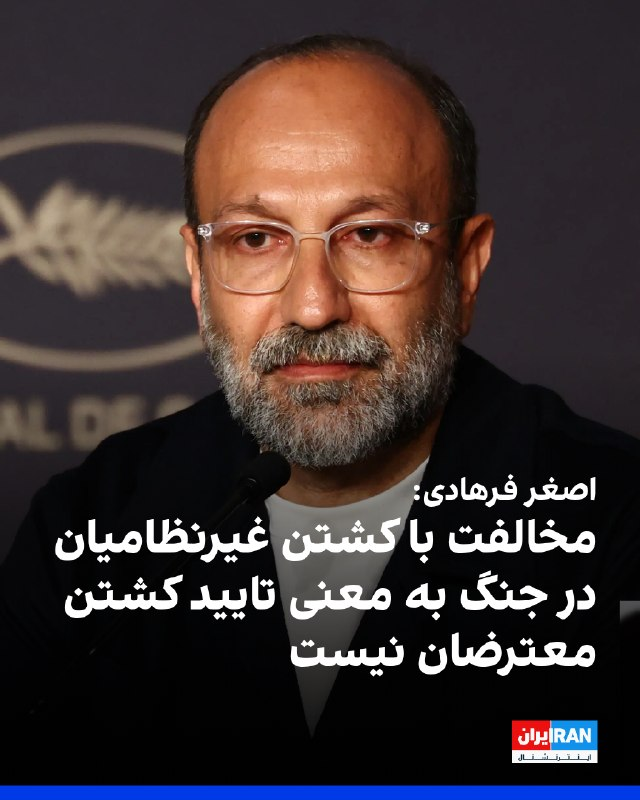

اصغر فرهادی در پاسخ به خبرنگار ایران‌اینترنشنال، کشته شدن معترضان «بی‌گناه» در جریان انقلاب ملی ایرانیان را محکوم کرد و گفت مخالفت با کشته شدن بی‌گناهان و غیرنظامیان در جنگ به معنی موافقت با کشته شدن معترضان نیست.

فرهادی در نشست خبری فیلم «داستان‌های موازی» در جشنواره کن گفت: «ماه‌های گذشته و اواخر دورانی که مشغول ساختن این فیلم بودم، دو اتفاق بسیار دردناک در کشورم رخ داد.»

این کارگردان ایرانی گفت: «هر دو بسیار دردناک است و هیچ‌گاه فراموش نخواهد شد. مخالفت با کشته شدن بی‌گناهان و غیرنظامیان به معنی موافقت با کشته شدن گروهی دیگر در خیابان‌ها نیست.»

فرهادی ادامه داد: «همدلی با کشته‌شدگان در خیابان‌ها نیز به معنی همدلی نکردن با کسانی که در جنگ کشته شدند نیست. به نظرم کشته شدن هر انسانی یک جنایت است؛ چه در جنگ، چه در اعدام و چه کشتن معترضان.»

او در پایان گفت بسیار دردناک است که در قرن حاضر با وجود این همه پیشرفت، همچنان شاهد کشته شدن انسان‌های بی‌گناه هستیم.
‌🏁 🇬🇧 IranintlTV

🤖 @VahidOOnLine

## VahidOOnLine — post 240281

  

امیر حاتمی، فرمانده‌ کل ارتش جمهوری اسلامی، گفت: «این قدرت ایمان است که می‌تواند دشمن را چنان دچار آشفتگی کند که حتی به‌اشتباه، هواپیماهای خودی را هدف قرار دهد.»

او گفت آنچه موجب اطمینان ما به پیروزی و توانمندی می‌شود، ایمان و اعتقاد است؛ ما هر سال در دهه محرم، شاهد یک مانور عظیم ایمانی هستیم. قدرت اصلی ما نیز همین قدرت ایمانی است.

او افزود: «این قدرت ایمانی است که می‌تواند یک جنگنده اف-۵ را به فراز مواضع نیروهای آمریکایی در کویت برساند، در حالی‌ که آن‌ها از پیشرفته‌ترین سامانه‌های پدافندی زمین‌پایه و هوایی برخوردارند.»
‌🏁 🇬🇧 IranintlTV

🤖 @VahidOOnLine

## VahidOOnLine — post 240280

  

♦️روزنامه نیویورک پست، روز جمعه در گزارشی اعلام کرد، دونالد ترامپ در جریان سفر دو روزه‌اش به پکن، برخلاف عادت همیشگی‌، تلفن همراه شخصی‌اش را همراه نداشت.
بر اساس این گزارش، رئیس‌جمهوری آمریکا و اعضای هیئت همراه، به دلایل امنیتی و برای مقابله با تهدیدهای سایبری، از استفاده از دستگاه‌های شخصی منع شدند و به‌جای آن از گوشی‌ها و حساب‌های موقت موسوم به «دستگاه‌های پاک» استفاده کردند؛ ابزارهایی با قابلیت‌های محدود که برای کاهش خطر نفوذ و سرقت اطلاعات طراحی شده‌اند.
به گزارش نیویورک پست، تلفن‌ها و وسایل شخصی حاضران در این سفر دو روزه در هواپیمای ویژه ریاست‌جمهوری «ایر فورس وان» و درون «کیف‌های فارادی» نگهداری می‌شدند. این کیف‌ها تمامی سیگنال‌ها از جمله جی‌پی‌اس، وای‌فای، بلوتوث و آر‌اف‌آی‌دی (RFID) را مسدود می‌کنند.
هواپیمای ایرفورس وان صرف‌نظر از اینکه در کجا مستقر باشد، قلمرو ایالات متحده محسوب می‌شود. این هواپیما که عملا به‌عنوان یک مرکز پروازی نگهداری اطلاعات فوق‌محرمانه (SCIF) عمل می‌کند، از روش‌های دیگری نیز برای محافظت از داده‌ها و اطلاعات استفاده می‌کند.
‌🇸🇦 Indypersian

🤖 @VahidOOnLine

## VahidOOnLine — post 240279

روایت شما از زندگی در آتش‌بس- جمعه ۲۵ اردیبهشت ۱۴۰۵

🔹 وقتی مردم اینترنت ندارند، کسب‌وکارها با اینترنت پرو خدمات خود را به چه کسی نشان دهند؟
🔹 من یه دختر ۲۳ ساله‌ام. هیچ آینده‌ای ندارم. همه‌چی صد برابر شده. از خیلی از چیزام زدم که فقط زنده بمونم. خیلیا شرایط سخت‌تری نسبت به من دارن. تکلیف ما چی میشه؟ هنوزم امیدوارم ولی تا کی؟ وقتی از قحطی مردیم میخوان وارد عمل بشن؟
🔹 از کرمانشاه پیام می‌دم. ما بچه‌های پایه‌ی هفتم تا دهم هنوز مشخص نیست که امتحان‌هامون حضوریه یا غیرحضوری. واقعاً این موضوع رو اعصابمونه. امیدوارم هرچی سریع‌تر اوضاع‌مون مشخص بشه.
🔹 این‌قدر کمبود دارو هست که حتی دارو با نسخه هم به صورت کامل داده نمی‌شه، چه برسه به صورت آزاد. از هر قرص یک بسته میدن.
🔹 یکی ما رو توجیه کنه ما مردم ایران هزینه چه چیزی رو داریم پرداخت می‌کنیم؟ برای چی داریم این همه فشار اقتصادی و نگرانی و چک کردن ته‌مانده حساب بانکی و قیمت طلا و دلار و کالاها رو تحمل می‌کنیم؟ نقش ما توی به‌وجود آمدن این مناقشه چی بوده؟ نابود شدیم
‌🏁 🇬🇧 IranintlTV

🤖 @VahidOOnLine

## VahidOOnLine — post 240278

  

هند در پایان نشست سالانه وزیران خارجه بریکس در دهلی‌نو، به جای انتشار بیانیه مشترک، «بیانیه رییس نشست» را منتشر کرد و اعلام کرد میان برخی اعضا درباره وضعیت خاورمیانه اختلاف‌نظر وجود دارد.

بر اساس گزارش رویترز، جمهوری اسلامی و امارات متحده عربی در جنگ تهران با آمریکا و اسرائیل در دو سوی مقابل قرار دارند؛ جنگی که در جریان آن، جمهوری اسلامی بیش از هر کشور دیگر حوزه خلیج فارس، امارات متحده عربی را هدف قرار داده است.
‌🏁 🇬🇧 IranintlTV

🤖 @VahidOOnLine

## VahidOOnLine — post 240277

روایت شما از زندگی در آتش‌بس- جمعه ۲۵ اردیبهشت ۱۴۰۵

🔹 بندرعباس، تمامی کالاها به شدت گران شده و در جایگاه‌های سوخت صف‌های کیلومتری هست. متأسفانه زندگی روزمره مردم مختل شده، شهری که قطب تجارت و صنعت و نفت و گاز است.
🔹 ساکن یکی از شهرهای نزدیک مشهد هستم. ما به هیچ ابرقدرتی نیاز نداریم و منتظر فراخوان شاه هستیم. پاینده ایران.
🔹 دانش‌آموز پایه دهم انسانی هستم. خوشبختانه امسال امتحان‌ها نهایی نیست، اما خیلی نگران سال آینده هستم، چون امسال ما هیچی یاد نگرفتیم و شرایط یادگیری افتضاح بوده. تو مدرسه غیردولتی هم درس می‌خوانم.
🔹 از مشهد پیام می‌دهم. واقعاً ما از این بلاتکلیفی خسته شدیم، گرونی بیداد می‌کند، دخل و خرج‌مان با هم همخوانی ندارد، باید ده نفر کار کنیم که یک نفر بتواند بخورد.
🔹 نیم‌قرن است که کل دنیا، مخصوصاً اروپا، فقط گفتند فلان کار جمهوری اسلامی را محکوم می‌کنیم و فایده‌ای نداشت. هر روز جمهوری اسلامی پُرروتر هم شد. نمی‌شود از یک دیوانه زنجیری توقع داشت با حرف آرام بگیرد.
‌🏁 🇬🇧 IranintlTV

🤖 @VahidOOnLine

## VahidOOnLine — post 240276

  <a href="telegram/content/VahidOOnLine_240276_1778839600.mp4" target="_blank">🎬 Download video</a>

یک شهروند در پیامی به ایران اینترنشنال به سایر شهروندان توصیه می‌کند که اینترنت حکومتی «پرو» را نخرند و آن ‌را خیانت به مردم ایران دانست. پیام او با هوش مصنوعی خوانده شده است.
‌🏁 🇬🇧 IranintlTV

🤖 @VahidOOnLine

## VahidOOnLine — post 240275

  

تجربیات شما از قطع برق و آب و افزایش قیمت قبض‌ها چیست؟ روی لینک زیر کلیک کنید و پیام‌های خود از طریق مدیا‌بات برای ما بفرستید. 
t.me
پیام‌های شما به صورت زیر‌نویس در تلویزیون و همچنین در بخش‌های مختلف‌ خبری منتشر خواهد شد.
‌🏁 🇬🇧 IranintlTV

🤖 @VahidOOnLine

## VahidOOnLine — post 240274

  <a href="telegram/content/VahidOOnLine_240274_1778839602.mp4" target="_blank">🎬 Download video</a>

نارندرا مودی، نخست‌وزیر هند، روز جمعه ۲۵ اردیبهشت در جریان سفر به ابوظبی، با انتشار پیامی در شبکه اجتماعی ایکس نوشت: «دوستی میان هند و امارات بسیار نیرومند است.»

مودی در این سفر با شیخ محمد بن زاید، رئیس امارات متحده عربی، دیدار کرد. محور گفتگوهای دو طرف، گسترش روابط دوجانبه، همکاری‌های انرژی، همکاری‌های دفاعی و تحولات منطقه‌ای اعلام شده است.

این سفر در شرایطی انجام می‌شود که تنش‌های منطقه‌ای و نگرانی‌ها درباره امنیت مسیرهای انرژی، اهمیت همکاری میان هند و امارات را افزایش داده است. امارات یکی از شرکای مهم هند در حوزه انرژی و تجارت به شمار می‌رود و ابوظبی و دهلی نو در سال‌های اخیر روابط اقتصادی و راهبردی خود را گسترش داده‌اند.
‌🏁 🇬🇧 ManotoTV

🤖 @VahidOOnLine

## VahidOOnLine — post 240273

  <a href="telegram/content/VahidOOnLine_240273_1778839602.mp4" target="_blank">🎬 Download video</a>

عباس عراقچی، وزیر خارجه جمهوری اسلامی، در گفتگو با رسانه دولتی هند گفت «هیچ راه‌حل نظامی‌ای وجود ندارد» و افزود ایالات متحده باید این واقعیت را درک کند.

او گفت آمریکا «دست‌کم دو بار» جمهوری اسلامی را آزموده و اکنون به این نتیجه رسیده است که «راه‌حل نظامی وجود ندارد».

عراقچی مهم‌ترین مشکل در روند کنونی را «پیام‌های متناقض» از سوی مقام‌های آمریکایی دانست و گفت این پیام‌ها از طریق اظهارنظرها، مصاحبه‌ها و مواضع مختلف دریافت می‌شود.
‌🏁 🇬🇧 ManotoTV

🤖 @VahidOOnLine

## VahidOOnLine — post 240272

  <a href="telegram/content/VahidOOnLine_240272_1778839603.mp4" target="_blank">🎬 Download video</a>

رسانه دولتی اسرائیل گزارش داد ایال زامیر، رئیس ستاد ارتش اسرائیل، در جریان جنگ با ایران به امارات متحده عربی سفر کرده است.
بر اساس این گزارش، او همراه با چند مقام نظامی اسرائیل با مقام‌های اماراتی، از جمله محمد بن زاید، رئیس امارات، دیدار کرده است. ارتش اسرائیل تاکنون واکنشی به این گزارش نشان نداده است.
این گزارش پس از آن منتشر می‌شود که بنیامین نتانیاهو نیز گفته بود در زمان جنگ به امارات سفر کرده؛ ادعایی که از سوی امارات رد شد. همچنین گزارش‌هایی درباره سفر رؤسای سازمان‌های اطلاعاتی و امنیتی اسرائیل به امارات در زمان جنگ منتشر شده است.
در همین حال، مقام‌های آمریکایی تأیید کرده‌اند اسرائیل یک سامانه پدافند موشکی را به همراه نیروهای نظامی برای راه‌اندازی آن به امارات منتقل کرده است.
‌🏁 🇬🇧 ManotoTV

🤖 @VahidOOnLine

## VahidOOnLine — post 240271

  

⭕️عراقچی: پیام‌های ضد و نقیض واشنگتن مانع اصلی در مسیر دیپلماسی است

♦️عباس عراقچی، وزیر امور خارجه ایران، روز جمعه ۲۵ اردیبهشت ماه، در پایان نشست وزرای خارجه بریکس در هند، در گفتگو با رسانه‌های این کشور گفت هیچ راهکار نظامی برای بحران خاورمیانه وجود ندارد و ایالات متحده باید بداند که از مسیر نظامی به اهداف خود نخواهد رسید.

عراقچی با اشاره به آمادگی تهران برای تعامل دیپلماتیک، «پیام‌های ضد و نقیض واشنگتن» را مانع اصلی این مسیر توصیف کرد: «ما تعامل را آغاز کرده‌ایم، اما موانع زیادی در این مسیر وجود دارد؛ که مهم‌ترین آن‌ها، پیام‌های ضد و نقیضی است که از سوی آمریکایی‌ها در گفتگوها و مصاحبه‌هایشان دریافت می‌کنیم.»

 وزیرامور خارجه جمهوری اسلامی همچنین گفت ایران شروع‌کننده جنگ نبوده و تنها در حال «دفاع مشروع« از خود است. او بار دیگر تاکید کرد تنگه هرمز برای «کشورهای دوست» بسته نیست و تنها برای «دشمنان» محدود شده است. عراقچی گفت: « کشتی‌های متعلق به سایر کشورها فقط باید عبور خود را با نیروهای نظامی ما هماهنگ کنند تا از هرگونه مانع احتمالی جلوگیری شده و عبوری ایمن داشته باشند. در روزهای گذشته نیز کشتی‌های زیادی با کمک نیروهای دریایی ما از تنگه عبور کرده‌اند و این روند ادامه خواهد داشت.»

عباس عراقچی در پایان، تنها راه تضمین قطعی امنیت دریانوردی برای همه طرف‌ها را پایان دادن به جنگ عنوان کرد.
‌🇸🇦 Indypersian

🤖 @VahidOOnLine

## VahidOOnLine — post 240270

  

هندوراس به‌طور رسمی سپاه پاسداران انقلاب اسلامی و حماس را در فهرست گروه‌های تروریستی قرار داد. وزارت خارجه هندوراس در بیانیه‌ای اعلام کرد این تصمیم در راستای موضع ثابت هندوراس در محکومیت تروریسم و تامین مالی آن «در تمامی اشکال و مظاهر» اتخاذ شده و نشان‌دهنده تعهد این کشور به همکاری‌های بین‌المللی برای پیشگیری و مقابله با تهدیدات تروریستی است.

گیدئون سعار، وزیر خارجه اسرائیل، با انتشار پیامی در ایکس، از دولت هندوراس بابت اقدام علیه سپاه و حماس تمجید کرد.

در این پیام آمده است: «این اقدام گام مهم دیگری برای تقویت جبهه جهانی مبارزه با تروریسم است؛ تروریسمی که امنیت سراسر جهان، از جمله آمریکای لاتین، را تهدید می‌کند.»
‌🏁 🇬🇧 IranintlTV

🤖 @VahidOOnLine

## VahidOOnLine — post 240269

  

عباس عراقچی، وزیر خارجه جمهوری اسلامی، در مصاحبه با صداوسیما در حاشیه اجلاس بریکس در هند گفت: «جنگ به نقطه عطفی در منطقه تبدیل شده و جایگاه ایران را ارتقا داده است.»

به گفته او، جمهوری اسلامی در جریان درگیری‌های اخیر، «اهداف آمریکایی» را در خاک امارات متحده عربی هدف قرار داد.
‌🏁 🇬🇧 IranintlTV

🤖 @VahidOOnLine

## VahidOOnLine — post 240268

  

♦️ولادیمیر پوتین، رئیس‌جمهوری روسیه، قرار است هفته آینده و فقط چند روز پس از نشست تاریخی شی جین‌پینگ و دونالد ترامپ در پکن، به چین سفر کند.
بر اساس گزارش روزنامه «ساوت چاینا مورنینگ پست»، این سفر «یک روزه» احتمالا روز ۲۰ مه (۳۰ اردیبهشت) انجام خواهد شد.
کرملین پیش‌تر اعلام کرده بود که سفر پوتین به چین «در آینده‌ای بسیار نزدیک» انجام خواهد شد و مقدمات آن نهایی شده است.
زمان‌بندی این سفر در شرایطی مورد توجه قرار گرفته که پکن همزمان در حال مدیریت روابط خود با واشنگتن و مسکو است. دیدار اخیر شی و ترامپ بر موضوعاتی از جمله جنگ ایران، تجارت و مسائل ژئوپلیتیک متمرکز بود و سفر قریب‌الوقوع پوتین می‌تواند نشانه‌ای از ادامه هماهنگی نزدیک میان روسیه و چین تلقی شود.
‌🇸🇦 Indypersian

🤖 @VahidOOnLine

## VahidOOnLine — post 240267

  

نت‌بلاکس خبر داد که قطعی اینترنت در ایران از هزار و ۸۲۴ ساعت گذشته و وارد هفتادوهفتمین روز شده است.
نت‌بلاکس نوشت: در پی تداوم قطع اینترنت در ایران، بخش زیادی از مردم از ارتباطات آنلاین و تعامل با جهان خارج محروم شده‌اند و نگرانی‌ها درباره پیامدهای روانی افزایش یافته است.
‌🏁 🇬🇧 IranintlTV

🤖 @VahidOOnLine

## VahidOOnLine — post 240266

⭕️لاوروف در نشست بریکس: ایران عامل انسداد تنگه هرمز نیست، می‌خواهند بین تهران و همسایگانش تفرقه ایجاد کنند

♦️سرگئی لاوروف، وزیر امور خارجه روسیه، روز جمعه ۲۵ اردیبهشت  با انتقاد از رویکرد «غرب» در خلیج فارس، گفت: «ریشه اصلی تنش‌های منطقه تجاوز بی‌دلیل آمریکا و اسرائیل علیه ایران» است.

سرگئی لاوروف که برای شرکت در نشست وزاری امور خارجه کشورهای عضو بریکس در دهلی نو حضور دارد گفت: «تا پیش از آغاز جنگ در اسفند ماه گذشته، امنیت دریانوردی در تنگه هرمز به صورت ۱۰۰ درصدی تضمین شده بود و ایران هرگز عامل ایجاد مشکل در این آبراه نبوده است.»

براساس گزارش‌های غیررسمی، روسیه در جریان جنگ و پیش از آتش‌بس به جمهوری اسلامی کمک‌های اطلاعاتی ارائه می‌داده است. روابط نظامی و امنیتی تهران و مسکو از زمان جنگ اوکراین دوچندان شده است.

 لاروف بار دیگر گفت یکی از اهداف آمریکا و اسرائیل در جنگ با جمهوری اسلامی «ایجاد تفرقه میان ایران و همسایگان عربش» است و با اشاره به تلاش‌های دیپلماتیک جاری، از نقش پاکستان در تسهیل گفتگو میان ایران و آمریکا و همچنین پتانسیل هند به عنوان میانجی برای بهبود روابط ایران و کشورهای عربی به دلیل اعتبار و نفوذ دیپلماتیک دهلی‌نو حمایت کرد.
‌🇸🇦 Indypersian

🤖 @VahidOOnLine

## VahidOOnLine — post 240265

  <a href="telegram/content/VahidOOnLine_240265_1778839606.mp4" target="_blank">🎬 Download video</a>

یکی از مخاطبان ایران‌اینترنشنال که دانش‌آموز پایه دهم انسانی است می‌گوید با وجود نهایی نبودن امتحان‌های امسال، نگران سال آینده است، چون به گفته او کیفیت آموزش و شرایط یادگیری در سال جاری «افتضاح» بوده و دانش‌آموزان عملا چیزی یاد نگرفته‌اند. او می‌گوید در مدرسه غیردولتی تحصیل می‌کند.
این پیام با هوش مصنوعی خوانده شده است.
‌🏁 🇬🇧 IranintlTV

🤖 @VahidOOnLine

## VahidOOnLine — post 240264

  <a href="telegram/content/VahidOOnLine_240264_1778839608.mp4" target="_blank">🎬 Download video</a>

دفتر رسانه‌ای دولت ابوظبی روز جمعه ۲۵ اردیبهشت اعلام کرد امارات متحده عربی ساخت یک خط لوله نفتی تازه را برای افزایش صادرات از مسیر فجیره تسریع می‌کند.

این پروژه قرار است تا سال ۲۰۲۷ ظرفیت صادرات نفت امارات از فجیره را دو برابر کند و توان این کشور برای دور زدن تنگه هرمز را افزایش دهد.

فجیره در ساحل دریای عمان قرار دارد و نفتکش‌ها از این مسیر می‌توانند بدون عبور از تنگه هرمز بارگیری کنند.
‌🏁 🇬🇧 ManotoTV

🤖 @VahidOOnLine

## VahidOOnLine — post 240263

  <a href="telegram/content/VahidOOnLine_240263_1778839608.mp4" target="_blank">🎬 Download video</a>

گروه ناظر اینترنتی نت‌بلاکس اعلام کرد قطعی اینترنت در ایران امروز وارد هفتادوهفتمین روز خود شده و از مرز ۱۸۲۴ ساعت گذشته است.
نت‌بلاکس هشدار داده ادامه این محدودیت‌ها می‌تواند به یک خطر فزاینده برای سلامت روان شهروندان تبدیل شود؛ شهروندانی که تا حد زیادی از پلتفرم‌های آنلاین، ارتباطات و تعامل عادی با جهان خارج محروم شده‌اند.
‌🏁 🇬🇧 ManotoTV

🤖 @VahidOOnLine

## WithYashar — post 11275

## WithYashar — post 11274

خبرنگار الجزیره:
تهران به‌طور رسمی پاسخ واشنگتن به پیشنهاد خود را دریافت کرده و ایالات متحده تمامی شروط ایران رو رد کرده.
@withyashar

## WithYashar — post 11273

😂😂🙌🏾 @withyashar

## WithYashar — post 11272

ترامپ در تروث : پژوهشگر چینی به CNN گفت که به نشست ترامپ و شی نمره «۹.۹۹ از ۱۰» می‌دهد.
@withyashar

## WithYashar — post 11271

  

محمد قنطاری، کاردار جدید سوریه در واشنگتن دی سی😬🍔
@withyashar

## WithYashar — post 11270

@withyashar part3

## WithYashar — post 11269

  

😂😂🙌🏾 @withyashar

## WithYashar — post 11268

هم‌اکنون حمله سنگین جمهوری اسلامی به مقر گروه های مخالف در عراق
@withyashar

## WithYashar — post 11267

طبق گزارش روزنامه «ساوت چاینا مورنینگ پست» و بازنشر آن توسط «بلومبرگ»، انتظار می‌رود «ولادیمیر پوتین» در حدود ۲۰ مه به «پکن» سفر کند؛ تنها حدود ۵ روز پس از دیدار «شی جین‌پینگ» و «دونالد ترامپ» در پکن.

رسانه‌ها می‌گویند این سفر احتمالاً فقط یک روز طول می‌کشد و بیشتر در قالب یک دیدار کاری و هماهنگی سیاسی انجام می‌شود. همچنین برخلاف سفر ترامپ، ظاهراً خبری از تشریفات بزرگ، رژه رسمی یا استقبال بسیار گسترده نخواهد بود و این سفر در سطحی ساده‌تر و کم‌نمایش‌تر برگزار می‌شود
@withyashar

## WithYashar — post 11266

@withyashar part2

## WithYashar — post 11265

ترامپ در تروث : «وقتی رئیس‌جمهور شی با بیانی بسیار سنجیده از ایالات متحده به‌عنوان کشوری که شاید در حال افول باشد یاد کرد، منظور او آسیب عظیمی بود که ما در چهار سال دوران جو بایدنِ خواب‌آلود و دولت بایدن متحمل شدیم؛ و در این مورد، او صددرصد درست می‌گفت. کشور…

## WithYashar — post 11264

@withyashar part1

## WithYashar — post 11263

  <a href="telegram/content/WithYashar_11263_1778839610.mp4" target="_blank">🎬 Download video</a>

@withyashar منتظر ری اکشننن

## WithYashar — post 11262

نظرت چیه؟قبل جام جهانی میزنع یا بعد؟

## WithYashar — post 11261

کانال 13 اسرائیل:اسرائیل انتظار دارد حمله احتمالی آمریکا در ایران از فردا با بازگشت ترامپ از چین آغاز شود
@withyashar

## WithYashar — post 11260

  <a href="telegram/content/WithYashar_11260_1778839611.mp4" target="_blank">🎬 Download video</a>

پایان سفر ترامپ به چین

دونالد ترامپ، رئیس جمهور آمریکا، پکن را ترک کرد و سفر خود به جمهوری خلق چین را به پایان رساند.

شی جین‌پینگ، رئیس‌جمهور چین در آخرین روز سفر رئیس جمهور ایالات متحده گفت که دونالد ترامپ به دنبال بازگرداندن عظمت آمریکا است و او نیز متعهد به هدایت مردم چین برای تحقق رستاخیز ملی است.

شی جین‌پینگ همچنین تأکید کرده است که چین و آمریکا می‌توانند از طریق تقویت همکاری‌ها، روند توسعه و پیشرفت خود را تسریع کنند.
@withyashar

## WithYashar — post 11259

  <a href="telegram/content/WithYashar_11259_1778839612.mp4" target="_blank">🎬 Download video</a>

ترامپ: امیدوارم ایران تماشا کند. ما دقیقاً می‌دانیم چه چیزی را آماده کرده‌اند. می‌دانید، آن‌ها کمی استراحت داشتند، بنابراین سعی دارند چند چیز را با هم جمع کنند. آن‌ها موشک‌هایی را از زیر زمین بیرون آورده‌اند. همه این‌ها در یک روز از بین خواهند رفت. امیدوارم این رو ببینند چون همه کارهایی که در چهار هفته گذشته انجام داده‌اند، در یک روز از بین خواهد رفت.
@withyashar
یاشار:خوب دیگه رسمأ داره میگه جنگ میشه و هم داره میگه حمله خیلی سریع و محکم انجام میشه همانطور که گفتیم

## WithYashar — post 11258

آمریکا پیشنهاد ۱۴ ماده‌ای ایران را رد کرد

طبق اطلاعات رسیده به تهران تایمز، دولت آمریکا پاسخ پیشنهاد مکتوب ایران درباره پایان جنگ را داده است.

گفتنی است ایران پیشنهاد خود را مبتنی بر مذاکرات دو مرحله ای ارائه کرده بود که در مرحله اول منجر به پایان جنگ در همه جبهه ها شده و در صورت تحقق شروط ایران، مرحله دوم مذاکرات که درباره موضوع هسته ای بود، آغاز می شد
@withyashar

## WithYashar — post 11257

مجلس نمایندگان آمریکا برای سومین بار طرح دموکرات‌ها جهت محدود کردن اختیارات نظامی ترامپ علیه جمهوری اسلامی رو رد کرد.

این طرح با نتیجه ۲۱۲ در برابر ۲۱۲ به تساوی رسید و در نهایت با اختلاف یک رای شکست خورد.
@withyashar

## WithYashar — post 11256

ترامپ، به شبکه فاکس نیوز: مذاکره با ایران درباره کنار گذاشتن غبار هسته‌ای به دلیل تضاد در تصمیمات ایران، رفت و برگشت دارد تأسیسات هسته‌ای ایران تحت نظارت مداوم ۹ دوربین، ۲۴ ساعته قرار دارند. هرگونه تحرک ایرانی در داخل تأسیسات هسته‌ای با واکنش مستقیم نظامی…

## mwarmonitor — post 9112

🔴 ارتش اسرائیل (IDF) حملات خود را علیه زیرساخت‌های حزب‌الله در داخل و اطراف شهر صور در جنوب لبنان آغاز کرده است.

🔹در پی به‌صدا درآمدن آژیرها در اوایل امروز در شمال اسرائیل، تعدادی پهپاد انفجاری در داخل خاک اسرائیل و در نزدیکی مرز اسرائیل–لبنان سقوط کردند. گزارشی از تلفات یا مجروحان اعلام نشده است.

@mwarmonitor

## mwarmonitor — post 9111

  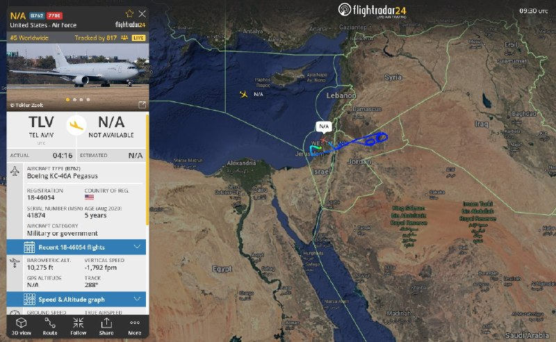

✈️🚨وضعیت اضطراری تانکر در حین پرواز

✈️یکی از تانکرهای KC-46A «پگاسوس» که از فرودگاه بن‌گوریون تل‌آویو (LLBG) برخاسته، وضعیت اضطراری در حین پرواز اعلام کرده و کد ۷۷۰۰ را مخابره می‌کند. تانکرهای KC-46 مستقر در این پایگاه معمولاً با علائم فراخوان «YETI» پرواز می‌کنند.

KC-46A «YETI??» 18-46054 AE5FA1

@mwarmonitor

## mwarmonitor — post 9110

  <a href="telegram/content/mwarmonitor_9110_1778839614.mp4" target="_blank">🎬 Download video</a>

📝 کارشناسان دوزاری و جیره‌خوار صداوسیما طوری از «دستان خالی» ترامپ در پکن قرقره می‌کنند که انگار دیپلماسی یعنی همان وحشی‌گری فرقه رذل شما در نیویورک که برای جابه‌جایی خریدهای حقیرانه‌تان باید کاروان کامیون راه می‌انداختید! بله، از نظر این اراذل گشنه‌چشم، توافق برای رفاه و اقتصاد مردم یعنی ضعف، اما غارت فروشگاه‌های یانکی‌ها و پر کردن خندق بلا با سوغاتی یعنی اقتدار!

🔸ترامپ دست‌خالی برگشت چون مثل شما گدای برند نبود که هواپیما را تبدیل به وانتبار کند؛ اما شما که وسط جفتک‌اندازی‌های رسانه‌ای از «موضع قدرت» نطق می‌کنید، یادتان رفته که لاشه متعفن رهبرتان، با آن همه ادعای پوشالی، فعلاً در یخچال بستنی میهن در حال تجزیه شدن است؟ تفاوت در همین اوج ذلت است: یکی برای رفاه مردمش توافق می‌کند و دیگری آن‌قدر ذلیل و حقیر است که حتی جنازه‌اش هم بین بستنی عروسکی و فالوده، با خفت تمام در حال متلاشی شدن است تا ثابت کند کل هیمنه این فرقه، به اندازه یک فریزر لبنیاتی هم دوام ندارد!

@mwarmonitor

## mwarmonitor — post 9109

🔴ابراهیم عزیزی، رییس کمیسیون امنیت ملی مجلس، از تدوین طرحی با عنوان «اقدام متقابل نیروهای نظامی و امنیتی جمهوری اسلامی» خبر داد که در آن پرداخت پاداش ۵۰ میلیون یورویی برای کشتن دونالد ترامپ، رییس‌جمهوری آمریکا، پیش‌بینی شده است.

📝ترامپ در راه بازگشت از چین، در حالی که طعم قدرت مطلق زیر زبانش است، با دیدن این طرحِ مضحکِ ۵۰ میلیون یورویی، فقط یک پوزخند به ریشِ کلِ این نظامِ مفلوک می‌زند. او می‌داند این زوزه‌های مجلس، ناله از سرِ وحشتِ موجوداتی است که حس می‌کنند طنابِ دارِ تاریخ دور گردن‌شان سفت شده است.

🔸​آن «بچه شیعه‌های رافضی» و مزدورانِ دوزاری که با مغزهای شست‌وشو داده شده، به طمعِ پاداشی که حتی سیستم بانکیِ داغانِ خودشان هم توانِ جابه‌جایی‌اش را ندارد، خوابِ «رسالت دینی» می‌بینند، نمی‌دانند که ترامپِ عصبانی، نقشه‌ی آخرت‌شان را خیلی وقت است کشیده. او برمی‌گردد تا نه فقط این طرح‌های کاغذی، بلکه کلِ بساطِ این سیرکِ ولایی را به توالتِ تاریخ بسپارد. برای این پادوهای بی‌مغز، بهشت و حوری در کار نیست؛ ترامپ چنان جهنمی روی زمین برایشان می‌سازد که پودر شدن توسط پهپادهای سنتکام، در برابرش مثل یک نوازشِ لطیف باشد. او می‌آید تا با یک حرکت، کلِ این لجن‌زار و مزدورانِ پست‌فطرتش را چنان به گُه بکشد که حتی نامی از این «اقدام متقابل» مضحک در تاریخ باقی نماند.

@mwarmonitor

## mwarmonitor — post 9108

علی هاشم خبرنگار الجزیره:

🇮🇷«یک منبع آگاه ایرانی به من گفته است که تهران به‌طور رسمی پاسخ آمریکا به پیشنهاد ایران را دریافت کرده و واشنگتن تمامی شروط ایران را به‌طور کامل رد کرده است.

🔸تیم مذاکره‌کننده ایران پنج شرط را برای ورود به گفت‌وگو درباره پرونده هسته‌ای مطرح کرده بود:

1. پایان دادن به جنگ در همه جبهه‌ها

2. لغو کامل تمامی تحریم‌ها

3. آزادسازی دارایی‌های مسدودشده

4. جبران خسارات و تلفات ناشی از جنگ

5. به‌رسمیت شناختن حق حاکمیت ایران بر تنگه هرمز»

@mwarmonitor

## mwarmonitor — post 9107

  <a href="telegram/content/mwarmonitor_9107_1778839616.mp4" target="_blank">🎬 Download video</a>

🔴«جزیره خارک به سقف ظرفیت ذخیره‌سازی خود نرسیده است. اگر چنین بود، نزدیک‌ترین نفتکش‌های در دسترس را به‌کار می‌گرفتند و آن‌ها را کاملاً بارگیری می‌کردند. در عوض، تولید نفت کاهش یافته تا با افت بارگیری نفتکش‌ها هم‌خوان شود. همچنان تعداد زیادی نفتکش وجود دارد که می‌توان آن‌ها را بارگیری کرد.» TANKER TRACKER

@mwarmonitor

## mwarmonitor — post 9106

  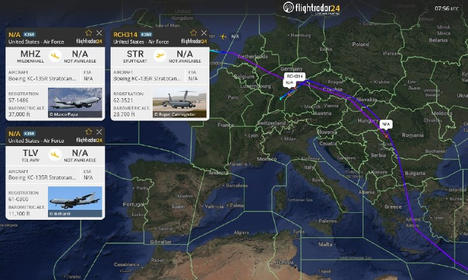

✈️🇺🇸نیروی هوایی ایالات متحده|جابجایی تانکرها ادامه دارد

✈️همان‌طور که در بیشتر روزهای آتش‌بس دیده شده، ناوگان تانکرهای هوایی ایالات متحده (با بیش از ۲۲۰ فروند هواپیما) در سراسر اروپا و حوزه سنتکام همچنان در حال جابجایی است؛ به‌طوری‌که هواپیماهایی که فشار کاری بیشتری داشته‌اند، به‌تدریج خارج و با نمونه‌های دیگر جایگزین می‌شوند. تا این لحظه امروز:

KC-135R «RCH736» 57-1486 AE041D (از EGUN به LLBG)
KC-135R «؟» 61-0300 AE0689 (از LLBG به EDDS)
KC-135R «RCH314» 62-3521 AE0485 (از LFOA به EDDS و سپس نامشخص)
KC-135T «RCH559» 59-1471 AE07A5 (از CONUS به EDDS)

@mwarmonitor

## mwarmonitor — post 9105

  <a href="telegram/content/mwarmonitor_9105_1778839619.mp4" target="_blank">🎬 Download video</a>

✈️«اکنون: رئیس‌جمهور ترامپ با هواپیمای ایرفورس وان چین را ترک کرد و به نشست دو روزه خود با رئیس‌جمهور چین، شی جین‌پینگ، پایان داد.

🔹پیش از پرواز بازگشت به ایالات متحده، مراسمی کوتاه در باند فرودگاه برگزار شد.

🇺🇸🇨🇳ترامپ پس از این دیدارها از «توافق‌های تجاری فوق‌العاده» سخن گفت و اعلام کرد که دو رهبر درباره ایران هم‌نظر هستند.»

@mwarmonitor

## FoxNewsTwitter — post 341768

  <a href="telegram/content/FoxNewsTwitter_341768_1778839620.mp4" target="_blank">🎬 Download video</a>

Fox News (Twitter/X)

NOW: President Trump departed China aboard Air Force One, wrapping up his two-day summit with Chinese President Xi Jinping.

A brief ceremony was held on the tarmac before his return flight to the U.S.

Trump touted “fantastic trade deals” following his meetings and said the two leaders were aligned on Iran.

## FoxNewsTwitter — post 341767

  <a href="telegram/content/FoxNewsTwitter_341767_1778839621.mp4" target="_blank">🎬 Download video</a>

Fox News (Twitter/X)

NOW: President Trump gives a fist pump as he departs China after a series of crucial meetings with President Xi Jinping on the Iran war, trade tensions, technology, and Taiwan.

Ahead of his departure, Trump met with Xi and expressed optimism about hosting him in the U.S. this September.

“You're going to walk away hopefully very impressed, like I'm very impressed with China."

## FoxNewsTwitter — post 341766

  <a href="telegram/content/FoxNewsTwitter_341766_1778839623.mp4" target="_blank">🎬 Download video</a>

Fox News (Twitter/X)

NOW: President Trump exits the Beast to fanfare and pumps his fist during a departure ceremony at Beijing Capital International Airport.

Ahead of his departure, Trump met with Chinese President Xi Jinping and expressed optimism about hosting him in the U.S. this September.

“You're going to walk away hopefully very impressed, like I'm very impressed with China."

## FoxNewsTwitter — post 341765

  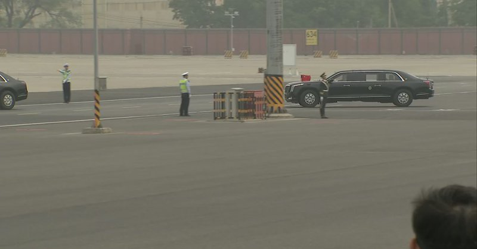

Fox News (Twitter/X)

WATCH LIVE: President Trump departs Beijing after summit with President Xi https://twitter.com/i/broadcasts/1XxygmDlakEGM

## FoxNewsTwitter — post 341764

  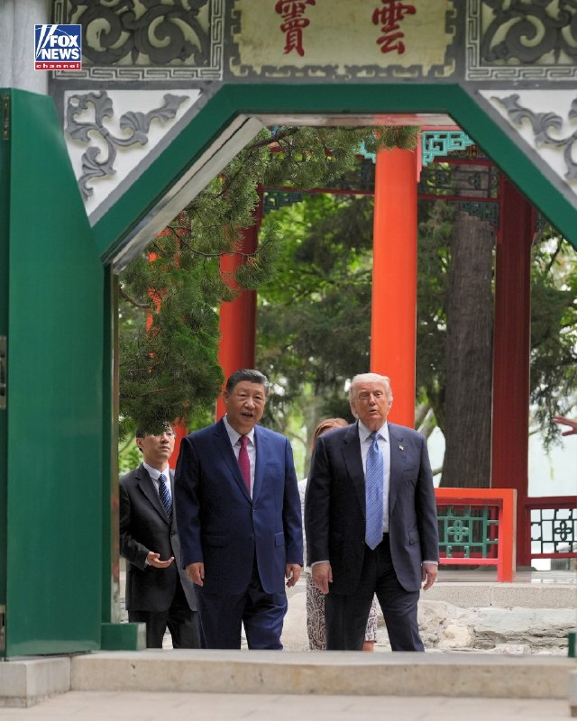

Fox News (Twitter/X)

President Trump took a stroll through Zhongnanhai Garden, part of a powerful Chinese government complex, with President Xi Jinping on his second day of meetings in Beijing.

## FoxNewsTwitter — post 341763

  <a href="telegram/content/FoxNewsTwitter_341763_1778839625.mp4" target="_blank">🎬 Download video</a>

Fox News (Twitter/X)

NOW: President Trump tours Zhongnanhai Garden with Chinese President Xi Jinping.

## FoxNewsTwitter — post 341762

  <a href="telegram/content/FoxNewsTwitter_341762_1778839627.mp4" target="_blank">🎬 Download video</a>

Fox News (Twitter/X)

NOW: President Trump says he and Chinese President Xi "feel very similar on Iran."

"We want that to end. We don't want them to have a nuclear weapon. We want the straits open."

## FoxNewsTwitter — post 341761

  <a href="telegram/content/FoxNewsTwitter_341761_1778839629.mp4" target="_blank">🎬 Download video</a>

Fox News (Twitter/X)

NOW: President Trump says he and Chinese President Xi agree they do not want Iran to obtain a nuclear weapon and want the Strait of Hormuz to remain open.

## FoxNewsTwitter — post 341760

  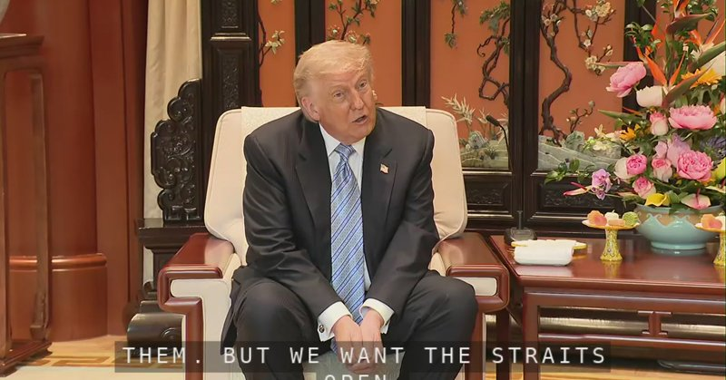

Fox News (Twitter/X)

MOMENTS AGO: President Trump meets with President Xi Jinping in China https://twitter.com/i/broadcasts/1RJjpznjbDVKw

## FoxNewsTwitter — post 341759

  <a href="telegram/content/FoxNewsTwitter_341759_1778839631.mp4" target="_blank">🎬 Download video</a>

Fox News (Twitter/X)

NOW: President Trump arrives at Zhongnanhai Garden to meet with Chinese President Xi.

## FoxNewsTwitter — post 341758

  <a href="telegram/content/FoxNewsTwitter_341758_1778839632.mp4" target="_blank">🎬 Download video</a>

Fox News (Twitter/X)

President Trump says he came up with a nickname, "Dumocrats," after talking about top Democratic leader Hakeem Jeffries. || @seanhannity

## pm_afshaa — post 90770

  <a href="telegram/content/pm_afshaa_90770_1778839634.webm" target="_blank">🎬 Download video</a>

🔴وای‌نت: اسرائیل خودش رو برای احتمال ازسرگیری اقدام نظامی آمریکا علیه جمهوری اسلامی آماده می‌کنه و رهبران سیاسی به ارتش دستور دادن آمادگی‌های لازم رو در نظر بگیرن.

💧 Rainbet.com the #1 Non-KYC Crypto Casino & Sportsbook @rainbetcom

😁 @Pm_Afshaa

## pm_afshaa — post 90769

  <a href="telegram/content/pm_afshaa_90769_1778839634.webm" target="_blank">🎬 Download video</a>

🔴خبرنگار الجزیره:
تهران به‌طور رسمی پاسخ واشنگتن به پیشنهاد خود را دریافت کرده و ایالات متحده تمامی شروط ایران رو رد کرده.

💧 Rainbet.com the #1 Non-KYC Crypto Casino & Sportsbook @rainbetcom

😁 @Pm_Afshaa

## pm_afshaa — post 90768

🔴ترامپ به فاکس‌ نیوز : من از الان دیگه آدم صبوری نیستم و صبر بیشتری به ایران نشان نخواهم داد

💧 Rainbet.com the #1 Non-KYC Crypto Casino & Sportsbook @rainbetcom

😁 @Pm_Afshaa

## pm_afshaa — post 90767

  <a href="telegram/content/pm_afshaa_90767_1778839635.mp4" target="_blank">🎬 Download video</a>

ترامپ رفت به شهر ممنوعه چین جایی که رهبرای خیلی کمی تو دنیا به اونجا رفتن و هر کسی رو راه نمیدن اونجا

💧 Rainbet.com the #1 Non-KYC Crypto Casino & Sportsbook @rainbetcom

😁 @Pm_Afshaa

## pm_afshaa — post 90766

🔴کانال 13 اسرائیل:اسرائیل انتظار دارد حمله احتمالی آمریکا در ایران از فردا با بازگشت ترامپ از چین آغاز شود

💧 Rainbet.com the #1 Non-KYC Crypto Casino & Sportsbook @rainbetcom

😁 @Pm_Afshaa

## pm_afshaa — post 90765

🔴ترامپ به فاکس نیوز:امیدوارم ایران در حال تماشا باشد. ما دقیقاً می‌دانیم چه چیزی را به نمایش گذاشته‌اند.

می‌دانید، آنها کمی استراحت داشتند، بنابراین سعی می‌کنند چند چیز را جمع کنند. آنها چند موشک را از زیر زمین برداشته‌اند. همه آن‌ها در یک روز از بین خواهد رفت.

هر کاری که در چهار هفته گذشته انجام داده‌اند، در یک روز از بین خواهد رفت

💧 Rainbet.com the #1 Non-KYC Crypto Casino & Sportsbook @rainbetcom

😁 @Pm_Afshaa

## pm_afshaa — post 90764

🔴توییت جدید ترامپ:جنگ با ایران ادامه خواهد داشت

💧 Rainbet.com the #1 Non-KYC Crypto Casino & Sportsbook @rainbetcom

😁 @Pm_Afshaa

## DEJradio — post 4647

  <a href="telegram/content/DEJradio_4647_1778839636.mp4" target="_blank">🎬 Download video</a>

🔺🎥 فاجعه زیست‌محیطی در جزیره مارو؛ مرگ گونه‌های مختلف جانوری در اثر آلودگی نفتی

#جزیره_مارو #آلودگی_نفتی
@DEJradio

## DEJradio — post 4644

  <a href="telegram/content/DEJradio_4644_1778839638.webm" target="_blank">🎬 Download video</a>

🔺📷 پیام یک شهروند:

با این گرونی‌ها تن ماهی خریدم داخلش مگس بود!

یک شهروند با ارسال تصاویری نوشت: "
سلام، توی این وضعیت با این قیمت‌ها،
تن ماهی گرفتیم دونه‌ای ۱۹۵ تومن وجه رایج مملکت،
داخلش مگس بوده با شرکت‌شون چندین مرتبه تماس گرفتیم هیچ‌کس حتی جواب تلفنو نمیده ما اول ریختیم داخل بشقاب بعد متوجه مگس کنسرو شده شدیم!!
مجدد برگردوندیم داخل قوطی و بشقابو با اسید شستیم
زنگ زدم به خظ مشریان شبنم حتی جواب هم ندادن
از سازمان بهداشت هم که عملا نباید توقع داشت."

#تورم #سازمان_بهداشت
@DEJradio

## DEJradio — post 4643

  <a href="telegram/content/DEJradio_4643_1778839639.webm" target="_blank">🎬 Download video</a>

🚨
🔸 چرا برخی از جریان‌های چپ ایرانی با جریان ملی همراه نیست؟

*پژمان گلچین، پژوهشگر فلسفه

#چپ #جریان_ملی
@DEJradio

## DEJradio — post 4642

  <a href="telegram/content/DEJradio_4642_1778839639.webm" target="_blank">🎬 Download video</a>

🔺📷 تفنگداران آمریکایی راپل از هلی‌کوپتر روی عرشه ناو «یو‌ا‍س‌اس تریبپولی» را تمرین کردند

تفنگداران دریایی ایالات متحده از یگان ۳۱ تفنگداران دریایی، تمرین فرود روی عرشه کشتی کردند. براساس گزارش سنتکام این نیروها از یک بالگرد MH-60S Sea Hawk روی عرشه ناو «یو‌ا‍س‌اس تریبپولی» تمرین راپل کردند.
تریپولی یکی از بیش از ۲۰ ناو جنگی است که از محاصره ایالات متحده علیه ایران پشتیبانی می‌کند. از زمان آغاز این محاصره، نیروهای سنتکام ۷۲ کشتی تجاری را تغییر مسیر داده و ۴ کشتی را از کار انداخته‌اند.

#جنگ #محاصره_دریایی
@DEJradio

## DEJradio — post 4641

  <a href="telegram/content/DEJradio_4641_1778839640.mp4" target="_blank">🎬 Download video</a>

🚨📢 "چیزی برای خوردن نداریم، فرزندان ما گرسنه‌اند

پیام شهروندان به مقامات حکومت: "چیزی برای خوردن نداریم، فرزندان ما گرسنه‌اند"

#تورم #ایران
@DEJradio

## DEJradio — post 4640

  <a href="telegram/content/DEJradio_4640_1778839641.webm" target="_blank">🎬 Download video</a>

🔺🎤 تهدید هسته‌ای تهران و هشدارهای ترامپ

گفت‌وگو با شایان سمیعی، کارشناس امنیت ملی

#ترامپ #تهران
@DEJradio

## DEJradio — post 4639

  <a href="telegram/content/DEJradio_4639_1778839642.webm" target="_blank">🎬 Download video</a>

🔺📌 با تخریب گسترده کلانتری‌ها و مقرهای نیروی انتظامی در جنگ ۴۰ روزه، ماموران با مشکل «مکان» مواجه‌اند. راه‌حل‌ موقت استقرار کانکس‌ و استقرار در مینی‌بوس و اتوبوس و افزایش ماموریت‌های گشتی گوشه و کنار شهرها بود اما روزنامه «اعتماد» به نقل از یک منبع آگاه در دانشگاه تربیت مدرس گزارش داد که نیروهای انتظامی برای دومین بار طی سه هفته اخیر وارد پردیس بابایی، محل استقرار پارک علم و فناوری این دانشگاه، شده و خواستار تخلیه و واگذاری این زمین ۶۰ هکتاری به نیروی انتظامی شده‌اند.

بر اساس این گزارش، ماموران بدون ارائه مجوز قضایی وارد محوطه شده و اقدام به استقرار کانکس و تجهیزات در بخشی از پردیس کرده‌اند؛ اقدامی که به تنش میان نیروهای حاضر و کارکنان دانشگاه انجامیده است.

پیش‌تر روابط عمومی دانشگاه تربیت مدرس نیز اعلام کرده بود که شامگاه پنجم اردیبهشت، افرادی ناشناس وارد پردیس بابایی شده و با برپایی چادر در محوطه مستقر شده‌اند. دانشگاه گفته بود که از طریق مراجع قانونی در حال پیگیری موضوع است.

پردیس بابایی پارک علم و فناوری دانشگاه تربیت مدرس در شمال بزرگراه شهید بابایی قرار دارد و میزبان ۱۶ شرکت دانش‌بنیان در حوزه‌هایی از جمله تجهیزات پزشکی، صنایع دارویی، انرژی‌های پاک، فناوری زیستی، کشاورزی و تصفیه آب است.

منبع آگاه مورد استناد روزنامه اعتماد، اقدام نیروهای انتظامی را بخشی از تلاش برای تغییر کاربری این مجموعه علمی و واگذاری آن به نهادهای امنیتی و انتظامی توصیف کرده است.

#نیروی_انتظامی #جنگ۴۰روزه
@DEJradio

## DEJradio — post 4638

  <a href="telegram/content/DEJradio_4638_1778839642.webm" target="_blank">🎬 Download video</a>

🔺📢 دونالد ترامپ رئیس‌جمهوری آمریکا درباره «توافق» با جمهوری اسلامی، به شبکه فاکس‌نیوز، گفت: «من دیگر خیلی بیشتر صبر نخواهم کرد.» او افزود: «آن‌ها باید توافق کنند.»

او بار دیگر از عملیات نظامی علیه جمهوری اسلامی دفاع کرد و گفت حکومت ایران بخش عمده توان نظامی خود را از دست داده و واشنگتن در صورت لزوم می‌تواند باقی‌مانده زیرساخت‌های نظامی تهران را نیز به سرعت نابود کند.

ترامپ در این مصاحبه که در جریان سفر او به چین انجام شد، گفت: «ایران از نظر نظامی نابود شده است. فقط مسئله زمان است.»
رییس‌جمهوری آمریکا با تاکید بر اینکه آمریکا «دیگر قرار نیست خیلی بیشتر درباره ایران صبر کند» گفت: «آن‌ها باید توافق کنند او رهبران فعلی حکومت ایران را که واشینگتن با آن‌ها در تماس است، افرادی «منطقی» توصیف کرد.

تعدادی از رهبران فعلی جمهوری اسلامی مخالف توافق‌اند. محمدعلی (عزیز) جعفری فرمانده پیشین سـ.ـپاه پاسداران که مدت‌ها در عرصه عمومی کمتر درباره سیاست صحبت می‌کرد، مدتی است به صحنه بازگشته است.
او در مصاحبه با خبرگزاری تسنیم گفت، ایران بدون انجام پیش‌شرط‌ها و اقدامات اعتمادساز توسط آمریکا وارد مذاکرات نمی‌شود.
جعفری تاکید می‌کند تا زمانی که جنگ در همه جبهه‌ها پایان نیافته، تحریم‌ها برداشته نشده، پول‌های بلوکه‌شده آزاد نشده، خسارت‌های ناشی از جنگ جبران نشده و حق حاکمیت ایران بر تنگه هرمز به رسمیت شناخته نشده باشد، هیچ مذاکره دیگری در کار نیست. اینها در واقع شروطی است که طی این مدت دونالد ترامپ نپذیرفته است.

#ترامپ #توافق #مذاکرات
@DEJradio

## VahidOnline — post 75471

دونالد ترامپ، رئیس جمهوری آمریکا در مصاحبه‌ای که با فاکس نیوز انجام داد گفت او درباره ایران با چین صحبت کرده است.

ترامپ افزود فکر نمی‌کند که چین هم خواهان این باشد که جمهوری اسلامی به سلاح هسته‌ای دست پیدا کند.

او گفت جمهوری اسلامی می‌تواند یا «توافق کند و یا «نابود» شود. رئیس جمهوری آمریکا گفت نمی‌خواهد چنین کاری کند اما آمریکا قوی‌ترین ارتش جهان را دارد.

ترامپ گفت ما در جمهوری اسلامی با «رده سوم» رهبرانش طرف هستیم. او گفت رده اول و دوم رهبری نابود شدند و فکر می‌کند رده سوم از رده اول و دوم «که دیگر با ما نیستند» «منطقی‌تر» و از لحاظی «باهوش‌تر» هستند.

او این تغییر را به‌نوعی با یک «تغییر رژیم» مقایسه کرد.

ترامپ با اشاره به اینکه جمهوری اسلامی «پنج روز» زمان صرف کرد تا به پیشنهاد آمریکا که «یک ساعت» هم زمان نمی‌برد پاسخ دهد، افزود جمهوری اسلامی در داخل خود «آشوب فراوان» دارد و «چیزی به جز آشوب» ندارند.

ترامپ در مورد حمایت چین از جمهوری اسلامی گفت که رئيس جمهوری چین، شی جین‌پینگ قویا گفت که به جمهوری اسلامی سلاح نخواهد داد.
...
او افزود «امیدوارم» جمهوری اسلامی این مصاحبه را ببیند چرا که آمریکا می‌تواند به سرعت همه تسلیحاتی که آن‌ها در طول آتش‌بس ممکن است به آن‌ها دست یافته باشند به سرعت نابود ‌کند. ترامپ گفت «ما دقیقا می‌دانیم چه کاری می‌کنند...و هر کاری که در چهار هفته گذشته انجام داده‌اند ما آن‌ها را در یک روز از بین می‌بریم.»

رئیس جمهوری آمریکا گفت جنگ را می‌توانست «چند هفته بیشتر» ادامه دهد و ماجرا تمام می‌شد اما به درخواست چند کشور آن را متوقف کرد. ترامپ گفت جمهوری اسلامی دو گزینه دارد: «یا توافق کند و یا نابود شود.»

ترامپ همچنین درباره خارج کردن اورانیوم غنی‌شده از ایران گفت این کار را بیشتر برای «روابط عمومی» انجام خواهد داد و او احساس بهتری خواهد داشت که آن مواد از ایران خارج شود.

رئیس جمهوری آمریکا افزود «به‌دست آوردنش پروژه بزرگی است، واقعاً پروژه بزرگی است.»

او گفت: «اوایل به انجام این کار فکر می‌کردیم، اما زمان می‌برد؛ حدود یک هفته و نیم طول می‌کشید، و این مدت زیادی است که در قلمرو دشمن باشید.»

دونالد ترامپ توضیح داد که «باید این حجم عظیم گرانیت را جابه‌جا کنید. می‌دانید، آنجا گرانیت است. گرانیت سخت‌ترین سنگ است. واقعاً شگفت‌انگیز است، چون بمب‌هایی که استفاده کردیم فوق‌العاده قدرتمند بودند. و یادتان نرود که علاوه بر آن، با موشک‌های تاماهاوک هم آنجا را زدیم.»

او گفت فکر نمی‌کند خارج کردن آن مواد از ایران «لازم باشد، مگر از نظر روابط عمومی. به نظرم برای رسانه‌های جعلی مهم است که ما آن را به‌دست بیاوریم. من همان کسی بودم که گفتم آن را به‌دست خواهیم آورد، و به‌دستش هم می‌آوریم. حواسمان به آن هست.»

ترامپ اشاره کرد که با «نیروی فضایی» آمریکا که ابتکار او بود همه تحرکات در اطراف سایت‌های هسته‌ای در ایران زیر نظر آمریکا است.

او گفت «من ترجیح می‌دهم آن را به‌دست بیاوریم، اما مراقبش هستیم. دقیقاً می‌دانیم آنجا چه اتفاقی می‌افتد. چند روز پیش مردی تلاش کرد وارد آن گذرگاه شود. دیدیم دری کاملاً متلاشی شده بود. و ما از همه‌چیز خبر داریم. اگر هرگز حرکتی انجام دهند، و این را هم به آن‌ها گفته‌ام، اگر نیرویی بفرستند و ببینم کسی تلاش می‌کند، تنها کاری که می‌کنیم این است که با چند بمب دیگر آنجا را می‌زنیم و کار تمام می‌شود. آن‌ها چنین کاری نخواهند کرد.»

ترامپ گفت: «به آن‌ها گفتم ما در آن محل، در آن سه سایت، ۲۴ ساعته ۹ دوربین داریم. دقیقاً می‌دانیم چه می‌گذرد. هیچ‌کس حتی به آن نزدیک هم نشده است. در ابتدا بررسی کردند و گفتند هیچ راهی وجود ندارد که کسی بتواند به آن غبار هسته‌ای برسد. اما با این حال، من ترجیح می‌دهم آن را داشته باشیم. ترجیح می‌دهم به‌دستش بیاوریم.»

@VahidHeadline

📡 @VahidOnline

## IranIntlTV — post 337298

  

اصغر فرهادی در پاسخ به خبرنگار ایران‌اینترنشنال، کشته شدن معترضان «بی‌گناه» در جریان انقلاب ملی ایرانیان را محکوم کرد و گفت مخالفت با کشته شدن بی‌گناهان و غیرنظامیان در جنگ به معنی موافقت با کشته شدن معترضان نیست.

فرهادی در نشست خبری فیلم «داستان‌های موازی» در جشنواره کن گفت: «ماه‌های گذشته و اواخر دورانی که مشغول ساختن این فیلم بودم، دو اتفاق بسیار دردناک در کشورم رخ داد.»

این کارگردان ایرانی گفت: «هر دو بسیار دردناک است و هیچ‌گاه فراموش نخواهد شد. مخالفت با کشته شدن بی‌گناهان و غیرنظامیان به معنی موافقت با کشته شدن گروهی دیگر در خیابان‌ها نیست.»

فرهادی ادامه داد: «همدلی با کشته‌شدگان در خیابان‌ها نیز به معنی همدلی نکردن با کسانی که در جنگ کشته شدند نیست. به نظرم کشته شدن هر انسانی یک جنایت است؛ چه در جنگ، چه در اعدام و چه کشتن معترضان.»

او در پایان گفت بسیار دردناک است که در قرن حاضر با وجود این همه پیشرفت، همچنان شاهد کشته شدن انسان‌های بی‌گناه هستیم.
https://iranintl.com/202605152301

## IranIntlTV — post 337297

  

امیر حاتمی، فرمانده‌ کل ارتش جمهوری اسلامی، گفت: «این قدرت ایمان است که می‌تواند دشمن را چنان دچار آشفتگی کند که حتی به‌اشتباه، هواپیماهای خودی را هدف قرار دهد.»

او گفت آنچه موجب اطمینان ما به پیروزی و توانمندی می‌شود، ایمان و اعتقاد است؛ ما هر سال در دهه محرم، شاهد یک مانور عظیم ایمانی هستیم. قدرت اصلی ما نیز همین قدرت ایمانی است.

او افزود: «این قدرت ایمانی است که می‌تواند یک جنگنده اف-۵ را به فراز مواضع نیروهای آمریکایی در کویت برساند، در حالی‌ که آن‌ها از پیشرفته‌ترین سامانه‌های پدافندی زمین‌پایه و هوایی برخوردارند.»
https://iranintl.com/202605153296

## IranIntlTV — post 337296

  <a href="telegram/content/IranIntlTV_337296_1778839644.mp4" target="_blank">🎬 Download video</a>

علی‌حسین قاضی‌زاده، عضو تحریریه ایران‌اینترنشنال، گفت جمهوری اسلامی در طول ۴۰ روز عملیات نظامی آمریکا و اسرائیل در حال فروختن نفت بود. او افزود در صورت ازسرگیری این عملیات، ترکیب محاصره دریایی و اقدام نظامی می‌تواند برای جمهوری اسلامی مهلک باشد.
@iranintltv

## IranIntlTV — post 337295

روایت شما از زندگی در آتش‌بس- جمعه ۲۵ اردیبهشت ۱۴۰۵

🔹 وقتی مردم اینترنت ندارند، کسب‌وکارها با اینترنت پرو خدمات خود را به چه کسی نشان دهند؟
🔹 من یه دختر ۲۳ ساله‌ام. هیچ آینده‌ای ندارم. همه‌چی صد برابر شده. از خیلی از چیزام زدم که فقط زنده بمونم. خیلیا شرایط سخت‌تری نسبت به من دارن. تکلیف ما چی میشه؟ هنوزم امیدوارم ولی تا کی؟ وقتی از قحطی مردیم میخوان وارد عمل بشن؟
🔹 از کرمانشاه پیام می‌دم. ما بچه‌های پایه‌ی هفتم تا دهم هنوز مشخص نیست که امتحان‌هامون حضوریه یا غیرحضوری. واقعاً این موضوع رو اعصابمونه. امیدوارم هرچی سریع‌تر اوضاع‌مون مشخص بشه.
🔹 این‌قدر کمبود دارو هست که حتی دارو با نسخه هم به صورت کامل داده نمی‌شه، چه برسه به صورت آزاد. از هر قرص یک بسته میدن.
🔹 یکی ما رو توجیه کنه ما مردم ایران هزینه چه چیزی رو داریم پرداخت می‌کنیم؟ برای چی داریم این همه فشار اقتصادی و نگرانی و چک کردن ته‌مانده حساب بانکی و قیمت طلا و دلار و کالاها رو تحمل می‌کنیم؟ نقش ما توی به‌وجود آمدن این مناقشه چی بوده؟ نابود شدیم

## IranIntlTV — post 337294

  

🔻مدونا، شکیرا و گروه موسیقی بی‌تی‌اس اجرای بین دو نیمه فینال جام جهانی ۲۰۲۶ را برعهده خواهند داشت؛ اجرایی که برای نخستین بار در تاریخ فینال جام جهانی برگزار می‌شود. جام جهانی ۲۰۲۶ به میزبانی مشترک آمریکا، کانادا و مکزیک برگزار می‌شود و دیدار نهایی آن ۲۸ تیر در نیوجرسی انجام خواهد شد.

🔹بی‌بی‌سی گزارش داد که این برنامه حدود ۱۱ دقیقه طول خواهد کشید. پیش‌تر گزارش‌هایی منتشر شده بود که احتمال دارد زمان اجرای بین دو نیمه از ۱۵ دقیقه فراتر رود؛ در حالی که قوانین فوتبال تاکید دارد فاصله بین دو نیمه نباید بیش از ۱۵ دقیقه باشد.

🔹شکیرا، خواننده کلمبیایی، قرار است آهنگ رسمی جام جهانی با عنوان «دای دای» را منتشر کند؛ قطعه‌ای با همکاری برنا بوی، خواننده نیجریه‌ای. او پیش‌تر نیز آهنگ «واکا واکا» را برای جام جهانی ۲۰۱۰ آفریقای جنوبی خوانده بود. مدونا نیز در آستانه انتشار پانزدهمین آلبوم خود با نام «اعترافات ۲» قرار دارد.

🔹اعضای گروه بی‌تی‌اس پس از سه سال وقفه برای انجام خدمت نظام وظیفه، فعالیت مشترک خود را از سر گرفته‌اند و هنگام اجرای فینال جام جهانی در میانه تور جهانی خود خواهند بود.

@iranintltvsport

## IranIntlTV — post 337293

  <a href="telegram/content/IranIntlTV_337293_1778839646.mp4" target="_blank">🎬 Download video</a>

ایلان ماسک، مدیرعامل تسلا، و تیم کوک، مدیرعامل اپل، روز پنج‌شنبه ۱۴ مه در ضیافت رسمی مجللی که شی جین‌پینگ، رئیس‌جمهوری چین، به افتخار دونالد ترامپ، رئیس‌جمهوری آمریکا، در پکن برگزار کرد، در حال گرفتن عکس دیده شدند. ماسک و کوک از جمله مدیران ارشدی هستند که در سفر ترامپ با هدف حل‌وفصل مسائل میان آمریکا و چین او را همراهی می‌کنند. شی در این ضیافت که مقام‌های ارشد و مدیران تجاری در آن حضور داشتند، روابط چین و آمریکا را مهم‌ترین رابطه در جهان توصیف کرد. ترامپ نیز در سخنرانی خود از شی دعوت کرد تا در ۲۴ سپتامبر از کاخ سفید دیدار کند.
@iranintltv

## IranIntlTV — post 337292

  

هند در پایان نشست سالانه وزیران خارجه بریکس در دهلی‌نو، به جای انتشار بیانیه مشترک، «بیانیه رییس نشست» را منتشر کرد و اعلام کرد میان برخی اعضا درباره وضعیت خاورمیانه اختلاف‌نظر وجود دارد.

بر اساس گزارش رویترز، جمهوری اسلامی و امارات متحده عربی در جنگ تهران با آمریکا و اسرائیل در دو سوی مقابل قرار دارند؛ جنگی که در جریان آن، جمهوری اسلامی بیش از هر کشور دیگر حوزه خلیج فارس، امارات متحده عربی را هدف قرار داده است.
https://iranintl.com/202605150594

## IranIntlTV — post 337291

روایت شما از زندگی در آتش‌بس- جمعه ۲۵ اردیبهشت ۱۴۰۵

🔹 بندرعباس، تمامی کالاها به شدت گران شده و در جایگاه‌های سوخت صف‌های کیلومتری هست. متأسفانه زندگی روزمره مردم مختل شده، شهری که قطب تجارت و صنعت و نفت و گاز است.
🔹 ساکن یکی از شهرهای نزدیک مشهد هستم. ما به هیچ ابرقدرتی نیاز نداریم و منتظر فراخوان شاه هستیم. پاینده ایران.
🔹 دانش‌آموز پایه دهم انسانی هستم. خوشبختانه امسال امتحان‌ها نهایی نیست، اما خیلی نگران سال آینده هستم، چون امسال ما هیچی یاد نگرفتیم و شرایط یادگیری افتضاح بوده. تو مدرسه غیردولتی هم درس می‌خوانم.
🔹 از مشهد پیام می‌دهم. واقعاً ما از این بلاتکلیفی خسته شدیم، گرونی بیداد می‌کند، دخل و خرج‌مان با هم همخوانی ندارد، باید ده نفر کار کنیم که یک نفر بتواند بخورد.
🔹 نیم‌قرن است که کل دنیا، مخصوصاً اروپا، فقط گفتند فلان کار جمهوری اسلامی را محکوم می‌کنیم و فایده‌ای نداشت. هر روز جمهوری اسلامی پُرروتر هم شد. نمی‌شود از یک دیوانه زنجیری توقع داشت با حرف آرام بگیرد.

## IranIntlTV — post 337290

  <a href="telegram/content/IranIntlTV_337290_1778839647.mp4" target="_blank">🎬 Download video</a>

یک شهروند در پیامی به ایران اینترنشنال به سایر شهروندان توصیه می‌کند که اینترنت حکومتی «پرو» را نخرند و آن ‌را خیانت به مردم ایران دانست. پیام او با هوش مصنوعی خوانده شده است.

## IranIntlTV — post 337289

  

تجربیات شما از قطع برق و آب و افزایش قیمت قبض‌ها چیست؟ روی لینک زیر کلیک کنید و پیام‌های خود از طریق مدیا‌بات برای ما بفرستید. 
https://t.me/intlmedia_bot
پیام‌های شما به صورت زیر‌نویس در تلویزیون و همچنین در بخش‌های مختلف‌ خبری منتشر خواهد شد.

## IranIntlTV — post 337288

  

هندوراس به‌طور رسمی سپاه پاسداران انقلاب اسلامی و حماس را در فهرست گروه‌های تروریستی قرار داد. وزارت خارجه هندوراس در بیانیه‌ای اعلام کرد این تصمیم در راستای موضع ثابت هندوراس در محکومیت تروریسم و تامین مالی آن «در تمامی اشکال و مظاهر» اتخاذ شده و نشان‌دهنده تعهد این کشور به همکاری‌های بین‌المللی برای پیشگیری و مقابله با تهدیدات تروریستی است.

گیدئون سعار، وزیر خارجه اسرائیل، با انتشار پیامی در ایکس، از دولت هندوراس بابت اقدام علیه سپاه و حماس تمجید کرد.

در این پیام آمده است: «این اقدام گام مهم دیگری برای تقویت جبهه جهانی مبارزه با تروریسم است؛ تروریسمی که امنیت سراسر جهان، از جمله آمریکای لاتین، را تهدید می‌کند.»
https://iranintl.com/202605153946

## IranIntlTV — post 337287

  <a href="telegram/content/IranIntlTV_337287_1778839649.mp4" target="_blank">🎬 Download video</a>

پیام‌های رسیده از شهروندان به مدیا‌بات ایران‌اینترنشنال، از گرانی، کمبود و حتی نایاب شدن دارو حکایت دارد. مخاطبان از افزایش شدید قیمت‌ها و دشواری دسترسی به داروهای مورد نیاز خبر دادند.

جزییات بیشتر با لیلا سعادتی، عضو تحریریه ایران‌اینترنشنال
@iranintltv

## IranIntlTV — post 337286

  

عباس عراقچی، وزیر خارجه جمهوری اسلامی، در مصاحبه با صداوسیما در حاشیه اجلاس بریکس در هند گفت: «جنگ به نقطه عطفی در منطقه تبدیل شده و جایگاه ایران را ارتقا داده است.»

به گفته او، جمهوری اسلامی در جریان درگیری‌های اخیر، «اهداف آمریکایی» را در خاک امارات متحده عربی هدف قرار داد.
https://iranintl.com/202605152848

## IranIntlTV — post 337285

  <a href="telegram/content/IranIntlTV_337285_1778839651.mp4" target="_blank">🎬 Download video</a>

کاظم غریب‌آبادی، معاون وزیر خارجه جمهوری اسلامی، امارات متحده عربی را به همکاری با آمریکا و اسرائیل در حملات علیه ایران متهم کرد و گفت تهران در چارچوب «حق دفاع مشروع» به پایگاه‌ها و تاسیسات مورد استفاده آمریکا در امارات حمله کرده است.
گفت‌وگو با محمدجواد اکبرین، عضو تحریریه ایران‌اینترنشنال
@iranintltv

## IranIntlTV — post 337284

  

🔻عبدالخالق ویس، معاون فدراسیون شطرنج افغانستان، به افغانستان‌اینترنشنال گفت که طالبان یک سال پس از ممنوع و حرام اعلام کردن شطرنج و بستن فدراسیون و باشگاه‌های این ورزش، اکنون مسابقات آنلاین شطرنج را نیز ممنوع کرده‌اند.

🔹او گفت پیش از این، باشگاه‌های شطرنج در دو بخش حضوری و آنلاین فعالیت داشتند. پس از بسته شدن فدراسیون و باشگاه‌ها، تنها شمار محدودی از باشگاه‌ها برای زنده نگه داشتن این رشته، مسابقات آنلاین برگزار می‌کردند.

🔹به گفته او، طالبان در یکی دو روز گذشته مسئولان برگزارکننده مسابقات آنلاین شطرنج را به نهادهای امنیتی فراخوانده و سپس آنان را به اداره امر به معروف معرفی کرده‌اند.

🔹معاون فدراسیون شطرنج افغانستان گفت مسئولان این اداره با تهدید و فشار، از برگزارکنندگان تعهد گرفته‌اند که دیگر حق برگزاری مسابقات آنلاین شطرنج را ندارند.

🔹او تاکید کرد شطرنج یک بازی فکری است و هیچ تهدید یا خطری برای کسی ایجاد نمی‌کند و به همین دلیل، ممنوعیت این ورزش برای بسیاری شگفت‌انگیز و پرسش‌برانگیز است.

@iranintltvsport

## IranIntlTV — post 337283

کانال ۱۱ اسرائیل به نقل از منابع اسرائیلی و آمریکایی گزارش داد اسرائیل در پیامی روشن به واشینگتن، خواستار بازگشت به درگیری با جمهوری اسلامی شده است.

جزییات بیشتر در گزارش بابک اسحاقی، خبرنگار ایران‌اینترنشنال
@iranintltv

## IranIntlTV — post 337282

  

نت‌بلاکس خبر داد که قطعی اینترنت در ایران از هزار و ۸۲۴ ساعت گذشته و وارد هفتادوهفتمین روز شده است.
نت‌بلاکس نوشت: در پی تداوم قطع اینترنت در ایران، بخش زیادی از مردم از ارتباطات آنلاین و تعامل با جهان خارج محروم شده‌اند و نگرانی‌ها درباره پیامدهای روانی افزایش یافته است.
https://iranintl.com/202605150265

## IranIntlTV — post 337281

  <a href="telegram/content/IranIntlTV_337281_1778839654.mp4" target="_blank">🎬 Download video</a>

کانال ۱۱ اسرائیل به نقل از منابع اسرائیلی و آمریکایی گزارش داد اسرائیل در پیامی روشن به واشینگتن، خواستار بازگشت به درگیری با جمهوری اسلامی شده است.

جزییات بیشتر در گزارش بابک اسحاقی، خبرنگار ایران‌اینترنشنال
@iranintltv

## IranIntlTV — post 337280

  <a href="telegram/content/IranIntlTV_337280_1778839655.mp4" target="_blank">🎬 Download video</a>

یکی از مخاطبان ایران‌اینترنشنال که دانش‌آموز پایه دهم انسانی است می‌گوید با وجود نهایی نبودن امتحان‌های امسال، نگران سال آینده است، چون به گفته او کیفیت آموزش و شرایط یادگیری در سال جاری «افتضاح» بوده و دانش‌آموزان عملا چیزی یاد نگرفته‌اند. او می‌گوید در مدرسه غیردولتی تحصیل می‌کند.
این پیام با هوش مصنوعی خوانده شده است.

## IranIntlTV — post 337279

🗣روایت شما از زندگی در آتش‌بس- جمعه ۲۵ اردیبهشت ۱۴۰۵

🔹از مشهد پیام می‌دهم. واقعاً ما از این بلاتکلیفی خسته شدیم، گرانی بیداد می‌کند، دخل و خرج‌مان با هم همخوانی ندارد، باید ده نفر کار کنیم که یک نفر بتواند بخورد.

🔹یادم هست اینترنت غزه فقط چند روز قطع بود، کل دنیا و سازمان ملل گفتند جنایت جنگی است، علیه بشریت است و کلی فشار آوردند به اسرائیل و گفتند می‌خواهد حقایق جنگ در غزه را سرکوب کند. هی روزگار.

🔹یک عدد مرغ یک‌میلیون تومان شده است، ما چند ماه پیش با این رقم چهار عدد مرغ خریداری می‌کردیم، دیگر نمی‌دانم چه بگویم، باز ارزشی‌ها بروند بیرون شعار بدهند.

🔹از ملارد تهران، ما خیلی بدبختیم، به کی بگوییم آخه آب را روزی سه مرتبه قطع می‌کنند، بعدازظهرها از ساعت ۶ تا فردا ۶ صبح کلاً قطع می‌کنند، با این همه بارندگی باز می‌گویند آب کم است. با همه این قطعی‌ها قبض آب نجومی می‌آید.

🔹در مشهد، محله‌ی دلاوران. به هزار و یک بدبختی توانستیم وصل شویم، اینترنت نداریم، بنزین نداریم. از دوازده شب به بعد باید تو صف بنزین بایستی، شاید بنزین گیرت آمد، الان حتی بنزین پنج‌تومانی هم نمی‌دهند.

🔹من از تهران پیام می‌دهم، اوضاع واقعاً داغون است، شرکت‌ها همه تعطیل شدند و تعدیل نیرو می‌کنند، شرکت سیماران از ۶۰۰ پرسنل فقط ۵۰ نفر را نگه داشتند و بقیه را اخراج کردند.

## Shin_Persian — post 6010

  

DefenceGeek 🇬🇧 ✓ @DefenceGeek Fri, 15 May 2026 09:32:18 UTC Tanker In-Flight Emergency #FreeIran‌ --- Operation EPIC FURY / Project FREEDOM --- One of the KC-46A "Pegasus" tanker from Tel Aviv Ben Gurion (LLBG) airport is declaring an in-flight emergency…

## Shin_Persian — post 6009

DefenceGeek 🇬🇧 ✓ @DefenceGeek
Fri, 15 May 2026 09:32:18 UTC

Tanker In-Flight Emergency #FreeIran‌
--- Operation EPIC FURY / Project FREEDOM ---

One of the KC-46A "Pegasus" tanker from Tel Aviv Ben Gurion (LLBG) airport is declaring an in-flight emergency and squawking 7700. KC-46s from this base are usually "YETI" callsigns

KC-46A "YETI??" 18-46054 #AE5FA1

@MATA_osint

فارسی

وضعیت اضطراری سوخت‌رسان در حین پرواز #FreeIran‌
--- عملیات خشم حماسی / پروژه آزادی ---

یکی از هواپیماهای سوخت‌رسان KC-46A «پگاسوس» از فرودگاه بن گوریون تل‌آویو (LLBG) وضعیت اضطراری در حین پرواز اعلام کرده و کد ۷۷۰۰ (squawk 7700) را مخابره می‌کند. سوخت‌رسان‌های KC-46 این پایگاه معمولاً با شناسه رادیویی «YETI» فعالیت می‌کنند.

KC-46A "YETI??" 18-46054 #AE5FA1

@MATA_osint

𝕏 · @shin_persian

## Shin_Persian — post 6008

  

DefenceGeek 🇬🇧 ✓ @DefenceGeek Fri, 15 May 2026 08:02:32 UTC The Tanker Shuffle Continues #FreeIran‌ --- Operation EPIC FURY / Project FREEDOM --- As has been the case on most days during the ceasefire, the US tanker fleet (numbering over 220 aircraft)…

## Shin_Persian — post 6007

DefenceGeek 🇬🇧 ✓ @DefenceGeek
Fri, 15 May 2026 08:02:32 UTC

The Tanker Shuffle Continues #FreeIran‌
--- Operation EPIC FURY / Project FREEDOM ---

As has been the case on most days during the ceasefire, the US tanker fleet (numbering over 220 aircraft) across Europe and CENTCOM continues to shuffle around, with harder worked airframes being rotated out and replaced. So far today:

KC-135R "RCH736" 57-1486 #AE041D (EGUN -> LLBG)
KC-135R "?" 61-0300 #AE0689 (LLBG -> EDDS)
KC-135R "RCH314" 62-3521 #AE0485 (LFOA -> EDDS -> ?)
KC-135T "RCH559" 59-1471 #AE07A5 (CONUS -> EDDS)

@MATA_osint

فارسی

جابه‌جایی تانکرهای سوخت‌رسان ادامه دارد #FreeIran‌
--- عملیات خشم حماسی (Operation EPIC FURY) / پروژه آزادی (Project FREEDOM) ---

همانطور که در اکثر روزهای آتش‌بس صادق بوده است، ناوگان تانکرهای ایالات متحده (با بیش از ۲۲۰ هواپیما) در سراسر اروپا و سنتکام (ستاد فرماندهی مرکزی ایالات متحده - CENTCOM) به جابه‌جایی‌های خود ادامه می‌دهند و بدنه‌های پروازی که فشار کاری بیشتری داشته‌اند، از چرخه خارج و جایگزین می‌شوند. موارد ثبت شده تا این لحظه از امروز:

KC-135R "RCH736" 57-1486 #AE041D (فرودگاه ای‌جی‌یو‌ان -> فرودگاه بن گوریون)
KC-135R "?" 61-0300 #AE0689 (فرودگاه بن گوریون -> فرودگاه اشتوتگارت)
KC-135R "RCH314" 62-3521 #AE0485 (پایگاه هوایی اورو -> فرودگاه اشتوتگارت -> ?)
KC-135T "RCH559" 59-1471 #AE07A5 (ایالات متحده -> فرودگاه اشتوتگارت)

@MATA_osint

𝕏 · @shin_persian

## Shin_Persian — post 6006

  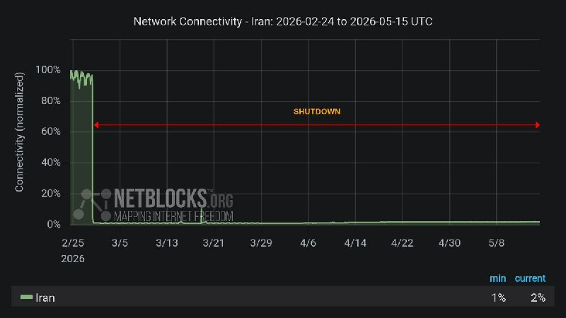

NetBlocks ✓ @netblocks
Fri, 15 May 2026 07:37:19 UTC

🌍 #Iran's digital isolation is now entering its 77th day as the internet blackout passes 1824 hours. The measure presents an emerging mental health risk to the public, who are largely cut off from online platforms, communications, and normal interaction with the outside world.

فارسی

🌍 انزوای دیجیتال #ایران اکنون در حالی وارد هفتاد و هفتمین روز خود می‌شود که خاموشی اینترنت از ۱۸۲۴ ساعت فراتر رفته است. این اقدام ریسک نوظهوری را برای سلامت روان مردمی که تا حد زیادی از پلتفرم‌های آنلاین، ارتباطات و تعامل عادی با دنیای خارج محروم شده‌اند، ایجاد می‌کند.

𝕏 · @shin_persian

## Shin_Persian — post 6005

  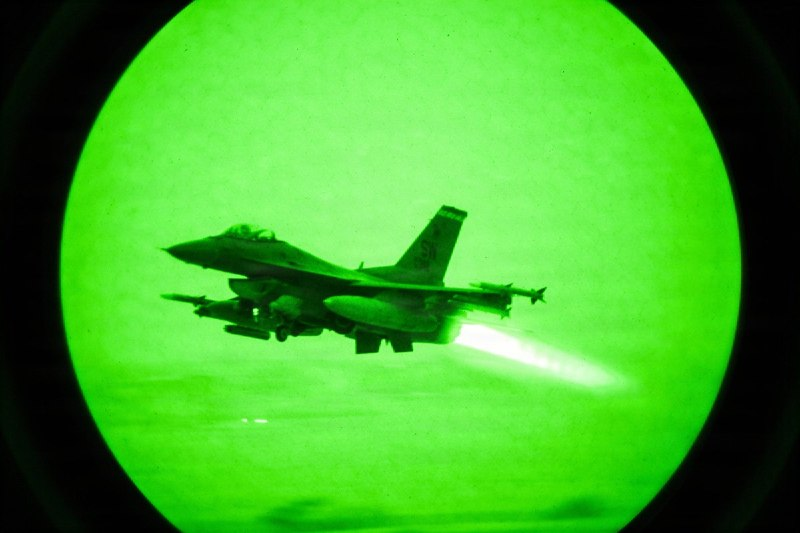

U.S. Central Command ✓ @CENTCOM
Fri, 15 May 2026 00:38:22 UTC

A U.S. Air Force F-16 takes off from a base in the Middle East for a night flight. Air Force fighter aircraft regularly patrol the skies over the Middle East in support of regional security.

فارسی

یک فروند اف-۱۶ نیروی هوایی ایالات متحده (USAF) برای یک پرواز شبانه از پایگاهی در خاورمیانه به هوا برمی‌خیزد. جنگنده‌های نیروی هوایی به طور منظم در حمایت از امنیت منطقه‌ای، در آسمان‌های خاورمیانه گشت‌زنی می‌کنند.

𝕏 · @shin_persian

## ManotoTV — post 105478

  <a href="telegram/content/ManotoTV_105478_1778839659.mp4" target="_blank">🎬 Download video</a>

نارندرا مودی، نخست‌وزیر هند، روز جمعه ۲۵ اردیبهشت در جریان سفر به ابوظبی، با انتشار پیامی در شبکه اجتماعی ایکس نوشت: «دوستی میان هند و امارات بسیار نیرومند است.»

مودی در این سفر با شیخ محمد بن زاید، رئیس امارات متحده عربی، دیدار کرد. محور گفتگوهای دو طرف، گسترش روابط دوجانبه، همکاری‌های انرژی، همکاری‌های دفاعی و تحولات منطقه‌ای اعلام شده است.

این سفر در شرایطی انجام می‌شود که تنش‌های منطقه‌ای و نگرانی‌ها درباره امنیت مسیرهای انرژی، اهمیت همکاری میان هند و امارات را افزایش داده است. امارات یکی از شرکای مهم هند در حوزه انرژی و تجارت به شمار می‌رود و ابوظبی و دهلی نو در سال‌های اخیر روابط اقتصادی و راهبردی خود را گسترش داده‌اند.

## ManotoTV — post 105477

  <a href="telegram/content/ManotoTV_105477_1778839659.mp4" target="_blank">🎬 Download video</a>

عباس عراقچی، وزیر خارجه جمهوری اسلامی، در گفتگو با رسانه دولتی هند گفت «هیچ راه‌حل نظامی‌ای وجود ندارد» و افزود ایالات متحده باید این واقعیت را درک کند.

او گفت آمریکا «دست‌کم دو بار» جمهوری اسلامی را آزموده و اکنون به این نتیجه رسیده است که «راه‌حل نظامی وجود ندارد».

عراقچی مهم‌ترین مشکل در روند کنونی را «پیام‌های متناقض» از سوی مقام‌های آمریکایی دانست و گفت این پیام‌ها از طریق اظهارنظرها، مصاحبه‌ها و مواضع مختلف دریافت می‌شود.

## ManotoTV — post 105476

  <a href="telegram/content/ManotoTV_105476_1778839660.mp4" target="_blank">🎬 Download video</a>

رسانه دولتی اسرائیل گزارش داد ایال زامیر، رئیس ستاد ارتش اسرائیل، در جریان جنگ با ایران به امارات متحده عربی سفر کرده است.
بر اساس این گزارش، او همراه با چند مقام نظامی اسرائیل با مقام‌های اماراتی، از جمله محمد بن زاید، رئیس امارات، دیدار کرده است. ارتش اسرائیل تاکنون واکنشی به این گزارش نشان نداده است.
این گزارش پس از آن منتشر می‌شود که بنیامین نتانیاهو نیز گفته بود در زمان جنگ به امارات سفر کرده؛ ادعایی که از سوی امارات رد شد. همچنین گزارش‌هایی درباره سفر رؤسای سازمان‌های اطلاعاتی و امنیتی اسرائیل به امارات در زمان جنگ منتشر شده است.
در همین حال، مقام‌های آمریکایی تأیید کرده‌اند اسرائیل یک سامانه پدافند موشکی را به همراه نیروهای نظامی برای راه‌اندازی آن به امارات منتقل کرده است.

## ManotoTV — post 105475

  <a href="telegram/content/ManotoTV_105475_1778839660.mp4" target="_blank">🎬 Download video</a>

دفتر رسانه‌ای دولت ابوظبی روز جمعه ۲۵ اردیبهشت اعلام کرد امارات متحده عربی ساخت یک خط لوله نفتی تازه را برای افزایش صادرات از مسیر فجیره تسریع می‌کند.

این پروژه قرار است تا سال ۲۰۲۷ ظرفیت صادرات نفت امارات از فجیره را دو برابر کند و توان این کشور برای دور زدن تنگه هرمز را افزایش دهد.

فجیره در ساحل دریای عمان قرار دارد و نفتکش‌ها از این مسیر می‌توانند بدون عبور از تنگه هرمز بارگیری کنند.

## ManotoTV — post 105474

  <a href="telegram/content/ManotoTV_105474_1778839661.mp4" target="_blank">🎬 Download video</a>

گروه ناظر اینترنتی نت‌بلاکس اعلام کرد قطعی اینترنت در ایران امروز وارد هفتادوهفتمین روز خود شده و از مرز ۱۸۲۴ ساعت گذشته است.
نت‌بلاکس هشدار داده ادامه این محدودیت‌ها می‌تواند به یک خطر فزاینده برای سلامت روان شهروندان تبدیل شود؛ شهروندانی که تا حد زیادی از پلتفرم‌های آنلاین، ارتباطات و تعامل عادی با جهان خارج محروم شده‌اند.

## ManotoTV — post 105473

  <a href="telegram/content/ManotoTV_105473_1778839661.mp4" target="_blank">🎬 Download video</a>

دونالد ترامپ، رئیس‌جمهوری آمریکا، پس از پایان سفر دو روزه خود به چین، روز جمعه پکن را ترک کرد.
ترامپ با هواپیمای اختصاصی ریاست‌جمهوری آمریکا «ایر فورس وان» از چین خارج شد و وانگ یی، وزیر امور خارجه چین، به همراه هیاتی دیپلماتیک او را بدرقه کرد.

## ManotoTV — post 105472

  <a href="telegram/content/ManotoTV_105472_1778839662.mp4" target="_blank">🎬 Download video</a>

اف‌بی‌آی اعلام کرد برای دریافت اطلاعاتی که به شناسایی و بازداشت «مونیکا ویت»، مامور سابق ضدجاسوسی و متخصص اطلاعاتی نیروی هوایی آمریکا، منجر شود ۲۰۰ هزار دلار جایزه تعیین کرده است.
بر اساس بیانیه اف‌بی‌آی، ویت بین سال‌های ۱۹۹۷ تا ۲۰۰۸ در نیروی هوایی آمریکا خدمت کرده و سپس تا سال ۲۰۱۰ به‌عنوان پیمانکار دولت آمریکا فعالیت داشته است. او به اطلاعات محرمانه و فوق‌محرمانه، از جمله هویت نیروهای مخفی جامعه اطلاعاتی آمریکا، دسترسی داشته است. مقام‌های آمریکایی می‌گویند او پس از شرکت در نشست‌هایی مرتبط با برنامه «افق نو» در تهران، به ایران پناهنده شد و اطلاعات حساسی را در اختیار جمهوری اسلامی قرار داد.
وزارت دادگستری آمریکا پیش‌تر او را به همکاری در عملیات جاسوسی سایبری، افشای اطلاعات محرمانه و به خطر انداختن جان نیروهای آمریکایی و خانواده‌هایشان متهم کرده بود. اف‌بی‌آی می‌گوید مونیکا ویت همچنان متواری است و احتمال می‌دهد افرادی از محل اختفای او اطلاع داشته باشند.

## ManotoTV — post 105471

  <a href="telegram/content/ManotoTV_105471_1778839662.mp4" target="_blank">🎬 Download video</a>

ارتش اسرائیل اعلام کرد در پی فعال شدن آژیر هشدار در مناطق مسد و عیلابون، یک پرتابه شلیک‌شده از خاک لبنان به سوی اسرائیل رهگیری شده است. به گفته ارتش اسرائیل، این اقدام «نقض دیگری از تفاهم‌های آتش‌بس» از سوی حزب‌الله به شمار می‌رود.
همزمان ارتش اسرائیل اعلام کرد یک سرباز این کشور شب گذشته بر اثر شلیک خمپاره حزب‌الله در جنوب لبنان کشته شده است. سرباز کشته‌شده، گروهبان دوم نگو داگان، ۲۰ ساله، از گردان دوازدهم تیپ گولانی و اهل شهرک دکل در جنوب اسرائیل معرفی شده است.
ارتش اسرائیل همچنین اعلام کرد شب گذشته سکوی پرتابی را که حزب‌الله از آن چندین راکت به سوی منطقه کریات شمونا شلیک کرده بود، در منطقه زبدین در جنوب لبنان هدف قرار داده و منهدم کرده است. به گفته ارتش، چندین ساختمان مورد استفاده حزب‌الله برای اهداف نظامی نیز در این حملات هدف قرار گرفته‌اند.

## ManotoTV — post 105470

  <a href="telegram/content/ManotoTV_105470_1778839663.mp4" target="_blank">🎬 Download video</a>

ویدئویی از قدم زدن دونالد ترامپ و شی جین‌پینگ در باغ‌های مجموعه حکومتی ژونگ‌نان‌های در پکن منتشر شده است.
در این ویدئو، ترامپ از رئیس‌جمهوری چین می‌پرسد: «وقتی دیگر رؤسای کشورها به دیدارتان می‌آیند، آن‌ها را هم اینجا می‌پذیرید؟»
شی جین‌پینگ در پاسخ می‌گوید: «به ندرت می‌آیند».

## ManotoTV — post 105469

  <a href="telegram/content/ManotoTV_105469_1778839664.mp4" target="_blank">🎬 Download video</a>

دونالد ترامپ پس از دیدار با شی جین‌پینگ اعلام کرد آمریکا و چین درباره ایران دیدگاه‌های «بسیار مشابهی» دارند و هر دو خواهان پایان تنش‌ها و باز ماندن تنگه هرمز هستند.
ترامپ گفت: «نمی‌خواهیم ایران به سلاح هسته‌ای دست پیدا کند.» او همچنین وضعیت کنونی را «دیوانه‌وار» توصیف کرد و افزود واشینگتن خواهان پایان بحران است.
رئیس‌جمهوری آمریکا همچنین با اشاره به روابط خود با شی جین‌پینگ گفت دو طرف طی سال‌های گذشته توانسته‌اند مشکلاتی را حل کنند که دیگران قادر به حل آن‌ها نبودند و تاکید کرد روابط میان واشینگتن و پکن همچنان «بسیار قوی» است.

## ManotoTV — post 105468

  <a href="telegram/content/ManotoTV_105468_1778839666.mp4" target="_blank">🎬 Download video</a>

مقام‌های فنلاند روز جمعه درباره فعالیت مشکوک پهپادی در منطقه پایتخت هشدار دادند و فرودگاه هلسینکی اعلام کرد پروازها به‌طور موقت متوقف شده است.
پتری اورپو، نخست‌وزیر فنلاند، در پیامی در شبکه اجتماعی ایکس اعلام کرد: «مقام‌ها در حال اقدام هستند. نیروهای مسلح نیز توان نظارتی و واکنش خود را تقویت کرده‌اند. از همه می‌خواهم اطلاعیه‌های رسمی را دنبال کنند.

## FarsiVOA — post 217809

  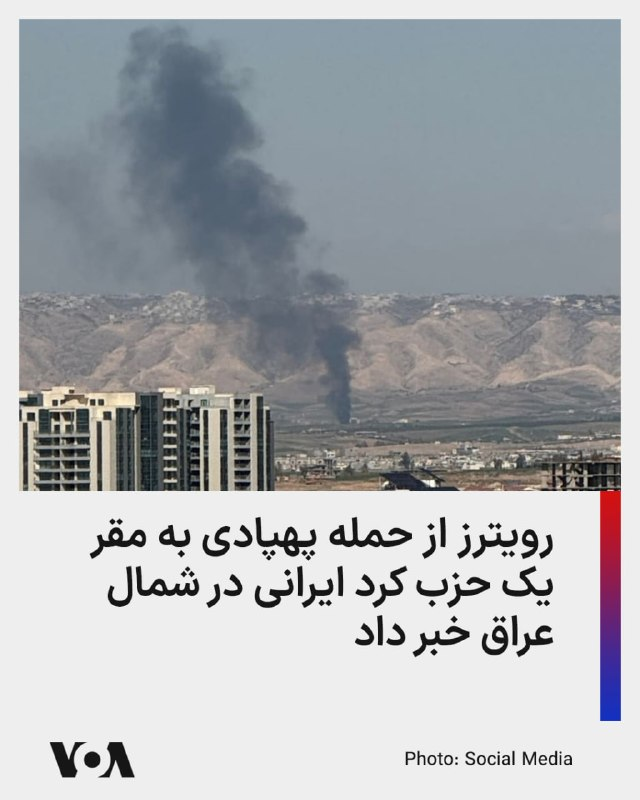

خبرگزاری رویترز به نقل از منابع امنیتی گزارش داد که دو پهپاد روز جمعه مقر یکی از احزاب کرد ایرانی مخالف جمهوری اسلامی را در شمال اربیل در اقلیم کردستان عراق هدف قرار دادند.

این خبرگزاری نام این حزب و همچنین توضیحات بیشتری درباره خسارات یا تلفات احتمالی این حمله پهپادی منتشر نکرد.

پیشتر حزب دموکرات کردستان ایران، از احزاب کرد مخالف جمهوری اسلامی، با انتشار بیانیه‌ای حملات اخیر به خانواده‌های این حزب را محکوم و بر حق دفاع مشروع تأکید کرده است.

طی بیش از دو ماه گذشته، هم‌زمان با جنگ آمریکا-اسرائیل علیه جمهوری اسلامی و حتی در دوره آتش‌بسی که بیش از یک ماه از برقراری آن می‌گذرد، جمهوری اسلامی و گروه‌های نیابتی وابسته به آن در عراق موج گسترده‌ای از حملات موشکی و پهپادی به اقلیم کردستان عراق را آغاز کرده‌اند.

به گزارش نهادهای حقوق بشری، بخش عمده این حملات که توسط سپاه پاسداران انجام شده، اردوگاه‌ها و مقرهای احزاب اپوزیسیون کُرد ایرانی و کمپ‌های پناهجویان/پناهندگان در استان‌های سلیمانیه و اربیل را هدف قرار داده است.
@FarsiVOA

## FarsiVOA — post 217808

  

رسانه دولتی امارات از آغاز احداث یک خط لوله جدید برای دور زدن تنگه هرمز خبر داد.

بر اساس این گزارش، تصمیم برای توسعه یک خط لوله به بندر فجیره در دریای عمان طی اجلاس مدیران شرکت ملی نفت ابوظبی و ولیعهد این کشور گرفته شده و این پروژه تا سال ۲۰۲۷ به بهره‌برداری خواهد رسید.

امارات هم‌اکنون نیز یک خط لوله با ظرفیت انتقال روزانه ۱.۹ میلیون بشکه نفت به بندر فجیره دارد و با احداث خط لوله جدید، این ظرفیت دو برابر خواهد شد.

این کشور ظرفیت تولید روزانه نزدیک به پنج میلیون بشکه نفت دارد، اما به خاطر انسداد تنگه هرمز توسط جمهوری اسلامی، ماه گذشته تنها دو میلیون بشکه تولید انجام داد. امارات از ابتدای ماه جاری از اوپک خارج شد تا تولید نفت خود را با دست بازتری افزایش دهد.
@FarsiVOA

## FarsiVOA — post 217807

🔺مهم‌ترین دستاوردهای سفر ترامپ به چین چه بود؟

▪️دونالد ترامپ، رئیس‌جمهور آمریکا، که پس از یک سفر سه‌روزه، پکن را به مقصد واشنگتن ترک کرد، از پیشرفت‌های تجاری میان دو کشور خبر داده است.

▪️او روز جمعه گفت که درباره ایران هم با رئیس‌جمهور چین، گفت‌وگو کرده و هر دو رهبر درباره عدم دستیابی تهران به سلاح هسته‌ای و باز بودن تنگه‌ها نظر مشابهی دارند.

▪️ترامپ روز پنج‌شنبه نیز گفت شی توافق کرده سفارش ۲۰۰ فروند هواپیمای بوئینگ را نهایی کند.

▪️کاخ سفید اعلام کرده که رهبران آمریکا و چین درباره راه‌های تقویت همکاری اقتصادی میان دو کشور، از جمله گسترش دسترسی شرکت‌های آمریکایی به بازار چین و افزایش سرمایه‌گذاری چین در صنایع ایالات متحده، تبادل نظر کردند.

⬇️ بیشتر بخوانید:
https://ir.voanews.com/a/8150368.html

## FarsiVOA — post 217806

  

بنیاد بین‌المللی زنان رسانه، الناز و الهه محمدی، دو روزنامه‌نگار ایرانی را به عنوان برندگان جایزه شجاعت در روزنامه ‌نگاری سال ۲۰۲۶ اعلام کرد.

این بنیاد در بیانیه‌ای اعلام کرد که خواهران محمدی به همراه جورجیا فورت، روزنامه‌‌نگار آمریکایی و نای مین، نی (نام مستعار) روزنامه‌نگار اهل میانمار، «به ‌دلیل افشای حقیقت در شرایط خطرناک» برنده این جایزه مهم شدند.

الهه محمدی خبرنگاری است که با انتشار گزارش‌های اختصاصی از مراسم خاکسپاری مهسا امینی، به همراه نیلوفر حامدی در سال ۱۴۰۱ به دلیل این افشاگری‌ها مدتی از سوی عوامل امنیتی جمهوری اسلامی بازداشت شد.

الناز محمدی، بر اساس اعلام بنیاد بین‌المللی زنان رسانه، گزارش‌های متعددی درباره حقوق بشر، حقوق زنان و مسائل اجتماعی، منتشر کرده است. سازمان گزارشگران بدون مرز نیز اعلام کرده که الناز محمدی در فهرست نامزدهای جایزه «شجاعت» این نهاد برای سال ۲۰۲۶ قرار دارد.
@FarsiVOA

## FarsiVOA — post 217805

🔺ترامپ پکن را به مقصد واشنگتن ترک کرد

▪️دونالد ترامپ، رئیس‌جمهور آمریکا روز جمعه با پایان دادن به سفر سه‌روزه خود به چین، سوار بر هواپیمای ایر فورس وان شد و پکن را به مقصد واشنگتن ترک کرد.

▪️سفر سه‌روزه ترامپ به چین شامل یک ضیافت رسمی دولتی، بازدید از مکان‌های تاریخی، صرف چای دوجانبه و یک ناهار کاری بود.

▪️دو روز گفت‌وگو میان رئیس‌جمهور آمریکا و رهبر چین تاکنون به توافق‌هایی منجر شده و مقام‌ها اشاره کرده‌اند که ممکن است توافق‌های بیشتری در ادامه حاصل شود.

▪️رئیس‌جمهور آمریکا روز جمعه اعلام کرد که او درباره ایران با شی گفت‌وگو کرده و هر دو رهبر درباره عدم دستیابی تهران به سلاح هسته‌ای و باز بودن تنگه‌ها نظر مشابهی دارند.

⬇️ بیشتر بخوانید:
https://ir.voanews.com/a/8150366.html

## FarsiVOA — post 217804

  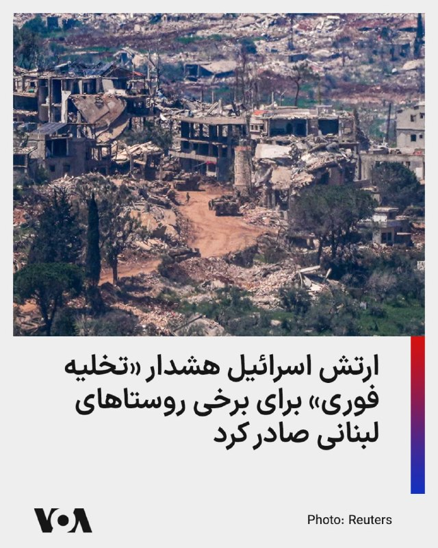

ارتش اسرائیل با صدور اطلاعیه‌ای به ساکنان مناطق شبریحا، حمادیه (صور)، زقوق المفدی، معشوق، الحوش، در لبنان هشدار داد تا برای حفظ امنیت، فوراً خانه‌های خود را تخلیه کنند.

این هشدار در پی نقض توافق آتش‌بس از سوی «حزب‌الله» صادر شد و ارتش اسرائیل اعلام کرد که ناچار است با قدرت علیه این امر اقدام کند.

در اطلاعیه ارتش اسرائيل آمده است که شهروندان دست‌کم تا فاصله ۱۰۰۰ متری از این مناطق دور شده و به مناطق باز و امن پناه ببرند. هر کسی که در نزدیکی نیروهای حزب‌الله، تأسیسات و تجهیزات نظامی آن حضور داشته باشد، جان خود را در معرض خطر قرار می‌دهد.

شامگاه پنجشنبه ۲۴ اردیبهشت، «گروهبان نقب داگان»، ۲۰ ساله، سرباز ارتش اسرائیل بر اثر خمپاره‌ای حزب‌الله در جنوب لبنان کشته شد.
@FarsiVOA

## FarsiVOA — post 217803

  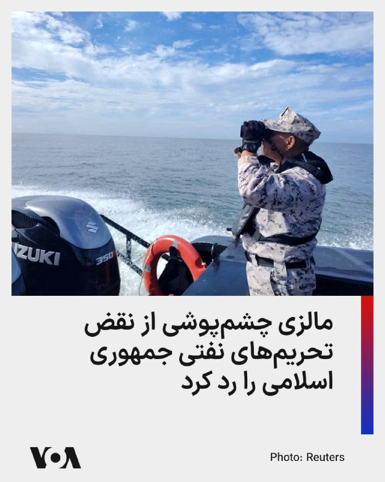

🔺مالزی اتهام «چشم‌پوشی از نقض تحریم‌های جمهوری اسلامی» را رد کرد

▪️مالزی با رد اتهاماتی مبنی بر چشم‌پوشی از استفاده جمهوری اسلامی از آب‌های مالزی برای دور زدن تحریم‌های نفتی آمریکا گفته است مشکل در «خلأهای حقوقی» است.

▪️مالزی می‌گوید عملیات انتقال کشتی به کشتی محموله‌های نفت تحریمی اغلب خارج از آب‌های سرزمینی و پوشش راداری‌اش انجام می‌شود.

▪️پیشتر شرکت اطلاعات کالا، به صدای آمریکا گفته بود که بیش از نیمی از نفت جمهوری اسلامی تحت نام نفت مالزی راهی چین می‌شود؛ موضوعی که آمارهای گمرکی چین نیز آن موضوع را تأیید می‌کند.

▪️مقام‌های آمریکایی پیشتر گفته‌اند که صادرات نفت ایران به‌شدت به ارائه‌دهندگان خدمات دریایی و انتقال نفت از کشتی به کشتی در نزدیکی آب‌های مالزی متکی است.

⬇️ بیشتر بخوانید:
https://ir.voanews.com/a/8150367.html

## FarsiVOA — post 217802

  

🔺ترامپ: با چین درباره دست نیافتن تهران به سلاح هسته‌ای و باز ماندن تنگه‌ها هم‌نظریم

▪️دونالد ترامپ، رئیس‌جمهور آمریکا، اعلام کرد که او درباره ایران با شی جین‌پینگ، رئیس‌جمهور چین، گفت‌وگو کرده و هر دو رهبر درباره عدم دستیابی تهران به سلاح هسته‌ای و باز بودن تنگه‌ها نظر مشابهی دارند.

▪️آقای ترامپ گفت: «ما درباره این‌که می‌خواهیم این موضوع چگونه پایان یابد، نظر بسیار مشابهی داریم؛ نمی‌خواهیم آن‌ها سلاح هسته‌ای داشته باشند، می‌خواهیم تنگه‌ها باز باشند.»

▪️او اقدام جمهوری اسلامی در بستن تنگه هرمز را «کاری دیوانه‌وار» توصیف کرد و تاکید کرد که جمهوری اسلامی نمی‌تواند سلاح اتمی داشته باشد.

⬇️ بیشتر بخوانید:
https://ir.voanews.com/a/8150358.html

## FarsiVOA — post 217801

  <a href="telegram/content/FarsiVOA_217801_1778839669.mp4" target="_blank">🎬 Download video</a>

⚡️گزارش فرهاد فلاحی، خبرنگار بخش فارسی صدای آمریکا، از تدابیر امنیتی در چین و محدودیت‌های رسانه‌ای
@FarsiVOA

## FarsiVOA — post 217800

⚡️گفت‌و‌گو با شاهین نژاد درباره ابعاد سیاسی و اقتصادی سفر پرزیدنت ترامپ به چین
@FarsiVOA

## FarsiVOA — post 217799

  <a href="telegram/content/FarsiVOA_217799_1778839670.mp4" target="_blank">🎬 Download video</a>

⚡️پیاده‌روی دونالد ترامپ و شی جین‌پینگ
@FarsiVOA

## FarsiVOA — post 217798

  <a href="telegram/content/FarsiVOA_217798_1778839670.mp4" target="_blank">🎬 Download video</a>

⚡️دونالد ترامپ: آمریکا و چین خواهان بازشدن تنگه هرمز هستند
@FarsiVOA

## FarsiVOA — post 217797

⚡️رهبران کدام شرکت‌های بزرگ آمریکایی دونالد ترامپ را در سفر به چین همراهی کردند؟
@FarsiVOA

## FarsiVOA — post 217796

⚡️گفت‌وگو با علی معموری و درویش رنجبر درباره مواضع چین و آمریکا در قبال شرایط تنگه هرمز
@FarsiVOA

## FarsiVOA — post 217795

⚡️گفت‌وگو با علی معموری و درویش رنجبر درباره موضع چین در قبال برنامه تسلیحاتی هسته‌ای جمهوری اسلامی
@FarsiVOA

## FarsiVOA — post 217794

  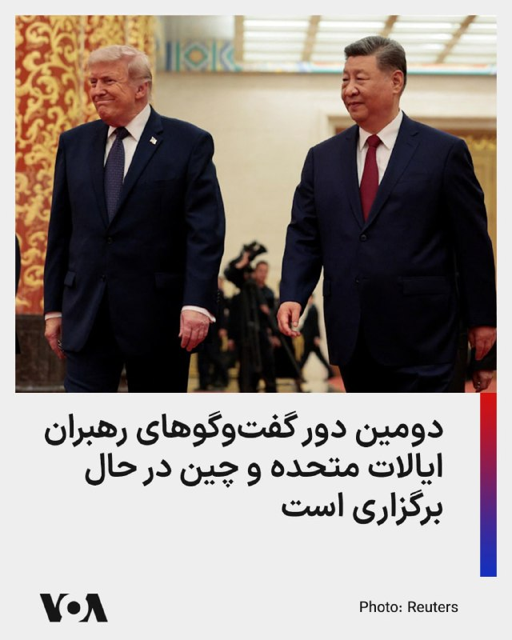

دومین دیدار دونالد ترامپ رئیس‌جمهور آمریکا، و شی جین‌پینگ رهبر چین، در «جونگ‌نان‌های» آغاز شده است.

سی‌ان‌ان می‌گوید جونگ‌نان‌های مقر رهبری حزب کمونیست چین است و اغلب با کاخ سفید در آمریکا مقایسه می‌شود. این مجموعه حدود ۱۵۰۰ هکتار وسعت دارد که شامل ۷۰۰ هکتار دریاچه، و همچنین آلاچیق‌ها، باغ‌ها و دفاتر اداری است.

این مکان که با دیوارهایی به رنگ قرمز محصور شده، از محرمانه‌ترین نقاط چین است؛ جایی که دوربین‌های مداربسته‌ی بی‌شماری بر فراز آن نظاره‌گر هستند و نیروهای امنیتی، با لباس‌های شخصی و نظامی، با دقت و وسواس در آن گشت‌زنی می‌کنند.

صبح جمعه، شی در این مکان از رئیس‌جمهور آمریکا استقبال کرد و دو رهبر در حال گفت‌وگو در برابر دوربین‌ها دیده شدند؛ پیش از آنکه از خبرنگاران خواسته شود فاصله بگیرند و اعلام شود که رهبران دو کشور قصد دارند یک گفت‌وگوی خصوصی داشته باشند.
@FarsiVOA

## FarsiVOA — post 217793

⚡️گزارش فرهاد فلاحی، خبرنگار بخش فارسی صدای آمریکا از ادامه سفر رئیس جمهوری آمریکا به چین
@FarsiVOA

## FarsiVOA — post 217792

⚡️گزارش خبرنگار بخش چینی صدای آمریکا از سفر پرزیدنت ترامپ به چین
@FarsiVOA

## FarsiVOA — post 217791

  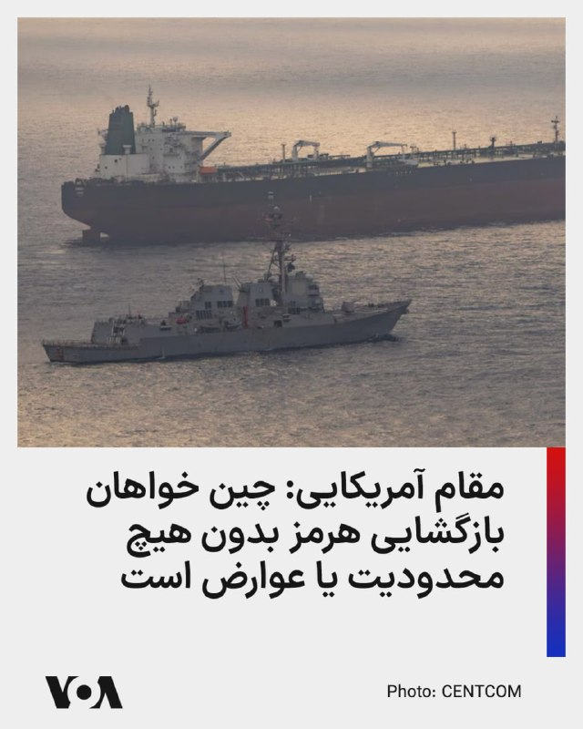

نماینده تجاری ایالات متحده، روز جمعه اعلام کرد که چین به آمریکا اعلام کرده است که خواهان بازگشایی تنگه هرمز بدون هیچ‌گونه محدودیت یا عوارض است.

جیمیسون گریر همچنین اشاره کرد که پکن با رویکردی واقع‌گرایانه، سیگنال‌هایی مبنی بر محدود کردن حمایت‌های نظامی از ایران ارسال کرده است.

او در گفت‌وگویی با تلویزیون بلومبرگ در پکن، جایی که در مذاکرات میان ترامپ و شی جین‌پینگ حضور داشت، گفت: «از دیدگاه ما چینی‌ها بسیار عمل‌گرایانه رفتار می‌کنند و نمی‌خواهند در سمت اشتباه این ماجرا قرار بگیرند. آن‌ها خواهان برقراری صلح در آن منطقه هستند... بنابراین ما اطمینان زیادی داریم که آن‌ها هر آنچه در توان دارند انجام خواهند داد تا هرگونه حمایت مادی از ایران را محدود کنند.»

گریر همچنین اضافه کرد که در پی سفر ترامپ، انتظار می‌رود توافقی برای فروش محصولات کشاورزی آمریکا به چین به ارزش ده‌ها میلیارد دلار (عدد دو رقمی به میلیارد) حاصل شود.
@FarsiVOA

## FarsiVOA — post 217790

  <a href="telegram/content/FarsiVOA_217790_1778839672.mp4" target="_blank">🎬 Download video</a>

⚡️تصاویر اختصاصی صدای آمریکا از حضور اصغر فرهادی و عوامل فیلم «داستان‌های موازی» روی فرش قرمز فستیوال فیلم کن
@FarsiVOA

## DW_Farsi — post 124719

🔶 عربستان خواهان پیمان عدم تعرض با ایران شد

 عربستان سعودی در گفت‌وگو با متحدان خود، ایده یک پیمان عدم تعرض میان ایران و کشورهای خاورمیانه را مطرح کرده است؛ طرحی که به گفته دیپلمات‌ها، می‌تواند پس از پایان جنگ آمریکا و اسرائیل با ایران، به یکی از چارچوب‌های اصلی برای مدیریت تنش‌های منطقه‌ای تبدیل شود. فایننشال تایمز گزارش داد ریاض گفته است برای این ایده، "فرایند هلسینکی" در اروپا را به‌عنوان یک الگوی ممکن در نظر دارد؛ مدلی که در دهه ۱۹۷۰ به کاهش تنش میان بلوک‌های رقیب در دوران جنگ سرد کمک کرد.

 کشورهای عربی خلیج فارس از آغاز جنگ نگران بوده‌اند که در پایان درگیری، با ایرانی ضعیف‌تر اما تندروتر در همسایگی خود روبه‌رو شوند؛ آن هم در شرایطی که احتمال کاهش حضور نظامی آمریکا در منطقه نیز مطرح است. در چنین فضایی، ایده یک پیمان عدم تعرض از نگاه ریاض فقط یک ابتکار دیپلماتیک نیست، بلکه تلاشی برای جلوگیری از دور تازه‌ای از بی‌ثباتی است.

دیپلمات‌های غربی گفته‌اند این طرح فقط یکی از چند ایده‌ای است که روی میز قرار دارد، اما در پایتخت‌های اروپایی و در نهادهای اتحادیه اروپا از آن استقبال شده است. از نگاه حامیان این ایده، چنین چارچوبی می‌تواند هم مانع درگیری‌های آینده شود و هم برای تهران نوعی تضمین فراهم کند که خود نیز هدف حمله قرار نخواهد گرفت.

@dw_farsi

## DW_Farsi — post 124718

  

🔶 پاداش اف‌بی‌آی برای یافتن مامور آمریکایی متهم به جاسوسی برای ایران

دفتر میدانی اف‌بی‌آی در واشنگتن اعلام کرد برای اطلاعاتی که به دستگیری و پیگرد قضایی مونیکا ویت، عضو سابق نیروهای نظامی ایالات متحده آمریکا و مامور ضدجاسوسی، منجر شود، ۲۰۰ هزار دلار جایزه تعیین کرده است.

او در فوریه ۲۰۱۹ از سوی هیئت منصفه فدرال در ناحیه کلمبیا به اتهام جاسوسی، از جمله انتقال اطلاعات دفاع ملی به جمهوری اسلامی متهم شده بود.

ویت، متخصص سابق اطلاعاتی نیروی هوایی ایالات متحده آمریکا در دوره خدمت فعال و مامور ویژه سابق دفتر تحقیقات ویژه نیروی هوایی، بین سال‌های ۱۹۹۷ تا ۲۰۰۸ در ارتش خدمت کرد و سپس تا سال ۲۰۱۰ به عنوان پیمانکار دولت ایالات متحده آمریکا فعالیت داشت. خدمت نظامی و فعالیت قراردادی او دسترسی به اطلاعات محرمانه و فوق محرمانه مرتبط با اطلاعات خارجی و ضدجاسوسی، از جمله نام‌های واقعی نیروهای مخفی جامعه اطلاعاتی ایالات متحده آمریکا، را برای او فراهم کرده بود.

ویت در سال ۲۰۱۳ به ایران گریخت. بر اساس کیفرخواست، او پس از آن اطلاعاتی را در اختیار حکومت ایران قرار داد و اطلاعات و برنامه‌های حساس و طبقه‌بندی‌شده دفاع ملی ایالات متحده آمریکا را در معرض خطر قرار داد.

بر اساس اعلام اف‌بی‌آی، ویت عمدا اطلاعاتی را ارائه کرده که جان نیروهای آمریکایی و خانواده‌های آن‌ها را که در خارج از کشور مستقر بودند، به خطر انداخته است. همچنین گفته می‌شود او از طرف حکومت ایران تحقیقاتی انجام داده تا آن‌ها بتوانند همکاران سابق او در دولت ایالات متحده آمریکا را هدف قرار دهند.

به گفته اف‌بی‌آی، فرار ویت به ایران برای سپاه پاسداران انقلاب اسلامی سودمند بوده است. در بیانیه اف‌بی‌آی آمده است که سپاه دارای بخش‌هایی است که مسئول جمع‌آوری اطلاعات، جنگ نامتقارن و ارائه پشتیبانی مستقیم به چند سازمان تروریستی هستند که شهروندان و منافع ایالات متحده آمریکا را هدف قرار می‌دهند.

اگرچه برای جرایم ادعایی ویت، کیفرخواست صادر شده، اما او همچنان متواری است. اف‌بی‌آی می‌گوید همچنان فعالانه برای یافتن ویت و "کشاندن او به پای میز عدالت" تلاش می‌کند.

در همین راستا دنیل ویرزبیتسکی، مامور ویژه مسئول بخش ضدجاسوسی و سایبری دفتر میدانی اف‌بی‌آی در واشنگتن، اعلام کرد: «گفته می‌شود مونیکا ویت بیش از یک دهه پیش با فرار به ایران و ارائه اطلاعات دفاع ملی به حکومت ایران، سوگند خود به قانون اساسی را نقض کرده و احتمالا همچنان به فعالیت‌های مخرب آن‌ها کمک می‌کند.»

او افزود: «اف‌بی‌آی این موضوع را فراموش نکرده و معتقد است در این مقطع مهم از تاریخ ایران، فردی وجود دارد که چیزی درباره محل اختفای او می‌داند. اف‌بی‌آی می‌خواهد از شما بشنود تا بتوانید به ما برای دستگیری ویت و کشاندن او به پای میز عدالت کمک کنید.»

@dw_farsi

## DW_Farsi — post 124717

  

🔶 الهه و الناز محمدی برنده جایزه "شجاعت در روزنامه‌نگاری" شدند

بنیاد بین‌المللی رسانه زنان (IWMF) برنگان سی‌وهفتمین دوره سالانه جوایز "شجاعت در روزنامه‌نگاری" را معرفی کرد.

این جایزه از زنانی تقدیر می‌کند که تحت شرایط خطرناک و فشار شدید برای آشکار کردن حقیقت گزارش تهیه می‌کنند.

برندگان سال ۲۰۲۶ شامل الهه و الناز محمدی، خواهران ایرانی و خبرنگاران رسانه‌های چاپی؛ جورجیا فورت، خبرنگار تلویزیونی از ایالات متحده آمریکا؛ و نای مین نی (با استفاده از نام مستعار)، خبرنگار دیجیتال از میانمار هستند.

فرنچی می کامپیو، خبرنگار فیلیپینی که درباره خشونت حکومتی در فیلیپین گزارش تهیه می‌کند و اکنون در همان کشور زندانی است، جایزه "والیس آننبرگ برای عدالت برای زنان روزنامه‌نگار" بنیاد بین‌المللی رسانه زنان در سال ۲۰۲۶ را دریافت کرد؛ این جایزه‌ که هر سال به روزنامه‌نگاری اعطا می‌شود که به ناحق بازداشت، زندانی یا محبوس شده باشد.

برندگان جایزه شجاعت امسال از میان نامزدهایی از ۵۳ ملیت انتخاب شدند. به گفته ناظران، این امر نشان‌دهنده کاهش آزادی مطبوعات در جهان است و با ترکیبی از فشارهای حقوقی، ارعاب جنسیتی و هدف‌گیری دیجیتال تشدید شده است.

الیزا لیس مونوز، رئیس بنیاد بین‌المللی رسانه زنان با اشاره به برندگان جوایز امسال شجاعت در روزنامه‌نگاری گفت: «جرم‌انگاری حقیقت‌گویی همان چیزی است که شجاعت را به آینده روزنامه‌نگاری تبدیل می‌کند. برای زنانی که جرات گزارشگری دارند، خود روزنامه‌نگاری در حال بازتعریف شدن به‌عنوان عملی قابل مجازات است.»

او افزود: «ما دیگر در جهانی از سرکوب واکنشی زندگی نمی‌کنیم، بلکه در جهانی از بازدارندگی پیش‌دستانه هستیم؛ جایی که خودِ گزارشگری به یک مسئولیت خطرناک تبدیل شده است. بنیاد بین‌المللی رسانه زنان با افتخار از الهه، الناز، فرنچی، جورجیا و نای، زنانی که با همان خطری زندگی می‌کنند که درباره آن گزارش تهیه می‌کنند، امسال با جوایز شجاعت تقدیر می‌کند.»

@dw_farsi

## DW_Farsi — post 124716

  

📸 عکس روز: شنا در رود راین

گرچه در بسیاری از مناطق شنا کردن در رود راین خطرناک و به همین دلیل ممنوع است، اما بنا به یک سنت ۵۰ ساله در شهر کلن، امسال ۱۰۰ زن و مرد تن به آب زدند. این شنا در روز معراج عیسی مسیح که در آلمان روز پدر نیز هست هر ساله برگزار می‌شود. شرایط شنا در رود راین در کلن برای همه شناگران یکسان است: یک ساعت در آب، عبور از زیر چهار پل، و خروج دوباره از رود راین.

@dw_farsi

## DW_Farsi — post 124715

  

🔶 فرمانده سنتکام: توان تهاجمی ایران محدود شده، اما کاملا از بین نرفته

برد کوپر، فرماندهی منطقه‌ای ایالات متحده آمریکا (سنتکام)، گزارش‌های منتشرشده در خصوص سالم ماندن بخشی از مواضع موشکی جمهوری اسلامی را رد کرد.

کوپر، فرمانده سنتکام، در جلسه‌ای در کنگره آمریکا گفت ارقامی که در حال انتشار هستند، از نگاه او نادرست‌اند. او همچنین گفت در ارزیابی توان تهاجمی ایران، موضوع اصلی بیشتر بحث ساختارهای فرماندهی و کنترل است که نابود شده‌اند. کوپر اذعان کرد توانایی‌های ایران برای مسدود کردن تنگه هرمز تضعیف شده، اما از بین نرفته است.

پیش از این، روزنامه نیویورک تایمز گزارش داده بود که زرادخانه موشکی ایران در مقایسه با ادعای دولت آمریکا در این زمینه، در وضعیت بسیار بهتری قرار دارد.

فرمانده سنتکام در این جلسه همچنین به اقدامات جمهوری اسلامی در تنگه هرمز  نیز اشاره کرد و گفت: «توانایی [حکومت ایران] به شکل قابل توجهی تضعیف شده است. اگر فقط از تجربه حرفه‌ای خودم استفاده کنم، در ۱۰۰ بار عبور از تنگه هرمز، معمولا ۲۰ تا ۴۰ قایق تندرو می‌دیدید؛ اما اخیرا فقط دو یا سه قایق دیده‌ایم..»

@dw_farsi

## DW_Farsi — post 124714

  

🔶 کنگره آمریکا طرح محدودسازی اختیارات ترامپ در ایران را رد کرد

مجلس نمایندگان ایالات متحده آمریکا که جمهوری‌خواهان در آن اکثریت دارند، با اختلافی بسیار اندک قطعنامه‌ای را که دموکرات‌ها برای توقف جنگ با جمهوری اسلامی ارائه کرده بودند رد کرد.

این قطعنامه با هدف متوقف کردن جنگ تا زمان دریافت مجوز رسمی از کنگره ارائه شده بود، اما تلاش ارائه‌دهندگان آن برای محدود کردن کارزار نظامی دونالد ترامپ، رئیس ‌جمهور آمریکا، با کمترین اختلاف ممکن شکست خورد.

مجلس نمایندگان با ۲۱۲ رای موافق در برابر ۲۱۲ به این قطعنامه رای مخالف داد؛ در نتیجه اکثریتی به دست نیامد و این طرح شکست خورد.

این سومین مورد رای‌گیری مجلس نمایندگان در سال جاری درباره قطعنامه اختیارات جنگی مربوط به ایران محسوب می‌شود و همچنین نخستین رای‌گیری پس از آن است که در اول ماه مه، مهلت ۶۰ روزه برای مراجعه ترامپ به کنگره درباره جنگ ایران به پایان رسید.

ترامپ در آن زمان اعلام کرد که آتش‌بس، عملیات نظامی علیه جمهوری اسلامی را پایان داده است. با این حال به نظر می‌رسد که اکنون اختلاف آرا به تدریج کمتر شده است و جمهوری‌خواهان هم‌حزبی ترامپ، تنها اکثریتی شکننده را در اختیار دارند.

قطعنامه قبلی درباره اختیارات جنگی در ۱۶ آوریل با نتیجه ۲۱۳ رای مخالف در برابر ۲۱۴ رای موافق شکست خورده بود و یک نماینده نیز رای ممتنع داده بود.

اختلاف آرا در سنای آمریکا نیز کمتر شده است؛ روز چهارشنبه، یک قطعنامه مرتبط با اختیارات جنگی با نتیجه ۵۰ رای مخالف در برابر ۴۹ رای موافق متوقف شد. در آن رای‌گیری، سه جمهوری‌خواه همراه با تمام دموکرات‌ها به جز یک نفر، به پیشبرد این طرح رای داده بودند.

@dw_farsi

## DW_Farsi — post 124713

  

🔶 ترامپ: دیگر بیش از این درباره ایران صبر نخواهم کرد

دونالد ترامپ، رئیس‌ جمهور ایالات متحده آمریکا، در مصاحبه با برنامه "هانیتی" شبکه فاکس‌نیوز که پنجشنبه شب پخش شد گفت که دیگر "بیش از این" در قبال ایران صبر نخواهد کرد.

او با تکرار درخواست خود از حکومت ایران مبنی بر لزوم توافق با واشنگتن، به تلاش برای خارج کردن اورانیوم غنی‌شده از ایران اشاره کرد و گفت: «من قرار نیست خیلی بیشتر صبر کنم. آن‌ها باید توافق کنند.»

رئیس جمهور آمریکا در پاسخ به سوالی درباره ضرورت خارج کردن اورانیوم غنی‌شده از ایران نیز گفت: «فکر نمی‌کنم این کار ضروری باشد، مگر از جنبه نمایشی.»

ترامپ افزود: «البته اگر آن را به دست بیاورم احساس بهتری دارم. اما فکر می‌کنم این موضوع بیشتر جنبه تبلیغاتی دارد تا هر چیز دیگری.»

ایالات متحده آمریکا در جریان مذاکرات اتمی اخیر اصرار داشته است که جمهوری اسلامی ذخایر اورانیوم با غنای بالای خود را به خارج منتقل کند و از غنی‌سازی داخلی صرف‌نظر کند.

ترامپ در حال حاضر برای بازدید رسمی از چین و دیدار با شی جین‌پینگ، رهبر چین در پکن به سر می‌برد. بر اساس اعلام کاخ سفید، ترامپ و شی جین‌پینگ پیش از ضیافت رسمی به مدت دو ساعت و نیم با یکدیگر دیدار کردند و درباره نفت، جنگدر ایران، تنگه هرمز، افزایش دسترسی ایالات متحده آمریکا به بازارهای چین و متوقف کردن انتقال مواد اولیه تولید فنتانیل به ایالات متحده گفت‌وگو کردند.

بر اساس اعلام کاخ سفید، دو طرف توافق کردند که ایران نباید به سلاح هسته‌ای دست پیدا کند و تنگه هرمز باید باز بماند. ترامپ نیز با تایید این خبر گفت که دو طرف درباره ایران با یکدیگر گفت‌وگو کردند و توافق داشتند که این کشور نباید به سلاح هسته‌ای دست پیدا کند.

@dw_farsi

## Persian_Trend_Official — post 14183

  <a href="telegram/content/Persian_Trend_Official_14183_1778839675.mp4" target="_blank">🎬 Download video</a>

💢ضیافت شام پکن، لحظه‌ای که شی جین‌پینگ برای چند دقیقه میز رو ترک می‌کنه…

▪️دونالد ترامپ هم از فرصت استفاده می‌کنه و می‌ره سراغ دفترچه شخصی 😁

🫆:Tony

📌 @persian_trend_official
پرشین ترند | متفاوت‌ترین کانال نظامی

## Persian_Trend_Official — post 14182

🔴وزیر امور خارجه عباس عراقچی اعلام کرده که پیام‌های متناقض از سوی واشنگتن روند مذاکرات را پیچیده کرده است.

او در اظهاراتی که از سوی رسانه رسمی ایران منتشر شده، تأکید کرده ایران مسئول اختلالات در تنگه هرمز نیست و آغازگر جنگ هم نبوده و صرفاً در حال دفاع از خود است.

💢عراقچی همچنین موضع تهران را تکرار کرده که تنگه هرمز برای عبور کشتی‌های کشور‌های «دوست» باز است، به شرط هماهنگی با مقامات ایرانی، اما برای کشور‌های «دشمن» محدود خواهد بود.

🫆:Tony

📌 @persian_trend_official
پرشین ترند | متفاوت‌ترین کانال نظامی

## Persian_Trend_Official — post 14181

  <a href="telegram/content/Persian_Trend_Official_14181_1778839677.webm" target="_blank">🎬 Download video</a>

🔴 الجزیره: آمریکا تمامی شروط ایران را رد کرده است

💢خبرنگار الجزیره گزارش داد تهران به‌صورت رسمی پاسخ واشینگتن به پیشنهاد ارائه‌شده از سوی ایران را دریافت کرده است.

بر اساس این گزارش:

▪️ ایالات متحده تمامی شروط مطرح‌شده از سوی ایران را رد کرده است

🫆:Tony

📌 @persian_trend_official
پرشین ترند | متفاوت‌ترین کانال نظامی

## Persian_Trend_Official — post 14180

💢رئیس ستاد کل ارتش اسرائیل در جریان جنگ ایران به طور مخفیانه به امارات متحده عربی سفر کرد و با شیخ محمد بن زاید دیدار کرد — که به فهرست فزاینده‌ای از مقامات ارشد اسرائیلی پیوست که سفرهای مخفیانه در زمان جنگ به ابوظبی داشتند.

💢امارات متحده عربی همچنان این دیدارها را انکار می‌کند.

🫆:Tony

📌 @persian_trend_official
پرشین ترند | متفاوت‌ترین کانال نظامی

## Persian_Trend_Official — post 14179

  <a href="telegram/content/Persian_Trend_Official_14179_1778839677.webm" target="_blank">🎬 Download video</a>

🔴 آمریکا برای اطلاعات درباره واحد تولید پهپاد سپاه جایزه تعیین کرد

💢وزارت خارجه آمریکا اعلام کرد برای دریافت اطلاعات درباره ۶ فرد مرتبط با واحد تولید پهپاد نیروی قدس سپاه پاسداران جایزه مالی تعیین کرده است.

بر اساس بیانیه واشینگتن:

▪️ این افراد با شرکت «کیمیا پارت سیوان» مرتبط هستند
▪️ آمریکا مدعی است این مجموعه در آزمایش، توسعه و تأمین پهپادها نقش دارد
▪️ اطلاعات درباره این افراد، همکاران یا شبکه‌های مالی آن‌ها می‌تواند مشمول جایزه شود

💢برنامه پاداش امنیتی وزارت خارجه آمریکا اعلام کرده میزان این جایزه تا ۱۵ میلیون دلار خواهد بود.

💢در متن منتشرشده آمده است:

▪️ «به ما کمک کنید به منابع مالی سپاه ضربه بزنیم»

🫆:Tony

📌 @persian_trend_official
پرشین ترند | متفاوت‌ترین کانال نظامی

## Persian_Trend_Official — post 14178

  <a href="telegram/content/Persian_Trend_Official_14178_1778839677.webm" target="_blank">🎬 Download video</a>

🔴 ترامپ پکن را ترک کرد؛ پایان سفر رئیس‌جمهور آمریکا به چین

💢دونالد ترامپ پس از پایان سفر خود به چین، سوار بر هواپیمای ریاست‌جمهوری آمریکا پکن را ترک کرد.

در مراسم بدرقه:

▪️ فرش قرمز برای رئیس‌جمهور آمریکا پهن شده بود
▪️ حاضران پرچم‌های آمریکا و چین را در دست داشتند
▪️ یک گروه موسیقی نظامی نیز در مراسم خداحافظی اجرا داشت

💢سفر ترامپ به چین با دیدارهای مهم با شی جین‌پینگ و گفت‌وگو درباره موضوعاتی از جمله ایران، تایوان، تجارت و تنگه هرمز همراه بود.

🫆:Tony

📌 @persian_trend_official
پرشین ترند | متفاوت‌ترین کانال نظامی

## Persian_Trend_Official — post 14177

  <a href="telegram/content/Persian_Trend_Official_14177_1778839678.webm" target="_blank">🎬 Download video</a>

🔴 ارتش اسرائیل مدعی انهدام پرتابگر راکتی حزب‌الله شد

💢ارتش اسرائیل اعلام کرد یک سکوی پرتاب راکت متعلق به حزب‌الله را که برای شلیک به شمال اسرائیل استفاده شده بود، هدف قرار داده و منهدم کرده است.

بر اساس ادعای ارتش اسرائیل:

▪️ این پرتابگر در منطقه «زبقین» در جنوب لبنان قرار داشته است
▪️ حمله پس از شلیک راکت‌ها به سمت شمال اسرائیل انجام شده
▪️ این موضع متعلق به نیروهای حزب‌الله بوده است

🫆:Tony

📌 @persian_trend_official
پرشین ترند | متفاوت‌ترین کانال نظامی

## Persian_Trend_Official — post 14176

  <a href="telegram/content/Persian_Trend_Official_14176_1778839678.webm" target="_blank">🎬 Download video</a>

🔴 چین خواستار مذاکره برای پایان جنگ ایران شد

💢وزارت خارجه چین اعلام کرد ثبات در خلیج فارس و خاورمیانه در شرایط کنونی مهم‌ترین مسئله است و ادامه جنگ ایران پیامدهای خطرناکی برای منطقه به‌دنبال دارد.

💢سخنگوی وزارت خارجه چین تأکید کرد:

▪️ باید هرچه سریع‌تر راهی برای پایان جنگ پیدا شود
▪️ فرصت آغاز مذاکرات و پایان درگیری‌ها نباید از دست برود
▪️ بازگشایی و حفظ تردد آزاد در تنگه هرمز ضروری است
▪️ گفت‌وگو و مذاکره تنها مسیر مناسب برای حل بحران محسوب می‌شود

💢پکن همچنین هشدار داد هرگونه اختلال در تنگه هرمز می‌تواند تبعات گسترده‌ای برای اقتصاد و امنیت جهانی داشته باشد.

🫆:Tony

📌 @persian_trend_official
پرشین ترند | متفاوت‌ترین کانال نظامی

## Persian_Trend_Official — post 14175

  

🔴 امارات ظرفیت صادرات نفت بدون عبور از تنگه هرمز را دو برابر می‌کند

💢امارات متحده عربی اعلام کرد تا سال ۲۰۲۷ ظرفیت صادرات نفت خام خود بدون نیاز به عبور از تنگه هرمز را دو برابر خواهد کرد.

بر اساس گزارش‌ها:

▪️ شرکت ملی نفت ابوظبی در حال ساخت خط لوله جدیدی به بندر فجیره در دریای عمان است
▪️ هدف این پروژه کاهش وابستگی به تنگه هرمز عنوان شده است
▪️ بسته‌شدن مسیر هرمز در جریان جنگ ایران، بازارهای جهانی را دچار بحران کرده است

💢امارات هم‌اکنون نیز یک خط لوله با ظرفیت روزانه ۱.۵ میلیون بشکه از میادین نفتی داخلی به بندر فجیره در اختیار دارد؛ مسیری که در جریان تنش‌های اخیر نقش حیاتی برای صادرات نفت این کشور ایفا کرده است.

🫆:Tony

📌 @persian_trend_official
پرشین ترند | متفاوت‌ترین کانال نظامی

## Persian_Trend_Official — post 14174

  <a href="telegram/content/Persian_Trend_Official_14174_1778839679.webm" target="_blank">🎬 Download video</a>

کم کم داره جدی میشه !!!!

## Persian_Trend_Official — post 14173

  <a href="telegram/content/Persian_Trend_Official_14173_1778839679.mp4" target="_blank">🎬 Download video</a>

صبحتون بخیر ☕️😆

📝 Nick
📌 @persian_trend_official
پرشین ترند | متفاوت‌ترین کانال نظامی

## Persian_Trend_Official — post 14172

  

💢اسماعیل بقایی

«کسی که در خفا خیانت کند، در برابر افکار عمومی رسوا خواهد شد»

🫆:Tony

📌 @persian_trend_official
پرشین ترند | متفاوت‌ترین کانال نظامی

## RadioFarda — post 157204

  

🔸 بازارهای سهام چین و هنگ‌کنگ پس از پایان نشست دو روزه میان دونالد ترامپ و شی جین‌پینگ، روسای جمهوری آمریکا و چین، با افت همراه شدند؛ نشستی که به گفته تحلیلگران نتوانست انتظارات سرمایه‌گذاران را برآورده کند.

🔸 بر اساس گزارش‌ها، با اعلام توافق برای خرید تنها ۲۰۰ فروند هواپیمای بوئینگ از سوی چین، این میزان کمتر از انتظار بازارها ارزیابی شد و سهام این شرکت را ۴ درصد کاهش داد.

🔸 این مذاکرات اگرچه بر موضوعاتی مانند تجارت، ایران و تایوان متمرکز بود، اما جزئیات مشخصی از توافق‌های بزرگ اقتصادی در آن اعلام نشد. در نتیجه، شاخص‌های اصلی چین کاهش یافتند و فضای احتیاط و ریسک‌گریزی بر بازارهای مالی غالب شد.

🔸 هنوز مشخص نیست آتش‌بس تجاری که در اکتبر امضا شده بود تمدید می‌شود یا نه.

@RadioFarda

## RadioFarda — post 157203

  

🔸امارات متحده عربی اعلام کرد این کشور ساخت یک خط لوله جدید نفتی را برای دو برابر کردن ظرفیت صادرات نفت از طریق بندر فجیره تا سال ۲۰۲۷ تسریع خواهد کرد. این اقدام توانایی ابوظبی برای دور زدن تنگه هرمز را به‌طور چشمگیری افزایش خواهد داد.

🔸دفتر رسانه‌ای دولت ابوظبی روز جمعه ۲۵ اردیبهشت اعلام کرد شیخ خالد بن محمد بن زاید، ولیعهد ابوظبی، به شرکت ملی نفت ابوظبی، ادنوک، دستور داده است اجرای پروژه خط لوله «غرب به شرق» را سرعت ببخشد. به‌گفتهٔ این نهاد، این خط لوله اکنون در حال ساخت است و انتظار می‌رود در سال ۲۰۲۷ به بهره‌برداری برسد.

🔸در بیانیهٔ دولت امارات اشاره‌ای به زمان‌بندی اولیه این پروژه نشده است.

🔸خط لولهٔ کنونی نفت خام ابوظبی، موسوم به «حبشان ـ فجیره»، ظرفیت انتقال روزانه تا یک میلیون و ۸۰۰ هزار بشکه نفت را دارد و نقش مهمی در افزایش صادرات مستقیم نفت امارات از سواحل دریای عمان ایفا کرده است.

@RadioFarda

## RadioFarda — post 157202

  <a href="telegram/content/RadioFarda_157202_1778839683.mp4" target="_blank">🎬 Download video</a>

🔸رئیس‌جمهور آمریکا، روز جمعه ۲۵ اردیبهشت گفت که در مورد ایران با شی جین‌پینگ، رئیس‌جمهور چین، گفت‌وگو کرده است و هر دو طرف هم‌نظر هستند که ایران نباید سلاح هسته‌ای داشته باشد و خواستار باز شدن تنگه‌ هرمز هستند.

🔸به گزارش رویترز، دونالد ترامپ ساعتی پیش از پایان سفر رسمی خود به چین گفت که صبر آمریکا درباره ایران رو به پایان است و تأکید کرد که تهران باید وارد توافق شود.

🔸بر اساس جمع‌بندی کاخ سفید از این دیدار، دو طرف بر ضرورت جلوگیری از نظامی‌سازی تنگه هرمز تأکید کرده‌اند.

🔸در مقابل، وزارت خارجه چین اعلام کرده که این کشور با ادامه جنگ ایران مخالف است و تأکید کرده این درگیری نباید هرگز آغاز می‌شد.

🔸ترامپ در گفت‌وگو با فاکس‌نیوز هم اعلام کرد که چین وعده داده از ارسال تجهیزات نظامی به ایران خودداری کند و در مقابل، پکن به دنبال افزایش خرید نفت از آمریکا برای کاهش وابستگی به مسیرهای انرژی منطقه‌ای است.

🔸در همین حال، تحلیلگران می‌گویند میزان همکاری واقعی چین در این پرونده همچنان محل تردید است؛ زیرا ایران برای پکن یک شریک مهم در حوزه انرژی و سیاست منطقه‌ای به شمار می‌رود.

@RadioFarda

## RadioFarda — post 157201

نمایشگاه مجازی کتاب تهران؛ دولت چه می‌کند، ناشران چه می‌گویند؟

🔸در حالی که صنعت نشر و بازار کتاب ایران زیر فشار بحران‌های اقتصادی، گرانی کاغذ، پیامدهای جنگ و سانسور دولتی همچنان برای بقا تلاش می‌کند، قرار است هفتمین دورهٔ نمایشگاه مجازی کتاب تهران هم در عین قطع اینترنت برگزار شود.

🔸نمایشگاه مجازی کتاب تهران با شعار «بخوانیم برای ایران» از روز ۲۶ اردیبهشت آغاز به کار می‌کند و تا دوم خرداد ادامه دارد.

🔸به‌گفتۀ مسئولان نمایشگاه، حدود ۲۲۹۶ ناشر داخلی ثبت‌نام کرده‌اند و مشخصات بیش از ۸۰ درصد کتاب‌ها در سامانهٔ نمایشگاه بارگذاری شده است.

🔸ابراهیم حیدری، مدیرعامل خانهٔ کتاب و ادبیات ایران و قائم‌مقام هفتمین نمایشگاه مجازی کتاب تهران، روز چهارشنبه ۲۳ اردیبهشت در نشست خبری این نمایشگاه اعلام کرد که در این دوره برای حمایت از خریداران، تمامی کتاب‌ها با ۱۵ درصد تخفیف عرضه می‌شوند و همچنین برای هر خریدار مبلغ ۱۰۰ هزار تومان بن خرید مجازی در نظر گرفته شده تا بخشی از هزینه‌های خرید کتاب کاهش یابد.

🔸نمایشگاه مجازی کتاب تهران که با پشتیبانی اینترانت یا همان اینترنت داخلی فعالیت می‌کند، در شرایط قطع اینترنت جهانی در ایران به بهانهٔ جنگ است که بیش از ۷۶ روز از آن می‌گذرد.

🔸این قطعی اخلال گسترده‌ای در کار ناشران ایرانی نیز پدید آورده است. به‌عنوان نمونه، امیر حسین‌زادگان، مدیر انتشارات ققنوس، یکی از ناشران بزرگ تهران، اعلام کرده که چند وقتی است این انتشارات «به حالت تعطیل» درآمده و به دلیل قطع اینترنت «ارتباط نشر با نویسندگان و مترجمان، چه در داخل و چه خارج از ایران، قطع شده است.»

🔸نسخه کامل این گزارش را در وب‌سایت رادیوفردا بخوانید.

@RadioFarda

## RadioFarda — post 157200

  

🔸یک نمایندهٔ مجلس شورای اسلامی می‌گوید واگذاری «اینترنت کسب‌وکارها» که به‌عنوان «اینترنت پرو» یا «طبقاتی» مشهور شده، مصوبهٔ شورای عالی امنیت ملی بوده و در اجرا به «قلکی برای همراه اول، ایرانسل و رایتل» تبدیل شده است.

🔸مصطفی پوردهقان، عضو کمیسیون صنایع و معادن مجلس، روز پنجشنبه ۲۴ اردیبهشت به باشگاه خبرنگاران جوان گفت مصوبهٔ شورای عالی امنیت ملی «که به اسم مصوبهٔ باز شدن اینترنت برای کسب‌وکارهای اینترنتی بود، در اجرا به قلکی برای همراه اول، ایرانسل و رایتل تبدیل شد تا بیایند با آن اینترنت بسازند، بعد هم خودشان یک اسم عجیب اختراع کنند و اسم اینترنت پرو را روی آن بگذارند.»

🔸حکومت ایران اینترنت را از نهم اسفند پارسال، روز شروع جنگ آمریکا و اسرائیل با ایران، قطع کرد و به‌رغم گذشت ۷۶ روز هنوز برای عموم مردم قطع است و اخیراً اپراتورها اقدام به ثبت‌نام و فروش گران‌قیمت اینترنت تحت عنوان «پرو» به برخی طبقات کرده‌اند که واکنش‌های گسترده‌ای در پی داشته است.

@RadioFarda

## RadioFarda — post 157199

  

🔸محمدعلی جعفری، فرمانده کل اسبق سپاه پاسداران انقلاب اسلامی، در مصاحبه‌ای با خبرگزاری تسنیم، وابسته به سپاه، با تأکید بر آن چه «شروط اصلی» ایران خوانده می‌شود گفت: «تا زمانی که جنگ در همه جبهه‌ها پایان نیافته، تحریم‌ها برداشته نشده، پول‌های بلوکه‌شده آزاد نشده، خسارت‌های ناشی از جنگ جبران نشده و حق حاکمیت ایران بر تنگه هرمز به رسمیت شناخته نشده باشد، هیچ مذاکره دیگری در کار نیست.»

🔸این روزها تابلوهایی تبلیغاتی در سراسر شهر تهران به چشم می‌خورد که در آنها از «پنج شرط اصلی ایران برای پایان جنگ» یاد شده است.

🔸آن چه جعفری بر آنها تأکید کرده همان شروطی است که در این تابلوها آمده است.

🔸به گفته این مقام سابق سپاه، از آنجا که ایران دو بار در میانه مذاکره با آمریکا هدف حمله قرار گرفته،‌ «ما کاملاً نسبت به دشمن بی‌اعتمادیم» و «بدعهدی‌ها و عهدشکنی‌هایی که دشمن با آغاز جنگ در میانه مذاکره مرتکب شده، باید برای او تاوان داشته باشد.»

🔸شرایط مورد اشاره این مقام سابق سپاه همان مفاد طرح تازه ایران است که در هفته گذشته به دست دولت آمریکا رسید و دونالد ترامپ آن را «احمقانه» و «غیر قابل قبول» خواند.

@RadioFarda

## RadioFarda — post 157198

ترامپ می‌گوید خارج کردن اورانیوم غنی‌شده از ایران بیشتر جنبه «روابط عمومی» دارد

🔸دونالد ترامپ، که در ادامهٔ سفر خود به چین و در آستانهٔ دیدار دوباره با شی جین‌پینگ، گفت فکر نمی‌کند خارج کردن اورانیوم غنی‌شده از ایران ضروری باشد و بیشتر جنبهٔ «روابط عمومی» دارد.

🔸آقای ترامپ در مصاحبه با شبکهٔ فاکس‌نیوز که بامداد جمعه ۲۵ اردیبهشت پخش شد، دربارهٔ اورانیوم غنی‌شدهٔ مدفون در سایت‌های هسته‌ای ایران افزود: «به‌دست آوردن آن پروژهٔ بزرگی است، واقعاً پروژهٔ بزرگی است.»

🔸ارتش آمریکا در جریان جنگ ۱۲ روزهٔ اسرائیل با ایران در سال گذشته، سه سایت اصلی هسته‌ای ایران را بمباران کرد و بیش از ۴۰۰ کیلوگرم اورانیوم با غنای ۶۰ درصدی در تأسیسات بمباران‌شده مدفون مانده است.

🔸رئیس‌جمهور ایالات متحده گفت: «اوایل به انجام این کار فکر می‌کردیم، اما زمان می‌برد؛ حدود یک هفته و نیم طول می‌کشید، و این مدت زیادی است که در قلمرو دشمن باشید.»

🔸او گفت فکر نمی‌کند خارج کردن آن مواد از ایران «ضروری باشد، مگر از نظر روابط عمومی. به‌نظرم برای رسانه‌های جعلی مهم است که ما آن را به‌دست بیاوریم. من همان کسی بودم که گفتم آن را به‌دست خواهیم آورد، و به‌دستش هم می‌آوریم. حواس‌مان به آن هست.»

🔸توقف برنامه هسته‌ای تهران و نیز خارج کردن اورانیوم غنی‌شده از ایران یکی از محورهای اصلی خواسته‌های آمریکا از حکومت ایران در مذاکراتی است که به نتیجه نرسیده است. مقامات جمهوری اسلامی این خواستهٔ آمریکا را «زیاده‌خواهی» خوانده و می‌گویند به آن تن نمی‌دهند.

🔸نسخه کامل این گزارش را در وب‌سایت رادیوفردا بخوانید.

@RadioFarda

## RadioFarda — post 157197

  

🔸اف‌بی‌آی، اداره پلیس فدرال آمریکا، روز پنج‌شنبه، ۲۴ اردیبهشت، اعلام کرد که در ازای هر گونه اطلاعاتی که به دستگیری یک جاسوس فراری به ایران منجر شود ۲۰۰ هزار دلار جایزه می‌دهد.

🔸شبکه تلویزیونی سی‌ان‌ان به نقل از بیانیه اف‌بی‌آی نوشت که این اداره فدرال هم‌چنان در پی یافتن مونیکا ویت، افسر اطلاعاتی نیروی هوایی آمریکا، است که گفته می‌شود در سال ۲۰۱۹ به ایران گریخته است.

🔸به گفته مقامات آمریکایی در سال ۱۳۹۷، مونیکا ویت که در آن زمان ۳۹ ساله بود پس از شرکت در دو کنفرانس در تهران که توسط شرکت «افق نو» وابسته به سپاه پاسداران ترتیب داده شده بود توسط نهادهای امنیتی ایران جذب شده است.

🔸وزارت دادگستری آمریکا در بهمن‌ماه همین سال علیه ویت به عنوان افسر سابق بخش ضد اطلاعات نیروی هوایی آمریکا به جرم کمک به ایران در جاسوسی سایبری از پرسنل نیروی هوایی اعلام جرم کرد.

🔸در بیانیه تازه اف‌بی‌آی تأکید شده که این اداره فدرال مونکا ویت را فراموش نکرده و معتقد است که «در این لحظه حیاتی از تاریخ ایران» حتما کسانی هستند که از محل اختفای مونیکا ویت خبر دارند.

@RadioFarda

## RadioFarda — post 157196

  

🔸بنیاد بین‌المللی رسانه‌های زنان (IWMF)، برندگان سی و هفتمین دوره جوایز سالانه «شجاعت در روزنامه‌نگاری» را اعلام کرد.

🔸این بنیاد روز پنج‌شنبه ۲۴ اردیبهشت در بیانیه‌ای اعلام کرد که زنان روزنامه‌نگار از ایران، میانمار، فیلیپین و ایالات متحده به خاطر «گزارش‌دهی در بحبوحه افزایش خطر و به‌دلیل افشای حقیقت در شرایط خطرناک» به‌عنوان برندگان این جایزه انتخاب شدند.

🔸بر اساس اعلام بنیاد بین‌المللی رسانه‌های زنان، برندگان سال ۲۰۲۶ شامل خواهران ایرانی و خبرنگاران رسانه‌های چاپی الهه و الناز محمدی؛ جورجیا فورت، روزنامه‌نگار پخش از ایالات متحده؛ و نای مین نی (نام مستعار)، روزنامه‌نگار دیجیتال از میانمار هستند.

🔸الیسا لیس مونوز، رئیس این بنیاد گفت: «جرم‌انگاری حقیقت‌گویی همان چیزی است که شجاعت را به آینده روزنامه‌نگاری تبدیل می‌کند. برای زنانی که جرات گزارش دادن دارند، روزنامه‌نگاری به‌عنوان یک عمل قابل مجازات در حال تغییر شکل است.»

@RadioFarda

## RadioFarda — post 157194

  <a href="https://t.me/radiofarda/157194" target="_blank">📎 Download file</a>

📻بشنوید: سرخط خبرها با رادیوفردا، ۲۵ اردیبهشت ۱۴۰۵‌

@RadioFarda

## IranianMinds — post 20172

🔴 عراقچی :

آمریکا با راه نظامی هرگز نمیتونه مارو شکست بده و به اهدافش برسه ، ولی اگه دیپلماسی رو امتحان میکرد شاید متفاوت بود

@IranianMinds

## IranianMinds — post 20171

  

🔴 نیویورک پست:

اف‌بی‌آی جایزه‌ای ۲۰۰ هزار دلاری برای دستگیری مونیکا ویت، مأمور سابق اطلاعات نیروی هوایی آمریکا که از سال ۲۰۱۹ متهم به جاسوسی برای ایران است، اعلام کرده است

@IranianMinds

## IranianMinds — post 20170

  <a href="https://t.me/IranianMinds/20170" target="_blank">📎 Download file</a>

📲#اپلیکیشن اندروید سایت جهانی دربی بت

👍اسپانسر لیگ انگلیس
👍
🔥امکان شارژ امن از طریق کارت بانکی
➖➖➖➖➖➖➖➖➖

🪙همین حالا عضو شوید 👇
https://t.me/+aCbq7yy8QY80NzQ0

## IranianMinds — post 20169

  

😤دنبال یه سایت شرط بندی بین المللی بودی که به ایرانیا خدمات بده؟!
⛔

👍دربی بت همون انتخاب  100%

💎ویژگی های سایت جهانی Derby Bet:

⬅️امکان شارژ امن با کارت بانکی

⬅️واریز اول دوبل شارژ می شوید(بونوس۱۰۰٪)

⬅️پر اپشن ترین سایت فعال در ایران

⬅️تسویه حساب کمتر از 5 دقیقه

⬅️برگشت بخشی از باخت به صورت هفتگی

🚨کد هدیه ثبت نام:GG007

⚠️برای دانلود اپلکیشن کلیک کنید
👉
re25

🔔کانال دربی بت :

🪙https://t.me/+aCbq7yy8QY80NzQ0

## IranianMinds — post 20168

🔴 ترامپ :

نابودی نظامی ایران ادامه خواهد داشت

@IranianMinds

## IranianMinds — post 20167

🔴 ترامپ به فاکس‌ نیوز :

من از الان دیگه آدم صبوری نیستم و صبر بیشتری به ایران نشان نخواهم داد!

@IranianMinds

## IranianMinds — post 20166

  

🔴 ترامپ :

من و رئیس جمهور چین درباره ایران صحبت کردیم. احساساتمان بسیار شبیه هم است. ما می‌خواهیم تنگه‌ هرمز باز باشد و هدف ما یکیه.

@IranianMinds

## IranianMinds — post 20165

  <a href="telegram/content/IranianMinds_20165_1778839688.mp4" target="_blank">🎬 Download video</a>

🔴 نتانیاهو:

امروز، ۶۰٪ از نوار غزه تحت کنترل ماست. ولی فردا باید ببینیم…

@IranianMinds

## IranianMinds — post 20164

  <a href="telegram/content/IranianMinds_20164_1778839690.mp4" target="_blank">🎬 Download video</a>

چه عظمتی داره هواپیماش

لحظه ی خروج هواپیمای ریاست جمهوری ایالات متحده از چین

@IranianMinds

## IranianMinds — post 20163

  

ترامپ چین رو‌‌ ترک‌ کرد

@IranianMinds

## IranianMinds — post 20162

🔴 تروث جدید ترامپ در مورد شی، رئیس‌جمهور چین:

وقتی شی جین‌پینگ خیلی شیک و محترمانه از آمریکا به‌عنوان کشوری در حال افول یاد کرد، منظورش خسارت وحشتناکی بود که تو دوران جو خواب‌آلود بایدن و دولتش به کشورمون وارد شد؛ و تو این مورد، صددرصد حق با اون بود. کشور ما به خاطر مرزهای باز، مالیات‌های سنگین، ترویج ترنس‌ها برای همه، حضور مردها تو ورزش زنان، سیاست‌های DEI، قراردادهای تجاری افتضاح، افزایش جرم و جنایت و کلی چیز دیگه ضربه شدیدی خورد.

اما شی جین‌پینگ منظورش اون پیشرفت فوق‌العاده‌ای نبود که آمریکا تو ۱۶ ماه درخشان دولت ترامپ به دنیا نشون داده. پیشرفتی که شامل رکورد تاریخی بازار بورس و صندوق‌های بازنشستگی 401K، پیروزی‌های نظامی، رابطه عالی با ونزوئلا، نابود کردن قدرت نظامی ایران (که ادامه هم داره!)، قوی‌ترین ارتش دنیا، تبدیل شدن دوباره آمریکا به ابرقدرت اقتصادی و سرمایه‌گذاری رکوردشکن ۱۸ تریلیون دلاری تو آمریکاست. همین‌طور بهترین بازار کار تاریخ آمریکا، با بیشترین تعداد افراد شاغل در تاریخ کشور، پایان دادن به سیاست‌های نابودکننده DEI و خیلی موفقیت‌های دیگه. در واقع، شی جین‌پینگ تو مدت کوتاهی بابت این همه موفقیت به من تبریک گفت.

دو سال پیش، ما واقعاً کشوری در حال سقوط بودیم و من کاملاً با شی جین‌پینگ موافق بودم! ولی الان آمریکا داغ‌ترین و قدرتمندترین کشور دنیاست و امیدوارم رابطه‌مون با چین از همیشه قوی‌تر و بهتر بشه.

@IranianMinds

## IranianMinds — post 20161

  <a href="telegram/content/IranianMinds_20161_1778839692.mp4" target="_blank">🎬 Download video</a>

بچه ها اسم این بازی عبور مرغ از خیابون  هست ویدئو نگاه کنید خیلی راحت 8 میلیون ازش سود گرفتیم😍

😤اگ توم دوس داری خیلی راحت از بازی های انلاین پول در بیاری حتما عضو کازینو شبانه شو✅

توی کازینو شبانه بهت اموزش میدیم از بازی های انلاین پول دربیاری👌

کازینو شبانه راهی برای چند برابر کردن سرمایت 🤷‍♂

کسب درامد انلاین با یه ادم حرفه ای یاد بگیر و‌ پول دربیار 💵
ae24
🎯همین حالا عضو شو و شروع کن👇
https://t.me/+OS-QBvyDO4M2ZGY0
https://t.me/+OS-QBvyDO4M2ZGY0

## BBCPersian — post 281122

🔻اجتناب وزارت خارجه چین از پاسخ به سوالات در مورد توافق‌های اعلام شده از سوی ترامپ

سخنگوی وزارت خارجه چین در کنفرانس خبری از پاسخ دادن به سوالات در مورد توافق‌های تجاری‌ای که رئیس‌جمهور آمریکا اعلام کرده است، اجتناب کرد.

پیشتر دونالد ترامپ به شبکه فاکس‌نیوز گفت که شی‌ جین‌پینگ، رئیس‌جمهور چین، متعهد به چندین توافق تجاری با آمریکا شده است، از جمله خرید ۲۰۰ فروند هواپیمای بوئینگ، نفت آمریکا و همچنین محصولات کشاروزی مانند سویا.

سخنگوی وزارت خارجه چین بدون تایید یا تکذیب این توافق‌های تجاری، در عوض بر اهمیت «اتفاق نظر» دو رهبر در جریان سفر دونالد ترامپ تاکید کرد.

این سخنگو در پاسخ به سوالی دیگر گفت: «اساس روابط اقتصادی و تجاری چین و آمریکا مبتنی بر منفعت دوجانبه و همکاری برد-برد است.»

https://bbc.in/3R12525
@BBCPersian

## BBCPersian — post 281121

  

🔻کره جنوبی با طرح مطرح شده از سوی ایران برای دریافت عوارض از کشتی‌های عبوری از تنگه هرمز مخالفت کرده و می‌گوید که چنین اقدامی با اصل آزادی کشتیرانی در آب‌های بین‌امللی مغایرت دارد.

مجلس ایران پیگیر طرحی است که هدف آن دریافت عوارض از کشتی‌های عبوری از تنگه هرمز حتی در شرایط صلح است.

هوانگ جونگ وو، وزیر اقیانوس‌ها و شیلات کره جنوبی گفت که دریافت عوارض از این تنگه «عملا معادل مسدود کردن این آبراه» است.

او تنگه هرمز را با کانال سوئز مقایسه کرد و گفت که «سوئز یک کانال مصنوعی است که دریافت عوارض در آن امری عادی محسوب می‌شود، اما تنگه هرمز یک گذرگاه بین‌المللی دریایی است که تحت قوانین بین‌المللی قرار دارد.»

سئول بارها اعلام کرده است که قصد پرداخت چنین عوارضی را ندارد و «آزادی ناوبری» را اصلی اساسی می‌داند.

بخش بزرگی از واردات انرژی‌ کره جنوبی از خاورمیانه و از مسیر تنگه هرمز انجام می‌شود.

کمتر از دو هفته پیش یک کشتی کره جنوبی هم در منطقه تنگه هرمز هدف حمله قرار گرفت.

📸 Amirhossein KHORGOOEI / ISNA / AFP via Getty Images

https://bbc.in/3R12525
@BBCPersian

## BBCPersian — post 281120

🔻افزایش قیمت سوخت در هند در پی جهش قیمت جهانی نفت

شرکت‌های دولتی عرضه سوخت در هند برای نخستین بار در چهار سال اخیر قیمت‌ها را افزایش دادند .

جهش قیمت جهانی نفت پس از آغاز جنگ ایران و محدود شدن رفت‌وآمد در تنگه هرمز، باعث فشار بر ذخایر ارزی هند شده است.

هند، سومین واردکننده بزرگ نفت در جهان، از آخرین اقتصادهای بزرگ محسوب می‌شود که قیمت سوخت در جایگاه‌ها را افزایش می‌دهد.

این تصمیم باعث افزایش هزینه کالاهای روزمره برای صدها میلیون نفر خواهد شد.

این اقدام تنها چند روز پس از آن صورت می‌گیرد که نارندرا مودی، نخست‌وزیر هند، از مردم خواست که در مصرف سوخت صرفه‌جویی کنند.

https://bbc.in/3R12525
@BBCPersian

## BBCPersian — post 281119

🔻سفر ترامپ با تشریفات فراوان و دستاوردهای سیاسی اندک همراه بود

🖌لورا بیکر- بی‌بی‌سی

این سفر بیشتر بر تشریفات و نمایش‌های رسمی متمرکز بود، اما تا اینجا توافق‌های سیاسی بسیار کمی میان دو طرف حاصل شده است.

به نظر می‌رسد که جنگ ایران بر نشستی سایه انداخت که قرار بود محور اصلی آن تجارت باشد.

دونالد ترامپ مدعی شده است که شی جین‌پینگ متعهد شده از ارسال تجهیزات نظامی به ایران خودداری کند. وزارت خارجه چین هم بیانیه‌ای منتشر کرده که در آن آمده پکن «بی‌وقفه» برای کمک به پایان دادن به این درگیری تلاش کرده است.موضوعی که نشان می‌دهد مقامات چینی پشت‌پرده در حال تلاش هستند تا متحد خود ایران را به سمت میز مذاکره سوق دهند.

آقای ترامپ همچنین گفته است که چین در حال گفت‌وگو برای خرید ۲۰۰ فروند هواپیمای بوئینگ و حتی احتمالاً نفت آمریکا است.

انتظار می‌رود که اعلام شود که دو طرف همچنین توافق کرده‌اند آتش‌بس تجاری‌ای را که در اکتبر گذشته در بوسان حاصل شده بود، ادامه دهند.

شاید دستاورد واقعی این باشد که اصلاً این مذاکرات انجام شده است.

https://bbc.in/3R12525
@BBCPersian

## BBCPersian — post 281118

🔻ارتش اسرائیل برای پنج روستا در جنوب لبنان دستور تخلیه صادر کرد

ارتش اسرائیل روز جمعه از ساکنان پنج روستا در جنوب لبنان خواست تا فوراً این مناطق را تخلیه کنند. اقدامی که در آستانه حملات احتمالی علیه حزب‌الله و با وجود آتش‌بسی که برای توقف درگیری‌ها برقرار شده بود، انجام می‌شود.

آویخای ادرعی، سخنگوی عرب‌زبان ارتش اسرائیلدر شبکه اجتماعی ایکس اعلام کرد که «با توجه به نقض توافق آتش‌بس از سوی حزب‌الله، ارتش ناچار به اقدام قاطع علیه آن است» و نام پنج روستا در نزدیکی شهر صور در ساحل جنوبی لبنان را منتشر کرد.

او همچنین هشدار داد: «برای حفظ جان خود، فوراً خانه‌هایتان را تخلیه کنید و حداقل هزار متر از این مناطق فاصله بگیرید.»

https://bbc.in/3R12525
@BBCPersian

## BBCPersian — post 281117

  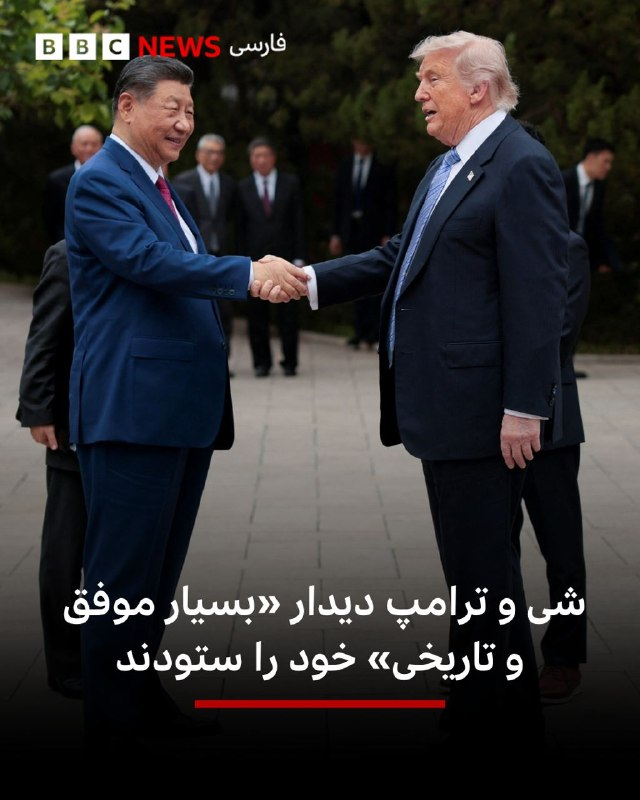

🔻اکنون گزارشی از رسانه‌های دولتی چین درباره دور نهایی گفت‌وگوها میان شی جین‌پینگ، رهبر چین و دونالد ترامپ، رئیس جمهور آمریکا در ژونگ‌نان‌های منتشر شده است.

شی جین‌پینگ این دیدار را «تاریخی و مهم» توصیف کرده و گفته است دو رهبر «جایگاه جدیدی برای روابط سازنده، استراتژیک و باثبات» میان دو کشور خود ایجاد کرده‌اند.

او در ادامه گفته است: «رئیس‌جمهور ترامپ امیدوار است آمریکا را دوباره بزرگ کند و من نیز متعهد هستم مردم چین را برای تحقق احیای عظمت ملت چین رهبری کنم» و افزوده که دو طرف باید «اجماع مهم» حاصل‌شده را اجرا کنند.

در همین حال، بر اساس روایت رسانه‌های چینی، آقای ترامپ این سفر را «بسیار موفق، شناخته‌شده در سطح جهانی و فراموش‌نشدنی» توصیف کرده و شی جین‌پینگ را «دوستی قدیمی» خوانده و گفته است: «احترام زیادی برای او قائلم.»

او همچنین گفته است که مایل است «ارتباط صمیمانه و عمیق را با شی جین‌پینگ حفظ کند و مشتاق است میزبان او در واشنگتن باشد.»

📸 Reuters

https://bbc.in/3R12525
@BBCPersian

## BBCPersian — post 281116

🔻این هفته در پرگار: سلامت روانی

🔻سلامت روانی چیست و عوامل موثر در حفظ آن چه هستند؟ سلامت روانی شاخص‌های شناخته شده‌ی جهانی دارد یا متاثر از محیط فرهنگی و اجتماعی است؟

میهمان‌ها:
نازی اکبری، متخصص در روان درمانی بین فرهنگی
رضا کاظم زاده، روانشناس بالینی
ارشیا صدیق، متخصص مغز و اعصاب

این برنامه یک بار دیگر پیش از این پخش شده است.

@BBCPersian

## BBCPersian — post 281109

🖌پاول آکسیونوف, تحلیلگر نظامی بخش روسی بی‌بی‌سی:

🔻روسیه از موفقیت‌آمیز بودن آزمایش موشک بالستیک قاره‌پیمای «سارمات» خبر داد. سرگی کاراکایف، فرمانده نیروهای موشکی راهبردی، این موضوع را در گزارشی به ولادیمیر پوتین اطلاع داده است. هم‌زمان، وزارت دفاع روسیه ویدیویی از لحظه پرتاب این موشک منتشر کرده است.

منابع مستقل غربی هنوز درباره پرتاب این موشک روسی اظهارنظر نکرده‌اند. مسیر پرواز آن نیز نامشخص است.

این دومین آزمایش موفق موشک بالستیک سنگین جدید است. نخستین پرتاب در سال ۲۰۲۲ انجام شد.

📸GettyImages/ HANDOUT/EPA/Shutterstock/ Anadolu via Getty Images/ Planet Labs/ AFP via Getty Images/ Official channel of the Russian Ministry of Defense

https://bbc.in/4395RJj
@BBCPersian

## BBCPersian — post 281108

  

🔻نارندرا مودی، نخست‌وزیر هند، روز جمعه سفر خود به پنج کشور را آغاز می‌کند؛ این سفر با ورود به امارات متحده عربی شروع می‌شود و سپس با دیدار از کشورهای اروپایی ادامه می‌یابد. این سفر در حالی انجام می‌شود که نگرانی‌ها درباره انرژی و اختلال در زنجیره تأمین به‌دلیل جنگ ایران افزایش یافته است.

اختلال در مسیر کشتیرانی در تنگه هرمز همچنان باعث نوسان در بازارهای نفت و گاز است و فشار بیشتری بر کشورهای واردکننده انرژی، از جمله هند، وارد می‌کند.

اما این سفر همچنین نشان دهنده تلاش گسترده‌تر هند برای تنوع بخشیدن به مشارکت‌های اقتصادی و استراتژیک است، در حالی که خود را به عنوان یک مرکز بزرگ تولید و فناوری معرفی می‌کند.

این سفر شش‌روزه که شامل دیدار از هلند، سوئد، نروژ و ایتالیا هم خواهد بود، پس از آن انجام می‌شود که هند و اتحادیه اروپا در ماه ژانویه یک توافق تجارت آزاد امضا کردند؛ توافقی که نارندرا مودی از آن با عنوان «مادر همه توافق‌ها» یاد کرده است.

این سفر فشرده با امارات متحده عربی آغاز می‌شود؛ کشوری که میزبان جامعه‌ حدود ۴.۵ میلیون نفری از هندی‌هاست.

📸 Getty

https://bbc.in/3R12525
@BBCPersian

## BBCPersian — post 281107

  

🔻فاطمه وحدت، نایب رئیس اتحادیه زنان کارگر سراسر ایران در مورد تاثیرات جنگ بر وضعیت اشتغال زنان گفت که در شرایط بحرانی «زنان کارگر بیشتر در معرض اخراج قرار می‌گیرند و زنانی که سرپرست خانوار هستند، بیشترین آسیب را متحمل می‌شوند.»

به گفته خانم وحدت ادامه این روند می‌تواند پیامدهای اجتماعی گسترده‌ای داشته باشد.

نایب رئیس اتحادیه زنان کارگر ضمن انتقاد از نبود حمایت کافی برای زنان کارگر تاکید کرد که «بسیاری از مسئولان از شرایط فعلی اطلاع دارند، اما نظارت جدی در این مورد وجود ندارد.»

او همچنین گفت که نشانه‌های گسترده فقر در جامعه مشهود است و برخی از مردم حتی برای خرید نان مشکل دارند.

📸 Getty

https://bbc.in/3R12525
@BBCPersian

## BBCPersian — post 281104

🔻دونالد ترامپ، رئیس جمهور آمریکا و شی جین‌پینگ،‌ رهبر چین بار دیگر امروز با هم دیدار و گفتگو کردند.

دو رهبر پیش از مذاکرات امروز صبح، در ژونگ‌نان‌های، مجتمعی که رهبری مرکزی چین در آن اقامت دارد، قدم زدند.

📸 Reuters

https://bbc.in/3R12525
@BBCPersian

## BBCPersian — post 281096

🖌نسرین حاطوم, خبرنگار بی‌بی‌سی عربی در امور خلیج فارس

🔻در پی هدف قرار گرفتن امارات با موشک‌های بالستیک و پهپاد در روزهای اخیر، که مقام‌های امارات آن را به ایران نسبت داده‌اند، تماس تلفنی بنیامین نتانیاهو، نخست‌وزیر اسرائیل، با محمد بن زاید آل نهیان، رئیس امارات متحده عربی، توجه‌ها را به خود جلب کرد.

آقای نتانیاهو در این تماس گفت که اسرائیل در کنار «نزدیک‌ترین متحدانش» ایستاده است و بر تعهد کشورش به تلاش مشترک برای صلح و امنیت تاکید کرد. بر اساس بیانیه سفارت اسرائیل در امارات، او در این گفت‌وگو حملات ایران علیه غیرنظامیان و زیرساخت‌های امارات را محکوم کرد و آن را «نقض جدی حاکمیت و تهدیدی برای ثبات منطقه‌ای» خواند.

وزارت دفاع امارات اعلام کرده بود که سامانه‌های پدافند هوایی این کشور طی روزهای گذشته چندین موشک و پهپاد ایرانی را رهگیری کرده‌اند.

📸GettyImages/ AFP via Getty Images/ NurPhoto via Getty Images/ Bloomberg via Getty Images

https://bbc.in/4dL0TbK
@BBCPersian

## Dirty_Kids — post 389484

  

هیچ کودکی نباید اول قصه‌اش از کنار قبر پدرش شروع شود…
در ایران اما این سرنوشت خیلی از کودکان است.
#علیرضا_احمدی

@Dirty_Kids 👻

## Dirty_Kids — post 389483

  

پستِ خواهرِ جاویدنام سپهر ابراهیمی نشون میده که سپهر هم یه پادشاهی خواه بود ❤️
این انقلاب و پادشاهی خواها با خونشون به ثمر میرسونن.

@Dirty_Kids 👻

## Dirty_Kids — post 389482

  

زندگی تو ایران که استرس نداره بابا
ممد ۲۰ ساله:

@Dirty_Kids 👻

## Dirty_Kids — post 389481

کاش حداقل خودمون ریده بودیم تو زندگیمون. درس خوندیم، کار کردیم، زحمت کشیدیم و نهایتا دستاوردش چی بوده؟ کیرخر

@Dirty_Kids 👻

## Dirty_Kids — post 389480

  

امیدوارم برسه به دست ترامپ.
عمویم خریت بچه ‌شیعه:

@Dirty_Kids 👻

## Hranews — post 112950

  

برخلاف پیمان‌نامه حقوق کودک؛ یک نوجوان در جریان آموزش‌های نظامی جان باخت

❗️
❗️
❗️
❗️
❗️– برخلاف تعهدات بین‌المللی ایران تحت عنوان الحاق به پیمان‌نامه حقوق #کودک و تعهدات مربوط به عدم به‌کارگیری کودکان در امور نظامی، یک پسر ۱۷ ساله در شهرستان دیر حین انجام آموزش‌های نظامی جان خود را از دست داد. رسانه‌های رسمی او را از نیروهای بسیج معرفی کردند.

ادامه مطلب

↘️
@hranews_bot تماس ✉️ - @Hranews کانال هرانا 🆑

## Hranews — post 112949

  

شیروان؛ هادی عباسیان توسط نیروهای امنیتی بازداشت شد

❗️
❗️
❗️
❗️
❗️– هادی عباسیان، شهروند اهل شهرستان شیروان روز چهارشنبه ۲۳ اردیبهشت‌ماه توسط نیروهای امنیتی بازداشت و به زندان این شهر منتقل شده است.

به گزارش خبرگزاری هرانا، ارگان خبری مجموعه فعالان حقوق بشر در ایران، هادی عباسیان بازداشت شد.

براساس اطلاعات دریافتی هرانا،‌ آقای عباسیان روز چهارشنبه ۲۳ اردیبهشت‌ماه در محله فرهنگ شهرستان شیروان بازداشت و پس از یک روز به زندان این شهر منتقل شده است.
#هادی_عباسیان

ادامه مطلب

↘️
@hranews_bot تماس ✉️ - @Hranews کانال هرانا 🆑

## Hranews — post 112948

  

آخرین داده‌های نت بلاکس نشان می‌دهد که قطع #اینترنت در ایران با گذشت ۱۸۲۴ ساعت، وارد هفتاد و هفتمین روز خود شده است. این نهاد ناظر بر وضعیت دسترسی به اینترنت در جهان همچنین اعلام کرد: این وضعیت خطری نوظهور برای سلامت روان عموم مردم ایجاد می‌کند، مردمی که عمدتاً از پلتفرم‌های آنلاین، ارتباطات و تعامل عادی با دنیای خارج جدا شده‌اند.

↘️
@hranews_bot تماس ✉️ - @Hranews کانال هرانا 🆑

## manototv — post 105478

  <a href="telegram/content/manototv_105478_1778839699.mp4" target="_blank">🎬 Download video</a>

نارندرا مودی، نخست‌وزیر هند، روز جمعه ۲۵ اردیبهشت در جریان سفر به ابوظبی، با انتشار پیامی در شبکه اجتماعی ایکس نوشت: «دوستی میان هند و امارات بسیار نیرومند است.»

مودی در این سفر با شیخ محمد بن زاید، رئیس امارات متحده عربی، دیدار کرد. محور گفتگوهای دو طرف، گسترش روابط دوجانبه، همکاری‌های انرژی، همکاری‌های دفاعی و تحولات منطقه‌ای اعلام شده است.

این سفر در شرایطی انجام می‌شود که تنش‌های منطقه‌ای و نگرانی‌ها درباره امنیت مسیرهای انرژی، اهمیت همکاری میان هند و امارات را افزایش داده است. امارات یکی از شرکای مهم هند در حوزه انرژی و تجارت به شمار می‌رود و ابوظبی و دهلی نو در سال‌های اخیر روابط اقتصادی و راهبردی خود را گسترش داده‌اند.

## manototv — post 105477

  <a href="telegram/content/manototv_105477_1778839699.mp4" target="_blank">🎬 Download video</a>

عباس عراقچی، وزیر خارجه جمهوری اسلامی، در گفتگو با رسانه دولتی هند گفت «هیچ راه‌حل نظامی‌ای وجود ندارد» و افزود ایالات متحده باید این واقعیت را درک کند.

او گفت آمریکا «دست‌کم دو بار» جمهوری اسلامی را آزموده و اکنون به این نتیجه رسیده است که «راه‌حل نظامی وجود ندارد».

عراقچی مهم‌ترین مشکل در روند کنونی را «پیام‌های متناقض» از سوی مقام‌های آمریکایی دانست و گفت این پیام‌ها از طریق اظهارنظرها، مصاحبه‌ها و مواضع مختلف دریافت می‌شود.

## manototv — post 105476

  <a href="telegram/content/manototv_105476_1778839700.mp4" target="_blank">🎬 Download video</a>

رسانه دولتی اسرائیل گزارش داد ایال زامیر، رئیس ستاد ارتش اسرائیل، در جریان جنگ با ایران به امارات متحده عربی سفر کرده است.
بر اساس این گزارش، او همراه با چند مقام نظامی اسرائیل با مقام‌های اماراتی، از جمله محمد بن زاید، رئیس امارات، دیدار کرده است. ارتش اسرائیل تاکنون واکنشی به این گزارش نشان نداده است.
این گزارش پس از آن منتشر می‌شود که بنیامین نتانیاهو نیز گفته بود در زمان جنگ به امارات سفر کرده؛ ادعایی که از سوی امارات رد شد. همچنین گزارش‌هایی درباره سفر رؤسای سازمان‌های اطلاعاتی و امنیتی اسرائیل به امارات در زمان جنگ منتشر شده است.
در همین حال، مقام‌های آمریکایی تأیید کرده‌اند اسرائیل یک سامانه پدافند موشکی را به همراه نیروهای نظامی برای راه‌اندازی آن به امارات منتقل کرده است.

## manototv — post 105475

  <a href="telegram/content/manototv_105475_1778839700.mp4" target="_blank">🎬 Download video</a>

دفتر رسانه‌ای دولت ابوظبی روز جمعه ۲۵ اردیبهشت اعلام کرد امارات متحده عربی ساخت یک خط لوله نفتی تازه را برای افزایش صادرات از مسیر فجیره تسریع می‌کند.

این پروژه قرار است تا سال ۲۰۲۷ ظرفیت صادرات نفت امارات از فجیره را دو برابر کند و توان این کشور برای دور زدن تنگه هرمز را افزایش دهد.

فجیره در ساحل دریای عمان قرار دارد و نفتکش‌ها از این مسیر می‌توانند بدون عبور از تنگه هرمز بارگیری کنند.

## manototv — post 105474

  <a href="telegram/content/manototv_105474_1778839701.mp4" target="_blank">🎬 Download video</a>

گروه ناظر اینترنتی نت‌بلاکس اعلام کرد قطعی اینترنت در ایران امروز وارد هفتادوهفتمین روز خود شده و از مرز ۱۸۲۴ ساعت گذشته است.
نت‌بلاکس هشدار داده ادامه این محدودیت‌ها می‌تواند به یک خطر فزاینده برای سلامت روان شهروندان تبدیل شود؛ شهروندانی که تا حد زیادی از پلتفرم‌های آنلاین، ارتباطات و تعامل عادی با جهان خارج محروم شده‌اند.

## manototv — post 105473

  <a href="telegram/content/manototv_105473_1778839701.mp4" target="_blank">🎬 Download video</a>

دونالد ترامپ، رئیس‌جمهوری آمریکا، پس از پایان سفر دو روزه خود به چین، روز جمعه پکن را ترک کرد.
ترامپ با هواپیمای اختصاصی ریاست‌جمهوری آمریکا «ایر فورس وان» از چین خارج شد و وانگ یی، وزیر امور خارجه چین، به همراه هیاتی دیپلماتیک او را بدرقه کرد.

## manototv — post 105472

  <a href="telegram/content/manototv_105472_1778839702.mp4" target="_blank">🎬 Download video</a>

اف‌بی‌آی اعلام کرد برای دریافت اطلاعاتی که به شناسایی و بازداشت «مونیکا ویت»، مامور سابق ضدجاسوسی و متخصص اطلاعاتی نیروی هوایی آمریکا، منجر شود ۲۰۰ هزار دلار جایزه تعیین کرده است.
بر اساس بیانیه اف‌بی‌آی، ویت بین سال‌های ۱۹۹۷ تا ۲۰۰۸ در نیروی هوایی آمریکا خدمت کرده و سپس تا سال ۲۰۱۰ به‌عنوان پیمانکار دولت آمریکا فعالیت داشته است. او به اطلاعات محرمانه و فوق‌محرمانه، از جمله هویت نیروهای مخفی جامعه اطلاعاتی آمریکا، دسترسی داشته است. مقام‌های آمریکایی می‌گویند او پس از شرکت در نشست‌هایی مرتبط با برنامه «افق نو» در تهران، به ایران پناهنده شد و اطلاعات حساسی را در اختیار جمهوری اسلامی قرار داد.
وزارت دادگستری آمریکا پیش‌تر او را به همکاری در عملیات جاسوسی سایبری، افشای اطلاعات محرمانه و به خطر انداختن جان نیروهای آمریکایی و خانواده‌هایشان متهم کرده بود. اف‌بی‌آی می‌گوید مونیکا ویت همچنان متواری است و احتمال می‌دهد افرادی از محل اختفای او اطلاع داشته باشند.

## manototv — post 105471

  <a href="telegram/content/manototv_105471_1778839703.mp4" target="_blank">🎬 Download video</a>

ارتش اسرائیل اعلام کرد در پی فعال شدن آژیر هشدار در مناطق مسد و عیلابون، یک پرتابه شلیک‌شده از خاک لبنان به سوی اسرائیل رهگیری شده است. به گفته ارتش اسرائیل، این اقدام «نقض دیگری از تفاهم‌های آتش‌بس» از سوی حزب‌الله به شمار می‌رود.
همزمان ارتش اسرائیل اعلام کرد یک سرباز این کشور شب گذشته بر اثر شلیک خمپاره حزب‌الله در جنوب لبنان کشته شده است. سرباز کشته‌شده، گروهبان دوم نگو داگان، ۲۰ ساله، از گردان دوازدهم تیپ گولانی و اهل شهرک دکل در جنوب اسرائیل معرفی شده است.
ارتش اسرائیل همچنین اعلام کرد شب گذشته سکوی پرتابی را که حزب‌الله از آن چندین راکت به سوی منطقه کریات شمونا شلیک کرده بود، در منطقه زبدین در جنوب لبنان هدف قرار داده و منهدم کرده است. به گفته ارتش، چندین ساختمان مورد استفاده حزب‌الله برای اهداف نظامی نیز در این حملات هدف قرار گرفته‌اند.

## manototv — post 105470

  <a href="telegram/content/manototv_105470_1778839704.mp4" target="_blank">🎬 Download video</a>

ویدئویی از قدم زدن دونالد ترامپ و شی جین‌پینگ در باغ‌های مجموعه حکومتی ژونگ‌نان‌های در پکن منتشر شده است.
در این ویدئو، ترامپ از رئیس‌جمهوری چین می‌پرسد: «وقتی دیگر رؤسای کشورها به دیدارتان می‌آیند، آن‌ها را هم اینجا می‌پذیرید؟»
شی جین‌پینگ در پاسخ می‌گوید: «به ندرت می‌آیند».

## manototv — post 105469

  <a href="telegram/content/manototv_105469_1778839705.mp4" target="_blank">🎬 Download video</a>

دونالد ترامپ پس از دیدار با شی جین‌پینگ اعلام کرد آمریکا و چین درباره ایران دیدگاه‌های «بسیار مشابهی» دارند و هر دو خواهان پایان تنش‌ها و باز ماندن تنگه هرمز هستند.
ترامپ گفت: «نمی‌خواهیم ایران به سلاح هسته‌ای دست پیدا کند.» او همچنین وضعیت کنونی را «دیوانه‌وار» توصیف کرد و افزود واشینگتن خواهان پایان بحران است.
رئیس‌جمهوری آمریکا همچنین با اشاره به روابط خود با شی جین‌پینگ گفت دو طرف طی سال‌های گذشته توانسته‌اند مشکلاتی را حل کنند که دیگران قادر به حل آن‌ها نبودند و تاکید کرد روابط میان واشینگتن و پکن همچنان «بسیار قوی» است.

## manototv — post 105468

  <a href="telegram/content/manototv_105468_1778839706.mp4" target="_blank">🎬 Download video</a>

مقام‌های فنلاند روز جمعه درباره فعالیت مشکوک پهپادی در منطقه پایتخت هشدار دادند و فرودگاه هلسینکی اعلام کرد پروازها به‌طور موقت متوقف شده است.
پتری اورپو، نخست‌وزیر فنلاند، در پیامی در شبکه اجتماعی ایکس اعلام کرد: «مقام‌ها در حال اقدام هستند. نیروهای مسلح نیز توان نظارتی و واکنش خود را تقویت کرده‌اند. از همه می‌خواهم اطلاعیه‌های رسمی را دنبال کنند.

## alonews — post 120134

  <a href="telegram/content/alonews_120134_1778839707.mp4" target="_blank">🎬 Download video</a>

👈حملات نیروی هوایی اسرائیل به صور "لبنان"

✅ @AloNews خبر جنگ

## alonews — post 120133

  <a href="telegram/content/alonews_120133_1778839708.webm" target="_blank">🎬 Download video</a>

👈روبیو: اگر ایران فکر می‌کند ما برای رسیدن به توافق امتیازاتی می‌دهیم، سخت در اشتباه است

✅ @AloNews خبر جنگ

## alonews — post 120132

  <a href="telegram/content/alonews_120132_1778839708.webm" target="_blank">🎬 Download video</a>

👈نت‌بلاکس: قطع اینترنت بین‌الملل در ایران به ۱۸۲۴ ساعت رسید...!

✅ @AloNews خبر جنگ

## alonews — post 120131

  <a href="telegram/content/alonews_120131_1778839708.webm" target="_blank">🎬 Download video</a>

👈شبکه «کان نیوز» امروز مدعی شد که اسرائیل و لبنان در حال نزدیک‌شدن به امضای یک توافق در واشنگتن هستند.

🔴در این گزارش ادعا شده است: «این توافق شامل عقب‌نشینی مرحله‌ای ارتش اسرائیل از جنوب در ازای اجرا یا پیشرفت چشمگیر در خلع سلاح حزب‌الله خواهد بود».

✅ @AloNews خبر جنگ

## alonews — post 120130

  <a href="telegram/content/alonews_120130_1778839708.mp4" target="_blank">🎬 Download video</a>

👈حزب‌الله فیلم عملیات ۱۲ مه خود را که با استفاده از راکت‌ها و پهپادها، تجمعات ارتش اسرائیل در جنوب لبنان را هدف قرار داده بود، منتشر کرد

✅ @AloNews خبر جنگ

## alonews — post 120129

  <a href="telegram/content/alonews_120129_1778839710.webm" target="_blank">🎬 Download video</a>

👈فرمانده کل ارتش : قدرت ایمان است که می‌تواند یک جنگنده اف-۵ را بر فراز مواضع نیروهای آمریکایی در کویت حمل کند، با وجود اینکه آن‌ها پیشرفته‌ترین سامانه‌های دفاع زمینی و هوایی را در اختیار دارند.

🔴نیروهای مسلح با تمام توان خود از تمامیت ارضی، استقلال و نظام جمهوری اسلامی ایران محافظت خواهند کرد.

✅ @AloNews خبر جنگ

## alonews — post 120128

  <a href="telegram/content/alonews_120128_1778839710.webm" target="_blank">🎬 Download video</a>

👈کرملین: روسای جمهور روسیه و چین در یک تماس تلفنی درباره نتایج سفر رئیس جمهور آمریکا به پکن گفتگو خواهند کرد.

✅ @AloNews خبر جنگ

## alonews — post 120127

  <a href="telegram/content/alonews_120127_1778839710.webm" target="_blank">🎬 Download video</a>

👈خنثی‌سازی بمب یک‌تنی در شهرستان دلفان لرستان

✅ @AloNews خبر جنگ

## alonews — post 120126

  <a href="telegram/content/alonews_120126_1778839710.webm" target="_blank">🎬 Download video</a>

👈بلومبرگ: امارات متحده عربی تلاش کرد عربستان سعودی، قطر و دیگر همسایگان خلیجی را به پیوستن به یک واکنش نظامی هماهنگ علیه ایران ترغیب کند، اما رد شد.

🔴شیخ محمد بن زاید شخصاً با محمد بن سلمان و دیگر رهبران تماس گرفت.

🔴هیچ‌کدام موافقت به مشارکت نکردند.

🔴در نهایت امارات عمدتاً به تنهایی عمل کرد

✅ @AloNews خبر جنگ

## alonews — post 120124

  <a href="telegram/content/alonews_120124_1778839710.mp4" target="_blank">🎬 Download video</a>

👈حملات امروز به کرد های عراق

✅ @AloNews خبر جنگ

## alonews — post 120123

  <a href="telegram/content/alonews_120123_1778839711.webm" target="_blank">🎬 Download video</a>

👈روزنامه گاردین با اتمام سفر رئیس جمهور آمریکا به چین در گزارشی اعلام کرد: توافق ترامپ-شی درباره ایران دست‌نیافتنی باقی ماند.

✅ @AloNews خبر جنگ

## alonews — post 120122

  <a href="telegram/content/alonews_120122_1778839712.webm" target="_blank">🎬 Download video</a>

👈کوبا اعلام کرد رئیس سازمان سیا به این کشور سفر کرده است

✅ @AloNews خبر جنگ

## alonews — post 120121

## alonews — post 120120

## alonews — post 120119

  <a href="telegram/content/alonews_120119_1778839712.webm" target="_blank">🎬 Download video</a>

👈دستگیری ۲۲۳ نفر از اتباع بیگانه غیرمجاز در زاهدان

✅ @AloNews خبر جنگ

## alonews — post 120118

  <a href="telegram/content/alonews_120118_1778839712.webm" target="_blank">🎬 Download video</a>

👈 فایننشال‌تایمز: اگر تا ماه آینده تنگهٔ هرمز باز نشود، به‌دلیل تخلیهٔ ذخایر استراتژیک شاهد موج گسترده‌تری از کمبودهای جهانی و افزایش قیمت‌ها در حوزهٔ انرژی خواهیم بود

✅ @AloNews خبر جنگ

---
📅 بروزرسانی: 1405/02/25 03:47
---

## VahidOOnLine — post 240220

  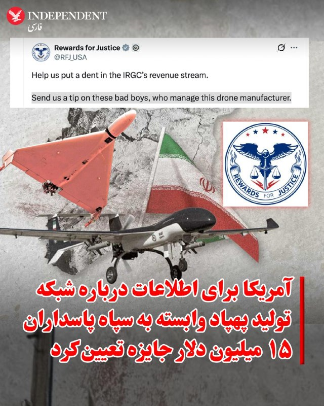

♦️ برنامه «پاداش برای عدالت» وابسته به وزارت خارجه آمریکا اعلام کرد برای دریافت اطلاعات درباره اعضا و فعالیت‌های شرکت «کیمیا پارت سیوان» (کیپاس)، که از آن به‌عنوان یکی از شبکه‌های تامین و تولید پهپاد نیروی قدس سپاه پاسداران یاد شده، تا ۱۵ میلیون دلار پاداش پرداخت می‌کند.

در اطلاعیه منتشرشده در شبکه اجتماعی اکس آمده است این پاداش به اطلاعاتی تعلق می‌گیرد که بتواند به شناسایی یا مختل کردن سازوکارهای مالی سپاه پاسداران کمک کند. ایالات متحده سپاه پاسداران را در فهرست سازمان‌های تروریستی قرار داده است.

بر اساس این بیانیه، شرکت کیپاس یکی از بازوهای تولید پهپاد نیروی قدس سپاه پاسداران به شمار می‌رود و اعضا و مقام‌های آن در آزمایش‌های پروازی پهپادها و پشتیبانی فنی پهپادهای عملیاتی نیروی قدس که به عراق منتقل شده‌اند نقش داشته‌اند.

برنامه «پاداش برای عدالت» همچنین اعلام کرد این شرکت قطعات پهپاد را از شرکت‌های خارجی تهیه می‌کرده تا در اختیار سپاه پاسداران قرار گیرد.

در بیانیه دولت آمریکا که چهارشنبه ۲۴ اردیبهشت‌ماه منتشر شد، از «حسن آرامبونژاد»، «ابوالفضل رمضان‌زاده مشکانی»، «مهدی غفاری نقنه»، «رضا نهاردانی»، «عباس سرتاجی» و «هادی جمشیدی زوارکی» به‌عنوان اعضای اصلی این شبکه نام برده شده است.

در این بیانیه آمده این افراد در توسعه، آزمایش و تامین پهپادها برای گروه‌های همسو با جمهوری اسلامی در عراق، یمن و سوریه مشارکت داشته‌اند.

وزارت خزانه‌داری آمریکا دو سال پیش شرکت کیپاس و اعضای اصلی آن را در فهرست تحریم‌های خود قرار داده بود.
‌🇸🇦 Indypersian

🤖 @VahidOOnLine

## VahidOOnLine — post 240211

هر کدام از این نام‌ها، روایت جوانی‌ست که می‌توانست زندگی کند، کار کند، عاشق شود و آینده‌ای بسازد؛ اما گلوله سرکوب مسیر زندگی‌شان را قطع کرد.
جاویدنامان انقلاب ملی ایرانیان فقط نام‌های ثبت‌شده در یک فهرست نیستند؛ حافظه زخمی نسلی‌اند که بهای آزادی را با جان خود پرداخت.<
عرفان علیزاده، علی‌اصغر محمدی چمستان، مبین فیلی، علیرضا موسی‌نیا، محمدامین قبادی، علی زنگنه، امیررضا حسنوند و محمدرضا سعیدی؛
نام‌هایی که از خیابان‌های ایران پاک نشدند و در حافظه جمعی این سرزمین باقی خواهند ماند.<
#جاویدنامان_انقلاب_ملی_ایرانیان
‌🏁 🇬🇧 IranintlTV

🤖 @VahidOOnLine

## VahidOOnLine — post 240210

  

♦️صفحه فارسی وزارت خارجه آمریکا، پنجشنبه ۲۴ اردیبهشت با انتشار پیامی اعلام کرد ایران، افغانستان، روسیه و کره شمالی در سطح ۴ هشدار سفر آمریکا، یعنی «سفر نکنید»، قرار دارند.
در این پیام آمده است این کشورها دارای شاخص خطر «بازداشت ناعادلانه شهروندان آمریکایی» هستند و شهروندان آمریکا باید پیش از رزرو سفر، هشدارهای مقصد خود را بررسی کنند.
وزارت خارجه آمریکا همچنین نوشت: «حقوق شما همراه شما سفر نمی‌کنند» و تاکید کرد سفارتخانه‌ها و کنسولگری‌های آمریکا خدمات مربوط به حمایت و حفاظت از شهروندان آمریکایی در خارج از کشور را ارائه می‌کنند.
‌🇸🇦 Indypersian

🤖 @VahidOOnLine

## VahidOOnLine — post 240209

  

♦️تام کاتن، سناتور جمهوریخواه در واکنش به موج گزارش‌هایی که اخیرا در رسانه‌های جریان اصلی آمریکا به نقل از منابع ناشناس منتشر می‌شود و در آن به دسترسی به اطلاعات جاسوسی و محرمانه اشاره می‌شود در پیامی در اکس نوشت: «چند گزارش اخیر رسانه‌ای به «اطلاعات» درباره ایران، چین و موضوعات دیگر استناد کرده‌اند. من از گیومه استفاده می‌کنم، چون این «اطلاعات» که برخلاف این خبرنگاران لیبرال، خودم آن‌ها را خوانده‌ام اغلب بر پایه چیزهایی مانند داده‌های اقتصادی در دسترس عموم، بیانیه‌های دیپلماتیک، اطلاعات وزارت کشاورزی، شبکه‌های اجتماعی و بله، گزارش‌های رسانه‌ای استوار است. به عبارت دیگر، این‌ها اطلاعات واقعی حاصل از فعالیت جاسوس‌ها یا اطلاعات محرمانه نیستند. بنابراین وقتی عناصر دولت عمیق به‌صورت گزینشی مطالبی را به رسانه‌های لیبرال درز می‌دهند که تمام پیش‌داوری‌های از سر ترس، نرمش‌طلبانه و ضدآمریکایی آن‌ها را تایید می‌کند، پیشنهاد می‌کنم با دیده تردید به آن نگاه کنید»
‌🇸🇦 Indypersian

🤖 @VahidOOnLine

## VahidOOnLine — post 240208

  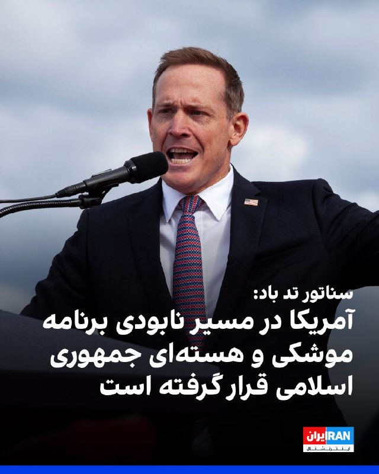

تد باد، سناتور جمهوری‌خواه آمریکا، در حساب کاربری خود در ایکس نوشت جمهوری اسلامی بیش از ۴۷ سال به آمریکا و متحدانش حمله کرده و شهروندان آمریکایی را کشته است.
تد باد افزود در حالی که روسای‌جمهوری پیشین این موضوع را به تعویق می‌انداختند، دونالد ترامپ، رییس‌جمهوری آمریکا، در حال انجام کاری است که آن‌ها حاضر به انجامش نبودند.
او در عین حال تاکید کرد که آمریکا اکنون «در مسیری قرار گرفته که می‌تواند تهدید موشک‌های بالستیک و برنامه غنی‌سازی هسته‌ای جمهوری اسلامی را برای همیشه از بین ببرد.»

‌🏁 🇬🇧 IranintlTV

🤖 @VahidOOnLine

## VahidOOnLine — post 240207

  

گزارش‌ها حاکی است یک کشتی لنگر انداخته در نزدیکی بندر فجیره امارات متحده عربی توسط افراد ناشناس سوار شده و به سمت آب‌های ایران هدایت شده است.
به گزارش رویترز، شرکت امنیت دریایی وندگارد گفته است این اقدام احتمالا از سوی نیروهای ایرانی انجام شده و پیش از آن نیز نهاد دریایی «یو‌کی‌ام‌تی‌او»از ورود افراد غیرمجاز به این کشتی خبر داده بود.
هم‌زمان منابع دریایی از افزایش تحرکات در تنگه هرمز خبر داده‌اند. بر اساس گزارش‌ها، چندین کشتی از جمله نفتکش‌ها و کشتی‌های تجاری در روزهای اخیر با هماهنگی‌های محدود از این مسیر عبور کرده‌اند، در حالی که پیش‌تر تعداد عبور روزانه به شکل محسوسی کاهش یافته بود.
همچنین گزارش شده است نیروهای سپاه پاسداران اعلام کرده‌اند شمار بیشتری از شناورها در روزهای اخیر از تنگه هرمز عبور کرده‌اند؛ موضوعی که نشان‌دهنده تغییر تدریجی در وضعیت عبور و مرور دریایی در این آبراه راهبردی است.

‌🏁 🇬🇧 IranintlTV

🤖 @VahidOOnLine

## VahidOOnLine — post 240206

  

♦️دونالد ترامپ، رئیس‌جمهوری آمریکا، پنجشنبه شب با انتشار پیامی در شبکه اجتماعی «تروث سوشال» اعلام کرد روند «تضعیف نظامی جمهوری اسلامی» که به گفته او در دوره ریاست‌جمهوری‌اش آغاز شده، ادامه خواهد یافت.
ترامپ در این پیام، در کنار اشاره به آنچه دستاوردهای اقتصادی و نظامی دولت خود خواند، از «نابودی نظامی جمهوری اسلامی» نام برد و نوشت این روند «ادامه خواهد داشت».
او همچنین نوشت دولتش آمریکا را دوباره به یک قدرت اقتصادی و نظامی تبدیل کرده است
‌🇸🇦 Indypersian

🤖 @VahidOOnLine

## VahidOOnLine — post 240205

  

♦️اسکات بسنت، وزیر خزانه‌داری ایالات متحده، در گفتگو با شبکه سی‌ان‌بی‌سی گفت جمهوری اسلامی به‌دلیل فشارهای اقتصادی و محدودیت صادرات نفت، در «آخرین مراحل ضعف و فروپاشی» قرار دارد.

او با اشاره به محاصره بنادر جنوبی ایران از سوی آمریکا و تاسیسات نفتی جزیره خارک گفت: «در سه روز گذشته هیچ بارگیری‌ای انجام نشده است. ما معتقدیم مخازن ذخیره‌سازی آنها پر شده و دیگر نمی‌توانند نفت را روی آب ذخیره کنند. هیچ کشتی‌ای خارج یا وارد نمی‌شود و به‌زودی مجبور خواهند شد تولید نفت را کاهش دهند.»

بسنت افزود تصاویر ماهواره‌ای نشان می‌دهد این روند در حال وقوع است و تاکید کرد: «این یک حکومت شیطانی است. تا اینجای سال، بین ۳۰ تا ۴۰ هزار نفر را کشته‌اند که بسیاری از آنها معترضان مسالمت‌آمیز بوده‌اند.»

وزیر خزانه‌داری آمریکا گفت: «چگونه با چنین حکومتی برخورد می‌کنید؟ از نظر اقتصادی آن را تحت فشار قرار می‌دهید و ما معتقدیم به نقطه‌ای رسیده‌اند که سربازانشان حقوق دریافت نمی‌کنند و قادر نیستند ذخایر تسلیحاتی خود را از خارج تامین کنند.»

او در پایان گفت محاصره‌ای که دونالد ترامپ علیه جمهوری اسلامی اعمال کرده «موفقیتی بزرگ و قاطع» بوده است.
‌🇸🇦 Indypersian

🤖 @VahidOOnLine

## VahidOOnLine — post 240204

  

♦️مجلس نمایندگان آمریکا برای سومین بار به طرحی رای منفی داد که هدف آن محدود کردن اختیارات نظامی دونالد ترامپ در قبال ایران بود. این طرح که از سوی دموکرات‌ها ارائه شده بود، با نتیجه  ۲۱۲ رای موافق در برابر ۲۱۲ رای مخالف و به دلیل به حد نصاب نرسیدن آرا شکست خورد.
به گزارش سی‌بی‌اس، بر اساس این طرح، رئیس‌جمهوری آمریکا موظف می‌شد حداکثر ظرف ۳۰ روز پس از آغاز درگیری‌ها، نیروهای آمریکایی را از جنگ خارج کند؛ مگر اینکه کنگره مجوز ادامه عملیات را صادر کند.
جاش گاتهیمر، نماینده دموکرات نیوجرسی، در جریان جلسه بررسی این طرح گفت از اقدام دولت ترامپ علیه جمهوری اسلامی حمایت می‌کند، اما از اینکه دولت بدون ارائه توضیحات رسمی به کنگره عمل کرده، انتقاد کرد.
این رای‌گیری در شرایطی انجام شد که دولت ترامپ اعلام کرده آتش‌بس میان آمریکا و جمهوری اسلامی، مهلت قانونی ۶۰ روزه تعیین‌شده در قانون اختیارات جنگی را متوقف کرده است.
‌🇸🇦 Indypersian

🤖 @VahidOOnLine

## VahidOOnLine — post 240203

  

دونالد ترامپ، رییس‌جمهوری آمریکا، در پستی در شبکه اجتماعی تروث سوشال تاکید کرد «تضعیف نظامی حکومت ایران» در دوره دولت او است که انجام شده است.
ترامپ این موفقیت را در کنار مجموعه‌ای از دستاوردهای دولت خود ذکر و تاکید کرد این روند درباره جمهوری اسلامی همچنان «ادامه خواهد داشت».

‌🏁 🇬🇧 IranintlTV

🤖 @VahidOOnLine

## VahidOOnLine — post 240202

  

تام کاتن، سناتور جمهوری‌خواه آمریکا، در حساب کاربری ایکس خود نوشت «توافق‌های فاجعه‌بار» دوران باراک اوباما مسیر جاه‌طلبی‌های هسته‌ای جمهوری اسلامی را هموار کرد، اما ترامپ به این جاه‌طلبی‌ها پایان داد.
این سناتور نزدیک به دونالد ترامپ همچنین گفت: جمهوری اسلامی اکنون نسبت به ۱۰ ماه پیش «به‌مراتب ضعیف‌تر» شده است.

‌🏁 🇬🇧 IranintlTV

🤖 @VahidOOnLine

## VahidOOnLine — post 240201

  

مجلس نمایندگان آمریکا برای سومین بار به طرحی رای منفی داد که هدف آن محدود کردن اختیارات نظامی دونالد ترامپ در قبال حکومت ایران بود. این طرح در قالب قطعنامه‌ای از سوی دموکرات‌ها ارائه شده بود.
رای‌گیری روز پنجشنبه با نتیجه ۲۱۲ در برابر ۲۱۲ به تساوی رسید و در نهایت با اختلاف یک رای نتوانست به اکثریت لازم برسد و رد شد.
این سومین بار است که چنین ابتکاری برای مهار اختیارات نظامی رییس‌جمهوری در مجلس نمایندگان آمریکا شکست می‌خورد.
در جریان بررسی این طرح، جو گاتهایمر، نماینده دموکرات ایالت نیوجرسی، گفت از فشار بر حکومت ایران حمایت می‌کند اما دولت را به نگه داشتن کنگره «در تاریکی» بدون جلسات توجیهی رسمی، متهم کرد.

‌🏁 🇬🇧 IranintlTV

🤖 @VahidOOnLine

## WithYashar — post 11253

https://t.me/boost/withyashar

## WithYashar — post 11252

آقا ما استیکر حامله میخوایم

## WithYashar — post 11251

ترامپ در تروث : «وقتی رئیس‌جمهور شی با بیانی بسیار سنجیده از ایالات متحده به‌عنوان کشوری که شاید در حال افول باشد یاد کرد، منظور او آسیب عظیمی بود که ما در چهار سال دوران جو بایدنِ خواب‌آلود و دولت بایدن متحمل شدیم؛ و در این مورد، او صددرصد درست می‌گفت.

کشور ما با مرزهای باز، مالیات‌های سنگین، ترویج تغییر جنسیت برای همه، حضور مردان در ورزش زنان، سیاست‌های موسوم به تنوع و شمول، توافق‌های تجاری وحشتناک، جرم و جنایت گسترده و بسیاری مسائل دیگر، آسیب غیرقابل‌تصوری دید!
@withyashar
رئیس‌جمهور شی به هیچ‌وجه به رشد شگفت‌انگیزی اشاره نمی‌کرد که ایالات متحده در طول شانزده ماه فوق‌العاده دولت ترامپ به جهان نشان داده است؛ دورانی که شامل رکورد تاریخی بازار بورس و صندوق‌های بازنشستگی، پیروزی نظامی و روابط شکوفا با ونزوئلا، درهم‌کوبیدن نظامی ایران (ادامه دارد!)، قدرتمندترین ارتش جهان با اختلاف بسیار زیاد، تبدیل دوباره آمریکا به یک قدرت اقتصادی عظیم، جذب رکورد هجده تریلیون دلار سرمایه‌گذاری خارجی در آمریکا، بهترین بازار کار تاریخ ایالات متحده با بیشترین تعداد شاغلان تاریخ کشور، پایان دادن به سیاست‌های ویرانگر موسوم به تنوع و شمول و بسیاری موفقیت‌های دیگر بوده که فهرست کردن همه آنها ممکن نیست.

در حقیقت، رئیس‌جمهور شی بابت این همه موفقیت بزرگ در چنین مدت کوتاهی به من تبریک گفت.

دو سال پیش، ما واقعاً کشوری در حال افول بودیم. در این مورد کاملاً با رئیس‌جمهور شی موافقم! اما حالا ایالات متحده داغ‌ترین و پررونق‌ترین کشور جهان است و امیدوارم رابطه ما با چین از همیشه قوی‌تر و بهتر باشد!»
@withyashar

## WithYashar — post 11250

فاکس نیوز : تو سفر ترامپ، بین مأموران سرویس مخفی آمریکا و پلیس چین، تنش ایجاد شده و درگیری لفظی و حتی فیزیکی هم پیش اومده.
@withyashar

## WithYashar — post 11249

  

کت کش ها در مراسم اربعین کتلت سرلشکر سیدعبدالرحیم موسوی در قم
@withyashar

## WithYashar — post 11248

  <a href="telegram/content/WithYashar_11248_1778804246.mp4" target="_blank">🎬 Download video</a>

‏ترامپ به دلیل مرگ برادر بزرگترش که بر اثر نوشیدن الکل جانش را از دست داد ،مشروب نمیخوره ،ولی اینجا جرعه‌ای از آن را مینوشه و به نشانه احترام به رئیس جمهور شی جین پینگ
‏ولی داشت بالا می‌آورد
@withyashar

## mwarmonitor — post 9104

🇨🇳شی جین پینگ: رئیس‌جمهور ترامپ، از ملاقات با شما در پکن بسیار خوشحالم. پس از نه سال، به چین خوش آمدید. تمام دنیا نظاره‌گر ملاقات ما هستند. در حال حاضر، دگرگونی‌هایی که در یک قرن اخیر دیده نشده، در سراسر جهان در حال شتاب گرفتن است و وضعیت بین‌المللی متغیر…

## mwarmonitor — post 9103

🇨🇳شی جین پینگ: رئیس‌جمهور ترامپ، از ملاقات با شما در پکن بسیار خوشحالم. پس از نه سال، به چین خوش آمدید.
تمام دنیا نظاره‌گر ملاقات ما هستند. در حال حاضر، دگرگونی‌هایی که در یک قرن اخیر دیده نشده، در سراسر جهان در حال شتاب گرفتن است و وضعیت بین‌المللی متغیر و پر از تلاطم است. جهان به یک دوراهی جدید رسیده است.
آیا چین و ایالات متحده می‌توانند بر **«تله توسیدید» غلبه کنند؟
آیا می‌توانیم الگوی جدیدی از روابط میان کشورهای بزرگ ایجاد کنیم؟
آیا می‌توانیم با هم با چالش‌های جهانی مقابله کرده و ثبات بیشتری برای جهان فراهم کنیم؟
آیا می‌توانیم در راستای رفاه دو ملت و آینده بشریت، آینده‌ای روشن‌تر برای روابط دوجانبه‌مان بسازیم؟ این‌ها سوالات حیاتی برای تاریخ، جهان و مردم هستند. این‌ها سوالات زمانه ما هستند که من و شما به عنوان رهبران کشورهای بزرگ باید به آن‌ها پاسخ دهیم.
امسال دویست و پنجاهمین سالگرد استقلال آمریکا است. این مناسبت را به شما و مردم آمریکا تبریک می‌گویم. من همیشه معتقدم که منافع مشترک دو کشور ما بیشتر از اختلافاتمان است.
موفقیت در یکی، فرصتی برای دیگری است و یک رابطه دوجانبه پایدار به نفع جهان است.
چین و ایالات متحده هر دو از همکاری سود می‌برند و از تقابل آسیب می‌بینند. ما باید شریک باشیم، نه رقیب. باید به موفقیت یکدیگر کمک کنیم و با هم شکوفا شویم و راه صحیح تعامل کشورهای بزرگ با یکدیگر را در عصر جدید بیابیم.
آقای رئیس‌جمهور، من مشتاقانه منتظر گفتگوهایمان درباره مسائل مهم برای دو کشور و جهان هستم. همچنین مشتاق همکاری با شما برای تعیین مسیر و هدایت کشتی عظیم روابط چین و آمریکا هستم تا سال ۲۰۲۶ را به یک سال تاریخی و ماندگار تبدیل کنیم که فصل جدیدی در روابط دو کشور باز می‌کند.
در اینجا مکث می‌کنم و سخن را به شما می‌سپارم، آقای رئیس‌جمهور. متشکرم.

**«تله توسیدید» (Thucydides Trap) یک اصطلاح در علوم سیاسی و روابط بین‌الملل است که به وضعیتی خطرناک اشاره دارد: وقتی یک قدرت نوظهور (مثل چین) تهدیدی برای جایگزینی یک قدرت حاکم (مثل آمریکا) ایجاد می‌کند، احتمال وقوع جنگ بین آن‌ها بسیار بالا می‌رود.

@mwarmonitor

## mwarmonitor — post 9102

  <a href="telegram/content/mwarmonitor_9102_1778804249.mp4" target="_blank">🎬 Download video</a>

🎬 Video

## mwarmonitor — post 9101

🔴ترامپ در سوشال تروث

زمانی که پرزیدنت شی (رئیس‌جمهور چین) خیلی باظرافت به ایالات متحده به عنوان کشوری اشاره کرد که شاید در حال زوال باشد، منظورش آسیب‌های عظیمی بود که ما طی چهار سالِ «جوی بایدن خواب‌آلود» و دولت بایدن متحمل شدیم؛ و در این مورد، او ۱۰۰ درصد درست می‌گفت. کشور ما با مرزهای باز، مالیات‌های بالا، [ترویج] تراجنسیتی برای همه، حضور مردان در ورزش‌های زنان، DEI (برنامه‌های تنوع، برابری و فراگیری)، قراردادهای تجاری وحشتناک، جرم و جنایت افسارگسیخته و موارد بسیار دیگر، آسیب‌های بی‌شماری دید!
پرزیدنت شی به رشد فوق‌العاده‌ای که ایالات متحده طی ۱۶ ماه درخشانِ دولت ترامپ به جهان نشان داده است، اشاره نمی‌کرد؛ دوره‌ای که شامل اوج‌گیری همیشگی بازار سهام و حساب‌های بازنشستگی (401K)، پیروزی نظامی و رابطه شکوفا در ونزوئلا، و درهم‌کوبیدن نظامی ایران (ادامه دارد!) بود — قوی‌ترین ارتش روی زمین با فاصله زیاد، تبدیل شدن دوباره به یک قدرت اقتصادی با رکورد ۱۸ تریلیون دلار سرمایه‌گذاری دیگران در ایالات متحده، بهترین بازار کار در تاریخ ایالات متحده با بیشترین تعداد افراد شاغل در کشور نسبت به هر زمان دیگری، پایان دادن به طرح‌های مخرب کشور (DEI) و بسیاری چیزهای دیگر که فهرست کردن سریع آن‌ها غیرممکن است. در واقع، پرزیدنت شی بابت موفقیت‌های عظیمِ بسیار در چنین مدت کوتاهی به من تبریک گفت.
دو سال پیش، ما در واقع ملتی در حال زوال بودیم. در این مورد، من کاملاً با پرزیدنت شی موافقم! اما اکنون، ایالات متحده جذاب‌ترین (داغ‌ترین) کشور در هر کجای جهان است و امیدوارم رابطه ما با چین قوی‌تر و بهتر از همیشه باشد!

@mwarmonitor

## FoxNewsTwitter — post 341757

  

Fox News (Twitter/X)

FOX NEWS REPORT: President Trump and President Xi Jinping sat for an over two-hour meeting in Beijing for a discussion on key topics, including trade and Taiwan.

Secretary of State Rubio says Washington's stance on Taiwan remains the same, @BillMelugin_ reports.

## FoxNewsTwitter — post 341756

  

Fox News (Twitter/X)

NEW: President Trump says China’s leader was right about America’s decline under President Biden — but argues the U.S. has completely rebounded under his administration.

In a lengthy post, Trump touted booming markets, record investment, the "ending" of DEI, and what he called the “strongest military on earth by far,” while predicting a stronger relationship with China moving forward.

## FoxNewsTwitter — post 341755

  <a href="telegram/content/FoxNewsTwitter_341755_1778804253.mp4" target="_blank">🎬 Download video</a>

Fox News (Twitter/X)

“People can’t feed themselves.”

AOC ripped the Trump administration over spending on the National Mall reflecting pool and the planned White House ballroom, arguing that Americans are struggling to afford groceries, rent, and mortgages.

She called the priorities “deeply out of touch” and “insulting” to everyday people.

## pm_afshaa — post 90763

  <a href="telegram/content/pm_afshaa_90763_1778804255.webm" target="_blank">🎬 Download video</a>

🔴مجلس آمریکا امروز طرحی رو با عنوان «توقف جنگ علیه ایران» رای گیری کرد که این طرح با 212 رای موافق و 212 رای مخالف تصویب نشد.

💧 Rainbet.com the #1 Non-KYC Crypto Casino & Sportsbook @rainbetcom

😁 @Pm_Afshaa

## pm_afshaa — post 90762

  <a href="telegram/content/pm_afshaa_90762_1778804256.webm" target="_blank">🎬 Download video</a>

🔴کان نیوز: مقامات ارشد ارتش اسرائیل و سنتکام هفته گذشته جلسه داشتن و منتظرن ببینن فردا ترامپ بعد اتمام سفرش چه تصمیمی میگیره.

💧 Rainbet.com the #1 Non-KYC Crypto Casino & Sportsbook @rainbetcom

😁 @Pm_Afshaa

## pm_afshaa — post 90761

  <a href="telegram/content/pm_afshaa_90761_1778804257.webm" target="_blank">🎬 Download video</a>

🔴عزیزی، رئیس کمیسیون امنیت ملی و سیاست خارجی: پیش بینی کردیم هرکس که ترامپ رو به قتل برسونه، 50 میلیون یورو پاداش دریافت کنه.

💧 Rainbet.com the #1 Non-KYC Crypto Casino & Sportsbook @rainbetcom

😁 @Pm_Afshaa

## pm_afshaa — post 90760

  <a href="telegram/content/pm_afshaa_90760_1778804257.webm" target="_blank">🎬 Download video</a>

🔴نتانیاهو: خطر وجودی بمب اتمی و موشک‌های بالستیک رو از خودمون دور کردیم. اگه این کار رو نمی‌کردیم، امروز جمهوری اسلامی یه بمب اتمی داشت.

💧 Rainbet.com the #1 Non-KYC Crypto Casino & Sportsbook @rainbetcom

😁 @Pm_Afshaa

## pm_afshaa — post 90759

  <a href="telegram/content/pm_afshaa_90759_1778804258.webm" target="_blank">🎬 Download video</a>

🔴نتانیاهو: دشمنان ما به دنبال نابودی همه ما هستند؛ همه ما آنها بین راست و چپ، سکولار و مذهبی، یهودی و عرب تفاوتی قائل نمیشن.

اورشلیم رو تحت حاکمیت اسرائیل برای همیشه حفظ خواهیم کرد.

💧 Rainbet.com the #1 Non-KYC Crypto Casino & Sportsbook @rainbetcom

😁 @Pm_Afshaa

## DEJradio — post 4637

  <a href="telegram/content/DEJradio_4637_1778804259.mp4" target="_blank">🎬 Download video</a>

🚨
🔸 خبر ۲۱
پنجشنبه ۲۴ اردیبهشت ۱۴۰۵

#خبر۲۱
@DEJradio

## mamlekate — post 103526

  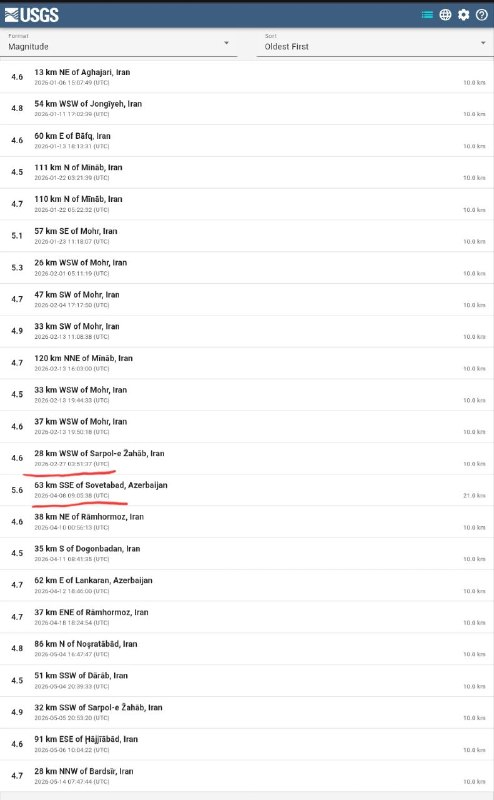

❓ جنگ اخیر، ۲۸ فوریه شروع شد و تا آتش‌بس یعنی ۸ آپریل ادامه پیدا کرد. این لیست تمامی زلزله‌های بالای ۴.۵ ریشتر تو ایران توی سایت USGS از ابتدای سال ۲۰۲۶ میلادی هست. دقیقا از تاریخ ۲۸ فوریه تا ۸ آپریل زلزله‌ای با شدت ۴.۵ و بیشتر ثبت نشده، ولی تعداد زیادی قبل و بعدش وجود داره. این همزمانی اگر چه می‌تونه «تصادفی» باشه اما می‌تونه هم مربوط به «فعالیت‌های جمهوری اسلامی» توی این بازه باشه.

@mamlekate

## VahidOnline — post 75470

  

ترامپ: منظور رئیس‌جمهور چین از آمریکای در حال افول، دوران بایدن بود

ترجمه ماشین: وقتی رئیس‌جمهور شی با ظرافت بسیار از ایالات متحده به‌عنوان کشوری که شاید در حال افول باشد یاد کرد، منظور او خسارت عظیمی بود که ما در چهار سال دوران جو بایدن خواب‌آلود و دولت بایدن متحمل شدیم؛ و از این نظر، او ۱۰۰ درصد درست می‌گفت. کشور ما با مرزهای باز، مالیات‌های بالا، تراجنسیتی‌سازی برای همه، حضور مردان در ورزش زنان، DEI، توافق‌های تجاری وحشتناک، جرم و جنایت گسترده و بسیاری چیزهای دیگر، به‌شدت آسیب دید!

رئیس‌جمهور شی به خیزش شگفت‌انگیزی اشاره نمی‌کرد که ایالات متحده در ۱۶ ماه تماشایی دولت ترامپ به جهان نشان داده است؛ از جمله رکوردهای تاریخی در بازار سهام و حساب‌های بازنشستگی 401K، پیروزی نظامی و روابط شکوفا در ونزوئلا، نابودی نظامی ایران — که ادامه خواهد داشت! — قدرتمندترین ارتش روی زمین با فاصله‌ای بسیار زیاد، تبدیل دوباره آمریکا به یک ابرقدرت اقتصادی، با سرمایه‌گذاری بی‌سابقه ۱۸ تریلیون دلاری دیگران در ایالات متحده، بهترین بازار کار تاریخ آمریکا، با شمار افرادی که اکنون در ایالات متحده کار می‌کنند بیش از هر زمان دیگری، پایان دادن به DEI ویرانگر کشور، و آن‌قدر دستاوردهای دیگر که فهرست کردن فوری آن‌ها ناممکن است. در واقع، رئیس‌جمهور شی به‌خاطر موفقیت‌های عظیم بسیار در چنین مدت کوتاهی به من تبریک گفت.

دو سال پیش، ما در واقع ملتی در حال افول بودیم. در این مورد، من کاملاً با رئیس‌جمهور شی موافقم! اما اکنون، ایالات متحده داغ‌ترین کشور در هر جای جهان است، و امیدوارم رابطه ما با چین از همیشه قوی‌تر و بهتر شود!
realDonaldTrump

📡 @VahidOnline

## VahidOnline — post 75469

  

همزمان با سفر «دونالد ترامپ» رییس‌جمهور آمریکا به چین، رهبران ۲۶کشور دیگر نیز روز پنجشنبه ۲۴اردیبهشت۱۴۰۵ در بیانیه‌ای مشترک خواهان بازگشت وضعیت عادی دریانوردی در تنگه هرمز شدند.

این بیانیه که توسط کشورهایی مانند بریتانیا، فرانسه، بحرین، کانادا، آلمان، ژاپن، قطر و کره جنوبی امضا شده است بر «تعهد خود به استفاده از ظرفیت‌های جمعی دیپلماتیک، اقتصادی و نظامی برای حمایت از آزادی ناوبری در تنگه هرمز» تأکید کردند.

در این بیانیه آمده است: «کشتیرانی باید آزاد باشد، مطابق با مفاد کنوانسیون سازمان ملل متحد درباره حقوق دریاهاو حقوق بین‌الملل.»
@VahidHeadline

📡 @VahidOnline

## IranIntlTV — post 337249

  <a href="telegram/content/IranIntlTV_337249_1778804264.mp4" target="_blank">🎬 Download video</a>

اینترنت؛ رانت تازهٔ جمهوری اسلامی
شرط دسترسی به اینترنت: انتشار تصاویر خامنه‌ای

در حالی‌ که قطع و محدودیت اینترنت خسارت‌های سنگینی به زندگی و کسب‌وکار مردم وارد کرده، حکومت نه‌تنها محدودیت‌ها را کاهش نداده، بلکه با طرح‌هایی مانند «اینترنت پرو» و «سیم‌کارت سفید»، نگرانی‌ها دربارهٔ اینترنت طبقاتی را افزایش داده است.

گزارش‌هایی منتشر شده که نشان می‌دهد برخی شهروندان، پس از انتقاد از حکومت یا فعالیت در شبکه‌های اجتماعی، با قطع سیم‌کارت و اینترنت مواجه شده‌اند و برای وصل دوباره، مجبور به ارائهٔ تعهد یا فعالیت حمایتی به نفع حکومت شده‌اند.

جمهوری اسلامی اینترنت را به ابزاری برای کنترل سیاسی و سنجش وفاداری شهروندان تبدیل کرده است؛ وضعیتی که برای بسیاری از مردم فقط یک معنا دارد:
هرجا اینترنت نیست، آزادی هم نیست.

کامبیز حسینی در «برنامه» به این موضوع می‌پردازد.

«یک ایران صدای شما را می‌شنود»
دوشنبه تا پنجشنبه ۱۱ شب تهران
از تلویزیون ایران اینترنشنال

تماشای نسخه کامل این قسمت از «برنامه» در یوتیوب:
https://youtu.be/9CC8wX4Bim0
@iranintltv

## IranIntlTV — post 337240

هر کدام از این نام‌ها، روایت جوانی‌ست که می‌توانست زندگی کند، کار کند، عاشق شود و آینده‌ای بسازد؛ اما گلوله سرکوب مسیر زندگی‌شان را قطع کرد.
جاویدنامان انقلاب ملی ایرانیان فقط نام‌های ثبت‌شده در یک فهرست نیستند؛ حافظه زخمی نسلی‌اند که بهای آزادی را با جان خود پرداخت.
عرفان علیزاده، علی‌اصغر محمدی چمستان، مبین فیلی، علیرضا موسی‌نیا، محمدامین قبادی، علی زنگنه، امیررضا حسنوند و محمدرضا سعیدی؛
نام‌هایی که از خیابان‌های ایران پاک نشدند و در حافظه جمعی این سرزمین باقی خواهند ماند.
#جاویدنامان_انقلاب_ملی_ایرانیان

## IranIntlTV — post 337239

  <a href="telegram/content/IranIntlTV_337239_1778804266.mp4" target="_blank">🎬 Download video</a>

مریم از پاریس: نگران حال فاطمه سپهری هستم و امیدوارم پوشش خبری بیشتری درباره ایشان داده شود

«یک ایران صدای شما را می‌شنود»
دوشنبه تا پنجشنبه ۱۱ شب تهران
از تلویزیون ایران اینترنشنال

تماشای نسخه کامل این قسمت از «برنامه» در یوتیوب:
https://youtu.be/9CC8wX4Bim0
@iranintltv

## IranIntlTV — post 337238

  <a href="telegram/content/IranIntlTV_337238_1778804268.mp4" target="_blank">🎬 Download video</a>

دریا از لندن: با زور و اعتراف اجباری، زندانی بی‌گناه را به اعدام محکوم می‌کنند

«یک ایران صدای شما را می‌شنود»
دوشنبه تا پنجشنبه ۱۱ شب تهران
از تلویزیون ایران اینترنشنال

تماشای نسخه کامل این قسمت از «برنامه» در یوتیوب:
https://youtu.be/9CC8wX4Bim0
@iranintltv

## IranIntlTV — post 337237

  <a href="telegram/content/IranIntlTV_337237_1778804270.mp4" target="_blank">🎬 Download video</a>

عسل از اصفهان: جنگ اوضاع را تغییر نداد؛ حالا خودمان باید تغییرش بدهیم

«یک ایران صدای شما را می‌شنود»
دوشنبه تا پنجشنبه ۱۱ شب تهران
از تلویزیون ایران اینترنشنال

تماشای نسخه کامل این قسمت از «برنامه» در یوتیوب:
https://youtu.be/9CC8wX4Bim0
@iranintltv

## IranIntlTV — post 337236

  <a href="telegram/content/IranIntlTV_337236_1778804272.mp4" target="_blank">🎬 Download video</a>

سهراب از تهران: «درود بر وی‌پی‌ان‌فروشِ حلال‌خور!»

«یک ایران صدای شما را می‌شنود»
دوشنبه تا پنجشنبه ۱۱ شب تهران
از تلویزیون ایران اینترنشنال

تماشای نسخه کامل این قسمت از «برنامه» در یوتیوب:
https://youtu.be/9CC8wX4Bim0
@iranintltv

## IranIntlTV — post 337235

  <a href="telegram/content/IranIntlTV_337235_1778804274.mp4" target="_blank">🎬 Download video</a>

امیر از چالوس: حواستان به سلامت روانتان باشد؛ ایران با شهروندان افسرده آباد نمی‌شود

«یک ایران صدای شما را می‌شنود»
دوشنبه تا پنجشنبه ۱۱ شب تهران
از تلویزیون ایران اینترنشنال
تماشای نسخه کامل این قسمت از «برنامه» در یوتیوب:
https://youtu.be/9CC8wX4Bim0
@iranintltv

## IranIntlTV — post 337234

  

تد باد، سناتور جمهوری‌خواه آمریکا، در حساب کاربری خود در ایکس نوشت جمهوری اسلامی بیش از ۴۷ سال به آمریکا و متحدانش حمله کرده و شهروندان آمریکایی را کشته است.
تد باد افزود در حالی که روسای‌جمهوری پیشین این موضوع را به تعویق می‌انداختند، دونالد ترامپ، رییس‌جمهوری آمریکا، در حال انجام کاری است که آن‌ها حاضر به انجامش نبودند.
او در عین حال تاکید کرد که آمریکا اکنون «در مسیری قرار گرفته که می‌تواند تهدید موشک‌های بالستیک و برنامه غنی‌سازی هسته‌ای جمهوری اسلامی را برای همیشه از بین ببرد.»

https://iranintl.com/202605147923

## IranIntlTV — post 337233

  

گزارش‌ها حاکی است یک کشتی لنگر انداخته در نزدیکی بندر فجیره امارات متحده عربی توسط افراد ناشناس سوار شده و به سمت آب‌های ایران هدایت شده است.
به گزارش رویترز، شرکت امنیت دریایی وندگارد گفته است این اقدام احتمالا از سوی نیروهای ایرانی انجام شده و پیش از آن نیز نهاد دریایی «یو‌کی‌ام‌تی‌او»از ورود افراد غیرمجاز به این کشتی خبر داده بود.
هم‌زمان منابع دریایی از افزایش تحرکات در تنگه هرمز خبر داده‌اند. بر اساس گزارش‌ها، چندین کشتی از جمله نفتکش‌ها و کشتی‌های تجاری در روزهای اخیر با هماهنگی‌های محدود از این مسیر عبور کرده‌اند، در حالی که پیش‌تر تعداد عبور روزانه به شکل محسوسی کاهش یافته بود.
همچنین گزارش شده است نیروهای سپاه پاسداران اعلام کرده‌اند شمار بیشتری از شناورها در روزهای اخیر از تنگه هرمز عبور کرده‌اند؛ موضوعی که نشان‌دهنده تغییر تدریجی در وضعیت عبور و مرور دریایی در این آبراه راهبردی است.

https://iranintl.com/202605147292

## IranIntlTV — post 337232

  <a href="telegram/content/IranIntlTV_337232_1778804278.mp4" target="_blank">🎬 Download video</a>

پنج هفته پس از نصب دیوارنگاره‌ای با نشان جمهوری اسلامی و در حمایت از سپاه پاسداران در محله وست‌وود لس‌آنجلس، واکنش‌ها در میان ایرانیان ساکن این منطقه ادامه دارد.

گزارش نیلوفر منصوری، خبرنگار ایران‌اینترنشنال
@iranintltv

## IranIntlTV — post 337231

  

دونالد ترامپ، رییس‌جمهوری آمریکا، در پستی در شبکه اجتماعی تروث سوشال تاکید کرد «تضعیف نظامی حکومت ایران» در دوره دولت او است که انجام شده است.
ترامپ این موفقیت را در کنار مجموعه‌ای از دستاوردهای دولت خود ذکر و تاکید کرد این روند درباره جمهوری اسلامی همچنان «ادامه خواهد داشت».

https://iranintl.com/202605148199

## IranIntlTV — post 337230

  

تام کاتن، سناتور جمهوری‌خواه آمریکا، در حساب کاربری ایکس خود نوشت «توافق‌های فاجعه‌بار» دوران باراک اوباما مسیر جاه‌طلبی‌های هسته‌ای جمهوری اسلامی را هموار کرد، اما ترامپ به این جاه‌طلبی‌ها پایان داد.
این سناتور نزدیک به دونالد ترامپ همچنین گفت: جمهوری اسلامی اکنون نسبت به ۱۰ ماه پیش «به‌مراتب ضعیف‌تر» شده است.

https://iranintl.com/202605140230

## Shin_Persian — post 6003

Shin ✓ @hey_itsmyturn
Thu, 14 May 2026 23:41:52 UTC

Jet activity over Mosul, #Iraq 🇮🇶

فارسی

فعالیت جنگنده‌ها برفراز موصل، #Iraq 🇮🇶

𝕏 · @shin_persian

## Shin_Persian — post 6002

  

Shin ✓ @hey_itsmyturn Thu, 14 May 2026 21:45:19 UTC President Trump @POTUS: "When President Xi very elegantly referred to the United States as perhaps being a declining nation, he was referring to the tremendous damage we suffered during the four years of…

## Shin_Persian — post 6001

Shin ✓ @hey_itsmyturn
Thu, 14 May 2026 21:45:19 UTC

President Trump @POTUS:
"When President Xi very elegantly referred to the United States as perhaps being a declining nation, he was referring to the tremendous damage we suffered during the four years of Sleepy Joe Biden and the Biden Administration, and on that score, he was 100% correct. Our Country suffered immeasurably with open borders, high taxes, transgender for everybody, men in women’s sports, DEI, horrible trade deals, rampant crime, and so much more! President Xi was not referring to the incredible rise that the United States has displayed to the world during the 16 spectacular months of the Trump Administration, which includes all-time high stock markets and 401K’s, military victory and thriving relationship in Venezuela, the military decimation of Iran (to be continued!) — Strongest military on earth by far, economic powerhouse again, with a record 18 trillion dollars being invested into the United States by others, best U.S. job market in history, with more people working in the United States right now than ever before, ending country destroying DEI, and so many other things that it would be impossible to readily list. In fact, President Xi congratulated me on so many tremendous successes in such a short period of time.Two years ago, we were, in fact, a Nation in decline. On that, I fully agree with President Xi! But now, the United States is the hottest Nation anywhere in the world, and hopefully our relationship with China will be stronger and better than ever before!"

ترجمه فارسی در بخش نظرات

𝕏 · @shin_persian

## ManotoTV — post 105467

  <a href="telegram/content/ManotoTV_105467_1778804282.mp4" target="_blank">🎬 Download video</a>

مجلس نمایندگان آمریکا برای سومین بار قطعنامه‌ای را که هدف آن محدود کردن اختیارات جنگی دونالد ترامپ در جنگ با جمهوری اسلامی بود، رد کرد.

این قطعنامه دموکرات‌ها با نتیجه ۲۱۲ رأی موافق در برابر ۲۱۲ رأی مخالف، نتوانست اکثریت لازم را به دست آورد.

طرح مورد نظر که در ماه مارس ارائه شده بود، دولت ترامپ را ملزم می‌کرد حداکثر ظرف ۳۰ روز پس از آغاز جنگ، نیروهای آمریکایی را از درگیری خارج کند. جنگ میان آمریکا و جمهوری اسلامی از ۲۸ فوریه آغاز شده بود.

جاش گاتهیمر، نماینده دموکرات، گفت از «در هم کوبیدن رژیم ایران» حمایت می‌کند، اما دولت ترامپ را به پنهان نگه داشتن اطلاعات از کنگره متهم کرد.

بر اساس قانون اختیارات جنگی آمریکا مصوب ۱۹۷۳، رئیس‌جمهوری باید ظرف ۶۰ روز پس از آغاز درگیری، در صورت نداشتن مجوز کنگره، نیروهای نظامی را خارج کند.

دولت ترامپ اما اعلام کرده آتش‌بس ۷ آوریل باعث توقف شمارش این مهلت شده، زیرا از آن زمان «تبادل آتش» میان دو طرف رخ نداده است.

با این حال، تنش‌ها بر سر تنگه هرمز باعث شده آتش‌بس شکننده توصیف شود.

سه نماینده جمهوری‌خواه این بار به قطعنامه رأی مثبت دادند و در سنا نیز شماری از جمهوری‌خواهان به حمایت از طرح‌های محدودکننده اختیارات جنگی ترامپ نزدیک‌تر شده‌اند.

دموکرات‌ها گفته‌اند به طرح دوباره این قطعنامه‌ها ادامه خواهند داد. تیم کین، سناتور دموکرات، گفت: «روزی خواهد رسید که سنا به رئیس‌جمهوری خواهد گفت این جنگ را متوقف کن.»

## ManotoTV — post 105466

  <a href="telegram/content/ManotoTV_105466_1778804283.mp4" target="_blank">🎬 Download video</a>

‌
مارکو روبیو، وزیر خارجه آمریکا، در گفت‌وگو با ان‌بی‌سی نیوز گفت دولت دونالد ترامپ اجازه نخواهد داد جمهوری اسلامی از فشارهای داخلی آمریکا برای تحمیل یک «توافق بد» استفاده کند.

روبیو گفت: «آنچه رئیس‌جمهوری روشن می‌کند این است که اگر ایرانی‌ها فکر می‌کنند می‌توانند از سیاست داخلی ما برای تحت فشار قرار دادن او جهت پذیرش یک توافق بد استفاده کنند، چنین اتفاقی نخواهد افتاد.»

او با اشاره به افزایش قیمت انرژی در آمریکا افزود واشنگتن اجازه نخواهد داد جمهوری اسلامی از موضوع تنگه هرمز و بازار نفت به‌عنوان اهرم فشار استفاده کند.

وزیر خارجه آمریکا همچنین گفت در صورت باز ماندن تنگه هرمز و ورود دوباره نفت ایران به بازار، قیمت نفت و بنزین کاهش خواهد یافت.

روبیو در ادامه هشدار داد دستیابی جمهوری اسلامی به سلاح هسته‌ای می‌تواند به کنترل دائمی تنگه هرمز از سوی تهران منجر شود.

او گفت: «اگر ایران به سلاح هسته‌ای دست پیدا کند، دیگر مسئله یک بحران سه‌ماهه یا شش‌ماهه نخواهد بود؛ ممکن است به یک مشکل دائمی تبدیل شود.»

## ManotoTV — post 105465

  <a href="telegram/content/ManotoTV_105465_1778804285.mp4" target="_blank">🎬 Download video</a>

صندوق بین‌المللی پول هشدار داد ادامه اختلال‌ها ناشی از جنگ ایران، اقتصاد جهانی را به سمت «سناریوی نامطلوب» سوق می‌دهد؛ سناریویی که با کاهش رشد اقتصادی و افزایش خطر تورم همراه خواهد بود.

این نهاد بین‌المللی اعلام کرد در صورت ادامه‌دار شدن جنگ و تداوم افزایش قیمت نفت، چشم‌انداز اقتصاد جهان می‌تواند به‌مراتب بدتر شود.

صندوق بین‌المللی پول پیش‌تر در گزارش «چشم‌انداز اقتصاد جهانی» پیش‌بینی کرده بود رشد اقتصاد جهان در سال ۲۰۲۶ در سناریوی پایه به ۳.۱ درصد برسد.

اما بر اساس اعلام این نهاد، در سناریوی «نامطلوب» —شامل بالا ماندن طولانی‌مدت قیمت نفت، بی‌ثبات شدن انتظارات تورمی و سخت‌تر شدن شرایط مالی — رشد جهانی ممکن است تا ۲.۵ درصد کاهش پیدا کند.

## FarsiVOA — post 217781

⚡️ماجرای تکذیب همکاری معین با تیم ملی فوتبال جمهوری اسلامی، تصویری کوچک از یک سازوکار بزرگ‌ است که در آن سپاه پاسداران گاه با استفاده از نام هنرمندان، پیش از وقوع هر اتفاقی، روایت مطلوب خود را می‌سازد.
@FarsiVOA

## FarsiVOA — post 217780

🔺سفر نادر رئیس سیا به کوبا و انتقال پیام رئیس‌جمهوری آمریکا

▪️جان رتکلیف رئیس سازمان اطلاعات مرکزی آمریکا، سیا، روز پنج‌شنبه در سفری «سطح بالا» به کوبا، با مقام‌های ارشد وزارت کشور این کشور دیدار و گفت‌وگو کرد.

⬇️ بیشتر بخوانید:
https://ir.voanews.com/a/8150103.html
@FarsiVOA

## FarsiVOA — post 217779

⚡️شک مقام‌های جمهوری اسلامی به یکدیگر شکاف در حکومت را عمیق‌تر کرد؛ جنگ تهدیدها و تهمت‌ها

@FarsiVOA

## FarsiVOA — post 217778

⚡️نگرانی مسکو از گسترش تروریسم در افغانستان و پیامدهای آن برای ایران و دیگر کشورها
@FarsiVOA

## FarsiVOA — post 217777

🔺دونالد ترامپ: نابودی نظامی جمهوری اسلامی ادامه خواهد یافت

◾️دونالد ترامپ، رئیس جمهوری آمریکا در پستی که در شکبه اجتماعی تروت‌سوشال منتشر کرد گفت نابودی نظامی جمهوری اسلامی ایران «ادامه» خواهد یافت.

⬇️ بیشتر بخوانید:
https://ir.voanews.com/a/8150091.html
@FarsiVOA

## FarsiVOA — post 217776

🔺وزارت امور خارجه آمریکا: ماموریت امحا اورانیوم غنی‌شده ونزوئلا به‌طور کامل اجرا شد

◾️وزارت امور خارجه آمریکا روز پنجشنبه ۲۴ اردیبهشت در بیانیه‌ای اعلام کرد، اورانیوم‌های غنی شده ونزوئلا با درجه خلوص بالا که اوایل ماه جاری میلادی از ونزوئلا به آمریکا منتقل شده بود، در تاسیسات «ساوانا ریور سایت» متعلق به وزارت انرژی آمریکا در کارولینای جنوبی، امحا شد.

⬇️ بیشتر بخوانید:
https://ir.voanews.com/a/8150089.html
@FarsiVOA

## FarsiVOA — post 217775

🔺مارکو روبیو: واشنگتن از پکن برای حل بحران جمهوری اسلامی درخواست کمک نکرده است

◾️مارکو روبیو، وزیر خارجه ایالات متحده، روز پنجشنبه ۲۴ اردیبهشت گفت دونالد ترامپ، رئیس جمهوری آمریکا، و شی جین‌پینگ، رئیس جمهوری چین، در دیدار خود در پکن درباره عملیات نظامی علیه جمهوری اسلامی، تنگه هرمز، و مسائل امنیتی خاورمیانه گفت‌وگو کرده‌اند، و هر دو طرف بر مخالفت با «نظامی‌سازی» تنگه هرمز تأکید کرده‌اند.

⬇️ بیشتر بخوانید:
https://ir.voanews.com/a/marco-rubio-nbc-interview-china-iran-hormuz-strait/8150078.html
@FarsiVOA

## Persian_Trend_Official — post 14171

  <a href="telegram/content/Persian_Trend_Official_14171_1778804286.mp4" target="_blank">🎬 Download video</a>

💢خلاقیت و نوآوری با کمترین هزینه را از اوکراین بخواهید ❗️

💢اپراتورای پهپاد اوکراینی با یه پهپاد FPV که روی آن تفنگ ساچمه‌ای بستن، دارن پهپادهای FPV روسی رو می‌زنن

🫆:Tony

📌 @persian_trend_official
پرشین ترند | متفاوت‌ترین کانال نظامی

## Persian_Trend_Official — post 14170

  <a href="telegram/content/Persian_Trend_Official_14170_1778804288.mp4" target="_blank">🎬 Download video</a>

🔴یک نیروی حزب‌الله تا از محل اختفا خودش بیرون آمد توسط نیرو های تیپ گولانی هدف قرار گرفت و کشته شد.

🫆:Tony

📌 @persian_trend_official
پرشین ترند | متفاوت‌ترین کانال نظامی

## IranianMinds — post 20160

  

🔴 محمد قنطری، سرپرست جدید امور سوریه در واشنگتن دی‌سی.

@IranianMinds

## IranianMinds — post 20159

  

🔴 پست جدید ترامپ:

ایالت 243ام.

@IranianMinds

## IranianMinds — post 20158

92.122.123.128 65.109.34.234 94.130.70.160 63.141.252.203 94.130.50.12 50.7.5.83 142.54.178.211 94.130.33.41 144.76.1.88 138.201.54.122 95.216.69.37 94.130.13.19 این ایپی هارو‌ هم تست کنید @IranianMinds

## IranianMinds — post 20157

  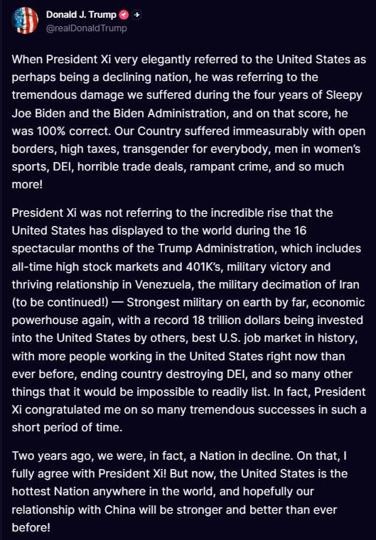

🔴 ترامپ :

وقتی رئیس‌جمهور شی به‌ طور محترمانه آمریکا را کشور در حال افول نامید، منظورش آسیب‌های عظیمی بود که طی چهار سال حکومت «جو خواب‌آلود» و دولت بایدن متحمل شدیم: مرزهای باز، مالیات‌های بالا، ورود ترنس‌ها به همه‌جا، مردان در ورزش‌های زنان، DEI، توافق‌های تجاری وحشتناک، جرم و جنایت گسترده و خیلی چیزهای دیگر!.

دو سال پیش، ما واقعاً در حال افول بودیم، در این مورد با رئیس‌جمهور شی کاملاً موافقم! اما حالا آمریکا داغ‌ترین کشور جهان است و امیدوارم روابط ما با چین قوی‌تر و بهتر از همیشه باشد!

@IranianMinds

## IranianMinds — post 20155

ارسالی شما : اگر شیر و خورشید وصل نمیشه براتون، طبق راهنمای زیر عمل کنید. وارد بخش Options اپلیکیشن بشید، گزینه‌ی More Options رو انتخاب کنید و در قسمت CDN Edge IPs، آی‌پی زیر و در قسمت CDN SNI Hostname، نام دامنه زیر رو وارد کنید بعد OK رو بزنید. CDN…

## IranianMinds — post 20154

ارسالی شما :

اگر شیر و خورشید وصل نمیشه براتون، طبق راهنمای زیر عمل کنید.

وارد بخش Options اپلیکیشن بشید، گزینه‌ی More Options رو انتخاب کنید و در قسمت CDN Edge IPs، آی‌پی زیر و در قسمت CDN SNI Hostname، نام دامنه زیر رو وارد کنید بعد OK رو بزنید.

CDN Edge IPs: 151.101.192.223
CDN SNI Hostname: python.org

سپس به صفحه ی اصلی برگردید و START رو بزنید

@IranianMinds

## IranianMinds — post 20152

امشب ویو ها بهتر شده
بعضیاتون برگشتید

امیدوارم بزودی همه برگردن

## IranianMinds — post 20151

  

پست خواهر جاویدنام سپهر ابراهیمی .

@IranianMinds

## IranianMinds — post 20150

  <a href="telegram/content/IranianMinds_20150_1778804293.mp4" target="_blank">🎬 Download video</a>

تو کوبا هم‌ مردم ریختن بیرون دارن اعتراض میکنن

مردم کوبا روزانه حدود ۲۳ تا ۲۲ ساعت برق ندارن تو‌ بعضی مناطق

@IranianMinds

## BBCPersian — post 281062

  

‌ ‌ ‌
وزارت خارجه ایتالیا اعلام کرد که پنج شهروند این کشور در یک حادثه غواصی در مالدیو جان باختند.

این وزارتخانه با بیان اینکه این اتفاق در جزیره واوو آتول رخ داده است، اعلام کرد: «گمان می‌رود غواصان هنگام تلاش برای کاوش غارها در عمق ۵۰ متری جان خود را از دست داده‌اند.»

ارتش مالدیو اعلام کرد که یک جسد در غاری در حدود ۶۰ متری زیر آب پیدا شده و گمان می‌رود چهار غواص دیگر نیز در آنجا باشند.

به گفته ارتش مالدیو غواصانی با تجهیزات ویژه به منطقه اعزام شده‌اند و عملیات جستجو را بسیار پرخطر توصیف کرده است.

اعتقاد بر این است که این حادثه بدترین حادثه غواصی در این کشور کوچک اقیانوس هند است که به دلیل رشته جزایر مرجانی خود، یک مقصد گردشگری محبوب است.

خدمه کشتی که غواص‌ها با آن سفر می‌کردند، پس از آنکه نتوانستند با غواص‌ها تماس برقرار کنند و آنها به سطح آب بازنگشتند، مفقود شدن آنها را گزارش کردند.

📷 Reinhard Dirscherl/ullstein bild via Getty Images
@BBCPersian

## BBCPersian — post 281061

  

‌ ‌ ‌ ‌
الناز و الهه محمدی، خبرنگاران ایرانی از سوی بنیاد بین‌المللی زنان رسانه که در واشنگتن آمریکاست، به عنوان برندگان جایزه سال ۲۰۲۶ در زمینه «شجاعت در روزنامه‌نگاری» شدند.

این بنیاد روز پنجشنبه - ۱۴ مه / ۲۴ اردیبهشت - در بیانیه اعلام برندگان جوایز امسال گفت: «ما با افتخار فراوان اعلام می‌کنیم که برندگان جوایز «شجاعت در روزنامه‌نگاری» سال ۲۰۲۶ عبارتند از الهه محمدی و الناز محمدی از ایران.»

الهه محمدی، خبرنگار روزنامه هم‌میهن در سال ۱۴۰۱ به محل خاکسپاری مهسا امینی رفت و گزارشی از آن منتشر نمود و با شروع اعتراضات سراسری آن سال در ایران به همراه نیلوفر حامدی بازداشت و محاکمه شدند و بیش از یکسال در زندان بودند. خواهر او، الناز محمدی هم دبیر گروه جامعه روزنامه هم میهن است.

https://bbc.in/4eMEfRt
📷@parsaee_d
@BBCPersian

## BBCPersian — post 281060

🔻 راستی‌آزمایی بی‌بی‌سی؛ ادعاهای گمراه‌کننده درباره تشریفات لحظه رسیدن ترامپ و اوباما به پکن

ادعاهای گمراه‌کننده درباره مقایسه استقبال فرش قرمز از رئیس‌جمهور آمریکا، دونالد ترامپ، در سفر رسمی این هفته به پکن با استقبال کم‌تشریفات‌تر از باراک اوباما در سفرش به چین، میلیون‌ها بار در اینترنت دیده شده است.

بنی جانسون، مفسر محافظه‌کار آمریکایی، در شبکه ایکس نوشت: «وقتی اوباما به چین رفت، حتی برایش پله هم پای هواپیما نیاوردند»، و افزود: «ترامپ با استقبال قهرمانانه و فرش قرمز روبه‌رو شد.» این پست بیش از پنج میلیون بازدید داشته است.

بنی جانسون ویدیویی را نیز منتشر کرد که اوباما را هنگام پیاده شدن از پله‌های داخلی هواپیمای ایر فورس وان در زمان ورود به پکن در سال ۲۰۱۶ نشان می‌دهد.

اما آن سفر مربوط به نشست گروه ۲۰ بود که چین در همان سال میزبانی آن را بر عهده داشت؛ نه یک سفر رسمی دولتی مانند سفر کنونی دونالد ترامپ، که معمولا با تشریفات و مراسم بیشتری برای رهبران آمریکا همراه است.

مقایسه مناسب‌تر، سفر رسمی اوباما به چین در سال ۲۰۰۹ است. در آن سفر نیز مراسم استقبالی مشابه سفر آقای ترامپ برگزار شد؛ جایی که رئیس‌جمهور وقت آمریکا از پله‌های اصلی هوایپمای خصوصی روسای جمهوری آمریکا - ایر فورس وان - پایین آمد و توسط گارد احترام نظامی مورد استقبال قرار گرفت.

https://bbc.in/4ds1ttM
@BBCPersian

## BBCPersian — post 281059

  

‌ ‌ ‌ ‌
دادگاه وابسته به سازمان ملل متحد درخواست آزادی راتکو ملادیچ، جنایتکار جنگی صرب بوسنیایی، را به دلیل نزدیک بودن به پایان عمرش رد کرد.

قاضی گراسیلا گاتی سانتانا ضمن پذیرش اینکه او «در مراحل پایانی زندگی خود» است، گفت که شرایط زندان سازمان ملل و بیمارستان آن در لاهه «از چنان کیفیت بالایی برخوردار است که می‌توان آسایش ملادیچ را به حداکثر برساند.»

او گفت: «هیچ درمان اضافی دیگری که در هلند در دسترس نباشد، در جای دیگری در دسترس نیست.»

ملادیچ، ۸۴ ساله، در سال ۲۰۱۷ به جرم نسل‌کشی، جنایات جنگی و جنایات علیه بشریت در طول جنگ‌های یوگسلاوی سابق در سال‌های ۱۹۹۲ تا ۱۹۹۵ به حبس ابد محکوم شد.

حکم او که به «قصاب بوسنی» معروف است، در سال ۲۰۲۱ در دادگاه تجدیدنظر تایید شد.

قاضی گاتی سانتانا روز پنجشنبه در حکمی کتبی اذعان کرد که «وضعیت فعلی ملادیچ وخیم است.»

اما او افزود که آقای ملادیچ «همچنان از سوی پزشکان، پرستاران و کارکنان زندان واجد شرایط، تحت درمان جامع و دلسوزانه قرار دارد.»

https://bbc.in/49BVSQn
📷Reuters
@BBCPersian

## Dirty_Kids — post 389479

  <a href="telegram/content/Dirty_Kids_389479_1778804296.webm" target="_blank">🎬 Download video</a>

☢️خفن ترین و‌ قدیمی ترین  انالیزور  ایران ینی دکتر بت 
👍 
🔴هیچ سایت بتی دوست نداره شما کانال دکتر بت رو پیدا کنین چون خیلی سود میکنید🤷‍♂ رایگان بهترین شرط هارو براتون میذاره حتی هزار تومن هم دریافت نمیکنه روزانه میتونی از پیش بینی فوتبال باهاش پول در بیاری…

## Dirty_Kids — post 389478

  <a href="telegram/content/Dirty_Kids_389478_1778804297.webm" target="_blank">🎬 Download video</a>

☢️خفن ترین و‌ قدیمی ترین  انالیزور  ایران ینی دکتر بت 
👍

🔴هیچ سایت بتی دوست نداره شما کانال دکتر بت رو پیدا کنین چون خیلی سود میکنید🤷‍♂

رایگان بهترین شرط هارو براتون میذاره
حتی هزار تومن هم دریافت نمیکنه
روزانه میتونی از پیش بینی فوتبال باهاش پول در بیاری 👌
A24
اگ اهل پیش بینی فوتبالی این کانال اصلا از دست ندین👇

✅https://t.me/+4_ADqwB9e-QwYjlk

✅https://t.me/+4_ADqwB9e-QwYjlk

## Dirty_Kids — post 389477

  

#بخوابیم

@Dirty_Kids 👻

## Dirty_Kids — post 389476

قضیه السیسی اگه نمیدونی این ویدیو کمکت میکنه

@Dirty_Kids 👻

## Dirty_Kids — post 389475

  

آیفونیا با کانفیگ پولی در حال خوندن پستای اندرویدیا که با وپن شیر 🌞 وصل شدن:

@Dirty_Kids 👻

## Dirty_Kids — post 389474

  <a href="telegram/content/Dirty_Kids_389474_1778804299.mp4" target="_blank">🎬 Download video</a>

🎙️خبرنگار : امیرعلی چرا اومدی تجمع؟
🧑امیرعلی : به عشق رهبر

🎙️خبرنگار : امیرعلی، مامان و بابات مجبورت کردن که بیای تجمعات؟

🧑امیرعلی : آره

@Dirty_Kids 👻

## Dirty_Kids — post 389473

  

کصمادرتون…
نسلتون رو ✌🏽 بار گائیدم…

@Dirty_Kids 👻

## Dirty_Kids — post 389472

  

تو خیابون حل اشکال ریاضی میزارن بعد رتبه یک کنکور رو اعدام میکنن.
اینجا، ایران جان..

@Dirty_Kids 👻

## Dirty_Kids — post 389471

‏تو آسانسور از دختره پرسیدم کدوم طبقه میری ؟
گفت : فرقی نمیکنه.

@Dirty_Kids 👻

## Dirty_Kids — post 389470

  

ملانیا واقعا خوشتیپه

@Dirty_Kids 👻

## manototv — post 105467

  <a href="telegram/content/manototv_105467_1778804302.mp4" target="_blank">🎬 Download video</a>

مجلس نمایندگان آمریکا برای سومین بار قطعنامه‌ای را که هدف آن محدود کردن اختیارات جنگی دونالد ترامپ در جنگ با جمهوری اسلامی بود، رد کرد.

این قطعنامه دموکرات‌ها با نتیجه ۲۱۲ رأی موافق در برابر ۲۱۲ رأی مخالف، نتوانست اکثریت لازم را به دست آورد.

طرح مورد نظر که در ماه مارس ارائه شده بود، دولت ترامپ را ملزم می‌کرد حداکثر ظرف ۳۰ روز پس از آغاز جنگ، نیروهای آمریکایی را از درگیری خارج کند. جنگ میان آمریکا و جمهوری اسلامی از ۲۸ فوریه آغاز شده بود.

جاش گاتهیمر، نماینده دموکرات، گفت از «در هم کوبیدن رژیم ایران» حمایت می‌کند، اما دولت ترامپ را به پنهان نگه داشتن اطلاعات از کنگره متهم کرد.

بر اساس قانون اختیارات جنگی آمریکا مصوب ۱۹۷۳، رئیس‌جمهوری باید ظرف ۶۰ روز پس از آغاز درگیری، در صورت نداشتن مجوز کنگره، نیروهای نظامی را خارج کند.

دولت ترامپ اما اعلام کرده آتش‌بس ۷ آوریل باعث توقف شمارش این مهلت شده، زیرا از آن زمان «تبادل آتش» میان دو طرف رخ نداده است.

با این حال، تنش‌ها بر سر تنگه هرمز باعث شده آتش‌بس شکننده توصیف شود.

سه نماینده جمهوری‌خواه این بار به قطعنامه رأی مثبت دادند و در سنا نیز شماری از جمهوری‌خواهان به حمایت از طرح‌های محدودکننده اختیارات جنگی ترامپ نزدیک‌تر شده‌اند.

دموکرات‌ها گفته‌اند به طرح دوباره این قطعنامه‌ها ادامه خواهند داد. تیم کین، سناتور دموکرات، گفت: «روزی خواهد رسید که سنا به رئیس‌جمهوری خواهد گفت این جنگ را متوقف کن.»

## manototv — post 105466

  <a href="telegram/content/manototv_105466_1778804303.mp4" target="_blank">🎬 Download video</a>

‌
مارکو روبیو، وزیر خارجه آمریکا، در گفت‌وگو با ان‌بی‌سی نیوز گفت دولت دونالد ترامپ اجازه نخواهد داد جمهوری اسلامی از فشارهای داخلی آمریکا برای تحمیل یک «توافق بد» استفاده کند.

روبیو گفت: «آنچه رئیس‌جمهوری روشن می‌کند این است که اگر ایرانی‌ها فکر می‌کنند می‌توانند از سیاست داخلی ما برای تحت فشار قرار دادن او جهت پذیرش یک توافق بد استفاده کنند، چنین اتفاقی نخواهد افتاد.»

او با اشاره به افزایش قیمت انرژی در آمریکا افزود واشنگتن اجازه نخواهد داد جمهوری اسلامی از موضوع تنگه هرمز و بازار نفت به‌عنوان اهرم فشار استفاده کند.

وزیر خارجه آمریکا همچنین گفت در صورت باز ماندن تنگه هرمز و ورود دوباره نفت ایران به بازار، قیمت نفت و بنزین کاهش خواهد یافت.

روبیو در ادامه هشدار داد دستیابی جمهوری اسلامی به سلاح هسته‌ای می‌تواند به کنترل دائمی تنگه هرمز از سوی تهران منجر شود.

او گفت: «اگر ایران به سلاح هسته‌ای دست پیدا کند، دیگر مسئله یک بحران سه‌ماهه یا شش‌ماهه نخواهد بود؛ ممکن است به یک مشکل دائمی تبدیل شود.»

## manototv — post 105465

  <a href="telegram/content/manototv_105465_1778804305.mp4" target="_blank">🎬 Download video</a>

صندوق بین‌المللی پول هشدار داد ادامه اختلال‌ها ناشی از جنگ ایران، اقتصاد جهانی را به سمت «سناریوی نامطلوب» سوق می‌دهد؛ سناریویی که با کاهش رشد اقتصادی و افزایش خطر تورم همراه خواهد بود.

این نهاد بین‌المللی اعلام کرد در صورت ادامه‌دار شدن جنگ و تداوم افزایش قیمت نفت، چشم‌انداز اقتصاد جهان می‌تواند به‌مراتب بدتر شود.

صندوق بین‌المللی پول پیش‌تر در گزارش «چشم‌انداز اقتصاد جهانی» پیش‌بینی کرده بود رشد اقتصاد جهان در سال ۲۰۲۶ در سناریوی پایه به ۳.۱ درصد برسد.

اما بر اساس اعلام این نهاد، در سناریوی «نامطلوب» —شامل بالا ماندن طولانی‌مدت قیمت نفت، بی‌ثبات شدن انتظارات تورمی و سخت‌تر شدن شرایط مالی — رشد جهانی ممکن است تا ۲.۵ درصد کاهش پیدا کند.

## alonews — post 120055

  

🌐 اینترنت رایگان و آزاد برای همه مردم

⚡ VPN رایگان
⚡ کانفیگ تست‌شده و پرسرعت
⚡ آپدیت روزانه
⚡ بدون قطعی و دردسر

@NetaazaadVPN
@NetaazaadVPN

اینجا فقط وصل میشی و راحت استفاده میکنی 🫡

👇
@NetaazaadVPN
@NetaazaadVPN
@NetaazaadVPN

## alonews — post 120054

  

🔴احتمالا ویزا مهدی طارمی به علت خدمت در سپاه صادر نشود
‼️

@AloSport

## alonews — post 120053

  <a href="telegram/content/alonews_120053_1778804307.webm" target="_blank">🎬 Download video</a>

🔴فوری/ترامپ:
نابودی نظامی ایران ادامه خواهد یافت‌‌

✅ @AloNews خبر جنگ

## alonews — post 120052

  <a href="telegram/content/alonews_120052_1778804307.webm" target="_blank">🎬 Download video</a>

👈توئیت جدید ترامپ:

🔴وقتی رئیس‌جمهور شی به‌طرز بسیار ظریفی ایالات متحده را کشوری در حال افول نامید، احتمالاً منظورش آسیب عظیمی بود که ما در چهار سال دولت جو خواب‌آلود بایدن و دولت بایدن متحمل شدیم، و در این مورد او صد در صد درست می‌گفت. کشور ما به‌طور غیرقابل اندازه‌گیری از مرزهای باز، مالیات‌های بالا، تراجنسی بودن برای همه، مردان در ورزش زنان، DEI، توافقات تجاری وحشتناک، افزایش جرم و جنایت و خیلی چیزهای دیگر آسیب دیده است!

🔴رئیس‌جمهور شی منظورش صعود شگفت‌انگیزی نبود که ایالات متحده در 16 ماه چشمگیر دولت ترامپ به جهان نشان داد، از جمله بازارهای سهام رکوردشکن و 401K، پیروزی نظامی و روابط شکوفا در ونزوئلا، شکست نظامی ایران (ادامه دارد!) — قوی‌ترین ارتش روی زمین، دوباره ابرقدرت اقتصادی با رکورد ۱۸ تریلیون دلار سرمایه‌گذاری شده در آمریکا توسط کشورهای دیگر، بهترین بازار کار در تاریخ آمریکا، با تعداد بیشتری از افراد شاغل نسبت به همیشه، پایان دادن به DEI که کشور را تخریب می‌کرد و بسیاری چیزهای دیگر که به‌راحتی نمی‌توان فهرست کرد. در واقع، رئیس‌جمهور شی مرا به خاطر این همه موفقیت بزرگ در مدت زمان کوتاه تبریک گفت.

🔴دو سال پیش ما واقعاً کشوری در حال افول بودیم. در این مورد کاملاً با رئیس‌جمهور شی موافقم! اما اکنون ایالات متحده داغ‌ترین کشور جهان است و امیدوارم روابط ما با چین قوی‌تر و بهتر از همیشه شود!



✅ @AloNews خبر جنگ

## alonews — post 120051

  <a href="telegram/content/alonews_120051_1778804307.mp4" target="_blank">🎬 Download video</a>

👈فاکس نیوز :تو سفر ترامپ، بین مأموران سرویس مخفی آمریکا و پلیس چین، تنش ایجاد شده و درگیری لفظی و حتی فیزیکی هم پیش اومده

✅ @AloNews خبر جنگ

## alonews — post 120050

  <a href="telegram/content/alonews_120050_1778804309.webm" target="_blank">🎬 Download video</a>

👈عوستاد رائفی پور:
آمریکایی‌ها متحد نیستن و بزودی تجزیه میشن

✅ @AloNews خبر جنگ

## alonews — post 120049

  <a href="telegram/content/alonews_120049_1778804309.webm" target="_blank">🎬 Download video</a>

👈تصویری وایرال شده از گلشیفته فراهانی و امانوئیل مکرون

✅ @AloNews خبر جنگ

---
📅 بروزرسانی: 1405/02/25 00:33
---

## VahidOOnLine — post 240189

♦️کاظم غریب‌آبادی، معاون حقوقی و بین‌المللی وزارت خارجه جمهوری اسلامی، در اجلاس وزرای خارجه کشورهای عضو بریکس در دهلی‌نو، با اشاره به حمله نظامی مشترک آمریکا و اسرائیل علیه اهداف نظامی جمهوری اسلامی گفت: «ما خواهان موضعی یکپارچه در گروه بریکس بر پایه مخالفت با هدف قرار دادن نظامی کشورهای عضو و تقویت اصول امنیت و ثبات میان کشورهای این گروه هستیم.»

او تاکید کرد کشورهای عضو بریکس باید در برابر اقدام‌های نظامی علیه اعضای این گروه، موضعی هماهنگ و مشترک اتخاذ کنند.
‌🇸🇦 Indypersian

🤖 @VahidOOnLine

## VahidOOnLine — post 240188

  

وزارت خارجه قطر به العربیه اعلام کرد چند پهپاد ایرانی را در نزدیکی حریم هوایی خود سرنگون کرده است. این وزارتخانه افزود در تماس‌های خود با جمهوری اسلامی بر ضرورت بازگشایی تنگه هرمز تأکید کرده و ابراز امیدواری کرده است توافقی برای تضمین امنیت منطقه‌ای حاصل شود.

وزارت خارجه قطر همچنین گفت کشورهای خلیج فارس خواهان بازگشایی تنگه هرمز و توقف حملات جمهوری اسلامی هستند و از تلاش‌های دیپلماتیک حمایت کرده و بر پرهیز از جنگ تأکید دارند.
‌🏁 🇬🇧 IranintlTV

🤖 @VahidOOnLine

## VahidOOnLine — post 240187

  

♦️خبرگزاری رویترز گزارش داد نارندرا مودی، نخست وزیر هند، در چارچوب یک سفر منطقه‌ای و با هدف مقابله با پیامدهای بحران انرژی، روز جمعه راهی ابوظبی می‌شود تا با محمد بن زاید آل نهیان، رئیس امارات متحده عربی، دیدار و گفتگو کند. این سفر در حالی انجام می‌شود که افزایش جهانی قیمت نفت بر اثر تنش‌های خاورمیانه، فشار شدیدی بر ذخایر ارزی دهلی نو وارد کرده و مودی را به اتخاذ سیاست‌های ریاضتی و کاهش واردات واداشته است.

در این دیدار، طرفین درباره همکاری‌های راهبردی در حوزه انرژی و ثبات بازار سوخت رایزنی خواهند کرد. هند به عنوان یکی از بزرگترین واردکنندگان انرژی جهان، به دنبال تضمین امنیت تامین سوخت و کاهش تاثیر نوسانات قیمتی بر اقتصاد داخلی خود است. مودی پس از پایان گفتگوها در امارات، برای گسترش پیوندهای تجاری و پیگیری توافقات اقتصادی با اتحادیه اروپا، عازم کشورهای هلند، سوئد، نروژ و ایتالیا خواهد شد.
‌🇸🇦 Indypersian

🤖 @VahidOOnLine

## VahidOOnLine — post 240186

  

ابراهیم عزیزی، رییس کمیسیون امنیت ملی مجلس، از تدوین طرحی با عنوان «اقدام متقابل نیروهای نظامی و امنیتی جمهوری اسلامی» خبر داد که در آن پرداخت پاداش ۵۰ میلیون یورویی برای کشتن دونالد ترامپ، رییس‌جمهوری آمریکا، پیش‌بینی شده است.
 
عزیزی گفت همان‌طور که ترامپ دستور داد علی خامنه‌ای را بکشند، او باید «به دست هر مسلمان و آزاده‌ای مورد برخورد قرار بگیرد.»

او افزود در این طرح پیش‌بینی شده اگر افراد حقیقی یا حقوقی «این رسالت دینی و اعتقادی» را انجام دهند، دولت موظف است ۵۰ میلیون یورو پاداش بپردازد.

رییس کمیسیون امنیت ملی مجلس گفت جمهوری اسلامی معتقد است دونالد ترامپ، بنیامین نتانیاهو، نخست‌وزیر اسرائیل و برد کوپر، فرمانده سنتکام، باید به دلیل اقدامی که به کشته شدن علی خامنه‌ای منجر شد، «مورد برخورد و اقدام متقابل» قرار بگیرند؛ زیرا این را حق خود می‌داند.
‌🏁 🇬🇧 IranintlTV

🤖 @VahidOOnLine

## VahidOOnLine — post 240185

  

♦️شبکه خبری آی۲۴ نیوز گزارش داد امارات متحده عربی پس از انتشار خبر سفر محرمانه بنیامین نتانیاهو به ابوظبی، اعتراض شدید دیپلماتیک خود را به اسرائیل منتقل کرده است.
بر اساس این گزارش، این پیام اعتراضی از سوی محمد آل خاجه، سفیر امارات متحده عربی در اسرائیل، به مقام‌های شورای امنیت ملی اسرائیل در دفتر نخست‌وزیری این کشور منتقل شده است.
یک منبع آگاه به آی۲۴ نیوز گفت: «اماراتی‌ها بسیار خشمگین بودند. این نخستین بار نیست که اطلاعات حساس از دفتر نخست‌وزیری اسرائیل درز می‌کند. به همین دلیل است که نتانیاهو سال‌ها به امارات متحده عربی سفر نکرده بود.»
آی۲۴ نیوز همچنین نوشت امارات متحده عربی با وجود گسترش همکاری‌های امنیتی با اسرائیل، از جمله استقرار سامانه «گنبد آهنین» و سفر مقام‌های ارشد امنیتی اسرائیل به ابوظبی، همچنان تلاش می‌کند روابط خود با اسرائیل را کم‌حاشیه نگه دارد.
‌🇸🇦 Indypersian

🤖 @VahidOOnLine

## VahidOOnLine — post 240184

  

نشست کمیته نیروهای مسلح سنا با حضور ارشدترین مقام‌ نظامی آمریکا در خاورمیانه با تمرکز بر چالش خلع سلاح حزب‌الله، گروه مسلح لبنانی مورد حمایت جمهوری اسلامی، به پایان رسید.

راجر ویکر، سناتور جمهوری‌خواه ایالت میسیسیپی و رییس این کمیته، در این نشست از دریاسالار برد کوپر، که فرماندهی سنتکام را بر عهده دارد، ‌پرسید آیا تهاجم اسرائیل به خاک لبنان ضروری بوده است یا نه.

کوپر پاسخ داد: «این یکی از گزینه‌ها در میان گزینه‌هاست، از میان گزینه‌های اندکی که برای حل مشکل حزب‌الله وجود دارد.»

ویکر در ادامه گفت: «اگر حزب‌الله بتواند از بین برده شود، برای اسرائیل، لبنان و ایالات متحده یک دستاورد عظیم خواهد بود.»

در هفته‌های اخیر حزب‌الله به‌طور مداوم موشک‌هایی به سمت اسرائیل شلیک کرده و اسرائیل نیز یک تهاجم زمینی به جنوب لبنان انجام داده که بر حزب‌الله متمرکز بوده اما به گزارش رسانه‌ها، باعث آواره شدن ساکنان این منطقه شده است.
‌🏁 🇬🇧 IranintlTV

🤖 @VahidOOnLine

## VahidOOnLine — post 240183

  

♦️ابراهیم عزیزی، رئیس کمیسیون امنیت ملی و سیاست خارجی مجلس روز پنجشنبه ۲۴ اردیبهشت از اختصاص پاداش ۵۰ میلیون یورویی برای کشتن دونالد ترامپ رئیس جمهوری آمریکا خبر داد.
عزیزی با اشاره به طرحی با عنوان اقدام متقابل توسط نیروهای نظامی و امنیتی گفت: «پیش بینی کرده‌ایم که دولت به هر فرد حقیقی و حقوقی که این رسالت دینی (کشتن ترامپ) را انجام دهد به عنوان پاداش ۵۰ میلیون یورو بپردازد.»
رئیس کمیسیون امنیت ملی و سیاست خارجی مجلس در برنامه دایره قانون گفت: چند طرح را از زمان شروع جنگ سوم، آماده کردیم که طرح اقدام متقابل توسط نیروهای نظامی و امنیتی از جمله آنها است.
او با پلید خواندن دونالد ترامپ افزود: «ما معتقد هستیم که رئیس‌جمهور پلید آمریکا و نخست‌وزیر نحس و ننگین اسرائیل و فرمانده سنتکام باید مورد برخورد و اقدام متقابل قرار بگیرند. همان اقدامی که منتهی به شهادت امام شهید ما شد زیرا این حق ما است.»
‌🇸🇦 Indypersian

🤖 @VahidOOnLine

## VahidOOnLine — post 240182

  

♦️دریادار برد کوپر، فرمانده ستاد مرکزی نیروهای مسلح آمریکا (سنتکام)، روز پنجشنبه ۲۴ اردیبهشت در کمیته نیروهای مسلح سنا اعلام کرد که نیروهای آمریکایی استفاده از مهمات پیشرفته و گران‌قیمت برای سرنگونی پهپادهای جمهوری اسلامی را متوقف کرده‌اند.

ذخایر محدود سامانه‌های تسلیحاتی گران‌قیمت این کشور، از جمله موشک‌های رهگیر پیشرفته، در طول جنگ با جمهوری اسلامی به موضوعی بحث‌برانگیز تبدیل شده بود. پیش از این، نیروهای آمریکایی از این تسلیحات برای مقابله با پهپادهای ایرانی استفاده می‌کردند، اما کوپر می‌گوید ارتش آمریکا اکنون به استفاده از مهمات ارزان‌تر روی آورده است.

این دریادار ارشد خاطرنشان کرد که تنها ۱۰ درصد از پهپادهای ایران باقی مانده است.
‌🇸🇦 Indypersian

🤖 @VahidOOnLine

## VahidOOnLine — post 240181

  <a href="telegram/content/VahidOOnLine_240181_1778792620.mp4" target="_blank">🎬 Download video</a>

تماسی از ایران:
«می‌گفت بیمه عملاً داروها، مخصوصاً انسولین رو پوشش نمی‌ده…
و هزینه‌ها چند برابر شده.
می‌گفت دارو هست، اما برای خیلی‌ها دیگه قابل تهیه نیست.»
‌🏁 🇬🇧 ManotoTV

🤖 @VahidOOnLine

## VahidOOnLine — post 240180

  

ابراهیم عزیزی، رییس کمیسیون امنیت ملی مجلس، گفت: «به دشمنان هشدار می‌دهیم اگر دچار خطای محاسباتی شده و به امنیت ما خدشه‌ای وارد کنند، امنیت آن‌ها را در هر کجای جهان که باشد، سلب خواهیم کرد. آماده‌ایم در تنگه هرمز و سایر میادین، بار دیگر دشمن را شکست بدهیم.»

او افزود: «امروز دشمن در تنگه هرمز در حال غرق‌شدن و تجربه شکست دیگری است و پیام ما به دشمن این است که هر اقدام محاسبه‌نشده، پاسخی دردناک به همراه خواهد داشت.»
‌🏁 🇬🇧 IranintlTV

🤖 @VahidOOnLine

## VahidOOnLine — post 240179

  

♦️اداره تحقیقات فدرال آمریکا، اف‌بی‌آی روز پنجشنبه ۲۴ اردیبهشت اعلام کرد برای اطلاعاتی که منجر به دستگیری و پیگرد قانونی مونیکا ویت، عضو سابق سرویس اطلاعاتی ایالات متحده و مأمور ضداطلاعات این کشور که در فوریه ۲۰۱۹ به اتهام جاسوسی، از جمله انتقال اطلاعات دفاع ملی به دولت ایران، متهم شده بود، ۲۰۰ هزار دلار پاداش تعیین کرده است.
به گفته اف‌بی‌آی، مونیکا ویت که در سال ۲۰۱۳ به ایران پناهنده شده اطلاعات مرتبط با دفاع ملی ایالات متحده را در اختیار جمهوری اسلامی قرار داده است.
این افسر پیشین اطلاعاتی و مامور ویژه دفتر تحقیقات ویژه نیروی هوایی آمریکا، بین سال‌های ۱۹۹۷ تا ۲۰۰۸ در ارتش آمریکا خدمت کرد و سپس تا سال ۲۰۱۰ به‌عنوان پیمانکار دولت آمریکا فعالیت داشت.
بنا بر اعلام اف‌بی‌آی سوابق نظامی و فعالیت قراردادی ویت،‌ دسترسی او به اطلاعات محرمانه و فوق محرمانه مربوط به اطلاعات و ضداطلاعات خارجی، از جمله هویت واقعی نیروهای مخفی آمریکا را فراهم کرد.
 این گزارش تاکید می‌کند ویت عمدا اطلاعاتی را به ایران ارائه داده که پرسنل آمریکایی و خانواده‌هایشان را که در خارج از کشور مستقر هستند، به خطر می‌اندازد.
‌🇸🇦 Indypersian

🤖 @VahidOOnLine

## VahidOOnLine — post 240178

  

♦️به گزارش خبرگزاری دولتی عراق (INA)، علی الزیدی، نخست‌وزیر جدید عراق که دولت او روز پنجشنبه ۲۴ اردیبهشت موفق به کسب رای اعتماد شد، متعهد شد که انحصار سلاح در اختیار دولت را تضمین کند.

خبرگزاری INA به نقل از دفتر رسانه‌ای پارلمان گزارش داد که برنامه دولتی الزیدی شامل «اصلاح ساختار امنیتی از طریق محدود کردن مالکیت سلاح به کنترل دولت و تقویت توانمندی‌های نیروهای امنیتی» است.

ایالات متحده به عنوان یکی از بازیگران کلیدی در عرصه سیاسی عراق، اخیرا فشارهای خود را بر بغداد افزایش داده است تا گروه‌های مورد حمایت جمهوری اسلامی را که واشنگتن آن‌ها را به عنوان سازمان‌های تروریستی می‌شناسد، خلع سلاح کند.
‌🇸🇦 Indypersian

🤖 @VahidOOnLine

## VahidOOnLine — post 240177

  <a href="telegram/content/VahidOOnLine_240177_1778792623.mp4" target="_blank">🎬 Download video</a>

تماسی از ایران:
«می‌گفت برای زنده نگه داشتن پدرش حتی کپسول اکسیژن هم پیدا نمی‌شد…
و بیمارستان، با اون حال وخیم، مرخصش کرد چون تخت لازم داشت.
‌🏁 🇬🇧 ManotoTV

🤖 @VahidOOnLine

## VahidOOnLine — post 240176

  

♦️ به گزارش وال‌استریت ژورنال و بر اساس داده‌های گروه دریایی «ویندوارد» (Windward)، روز پنجشنبه ۲۴ اردیبهشت یک نفت‌کش کلاس «پاناماکس» در جزیره خارگ در حال بارگیری است. این اولین بارگیری تایید شده در این ترمینال حیاتی نفت ایران از تاریخ ۷ مه (۱۷ اردیبهشت) تاکنون محسوب می‌شود.

شرکت ویندوارد اعلام کرد که تصاویر ماهواره‌ای از حضور این شناور در کنار ترمینال شرقی جزیره را ثبت کرده است. این شرکت همچنین شناسایی حدود ۲۰ «نفت‌کش شبح» (نفت‌کش‌هایی که سیستم ردیابی خود را خاموش کرده‌اند) را گزارش داده که در مناطق مجاور به حالت آماده‌باش توقف کرده‌اند.

جزیره خارگ، واقع در شمال خلیج فارس، هسته اصلی صنعت نفت ایران است و بخش اعظم صادرات نفت خام از طریق آن ذخیره و بارگیری می‌شود. پیش از این، اسکات بسنت، وزیر خزانه‌داری آمریکا، اعلام کرده بود که ایران به دلیل دشواری در فروش و تخلیه نفت صادراتی، به مدت سه روز هیچ بارگیری در این جزیره نداشته است. نفت‌کش‌های کلاس پاناماکس ظرفیتی معادل ۴۰۰ هزار تا ۵۵۰ هزار بشکه نفت دارند.
‌🇸🇦 Indypersian

🤖 @VahidOOnLine

## VahidOOnLine — post 240175

  

به گزارش ان‌بی‌سی، مجلس نمایندگان آمریکا عصر پنجشنبه درباره یک قطعنامه اختیارات جنگی رای‌گیری خواهد کرد؛ قطعنامه‌ای که رییس‌جمهور آمریکا را ملزم می‌کند نیروهای مسلح ایالات متحده را از درگیری‌ها علیه جمهوری اسلامی خارج کند.

بر اساس این گزارش، این قطعنامه با حمایت جاش گاتهایمر، نماینده دموکرات ایالت نیوجرسی ارائه شده و همه دموکرات‌هایی که پیش‌تر با قطعنامه‌های اختیارات جنگی درباره ایران مخالفت کرده بودند، اکنون به‌عنوان هم‌حامی آن ثبت شده‌اند.

دموکرات‌ها برای موفقیت در تصویب این قطعنامه، به حمایت جمهوری‌خواهان بیشتری فراتر از تام مَسی، نماینده جمهوری‌خواه ایالت کنتاکی نیاز خواهند داشت. او تنها جمهوری‌خواهی بود که از آخرین قطعنامه اختیارات جنگی درباره ایران که در نهایت شکست خورد، حمایت کرده بود.
‌🏁 🇬🇧 IranintlTV

🤖 @VahidOOnLine

## VahidOOnLine — post 240174

  

محمدعلی جعفری، فرمانده قرارگاه «بقیه‌الله» سپاه پاسداران، در ویدیویی که بخش‌هایی از آن را خبرگزاری تسنیم منتشر کرده، گفت: «جمهوری اسلامی بدون اقدامات اعتمادساز از سوی آمریکا وارد مذاکرات نمی‌شود و آغاز دوباره جنگ قطعا به ضرر آمریکاست».

جعفری افزود: «دونالد ترامپ از متن‌های ارسالی تیم مذاکره‌کننده جمهوری اسلامی خوشش نمی‌آید، اما راه بهتری جز پذیرش شروط تهران ندارد».

او گفت جمهوری اسلامی در «گام اول» با آمریکا مذاکره نمی‌کند و از طریق پاکستان در حال تبادل پیام بر اساس شروط خود است.

فرمانده قرارگاه «بقیه‌الله» سپاه پاسداران، گفت جمهوری اسلامی ابتدا اقدامات اعتمادساز خود را اعلام می‌کند و از «دشمن» تعهد می‌گیرد و تنها در صورت دریافت تعهد، وارد مذاکره می‌شود.
‌🏁 🇬🇧 IranintlTV

🤖 @VahidOOnLine

## VahidOOnLine — post 240173

  

روزنامه فایننشال‌تایمز به‌نقل از دیپلمات‌ها و منابع آگاه گزارش داد که عربستان سعودی درباره ایده یک پیمان عدم‌تجاوز میان کشورهای خاورمیانه و جمهوری اسلامی گفت‌وگو کرده است.

به‌نوشته این روزنامه، کشورهای خلیج فارس به‌ویژه از زمان آغاز جنگ آمریکا و اسرائیل علیه ایران نگران بوده‌اند که پس از پایان درگیری و کاهش حضور نظامی گسترده آمریکا در منطقه، با یک حکومت اسلامی زخمی اما تندروتر در همسایگی خود باقی بمانند.

فایننشال‌تایمز پنج‌شنبه ۲۴ اردیبهشت نوشت عربستان سعودی ایده یک پیمان عدم‌تجاوز میان کشورهای خاورمیانه و ایران را در چارچوب رایزنی‌ها با متحدان درباره نحوه مدیریت تنش‌های منطقه‌ای پس از پایان جنگ آمریکا و اسرائیل با جمهوری اسلامی مطرح کرده است.

دو دیپلمات غربی به این روزنامه گفتند ریاض در حال بررسی فرآیند هلسینکی دهه ۱۹۷۰ به‌عنوان یک الگوی احتمالی است؛ فرآیندی که در دوران جنگ سرد به کاهش تنش‌ها در اروپا کمک کرد.

ادامه این گزارش را در وبسایت ایران‌اینترنشنال بخوانید
‌🏁 🇬🇧 IranintlTV

🤖 @VahidOOnLine

## VahidOOnLine — post 240172

  <a href="telegram/content/VahidOOnLine_240172_1778792627.mp4" target="_blank">🎬 Download video</a>

♦️دونالد ترامپ، رئیس‌جمهوری آمریکا، در مصاحبه با شان هنیتی از شبکه فاکس نیوز اعلام کرد که شی جین‌پینگ، رئیس‌جمهوری چین، با قاطعیت تاکید کرده است که کشورش هیچ‌گونه تجهیزات نظامی در اختیار جمهوری اسلامی قرار نخواهد داد. ترامپ این اظهارنظر رهبر چین را یک «بیانیه بزرگ» توصیف کرد که با جدیت بیان شده است.

رئیس‌جمهوری آمریکا در ادامه افزود که پکن به‌دلیل خرید حجم بالای نفت، خواستار بازگشایی تنگه هرمز و تداوم روابط تجاری خود است. ترامپ همچنین به نارضایتی شی جین‌پینگ از سیستم دریافت عوارض توسط جمهوری اسلامی در این آبراه اشاره کرد و با لحنی انتقادی گفت کشور ایران که اکنون «نابود شده» است، مشخص نیست این پول‌ها را کجا هزینه می‌کند. او خاطرنشان کرد که اگرچه چین خواستار بازگشایی مسیر است، اما در واقع ابتدا ایران مسیر رفت و آمد در این تنگه را مسدود کرد و سپس آمریکا محاصره دریایی را در نظر گرفت.
‌🇸🇦 Indypersian

🤖 @VahidOOnLine

## VahidOOnLine — post 240171

  

اف‌بی‌آی اعلام کرد برای ارائه اطلاعات درباره مونیکا ویت، مامور سابق ضدجاسوسی آمریکا که در سال ۲۰۱۳ به ایران پناهنده شده، ۲۰۰ هزار دلار جایزه تعیین کرده است.

به گفته اف‌بی‌آی، او اطلاعات مرتبط با دفاع ملی ایالات متحده را در اختیار جمهوری اسلامی قرار داده است.

ویت، افسر پیشین اطلاعاتی نیروی هوایی آمریکا و مامور ویژه دفتر تحقیقات ویژه نیروی هوایی، بین سال‌های ۱۹۹۷ تا ۲۰۰۸ در ارتش آمریکا خدمت کرد و سپس تا سال ۲۰۱۰ به‌عنوان پیمانکار دولت آمریکا فعالیت داشت.

سوابق نظامی و فعالیت قراردادی او موجب شده بود به اطلاعات محرمانه و فوق‌محرمانه در حوزه اطلاعات خارجی و ضدجاسوسی، از جمله هویت واقعی نیروهای مخفی آمریکا، دسترسی داشته باشد.
‌🏁 🇬🇧 IranintlTV

🤖 @VahidOOnLine

## VahidOOnLine — post 240169

  

♦️وال استریت ژورنال روز پنجشنبه ۲۴ اردیبهشت گزارش داد که دو نفت‌کش ژاپنی پس از گفتگوهای مستقیم سانائه تاکایچی، نخست‌وزیر ژاپن، با مقامات ارشد جمهوری اسلامی موفق به عبور ایمن از تنگه هرمز شدند. تاکایچی در پیامی اعلام کرد که دولت او هماهنگی‌های متعددی از جمله «ارتباط مستقیم با مسعود پزشکیان» انجام داده است تا امنیت تردد کشتی‌های ژاپنی را تضمین کند.

داده‌های ردیابی نشان می‌دهد نفت‌کش غول‌پیکر «انئوس اندوور» (Eneos Endeavor) متعلق به شرکت NYK Line، که از دوشنبه گذشته سیگنال‌های خود را قطع کرده بود، روز چهارشنبه از تنگه هرمز عبور کرده و راهی بندر «کی‌یره» در ژاپن شده است. این کشتی از اواخر فوریه با محموله نفت کویت در منطقه متوقف شده بود. همچنین نفت‌کش دیگر ژاپنی به نام «ایدمیتسو مارو» (Idemitsu Maru) اواخر آوریل از این آبراه عبور کرده و در مسیر بازگشت به بندر ناگویا است.

نخست‌وزیر ژاپن خاطرنشان کرد که این کشور برای تامین امنیت انرژی خود، سه‌چهارم نیاز ماه ژوئن را از منابع جایگزین مانند ایالات متحده تامین کرده و بخشی از ذخایر استراتژیک نفت خود را نیز آزاد خواهد کرد.
‌🇸🇦 Indypersian

🤖 @VahidOOnLine

## WithYashar — post 11247

طبق گزارش‌های امروز، هرتزوگ رئیس جمهور اسرائیل حضور حضوری خود در نیویورک را لغو کرده و گفته به دلیل «شرایطی که مانع سفر شده» نمی‌تواند به آمریکا بیاید.
اما این سفر یک سفر رسمی سیاسی به کاخ سفید نبود،بلکه مربوط به شرکت او در مراسم فارغ‌التحصیلی «Jewish Theological Seminary» در نیویورک بود.

در عین حال، خبر جداگانه‌ای هم درباره سفر احتمالی بنیامین ناتانیاهو به آمریکا وجود داشت که دفتر او گفته بود هنوز برنامه قطعی‌ای برایش نهایی نشده است
@withyashar

## WithYashar — post 11246

طبق گزارش فاکس نیوز : رئیس‌جمهور ترامپ و هیئت همراهش در طول سفر به چین از تلفن‌ها و لپ‌تاپ‌های جایگزین استفاده کردند به دلیل نگرانی‌هایی که داشتند مبنی بر اینکه مقامات چینی ممکن است از آن‌ها برای نصب نرم‌افزار جاسوسی استفاده کنند
@withyashar

## WithYashar — post 11245

همینجور این پیغام میاد دم همتون گرم مخصوصا عزیزی که یاد کرد از من🥹🙌🏾❤️‍🩹 میامممم میاممم

## WithYashar — post 11244

یکی اومد رو خط برنامه کامبیز تو اینترنشنال گفتش از همه مجریای اینترنشنال تشکر میکنم ، حتی یاشار وار روم توی تلگرام ک خیلیا اخبارا رو ازونجا دنبال میکنن دمتون گرم

## WithYashar — post 11242

دیده شده پهپاد شناسایی و صدای پدافند غرب تهران
@withyashar

## WithYashar — post 11241

اعتراضات کوبا شروع شد کشور در حال فروپاشی

طبق گزارش‌ها، شبکه برق کوبا در بامداد امروز دچار فروپاشی شد و مناطق شرقی از جمله شهر مهم سانتیاگو دِ کوبا بدون برق ماندند. مردم به خیابان آمدند، قابلمه‌ها را به هم کوبیدند، زباله آتش زدند و شعار «برق را وصل کنید» سر دادند.
دولت کوبا علت اصلی را تحریم‌ها و فشار آمریکا بر صادرات سوخت به کوبا می‌داند. رسانه‌هایی مانند رویترز و گاردین نوشته‌اند که پس از تهدیدهای جدید دولت ترامپ علیه کشورهایی که به کوبا سوخت می‌فرستند، ارسال نفت از ونزوئلا و مکزیک کاهش یافته و کوبا عملاً ذخیره سوختش را از دست داده است. وزیر انرژی کوبا گفته:
«ما مطلقاً هیچ گازوئیل و هیچ نفت کوره‌ای نداریم.»
در بعضی مناطق مردم تا ۲۰ یا حتی ۲۲ ساعت در روز برق ندارند. این وضعیت باعث خراب شدن مواد غذایی، اختلال در بیمارستان‌ها، حمل‌ونقل و حتی تعطیلی برخی خدمات عمومی شده است.
@withyashar

## WithYashar — post 11240

  <a href="telegram/content/WithYashar_11240_1778792630.mp4" target="_blank">🎬 Download video</a>

پیروزی بزرگ برای‌ ترامپ ، فاکس نیوز تایید کرد رئیس جمهور چین، شی جین پینگ دستور داد در مورد ایران، «هر چیزی که ترامپ نیاز دارد» را به آمریکا بدهید.

از ‌آمریکا سویای بیشتری بخرید.

نفت بیشتری از آمریکا بخرید.

از آمریکا گاز مایع طبیعی بیشتری بخرید.

۲۰۰ جت بوئینگ ۷۳۷ مکس بخرید.
@withyashar

## WithYashar — post 11239

خبر خوب 😍

## WithYashar — post 11238

  <a href="telegram/content/WithYashar_11238_1778792632.mp4" target="_blank">🎬 Download video</a>

نتانیاهو: دشمنان ما به دنبال نابودی همه ما هستند. همه ما
آنها بین راست و چپ، سکولار و مذهبی، یهودی و عرب تفاوتی قائل نمی‌شوند.
@withyashar
نتانیاهو: اورشلیم را تحت حاکمیت اسرائیل برای همیشه حفظ خواهیم کرد

## WithYashar — post 11237

## WithYashar — post 11236

سومین دور مذاکرات مستقیم لبنان و اسرائیل در واشنگتن آغاز شد
@withyashar

## WithYashar — post 11235

ترامپ اعلام کرد که انتظار می‌رود پکن ۲۰۰ هواپیما از بوئینگ سفارش دهد.
@withyashar

## WithYashar — post 11234

کان نیوز : مقامات ارشد ارتش اسرائیل و سنتکام هفته گذشته جلسه داشتن و منتظرن ببینن فردا ترامپ بعد اتمام سفرش چه تصمیمی میگیره
@withyashar

## WithYashar — post 11233

  <a href="telegram/content/WithYashar_11233_1778792633.mp4" target="_blank">🎬 Download video</a>

اتاق جنگ با یاشار ، شواهد نشان دهنده حمله غافلگیر کننده برای کتلت پزون است
@withyashar

## WithYashar — post 11232

  <a href="telegram/content/WithYashar_11232_1778792635.mp4" target="_blank">🎬 Download video</a>

در سال ۱۹۷۲، شهبانو فرح پهلوی به دعوت رسمی دولت چین به این کشور سفر کرد؛ سفری تاریخی و بی‌سابقه که در اوج جنگ سرد، نماد دیپلماسی بی‌طرفانه ایران بود
@withyashar

## mwarmonitor — post 9100

  <a href="telegram/content/mwarmonitor_9100_1778792637.mp4" target="_blank">🎬 Download video</a>

📝 گویا «بیت» در یک دگردیسی انتحاری، از مداح به دلقک تغییر کاربری داده و «خاله محمود» را به عنوان آخرین سلاح کشتار جمعیِ آبرو، راهیِ میدان کرده است. این استندآپ‌کمدیِ تهوع‌آور، مرثیه‌ای است بر نظامی که برای بقا، ماله را کنار گذاشته و با میکروفون به جانِ شعور ملت افتاده است.

🔸وقتی وقاحت به سقف می‌چسبد، اصلا دور از انتظار نیست که در پرده‌ی بعدی، این سوپرمنِ ماله‌کشی را با ریش سه تیغ و استایل لش ببینیم که در حالِ رپ کردنِ قطعه‌ی حماسیِ «آقام تو فریزه» است؛ اجرایی که لابد قرار است انجمادِ مغزی و تحجرِ سیستم را به عنوان «ثباتِ انقلابی» به خوردِ مخاطب بدهد. خاله محمود با این لودگی‌های سفارشی، ثابت کرد که در سیرکِ قدرت، هرچه دلقک‌تر باشی و با ریتمِ «شش‌وهشت» روی ویرانه‌ها برقصی، به سفره‌ی چربِ نظام نزدیک‌تری. این نه هنر است و نه کمدی؛ این رقصِ بی‌شرمانه‌ی لاشخورهایی است که می‌خواهند با شوخی‌هایِ تاریخ‌مصرف‌گذشته، بوی تعفنِ سیاست را پنهان کنند.

@mwarmonitor

## mwarmonitor — post 9099

  

📝 اف‌بی‌آی برای سرِ این ضعیفه، ۲۰۰ هزار دلار مژدگانی گذاشته؛ زنی که سال ۲۰۱۳ از ناف آمریکا فرار کرد تا خودش را به آغوشِ گرمِ آخوندها بیندازد. این خائنِ وطن‌فروش که اطلاعات امنیت ملی آمریکا را مثل تحفه‌ای بی‌مقدار زیر پای دولت ایران ریخت، قطعاً حالا با نامی مستعار مثل «پارمیدا» در حوالی اندرزگو در حال دور دور می‌باشد. شک نکنید با پولی که از فروختنِ رفقای سابقش به جیب زده، آن چهره‌ی سنگیِ توی عکس را زیر تیغ جراحان زیبایی کوبیده و ساخته تا ردّ خیانتش را پشت دماغِ عمل‌کرده و ژلِ لب پنهان کند. پیدا کردنِ کسی که برای یک «صور به آخوند زدن» کل زندگی‌اش را به لجن کشیده، در تهرانِ امروز که پر از چهره‌های فیک و هویت‌های فروشی است، پاداش کلانی می‌طلبد.

@mwarmonitor

## mwarmonitor — post 9098

🔴 فیننشال تایمز: عربستان سعودی در جریان گفت‌وگوها با متحدانش درباره مدیریت تنش‌های منطقه‌ای پس از پایان جنگ در ایران، ایده‌ی یک پیمان «عدم تجاوز» میان کشورهای خاورمیانه و ایران را مطرح کرده است.

@mwarmonitor

## mwarmonitor — post 9097

  

✈️📡 هواپیمای RC-135V Rivet Joint (شماره 64-14848) در حال انجام مأموریت بر فراز خلیج فارس است و در حال جمع‌آوری اطلاعات اطلاعاتی درباره ایران می‌باشد. 📝این هواپیما به‌تنهایی می‌تواند هشدار ورود به مرحله پیش از درگیری باشد؛ وقتی پروازهای روزانه و مستمر آواکس…

## mwarmonitor — post 9096

  

🇺🇸رئیس‌جمهور دونالد ترامپ در روز اول کاری خود، ممنوعیت دولت بایدن برای صدور مجوز صادرات LNG (گاز طبیعی مایع) را لغو کرد.

🇺🇸امروز، ایالات متحده بزرگ‌ترین تولیدکننده و صادرکننده گاز طبیعی در جهان است و پیش‌بینی می‌شود صادرات LNG این کشور تا پایان دهه تقریباً دو برابر شود.

@mwarmonitor

## mwarmonitor — post 9095

🇦🇪بیانیه: امارات حمله تروریستی به کشتی با پرچم هند در سواحل عمان را به شدت محکوم می‌کند

🇦🇪دولت امارات متحده عربی حمله تروریستی که کشتی حامل پرچم هند را در نزدیکی سواحل سلطنت عمان هدف قرار داد، با شدیدترین تعابیر محکوم کرد.

🇦🇪وزارت امور خارجه در بیانیه‌ای تأکید کرد که این حمله تهدیدی بزرگ برای ایمنی دریانوردی جهانی و تنش‌زایی خطرناکی است که ثبات آبراه‌های حیاتی را هدف قرار می‌دهد.

🇦🇪امارات همبستگی خود را با جمهوری دوست، هند، و حمایت کامل خود را از تمامی اقداماتی که منجر به حفاظت از امنیت و سلامت کشتی‌ها و منافع این کشور می‌شود، ابراز داشت.

🇦🇪این وزارتخانه همچنین تأکید کرد که این حمله نقض آشکار قطعنامه شماره ۲۸۱۷ شورای امنیت است که بر آزادی دریانوردی و رد هدف قرار دادن کشتی‌های تجاری یا مختل کردن مسیرهای دریایی بین‌المللی تأکید دارد. وزارت خارجه خاطرنشان کرد که هدف قرار دادن دریانوردی تجاری و استفاده از تنگه هرمز به عنوان ابزاری برای فشار یا باج‌خواهی اقتصادی، اقدامی راهزنانه محسوب شده و تهدیدی مستقیم برای ثبات منطقه، ملت‌های آن و امنیت انرژی جهانی است.

@mwarmonitor

## FoxNewsTwitter — post 341754

  <a href="telegram/content/FoxNewsTwitter_341754_1778792640.mp4" target="_blank">🎬 Download video</a>

Fox News (Twitter/X)

NEW: President Trump tells @seanhannity that Chinese President Xi Jinping offered to assist the U.S. in negotiating with Iran to reopen the Strait of Hormuz.

Trump notes that China’s significant oil interests play a major role in its desire to keep the critical waterway open and stable.

“President Xi would like to see a deal made. He would like to see a deal made. And he did offer, he said, ‘If I can be of any help at all, I would like to be of help.’”

"He said 'If I could be of any help whatsoever, I would like to help.'"

The full interview airs tonight at 9 p.m. ET on 'Hannity.'

## FoxNewsTwitter — post 341753

  <a href="telegram/content/FoxNewsTwitter_341753_1778792641.mp4" target="_blank">🎬 Download video</a>

Fox News (Twitter/X)

Bulldozers flatten hundreds of illegal mopeds in NYC.

The NYPD took a dramatic step in its sweeping crackdown on vehicles increasingly linked to violent crime.

Police Commissioner Jessica Tisch says many of the bikes are uninsured, carry fake or altered plates, and have become a growing public safety threat because criminals use their speed and anonymity to flee police.

The stark warning comes after investigators linked illegal mopeds and scooters to multiple robberies and even the shooting death of a 7-month-old girl last month.

Officials say the more than 200 crushed bikes represent only a small portion of the more than 5,700 illegal mopeds and scooters the NYPD seizes so far this year, nearly 10% more than at the same time last year.

## FoxNewsTwitter — post 341752

  <a href="telegram/content/FoxNewsTwitter_341752_1778792642.mp4" target="_blank">🎬 Download video</a>

Fox News (Twitter/X)

A wild police chase in Georgia ends when police perform a PIT maneuver, sending the fleeing U-Haul truck flying onto its side.

Sheriff's deputies were forced to chase the U-Haul in and out of traffic.

Authorities identified the driver as Damian Jones, who was reportedly wanted in other counties and accused of driving recklessly, hitting a truck, and nearly striking several vehicles during the pursuit.

Investigators say drugs were found inside the vehicle, and Jones was taken into custody following the crash.

No major injuries were reported.

## FoxNewsTwitter — post 341751

Fox News (Twitter/X)

NEW: Vice President JD Vance squares off with a local reporter over the scale of corruption in Maine, warning that current fraud findings are just the "tip of the iceberg."

REPORTER: "My question is, what else do you got? What else has your task force flagged that we should be concerned about? Because those amounts are a lot, 46 million, 1.7 million, but they don't really compare to California and Minnesota."

VANCE: "Ladies and gentlemen, we've got biased reporters in all states. It's okay. Trust me, I can handle I can handle it... I suspect we are going to find hundreds of millions of more dollars every single month that we look in the state of Maine, because this is not a state that takes it seriously."

## FoxNewsTwitter — post 341750

  <a href="telegram/content/FoxNewsTwitter_341750_1778792644.mp4" target="_blank">🎬 Download video</a>

Fox News (Twitter/X)

WATCH: Vice President JD Vance jokes with the crowd after thanking citizen journalists for exposing fraud across the country like Nick Shirley and the 'Quality Learing Center':

"When we really got wind of what was going on in Minneapolis, it was because somebody showed up at the 'Quality Learing Center.' We've got a guy over there- did you get a good education at the 'Quality Learing Center,' sir?"

"He said he's a graduate with honors of the 'Quality Learing Center.' I congratulate you, but I don't think it's that hard if we're being honest."

## FoxNewsTwitter — post 341749

  <a href="telegram/content/FoxNewsTwitter_341749_1778792646.mp4" target="_blank">🎬 Download video</a>

Fox News (Twitter/X)

JUST IN: Vice President JD Vance exposes a "shocking" lack of accountability at the Department of Justice, claiming million-dollar fraud cases were ignored by the Biden administration.

"Let's say a person defrauded all of you for a million bucks. To many of our Department of Justice leaders under the Biden administration, they said that was too low level to actually go after. So, I mean, how many of you would like the federal government to hand you $1 million?"

## FoxNewsTwitter — post 341748

  <a href="telegram/content/FoxNewsTwitter_341748_1778792647.mp4" target="_blank">🎬 Download video</a>

Fox News (Twitter/X)

NEW: Vice President JD Vance defends America’s social safety net while warning that unchecked fraud is destroying the "spirit of generosity" that sustains it.

"We don't want low income kids to not be able to afford a bite to eat. We want to make sure that if you're a poor child or a poor family, you get an opportunity to see a doctor, even if money is particularly tight."

"But you know what destroys those programs and not just destroys those programs, but destroys the spirit of generosity that makes those programs possible? It's when local officials and state officials and federal officials, it's when they let the fraudsters take advantage of you instead of fighting for you."

## FoxNewsTwitter — post 341747

  <a href="telegram/content/FoxNewsTwitter_341747_1778792649.mp4" target="_blank">🎬 Download video</a>

Fox News (Twitter/X)

HAPPENING NOW: Vice President JD Vance blasts Maine’s "festering" fraud crisis, blaming Governor Janet Mills and former President Joe Biden for the state's decline.

"Why did Maine go from a state that did not have a serious fraud problem, to one where I can honestly say it's one of the worst states in the union?"

"Number one is Janet Mills, and number two is Joe Biden. And thankfully, thankfully, one of them has already been kicked to the curb and one is on her way out the door exactly as it should be."

## FoxNewsTwitter — post 341746

  <a href="telegram/content/FoxNewsTwitter_341746_1778792650.mp4" target="_blank">🎬 Download video</a>

Fox News (Twitter/X)

BREAKING: Vice President JD Vance exposes massive fraud rings involving hospice care and services for autistic children, alleging billions are being stolen from vulnerable Americans.

"We have seen people go out there and say that they're providing services to autistic children, when in reality they maybe don't have any children at all, or they certainly don't have autistic children."

"What happened to the autistic children and their families who actually need those services and need a competent government to ensure that they're doing the right thing?"

## FoxNewsTwitter — post 341745

  <a href="telegram/content/FoxNewsTwitter_341745_1778792652.mp4" target="_blank">🎬 Download video</a>

Fox News (Twitter/X)

NEW: Vice President JD Vance gets a chuckle from the crowd after a person yells about dead people voting while the VP was talking about fraud in the United States:

"Unfortunately, they vote for Democrats. They don't vote for us my friends.”

## FoxNewsTwitter — post 341744

  <a href="telegram/content/FoxNewsTwitter_341744_1778792653.mp4" target="_blank">🎬 Download video</a>

Fox News (Twitter/X)

NOW: Vice President JD Vance reveals his reaction when President Trump asked him to oversee taking on America's fraud problem:

"When the president of the United States said, 'JD, we have got a fraud problem and I want you to tackle it.' I was so proud and so happy to be able to do it, because I realized that fraud isn't just about saving money. It's not just about protecting taxpayers. It's about protecting you."

## FoxNewsTwitter — post 341743

Fox News (Twitter/X)

"So when you make campaign statements, those aren't true? You're not being honest with your voters? ...What you said to the voters is not real. Doesn't count."

Rep. Jim Jordan hammers Fairfax County Commonwealth's Attorney Stephen Descano over the removal of campaign promises from his website about taking “immigration consequences” into account while handling cases.

Jordan blasts the prosecutor after an illegal immigrant with a lengthy criminal history was released by police and allegedly killed a man in his home a day later.

## FoxNewsTwitter — post 341742

  

Fox News (Twitter/X)

WATCH LIVE: VP Vance delivers remarks on Trump admin's fraud crackdown https://twitter.com/i/broadcasts/1kKzDMmkkYXJv

## FoxNewsTwitter — post 341741

  <a href="telegram/content/FoxNewsTwitter_341741_1778792655.mp4" target="_blank">🎬 Download video</a>

Fox News (Twitter/X)

“Tend to your faith not just when you’re broken, but when you’re whole.”

Eric Church returned to his alma mater, UNC Chapel Hill, and gave graduates a message bigger than music:

The country star told graduates that faith is the “low E” of life: the foundation every chord rests on, especially when the world gets overwhelming.

## FoxNewsTwitter — post 341740

  <a href="telegram/content/FoxNewsTwitter_341740_1778792657.mp4" target="_blank">🎬 Download video</a>

Fox News (Twitter/X)

FIRST ON FOX: Buster Murdaugh was spotted Thursday on the porch of his South Carolina home, one day after the South Carolina Supreme Court ruled that misconduct by a court official tainted his father, Alex Murdaugh’s, 2023 trial.

The ruling overturned Alex Murdaugh’s murder conviction, which had sent him to prison for life.

Despite the legal win Wednesday, Murdaugh will not be walking free - he remains behind bars serving lengthy sentences for a string of financial crimes that cemented his fall from power.

Murdaugh was sentenced to 27 years in state prison after pleading guilty to 22 financial crimes. He also got 40 years in federal prison for fraud-related charges, which he is serving at the same time. | @FoxTrueCrime @FoxUSNews

## pm_afshaa — post 90758

🔴آغاز اعتراضات مردمی در کوبا

💧 Rainbet.com the #1 Non-KYC Crypto Casino & Sportsbook @rainbetcom

😁 @Pm_Afshaa

## pm_afshaa — post 90757

🔴کانال 12 اسراییل: اسرائیل سطح هشدار را به اوج می‌رساند تا برای احتمال از سرگیری جنگ با ایران پس از بازگشت ترامپ از چین آماده شود

💧 Rainbet.com the #1 Non-KYC Crypto Casino & Sportsbook @rainbetcom

😁 @Pm_Afshaa

## pm_afshaa — post 90756

ایسنا : با قیمت قطعی خودرو باید خداحافظی کنید،چون تو جدیدترین طرح فروش ایران‌خودرو و سایپا،خریداران باید نیمی از مبلغ خودرو رو امروز بپردازن بدون اینکه بدونن در زمان تحویل چه قیمتی در انتظارشونه

💧 Rainbet.com the #1 Non-KYC Crypto Casino & Sportsbook @rainbetcom

😁 @Pm_Afshaa

## pm_afshaa — post 90754

🔴کارشناس کانال 14 اسرائیل: رژیم ایران به شدت به پول نیاز داره و در حال انجام تماس‌های مخفی و مستقیم با دولت ترامپه

💧 Rainbet.com the #1 Non-KYC Crypto Casino & Sportsbook @rainbetcom

😁 @Pm_Afshaa

## pm_afshaa — post 90753

  <a href="telegram/content/pm_afshaa_90753_1778792658.webm" target="_blank">🎬 Download video</a>

🔴اوباما درباره برنامه هسته‌ای ایران:
ما بدون شلیک یک گلوله آن را متوقف کردیم. 97 درصد اورانیوم آنها رو خارج کردیم. هیچ بحثی وجود نداره که آن توافق رو کار کرد و لازم نبود ما عده زیادی آدم بکشیم یا تنگه هرمز رو ببندیم.

💧 Rainbet.com the #1 Non-KYC Crypto Casino & Sportsbook @rainbetcom

😁 @Pm_Afshaa

## pm_afshaa — post 90752

  <a href="telegram/content/pm_afshaa_90752_1778792658.webm" target="_blank">🎬 Download video</a>

🔴پیت هگست:

علیرغم آنچه ممکن است در رسانه ها بشنوید، آمریکا در حال افول نیست. ما همچنان قوی‌ترین قدرت نظامی روی زمین هستیم، اما این قدرت مستلزم تجدید است.

با تهدیدهای جهانی که دائماً در حال تغییر هستند، زمان آن فرا رسیده است که یک سرمایه گذاری 1.5 تریلیون دلاری انجام دهید، یک پیش پرداخت نسلی.

این سرمایه‌گذاری تضمین می‌کند که ایالات متحده قدرت و قدرت بازدارندگی بی‌نظیری در برابر هر دشمنی را برای نسل‌های آینده حفظ کند.

💧 Rainbet.com the #1 Non-KYC Crypto Casino & Sportsbook @rainbetcom

😁 @Pm_Afshaa

## pm_afshaa — post 90751

  <a href="telegram/content/pm_afshaa_90751_1778792659.webm" target="_blank">🎬 Download video</a>

🔴کانال 12 به نقل از یک منبع:
اسرائیل وضعیت آماده باش خود را به منظور آمادگی برای احتمال تجدید جنگ ایران پس از بازگشت ترامپ از چین به اوج رسوند.

ارتش اسرائیل در تدارک تهاجمی و تدافعی برای احتمال از سرگیری فوری جنگ ایرانه.

💧 Rainbet.com the #1 Non-KYC Crypto Casino & Sportsbook @rainbetcom

😁 @Pm_Afshaa

## pm_afshaa — post 90750

  <a href="telegram/content/pm_afshaa_90750_1778792659.webm" target="_blank">🎬 Download video</a>

🔴ترامپ: رئیس‌جمهور شی مایله که شاهد یک توافق باشه. او گفت: اگه بتونم کمکی داشته باشم، دوست دارم کمک کنم.

هر کسی که این مقدار نفت میخره، مشخصاً نوعی رابطه داره و او دوست داره تنگه هرمز رو باز ببینه.

💧 Rainbet.com the #1 Non-KYC Crypto Casino & Sportsbook @rainbetcom

😁 @Pm_Afshaa

## pm_afshaa — post 90749

🎙️آیا رئیس جمهور شی از ترامپ درخواست کرده بود که به تایوان سلاح نفروشه؟

مارکو روبیو: خوب، این موضوع در گذشته مورد بحث قرار گرفته. اساساً در بحث امروز مطرح نشد. ما میدونیم که موضع آنها در این مورد چیست.

💧 Rainbet.com the #1 Non-KYC Crypto Casino & Sportsbook @rainbetcom

😁 @Pm_Afshaa

## pm_afshaa — post 90748

  <a href="telegram/content/pm_afshaa_90748_1778792660.webm" target="_blank">🎬 Download video</a>

🔴ترامپ: چین موافقت کرد 200 هواپیمای بوئینگ خریداری کنه.

💧 Rainbet.com the #1 Non-KYC Crypto Casino & Sportsbook @rainbetcom

😁 @Pm_Afshaa

## pm_afshaa — post 90747

  <a href="telegram/content/pm_afshaa_90747_1778792660.webm" target="_blank">🎬 Download video</a>

🔴حمید رسایی، نماینده تهران:
دولت قصد داره سهمیه بنزین هزار و ۵۰۰ تومنی و ۳ هزار تومنی رو کاهش بده و قیمت بنزین پنج هزار تومانی رو به ۱۵ تا ۲۰ هزار تومان افزایش بده.

💧 Rainbet.com the #1 Non-KYC Crypto Casino & Sportsbook @rainbetcom

😁 @Pm_Afshaa

## iaghapour — post 2611

  

💠 Mega Center 💠

🪩📈 ابزار مورد نیاز شما در دنیای کریپتو و تریدینگ / احراز هویت پلتفرم های خارجی

از افتتاح حساب های ارزی بین المللی
تا پکیج مدارک لازم جهت احراز هویت صرافی ها و سایت های خارجی
صدور مستر کارت و ویزا کارت و خدمات ارزی
سیم کارت های فیزیکی خارجی
خدمات وریفای تضمینی صرافی ها
ولت های فیزیکی معتبر و ...

👨‍💻لینک دسترسی ها و ارتباط :
www.megacenterx.com      
www.megacenterx.com
www.megacenterx.com

https://t.me/megacenter0
https://t.me/megacenter0

@Megav_admin22
@Megav_admin22

در صورت بالا نیامدن سایت ، بدون وی پی ان امتحان نمایید ✅

## iaghapour — post 2609

کل ریپازیتوری گیت هاب علیرضا که شامل X-UI و S-UI میشد بسته شده و هنوز دلیلش مشخص نیست.

## DEJradio — post 4636

  <a href="telegram/content/DEJradio_4636_1778792661.mp4" target="_blank">🎬 Download video</a>

🔺📢 "قیمت دارو سرسام‌آور شده، حکومت فقط دنبال جنگ‌افروزی است

یک شهروند از سمنان با ارسال یک ویدیو در پیامی نوشت: "ساکن سمنان هستم و براتون گزارشی می‌فرستم از افزایش قیمت دارو. این چند تا دارو رو دیروز از داروخانه به قیمت ۳ میلیون تومن خریدم درحالیکه پارسال قیمتش نصف این بود. درآمد ماهیانه من با این قیمت‌های سرسام آور تناسبی نداره و این به این معناست که برای خرید دارو باید از بقیه مایحتاج خودم و سه فرزندم صرف نظر کنم. این حکومت بی‌کفایت نه تنها که به فکر تامین نیازهای ما نیست بلکه با این جنگ افروزی‌هاش فقط اقتصاد کشور و درآمد مردم رو بیش از پیش نابود میکنه!"

#دارو #تورم
@DEJradio

## DEJradio — post 4635

  <a href="telegram/content/DEJradio_4635_1778792663.mp4" target="_blank">🎬 Download video</a>

🔺📢 "ما گرسنه‌ایم ولی از جنگ سیر

یک شهروند از تهران با ارسال ویدیویی از حرکت اعتراضی، نوشت گرانی زندگی مردم را مختل کرده است و بسیاری به نان شب محتاج‌اند اما حکومت انگار نه انگار که مردم چطور زندگی می‌کنند.

#تورم #جنگ
@DEJradio

## kianmeli1 — post 87410

  

🔴روزنامه اعتماد مدعی شد: اینترنت بین الملل خرداد ماه وصل می‌ شود
https://t.me/kianmeli1

## kianmeli1 — post 87409

  

🔴رئیس کمیسیون امنیت ملی مجلس، از پیشنهاد تعیین جایزه ۵۰ میلیون یورویی برای کشتن دونالد ترامپ، بنیامین نتانیاهو و فرمانده سنتکام خبر داده است.
https://t.me/kianmeli1

## kianmeli1 — post 87408

  <a href="telegram/content/kianmeli1_87408_1778792665.mp4" target="_blank">🎬 Download video</a>

🔴 کاتس وزیر دفاع اسرائیل  :
ماموریت ما کامل نشده است.

ما برای احتمال اینکه ممکن است مجبور به اقدام دوباره شویم - شاید حتی به زودی - آماده‌ایم.

اگر اهداف تأمین نشوند، دوباره اقدام خواهیم کرد.
   https://t.me/kianmeli1

## kianmeli1 — post 87407

  

🔴 ترامپ می‌گوید شی جین‌پینگ، رئیس‌جمهور چین، به او گفته است که چین تجهیزات نظامی به ایران ارائه نخواهد داد و از توافق صلح حمایت کرده است.

ترامپ همچنین می‌گوید که رئیس‌جمهور شی پیشنهاد میانجیگری برای کاهش تنش‌ها به منظور بازگشایی تنگه هرمز را داده است.
https://t.me/kianmeli1

## kianmeli1 — post 87406

  

🔴عربستان سعودی می‌خواهد با ایران پیمان عدم تجاوز امضا کند.

این در حالی است که ایران در طول جنگ به خاک عربستان سعودی حمله کرده است.
https://t.me/kianmeli1

## kianmeli1 — post 87405

  

🔴به گزارش رویترز، عربستان سعودی به رئیس جمهور ترامپ گفته است که جنگ با ایران باید پایان یابد و تنگه هرمز باید باز بماند و در صورت ادامه بحران، نسبت به «زیان‌های اقتصادی غیرقابل اندازه‌گیری» هشدار داده است.
https://t.me/kianmeli1

## kianmeli1 — post 87404

  

🔴دریاسالار برد کوپر، رئیس فرماندهی مرکزی ایالات متحده، گزارش‌های خبری مبنی بر اینکه ایران ۷۰ تا ۷۵ درصد از موشک‌ها و پرتابگرهای قبل از جنگ خود را حفظ کرده است، «غیردقیق» خواند و آنها را رد کرد.
https://t.me/kianmeli1

## kianmeli1 — post 87403

  

🔴ایران از همه کشورهای عضو بریکس می‌خواهد که جنگ آمریکا و اسرائیل علیه خود را محکوم کنند.
https://t.me/kianmeli1

## kianmeli1 — post 87402

  

🔴به گزارش خبرگزاری AXIOS، مقامات اسرائیلی می‌گویند که در طول این آخر هفته، اسرائیل در بالاترین سطح آمادگی قرار خواهد گرفت، زیرا این کشور منتظر تصمیم رئیس جمهور ترامپ در مورد از سرگیری جنگ علیه ایران است.
https://t.me/kianmeli1

## IranIntlTV — post 337219

  

وزارت خارجه قطر به العربیه اعلام کرد چند پهپاد ایرانی را در نزدیکی حریم هوایی خود سرنگون کرده است. این وزارتخانه افزود در تماس‌های خود با جمهوری اسلامی بر ضرورت بازگشایی تنگه هرمز تأکید کرده و ابراز امیدواری کرده است توافقی برای تضمین امنیت منطقه‌ای حاصل شود.

وزارت خارجه قطر همچنین گفت کشورهای خلیج فارس خواهان بازگشایی تنگه هرمز و توقف حملات جمهوری اسلامی هستند و از تلاش‌های دیپلماتیک حمایت کرده و بر پرهیز از جنگ تأکید دارند.
https://iranintl.com/202605149165

## IranIntlTV — post 337218

  

ابراهیم عزیزی، رییس کمیسیون امنیت ملی مجلس، از تدوین طرحی با عنوان «اقدام متقابل نیروهای نظامی و امنیتی جمهوری اسلامی» خبر داد که در آن پرداخت پاداش ۵۰ میلیون یورویی برای کشتن دونالد ترامپ، رییس‌جمهوری آمریکا، پیش‌بینی شده است.
 
عزیزی گفت همان‌طور که ترامپ دستور داد علی خامنه‌ای را بکشند، او باید «به دست هر مسلمان و آزاده‌ای مورد برخورد قرار بگیرد.»

او افزود در این طرح پیش‌بینی شده اگر افراد حقیقی یا حقوقی «این رسالت دینی و اعتقادی» را انجام دهند، دولت موظف است ۵۰ میلیون یورو پاداش بپردازد.

رییس کمیسیون امنیت ملی مجلس گفت جمهوری اسلامی معتقد است دونالد ترامپ، بنیامین نتانیاهو، نخست‌وزیر اسرائیل و برد کوپر، فرمانده سنتکام، باید به دلیل اقدامی که به کشته شدن علی خامنه‌ای منجر شد، «مورد برخورد و اقدام متقابل» قرار بگیرند؛ زیرا این را حق خود می‌داند.
https://iranintl.com/202605147997

## IranIntlTV — post 337217

  

نشست کمیته نیروهای مسلح سنا با حضور ارشدترین مقام‌ نظامی آمریکا در خاورمیانه با تمرکز بر چالش خلع سلاح حزب‌الله، گروه مسلح لبنانی مورد حمایت جمهوری اسلامی، به پایان رسید.

راجر ویکر، سناتور جمهوری‌خواه ایالت میسیسیپی و رییس این کمیته، در این نشست از دریاسالار برد کوپر، که فرماندهی سنتکام را بر عهده دارد، ‌پرسید آیا تهاجم اسرائیل به خاک لبنان ضروری بوده است یا نه.

کوپر پاسخ داد: «این یکی از گزینه‌ها در میان گزینه‌هاست، از میان گزینه‌های اندکی که برای حل مشکل حزب‌الله وجود دارد.»

ویکر در ادامه گفت: «اگر حزب‌الله بتواند از بین برده شود، برای اسرائیل، لبنان و ایالات متحده یک دستاورد عظیم خواهد بود.»

در هفته‌های اخیر حزب‌الله به‌طور مداوم موشک‌هایی به سمت اسرائیل شلیک کرده و اسرائیل نیز یک تهاجم زمینی به جنوب لبنان انجام داده که بر حزب‌الله متمرکز بوده اما به گزارش رسانه‌ها، باعث آواره شدن ساکنان این منطقه شده است.
https://iranintl.com/202605140569

## IranIntlTV — post 337216

  <a href="telegram/content/IranIntlTV_337216_1778792671.mp4" target="_blank">🎬 Download video</a>

با شروع دور جدید مذاکرات مستقیم اسرائیل و لبنان در واشینگتن، مقام‌های لبنانی خواستار آتش‌بس فوری و توقف حملات اسرائیل به جنوب لبنان شدند. اسرائیل می‌گوید هدف مذاکرات، خلع سلاح حزب‌الله و رسیدن به توافق صلح است؛ در حالی‌ که تنش‌ها همچنان ادامه دارد.
@iranintltv

## IranIntlTV — post 337215

  <a href="https://t.me/IranintlTV/337215" target="_blank">📎 Download file</a>

🎧نسخه صوتی ۲۴ با فرداد فرحزاد: همکاری چین و آمریکا برای بازگشایی تنگه هرمز
@iranintlTV

## IranIntlTV — post 337214

  

ابراهیم عزیزی، رییس کمیسیون امنیت ملی مجلس، گفت: «به دشمنان هشدار می‌دهیم اگر دچار خطای محاسباتی شده و به امنیت ما خدشه‌ای وارد کنند، امنیت آن‌ها را در هر کجای جهان که باشد، سلب خواهیم کرد. آماده‌ایم در تنگه هرمز و سایر میادین، بار دیگر دشمن را شکست بدهیم.»

او افزود: «امروز دشمن در تنگه هرمز در حال غرق‌شدن و تجربه شکست دیگری است و پیام ما به دشمن این است که هر اقدام محاسبه‌نشده، پاسخی دردناک به همراه خواهد داشت.»
https://iranintl.com/202605142365

## IranIntlTV — post 337213

  

🔻فدراسیون فوتبال برزیل قرارداد کارلو آنچلوتی، سرمربی تیم ملی این کشور، را تا پایان جام جهانی ۲۰۳۰ تمدید کرد.

🔹آنچلوتی ۶۶ ساله که اردیبهشت ۱۴۰۴ پس از جدایی از رئال مادرید هدایت برزیل را بر عهده گرفت، تمدید قراردادش را در ویدیویی که فدراسیون فوتبال برزیل منتشر کرد، تایید کرد.

🔹او گفت: «یک سال پیش به برزیل آمدم و از همان لحظه اول فهمیدم فوتبال برای این کشور چه معنایی دارد. ما می‌خواهیم تیم ملی برزیل را دوباره به بالاترین سطح فوتبال جهان برگردانیم.»

🔹قرار است آنچلوتی دوشنبه فهرست نهایی تیم ملی برزیل برای جام جهانی را اعلام کند.

🔹سمیر شعود، رییس فدراسیون فوتبال برزیل، تمدید قرارداد آنچلوتی را «روزی تاریخی» برای فوتبال این کشور توصیف کرد و گفت این تصمیم بخشی از برنامه برزیل برای ساخت تیمی «مدرن و رقابتی» است.

🔹برزیل با هدایت آنچلوتی در ۱۰ مسابقه به پنج پیروزی، سه شکست و دو تساوی رسیده است. این تیم در جام جهانی ۲۰۲۶ با اسکاتلند، مراکش و هائیتی هم‌گروه خواهد بود.

@iranintltvsport

## IranIntlTV — post 337212

  <a href="https://t.me/IranintlTV/337212" target="_blank">📎 Download file</a>

🎧نسخه صوتی دومینو: شمارش معکوس برای آغاز جنگی دیگر
@iranintlTV

## IranIntlTV — post 337211

  

به گزارش ان‌بی‌سی، مجلس نمایندگان آمریکا عصر پنجشنبه درباره یک قطعنامه اختیارات جنگی رای‌گیری خواهد کرد؛ قطعنامه‌ای که رییس‌جمهور آمریکا را ملزم می‌کند نیروهای مسلح ایالات متحده را از درگیری‌ها علیه جمهوری اسلامی خارج کند.

بر اساس این گزارش، این قطعنامه با حمایت جاش گاتهایمر، نماینده دموکرات ایالت نیوجرسی ارائه شده و همه دموکرات‌هایی که پیش‌تر با قطعنامه‌های اختیارات جنگی درباره ایران مخالفت کرده بودند، اکنون به‌عنوان هم‌حامی آن ثبت شده‌اند.

دموکرات‌ها برای موفقیت در تصویب این قطعنامه، به حمایت جمهوری‌خواهان بیشتری فراتر از تام مَسی، نماینده جمهوری‌خواه ایالت کنتاکی نیاز خواهند داشت. او تنها جمهوری‌خواهی بود که از آخرین قطعنامه اختیارات جنگی درباره ایران که در نهایت شکست خورد، حمایت کرده بود.
https://iranintl.com/202605147731

## IranIntlTV — post 337210

  <a href="telegram/content/IranIntlTV_337210_1778792675.mp4" target="_blank">🎬 Download video</a>

۲۴ با فرداد فرحزاد
@iranintltv

## IranIntlTV — post 337209

  

محمدعلی جعفری، فرمانده قرارگاه «بقیه‌الله» سپاه پاسداران، در ویدیویی که بخش‌هایی از آن را خبرگزاری تسنیم منتشر کرده، گفت: «جمهوری اسلامی بدون اقدامات اعتمادساز از سوی آمریکا وارد مذاکرات نمی‌شود و آغاز دوباره جنگ قطعا به ضرر آمریکاست».

جعفری افزود: «دونالد ترامپ از متن‌های ارسالی تیم مذاکره‌کننده جمهوری اسلامی خوشش نمی‌آید، اما راه بهتری جز پذیرش شروط تهران ندارد».

او گفت جمهوری اسلامی در «گام اول» با آمریکا مذاکره نمی‌کند و از طریق پاکستان در حال تبادل پیام بر اساس شروط خود است.

فرمانده قرارگاه «بقیه‌الله» سپاه پاسداران، گفت جمهوری اسلامی ابتدا اقدامات اعتمادساز خود را اعلام می‌کند و از «دشمن» تعهد می‌گیرد و تنها در صورت دریافت تعهد، وارد مذاکره می‌شود.
https://iranintl.com/202605145338

## IranIntlTV — post 337208

  <a href="https://t.me/IranintlTV/337208" target="_blank">📎 Download file</a>

🎧نسخه صوتی اخبار شبانگاهی | پنجشنبه ۲۴ اردیبهشت
@iranintlTV

## IranIntlTV — post 337207

  

روزنامه فایننشال‌تایمز به‌نقل از دیپلمات‌ها و منابع آگاه گزارش داد که عربستان سعودی درباره ایده یک پیمان عدم‌تجاوز میان کشورهای خاورمیانه و جمهوری اسلامی گفت‌وگو کرده است.

به‌نوشته این روزنامه، کشورهای خلیج فارس به‌ویژه از زمان آغاز جنگ آمریکا و اسرائیل علیه ایران نگران بوده‌اند که پس از پایان درگیری و کاهش حضور نظامی گسترده آمریکا در منطقه، با یک حکومت اسلامی زخمی اما تندروتر در همسایگی خود باقی بمانند.

فایننشال‌تایمز پنج‌شنبه ۲۴ اردیبهشت نوشت عربستان سعودی ایده یک پیمان عدم‌تجاوز میان کشورهای خاورمیانه و ایران را در چارچوب رایزنی‌ها با متحدان درباره نحوه مدیریت تنش‌های منطقه‌ای پس از پایان جنگ آمریکا و اسرائیل با جمهوری اسلامی مطرح کرده است.

دو دیپلمات غربی به این روزنامه گفتند ریاض در حال بررسی فرآیند هلسینکی دهه ۱۹۷۰ به‌عنوان یک الگوی احتمالی است؛ فرآیندی که در دوران جنگ سرد به کاهش تنش‌ها در اروپا کمک کرد.

ادامه این گزارش را در وبسایت ایران‌اینترنشنال بخوانید
https://iranintl.com/202605143675

## IranIntlTV — post 337206

  

اف‌بی‌آی اعلام کرد برای ارائه اطلاعات درباره مونیکا ویت، مامور سابق ضدجاسوسی آمریکا که در سال ۲۰۱۳ به ایران پناهنده شده، ۲۰۰ هزار دلار جایزه تعیین کرده است.

به گفته اف‌بی‌آی، او اطلاعات مرتبط با دفاع ملی ایالات متحده را در اختیار جمهوری اسلامی قرار داده است.

ویت، افسر پیشین اطلاعاتی نیروی هوایی آمریکا و مامور ویژه دفتر تحقیقات ویژه نیروی هوایی، بین سال‌های ۱۹۹۷ تا ۲۰۰۸ در ارتش آمریکا خدمت کرد و سپس تا سال ۲۰۱۰ به‌عنوان پیمانکار دولت آمریکا فعالیت داشت.

سوابق نظامی و فعالیت قراردادی او موجب شده بود به اطلاعات محرمانه و فوق‌محرمانه در حوزه اطلاعات خارجی و ضدجاسوسی، از جمله هویت واقعی نیروهای مخفی آمریکا، دسترسی داشته باشد.
https://iranintl.com/202605148135

## IranIntlTV — post 337204

  <a href="telegram/content/IranIntlTV_337204_1778792678.mp4" target="_blank">🎬 Download video</a>

برد کوپر، فرمانده سنتکام، برای پاسخ به سوالات نمایندگان در جلسه کمیته نیروهای مسلح سنای آمریکا حاضر شد.

او گفت توانایی جمهوری اسلامی برای تهدید همسایگان و منافع آمریکا در منطقه به‌طور چشمگیری کاهش یافته است.

گزارش مرضیه حسینی، خبرنگار ایران‌اینترنشنال
@iranintltv

## IranIntlTV — post 337203

  

وال‌استریت ژورنال به نقل از چند مقام آمریکایی و چند مقام کشورهای خلیج فارس گزارش داد عربستان سعودی پس از آن‌که تهران تاسیسات انرژی و زیرساخت‌های غیرنظامی این کشور را هدف قرار داد، به‌طور محرمانه حملاتی علیه جمهوری اسلامی انجام داده است.
به گفته یکی از این مقام‌ها، نیروی هوایی عربستان سعودی چندین حمله علیه اهدافی از جمله سایت‌های پرتاب پهپاد و موشک جمهوری اسلامی انجام داده است.
همچنین برخی منابع گفتند جنگنده‌های عربستان سعودی اهدافی در عراق مرتبط با شبه‌نظامیان مورد حمایت جمهوری اسلامی را نیز هدف قرار داده‌اند.
https://iranintl.com/202605147123

## IranIntlTV — post 337202

  

🔻پس از گذشت بیش از ۷۰ روز از آغاز جنگ آمریکا و اسرائیل با جمهوری اسلامی و تعطیلی ۷۵ روزه فوتبال باشگاهی در ایران، بازی‌های هفته بیست‌وچهارم لیگ دسته اول با برگزاری هشت دیدار از سر گرفته شد و تیم مس شهربابک توانست با نتیجه ۱ بر صفر مس کرمان را شکست دهد و صدرنشین باقی بماند.

🔹آخرین دیدار باشگاهی فوتبال ایران جمعه ۸ اسفند و یک روز پیش از آغاز جنگ برگزار شد و چهار دیدار از هفته بیست و سوم لیگ برتر انجام شد.

🔹در دیگر بازی‌های هفته بیست‌وچهارم، دیدارهای پارس جنوبی و هوادار، صنعت نفت آبادان و آریو اسلامشهر، شهرداری نوشهر و فرد البرز و همچنین سایپا و مس سونگون با تساوی بدون گل به پایان رسید.

🔹نود ارومیه نیز با نتیجه ۱ بر صفر شناورسازی قشم را شکست داد و دیدار نیروی زمینی و داماش گیلان به دلیل حاضر نشدن تیم گیلانی، ۳ بر صفر به سود نیروی زمینی اعلام شد.

🔹نساجی مازندران، دیگر تیم مدعی صعود به لیگ برتر، جمعه ۲۵ اردیبهشت به مصاف بعثت کرمانشاه می‌رود.

🔹پیش از این، محمدمهدی فروردین، رییس کمیسیون ورزش مجلس بخاطر شرایط امنیتی و اقتصادی خواستار لغو تمام لیگ‌های فوتبال ایران شده بود.

@iranintltvsport

## IranIntlTV — post 337200

روایت شما از زندگی در آتش‌بس- پنجشنبه ۲۵ اردیبهشت ۱۴۰۵

🔹از گرگان: چند ماهه اعلام کردن حقوق ارتش و بازنشسته‌ها رو تا ۵۰ درصد بیشتر می‌کنن. زیاد نکردن که هیچ، چند روز هم دیرتر واریز کردن. امیدتون به نابودی اینا باشه. جاوید شاه.
🔹در کاشان به بچه‌های حدود ۱۰ ساله آموزش کار با کلاش می‌دن. واقعا این تو همه جای دنیا قفله.
🔹پرچم‌چرخانی و اشغال خیابون‌ها توسط جیره‌خوارهای جمهوری اسلامی مساوی با مصرف سوخت و پول ملت بیچاره‌ست.
🔹معاون اول پزشکیان گفته از بازگشت نخبه‌ها استقبال می‌کنیم. آخه مردک! می‌خواید برگردن که به جرم جاسوسی اعدام‌شون کنید؟
🔹از الوند قزوین: تو هیچ داروخانه‌ای قرص‌های اعصاب مثل سرترالین و غیره پیدا نمی‌شه. خیلی از این قرص‌ها عوارض ترک دارن. چه کسی جوابگوست؟
🔹از چهارمحال: گرونی بیداد کرده. یک کیلو بذر لوبیا سبز شده دو میلیون تومان.
🔹شعار فیفا جدایی فوتبال از سیاسته و به همین دلیل داره برای ویزای تیم رژیم تلاش می‌کنه. یکی بهش بگه به خاطر خوشحالی شکست تیم جمهوری اسلامی در جام ۲۰۲۲، جوان‌های زیادی کشته و مجروح شدن.
🔹ایدئولوژی و فلسفه جمهوری اسلامی ضدبشری و ضدانسانیته. انسان‌های داخل ایران برده‌شونن و خارج از ایران دشمن‌شون.
🔹اسنپ گرفتم، زانتیا بود. ایست بازرسی نگهش داشتن. وقتی راننده گفت اسنپم، با کمال تعجب گفتن کی آخه با زانتیا میره اسنپ! راننده هم گفت چیکار کنم، بی‌پولیه. ببینید چیکار کردن با مردم.
🔹۷۰ روزه نت‌ها قطعه. کسانی که آنلاین‌شاپ داشتن از کار بیکار شدن. خیلی‌ها مثل معلم زبان خودم می‌گفت قبل جنگ ۱۸ شاگرد داشتم و بعد جنگ ۳ شاگرد. قیمت دلار ۱۸۰٬۰۰۰ تومانه.
🔹اسکله شهید رجایی بندرعباس که معروف بود به دروازه طلایی، ترمینال‌های مادر سینا و بتا که جرثقیل‌های گانتری‌کرین مستقر هستن، واردات و صادرات اصلی کشور کلا تعطیل شده. اگر ادامه‌دار باشه به‌زودی قحطی کل کشور رو فرا می‌گیره.
🔹خوزستان شرکت‌های بهره‌برداری فلرهای نفتی رو با بیشترین حد فعال کردن و مشغول سوزاندن و هدر دادن سوخت هستن. چرا؟ چون توان و تجهیزات برای تسویه و استفاده بهینه از سوخت استخراج‌شده رو ندارن. دقت کنید شهرهای خوزستان در صدر پرخطر بودن آلودگی هوا هستن.
🔹اگه می‌گن قطعی اینترنت به‌خاطر مسائل امنیتیه، پس فروش انبوه اینترنت پرو چیه؟ اینترنت پرو امنیت رو به خطر نمی‌ندازه؟ و کسانی که رفتن پرو گرفتن، خائن هستن.
🔹محدودیت‌های زیادی روی برنامه شاد هست. برای ارسال تکالیف هم باید تایم زیادی بذاریم. احساس ناامنی افکار دانش‌آموزها رو به هم ریخته. آموزش‌وپرورش واقعا بی‌برنامه‌ست.
🔹من یک تولیدکننده محتوا تو اینستاگرام و یوتیوب بودم. بعد از قطعی اینترنت زندگیم نابود شده. همه‌چیز خیلی گرونه. کاری هم که خودمون با جون‌کندن راه انداختیم ازمون گرفتن.

## IranIntlTV — post 337199

  

نخست‌وزیر جدید عراق، علی الزیدی، پنجشنبه تنها با بخشی از اعضای کابینه خود سوگند یاد کرد، زیرا قانون‌گذاران نتوانستند بر سر پست‌های کلیدی از جمله وزارت کشور و وزارت دفاع به توافق برسند.

خبرگزاری رویترز گزارش داد که باسم محمد به‌عنوان وزیر جدید نفت کشور منصوب شد و فؤاد حسین نیز در دولت جدید در سمت وزیر خارجه ابقا شد.

پارلمان عراق در مجموع به ۱۴ وزیر پیشنهادی رای اعتماد داد.
https://iranintl.com/202605145356

## IranIntlTV — post 337198

  

منوچهر متکی، نماینده مجلس و وزیر خارجه پیشین جمهوری اسلامی، خطاب به بحرین گفت: «الان در آتش‌بس هستیم؛ دعا کنید جنگی در نگیرد، اما اگر جنگ شد و دوباره پایگاه‌های آمریکا را برای حمله به ما در اختیار بگذارید، آنچنان می‌زنیم که نامتان را فراموش کنید و خاک بحرین را توی توبره می‌کنیم.»

متکی گفت بحرین و برخی کشورهای منطقه با در اختیار گذاشتن امکانات و پایگاه‌ها به آمریکا، حملات علیه جمهوری اسلامی را تسهیل کردند و پس از حملات آمریکا و اسرائیل، به جای همدردی با ما به‌خاطر کشته شدن علی خامنه‌ای، با تحریک ایالات متحده در شورای امنیت علیه تهران قطعنامه تصویب کردند.

او همچنین گفت بحرین تلاش کرده بود در اجلاس بین‌المجالس در استانبول نیز مصوبه‌ای علیه جمهوری اسلامی به تصویب برساند، اما تهران با «تدبیر دیپلماتیک» و همراهی برخی کشورها مانع رای‌گیری درباره آن شد.

متکی این اظهارات را در روایت تازه خود از تنش لفظی با هیات بحرین در اجلاس بین‌المجالس استانبول بیان کرد و گفت آن زمان، پس از آن‌که نماینده بحرین جمهوری اسلامی را به «حمله ظالمانه» به بحرین و کشورهای عربی متهم کرد، این پاسخ را به او داده بود.
https://iranintl.com/20

## ManotoTV — post 105464

  <a href="telegram/content/ManotoTV_105464_1778792681.mp4" target="_blank">🎬 Download video</a>

تماسی از ایران:
«می‌گفت بیمه عملاً داروها، مخصوصاً انسولین رو پوشش نمی‌ده…
و هزینه‌ها چند برابر شده.
می‌گفت دارو هست، اما برای خیلی‌ها دیگه قابل تهیه نیست.»

## ManotoTV — post 105463

  <a href="telegram/content/ManotoTV_105463_1778792683.mp4" target="_blank">🎬 Download video</a>

تماسی از ایران:
«می‌گفت برای زنده نگه داشتن پدرش حتی کپسول اکسیژن هم پیدا نمی‌شد…
و بیمارستان، با اون حال وخیم، مرخصش کرد چون تخت لازم داشت.

## ManotoTV — post 105462

  <a href="telegram/content/ManotoTV_105462_1778792684.mp4" target="_blank">🎬 Download video</a>

روزنامه فایننشال‌تایمز گزارش داده عربستان سعودی در حال بررسی طرحی برای ایجاد یک توافق امنیتی «عدم تجاوز» میان جمهوری‌اسلامی و کشورهای خاورمیانه است؛ توافقی که قرار است پس از پایان قطعی جنگ آمریکا و اسرائیل با ایران مطرح شود.
بر اساس این گزارش، این پیمان الگویی مشابه توافق هلسینکی در سال ۱۹۷۵ خواهد داشت؛ توافقی که میان آمریکا، کشورهای اروپایی و اتحاد جماهیر شوروی سابق امضا شده بود.
یک دیپلمات عرب به فایننشال‌تایمز گفته موفقیت چنین توافقی به کشورهایی بستگی دارد که در آن حضور خواهند داشت.
او گفته است: «اگر اسرائیل در این توافق حضور نداشته باشد، ممکن است نتیجه معکوس بدهد، چون بعد از ایران، اسرائیل از نگاه بسیاری عامل اصلی تنش در منطقه محسوب می‌شود. اما ایران از منطقه حذف نمی‌شود و به همین دلیل عربستان چنین طرحی را دنبال می‌کند.»
این گزارش همچنین به نقل از دو دیپلمات دیگر نوشته امارات متحده عربی ممکن است تمایلی به پیوستن به چنین توافقی نداشته باشد؛ کشوری که پس از امضای توافق ابراهیم در سال ۲۰۲۰، روابط نزدیکی با اسرائیل برقرار کرده است.

## ManotoTV — post 105461

  <a href="telegram/content/ManotoTV_105461_1778792685.mp4" target="_blank">🎬 Download video</a>

تدابیر امنیتی ویژه در سفر ترامپ به چین؛ استفاده از گوشی‌های موقتی برای جلوگیری از جاسوسی سایبری
رسانه‌های آمریکایی گزارش داده‌اند اعضای هیئت همراه دونالد ترامپ در سفر به پکن، برای جلوگیری از خطرات جاسوسی سایبری، از تلفن‌های موقتی و لپ‌تاپ‌های ویژه با دسترسی محدود استفاده می‌کنند.
بر اساس این گزارش‌ها، مقام‌های آمریکایی، دستیاران ترامپ و برخی مدیران شرکت‌های بزرگ فناوری از جمله ایلان ماسک و تیم کوک، دستگاه‌های شخصی خود را به چین نبرده‌اند و به‌جای آن از تجهیزات موسوم به «Burner Phone» و «Clean Device» استفاده می‌کنند.
گفته می‌شود نگرانی اصلی، احتمال شنود یا هک اطلاعات از طریق شبکه‌های اینترنتی، وای‌فای هتل‌ها، شارژرها و زیرساخت‌های ارتباطی در چین است.
این اقدام بخشی از پروتکل‌های امنیتی آمریکا برای سفرهای رسمی به چین به شمار می‌رود، اما رسانه‌ها می‌گویند این بار تدابیر امنیتی با حساسیت بیشتری اجرا شده است. مقام‌های آمریکایی در چنین سفرهایی فرض را بر این می‌گذارند که «هیچ چیز در چین امن نیست.»

## ManotoTV — post 105460

  <a href="telegram/content/ManotoTV_105460_1778792685.mp4" target="_blank">🎬 Download video</a>

عبدالحلیم خان، امام جماعت ۵۴ ساله ساکن شرق لندن، به‌دلیل تجاوز و آزار جنسی چندین زن و دختر، از جمله کودکان زیر ۱۳ سال، به حبس ابد محکوم شد.

پلیس متروپولیتن اعلام کرد او بین سال‌های ۲۰۰۴ تا ۲۰۱۵ از موقعیت مذهبی خود سوءاستفاده کرده و زنان و دخترانی حتی ۱۲ ساله را هدف قرار داده است.

خان در ماه فوریه در دادگاه «اسنرز‌بروک» به ۹ فقره تجاوز، چهار مورد آزار جنسی، دو مورد آزار جنسی کودک زیر ۱۳ سال، پنج مورد تجاوز به کودک زیر ۱۳ سال و یک مورد تعرض جنسی محکوم شد.

قاضی پرونده گفت او «پشت ظاهر تقدس و دینداری، به شکلی هیولاوار از زنانی که به او اعتماد داشتند سوءاستفاده کرده است.»

بر اساس اعلام دادستانی بریتانیا، خان به قربانیان می‌گفت توسط «جن» یا نیروهای ماورایی تسخیر شده و از این ادعا برای سوءاستفاده جنسی استفاده می‌کرد.

دادستان‌ها همچنین گفتند قربانیان از ترس «جادوی سیاه» و تهدیدهای او، سال‌ها موضوع را پنهان نگه داشته بودند.

یکی از قربانیان در بیانیه‌ای خطاب به دادگاه گفت: «برای من، خان انسان نیست؛ تجسم شر است.»

پلیس لندن اعلام کرد پرونده زمانی آغاز شد که کوچک‌ترین قربانی در سال ۲۰۱۸ موضوع را به معلم مدرسه‌اش گزارش داد.

## ManotoTV — post 105459

  <a href="telegram/content/ManotoTV_105459_1778792686.mp4" target="_blank">🎬 Download video</a>

فرمانده سنتکام اعلام کرد توان جمهوری‌اسلامی برای تهدید همسایگان و منافع آمریکا در منطقه به‌طور چشمگیری تضعیف شده است.
دریادار برد کوپر، فرمانده سنتکام، در جلسه‌ای در سنای آمریکا گفت: «تهدید ایران به‌طور قابل‌توجهی کاهش یافته و دیگر مانند گذشته قادر به تهدید شرکای منطقه‌ای یا آمریکا در همه حوزه‌ها نیست.»
او افزود نیروهای نیابتی جمهوری‌اسلامی در ۳۰ ماه پیش از جنگ اخیر بیش از ۳۵۰ حمله علیه نیروها و دیپلمات‌های آمریکایی انجام داده بودند؛ حملاتی که به گفته او به کشته شدن چهار سرباز آمریکایی منجر شد.
کوپر همچنین مدعی شد گروه‌هایی مانند حماس، حزب‌الله و حوثی‌ها اکنون از حمایت تسلیحاتی و لجستیکی جمهوری‌اسلامی جدا شده‌اند.
این فرمانده آمریکایی گفت ارتش آمریکا دیگر برای مقابله با پهپادهای جمهوری‌اسلامی از مهمات گران‌قیمت و پیشرفته استفاده نمی‌کند و به‌جای آن سراغ گزینه‌های ارزان‌تر رفته است.
به گفته او، جمهوری‌اسلامی تنها حدود ۱۰ درصد از پهپادهای خود را در اختیار دارد. با وجود آتش‌بس شکننده یک‌ماهه، درگیری‌های پراکنده میان نیروهای ایرانی و آمریکایی همچنان ادامه دارد.

## ManotoTV — post 105457

  <a href="telegram/content/ManotoTV_105457_1778792687.mp4" target="_blank">🎬 Download video</a>

دونالد ترامپ در گفت‌وگو با شان هنیتی گفت شی جین‌پینگ، رئیس‌جمهوری چین، متعهد شده به جمهوری اسلامی تجهیزات نظامی ارائه نکند.

ترامپ گفت: «او گفت قرار نیست تجهیزات نظامی بدهد؛ این حرف بزرگی است.»

رئیس‌جمهوری آمریکا در ادامه افزود چین همچنان بخش زیادی از نفت خود را از ایران خریداری می‌کند و مایل است این روند ادامه پیدا کند.

ترامپ همچنین گفت شی جین‌پینگ خواهان باز ماندن تنگه هرمز و جلوگیری از اختلال در عبور و مرور کشتی‌هاست.

## FarsiVOA — post 217774

🔺پاداش ۲۰۰هزار دلاری اف‌بی‌آی برای اطلاعات منجر به دستگیری مامور سابق آمریکایی؛ مونیکا ویت به جاسوسی برای رژیم ایران متهم است

◾️پلیس فدرال آمریکا، اف‌بی‌آی اعلام کرد که برای دریافت اطلاعاتی که منجر به دستگیری و محاکمه مونیکا ویت شود، ۲۰۰ هزار دلار پاداش گذاشته است.

⬇️ بیشتر بخوانید:
https://ir.voanews.com/a/8150083.html
@FarsiVOA

## FarsiVOA — post 217773

🔺حمله «حزب‌الله» به اسرائيل هم‌‌زمان با آغاز سومین دور مذاکرات صلح با لبنان در واشنگتن

◾️ارتش اسرائيل روز پنج‌شنبه گفت که حزب‌الله به نقض آتش‌بس ادامه می‌دهد. ارتش اسرائيل در بیانیه‌ای در این روز منتشر کرد گفت که هشدارهایی در چندین منطقه در شمال اسرائيل فعال شد.

⬇️ بیشتر بخوانید:
https://ir.voanews.com/a/8150080.html
@FarsiVOA

## FarsiVOA — post 217772

  

⚡️ستاد فرماندهی مرکزی آمریکا، سنتکام، عصر پنج‌شنبه با انتشار تصویری از تمرین‌های نظامی نیروهای آمریکایی گفت این نیروها در راستای اجرای محاصره دریایی جمهوری اسلامی تاکنون مسیر ۷۲ کشتی تجاری را تغییر داد‌ه‌اند‌ و ۴ کشتی را نیز از کار انداختند.
@FarsiVOA

## FarsiVOA — post 217771

🔺اعتصاب غذای یک بریتانیایی در زندان اوین؛ رژیم ایران کرگ فورمن را «ملاقات ممنوع» کرده است

◾️کرگ فورمن، شهروند بریتانیایی زندانی در اوین، در اعتراض به محرومیت از ملاقات و محدودیت‌های اعمال‌شده علیه خود و همسرش، اعتصاب غذا کرده است.

⬇️ بیشتر بخوانید:
https://ir.voanews.com/a/iran-prison-british-tourists-visit-evin/8150052.html
@FarsiVOA

## FarsiVOA — post 217770

⚡️از سفره‌های خالی تا حواشی بی‌پایان تیم فوتبال جمهوری اسلامی؛ واکنش کاربران در شبکه‌های اجتماعی
@FarsiVOA

## FarsiVOA — post 217769

⚡️نهادهای حقوق بشری گزارش دادند عرفان عربی، دانشجوی ۲۰ ساله، به ۸ سال حبس محکوم شده. مهدی شفاخواه،⁩ مربی داوطلب کودکان کار هم بازداشت شده است

@FarsiVOA

## FarsiVOA — post 217768

⚡️حمله گسترده روسیه به اوکراین و زنگ خطر ناتو در رزمایش سوئد
@FarsiVOA

## FarsiVOA — post 217767

⚡️همزمان با اعدام بازداشت‌شدگان، توقیف اموال شهروندان با اتهام‌های امنیتی، و ادامه خاموشی اینترنت، فتوای تازه برای پرداخت وجوهات به مجتبی خامنه‌ایِ ناپدید از انظار، موج تازه‌ای از واکنش‌ها را به‌دنبال داشته است. منتقدان می‌گویند جمهوری اسلامی همچنان سرگرم حفظ ساختار قدرت و منابع مالی خود است.
@FarsiVOA

## FarsiVOA — post 217766

🔺تحولات نشست پکن و داده‌های اقتصادی تازه زیر ذره‌بین سرمایه‌‌گذاران

◾️قراردادهای آتیِ شاخص اس اند پی ۵۰۰ و نزدک، روز پنجشنبه، با رشد قابل توجه انویدیا به رکورد جدیدی دست یافتند. همچنین، سرمایه‌ گذاران نگاه خود را به تحولات نشست حساس آمریکا و چین و انتشار داده‌های اقتصادی دوختند.

⬇️ بیشتر بخوانید:
https://ir.voanews.com/a/stock-index-developments-in-the-us-china-summit/8150046.html
@FarsiVOA

## FarsiVOA — post 217765

  <a href="telegram/content/FarsiVOA_217765_1778792688.mp4" target="_blank">🎬 Download video</a>

⚡️نازیلا گلستان در برنامه تفسیر خبر: بازماندگان جمهوری اسلامی باید به سمت و سوی مردم برگردند
@FarsiVOA

## FarsiVOA — post 217764

🔺هشدار دوباره وزارت خارجه آمریکا درباره سفر به کشورهای «پرخطر»؛ ایران هم در فهرست است

◾️وزارت امور خارجه ایالات متحده آمریکا روز پنجشنبه ۲۴ اردیبهشت هشدارهای پیشین خود درباره سفر به کشورهای روسیه، کره‌شمالی، افغانستان، و جمهوری اسلامی ایران را تکرار کرد و این کشورها را برای شهروندان آمریکایی، «پرخطر» دانست.

⬇️ بیشتر بخوانید:
https://ir.voanews.com/a/high-risk-countries-us-department-of-state-travel-warning/8150070.html
@FarsiVOA

## FarsiVOA — post 217763

پرزیدنت ترامپ: شی جین‌پینگ متعهد شده که به جمهوری اسلامی تجهیزات نظامی نفرستد

## FarsiVOA — post 217762

  <a href="telegram/content/FarsiVOA_217762_1778792688.mp4" target="_blank">🎬 Download video</a>

داریوش سجادی در برنامه تفسیر خبر می‌گوید که فرصتی برای وساطت چین بین جمهوری اسلامی و آمریکا وجود ندارد

## FarsiVOA — post 217761

گزارش فریبا مودت درباره جزئیات روز نخست دیدار پرزیدنت ترامپ با رئیس جمهوری چین

## FarsiVOA — post 217760

شکریا برادوست در برنامه تفسیر خبر: تمرکز بر ملی‌گرایی در چین افزایش یافته است

## FarsiVOA — post 217759

🔺پرزیدنت ترامپ: رئیس جمهوری چین گفته که به رژیم ایران تجهیزات نظامی نخواهد داد

◾️پرزیدنت ترامپ می‌گوید که شی جین‌پینگ، رئیس‌ جمهوری چین، متعهد شده است پس از مذاکرات سطح بالای دو رهبر، ارسال تجهیزات نظامی برای رژیم ایران را متوقف کند.

⬇️ بیشتر بخوانید:

https://ir.voanews.com/a/iran-us-trump-china-chi-weapon-hannity-/8150025.html?withmediaplayer=1

## FarsiVOA — post 217758

🔺علی فالح الزیدی نخست‌وزیر جدید عراق شد

▪️پارلمان عراق روز پنجشنبه ۲۴ اردیبهشت، به دولت جدید این کشور به ریاست علی فالح الزیدی و ۱۴ وزیر کابینه او رای اعتماد داد.

⬇️ بیشتر بخوانید:

https://ir.voanews.com/a/iraq-new-prime-minister-ali-alfateh-alzeidi-iran/8150045.html/?nocach=1

## FarsiVOA — post 217757

🔺تعیین پاداش ۱۵ میلیون دلاری برای اطلاعات درباره شبکه‌‌های مالی سپاه پاسداران

◾️وزارت امور خارجه ایالات متحده آمریکا روز پنجشنبه ۲۴ اردیبهشت، با انتشار بیانیه‌ای اعلام کرد که در چارچوب برنامه «پاداش برای عدالت» این وزارتخانه «۱۵ میلیون دلار پاداش برای اطلاعات درباره شبکه‌‌های مالی سپاه پاسداران در نظر گرفته شده است.»

⬇️ بیشتر بخوانید:

https://ir.voanews.com/a/million-bounty-iran-irgc-award/8150041.html?withmediaplayer=1

## FarsiVOA — post 217756

🔺فرمانده سنتکام: عملیات «خشم حماسی» ۹۰ درصد توانایی نظامی رژیم ایران را از بین برد

▪️کمیته نیروهای مسلح سنا روز پنجشنبه ۲۴ اردیبهشت یک جلسه استماع را با حضور دریابد برد کوپر، رئیس فرماندهی مرکزی آمریکا (سنتکام)، و ژنرال داگوین اندرسون، رئیس فرماندهی آفریقای ایالات متحده آمریکا (آفریکام) برگزار کرد. یکی از محورهای اصلی این جلسه موضوع اقدام نظامی ایالات متحده علیه جمهوری اسلامی و موضوعات مرتبط با آن بود. صدای آمریکا مشروح این جلسه را با ترجمه همزمان پخش کرد.

⬇️ بیشتر بخوانید:

https://ir.voanews.com/a/adm-brad-cooper-senate-hearing-iran-epic-fury/8149979.html?withmediaplayer=1%2F%3Fnocach%3D1

## FarsiVOA — post 217755

کمیته نیروهای مسلح سنا روز پنجشنبه ۲۴ اردیبهشت یک جلسه استماع را با حضور دریابد برد کوپر، فرمانده سنتکام، و ژنرال داگوین اندرسون، فرمانده آفریکام، برگزار کرد. یکی از محورهای اصلی این جلسه اقدام نظامی آمریکا علیه رژیم ایران بود. صدای آمریکا این جلسه را با ترجمه همزمان پژواک کیومرثی پخش کرد.

## DW_Farsi — post 124712

  

🔶 روبیو: ترامپ درباره ایران با شی گفتگو کرد، اما کمکی نخواست
 
مارکو روبیو، وزیر امور خارجه آمریکا، اعلام کرد که ، دونالد ترامپ رئیس‌جمهور آمریکا در دیدار با شی جین‌پینگ همتای چینی خود موضوع ایران را مطرح کرده است، اما "هیچ درخواستی" از او نداشته است.
 
روبیو در مصاحبه با شبکه "ان‌بی‌سی نیوز" گفت: «ما از چین درخواست کمک نمی‌کنیم. به کمک آن‌ها نیازی نداریم.»
 
او افزود که چین نیز با آمریکا هم‌نظر است ایران نباید به سلاح هسته‌ای دست پیدا کند و مقام‌های چینی این موضوع را در دیدارهای خود با هیئت آمریکایی مطرح کرده‌اند.
 
وزیر خارجه آمریکا همچنین گفت مقام‌های چینی به تیم آمریکایی اعلام کرده‌اند که "با نظامی‌سازی تنگه هرمز مخالف هستند و از ایجاد سیستم دریافت عوارض در این آبراه حمایت نمی‌کنند".
 
روبیو در پایان تاکید کرد که دست‌کم در این موضوع، آمریکا و چین با یکدیگر هم‌نظر و هم‌موضع هستند.
 
@dw_farsi

## DW_Farsi — post 124711

🔶 جام ۱۹۵۴ • فرانس پوشکاش، گلزن اسطوره‌ای قرن بیستم
 
فرانس پوشکاش در فاصله‌ سال‌های ۱۹۵۰ تا ۱۹۵۴ کاپیتان تیم ملی فوتبال مجارستان بود، تیمی که با "نسل طلایی" بازیکنان مجار می‌خواست و می‌توانست قله‌ فوتبال جهان را فتح کند. این آرزو اما با "معجزه‌ی برن" در سال ۱۹۵۴، نقش بر آب شد.
 
مجارستان در آن سال در فینال جام جهانی در سوئیس در میان شگفتی همگان مغلوب آلمان شد و پوشکاش و یارانش در حسرت مقام قهرمانی ماندند.
 
پوشکاش در تاریخ دوم آوریل سال ۱۹۲۷ در "کیش‌پشت" واقع در نزدیکی بوداپست زاده شد. نام واقعی او "فرانس پورتسلد" بود. پدر پوشکاش نیز بازیکن و مربی فوتبال بود. پوشکاش که در بازی فوتبال استعداد شگرفی داشت، زیر نظر پدر و با تمرینات مداوم، در پانزده سالگی مستقیما به تیم بزرگسالان باشگاه شهر خود منتقل شد.
 
از آنجا که در تیم خود از همه جوان‌تر و کوچک‌تر بود، همبازی‌ها به او لقب "پوشکاش اوکسی" دادند که به معنای "برادر کوچک" بود. البته نام پوشکاش به واژه‌ی مجاری "پوشکا" به معنای تفنگ نیز شبیه بود که قدرت شلیک را تداعی می‌کرد.
@dw_farsi

## DW_Farsi — post 124710

  

🔶 وزیر خزانه‌داری آمریکا: در سه روز گذشته هیچ نفتی در جزیره خارک بارگیری نشد
 
اسکات بسنت، وزیر خزانه‌داری ایالات متحده آمریکا روز پنج‌شنبه ۲۴ اردیبهشت (۱۴ مه) اعلام کرد تولید نفت ایران عملا متوقف شده است.
 
وزیر خزانه‌داری آمریکا در گفت‌وگو با شبکه سی‌ان‌بی‌سی (CNBC) گفت طی سه روز گذشته هیچ بارگیری نفتی در جزیره خارک، یکی از مراکز اصلی صادرات نفت ایران، انجام نشده است.
 
بسنت افزود: «ما معتقدیم مخازن ذخیره‌سازی آن‌ها پر شده است. هیچ کشتی خارج نمی‌شود و هیچ کشتی‌ هم وارد نمی‌شود، بنابراین آن‌ها دیگر قادر نیستند نفت را "روی آب" ذخیره کنند.»
 
ایالات متحده در واکنش به اقدام تهران در مسدود کردن تنگه هرمز، بنادر ایران را محاصره کرده است.
 
بسنت با اشاره به تصاویر ماهواره‌ای گفت که ایران "شروع به کاهش و تعطیلی بخشی از تولید نفت خود کرده است"؛ اقدامی که او آن را نتیجه مستقیم محاصره آمریکا دانست.
  
پس از جنگ آمریکا و اسرائیل علیه ایران این کشور با افزایش بی‌سابقه تورم روبه‌رو شده است. ارزش ریال به پایین‌ترین سطح تاریخی خود سقوط کرده است.
 
@dw_farsi

## DW_Farsi — post 124709

  

🔶 بدرقه تیم ملی فوتبال ایران برای جام جهانی با شعار "مرگ بر آمریکا"
 
مراسم بدرقه تیم ملی فوتبال ایران برای جام جهانی شامگاه چهارشنبه ۲۳ اردیبهشت (۱۳ مه) در میدان انقلاب تهران با "شعار مرگ بر آمریکا" برگزار شد.
 
این مسابقات از ۱۱ ژوئن تا ۱۹ ژوئیه در سه کشور آمریکا، کانادا و مکزیک برگزار می‌شود.
 
برخی بازیکنان حرفه‌ای و مطرح از جمله سردار آزمون در میان اعضای حاضر تیم ملی دیده نمی‌شوند. این موضوع انتقادهای زیادی را در داخل کشور برانگیخت. پیروز قربانی سرمربی فجر در برنامه لایو "ورزش سه" از سردار آزمون فوتبالیست مشهور حمایت کرد و گفت "سردار آزمون برای ایران ۵۰ گل زده و بارها پرچم ایران را بالا برده"است.
 
مراسم بدرقه در حالی‌ برگزار شده است که همچنان نگرانی‌ها درباره ورود تیم ملی فوتبال جمهوری اسلامی به ایالات متحده و شرکت در این رقابت‌ها همچنان ادامه دارد.
 
مهدی تاج، رئیس فدراسیون فوتبال ایران به دلیل ارتباط با سپاه پاسداران انقلاب اسلامی، اجازه ورود به کانادا برای شرکت در کنگره فیفا را دریافت نکرد.
 
در این تجمع پرچم حزب‌الله لبنان هم به احتزاز درآمد.
@dw_farsi

## DW_Farsi — post 124708

  

🔶 غریب‌آبادی در نشست بریکس: امارات یک متجاوز است
 
در اجلاس وزرای خارجه کشورهای عضو بریکس در دهلی‌نو، کاظم غریب‌آبادی، معاون وزیر خارجه ایران اعلام کرد امارات در "تسهیل اقدامات نظامی علیه ایران" نقش داشته و این کشور نمی‌تواند خود را در جایگاه قربانی معرفی کند.
 
او همچنین با استناد به قطعنامه ۱۹۷۴ مجمع عمومی سازمان ملل گفت: «کشورهایی که به متجاوز کمک کنند نیز در چارچوب حقوق بین‌الملل مسئول شناخته می‌شوند.»
 
به گفته غریب‌آبادی ایران پیش از آغاز درگیری‌ها دست‌کم "بیش از ۱۲۰ یادداشت رسمی دیپلماتیک" به شورای امنیت ارسال کرده و "بیش از ۵۰۰ صفحه سند و مدرک" در این زمینه ارائه داده است.
 
او همچنین مدعی شد "بیش از ۱۳۰ هزار هدف غیرنظامی" و "حدود ۴ هزار کشته غیرنظامی" در جریان حملات علیه ایران ثبت شده است.
 
معاون وزیر خارجه ایران یادآور شد تهران پیش از هرگونه درگیری، به کشورهای منطقه از جمله امارات هشدار داده و اعلام کرده بود در صورت همکاری با طرف‌های متخاصم، اقدامات دفاعی انجام خواهد داد.
 
@dw_farsi

## Persian_Trend_Official — post 14169

  <a href="telegram/content/Persian_Trend_Official_14169_1778792691.mp4" target="_blank">🎬 Download video</a>

شبتون بخیر ❤️🥱

📝 Nick

📌 @persian_trend_official
پرشین ترند | متفاوت‌ترین کانال نظامی

## Persian_Trend_Official — post 14168

  <a href="telegram/content/Persian_Trend_Official_14168_1778792693.webm" target="_blank">🎬 Download video</a>

🔴 جایزه جمهوری اسلامی برای کشتن ترامپ

🔹عزیزی، رئیس کمیسیون امنیت ملی مجلس: پیش بینی کرده‌ایم دولت به هر کسی که این رسالت دینی (کشتن ترامپ) را انجام دهد، به عنوان پاداش ۵۰ میلیون یورو بپردازد

🫆:Tony

📌 @persian_trend_official
پرشین ترند | متفاوت‌ترین کانال نظامی

## Persian_Trend_Official — post 14167

  

⭕️سریعترین اینترنت های جهان در یک نگاه...

📌خاموشی اینترنت هم در ایران به بیش از 1800 ساعت رسیده و وارد روز ۷۷ ام شده

🫆:Tony

📌 @persian_trend_official
پرشین ترند | متفاوت‌ترین کانال نظامی

## Persian_Trend_Official — post 14166

⭕️بولتن خبری و شبانه پرشین ترند

🔻🔻🔻🔻🔻🔻🔻🔻🔻

💢 دیدار ترامپ و شی جین‌پینگ در پکن با محوریت ایران، تایوان و تنگه هرمز
────────── ──
💢 شی جین‌پینگ: تایوان خط قرمز چین است
────────── ──
💢 ترامپ: برای پایان جنگ با ایران به کمک چین نیاز نداریم
────────── ──
💢 چین: روابط با آمریکا مهم‌ترین رابطه جهان است
────────── ──
💢 روبیو: چین باید ایران را به عقب‌نشینی وادار کند
────────── ──
💢 واشینگتن‌پست: چین از جنگ ایران سود راهبردی می‌برد
────────── ──
💢 آتش‌بس ایران و آمریکا در آستانه فروپاشی
────────── ──
💢 عراقچی: تنگه هرمز را آمریکا بسته است، نه ایران
────────── ──
💢 ابراهیم رضایی: غنی‌سازی ۹۰ درصدی یکی از گزینه‌های ایران است
────────── ──
💢 ادعای توقیف یک شناور نزدیک فجیره توسط ایران
────────── ──
💢 امارات اطراف مخازن نفتی دبی موانع ضدپهپادی نصب کرد
────────── ──
💢 تنش تازه میان ایران و کویت بر سر بازداشت ۴ ایرانی
────────── ──
💢 رویترز: جنگنده‌های سعودی مواضع گروه‌های عراقی را هدف قرار دادند
────────── ──
💢 روسیه یکی از بزرگ‌ترین حملات جنگ را علیه اوکراین انجام داد
────────── ──
💢 شلیک بیش از ۱۴۰۰ پهپاد و ۵۰ موشک روسی به اوکراین
────────── ──
💢 روسیه زیردریایی‌های هسته‌ای بوری را با تور ضدپهپاد پوشاند
────────── ──
💢 انتشار تصاویر آزمایش موشک سارمات روسیه
────────── ──
💢 مشاهده سامانه پدافندی چینی در دست سرباز اوکراینی
────────── ──
💢 چین تولید جنگنده پنهانکار جی-۲۰ را با کارخانه تمام‌خودکار افزایش داد
────────── ──
💢 طوفان مرگبار در هند ده‌ها کشته برجای گذاشت
────────── ──
💢 وزیر بهداشت دولت بریتانیا علیه استارمر استعفا داد

🫆:Tony

📌 @persian_trend_official
پرشین ترند | متفاوت‌ترین کانال نظامی

## Persian_Trend_Official — post 14164

  

🔴وزیر بهداشت انگلیس استعفا کرد؛ شورش در کابینه استارمر

🔹وس استریتینگ، وزیر بهداشت انگلیس روز پنجشنبه با صدور نامه‌ای به کی‌یر استارمر نخست‌وزیر این کشور از سمت خود استعفا داد.

🔹او با بیان اینکه «اعتماد خود را به رهبری» نخست‌وزیر از دست داده تصریح کرد که به باور او ماندن در دولت اقدامی «ناپسند» خواهد بود.

🔹استارمر از زمانی که حزب کارگر در انتخابات محلی انگلستان و پارلمان اسکاتلند و ولز شکست سنگینی خورد، با شورش در حزب خود مواجه شده است.

🔹نزدیک به ۹۰ نماینده کارگر به طور علنی خواستار استعفای او شده‌اند. استریتینگ اولین عضو کابینه استارمر است که از زمان شروع این شورش استعفا می‌دهد.

🔹در روزهای گذشته دفتر نخست‌وزیری انگلیس که در داونینگ استریت مستقر است بارها تأکید کرده که استارمر قصد استعفا ندارد.

🔹او روز دوشنبه در سخنرانی خود قول داد که در پست خود بماند و گفت تغییر رهبری، بریتانیا را دوباره به «هرج‌ومرجی» فرو خواهد برد که در دوران حزب محافظه‌کار حاکم بود.

🫆:Tony

📌 @persian_trend_official
پرشین ترند | متفاوت‌ترین کانال نظامی

## Persian_Trend_Official — post 14163

  

🔴 ابراهیم عزیزی، رییس کمیسیون امنیت ملی مجلس،

💢اماده‌ایم در تنگه هرمز و سایر میادین، بار دیگر دشمن را شکست بدهیم.»

💢به دشمنان هشدار می‌دهیم اگر دچار خطای محاسباتی شده و به امنیت ما خدشه‌ای وارد کنند، امنیت آن‌ها را در هر کجای جهان که باشد، سلب خواهیم کرد

💢او افزود: «امروز دشمن در تنگه هرمز در حال غرق‌شدن و تجربه شکست دیگری است و پیام ما به دشمن این است که هر اقدام محاسبه‌نشده، پاسخی دردناک به همراه خواهد داشت.»

🫆:Tony

📌 @persian_trend_official
پرشین ترند | متفاوت‌ترین کانال نظامی

## Persian_Trend_Official — post 14162

  <a href="telegram/content/Persian_Trend_Official_14162_1778792695.mp4" target="_blank">🎬 Download video</a>

🔴 تهدید کویت توسط عضو کمیسیون امنیت ملی مجلس

علی خضریان:
🔹کویت فراموش نکند که تنها در ۹۰ دقیقه توسط صدام تسخیر شد و امروز هم حد و حدود خود را بداند که جمهوری اسلامی بسیار قدرتمند است.

🫆:Tony

📌 @persian_trend_official
پرشین ترند | متفاوت‌ترین کانال نظامی

## Persian_Trend_Official — post 14161

https://youtube.com/live/SFBV2nP6Gs4?feature=share

## Persian_Trend_Official — post 14160

  <a href="https://t.me/persian_trend_official/14160" target="_blank">📎 Download file</a>

فایل صوتی لایو اول
نسخه کم حجم - 8.26 مگابایت

اتاق جنگ پنجشنبه 24 اردیبهشت | توافق چین و آمریکا در مورد ایران

📝 Nick

📌 @persian_trend_official
پرشین ترند | متفاوت‌ترین کانال نظامی

## Persian_Trend_Official — post 14159

  

🇺🇸🇨🇳 لی جون، بنیان‌گذار و مدیرعامل شرکت شیائومی، در حال گرفتن عکس سلفی با ایلان ماسک، ثروتمندترین فرد جهان و تاریخ.

📝 Nick

📌 @persian_trend_official
پرشین ترند | متفاوت‌ترین کانال نظامی

## Persian_Trend_Official — post 14156

  <a href="telegram/content/Persian_Trend_Official_14156_1778792697.webm" target="_blank">🎬 Download video</a>

🔴اسرائیل در حال توزیع تورهای ضد پهپاد به نیروهای خود در جنوب لبنان برای مقابله با پهپادهای FPV حزب‌الله است.

▪️تا کنون ۱۵۸٬۰۰۰ متر مربع نصب شده و ۱۸۸٬۰۰۰ متر مربع دیگر در سفارش است.

🫆:Tony

📌 @persian_trend_official
پرشین ترند | متفاوت‌ترین کانال نظامی

## Persian_Trend_Official — post 14155

https://youtube.com/live/SFBV2nP6Gs4?feature=share

## Persian_Trend_Official — post 14154

تا دقایقی دیگه لایو شروع میشه

## Persian_Trend_Official — post 14153

  <a href="telegram/content/Persian_Trend_Official_14153_1778792697.webm" target="_blank">🎬 Download video</a>

❤️ اگر از مخاطبان پرشین ترند هستید و تلگرام پرمیوم دارید،
با بوست کردن کانال کمک بزرگی به رشد و دیده‌شدن بیشتر پرشین ترند می‌کنید.
این بوست‌ها باعث می‌شود امکانات بیشتری برای انتشار محتوا، استوری و قابلیت‌های ویژه کانال فعال شود و در شرایط فعلی، به ادامه پوشش سریع و تحلیل‌های روزانه کمک زیادی می‌کند.
🙏 اگر مایل بودید، از طریق لینک زیر کانال را بوست کنید:
https://t.me/boost/persian_trend_official
📌 @persian_trend_official
پرشین ترند | متفاوت‌ترین کانال نظامی

## RadioFarda — post 157193

🔸همزمان با دیدار روسای جمهور آمریکا و چین در پکن، رهبران ۲۶ کشور روز پنجشنبه با انتشار بیانیه‌ای بار دیگر خواستار بازگشت وضعیت عادی دریانوردی در تنگه هرمز شدند. 🔸این بیانیه توسط کشورهایی مانند بریتانیا، فرانسه، بحرین، کانادا، آلمان، ژاپن، قطر و کره جنوبی…

## RadioFarda — post 157192

  

🔸همزمان با دیدار روسای جمهور آمریکا و چین در پکن، رهبران ۲۶ کشور روز پنجشنبه با انتشار بیانیه‌ای بار دیگر خواستار بازگشت وضعیت عادی دریانوردی در تنگه هرمز شدند.

🔸این بیانیه توسط کشورهایی مانند بریتانیا، فرانسه، بحرین، کانادا، آلمان، ژاپن، قطر و کره جنوبی صادر شده است.

🔸رهبران این کشورها در بیانیه خود بر «تعهد خود به استفاده از ظرفیت‌های جمعی دیپلماتیک، اقتصادی و نظامی برای حمایت از آزادی ناوبری در تنگه هرمز» تأکید کردند.

🔸در این بیانیه آمده است: «ناوبری باید مطابق با مفاد کنوانسیون حقوق دریاهای سازمان ملل متحد (UNCLOS) و قوانین بین‌المللی آزاد باشد.»

@RadioFarda

## RadioFarda — post 157191

  

🔸وزارت خارجه آمریکا اعلام کرد واشینگتن با همکاری ونزوئلا، بریتانیا و آژانس بین‌المللی انرژی اتمی، محموله‌ای از اورانیوم غنی‌شده با غنای بالا را از راکتور تحقیقاتی تعطیل‌شده RV-1 در ونزوئلا خارج کرده است.

🔸بر اساس بیانیه وزارت خارجه آمریکا، این مواد هسته‌ای که بخشی از برنامه تاریخی «اتم برای صلح» آمریکا بود، اواخر آوریل بسته‌بندی و سپس از طریق بریتانیا به مرکز «ساوانا ریور» در کارولینای جنوبی منتقل شد.

🔸آمریکا این اقدام را بخشی از تلاش‌های جهانی برای کاهش خطرات هسته‌ای توصیف کرده و گفته عملیات در مدت چند ماه، و سریع‌تر از برنامه اولیه، انجام شده است.

🔸طبق اعلام اداره امنیت هسته‌ای ملی آمریکا، در این عملیات حدود ۱۳.۵ کیلوگرم اورانیوم با غنای بالاتر از ۲۰ درصد از ونزوئلا خارج شده است.

@RadioFarda

## RadioFarda — post 157190

آغاز به کار دولت جدید عراق؛ پارلمان درباره ۹ وزیر کابینۀ علی الزیدی به توافق نرسید

🔸علی الزیدی، نخست‌وزیر جدید عراق، روز پنج‌شنبه ۲۴ اردیبهشت در حالی سوگند یاد کرد که کابینه او به‌صورت ناقص تشکیل شد و نمایندگان پارلمان نتوانستند در مورد برخی سمت‌های کلیدی، از جمله وزارتخانه‌های کشور و دفاع، به توافق برسند.

🔸به گفته نمایندگان پارلمان که با خبرگزاری رویترز گفت‌وگو کردند، باسم محمد به‌عنوان وزیر جدید نفت عراق منصوب شد و فؤاد حسین نیز در دولت جدید در سمت وزیر امور خارجه ابقا شد.

🔸پارلمان با ۱۴ وزیر کابینه جدید موافقت کرد، اما دربارهٔ چندین سمت باقی‌مانده، از جمله وزارتخانه‌های کشور و دفاع، به اجماع نرسید.

🔸نمایندگان گفتند جلسه پارلمان شاهد مشاجره‌های تندی بود، پس از آنکه برخی از نمایندگان به تأیید نامزد وزارت کشور اعتراض کردند.

🔸مقداد الخفاجی، نماینده پارلمان، به رویترز گفت: «پارلمان ۱۴ وزارتخانه را تأیید کرد، در حالی که تعیین تکلیف ۹ وزارتخانه دیگر به تعویق افتاده است. سه مورد از آنها امروز موفق به کسب رأی اعتماد پارلمان نشدند.»

🔸دونالد ترامپ، رئیس‌جمهور آمریکا، پیش‌تر در تماس تلفنی با الزیدی حمایت قاطع خود را از او اعلام کرد. این پس از آن بود که «چارچوب هماهنگی» شامل ائتلاف گروه‌های سیاسی شیعه عراق در ماه آوریل الزیدی را به‌عنوان نامزد نخست‌وزیری معرفی کرد و ۳۰ روز به او فرصت داد تا دولت تشکیل دهد.

🔸این ائتلاف قدرتمند شیعی پیشتر نوری‌المالکی نخست‌وزیر پیشین و نزدیک به حکومت ایران را نامزد پست نخست‌وزیری کرده بود؛ موضوعی که واکنش تند و تهدیدآمیز دونالد ترامپ را به‌دنبال داشت.

🔸 گزارش کامل را در وب‌سایت رادیوفردا بخوانید.

@RadioFarda

## RadioFarda — post 157189

  <a href="https://t.me/radiofarda/157189" target="_blank">📎 Download file</a>

چرا عمومی شدن سفر نتانیاهو به امارات، برای اسرائیل مهم است؟ گفت‌وگو با حبیب حسینی‌فرد

🔸آیا بنیامین نتانیاهو نخست‌وزیر اسرائیل در میانه جنگ با ایران به امارات متحده عربی سفر کرده است؟ پاسخ دفتر نخست‌وزیر اسرائیل به این پرسش مثبت است اما وزارت خارجه امارات متحده عربی در بیانیه‌ای ادعای دفتر بنیامین نتانیاهو، در این زمینه را تکذیب کرده است. دفتر نخست‌وزیر اسرائیل با اعلام خبر سفر گفته بود دیدار به یک «پیشرفت تاریخی» در روابط میان دو کشور منجر شده است. اما ابوظبی با تکذیب آن می‌گوید روابط امارات با اسرائیل «علنی» است و «بر پایه توافقات غیرشفاف یا غیررسمی بنا نشده است». خبر پیرامون این سفر و تکذیب آن در میانه گزارش‌هایی منتشر شده که از حمله تلافی‌جویانه امارات متحده عربی به ایران و همچنین استفاده این کشور از سامانه ضدموشکی گنبد آهنین اسرائیل مورد توجه قرار گرفته است. ارزیابی حبیب حسینی‌فرد تحلیلگر امور بین‌الملل را در آلمان درباره این تحولات بشنوید.

@RadioFarda

## RadioFarda — post 157188

  <a href="https://t.me/radiofarda/157188" target="_blank">📎 Download file</a>

«همزیستی» با محکومان به اعدام در گفت‌وگو با اسماعیل عبدی

🔸زندگی ایرانی گویی با نام زندان گره خورده‌ است. هر روز خبری از بازداشت، آزادی و اعدام در میان سرخط‌ها به چشم می‌خورد. اما زندانی که ما درباره آن می‌شنویم با زندانی که یک فرد محبوس پشت دیوارها و میله‌های آن تجربه می‌کند بسیار فاصله دارد و ما کمتر از تجربه روزمره زندانیان مطلع می‌شویم. در این روزها که هر روز خبر از اجرای یک یا چند حکم اعدام منتشر می‌شود با یک زندانی سیاسی پیشین درباره این تجربه گفت‌وگو کرده‌ایم که تجربه هم‌بندی و زندگی با محکومان به اعدام را از جمله در بند ۳۵۰ زندان اوین داشته است؛ اسماعیل عبدی دبیرپیشین کانون صنفی معلمان تهران بوده و حدود ده سال از زندگی خود را در زندان‌های ایران سپری کرده و هم اکنون ساکن شهر فرانکفورت در آلمان است.

@RadioFarda

## RadioFarda — post 157187

  <a href="https://t.me/radiofarda/157187" target="_blank">📎 Download file</a>

📻بشنوید: ایستگاه ۱۹ با رادیوفردا، ۲۴ اردیبهشت ۱۴۰۵

@RadioFarda

## IranianMinds — post 20149

  

🔴کان‌نیوز:

اسرائیل معتقد است که ترامپ وقتی از چین برگرده، درباره حمله مجدد به ایران تصمیم‌گیری میکنه.

@IranianMinds

## IranianMinds — post 20148

🔴 خبرگزاری ایسنا : از الان دیگه باید با قیمت قطعی خودرو خداحافظی کنید؛ در طرح جدید ایران ‌خودرو و سایپا، خریداران باید نصف پول رو از اول بدن بدون اینکه حتی بفهمن قیمت نهایی زمان تحویل خودرو براشون چقدره ! @IranianMinds

## IranianMinds — post 20147

ShirOKhorshid-2026.05.14.apk

## IranianMinds — post 20146

  

🔴 خبرگزاری ایسنا :

از الان دیگه باید با قیمت قطعی خودرو خداحافظی کنید؛

در طرح جدید ایران ‌خودرو و سایپا، خریداران باید نصف پول رو از اول بدن بدون اینکه حتی بفهمن قیمت نهایی زمان تحویل خودرو براشون چقدره !

@IranianMinds

## IranianMinds — post 20145

  <a href="telegram/content/IranianMinds_20145_1778792700.mp4" target="_blank">🎬 Download video</a>

🔴 کارشناس کانال ۱۴ اسرائیل:

رژیم ایران در حال انجام تماس‌هایی به صورت مخفی و مستقیم با دولت ترامپ هست و به شدت احتیاج به پول داره.

@IranianMinds

## IranianMinds — post 20144

  <a href="telegram/content/IranianMinds_20144_1778792702.mp4" target="_blank">🎬 Download video</a>

🔴 نتانیاهو:

ما اورشلیم را برای همیشه تحت حاکمیت اسرائیل حفظ خواهیم کرد.

@IranianMinds

## IranianMinds — post 20142

🔴 روبیو، وزیرخارجه آمریکا: ترامپ از رئیس جمهور چین کمکی نخواست و آمریکا به کمک چین نیازی نداره.

@IranianMinds

## IranianMinds — post 20141

  

:( موضوع امیدوار بودن یا نبودن نیست. وقتی که قدرت تصمیم‌گیری در دست دیگران است، وقتی که ما نمی‌توانیم در تصمیم‌گیری آنها دخالت کنیم، تنها کاری که می‌توان انجام داد، تحمل کردن است.

@IranianMinds

## IranianMinds — post 20140

  

گیر چه عقب مونده‌هایی افتادیم

ننگ ۵۰۰ ساله روحانیت رو از تاریخ ایران پاک باید کنیم

@IranianMinds

## IranianMinds — post 20139

  <a href="telegram/content/IranianMinds_20139_1778792705.mp4" target="_blank">🎬 Download video</a>

این هنرمند و کمدین آمریکایی، با طنز استندآپ، ۴۷ سال حکومت ننگین جمهوری اسلامی در ایران را به سخره می‌گیرد و به‌خوبی چهره فاسد و سرکوبگر این حکومت را افشا می‌کند. او همچنین از انقلاب و مبارزه مردم ایران برای آزادی حمایت می‌کند.
درود بر آزادی‌خواهان سراسر جهان.

@IranianMinds

## BBCPersian — post 281058

‌ ‌ ‌ ‌ ‌ حساب محمدباقر قالیباف، رئیس مجلس شورای اسلامی ایران، در پستی تازه به گزارش روز گذشته درباره تورم و افزایش نرخ بهره در آمریکا به عنوان یکی از پیامدهای جنگ با ایران واکنش نشان داده و خطاب به دونالد ترامپ، رئیس جمهور آمریکا نوشته است: «پس شما در حال…

## BBCPersian — post 281057

  

‌ ‌ ‌ ‌ ‌
حساب محمدباقر قالیباف، رئیس مجلس شورای اسلامی ایران، در پستی تازه به گزارش روز گذشته درباره تورم و افزایش نرخ بهره در آمریکا به عنوان یکی از پیامدهای جنگ با ایران واکنش نشان داده و خطاب به دونالد ترامپ، رئیس جمهور آمریکا نوشته است:

«پس شما در حال تأمین مالی (پیت) هگست، مجری تلویزیونی شکست‌خورده، با نرخ‌هایی هستید که از سال ۲۰۰۷ بی‌سابقه بوده، تا او بتواند در حیاط خلوت ما در تنگه هرمز، نقش «وزیر جنگ» را بازی کند؟»

حساب کاربری آقای قالیباف که از زمان آغاز جنگ آمریکا و اسرائیل علیه ایران، بارها واکنش‌های اغلب همراه با طعنه خطاب به دونالد ترامپ مورد توجه قرار گرفته است، در ادامه پست روز پنجشنبه - ۲۴ اردیبهشت - نوشته است:

«می‌دانید چه چیزی دیوانه‌کننده‌تر از بدهی ۳۹ تریلیون دلاری است؟ این که برای تامین مالی این جنگ‌، نرخ بهره‌ای به اندازه دوران پیش از بحران مالی جهانی در سال ۲۰۰۸ بپردازید و در نهایت فقط یک بحران مالی جهانی جدید نصیب‌تان شود.»

https://bbc.in/4f6noJB
📷shahraranews
@BBCPersian

## BBCPersian — post 281056

  

‌🔻ایتامار بن گوویر، وزیر امنیت ملی اسرائیل، که گرایشات راست افراطی دارد، قوانین دیرینه اماکن مذهبی این کشور را زیر پا گذاشته و یک پرچم اسرائیل را در کنار مسجدالاقصی به حرکت درآورده است. یهودیان به این مکان، کوه معبد می‌گویند.

در فیلمی که از این وزیر اسرائیلی بعد از برافراشتن پرچم اسرائیل گرفته شده، دیده می‌شود که او رقص‌کنان، آواز «کوه معبد در دستان ماست» را سرمی‌دهد. پس از آن، ده‌ها هزار اسرائیلی در یک مراسم سالیانه مذهبی و ملی در بخش قدیمی بیت‌المقدس راهپیمایی کردند.

«راهپیمایی پرچم» به مناسبت سالگرد تصرف بیت‌المقدس شرقی ا‌ز سوی اسرائیل در جنگ سال ۱۹۶۷ برگزار می‌شود.

خبرنگار بی‌بی‌سی در بیت‌المقدس می‌گوید این مراسم معمولا با خشونت و شعارهای نژادپرستانه علیه ساکنان فلسطینی این منطقه از بیت‌المقدس همراه است.

امسال، ده‌ها فعال صلح‌طلب اسرائیل تلاش کردند با این آزار و اذیت‌ها مقابله کنند.

📷Reuters
https://bbc.in/490B5pq

@BBCPersian

## BBCPersian — post 281055

  <a href="telegram/content/BBCPersian_281055_1778792707.mp4" target="_blank">🎬 Download video</a>

🔻آخرین خبرهای مهم روز پنجشنبه ۲۴ اردیبهشت ۱۴۰۵
@BBCPersian

## BBCPersian — post 281054

  <a href="telegram/content/BBCPersian_281054_1778792709.mp4" target="_blank">🎬 Download video</a>

🔻مادری که در سال گذشته دخترش را به دلیل یک عارضه قلبی از دست داده بود موفق شد پس از مرگ او دستانش را دوباره بگیرد.

جرجی وقتی ۱۷ سال داشت فرم اهدای عضو را پر کرده بود و یک سال پیش، پس از مرگ او اعضای بدنش به فردی که هر چهار دست و پای خود را از دست داده بود پیوند داده شد و حالا مادر جرجی دستان دخترش را در جان فردی که او نجات داده است می‌تواند دوباره ببیند و لمس کند.

فردی که جرجی اعضای بدنش را به او اهدا کرده بود می‌گوید که حالا و پس از پیوند عضو استقلال عمل زیادی دارد و می‌تواند خیلی از کارها را انجام دهد.

برای مادر جرجی در دست گرفتن دستان دخترش پس از از دست دادن او تجربه‌ای بی‌نظیر و خارق‌العاده است.
@BBCPersian

## BBCPersian — post 281046

‌🖊وایر دیویس، خبرنگار امور خاورمیانه
در,گزارش از عصاعصه، کرانه غربی

🔻محمد عصاعصه تازه پس از خاکسپاری حسین، پدر ۸۰ ساله‌اش، به خانه بازگشته بود که چند کودک دوان‌دوان وارد خانه شدند و فریاد زدند: «شهرک‌نشین‌ها دارند قبر را می‌کنند.»

در روستای کوچک عصاعصه، نزدیک جنین در کرانه غربی، روستایی که خانواده نام خود را از آن گرفته است، حسین پیش از مرگش به دلایل طبیعی، چهره‌ای شناخته‌شده و بسیار محترم بود.

طبق شعائر اسلامی، این مرد سالخورده، که پیش‌تر تاجر دام بود و ۱۰ فرزند داشت، در قبری ساده در گورستانی روی تپه‌ای کوچک، در سوی دیگر روستا و دور از خانه، به خاک سپرده شد.

محمد می‌گوید برای اطمینان از این‌ که مشکلی در روند خاکسپاری پیش نیاید، پیشاپیش از یک پایگاه نظامی اسرائیل در نزدیکی محل، برای برگزاری مراسم خاکسپاری اجازه گرفته بود.

اما کمتر از نیم ساعت بعد، محمد و برادرانش بار دیگر به ورودی گورستان بازگشتند و با صحنه‌ای هولناک روبه‌رو شدند.

متن کامل خبر در لینک زیر:
https://bbc.in/4tFB41J
📷BBC Images/ Getty Images/ AFP via Getty Images

@BBCPersian

## BBCPersian — post 281045

🔻سومین دور مذاکرات لبنان و اسرائیل در واشنگتن آغاز شد

🔻نمایندگان دولت‌های اسرائیل و لبنان سومین دور از مذاکرات خود را درواشنگتن آغاز کرده‌اند. این مذاکرات در حالی آغاز شده که آتش‌بس لبنان چند روز دیگر به پایان می‌رسد.

اسرائیل امروز هم در جنوب لبنان به حملات خود به چندین هدف که می‌گوید متعلق به حزب‌الله است، ادامه داد و چندین اسرائیلی هم با یک پهپاد انفجاری حزب‌الله مجروح شدند.

گروه حزب‌الله که تحت حمایت ایران است، در مذاکرات واشنگتن شرکت ندارد و آن را رد کرده است.

در حالی که دولت لبنان از اسرائیل خواسته است به حملات خود به خاک لبنان پایان دهد، اسرائیل خواهان خلع سلاح حزب‌الله است.

در دوره آتش‌بس، صدها نفر از مردم لبنان در حملات روزانه اسرائیل کشته شده‌اند و حزب‌الله هم به راکت‌پراکنی به داخل اسرائیل ادامه داده است.
https://bbc.in/3PHiUyz
@BBCPersian

## BBCPersian — post 281044

  <a href="https://t.me/bbcpersian/281044" target="_blank">📎 Download file</a>

🔻پادکست جام جهان‌نما پنجشنبه ۲۴ اردیبهشت ۱۴۰۵

🔻در این برنامه می‌شنوید:
دیدار دو ساعته ترامپ و شی در پکن... کاخ سفید می‌گوید آمریکا و چین بر سر باز شدن تنگه هرمز توافق دارند
همزمان در ایران گزارش‌ها از عبور بیشتر کشتی‌های چینی از تنگه هرمز حکایت دارد خبرگزاری فارس نوشته تهران به درخواست پکن این مجوز را صادر کرده نزدیکتر شدن آمریکا و چین، معادله جنگ را به نفع کدام‌ طرف تغییر می‌دهد؟
نشست وزیران خارجه بریکس در هند زیر سایه تنش میان اعضا... عراقچی در حاشیه این نشست، امارات را متهم کرد که مستقیم در اقدام تجاوزکارانه علیه ایران دست داشته
و... تکذیب سفر نتانیاهو به امارات در میانه جنگ ایران از سوی ابوظبی.... تهران با وجود این، هشدار داد دشمنی با ایران قماری احمقانه است

این برنامه رادیویی را می‌توانید هر شب ساعت ۲۰ به وقت ایران، روی موج متوسط ۷۰۲ کیلوهرتز و موج کوتاه ۹۴۶۵ کیلوهرتز بشنوید.
تکرار برنامه را هم می‌توانید ساعت ۲۱:۳۰ روی موج متوسط ۷۰۲ کیلوهرتز و موج کوتاه ۵۳۹۵ کیلوهرتز گوش کنید.
@BBCPersian

## BBCPersian — post 281043

🔻تدابیر تازه هند برای مقابله با اختلال در عرضه سوخت از خاورمیانه

🔻مقامات دهلی‌نو، پایتخت هند، اقداماتی را برای صرفه‌جویی در مصرف سوخت اعلام کرده‌اند.

این تدابیر در پی درخواست نارندرا مودی، نخست‌وزیر هند برای کاهش مصرف انرژی جهت مقابله با اختلال در عرضه سوخت از خاورمیانه در نظر گرفته شده است.

بر اساس این اقدامات که قرار است به مدت سه ماه اجرا شود، کارکنان ادارات دولتی دو روز در هفته «از خانه» کار خواهند کرد. سفرهای رسمی کاهش می‌یابد و استفاده از وسایل نقلیه شخصی هم کمتر خواهد شد.

همچنین در چارچوب این اقدامات، تمام رویدادهای عمومی و رسمی بزرگ لغو شده است و دولت هم خرید خودروهای جدید بنزینی، دیزلی و گاز طبیعی را به مدت شش ماه متوقف خواهد کرد.

نخست‌وزیر هند روز یکشنبه گفت که کشورش باید ارز کمتری را برای واردات سوخت هزینه کند.

https://bbc.in/4nraZ4K
@BBCPersian

## BBCPersian — post 281042

🔻دیدار عراقچی و لاوروف در حاشیه اجلاس وزرای خارجه بریکس

🔻وزارت خارجه روسیه اعلام کرد که سرگئی لاوروف، وزیر خارجه آن کشور، در حاشیه نشست وزرای خارجه کشورهای بریکس در دهلی نو، با همتای ایرانی خود عباس عراقچی دیدار و گفت‌وگو کرده است.

بنابر این گزارش، طرفین «به طور عمیق و محرمانه» درباره روند مذاکرات با هدف حل و فصل جنگ خاورمیانه تبادل نظر کردند.

وزارت خارجه روسیه می‌گوید که آقای لاوروف در این دیدار بر اهمیت حفظ آتش‌بس و صلح شکننده و همچنین جلوگیری از اختلال در تلاش‌های سیاسی و دیپلماتیک برای دستیابی به توافق جامع ایران و آمریکا تاکید کرد.

بر اساس این گزارش، سرگئی لاوروف در این دیدار بار دیگر آمادگی روسیه را برای ارائه تسهیلات به طرفین جهت یافتن و اجرای راه‌حل‌های قابل قبول دوجانبه اعلام کرد.

وزارت خارجه روسیه می‌گوید که دو طرف همچنین در مورد مسائل جاری همکاری‌های دوجانبه بحث و گفت‌وگو کرده و تعهد متقابل خود را برای تقویت مستمر مشارکت جامع راهبردی بین دو کشور، تایید کردند.

https://bbc.in/43cQEqw
@BBCPersian

## BBCPersian — post 281041

  

‌🔻‌روابط عمومی سپاه پاسداران اکنون با تایید گزارش‌های پیشین می‌گوید «با تصمیم جمهوری اسلامی، امکان عبور تعدادی از کشتی‌های چینی از تنگه هرمز با رعایت پروتکل مدیریت ایرانی تنگه میسر شد.»

بر اساس این بیانیه، پس از پیگیری‌های وزیر خارجه چین و سفیر این کشور در ایران، «در نهایت جمع‌بندی شد که تعدادی کشتی چینی مورد درخواست این کشور پس از تفاهم درباره پروتکل‌های مدیریت ایرانی تنگه از این منطقه عبور کنند که این عبور از شب گذشته آغاز شده است.»

بر اساس گزارش‌ها، ایران از شب گذشته به کشتی‌های چینی بیشتری اجازه عبور از تنگه هرمز را داده است.

خبرگزاری فارس به نقل از یک منبع آگاه گزارش داده است که این اقدام به دنبال درخواست‌های وزیر امور خارجه چین و سفیر پکن در ایران انجام شده است.

خبرگزاری فارس نوشته طی روزهای گذشته دست‌کم شش نفتکش و کشتی فله‌بر با مالکیت یا بهره‌برداری عملیاتی چین از تنگه هرمز عبور کرده‌اند.

بی‌بی‌سی وریفای هم تایید کرده که دستکم یک ابرنفتکش چین روز گذشته از تنگه هرمز عبور کرده است.

عکس استفاده شده آرشیوی است.

📷NurPhoto via Getty Images
https://bbc.in/4fl3qdR

@BBCPersian

## BBCPersian — post 281040

🔻ونگارد: کشتی توقیف شده از سوی ایران یک «انبار مهمات شناور» است

🔻پیشتر در مورد توقیف یک کشتی در نزدیکی امارات گزارش کرده بودیم که اکنون جزئیات بیشتری در مورد آن منتشر شده است.

به گزارش شرکت مدیریت ریسک دریایی «ونگارد»، یک کشتی که به عنوان «انبار مهمات شناور» در دریای عمان فعالیت می‌کرده، توسط نیروهای نظامی ایران توقیف شده است.

سازمان عملیات تجارت دریایی بریتانیا اعلام کرد که این کشتی اکنون «در مسیر آب‌های سرزمینی ایران» قرار دارد.

بی‌بی‌سی وریفای با بررسی داده‌های ردیابی کشتی‌ها از سامانه «مارین ترافیک» تایید کرده که این شناور که ونگارد آن را «هویی چوان» با پرچم هندوراس معرفی کرده، آخرین بار روز چهارشنبه در فاصله ۷۰ کیلومتری شمال شرق فجیره در امارات متحده عربی موقعیتش را مخابره کرده است.

اپراتورهای «هویی چوان» به ونگارد گفته‌اند که این کشتی به عنوان اسلحه‌خانه شناور فعالیت می‌کرده و در آن برای شرکت‌های امنیتی که از کشتی‌ها در برابر حملات دزدان دریایی محافظت می‌کنند، سلاح نگهداری می‌شده است.

بی‌بی‌سی وریفای نمی‌تواند تایید کند چه محموله‌ای در این کشتی بوده یا در اختیار چه کسانی بوده است.

بی‌بی‌سی پیشتر گزارش داده بود که این گونه شناورها در دریای سرخ، خلیج عدن و دریای عمان مستقر می‌شوند تا محافظان امنیتی بتوانند به راحتی سلاح و مهمات خود را تحویل گرفته یا تحویل دهند.

https://bbc.in/438NvYU
@BBCPersian

## BBCPersian — post 281039

  

🔻دونالد ترامپ می‌گوید که شی جین‌پینگ، رئیس‌جمهور چین، پیشنهاد داده تا پکن برای بازگشایی تنگه هرمز کمک کند.

آقای ترامپ،‌ پس از مذاکراتش در پکن به فاکس نیوز گفت که آقای شی به او گفته «به هر شکلی که بتواند مایل به این کار است.»

او افزود که رئیس‌جمهور چین همچنین به او اطمینان داده که پکن هیچ کمک نظامی به ایران در جنگ با اسرائیل و آمریکا ارسال نخواهد کرد.

پیش‌تر، شی جین‌پینگ در ضیافت رسمی به افتخار آقای ترامپ گفته بود که آمریکا و چین باید «شریک باشند، نه رقیب» و روابط دو کشور را «مهم‌ترین رابطه جهان» توصیف کرده بود.

آقای ترامپ نیز لحن مثبتی در قبال این دیدار داشت و از رهبر چین برای سفر به کاخ سفید در ماه سپتامبر دعوت کرد.

دو رئیس‌جمهور حدود دو ساعت گفت‌وگو کردند؛ مذاکراتی که کاخ سفید آن را «مثبت» توصیف کرده و گفته تمرکز آن بر تقویت روابط اقتصادی بوده است.

📷Getty Images
https://bbc.in/4uaHPJP

@BBCPersian

## idfinfarsi — post 11580

  <a href="telegram/content/idfinfarsi_11580_1778792712.mp4" target="_blank">🎬 Download video</a>

🎬 Video

## idfinfarsi — post 11579

در طول ۲۴ ساعت گذشته: ارتش اسرائیل حدود ۶۵ زیرساخت را هدف قرار داد و بیش از ۲۰ تروریست از سازمان تروریستی حزب‌الله را در جنوب لبنان به هلاکت رساند

ارتش اسرائیل به اقدامات خود برای از بین بردن تهدیدها علیه شهروندان اسرائیل و نیروهای ارتش اسرائیل در جنوب لبنان ادامه می‌دهد.

در طول ۲۴ ساعت گذشته، ارتش اسرائیل از هوا و زمین بیش از ۶۵ زیرساخت متعلق به سازمان تروریستی حزب‌الله را در چندین منطقه در جنوب لبنان هدف قرار داد.

از جمله زیرساخت‌های هدف قرارگرفته می‌توان به انبارهای تسلیحات، مواضع دیده‌بانی، مقرهای فرماندهی و سایر زیرساخت‌هایی اشاره کرد که تروریست‌های این سازمان از آن‌ها برای پیشبرد طرح‌های تروریستی علیه نیروهای ارتش اسرائیل و کشور اسرائیل استفاده می‌کردند.

همچنین بیش از ۲۰ تروریست از این سازمان در سراسر جنوب لبنان به هلاکت رسیدند.

## Dirty_Kids — post 389469

  <a href="telegram/content/Dirty_Kids_389469_1778792713.mp4" target="_blank">🎬 Download video</a>

چون دل‌تون برای سخنگوی اسکل الانبیا تنگ شده میدونم

@Dirty_Kids 👻

## Dirty_Kids — post 389468

  

اره داداش، امریکا تایوان رو میده به چین و ایران رو ازش میگیره.

@Dirty_Kids 👻

## Dirty_Kids — post 389467

  

آخرین ورژن خفت و خواری بچه‌شیعه:
رزمایش گذاشتن، هلی‌کوپتر نداشتن، بنرشو چاپ کردن گذاشتن اون وسط.

@Dirty_Kids 👻

## Dirty_Kids — post 389466

  

اصلی ترین سوالی که برای من پیش میاد که چرا تو همون ایران زیر کیر آخوند نمیخوابید ؟؟ چرا مهاجرت میکنید از راه دور برای آخوند دهنی میزنید ؟؟

این جک و جنده آزادی‌رو دوست دارن ولی اعتقاد دارن ملت ایران لیاقت ندارن فقط برای خودشون خوبه

@Dirty_Kids 👻

## Dirty_Kids — post 389465

  <a href="telegram/content/Dirty_Kids_389465_1778792715.mp4" target="_blank">🎬 Download video</a>

هنوز که هنوزه این ویدئو از درگیری چندتا ایرانی تو جاده ساحلیِ چالوس تو پیج‌های خارجی داره دست به دست میشه و تو اکسپلوره؛

@Dirty_Kids 👻

## Dirty_Kids — post 389464

  

خبرگزاری دانشجو : شما فقط نحوه دست دادن رئیس‌جمهور چین با پرفسور رئیسی و ترامپ رو مقایسه کنی، متوجه قدرت ایران میشید... +کسخلیت و کونده‌پروگری اینا حدی نداره :))))) چین فروختتشون توافق کرده با امریکا استقبال بی نظیر کردن از ترامپ بعد رئیسی گوزو ۶ کلاسه‌رو…

## Dirty_Kids — post 389463

  <a href="telegram/content/Dirty_Kids_389463_1778792716.mp4" target="_blank">🎬 Download video</a>

خبرگزاری دانشجو :
شما فقط نحوه دست دادن رئیس‌جمهور چین با پرفسور رئیسی و ترامپ رو مقایسه کنی، متوجه قدرت ایران میشید...

+کسخلیت و کونده‌پروگری اینا حدی نداره :)))))
چین فروختتشون توافق کرده با امریکا
استقبال بی نظیر کردن از ترامپ
بعد رئیسی گوزو ۶ کلاسه‌رو همه میریدن بهش از پوتین بگیر تا شی دارن مقایسه میکنن


@Dirty_Kids 👻

## Dirty_Kids — post 389462

  

رسایی؛ نماینده‌ی مجلس:

دولت قصد داره میزان سهمیه ماهانه بنزین ۱۵۰۰ تومنی و ۳۰۰۰ تومنی رو کاهش بده و قیمت بنزین ۵۰۰۰ تومنی رو هم به ۲۰۰۰۰ تومن برسونه.

@Dirty_Kids 👻

## Dirty_Kids — post 389458

ده‌هزار تا عکس داره یکی از یکی زیباتر

@Dirty_Kids 👻

## Dirty_Kids — post 389456

ریدم=)))))))))

@Dirty_Kids 👻

## Dirty_Kids — post 389455

✖️ سایت بین المللی bet120x 
✖️  
👍دارای مجوز رسمی Gambling Judge سوئد
👍       
💳شارژ حساب از طریق ارز و یووچر و پرمیوم ووچر 
💳تسویه حساب دلاری سریع 💊بیمه شرط میکس 
⚠️فروش شرط 
🔔ویرایش شرط                    
3️⃣
2️⃣ 
🎁20%هدیه واریز از طریق ارز و ووچر ┅━━━━━━━━━━━…

## Dirty_Kids — post 389454

  

✖️ سایت بین المللی bet120x 
✖️

 
👍دارای مجوز رسمی Gambling Judge سوئد
👍
     

💳شارژ حساب از طریق ارز و یووچر و پرمیوم ووچر

💳تسویه حساب دلاری سریع
💊بیمه شرط میکس

⚠️فروش شرط

🔔ویرایش شرط                    
3️⃣
2️⃣

🎁20%هدیه واریز از طریق ارز و ووچر
┅━━━━━━━━━━━

🎁 10%برگشت باخت به صورت روزانه

🎁 10%برگشت باخت به صورت هفتگی

🎁10%برگشت باخت به صورت ماهانه

💻ادرس ورود به سایت:
https://bet120x.com/fa/?btag=971470
➖➖➖➖➖
   
👈 آموزش واریز و برداشت دلاری
👉

🔪کانال اطلاع رسانی:
👇

✈️https://t.me/+1Wv5nGY_a54xNzlk

## Dirty_Kids — post 389453

  

گیر چه عقب مونده‌هایی افتادیم

ننگ ۵۰۰ ساله روحانیت رو از تاریخ ایران پاک باید کنیم

@Dirty_Kids 👻

## Dirty_Kids — post 389452

  <a href="telegram/content/Dirty_Kids_389452_1778792719.mp4" target="_blank">🎬 Download video</a>

هنوز رد خونت روشه ...
#پرهام_آقامحمدی

@Dirty_Kids 👻

## Dirty_Kids — post 389451

  

🌪وقتی اینترنت طوفانیه... کافیه بادبان ها رو بکشی تا

⚫️با بالاترین کیفیت ممکن
⚡️ 

⚫️100 هزار تومان شارژ هدیه 
🎁

⚫️پایین ترین قیمت گیگی 250
🌐 

⚫️و ارائه پورسانت %10 در ازای هر معرفی
💼

بتونی یه اتصال پایدار با پشتیبانی 24 ساعته داشته باشی
🚀

بادبان راهتو باز می‌کنه
⛵️

G24

🛡@BadBan_VPN | کانال 

🤖@BadBan_VPNBot | ربات 

📞@BadBan_VPNSupport | پشتیبانی

## Hranews — post 112946

گزارشی از تعدیل گسترده کارکنان شهربازی‌های کشور

❗️
❗️
❗️
❗️
❗️– رئیس انجمن شهربازی‌داران ایران اعلام کرد دستکم نیمی از نیروهای شاغل در این صنف، در پی افزایش هزینه‌ها و شرایط ماه‌های گذشته تعدیل شده‌اند.

ادامه مطلب

↘️
@hranews_bot تماس ✉️ - @Hranews کانال هرانا 🆑

## Hranews — post 112945

فقدان ایمنی کار؛ مصدومیت ۶ کارگر در آرادان و کاشان

❗️
❗️
❗️
❗️
❗️– در سایه فقدان ایمنی محیط و شرایط نامناسب کار، پنج #کارگر در آرادان بر اثر یک حادثه دچار مسمومیت شدند و یک کارگر در کاشان در پی وقوع حادثه‌ای، دچار مجروحیت و قطع عضو شد.

ادامه مطلب

↘️
@hranews_bot تماس ✉️ - @Hranews کانال هرانا 🆑

## manototv — post 105464

  <a href="telegram/content/manototv_105464_1778792720.mp4" target="_blank">🎬 Download video</a>

تماسی از ایران:
«می‌گفت بیمه عملاً داروها، مخصوصاً انسولین رو پوشش نمی‌ده…
و هزینه‌ها چند برابر شده.
می‌گفت دارو هست، اما برای خیلی‌ها دیگه قابل تهیه نیست.»

## manototv — post 105463

  <a href="telegram/content/manototv_105463_1778792722.mp4" target="_blank">🎬 Download video</a>

تماسی از ایران:
«می‌گفت برای زنده نگه داشتن پدرش حتی کپسول اکسیژن هم پیدا نمی‌شد…
و بیمارستان، با اون حال وخیم، مرخصش کرد چون تخت لازم داشت.

## manototv — post 105462

  <a href="telegram/content/manototv_105462_1778792723.mp4" target="_blank">🎬 Download video</a>

روزنامه فایننشال‌تایمز گزارش داده عربستان سعودی در حال بررسی طرحی برای ایجاد یک توافق امنیتی «عدم تجاوز» میان جمهوری‌اسلامی و کشورهای خاورمیانه است؛ توافقی که قرار است پس از پایان قطعی جنگ آمریکا و اسرائیل با ایران مطرح شود.
بر اساس این گزارش، این پیمان الگویی مشابه توافق هلسینکی در سال ۱۹۷۵ خواهد داشت؛ توافقی که میان آمریکا، کشورهای اروپایی و اتحاد جماهیر شوروی سابق امضا شده بود.
یک دیپلمات عرب به فایننشال‌تایمز گفته موفقیت چنین توافقی به کشورهایی بستگی دارد که در آن حضور خواهند داشت.
او گفته است: «اگر اسرائیل در این توافق حضور نداشته باشد، ممکن است نتیجه معکوس بدهد، چون بعد از ایران، اسرائیل از نگاه بسیاری عامل اصلی تنش در منطقه محسوب می‌شود. اما ایران از منطقه حذف نمی‌شود و به همین دلیل عربستان چنین طرحی را دنبال می‌کند.»
این گزارش همچنین به نقل از دو دیپلمات دیگر نوشته امارات متحده عربی ممکن است تمایلی به پیوستن به چنین توافقی نداشته باشد؛ کشوری که پس از امضای توافق ابراهیم در سال ۲۰۲۰، روابط نزدیکی با اسرائیل برقرار کرده است.

## manototv — post 105461

  <a href="telegram/content/manototv_105461_1778792724.mp4" target="_blank">🎬 Download video</a>

تدابیر امنیتی ویژه در سفر ترامپ به چین؛ استفاده از گوشی‌های موقتی برای جلوگیری از جاسوسی سایبری
رسانه‌های آمریکایی گزارش داده‌اند اعضای هیئت همراه دونالد ترامپ در سفر به پکن، برای جلوگیری از خطرات جاسوسی سایبری، از تلفن‌های موقتی و لپ‌تاپ‌های ویژه با دسترسی محدود استفاده می‌کنند.
بر اساس این گزارش‌ها، مقام‌های آمریکایی، دستیاران ترامپ و برخی مدیران شرکت‌های بزرگ فناوری از جمله ایلان ماسک و تیم کوک، دستگاه‌های شخصی خود را به چین نبرده‌اند و به‌جای آن از تجهیزات موسوم به «Burner Phone» و «Clean Device» استفاده می‌کنند.
گفته می‌شود نگرانی اصلی، احتمال شنود یا هک اطلاعات از طریق شبکه‌های اینترنتی، وای‌فای هتل‌ها، شارژرها و زیرساخت‌های ارتباطی در چین است.
این اقدام بخشی از پروتکل‌های امنیتی آمریکا برای سفرهای رسمی به چین به شمار می‌رود، اما رسانه‌ها می‌گویند این بار تدابیر امنیتی با حساسیت بیشتری اجرا شده است. مقام‌های آمریکایی در چنین سفرهایی فرض را بر این می‌گذارند که «هیچ چیز در چین امن نیست.»

## manototv — post 105460

  <a href="telegram/content/manototv_105460_1778792724.mp4" target="_blank">🎬 Download video</a>

عبدالحلیم خان، امام جماعت ۵۴ ساله ساکن شرق لندن، به‌دلیل تجاوز و آزار جنسی چندین زن و دختر، از جمله کودکان زیر ۱۳ سال، به حبس ابد محکوم شد.

پلیس متروپولیتن اعلام کرد او بین سال‌های ۲۰۰۴ تا ۲۰۱۵ از موقعیت مذهبی خود سوءاستفاده کرده و زنان و دخترانی حتی ۱۲ ساله را هدف قرار داده است.

خان در ماه فوریه در دادگاه «اسنرز‌بروک» به ۹ فقره تجاوز، چهار مورد آزار جنسی، دو مورد آزار جنسی کودک زیر ۱۳ سال، پنج مورد تجاوز به کودک زیر ۱۳ سال و یک مورد تعرض جنسی محکوم شد.

قاضی پرونده گفت او «پشت ظاهر تقدس و دینداری، به شکلی هیولاوار از زنانی که به او اعتماد داشتند سوءاستفاده کرده است.»

بر اساس اعلام دادستانی بریتانیا، خان به قربانیان می‌گفت توسط «جن» یا نیروهای ماورایی تسخیر شده و از این ادعا برای سوءاستفاده جنسی استفاده می‌کرد.

دادستان‌ها همچنین گفتند قربانیان از ترس «جادوی سیاه» و تهدیدهای او، سال‌ها موضوع را پنهان نگه داشته بودند.

یکی از قربانیان در بیانیه‌ای خطاب به دادگاه گفت: «برای من، خان انسان نیست؛ تجسم شر است.»

پلیس لندن اعلام کرد پرونده زمانی آغاز شد که کوچک‌ترین قربانی در سال ۲۰۱۸ موضوع را به معلم مدرسه‌اش گزارش داد.

## manototv — post 105459

  <a href="telegram/content/manototv_105459_1778792725.mp4" target="_blank">🎬 Download video</a>

فرمانده سنتکام اعلام کرد توان جمهوری‌اسلامی برای تهدید همسایگان و منافع آمریکا در منطقه به‌طور چشمگیری تضعیف شده است.
دریادار برد کوپر، فرمانده سنتکام، در جلسه‌ای در سنای آمریکا گفت: «تهدید ایران به‌طور قابل‌توجهی کاهش یافته و دیگر مانند گذشته قادر به تهدید شرکای منطقه‌ای یا آمریکا در همه حوزه‌ها نیست.»
او افزود نیروهای نیابتی جمهوری‌اسلامی در ۳۰ ماه پیش از جنگ اخیر بیش از ۳۵۰ حمله علیه نیروها و دیپلمات‌های آمریکایی انجام داده بودند؛ حملاتی که به گفته او به کشته شدن چهار سرباز آمریکایی منجر شد.
کوپر همچنین مدعی شد گروه‌هایی مانند حماس، حزب‌الله و حوثی‌ها اکنون از حمایت تسلیحاتی و لجستیکی جمهوری‌اسلامی جدا شده‌اند.
این فرمانده آمریکایی گفت ارتش آمریکا دیگر برای مقابله با پهپادهای جمهوری‌اسلامی از مهمات گران‌قیمت و پیشرفته استفاده نمی‌کند و به‌جای آن سراغ گزینه‌های ارزان‌تر رفته است.
به گفته او، جمهوری‌اسلامی تنها حدود ۱۰ درصد از پهپادهای خود را در اختیار دارد. با وجود آتش‌بس شکننده یک‌ماهه، درگیری‌های پراکنده میان نیروهای ایرانی و آمریکایی همچنان ادامه دارد.

## manototv — post 105457

  <a href="telegram/content/manototv_105457_1778792725.mp4" target="_blank">🎬 Download video</a>

دونالد ترامپ در گفت‌وگو با شان هنیتی گفت شی جین‌پینگ، رئیس‌جمهوری چین، متعهد شده به جمهوری اسلامی تجهیزات نظامی ارائه نکند.

ترامپ گفت: «او گفت قرار نیست تجهیزات نظامی بدهد؛ این حرف بزرگی است.»

رئیس‌جمهوری آمریکا در ادامه افزود چین همچنان بخش زیادی از نفت خود را از ایران خریداری می‌کند و مایل است این روند ادامه پیدا کند.

ترامپ همچنین گفت شی جین‌پینگ خواهان باز ماندن تنگه هرمز و جلوگیری از اختلال در عبور و مرور کشتی‌هاست.

## alonews — post 120048

  <a href="telegram/content/alonews_120048_1778792727.webm" target="_blank">🎬 Download video</a>

👈یدیعوت آحارونوت: اسرائیل می‌خواد اگه درگیری با ایران دوباره شروع بشه،تمرکزش روی زدن زیرساخت‌ها و اهداف انرژی باشه

✅ @AloNews خبر جنگ

## alonews — post 120047

  <a href="telegram/content/alonews_120047_1778792727.webm" target="_blank">🎬 Download video</a>

🔴فوری/سفر هفته آینده رئیس جمهور اسرائیل به آمریکا به طور ناگهانی لغو شد.

✅ @AloNews خبر جنگ

## alonews — post 120046

  

عجیب ترین توافق نامه ازدواج که توی دوران جنگ رقم خورد:

[@AloTweet]

## alonews — post 120045

تعرفه سرویس های Vip 
⭕️ 
✅ 1 گیگابایت 
⬅️ 235/000 تومان 
✅ 3 گیگابایت 
⬅️ 735/000 تومان استارلینک Vip 
💫 
🌟 
⭐️ 5 گیگابایت 
⬅️ 1/150/000 تومان 
⭐️ 10 گیگابایت 
⬅️ 2/350/000 تومان ویژگی های سرویس های Vip : 
❤️‍🔥 
✅    متصل در تمامی دستگاه و اپراتور ها 
✅    مناسب استفاده…

## alonews — post 120044

  <a href="telegram/content/alonews_120044_1778792727.webm" target="_blank">🎬 Download video</a>

👈سنتکام: از آغاز محاصره دریایی بنادر ایران، 72 کشتی تجاری را منحرف و 4 کشتی را از کار انداختیم

✅ @AloNews خبر جنگ

## alonews — post 120043

  <a href="telegram/content/alonews_120043_1778792727.webm" target="_blank">🎬 Download video</a>

👈وزارت خارجه قطر: ما به طور کامل از تلاش‌های پاکستان برای میانجیگری بین آمریکا و ایران حمایت می‌کنیم

✅ @AloNews خبر جنگ

## alonews — post 120042

  <a href="telegram/content/alonews_120042_1778792727.webm" target="_blank">🎬 Download video</a>

👈سوپر اپ روبیکا بیش از یک ساعته قطع شده

✅ @AloNews خبر جنگ

## alonews — post 120041

  <a href="telegram/content/alonews_120041_1778792728.webm" target="_blank">🎬 Download video</a>

👈محمدباقر قالیباف: پس شما به هگست، مجری تلویزیونی شکست‌خورده، بودجه‌ای می‌دهید که از سال ۲۰۰۷ بی‌سابقه است، تا بتواند در حیاط خلوت ما در هرمز نقش وزیر جنگ را بازی کند؟

🔴می‌دانی چه چیزی دیوانه‌کننده‌تر از ۳۹ تریلیون دلار بدهی است؟ پرداخت حق بیمه پیش از بحران مالی جهانی برای حمایت از یک بازی نقش‌آفرینی زنده (LARP) و تنها چیزی که به دست می‌آوری یک بحران مالی جهانی جدید است.

✅ @AloNews خبر جنگ

## alonews — post 120040

  <a href="telegram/content/alonews_120040_1778792728.webm" target="_blank">🎬 Download video</a>

👈رئیس‌جمهور ترامپ و هیئت همراهش در طول سفر به چین از تلفن‌ها و لپ‌تاپ‌های جایگزین استفاده کردند به دلیل نگرانی‌هایی که داشتند مبنی بر اینکه مقامات چینی ممکن است از آن‌ها برای نصب نرم‌افزار جاسوسی استفاده کنند، طبق گزارش فاکس نیوز.

✅ @AloNews خبر جنگ

## alonews — post 120039

  <a href="telegram/content/alonews_120039_1778792728.webm" target="_blank">🎬 Download video</a>

👈العربی الجدید: حمله انتحاری، پایگاه نظامی ارتش در منطقه باجور در شمال غربی پاکستان را هدف قرار داد.

✅ @AloNews خبر جنگ

## alonews — post 120038

  <a href="telegram/content/alonews_120038_1778792728.webm" target="_blank">🎬 Download video</a>

👈میدل ایست : ارتش دفاعی اسرائیل از فردا که ترامپ چین رو ترک می‌کنه، به بالاترین حالت آماده‌باش وارد میشه

✅ @AloNews خبر جنگ

## alonews — post 120037

  <a href="telegram/content/alonews_120037_1778792728.webm" target="_blank">🎬 Download video</a>

👈طبق گزارش بی‌بی‌سی، شناوری که ایران امروز توقیف کرد، «هوی چوان» نام دارد.
هوی چوان یکی از چندین کشتی شبح نظامی چین است که پکن از آن‌ها برای پشتیبانی از ارتش‌ها و شبه‌نظامیان در سراسر جهان استفاده می‌کند.

🔴این شناور توسط پیمانکاران نظامی خصوصی چین برای کمک به اسکورت کشتی‌های تجاری در دریای عرب و دور زدن دزدی دریایی، حوثی‌ها و سومالی به کار گرفته می‌شد

✅ @AloNews خبر جنگ

## alonews — post 120036

  <a href="telegram/content/alonews_120036_1778792728.webm" target="_blank">🎬 Download video</a>

👈بدل شاه فقید در تهران رویت شد

✅ @AloNews خبر جنگ

## alonews — post 120035

  <a href="telegram/content/alonews_120035_1778792728.webm" target="_blank">🎬 Download video</a>

👈اعتراضات در کوبا آغاز شده
این اعتراضات در حالی آغاز شد که دولت کوبا برق مناطق شرقی این کشور را به طور نامحدود قطع کرد.

🔴دولت اعلام کرد که "مطلقاً سوختی باقی نمانده است" و وضعیت اکنون "بحرانی" است.

✅ @AloNews خبر جنگ

## alonews — post 120034

  <a href="telegram/content/alonews_120034_1778792728.mp4" target="_blank">🎬 Download video</a>

👈لیندسی گراهام، سناتور مطرح آمریکایی با آشغال نامیدن متحدان چین از جمله ایران و روسیه، از این کشور برای باز کردن تنگه هرمز درخواست کمک کرد!

✅ @AloNews خبر جنگ

## alonews — post 120033

  <a href="telegram/content/alonews_120033_1778792730.webm" target="_blank">🎬 Download video</a>

👈رسایی:
قالیباف بدون هیچ دلیلی مجلس رو بسته

✅ @AloNews خبر جنگ

## alonews — post 120031

اسرائیل کاتز، وزیر دفاع اسرائیل:
لامین یامال تصمیم گرفت با این حرکتش علیه اسرائیل یه جو بزرگ درست کنه و به تنش‌ها دامن بزنه.
کسایی که از این مدل رفتارها حمایت می‌کنن باید از خودشون بپرسن آیا این کار انسانی و اخلاقیه یا نه!؟
من به عنوان وزیر دفاع اسرائیل مقابل توهین به اسرائیل و مردم یهودی سکوت نمی‌کنم.
از باشگاه بارسلونا میخوام از این حواشی فاصله بگیره و اجازه هیچ‌گونه حمایتی از تروریسم رو نده
@AloSport

## alonews — post 120030

اخبار جنگ الونیوز AloNews pinned «تعرفه سرویس های Vip 
⭕️ 
✅ 1 گیگابایت 
⬅️ 235/000 تومان 
✅ 3 گیگابایت 
⬅️ 735/000 تومان استارلینک Vip 
💫 
🌟 
⭐️ 5 گیگابایت 
⬅️ 1/150/000 تومان 
⭐️ 10 گیگابایت 
⬅️ 2/350/000 تومان ویژگی های سرویس های Vip : 
❤️‍🔥 
✅    متصل در تمامی دستگاه و اپراتور ها 
✅    مناسب استفاده…»

## alonews — post 120029

  <a href="telegram/content/alonews_120029_1778792730.webm" target="_blank">🎬 Download video</a>

👈زمین‌لرزه‌ای به بزرگی ۳.۵ ریشتر ساعت ۲۲:۲۹:۴۸ شامگاه پنجشنبه ۲۴ اردیبهشت حوالی قلعه قاضی در استان هرمزگان به وقوع پیوست

✅ @AloNews خبر جنگ

<!-- MSG END -->

<!-- NAV START -->

<a href="https://github.com/iocollab20/maxman/blob/main/telegram/content/archive_1.md" style="display:inline-block; padding:6px 12px; margin:0 4px; background-color:#2ea44f; color:white; text-decoration:none; border-radius:4px; font-weight:bold;">صفحه بعد</a>

<!-- NAV END -->
