# خواننده تلگرام

<!-- TOP_NAV START -->

<a href="https://github.com/iocollab20/maxman/blob/main/telegram/content/archive_1.md" style="display:inline-block; padding:6px 12px; margin:0 4px; background-color:#2ea44f; color:white; text-decoration:none; border-radius:4px; font-weight:bold;">صفحه بعد</a>

<!-- TOP_NAV END -->

<!-- MSG START -->

---
📅 بروزرسانی: 1405/02/27 02:07
---

## VahidOOnLine — post 240541

  <a href="telegram/content/VahidOOnLine_240541_1778971056.mp4" target="_blank">🎬 Download video</a>

هند و امارات متحده عربی در جریان سفر نارندرا مودی، نخست‌وزیر هند، به ابوظبی، چند توافق‌نامه در حوزه‌های دفاعی، انرژی و حمل‌ونقل دریایی امضا کردند.

بر اساس این توافق‌ها، دو کشور همکاری در زمینه امنیت دریایی، دفاع سایبری، فناوری‌های پیشرفته، تبادل اطلاعات و صنایع دفاعی را گسترش خواهند داد.

در بخش انرژی نیز توافقی درباره ذخایر راهبردی نفت و ذخیره‌سازی نفت خام هند در فجیره امضا شده است.

این دیدار در حالی انجام شد که امارات پیش‌تر جمهوری اسلامی را به حمله پهپادی و موشکی به فجیره متهم کرده بود؛ حمله‌ای که به آتش‌سوزی در یک پالایشگاه و زخمی شدن سه کارگر هندی منجر شد.

نارندرا مودی در دیدار با محمد بن زاید، رئیس امارات، حملات به امارات را محکوم کرد و دو طرف بر گسترش روابط اقتصادی و امنیتی تاکید کردند.
‌🏁 🇬🇧 ManotoTV

🤖 @VahidOOnLine

## VahidOOnLine — post 240540

  <a href="telegram/content/VahidOOnLine_240540_1778971057.mp4" target="_blank">🎬 Download video</a>

دونالد ترامپ، رییس‌جمهوری آمریکا، روز شنبه ۲۶ اردیبهشت، در شبکه اجتماعی تروث سوشال انیمیشنی منتشر کرد که در آن به یک ناو جنگی آمریکا دستور می‌دهد به هواپیمایی با پرچم جمهوری اسلامی شلیک کند و می‌گوید: «بسیار خب، آن را در دیدرس داریم. آتش!»
‌🏁 🇬🇧 IranintlTV

🤖 @VahidOOnLine

## VahidOOnLine — post 240539

  

میخائیل اولیانوف، نماینده روسیه در سازمان‌های بین‌المللی با اشاره به قریب‌الوقوع بودن ازسرگیری احتمالی حملات علیه جمهوری اسلامی در ایکس نوشت: «اگر این موضوع درست باشد، به این معناست که آمریکا و اسرائیل از اشتباهات راهبردی گذشته خود درس نمی‌گیرند.»
‌🏁 🇬🇧 IranintlTV

🤖 @VahidOOnLine

## VahidOOnLine — post 240538

  

♦️دونالد ترامپ، رئیس‌جمهوری آمریکا، با انتشار یک طرح گرافیکی در حساب کاربری خود در شبکه اجتماعی تروث سوشال نوشت: «این آرامش پیش از طوفان بود.»
در این تصویر گرافیکی، ترامپ به همراه یک فرمانده نظامی آمریکایی بر روی عرشه یک ناو جنگی در میان دریایی مواج ایستاده است؛ در حالی که یک شناور دیگر در محاصره ناوهای جنگی ایالات متحده قرار دارد.
‌🇸🇦 Indypersian

🤖 @VahidOOnLine

## VahidOOnLine — post 240537

  

♦️محمدباقر قالیباف، رئیس مجلس شورای اسلامی،با انتشار پیامی در شبکه اجتماعی اکس نوشت که جهان در آستانه نظمی جدید قرار دارد
قالیباف با استناد به سخنان شی جین‌پینگ، رئیس‌جمهوری چین، مبنی بر این‌که «تحولات بی‌سابقه در یک قرن گذشته در حال شتاب گرفتن است»، تاکید کرد که مقاومت ۷۰ روزه ملت ایران این روند تحول را سرعت بخشیده است. رئیس مجلس شورای اسلامی در پایان پیام خود خاطرنشان کرد که آینده جهان به «جنوب جهانی» تعلق دارد.
‌🇸🇦 Indypersian

🤖 @VahidOOnLine

## VahidOOnLine — post 240536

  

♦️کانال تلگرامی وابسته به سپاه از راه‌اندازی سامانه بیمه ایرانی «هرمز سیف» برای محموله‌های دریایی تنگه هرمز خبر داد
سپاه پاسداران با انتشار مطلبی اعلام کرد تارنمای «هرمز سیف» (Hormuz Safe) فعالیت خود را برای ارائه بیمه به محموله‌های دریایی عبوری از تنگه هرمز آغاز کرده است.
بر اساس توضیحات منتشرشده،، این سامانه بیمه‌نامه‌هایی سریع و با قابلیت تایید رمزنگاری‌شده برای محموله‌هایی که از خلیج فارس، تنگه هرمز و آبراه‌های اطراف آن عبور می‌کنند صادر می‌کند. همچنین طبق اطلاعات منتشرشده، تسویه و پرداخت هزینه‌های این بیمه با استفاده از ارز دیجیتال انجام خواهد شد.
پیش از این نیز مجلس طرح‌هایی را برای دریافت عوارض از کشتی‌های عبوری مطرح کرده بود؛ موضوعی که با اعتراض گسترده جامعه جهانی و بحث‌های حقوقی فراوان همراه شد. اما اکنون با ایجاد پیگیری طرح غیرنظامی مانند «بیمه هرمز»، به دنبال جایگزینی برای اخذ عوارض است.
‌🇸🇦 Indypersian

🤖 @VahidOOnLine

## VahidOOnLine — post 240535

  <a href="telegram/content/VahidOOnLine_240535_1778971063.mp4" target="_blank">🎬 Download video</a>

‌
دولت دونالد ترامپ معافیت تحریمی خرید نفت دریایی روسیه را که پس از جنگ آمریکا و اسرائیل با جمهوری اسلامی و بسته شدن تنگه هرمز صادر شده بود، تمدید نکرد.

این معافیت به کشورهایی از جمله هند اجازه می‌داد به خرید نفت روسیه ادامه دهند و برای یک ماه تمدید شده بود، اما روز شنبه به پایان رسید.

اسکات بسنت، وزیر خزانه‌داری آمریکا، پیش‌تر گفته بود این مجوز تمدید نخواهد شد. تا عصر شنبه نیز هیچ تمدیدی در وب‌سایت وزارت خزانه‌داری آمریکا منتشر نشد.
‌🏁 🇬🇧 ManotoTV

🤖 @VahidOOnLine

## VahidOOnLine — post 240534

  

دونالد ترامپ، رییس‌جمهوری آمریکا، طرحی گرافیکی در تروث سوشال منتشر کرد که در آن روی یک ناو در دریایی مواج ایستاده و شناوری با پرچم جمهوری اسلامی در محاصره ناوهای آمریکایی قرار دارد و در آن نوشته شده است: «این آرامش پیش از طوفان بود.»
‌🏁 🇬🇧 IranintlTV

🤖 @VahidOOnLine

## VahidOOnLine — post 240533

  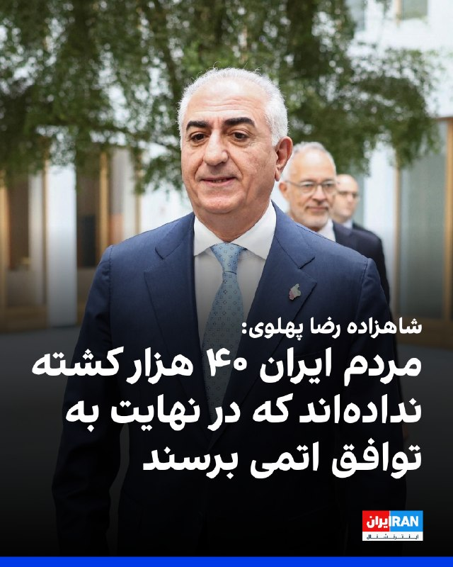

شاهزاده رضا پهلوی در نشست آینده تکنولوژی در ایران گفت که مردم ایران به چیزی جز تغییر کامل نظام رضایت نخواهند داد: «آن‌ها ۴۰ هزار کشته نداده‌اند که در نهایت به توافق اتمی برسند.»

شاهزاده رضا پهلوی افزود: «اتکای مخالفان نظام نباید به نیروی خارجی باشد و باید فرض را بر این گذاشت که کمکی دریافت نمی‌شود اما در صورت دریافت حمایت خارجی روند دستیابی به اهداف آسان‌تر خواهد شد.»
‌🏁 🇬🇧 IranintlTV

🤖 @VahidOOnLine

## VahidOOnLine — post 240532

  <a href="telegram/content/VahidOOnLine_240532_1778971066.mp4" target="_blank">🎬 Download video</a>

ناصر رفیعی، سخنران مذهبی دفتر علی خامنه‌ای، رهبر کشته‌شده جمهوری اسلامی، به نقل از غلامعلی حداد عادل، پدرزن مجتبی خامنه‌ای، گفت اعضای خانواده علی خامنه‌ای پیش از عملیات مرگبار نهم اسفند در مجتمع رهبری باقی ماندند، زیرا مقامات «اطمینان داده بودند» که با نزدیک شدن توافق در مذاکرات، هیچ اقدام نظامی صورت نخواهد گرفت.
رفیعی در این فایل صوتی به نقل از حداد عادل می‌گوید که این اتفاق به‌ این دلیل افتاد که شرایط عادی در بیت بود و «خامنه‌ای خود را در معرض قرار داده بود.»
‌🏁 🇬🇧 IranintlTV

🤖 @VahidOOnLine

## VahidOOnLine — post 240531

  

شاهزاده رضا پهلوی در نشست آینده تکنولوژی در ایران، خطاب به کشورهای جهان گفت: «جمهوری اسلامی ثابت کرده غیرقابل اعتماد است و افزود اگر به دنبال یک شریک واقعی هستید به مردم ایران نگاه کنید.»

شاهزاده رضا پهلوی افزود: «باید این درک مشترک در سطح جهانی شکل بگیرد که با وجود جمهوری اسلامی هیچ کشوری نمی‌تواند احساس امنیت و آرامش پایدار داشته باشد.»

او گفت: «جامعه جهانی باید از مردم ایران برای تغییر حکومت حمایت کند. این اقدام نه‌تنها به سود مردم ایران بلکه به نفع خود کشورهای حامی نیز خواهد بود.»
‌🏁 🇬🇧 IranintlTV

🤖 @VahidOOnLine

## VahidOOnLine — post 240530

  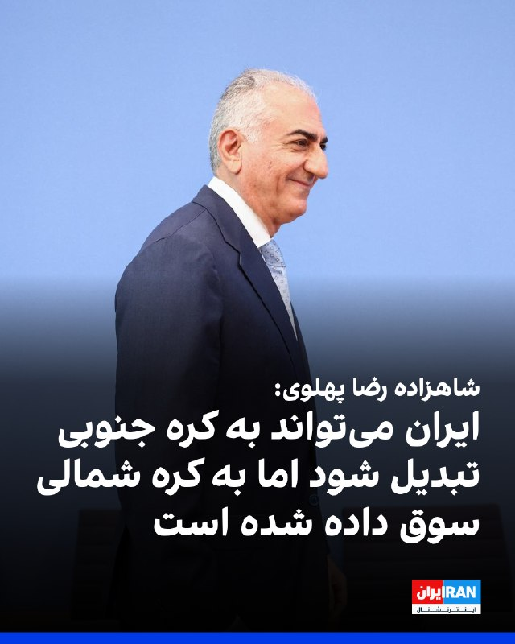

شاهزاده رضا پهلوی در نشست آینده تکنولوژی در ایران، گفت: «ایران می‌تواند به کشوری مانند کره جنوبی تبدیل شود، اما به دلیل وضعیت سیاسی کنونی به سمت الگویی شبیه کره شمالی سوق داده شده است.» شاهزاده رضا پهلوی افزود: «جمهوری اسلامی در ذات خود قابل تغییر نیست.»
‌🏁 🇬🇧 IranintlTV

🤖 @VahidOOnLine

## VahidOOnLine — post 240529

  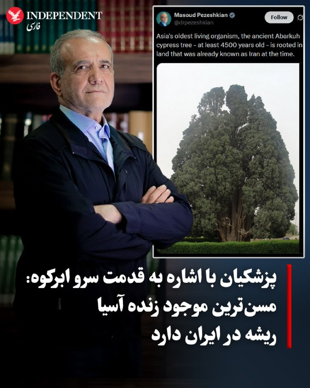

♦️ مسعود پزشکیان روز شنبه ۲۶ اردیبهشت با انتشار تصویری از سرو ابرکوه در شبکه اجتماعی ایکس نوشت: «مسن‌ترین موجود زنده آسیا، درخت سرو کهنسال ابرکوه با قدمتی دست‌کم ۴۵۰۰ ساله، در سرزمینی ریشه دوانده است که حتی در آن دوران نیز به نام ایران شناخته می‌شد.» به نظر می‌رسد که پزشکیان با این پیام که اشاره به قدمت تمدن ایران دارد، قصد دارد ایران را با کشورهای تازه تاسیس منطقه یا ایالات متحده مقایسه کند.

با این‌وجود، اشاره پزشکیان به قدمت سرو ابرکوه، به‌ویژه با بحران آب و خطراتی که در سال‌های اخیر این درخت کهن را تهدید کرده و از سوی مقام‌های جمهوری اسلامی نادیده گرفته شده، با انتقاد کاربران مواجه شد.

سرو ابرکوه، قدیمی‌ترین درخت آسیا و پس از کاج متوشلخ در ایالت کالیفرنیای آمریکا، دومین درخت کهنسال جهان است.
‌🇸🇦 Indypersian

🤖 @VahidOOnLine

## VahidOOnLine — post 240528

  <a href="telegram/content/VahidOOnLine_240528_1778971070.mp4" target="_blank">🎬 Download video</a>

‌
دونالد ترامپ، رئیس‌جمهوری آمریکا، در گفت‌وگو با شبکه فرانسوی بی‌اف‌ام گفت در صورت نرسیدن به توافق، ایران با «دوران بسیار سختی» روبه‌رو خواهد شد.

ترامپ افزود هنوز مشخص نیست توافقی به‌زودی حاصل می‌شود یا نه، اما تاکید کرد «بهتر است ایران توافق کند.»
‌🏁 🇬🇧 ManotoTV

🤖 @VahidOOnLine

## VahidOOnLine — post 240527

  

♦️ دونالد ترامپ، رئیس‌جمهوری آمریکا، روز شنبه ۲۶ اردیبهشت به جمهوری اسلامی هشدار داد که اگر به‌زودی بر سر یک توافق صلح موافقت نکند، «دوران بسیار سختی» را پیش رو خواهد داشت.

ترامپ در یک مصاحبه تلفنی با شبکه تلویزیونی «بی‌اف‌ام» فرانسه (BFMTV) گفت: «به نفع آن‌هاست که به یک توافق دست پیدا کنند.»

ترامپ پیش از این اعلام کرده بود که آخرین پیشنهاد تهران برای شروع مذاکرات را «بعد از خواندن اولین جمله» دور انداخته است. ترامپ بر توقف کامل غنی‌سازی، خروج اورانیوم با غنای بالا از خاک ایران و بازگشت وضعیت تنگه هرمز به شرایط پیش از جنگ تاکید دارد؛ خواسته‌هایی که تاکنون در پیشنهادات متقابل جمهوری اسلامی برآورده نشده‌اند.
‌🇸🇦 Indypersian

🤖 @VahidOOnLine

## VahidOOnLine — post 240526

  

همزمان با انتشار گزارش‌ها از احتمال از سرگیری حملات آمریکا و اسرائیل علیه جمهوری اسلامی، دونالد ترامپ، رییس‌جمهوری آمریکا، انیمیشنی در تروث سوشال منتشر کرد که در آن به ناو آمریکایی دستور شلیک به هدفی با پرچم جمهوری اسلامی را داده و می‌گوید: «در فهرست اهداف‌مان قرار دارد، آتش!»
‌🏁 🇬🇧 IranintlTV

🤖 @VahidOOnLine

## VahidOOnLine — post 240525

  <a href="telegram/content/VahidOOnLine_240525_1778971073.mp4" target="_blank">🎬 Download video</a>

خبرگزرای‌های داخل کشور از وقوع زمین‌لرزه‌ ۴.۵ ریشتری در گلوگاه مازندران خبر دادند.
‌🏁 🇬🇧 ManotoTV

🤖 @VahidOOnLine

## VahidOOnLine — post 240524

  <a href="telegram/content/VahidOOnLine_240524_1778971074.mp4" target="_blank">🎬 Download video</a>

نیویورک‌تایمز گزارش داد مقام‌های ارشد دولت دونالد ترامپ طرح‌هایی برای ازسرگیری حملات نظامی آمریکا به جمهوری اسلامی آماده کرده‌اند؛ حملاتی که در صورت تصمیم نهایی ترامپ، می‌تواند از اوایل هفته آینده آغاز شود.

بر اساس این گزارش، پنتاگون در حال آماده‌سازی دوباره عملیاتی موسوم به «خشم حماسی» است؛ عملیاتی که پس از اعلام آتش‌بس متوقف شده بود. مقام‌های آمریکایی می‌گویند گزینه‌های روی میز شامل حملات گسترده‌تر به اهداف نظامی و زیرساختی جمهوری اسلامی و حتی اعزام نیروهای ویژه برای دستیابی به مواد هسته‌ای مدفون در سایت اصفهان است.

این گزارش می‌افزاید چند صد نیروی ویژه آمریکایی از ماه مارس در خاورمیانه مستقر شده‌اند تا در صورت صدور دستور، در عملیات زمینی احتمالی مشارکت کنند. مقام‌های نظامی آمریکا هشدار داده‌اند چنین عملیاتی می‌تواند با تلفات سنگین همراه باشد.

همزمان شبکه ۱۳ اسرائیل گزارش داد ارتش این کشور در حال ادامه آماده‌سازی‌ها برای احتمال ازسرگیری جنگ با جمهوری اسلامی است و اسرائیل در وضعیت آماده‌باش بالا قرار دارد.

بر اساس این گزارش، ارتش اسرائیل خود را برای سناریوی حملات روزانه ده‌ها موشک از سوی جمهوری اسلامی در روزهای نخست درگیری احتمالی آماده می‌کند.

این گزارش می‌افزاید طرح‌های احتمالی اسرائیل شامل هدف قرار دادن زیرساخت‌ها، تاسیسات انرژی و نیروگاه‌هاست و نیروی هوایی اسرائیل همچنین ممکن است در حملات مشترک، عملیات ترور علیه چهره‌های ارشد را دنبال کند.
‌🏁 🇬🇧 ManotoTV

🤖 @VahidOOnLine

## VahidOOnLine — post 240523

  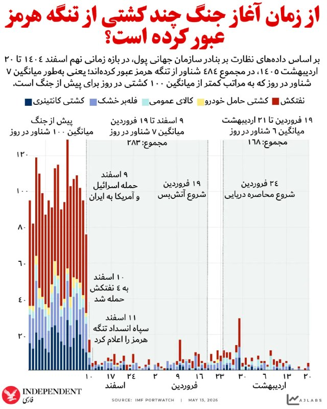

♦️ داده‌های نظارت بر بنادر سازمان جهانی پول نشان می‌دهد که از زمان آغاز جنگ آمریکا و اسرائیل علیه جمهوری اسلامی، میزان تردد شناورها در تنگه هرمز با سقوطی چشمگیر مواجه شده و با وجود برقراری آتش‌بس نیز تغییر چندانی احساس نشده است. این داده‌ها نشان می‌دهد که در بازه زمانی نهم اسفند تا ۱۹ فروردین، تنها حدود ۲۸۳ کشتی از این آبراه حیاتی عبور کرده‌اند که میانگین روزانه آن را به کمتر از هفت می‌رساند؛ رقمی که فاصله فاحشی با تردد روزانه نزدیک به ۱۰۰ کشتی در دوران پیش از جنگ دارد.

نمودار روند این سقوط را به خوبی نشان می‌دهد: پس از حمله آمریکا و اسرائیل به ایران در نهم اسفند، حمله به چهار تانکر در ۱۰ اسفند و اعلام بستن تنگه هرمز توسط سپاه پاسداران در ۱۱ اسفند، ترافیک دریایی ناگهان متوقف شد.

حتی در دوره آتش‌بس این شاهراه انرژی همچنان در رکود کامل به سر می‌برد. در این میان، بیشترین سهم کاهش تردد مربوط به نفت‌کش‌ها (نمودار قرمز) و کشتی‌های کانتینری (نمودار سرمه‌ای) بوده است که نشان‌دهنده ضربه سنگین این بحران به زنجیره تامین انرژی و تجارت جهانی است.
‌🇸🇦 Indypersian

🤖 @VahidOOnLine

## VahidOOnLine — post 240522

  <a href="telegram/content/VahidOOnLine_240522_1778971076.mp4" target="_blank">🎬 Download video</a>

ایرانیان آلمان روز شنبه همزمان با سایر کشورها در حمایت از انقلاب ملی علیه جمهوری اسلامی در شهر کاسل تجمع کردند.
‌🏁 🇬🇧 IranintlTV

🤖 @VahidOOnLine

## WithYashar — post 11432

  <a href="telegram/content/WithYashar_11432_1778971079.mp4" target="_blank">🎬 Download video</a>

مجری : خواهش می‌کنم سلام من رو به مجتبی خامنه‌ای برسونید.

حدادعادل: والا منم به دامادم دسترسی ندارم، از همین‌جا بهش سلام می‌رسونم.
@withyashar

## WithYashar — post 11431

ایران به عبری ی توییت زد ک پیام روشن بود لفاظی نکنید... המסר היה ברור: אל תהיו רטוריים... یعنی کار ایران بوده؟ مث ک کلاهک اتمی اسراییل اونجا نگهداری میشده

## WithYashar — post 11430

ایران به عبری ی توییت زد ک

پیام روشن بود لفاظی نکنید...
המסר היה ברור: אל תהיו רטוריים...
یعنی کار ایران بوده؟
مث ک کلاهک اتمی اسراییل اونجا نگهداری میشده

## WithYashar — post 11429

  <a href="telegram/content/WithYashar_11429_1778971081.mp4" target="_blank">🎬 Download video</a>

ناو هواپیمابر جرالد فورد به خانه بازگشت
@withyashar

## WithYashar — post 11428

  <a href="telegram/content/WithYashar_11428_1778971083.mp4" target="_blank">🎬 Download video</a>

انفجار سنگین در بیت شمش اسرائیل و دیده شدن ابر قارچی گزارش شده که در کارخانه شرکت تومر رخ داد. این شرکت موتورهای موشک سنگین و سبک، از جمله موتورهای پیشران موشک‌های ارو ۲ و ارو ۳، موتور موشک هدف سیلور انکر، موتورهای ماهواره هورایزن و موتورهای موشک باراک ۸ و باراک ام‌ایکس را توسعه و تولید می‌کند.
@withyashar

## WithYashar — post 11427

## WithYashar — post 11426

  <a href="telegram/content/WithYashar_11426_1778971085.mp4" target="_blank">🎬 Download video</a>

امشب بیداریم !
@withyashar

## WithYashar — post 11424

‏ جیمی دیمون، مدیرعامل جی‌پی‌مورگان چیس، درباره ایران:

‏آنها ۴۷ سال است که تجاوز، قتل و کشتار می‌کنند. دنیای غرب اجازه جنگ‌های نیابتی را داد.
‏ما درس عبرت گرفتیم - باید سال‌ها پیش به سراغ سر مار می‌رفتیم.
@withyashar

## WithYashar — post 11423

  

محمد امین صابرکار، دانش‌آموز ۱۷ ساله بسیجی بوشهری،‌ حین انجام تمرینات تیراندازی اشتباها با آتش خودی(فرندلی فایر😬) کشته شد
@withyashar

## WithYashar — post 11422

@withyashar فرهنگ ما همیشه غالب میشه

## WithYashar — post 11421

  <a href="telegram/content/WithYashar_11421_1778971087.mp4" target="_blank">🎬 Download video</a>

گوش جان میسپریم به فریدون عزیز تا من موتورم رو گرم کنم ویس بزارم
@withyashar

## WithYashar — post 11420

  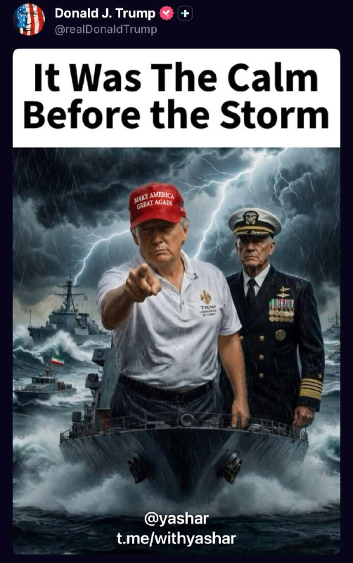

ترامپ در تروث : آرامش فبل از طوفان

قایق تندرو با پرچم جمهوری اسلامی دیده میشود …
@withyashar

## WithYashar — post 11419

## WithYashar — post 11418

  

مشاورین شاهزاده (امیر اعتمادی و سعید قاسمینژاد) ، علی کریمی‌ رو به علت واکنش ‌به کنسرت و آهنگ شاهین نجفی آنفالو کردند @withyashar

## WithYashar — post 11417

شاهزاده رضا پهلوی در نشست آینده تکنولوژی در ایران:

ایران می‌تونه به کره جنوبی تبدیل بشه، اما به دلیل وضعیت سیاسی کنونی به سمت الگویی شبیه کره شمالی سوق داده شده؛ جمهوری اسلامی در ذات خودش قابل تغییر نیست.

@withyashar

## WithYashar — post 11416

کانال ۱۳ اسرائیل:
اسرائیل در بالاترین سطح هشدار برای احتمال از سرگیری جنگ با ایران است. در صورت از سرگیری جنگ با ایران، احتمال دارد ایران در روزهای نخست ده‌ها موشک به سمت اسرائیل شلیک کند.
@withyashar

## WithYashar — post 11415

قلعه نویی در لیست نهایی جام جهانی آزمونو خط زد و گفت باشرف هارو دعوت کردم.
@withyashar

## WithYashar — post 11414

وال استریت ژورنال : ایران و آمریکا بر سر یک موضوع توافق دارند در حالی که بن‌بست دیپلماتیک بین تهران و واشنگتن ادامه دارد, هر دو طرف می‌گویند که در حال حاضر درباره سرنوشت ذخایر اورانیوم غنی‌شده ایران بحث نمی‌کنند.
@withyashar

## WithYashar — post 11413

نتانیاهو : اگه آمریکا دوباره بخواد عملیات نظامی علیه ایران رو شروع کنه، اسرائیل آماده‌ست
@withyashar

## WithYashar — post 11412

داداش ناموسا من اونجا بودم داد میزدم به شاهزاده میگفتم حتما با یاشار ملاقات حضوری بکن

## mwarmonitor — post 9178

🔴ساکنان نزدیک منطقه بیت‌شمش در اسرائیل از یک انفجار شدید و آتش‌سوزی بزرگی خبر دادند که از فاصله دور قابل مشاهده بود. 🔸شبکه Kan News اسرائیل بعداً اعلام کرد که این حادثه یک انفجار کنترل‌شده بوده که داخل یک کارخانه غیرنظامی انجام شده است. هیچ آسیب یا مجروحیتی…

## mwarmonitor — post 9177

  <a href="telegram/content/mwarmonitor_9177_1778971091.mp4" target="_blank">🎬 Download video</a>

🔴ساکنان نزدیک منطقه بیت‌شمش در اسرائیل از یک انفجار شدید و آتش‌سوزی بزرگی خبر دادند که از فاصله دور قابل مشاهده بود.

🔸شبکه Kan News اسرائیل بعداً اعلام کرد که این حادثه یک انفجار کنترل‌شده بوده که داخل یک کارخانه غیرنظامی انجام شده است. هیچ آسیب یا مجروحیتی گزارش نشده است.

@mwarmonitor

## mwarmonitor — post 9176

  

ترامپ در سوشال تروث

«این آرامشِ پیش از طوفان بود»

@mwarmonitor

## mwarmonitor — post 9175

  <a href="telegram/content/mwarmonitor_9175_1778971094.mp4" target="_blank">🎬 Download video</a>

📝 این جرثومه‌های فساد و دوزیستانِ بدنامِ سیاسی، دقیقاً مانند هم‌نوعانِ لجن‌زیستِ خود، تا بوی واریزِ جیره و مواجب به مشامشان می‌رسد، از سوراخ‌های خود بیرون می‌خزند تا با چند کلمه وقاحتِ محض، بقایِ ذلت‌بارشان را تمدید کنند. تویی که امروز پشت این میکروفونِ اجاره‌ای ژستِ مقتدرانه گرفته‌ای و از موضعِ قدرت سخن از «اجازه دادن» می‌گویی، خودت مگر بدون اذن، فرمان‌برداری و دست‌بوسیِ سردارانت تواناییِ یک دم و بازدمِ ساده را داری؟

🔸​تو نیز تن‌فروشِ فکریِ دیگری در بازارِ مکارهٔ این رژیم هستی؛ یک جیره‌خوارِ حقیر که تاریخ مصرفت به تار مویی بند است. اگر فردا روزی ورق برگردد، دست‌پرورده‌های همان سیستمی که امروز برایشان دم می‌جنبانی، مانند آن ماله کشِ اعظم، عراقچی، چنان شلنگِ تخلیهٔ رسوایی، نکبت و فاضلابِ جنایاتشان را روی سر و صورتت باز می‌کنند که حتی نامت هم در تاریخِ این سرزمین مایهٔ تهوع باشد. این پانتومیمِ وقاحت و این نقاب‌های مضحک دیگر هیچ چشمی را نمی‌فریبد؛ سهم تو و امثال تو از این نمایش، تلی از خاکستر و سقوط به همان سیاه‌چالی است که از آن برخاسته‌اید.

@mwarmonitor

## mwarmonitor — post 9174

  

✈️🇺🇸نیروی هوایی آمریکا (USAF)

✈️هواپیمای Boeing TC-135 Stratolifter (یک فروند) AE01D3 62-4129 - OLIVE 29

✈️هواپیمای OLIVE 29 در حال عبور از اقیانوس اطلس است و مستقیم از پایگاه نیروی هوایی اوفوت (Offutt Air Force Base) پرواز کرده؛ مقصد آن یا پایگاه RAF Mildenhall انگلستان است یا شهر خانیا (Chania) قبرس، اما با توجه به مسیر پرواز و اینکه هواپیماهای RC-135 مستقر فعلی در آنجا هستند، احتمال خانیا بیشتر است.

@mwarmonitor

## mwarmonitor — post 9172

  

🔸ترامپ که از پکن برگشته، امروز (طبق گزارش سرویس مخفی) در باشگاه گلف خود در ویرجینیا سپری کرده است.

🔹تصاویر از جو واگنر از شبکه CNN منتشر شده است.

@mwarmonitor

## mwarmonitor — post 9171

  

🔴امروز، محمد باقر سعد داوود الساعدی، یکی از اعضای ارشد کتائب حزب‌الله — یک سازمان تروریستی خارجی که توسط آمریکا تعیین شده است — به شش فقره اتهام مرتبط با تروریسم به دلیل فعالیت‌هایش به عنوان عامل کتائب حزب‌الله و نیروی قدس سپاه پاسداران انقلاب اسلامی ایران متهم شد. محمد باقر سعد داوود الساعدی در ترکیه بازداشت و به ایالات متحده منتقل گردیده است.

🔸 «در فاصله فقط سه ماه، محمد الساعدی ادعا شده که ۱۸ حمله تروریستی در سراسر اروپا را هدایت کرده است — از جمله علیه شهروندان و منافع ایالات متحده — و همچنین قصد داشته حمله‌ای مشابه را در کشور ما انجام دهد. گروه ویژه مشترک مبارزه با تروریسم اف‌بی‌آی نیویورک، اراده‌ای تزلزل‌ناپذیر دارد برای پاسخگو کردن رهبران سازمان‌های تروریستی خارجی که از ترس و رنج گسترده برای پیشبرد دستورکار ضدآمریکایی خود استفاده می‌کنند.»

@mwarmonitor

## mwarmonitor — post 9170

🔴پیش از آن‌که ترامپ برای سفر خود به پکن راهی شود، او — که از نحوه برخورد ایران با مذاکرات برای پایان دادن به جنگ روزبه‌روز ناراضی‌تر می‌شد — طبق گفته منابع آگاه از گفتگوها به CNN، به‌طور جدی‌تر از هفته‌های اخیر در حال بررسی ازسرگیری عملیات نظامی بود.

🔴با این حال، تیم ترامپ آماده بود صبر کند تا ببیند آیا این سفر مهم و دیدارهای رو در رو با رئیس‌جمهور چین، شی جین‌پینگ، می‌تواند به یک پیشرفت قابل توجه منجر شود یا نه.

🔴اما ترامپ روز جمعه بدون تغییر محسوس در وضعیت جنگ ایران به آمریکا بازگشت. اکنون او باید تصمیم بگیرد که آیا آغاز حملات بیشتر به ایران بهترین گزینه برای پایان دادن به این درگیری است یا خیر. CNN

@mwarmonitor

## mwarmonitor — post 9168

🔴شبکه CBC News به نقل از یک منبع پزشکی: تأیید یک مورد ابتلا به ویروس هانتا در کانادا.

@mwarmonitor

## mwarmonitor — post 9167

  <a href="telegram/content/mwarmonitor_9167_1778971098.mp4" target="_blank">🎬 Download video</a>

ترامپ در سوشال تروث

@mwarmonitor

## mwarmonitor — post 9166

  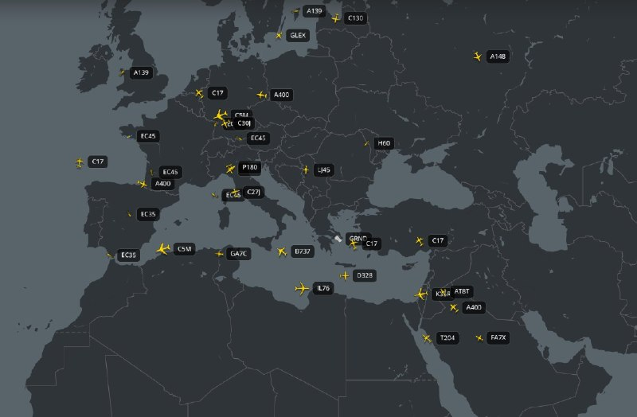

🚨✈️ به نظر می‌رسد آسمان‌ها در حال حاضر به‌طور نگران‌کننده‌ای آرام هستند. حتی هیچ پرواز باری ورودی قابل مشاهده‌ای وجود ندارد، به‌جز یک فروند C-17 که همین حالا در اردن فرود آمده است.

✈️آخرین پروازهای باری نظامی در حال خارج شدن از خاورمیانه هستند.

@mwarmonitor

## FoxNewsTwitter — post 341825

  <a href="telegram/content/FoxNewsTwitter_341825_1778971100.mp4" target="_blank">🎬 Download video</a>

Fox News (Twitter/X)

WELCOME HOME! The USS Winston S. Churchill returned home after a successful 11-month deployment with the USS Gerald R. Ford Carrier Strike Group supporting Operation Epic Fury.

## pm_afshaa — post 90876

🔴میخائیل اولیانوف، نماینده روسیه :
کارشناسا میگن آمریکا و اسرائیل ممکنه به‌زودی دوباره به ایران حمله کنن

💧 Rainbet.com the #1 Non-KYC Crypto Casino & Sportsbook @rainbetcom

😁 @Pm_Afshaa

## pm_afshaa — post 90875

بیرانوند : با صدای بلند و رسا کف آمریکا سرود ملی رو می‌خونم. مخالفا هم نمی‌تونن کاری بکنن

💧 Rainbet.com the #1 Non-KYC Crypto Casino & Sportsbook @rainbetcom

😁 @Pm_Afshaa

## pm_afshaa — post 90874

🔴دیلی میل بریتانیا: کیر استارمر به نزدیکانش گفته است که قصد دارد از سمت نخست‌وزیری کناره‌گیری کند و جدول زمانی منظمی برای ترک این سمت تعیین کند

💧 Rainbet.com the #1 Non-KYC Crypto Casino & Sportsbook @rainbetcom

😁 @Pm_Afshaa

## pm_afshaa — post 90873

🔴نیویورک تایمز به نقل از مقامات نظامی آمریکا: اگر جزیره خارک تصرف شود، نیروهای زمینی برای حفظ آن لازم خواهند بود

💧 Rainbet.com the #1 Non-KYC Crypto Casino & Sportsbook @rainbetcom

😁 @Pm_Afshaa

## pm_afshaa — post 90872

  <a href="telegram/content/pm_afshaa_90872_1778971103.webm" target="_blank">🎬 Download video</a>

سرور اختصاصی NPV / V2RayNG 
📶 
✅مناسب: یوتیوب | اینستاگرام | تلگرام | گیم | وب‌گردی 
✅ اتصال سریع روی همه اپراتورها 
✅بدون افت سرعت حتی در ساعات شلوغ 
➕ ویژگی‌ها: 
⚡️ بدون ضریب 
⚡️ ساب لینک اختصاصی 
⚡️بدون قطعی واقعی 
⚡️ آیپی ثابت (ترکیه 
🇹🇷 | آلمان
🇩🇪…

## pm_afshaa — post 90871

  <a href="telegram/content/pm_afshaa_90871_1778971103.webm" target="_blank">🎬 Download video</a>

سرور اختصاصی NPV / V2RayNG 
📶

✅مناسب: یوتیوب | اینستاگرام | تلگرام | گیم | وب‌گردی

✅ اتصال سریع روی همه اپراتورها

✅بدون افت سرعت حتی در ساعات شلوغ

➕ ویژگی‌ها:

⚡️ بدون ضریب

⚡️ ساب لینک اختصاصی

⚡️بدون قطعی واقعی

⚡️ آیپی ثابت (ترکیه 
🇹🇷 | آلمان
🇩🇪 | آمریکا
🇺🇸 | هلند
🇳🇱 | انگلستان
🏴)

⚡️تست رایگان قبل خرید

✔️ تضمین کیفیت + پشتیبانی 24 ساعته

💰 تک لوکیشن: 160 تومان / هر گیگ (با کد تخفیف)

🌍 مولتی لوکیشن: 200 تومان / هر گیگ (با کد تخفیف)

🎁 کد تخفیف :

conquestback

👇 همین الان بخر / تست بگیر:
@ConQuestVPN_bot

## pm_afshaa — post 90870

  

کاخ سفید پیامی تهدیدآمیز از ترامپ با عنوان «شوخی نداریم» همراه با تصویری از حضور او در اتاق جنگ منتشر کرد

💧 Rainbet.com the #1 Non-KYC Crypto Casino & Sportsbook @rainbetcom

😁 @Pm_Afshaa

## pm_afshaa — post 90868

  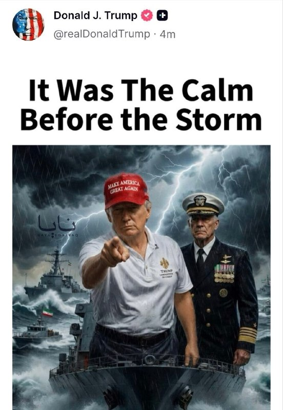

پست جدید ترامپ ارامش قبل از طوفان

💧 Rainbet.com the #1 Non-KYC Crypto Casino & Sportsbook @rainbetcom

😁 @Pm_Afshaa

## pm_afshaa — post 90863

  <a href="telegram/content/pm_afshaa_90863_1778971106.webm" target="_blank">🎬 Download video</a>

🔴قالیباف: جهان در آستانهٔ نظمی نوین قرار دارد. چنان‌که رئیس‌جمهور شی گفت: «تحولی که در یک قرن دیده نشده، در سراسر جهان با شتاب در حال پیشروی است»، و من تأکید می‌کنم که مقاومت ۷۰ روزهٔ ملت ایران این تحول را شتاب بخشیده است. آینده از آنِ جنوب جهانی است.

💧 Rainbet.com the #1 Non-KYC Crypto Casino & Sportsbook @rainbetcom

😁 @Pm_Afshaa

## pm_afshaa — post 90862

🔴سردار آزمون به علت حمایت از مردم ایران از تیم ملی خط خورد

💧 Rainbet.com the #1 Non-KYC Crypto Casino & Sportsbook @rainbetcom

😁 @Pm_Afshaa

## pm_afshaa — post 90861

🔴نتانیاهو : اگه آمریکا دوباره بخواد عملیات نظامی علیه ایران رو شروع کنه، اسرائیل آماده‌ست

💧 Rainbet.com the #1 Non-KYC Crypto Casino & Sportsbook @rainbetcom

😁 @Pm_Afshaa

## pm_afshaa — post 90860

  <a href="telegram/content/pm_afshaa_90860_1778971106.webm" target="_blank">🎬 Download video</a>

🔴کانال 13 اسرائیل:
برآوردها در ارتش اسرائیل اینه که ترامپ پس از بازگشت از چین، دستور حمله به جمهوری اسلامی رو صادر خواهد کرد.

اهداف احتمالی حمله شامل زیرساخت‌های حکومتی، مراکز انرژی، نیروگاه‌ها و همچنین مقام‌های ارشد جمهوری اسلامی خواهد بود.

اسرائیل امیدواره در صورت آغاز درگیری، جنگ فقط چند روز طول بکشه.

💧 Rainbet.com the #1 Non-KYC Crypto Casino & Sportsbook @rainbetcom

😁 @Pm_Afshaa

## VahidOnline — post 75507

  

دونالد ترامپ، رئیس‌جمهور آمریکا، روز شنبه تصویری گرافیکی از خود در کنار یک فرمانده نظامی بر عرشه یک ناو جنگی، در فضایی طوفانی و در میان شناورهایی با پرچم جمهوری اسلامی، در شبکه اجتماعی تروث‌سوشال منتشر کرد که روی آن نوشته است: «این آرامش پیش از طوفان بود.»
@VahidOOnLine

📡 @VahidOnline

## VahidOnline — post 75506

  <a href="telegram/content/VahidOnline_75506_1778971108.mp4" target="_blank">🎬 Download video</a>

دونالد ترامپ، رییس‌جمهوری آمریکا، انیمیشنی در تروث سوشال منتشر کرد که در آن به ناو آمریکایی دستور شلیک به هدفی با پرچم جمهوری اسلامی را داده و می‌گوید: «در فهرست اهداف‌مان قرار دارد، آتش!»
@VahidOOnLine

📡 @VahidOnline

## kianmeli1 — post 87438

  <a href="telegram/content/kianmeli1_87438_1778971108.mp4" target="_blank">🎬 Download video</a>

🔴ناصر رفیعی، سخنران مذهبی دفتر علی خامنه‌ای، رهبر کشته‌شده جمهوری اسلامی، به نقل از غلامعلی حداد عادل، پدرزن مجتبی خامنه‌ای، گفت اعضای خانواده علی خامنه‌ای پیش از عملیات مرگبار نهم اسفند در مجتمع رهبری باقی ماندند، زیرا مقامات «اطمینان داده بودند» که با نزدیک شدن توافق در مذاکرات، هیچ اقدام نظامی صورت نخواهد گرفت.
رفیعی در این فایل صوتی به نقل از حداد عادل می‌گوید که این اتفاق به‌ این دلیل افتاد که شرایط عادی در بیت بود و «خامنه‌ای خود را در معرض قرار داده بود.»
https://t.me/kianmeli1

## kianmeli1 — post 87437

  

🔴خبرنگار فاکس نیوز: ترامپ درحال آماده‌شدن برای دور جدیدی از حملات نظامی به ایران است
https://t.me/kianmeli1

## kianmeli1 — post 87436

  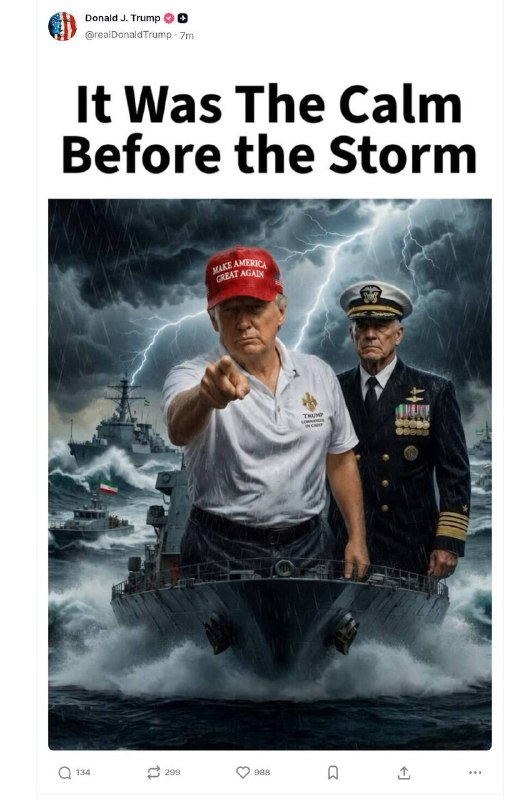

🔴ترامپ در سوشال تروث

«این آرامشِ پیش از طوفان بود»
https://t.me/kianmeli1

## IranIntlTV — post 337543

  <a href="telegram/content/IranIntlTV_337543_1778971113.mp4" target="_blank">🎬 Download video</a>

شاهزاده رضا پهلوی در نشست «آینده تکنولوژی در ایران» گفت با فروپاشی جمهوری اسلامی و بازگشت کارآفرینان ایرانی خارج از کشور، می‌توان در مناطق محروم ایران از جمله سیستان و بلوچستان نیز مراکز بزرگ فناوری و تکنولوژی تاسیس کرد.

او همچنین بر نقش دیاسپورای ایرانی در رساندن صدای مردم ایران و سرنگونی جمهوری اسلامی به جهان تاکید کرد.

گفت‌وگو با نجات بهرامی، تحلیل‌گر سیاسی
@iranintltv

## IranIntlTV — post 337542

  <a href="telegram/content/IranIntlTV_337542_1778971115.mp4" target="_blank">🎬 Download video</a>

پارسا تاجیک، مهندس شرکت «ایکس ای‌آی»، در گفت‌وگو با نیلوفر منصوری، خبرنگار ایران‌اینترنشنال، درباره روند تغییر پرچم ایران به شیروخورشید در شبکه اجتماعی ایکس، توییتر سابق، توضیح داد.
@iranintltv

## IranIntlTV — post 337541

  <a href="https://t.me/IranintlTV/337541" target="_blank">📎 Download file</a>

🎧نسخه صوتی سیاست با مراد ویسی: آرامش قبل از طوفان
@iranintlTV

## IranIntlTV — post 337540

  <a href="telegram/content/IranIntlTV_337540_1778971118.mp4" target="_blank">🎬 Download video</a>

یکی از شرکت‌کنندگان در تجمع اعتراضی ایرانیان در سان‌فرانسیسکو به نیلوفر منصوری، خبرنگار ایران‌اینترنشنال، گفت: «همه ایرانیان قهرمانان زندگی ما هستند و می‌خواهیم بگوییم از اینجا پشت شما هستیم.»

او افزود: «هیچ‌وقت متوقف نمی‌شویم تا زمانی که جمهوری اسلامی سرنگون شود و همه زندانیان سیاسی آزاد شوند. میلیون‌ها نفر در سراسر دنیا در کنار شما و در کنار شاهزاده‌مان ایستاده‌اند.»
@iranintltv

## IranIntlTV — post 337539

  <a href="telegram/content/IranIntlTV_337539_1778971121.mp4" target="_blank">🎬 Download video</a>

ایرانیان ساکن سان‌فرانسیسکو تجمعی اعتراضی در حمایت از انقلاب ملی ایرانیان و شاهزاده رضا پهلوی و درخواست برای همراهی دولت آمریکا با مردم ایران برگزار کردند.

گزارش نیلوفر منصوری، خبرنگار ایران‌اینترنشنال و گفت‌وگو با یکی از شرکت‌کنندگان
@iranintltv

## IranIntlTV — post 337538

  <a href="telegram/content/IranIntlTV_337538_1778971123.mp4" target="_blank">🎬 Download video</a>

نیویورک‌تایمز گزارش داد دستیاران دونالد ترامپ در حال آماده‌سازی طرح‌هایی برای از سرگیری حملات نظامی علیه جمهوری اسلامی هستند.

دو مقام خاورمیانه‌ای نیز به این روزنامه گفته‌اند احتمال دارد این حملات از اوایل هفته آینده آغاز شود.

گفت‌وگو با امیر گیتی، عضو تحریریه ایران‌اینترنشنال
@iranintltv

## IranIntlTV — post 337537

  <a href="telegram/content/IranIntlTV_337537_1778971125.mp4" target="_blank">🎬 Download video</a>

دونالد ترامپ، رییس‌جمهوری آمریکا، روز شنبه ۲۶ اردیبهشت، در شبکه اجتماعی تروث سوشال انیمیشنی منتشر کرد که در آن به یک ناو جنگی آمریکا دستور می‌دهد به هواپیمایی با پرچم جمهوری اسلامی شلیک کند و می‌گوید: «بسیار خب، آن را در دیدرس داریم. آتش!»

## IranIntlTV — post 337536

  <a href="telegram/content/IranIntlTV_337536_1778971129.mp4" target="_blank">🎬 Download video</a>

مراد ویسی، تحلیل‌گر ارشد سیاسی، گفت: «ترامپ پس از سفر چین گزینه‌های مختلفی در برابر جمهوری اسلامی دارد. از تشدید فشار محاصره به امید توافق تا عملیات محدود در تنگه هرمز و خلیج فارس و در نهایت حملات گسترده و هدف قراردادن لایه دیگری از مقامات و فرماندهان ارشد سپاه پاسداران.»
@iranintltv

## IranIntlTV — post 337535

  

میخائیل اولیانوف، نماینده روسیه در سازمان‌های بین‌المللی با اشاره به قریب‌الوقوع بودن ازسرگیری احتمالی حملات علیه جمهوری اسلامی در ایکس نوشت: «اگر این موضوع درست باشد، به این معناست که آمریکا و اسرائیل از اشتباهات راهبردی گذشته خود درس نمی‌گیرند.»
https://iranintl.com/202605163047

## IranIntlTV — post 337534

  <a href="telegram/content/IranIntlTV_337534_1778971132.mp4" target="_blank">🎬 Download video</a>

مراد ویسی، تحلیل‌گر ارشد ایران‌اینترنشنال، گفت: «شاهزاده رضا پهلوی روز شنبه در نشستی درباره آینده تکنولوژی در ایران، بر غیرقابل‌اصلاح بودن جمهوری اسلامی و وجود اتفاق‌نظر ملی برای سرنگونی آن تاکید کرد و گفت سیاست مماشات با حکومت نتیجه‌ای نخواهد داشت.»
@iranintltv

## IranIntlTV — post 337533

  <a href="telegram/content/IranIntlTV_337533_1778971134.mp4" target="_blank">🎬 Download video</a>

مراد ویسی، تحلیل‌گر ارشد ایران‌اینترنشنال، گفت: «اکثریت مردم در صورت شروع جنگ جدید امیدوارند که این جنگ به سرنگونی جمهوری اسلامی منتج شود. اکثریت مردم از حمله به ساختارهای سرکوب و هدف قرار گرفتن مقامات و فرماندهان سرکوبگر حمایت می‌کنند.»
@iranintltv

## IranIntlTV — post 337532

  <a href="telegram/content/IranIntlTV_337532_1778971136.mp4" target="_blank">🎬 Download video</a>

بلومبرگ گزارش داد توقف صادرات نفت ایران از خارک به احتمال زیاد ناشی از لکه نفتی ایجادشده اطراف این جزیره است.

بنابر این گزارش، تولید نفت ایران نسبت به پیش از جنگ روزانه نیم‌میلیون بشکه کاهش یافته است.

گفت‌وگو با مهدی مصلحی، کارشناس بازار نفت
@iranintltv

## IranIntlTV — post 337531

  <a href="telegram/content/IranIntlTV_337531_1778971138.mp4" target="_blank">🎬 Download video</a>

🔻ماتیاس گرافستروم، دبیرکل فیفا پس از جلسه با مهدی تاج، رییس فدراسیون فوتبال ایران درباره گفت: «نشست بسیار خوبی با فدراسیون فوتبال ایران داشتیم. فکر می‌کنم بسیار نزدیک با یکدیگر همکاری می‌کنیم و مشتاقانه منتظر استقبال از آن‌ها در جام جهانی ۲۰۲۶ در آمریکا، کانادا و مکزیک هستیم.»

🔹او گفت: «همچنین فرصت داشتیم درباره برخی مسائل اجرایی صحبت کنیم؛ همان‌طور که با تمام فدراسیون‌های عضو این کار را انجام می‌دهیم.»

🔹دبیرکل فیفا در پاسخ به سوالی درباره تضمین‌های مورد نظر فدراسیون فوتبال ایران برای ویزا و ورود تیم ملی به آمریکا و کانادا گفت: «فکر می‌کنم اینجا جای مطرح کردن جزئیات نیست. مشتاق ادامه گفت‌وگوها هستیم. درست مانند گفت‌وگوهایی که با همه فدراسیون‌های عضو داریم.»

🔹همچنین تاج درباره این جلسه گفت: «جلسه خیلی خوبی بود؛ ۱۰ موردی که گفته بودیم را شنیدند و برای هر کدام راه حل‌هایی ارائه کردند. امیدوارم که تیم ملی به جام جهانی برود و نتایج خوبی بگیرد.»

🔹تاج پیش‌تر گفته بود اگر فیفا به فدراسیون فوتبال ضمانت‌های لازم را ندهد، تیم ملی در جام جهانی حاضر نخواهد شد.

🔹جزییات بیشتر را در سایت بخوانید

@iranintltvsport

## IranIntlTV — post 337530

  <a href="telegram/content/IranIntlTV_337530_1778971140.mp4" target="_blank">🎬 Download video</a>

کانال ۱۲ اسرائیل به نقل از یک مقام این کشور گزارش داد دونالد ترامپ ظرف ۲۴ ساعت آینده درباره حمله دوباره به ایران تصمیم خواهد گرفت.

این مقام همچنین گفته جنگ دوباره با جمهوری اسلامی نزدیک است.

گفت‌وگو با بن سبطی، پژوهشگر ایران و اسرائیل
@iranintltv

## IranIntlTV — post 337529

  

دونالد ترامپ، رییس‌جمهوری آمریکا، طرحی گرافیکی در تروث سوشال منتشر کرد که در آن روی یک ناو در دریایی مواج ایستاده و شناوری با پرچم جمهوری اسلامی در محاصره ناوهای آمریکایی قرار دارد و در آن نوشته شده است: «این آرامش پیش از طوفان بود.»
https://iranintl.com/202605167228

## IranIntlTV — post 337528

  <a href="telegram/content/IranIntlTV_337528_1778971143.mp4" target="_blank">🎬 Download video</a>

شاهزاده رضا پهلوی در نشست «آینده تکنولوژی در ایران» با رد مشروعیت ساختار سیاسی جمهوری اسلامی و چهره‌هایی چون محمدباقر قالیباف گفت مردم ایران این همه کشته و هزینه نداده‌اند که بار دیگر تن به «ماموریت‌های مهره‌های این حکومت» بدهند.

او تاکید کرد: «ما باید به دنیا ثابت کنیم که ملت ایران، شریک بهتری برای جامعه جهانی است تا بقایای این حکومت.»
@iranintltv

## IranIntlTV — post 337527

  <a href="telegram/content/IranIntlTV_337527_1778971145.mp4" target="_blank">🎬 Download video</a>

شاهزاده رضا پهلوی در نشست «آینده تکنولوژی در ایران» گفت حتی اگر دوران گذار با موفقیت طی شود و مردم نظام آینده را انتخاب کنند، بدون احزاب و زیرساخت سیاسی آماده، اداره کشور ممکن نخواهد بود.

او افزود: «اگر بخواهیم سیاسی فکر کنیم، اولویت نخست یک هدف ملی است؛ هدفی فراتر از چپ و راست، جمهوری‌خواه و پادشاهی‌خواه یا هر گرایش دیگر. اما وقتی وارد مرحله سیاست عملی می‌شویم، باید زیرساخت سیاسی کشور را هم فراهم کنیم. پایه‌های تحزب در ایران باید تقویت شود.»
@iranintltv

## IranIntlTV — post 337526

  <a href="telegram/content/IranIntlTV_337526_1778971148.mp4" target="_blank">🎬 Download video</a>

شاهزاده رضا پهلوی در نشست «آینده تکنولوژی در ایران» با تشریح وظایف دولت انتقالی پس از فروپاشی جمهوری اسلامی، تاکید کرد که هدف اصلی، فراهم کردن زمینه روند دموکراتیک برای تعیین شکل نهایی حکومت است. او گفت به نفع هیچ جریانی به جز «دموکراسی» موضع نخواهد گرفت.

@iranintltv

## IranIntlTV — post 337525

  

شاهزاده رضا پهلوی در نشست آینده تکنولوژی در ایران گفت که مردم ایران به چیزی جز تغییر کامل نظام رضایت نخواهند داد: «آن‌ها ۴۰ هزار کشته نداده‌اند که در نهایت به توافق اتمی برسند.»

شاهزاده رضا پهلوی افزود: «اتکای مخالفان نظام نباید به نیروی خارجی باشد و باید فرض را بر این گذاشت که کمکی دریافت نمی‌شود اما در صورت دریافت حمایت خارجی روند دستیابی به اهداف آسان‌تر خواهد شد.»
https://iranintl.com/202605161817

## IranIntlTV — post 337524

  <a href="telegram/content/IranIntlTV_337524_1778971151.mp4" target="_blank">🎬 Download video</a>

ناصر رفیعی، سخنران مذهبی دفتر علی خامنه‌ای، رهبر کشته‌شده جمهوری اسلامی، به نقل از غلامعلی حداد عادل، پدرزن مجتبی خامنه‌ای، گفت اعضای خانواده علی خامنه‌ای پیش از عملیات مرگبار نهم اسفند در مجتمع رهبری باقی ماندند، زیرا مقامات «اطمینان داده بودند» که با نزدیک شدن توافق در مذاکرات، هیچ اقدام نظامی صورت نخواهد گرفت.
رفیعی در این فایل صوتی به نقل از حداد عادل می‌گوید که این اتفاق به‌ این دلیل افتاد که شرایط عادی در بیت بود و «خامنه‌ای خود را در معرض قرار داده بود.»

## Shin_Persian — post 6043

  

🔁 Quoting above tweet:
Shin ✓ @hey_itsmyturn
Sat, 16 May 2026 21:25:20 UTC

President Trump @POTUS:
"https://x.com/lauraloomer/status/2055609922935496847?s=42"

فارسی

رئیس‌جمهور ترامپ @POTUS:
"https://x.com/lauraloomer/status/2055609922935496847?s=42"

𝕏 · @shin_persian

## Shin_Persian — post 6042

  

↩️ Quoted tweet: Laura Loomer ✓ @LauraLoomer Sat, 16 May 2026 11:22:51 UTC EXCLUSIVE: 🚨 Congressman Randy Fine @RepFine tells me he was approached by Cynthia West @Cyntaxed007 (Thomas Massie’s accuser) last year in Florida about Thomas Massie’s @RepThomasMassie…

## Shin_Persian — post 6041

↩️ Quoted tweet:
Laura Loomer ✓ @LauraLoomer
Sat, 16 May 2026 11:22:51 UTC

EXCLUSIVE:

🚨 Congressman Randy Fine @RepFine tells me he was approached by Cynthia West @Cyntaxed007 (Thomas Massie’s accuser) last year in Florida about Thomas Massie’s @RepThomasMassie alleged financial ties to Iran. 🚨

Rep. Randy Fine revealed to me that he met Thomas

↩️ توییت نقل‌قول شده — برای پاسخ، پست زیر را ببینید.

فارسی

اختصاصی:

🚨 رندی فاین @RepFine، عضو کنگره، به من گفت که سال گذشته در فلوریدا، سینتیا وست @Cyntaxed007 (متهم‌کننده توماس ماسی) در مورد پیوندهای مالی ادعایی توماس ماسی @RepThomasMassie با ایران به او مراجعه کرده است. 🚨

نماینده رندی فاین برای من فاش کرد که با توماس ملاقات کرده است...

𝕏 · @shin_persian

## Shin_Persian — post 6040

  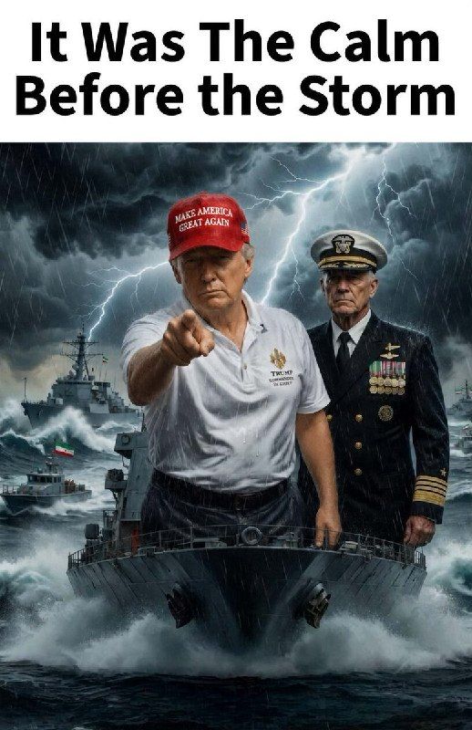

Shin ✓ @hey_itsmyturn
Sat, 16 May 2026 20:23:35 UTC

POTUS on his Truth:

فارسی

رئیس‌جمهور ایالات متحده (POTUS) در حساب تروث سوشال خود:

𝕏 · @shin_persian

## Shin_Persian — post 6039

  

🔁 Quoting above tweet: DefenceGeek 🇬🇧 ✓ @DefenceGeek Sat, 16 May 2026 20:14:02 UTC Along with the 2x RAF P-8A "Poseidon" maritime patrol aircraft noted by @ArmchairAdml, the US Navy has had 3x P-8A operating in the North Atlantic today I first noted 2…

## Shin_Persian — post 6038

🔁 Quoting above tweet:
DefenceGeek 🇬🇧 ✓ @DefenceGeek
Sat, 16 May 2026 20:14:02 UTC

Along with the 2x RAF P-8A "Poseidon" maritime patrol aircraft noted by @ArmchairAdml, the US Navy has had 3x P-8A operating in the North Atlantic today

I first noted 2 depart Lajes earlier, then with a friend departed Iceland in the last 2hrs!

They've found a submarine...

فارسی

در کنار ۲ فروند هواپیمای گشت دریایی P-8A "Poseidon" متعلق به نیروی هوایی سلطنتی بریتانیا (RAF) که توسط @ArmchairAdml به آن‌ها اشاره شد، نیروی دریایی ایالات متحده نیز امروز ۳ فروند P-8A در شمال اقیانوس اطلس در حال عملیات داشته است.

من ابتدا خروج ۲ فروند را پیش‌تر از «لاژس» ثبت کردم و پس از آن، یک فروند دیگر در ۲ ساعت گذشته از ایسلند خارج شد!

آن‌ها یک زیردریایی پیدا کرده‌اند...

𝕏 · @shin_persian

## Shin_Persian — post 6036

  <a href="telegram/content/Shin_Persian_6036_1778971156.mp4" target="_blank">🎬 Download video</a>

↩️ Quoted tweet: Armchair Admiral 🇬🇧 ✓ @ArmchairAdml Sat, 16 May 2026 19:59:34 UTC #RAF Royal Air Force Boeing Poseidon MRA.1 2x #43C91E ZP807 - RAFAIR 7046 #43C91A ZP803 - RAFAIR 7042 RAFAIR 7046 departed RAF Lossiemouth this evening for a North Atlantic…

## Shin_Persian — post 6035

↩️ Quoted tweet:
Armchair Admiral 🇬🇧 ✓ @ArmchairAdml
Sat, 16 May 2026 19:59:34 UTC

#RAF Royal Air Force

Boeing Poseidon MRA.1 2x
#43C91E ZP807 - RAFAIR 7046
#43C91A ZP803 - RAFAIR 7042

RAFAIR 7046 departed RAF Lossiemouth this evening for a North Atlantic patrol. RAFAIR 7042 is already on station and operating over the Atlantic.

@MATA_osint @flightradar24

↩️ توییت نقل‌قول شده — برای پاسخ، پست زیر را ببینید.

فارسی

#RAF نیروی هوایی سلطنتی بریتانیا

بوئینگ پوزایدون MRA.1 ۲ فروند
#43C91E ZP807 - RAFAIR 7046
#43C91A ZP803 - RAFAIR 7042

پرواز RAFAIR 7046 عصر امروز پایگاه هوایی لوسی‌موث (RAF Lossiemouth) را برای گشت‌زنی در شمال اقیانوس اطلس ترک کرد. پرواز RAFAIR 7042 از قبل در منطقه مستقر شده و بر فراز اقیانوس اطلس در حال عملیات است.

@MATA_osint @flightradar24_

𝕏 · @shin_persian

## ManotoTV — post 105541

  <a href="telegram/content/ManotoTV_105541_1778971158.mp4" target="_blank">🎬 Download video</a>

‌
دونالد ترامپ، رئیس‌جمهوری آمریکا، تصویری تولیدشده با هوش مصنوعی را در شبکه اجتماعی تروث‌سوشال منتشر کرد که روی آن نوشته شده بود: «این آرامش پیش از طوفان بود.»

در این تصویر، ترامپ در میان ناوهای جنگی و هوایی طوفانی دیده می‌شود؛ پستی که در بحبوحه افزایش تنش‌ها با جمهوری اسلامی و گمانه‌زنی‌ها درباره احتمال ازسرگیری حملات آمریکا و اسرائیل به ایران منتشر شده است.

## ManotoTV — post 105540

  <a href="telegram/content/ManotoTV_105540_1778971159.mp4" target="_blank">🎬 Download video</a>

هند و امارات متحده عربی در جریان سفر نارندرا مودی، نخست‌وزیر هند، به ابوظبی، چند توافق‌نامه در حوزه‌های دفاعی، انرژی و حمل‌ونقل دریایی امضا کردند.

بر اساس این توافق‌ها، دو کشور همکاری در زمینه امنیت دریایی، دفاع سایبری، فناوری‌های پیشرفته، تبادل اطلاعات و صنایع دفاعی را گسترش خواهند داد.

در بخش انرژی نیز توافقی درباره ذخایر راهبردی نفت و ذخیره‌سازی نفت خام هند در فجیره امضا شده است.

این دیدار در حالی انجام شد که امارات پیش‌تر جمهوری اسلامی را به حمله پهپادی و موشکی به فجیره متهم کرده بود؛ حمله‌ای که به آتش‌سوزی در یک پالایشگاه و زخمی شدن سه کارگر هندی منجر شد.

نارندرا مودی در دیدار با محمد بن زاید، رئیس امارات، حملات به امارات را محکوم کرد و دو طرف بر گسترش روابط اقتصادی و امنیتی تاکید کردند.

## ManotoTV — post 105539

  <a href="telegram/content/ManotoTV_105539_1778971159.mp4" target="_blank">🎬 Download video</a>

‌
شاهزاده رضا پهلوی در «نشست آینده تکنولوژی در ایران» گفت اقتصاد آینده ایران نباید بر پایه نفت، بلکه بر مبنای سرمایه‌گذاری داخلی و خارجی و نقش پررنگ بخش خصوصی شکل بگیرد.

او با تاکید بر اهمیت سرمایه‌گذاری در فناوری، هوش مصنوعی، انرژی‌های تجدیدپذیر و گردشگری گفت ایران ظرفیت آن را دارد که از صنعت گردشگری حتی بیش از نفت و گاز درآمد داشته باشد.

شاهزاده رضا پهلوی افزود توسعه زیرساخت‌هایی مانند فرودگاه‌ها، جاده‌ها، هتل‌ها و رسیدگی به مسائل زیست‌محیطی می‌تواند ایران را به مقصدی جذاب برای گردشگران تبدیل کند.

او همچنین با اشاره به محرومیت مناطقی مانند سیستان‌ و بلوچستان و بخش‌هایی از کردستان گفت این مناطق به دلیل تبعیض مذهبی جمهوری اسلامی مورد بی‌توجهی قرار گرفته‌اند، اما با جذب سرمایه‌گذاری می‌توانند به‌سرعت متحول شوند.

شاهزاده رضا پهلوی تاکید کرد ارائه چشم‌اندازی روشن برای بازسازی ایران پس از آزادی سیاسی، یکی از مهم‌ترین چالش‌ها و پروژه‌های پیش‌روی مخالفان جمهوری اسلامی است.

## ManotoTV — post 105538

  <a href="telegram/content/ManotoTV_105538_1778971162.mp4" target="_blank">🎬 Download video</a>

‌
دولت دونالد ترامپ معافیت تحریمی خرید نفت دریایی روسیه را که پس از جنگ آمریکا و اسرائیل با جمهوری اسلامی و بسته شدن تنگه هرمز صادر شده بود، تمدید نکرد.

این معافیت به کشورهایی از جمله هند اجازه می‌داد به خرید نفت روسیه ادامه دهند و برای یک ماه تمدید شده بود، اما روز شنبه به پایان رسید.

اسکات بسنت، وزیر خزانه‌داری آمریکا، پیش‌تر گفته بود این مجوز تمدید نخواهد شد. تا عصر شنبه نیز هیچ تمدیدی در وب‌سایت وزارت خزانه‌داری آمریکا منتشر نشد.

## ManotoTV — post 105537

  <a href="telegram/content/ManotoTV_105537_1778971163.mp4" target="_blank">🎬 Download video</a>

شاهزاده رضا پهلوی در پاسخ به پرسشی درباره زمان بازگشت ایرانیان خارج از کشور، در «نشست آینده تکنولوژی در ایران» گفت سرعت تغییرات در ایران به عملکرد مردم و میزان حمایت و فشار کشورهای تاثیرگذار بستگی دارد.

او با تاکید بر اینکه مردم ایران نباید به نیروی خارجی متکی باشند، گفت هرگونه حمایت بین‌المللی می‌تواند روند تغییر را کوتاه‌تر و آسان‌تر کند، اما ایرانیان خود باید عامل اصلی این تحول باشند.

شاهزاده رضا پهلوی افزود مردم ایران «چهل هزار کشته ندادند» که نتیجه آن تنها یک توافق هسته‌ای یا ادامه جمهوری اسلامی با چهره‌هایی مانند محمدباقر قالیباف باشد و تاکید کرد ایرانیان «کمتر از تغییر کامل نظام» را نخواهند پذیرفت.

شاهزاده رضا پهلوی با اشاره به دولت دونالد ترامپ گفت مخالفان جمهوری اسلامی باید دولت‌های تاثیرگذار، به‌ویژه آمریکا، را قانع کنند که به‌جای توافق دوباره با جمهوری اسلامی، روی مردم ایران سرمایه‌گذاری کنند.

او تاکید کرد راه‌حل‌های اقتصادی، علمی و تکنولوژیک برای آینده ایران وجود دارد و آنچه اکنون اهمیت دارد، «اراده سیاسی و تصمیم‌گیری» دولت‌های تاثیرگذار برای حمایت از آزادی ایران است.

## ManotoTV — post 105536

  <a href="telegram/content/ManotoTV_105536_1778971165.mp4" target="_blank">🎬 Download video</a>

‌
شاهزاده رضا پهلوی در «نشست آینده تکنولوژی در ایران» گفت ایرانیان موفق در سیلیکون‌ولی می‌توانند الگوی توسعه آینده ایران باشند و نشان دهند که با تغییر وضعیت سیاسی، چه فرصت‌هایی برای کشور ایجاد خواهد شد.

او با اشاره به توانایی متخصصان ایرانی در حوزه فناوری و هوش مصنوعی گفت نمونه‌ای مشابه سیلیکون‌ولی حتی می‌تواند در بلوچستان شکل بگیرد و ایران ظرفیت تبدیل شدن به کشوری پیشرفته را دارد.

شاهزاده رضا پهلوی تاکید کرد مشکلات اقتصادی و معیشتی کنونی به دلیل ناتوانی مردم یا کمبود امکانات نیست و افزود: «ایران می‌تواند کره جنوبی باشد؛ اما به‌دلیل وضعیت سیاسی، به کره شمالی تبدیل شده است.»

## ManotoTV — post 105535

  <a href="telegram/content/ManotoTV_105535_1778971167.mp4" target="_blank">🎬 Download video</a>

‌
دونالد ترامپ، رئیس‌جمهوری آمریکا، در گفت‌وگو با شبکه فرانسوی بی‌اف‌ام گفت در صورت نرسیدن به توافق، ایران با «دوران بسیار سختی» روبه‌رو خواهد شد.

ترامپ افزود هنوز مشخص نیست توافقی به‌زودی حاصل می‌شود یا نه، اما تاکید کرد «بهتر است ایران توافق کند.»

## ManotoTV — post 105534

  <a href="telegram/content/ManotoTV_105534_1778971167.mp4" target="_blank">🎬 Download video</a>

خبرگزرای‌های داخل کشور از وقوع زمین‌لرزه‌ ۴.۵ ریشتری در گلوگاه مازندران خبر دادند.

## ManotoTV — post 105533

  <a href="telegram/content/ManotoTV_105533_1778971168.mp4" target="_blank">🎬 Download video</a>

نیویورک‌تایمز گزارش داد مقام‌های ارشد دولت دونالد ترامپ طرح‌هایی برای ازسرگیری حملات نظامی آمریکا به جمهوری اسلامی آماده کرده‌اند؛ حملاتی که در صورت تصمیم نهایی ترامپ، می‌تواند از اوایل هفته آینده آغاز شود.

بر اساس این گزارش، پنتاگون در حال آماده‌سازی دوباره عملیاتی موسوم به «خشم حماسی» است؛ عملیاتی که پس از اعلام آتش‌بس متوقف شده بود. مقام‌های آمریکایی می‌گویند گزینه‌های روی میز شامل حملات گسترده‌تر به اهداف نظامی و زیرساختی جمهوری اسلامی و حتی اعزام نیروهای ویژه برای دستیابی به مواد هسته‌ای مدفون در سایت اصفهان است.

این گزارش می‌افزاید چند صد نیروی ویژه آمریکایی از ماه مارس در خاورمیانه مستقر شده‌اند تا در صورت صدور دستور، در عملیات زمینی احتمالی مشارکت کنند. مقام‌های نظامی آمریکا هشدار داده‌اند چنین عملیاتی می‌تواند با تلفات سنگین همراه باشد.

همزمان شبکه ۱۳ اسرائیل گزارش داد ارتش این کشور در حال ادامه آماده‌سازی‌ها برای احتمال ازسرگیری جنگ با جمهوری اسلامی است و اسرائیل در وضعیت آماده‌باش بالا قرار دارد.

بر اساس این گزارش، ارتش اسرائیل خود را برای سناریوی حملات روزانه ده‌ها موشک از سوی جمهوری اسلامی در روزهای نخست درگیری احتمالی آماده می‌کند.

این گزارش می‌افزاید طرح‌های احتمالی اسرائیل شامل هدف قرار دادن زیرساخت‌ها، تاسیسات انرژی و نیروگاه‌هاست و نیروی هوایی اسرائیل همچنین ممکن است در حملات مشترک، عملیات ترور علیه چهره‌های ارشد را دنبال کند.

## FarsiVOA — post 217932

🔺مهدی تاج با دبیرکل فیفا «در ترکیه» درباره حضور در «جام جهانی» گفت‌وگو کرد

▪️بر اساس گزارش‌ها، مهدی تاج رئیس فدراسیون فوتبال جمهوری اسلامی با دبیرکل فیفا ماتیاس گرافستروم، در زمینه بررسی شرایط حضور تیم فوتبال ایران در جام‌جهانی در ترکیه گفت‌وگو کرد.

⬇️ بیشتر بخوانید:
https://ir.voanews.com/a/8150726.html
@FarsiVOA

## FarsiVOA — post 217931

  

⚡️دونالد ترامپ، رئیس‌جمهوری آمریکا، روز شنبه ۲۶ اردیبهشت تصویری گرافیکی از خود در کنار یک فرمانده نظامی بر عرشه یک ناو جنگی، در فضایی طوفانی و در میان شناورهایی با پرچم جمهوری اسلامی، در شبکه اجتماعی تروت‌سوشال منتشر کرد که روی آن نوشته است: «این آرامش پیش از طوفان بود.»

رئیس جمهوری ایالات متحده که به تازگی از سفر به چین بازگشته است پیشتر به خبرنگاران گفت که صبر او در برابر جمهوری اسلامی رو به پایان است و تهران باید با واشنگتن به توافق برسد.

آقای ترامپ روز شنبه نیز پست دیگری را در شبکه اجتماعی تروت‌سوشال منتشر کرد که در آن یک ویدیوی گرافیکی کوتاه از شلیک یک ناو آمریکایی به یک پهپاد یا هواگرد مهاجم نمایش داده می‌شود.

در گوشه‌ای پایین این ویدیو تصویر، پرزیدنت ترامپ به نمایش درآمده که می‌گوید: «بسیار خوب، ما آن را در دید خود داریم... آتش... بوم!»

روزنامه نیویورک‌تایمز با اشاره به بن‌بست مذاکرات میان آمریکا و «باقیمانده» رژیم ایران به نقل از دو مقام خاورمیانه‌ای گزارش داد که آمریکا و اسرائیل در حال انجام «فشرده‌ترین آماده‌سازی‌ها» برای احتمال ازسرگیری حملات علیه جمهوری اسلامی هستند.

@FarsiVOA

## FarsiVOA — post 217930

🔺بزرگترین ناو هواپیمابر جهان پس از مشارکت در عملیات نظامی علیه جمهوری اسلامی و دستگیری مادورو به ویرجینیا بازگشت

▪️ناو هواپیمابر یو‌اس‌اس جرالد آر. فورد، بزرگترین ناو هواپیمابر جهان، روز شنبه پس از ۱۱ ماه استقرار، طولانی‌ترین مدت از زمان جنگ ویتنام، به خانه خود در ایالت ویرجینیا بازگشت.

⬇️ بیشتر بخوانید:
https://ir.voanews.com/a/8150723.html
@FarsiVOA

## FarsiVOA — post 217929

⚡️مستند بلند «تمرین‌هایی برای یک انقلاب» ساخته پگاه آهنگرانی در هفتاد‌ونهمین دوره فیلم کن به نمایش درآمد و با تشویق ممتد تماشاگران روبه‌رو شد.
@FarsiVOA

## FarsiVOA — post 217928

  <a href="telegram/content/FarsiVOA_217928_1778971170.mp4" target="_blank">🎬 Download video</a>

⚡️نمایش فیلم «تمرین‌هایی برای یک انقلاب» ساخته پگاه آهنگرانی در جشنواره کن
@FarsiVOA

## FarsiVOA — post 217927

🔺پست جدید ترامپ در تروت‌سوشال؛ تصویر گرافیکی از حمله ناو آمریکایی به یک هواگرد مهاجم

▪️رئیس جمهوری ایالات متحده روز شنبه ۲۶ اردیبهشت پستی را در شبکه اجتماعی تروت‌سوشال منتشر کرد که در آن یک ویدیوی گرافیکی کوتاه از شلیک یک ناو آمریکایی به یک پهپاد یا هواگرد مهاجم نمایش داده می‌شود.

⬇️ بیشتر بخوانید:

https://ir.voanews.com/a/8150713.html
@FarsiVOA

## FarsiVOA — post 217926

نت‌بلاکس، نهاد ناظر بر اختلالات اینترنت، اعلام کرد خاموشی دیجیتال در ایران وارد هفته دوازدهم و روز هفتادوهشتم شده است؛ محدودیتی بی‌سابقه که به گفته این نهاد، کشوری ۹۰ میلیونی را تا حد زیادی از اینترنت جهانی جدا کرده و حقوق بشر، اقتصاد و آزادی‌های بنیادین شهروندان را در مقیاسی گسترده فرسایش می‌دهد.

این در حالی است که الیاس حضرتی، رئیس شورای اطلاع‌رسانی دولت، در سخنانی تازه گفته است سیاست دولت پزشکیان «گشایش اینترنت بین‌الملل» است و این سیاست «بروبرگرد ندارد».

حضرتی گفته است وقتی ۸۰ درصد مردم از فیلترشکن استفاده می‌کنند، فیلترینگ چه معنایی دارد و اگر هدف جلوگیری از دسترسی مردم به برخی سایت‌ها بوده، این هدف نه تنها محقق نشده، بلکه به گفته او «بدتر» هم شده است.

او همچنین گفته اختلاف‌نظرهایی میان مسئولان درباره گشایش اینترنت وجود دارد، اما دولت تلاش می‌کند این مسئله را از مسیر گفت‌وگو حل کند.

اما هم‌زمان با این اظهارات، گزارش‌های داخلی نشان می‌دهد محدودیت‌ها نه فقط ادامه دارد، بلکه برخی ابزارهای پایه کار دیجیتال دوباره از دسترس خارج شده‌اند.

گزارش کامل را در وب‌سایت صدای آمریکا بخوانید.

@FarsiVOA

## FarsiVOA — post 217925

حضور ناگهانی ژنرال دیوید پترائوس در بغداد و دیدار با رئیس شورای عالی قضایی عراق حامل چه پیامی است؟

## FarsiVOA — post 217924

گفت‌وگو با منصور سهرابی وقتی نفت به دریا می‌ریزد؛ جزیره خارک و نشت نفت و بن‌بست صادراتی

## FarsiVOA — post 217923

توافق اروپا برای محاکمه رهبران روسیه؛ هم‌زمان با موج حملات گسترده مسکو به شهرهای اوکراین

## FarsiVOA — post 217922

در هفتاد و نهمین فستیوال فیلم کن «تمرین‌های برای یک انقلاب » ساخته پگاه آهنگرانی به نمایش در آمد . مراسم فرش قرمز این فیلم بارحضور پگاه آهنگرانی ، علی عظیمی ، منیژه حکت و کاوه فرنام همراه بود

## FarsiVOA — post 217921

🔺ترامپ: به آمریکایی‌ها آسیب برسانید، کشته خواهید شد

▪️حساب رسمی کاخ سفید در ایکس روز شنبه ۲۶ اردیبهشت نقل قولی را از پرزیدنت ترامپ منتشر کرد که در آن به کسانی که قصد دارند به شهروندان آمریکایی آسیب بزنند، هشدار جدی داده شده است.

⬇️ بیشتر بخوانید:

https://ir.voanews.com/a/8150710.html/?nocach=1

## FarsiVOA — post 217920

🔺ارتش اسرائیل: آخر این هفته، حدود ۱۰۰ موضع متعلق به حزب‌الله در جنوب لبنان را هدف قرار دادیم

▪️ارتش اسرائیل شامگاه شنبه ۲۶ اردیبهشت اعلام کرد در دو روز پایانی هفته (جمعه و شنبه)، حدود ۱۰۰ موضع متعلق به گروه تروریستی حزب‌الله در جنوب لبنان را هدف قرار داده است.

⬇️ بیشتر بخوانید:

https://ir.voanews.com/a/8150704.html/?nocach=1

## DW_Farsi — post 124777

  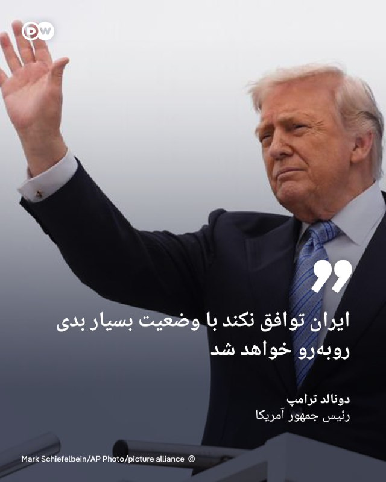

🔶 ترامپ: ایران توافق نکند با "وضعیت بسیار بدی" روبه‌رو خواهد شد

دونالد ترامپ، رئیس‌ جمهور آمریکا، گفته است ایران "به توافق علاقه‌مند است" و هشدار داده در غیر این صورت با "وضعیت بسیار بدی" روبه‌رو خواهد شد.

ترامپ در گفت‌وگو با شبکه فرانسوی BFMTV گفته هنوز مشخص نیست مذاکرات درباره برنامه هسته‌ای ایران و تنش‌های اخیر به توافق منجر شود یا نه.

او افزود: «اگر توافق نکنند، دوران بسیار سختی خواهند داشت.»

این اظهارات در حالی مطرح می‌شود که مذاکرات برای پایان دادن به درگیری‌ها تاکنون به نتیجه نرسیده است. گزارش‌ها حاکی از آن است که ترامپ در حال بررسی ازسرگیری حملات علیه ایران است.
@dw_farsi

## DW_Farsi — post 124776

  

🔶 وزیر کشور پاکستان در سفری اعلام‌نشده وارد تهران شد

رسانه‌های ایران گزارش داده‌اند که محسن نقوی، وزیر کشور پاکستان، در سفری از پیش اعلام‌نشده وارد تهران شده است.

به گزارش ایرنا و ایسنا، او قرار است با برخی مقام‌های ایرانی از جمله اسکندر مومنی، وزیر کشور ایران، دیدار کند.

جزئیاتی درباره محور گفت‌وگوها منتشر نشده، اما نقوی پیش‌تر نیز در فروردین‌ماه همراه فرمانده ارتش پاکستان به تهران سفر کرده و در دیدارهای رسمی با مقام‌های ارشد جمهوری اسلامی حضور داشت.
@dw_farsi

## DW_Farsi — post 124775

  

🔶 شهرداری تهران از ۱۲۶۰ کشته و آسیب به ۵۱ هزار خانه در جنگ خبر داد

سخنگوی شهرداری تهران می‌گوید، در جریان "جنگ ۴۰ روزه" میان ایران، آمریکا و اسرائیل، دست‌کم ۱۲۶۰ نفر در تهران کشته و بیش از ۲۸۰۰ نفر زخمی شدند.

عبدالمطهر محمدخانی اعلام کرد که در این مدت ۶۵۰ مورد اصابت در پایتخت ثبت شده و حدود ۵۱ هزار واحد مسکونی آسیب دیده‌اند؛ بخش عمده آن‌ها خسارت‌های جزئی مانند شکستن شیشه‌ها و آسیب به در و پنجره بوده است.

به گفته او، بیش از ۱۰ هزار خودرو و ۷۵۴ موتورسیکلت نیز آسیب دیده‌اند و حدود ۲۲ میلیارد تومان خسارت به ناوگان اتوبوسرانی تهران وارد شده است.

محمدخانی همچنین گفت برخی نیروهای آتش‌نشانی که در محل انفجارها حضور داشتند، دچار مشکلات تنفسی ناشی از گازهای سمی شده‌اند.
@dw_farsi

## DW_Farsi — post 124774

  

🔶 نت‌بلاکس: قطع اینترنت در ایران وارد دوازدهمین هفته شد

سازمان نظارت بر اینترنت نت‌بلاکس اعلام کرده قطع گسترده اینترنت در ایران وارد دوازدهمین هفته و هفتادوهشتمین روز خود شده است.

نت‌بلاکس در شبکه ایکس نوشته این محدودیت، کشوری با حدود ۹۰ میلیون جمعیت را برای مدتی "بی‌سابقه" تا حد زیادی از اینترنت جهانی جدا کرده و همچنان بر حقوق شهروندی، اقتصاد و آزادی‌های اساسی تأثیر می‌گذارد.

این سازمان پیش‌تر نیز هشدار داده بود که ادامه محدودیت‌ها، یکی از طولانی‌ترین اختلال‌های اینترنتی ثبت‌شده در یک جامعه متصل به اینترنت محسوب می‌شود.
@dw_farsi

## DW_Farsi — post 124773

  

🔶 نورنیوز از آماده‌سازی طرح "پاسخ فوری" ایران به آمریکا خبر داد

یک مقام نظامی آگاه به نورنیوز، نزدیک به شورای عالی امنیت ملی گفته است، در صورت هرگونه اقدام نظامی آمریکا علیه ایران، نیروهای مسلح جمهوری اسلامی طرح "پاسخ فوری و گسترده" را اجرا خواهند کرد.

این مقام گفته است: «اهدافی که در جریان جنگ ۴۰ روزه، بنا بر ملاحظاتی مورد اصابت قرار نگرفتند، این‌بار در اولویت عملیاتی قرار گرفته‌اند.»

او همچنین گفته پاسخ احتمالی ایران بر اساس "حداکثر فشار متقابل" طراحی شده و شامل حملات همزمان به منافع و زیرساخت‌های آمریکا در منطقه خواهد بود.

این اظهارات پس از آن مطرح می‌شود که دونالد ترامپ از احتمال انجام "عملیات پاکسازی سبک" علیه ایران سخن گفته بود.
@dw_farsi

## Persian_Trend_Official — post 14280

  <a href="telegram/content/Persian_Trend_Official_14280_1778971175.mp4" target="_blank">🎬 Download video</a>

شبتون بخیر ❤️🌙✨️

📝 Nick
📌 @persian_trend_official
پرشین ترند | متفاوت‌ترین کانال نظامی

## Persian_Trend_Official — post 14278

  <a href="telegram/content/Persian_Trend_Official_14278_1778971178.mp4" target="_blank">🎬 Download video</a>

🔴 رسانه‌های اسرائیلی از انفجار در کارخانه صنایع موشکی «تومر» خبر دادند 💢رسانه‌های اسرائیلی گزارش دادند انفجاری در کارخانه شرکت «تومر» رخ داده است؛ شرکتی که در حوزه توسعه و تولید موتورهای موشکی و سامانه‌های پیشران فعالیت می‌کند. ▪️بر اساس گزارش‌ها، این شرکت…

## Persian_Trend_Official — post 14277

🔴انفجار بزرگ در بیت‌شمش 💢رسانه‌های عبری از وقوع انفجاری بسیار بزرگ در بیت‌شمش در اسرائیل خبر می‌دهند. 💢این رسانه‌ها با بیان اینکه ارتش مانع از ورود خودروهای امدادی به محل حادثه می‌شود، تصریح کردند این انفجار احتمالاً در تأسیساتی حساس رخ داده است. 🫆:Tony…

## Persian_Trend_Official — post 14276

  

🔴انفجار بزرگ در بیت‌شمش 💢رسانه‌های عبری از وقوع انفجاری بسیار بزرگ در بیت‌شمش در اسرائیل خبر می‌دهند. 💢این رسانه‌ها با بیان اینکه ارتش مانع از ورود خودروهای امدادی به محل حادثه می‌شود، تصریح کردند این انفجار احتمالاً در تأسیساتی حساس رخ داده است. 🫆:Tony…

## Persian_Trend_Official — post 14275

  <a href="telegram/content/Persian_Trend_Official_14275_1778971181.mp4" target="_blank">🎬 Download video</a>

🔴انفجار بزرگ در بیت‌شمش

💢رسانه‌های عبری از وقوع انفجاری بسیار بزرگ در بیت‌شمش در اسرائیل خبر می‌دهند.

💢این رسانه‌ها با بیان اینکه ارتش مانع از ورود خودروهای امدادی به محل حادثه می‌شود، تصریح کردند این انفجار احتمالاً در تأسیساتی حساس رخ داده است.

🫆:Tony

📌 @persian_trend_official
پرشین ترند | متفاوت‌ترین کانال نظامی

## Persian_Trend_Official — post 14274

https://youtube.com/live/Lj3xWW7IbLA?feature=share

## Persian_Trend_Official — post 14273

  

🔴خبرنگار فاکس نیوز

💢ترامپ درحال آماده‌شدن برای دور جدیدی از حملات نظامی به ایران است

🫆:Tony

📌 @persian_trend_official
پرشین ترند | متفاوت‌ترین کانال نظامی

## Persian_Trend_Official — post 14272

  

💢پست ترامپ

این آرامش قبل از طوفانه

🫆:Tony

📌 @persian_trend_official
پرشین ترند | متفاوت‌ترین کانال نظام

## Persian_Trend_Official — post 14271

  

💢تکرار تهدید کاخ سفید با انتشار تصویری از ترامپ در اتاق جنگ

💢کاخ سفید پیامی تهدیدآمیز از رئیس جمهوری آمریکا با عنوان «شوخی نداریم» همراه با تصویری از حضور او در اتاق جنگ منتشر کرد.

💢در پیام کاخ سفید آمده است: «اگر به آمریکایی‌ها آسیب بزنید، یا برای آسیب‌زدن به آمریکایی‌ها توطئه و طرح‌ریزی کنید، ما شما را خواهیم یافت.»

🫆:Tony

📌 @persian_trend_official
پرشین ترند | متفاوت‌ترین کانال نظامی

## Persian_Trend_Official — post 14270

  <a href="telegram/content/Persian_Trend_Official_14270_1778971185.webm" target="_blank">🎬 Download video</a>

نسخه صوتی لایو امشب در پلتفرم کست باکس : https://castbox.fm/vi/945937615

## Persian_Trend_Official — post 14269

نسخه صوتی لایو امشب در پلتفرم کست باکس :
https://castbox.fm/vi/945937615

## Persian_Trend_Official — post 14268

نسخه صوتی لایو امشب در پلتفرم اسپاتیفای :

https://open.spotify.com/episode/2Mw2hfeg12829w5zlJVOkO?si=0nFXW0pdTmCsCyiYukkcsQ

## Persian_Trend_Official — post 14267

🔴آمریکا معافیت تحریم نفت روسیه را تمدید نکرد

💢به گزارش رویترز، آمریکا روز شنبه معافیت تحریمی که پیشتر به کشورهایی از جمله هند اجازه می‌داد نفت روسیه را خریداری کنند، تمدید نکرد.

💢این معافیت قبلاً به مدت یک ماه تمدید شده بود تا کمبود عرضه نفت و قیمت‌های بالا ناشی از بسته شدن تنگه هرمز توسط ایران کاهش یابد.

💢اسکات بسنت، وزیر خزانه‌داری آمریکا پیشتر گفته بود که مجوز خرید نفت روسیه ذخیره‌شده روی تانکرها را تمدید نخواهد کرد.

🫆:Tony

📌 @persian_trend_official
پرشین ترند | متفاوت‌ترین کانال نظامی

## Persian_Trend_Official — post 14266

  <a href="telegram/content/Persian_Trend_Official_14266_1778971185.webm" target="_blank">🎬 Download video</a>

🔴تارنمای بیمهٔ ایرانی تنگهٔ هرمز راه‌اندازی شد

💢تارنمای «هرمز سیف» (Hormuz Safe) ارائه بیمه به محموله‌های دریایی عبوری از تنگهٔ هرمز را شروع کرد.

💢مقررات این تارنمای بیمه می‌گوید، بیمه‌نامه‌هایی سریع و با قابلیت تایید رمزنگاری شده برای محموله‌هایی که از خلیج فارس، تنگهٔ هرمز و آبراه‌های اطراف آن عبور می‌کنند، ارائه می‌شود و پرداخت‌ها با ارز دیجیتال تسویه خواهد شد.

🫆:Tony

📌 @persian_trend_official
پرشین ترند | متفاوت‌ترین کانال نظامی

## Persian_Trend_Official — post 14265

⭕️ ادعای ترامپ:
ایران روزهای بسیار سختی در پیش خواهد داشت.

📝 Nick

📌 @persian_trend_official
پرشین ترند | متفاوت‌ترین کانال نظامی

## Persian_Trend_Official — post 14264

https://youtube.com/live/Lj3xWW7IbLA?feature=share

## Persian_Trend_Official — post 14263

⭕️👽 ادعای جنجالی دریاسالار بازنشسته آمریکا درباره پدیده‌های ناشناس؛ «هوش غیرانسانی» در کار است.

تیم گالادت، دریاسالار بازنشسته نیروی دریایی آمریکا، در اظهاراتی جنجالی گفت پدیده‌های ناشناس هوایی ممکن است تحت هدایت «هوشی غیرانسانی و در سطحی بالاتر» باشند.

به گزارش فاکس‌نیوز، گالادت که از چهره‌های شناخته‌شده در بحث پدیده‌های ناشناس هوایی در آمریکا به شمار می‌رود، گفته است داده‌ها و ویدئوهایی را دیده که نشان می‌دهد برخی از این اشیا میان اقیانوس و جو زمین، بدون ایجاد اختلال آشکار در سطح آب، با سرعت‌هایی فراتر از فناوری شناخته‌شده حرکت می‌کنند.

او تأکید کرد این اشیا نه شبیه فناوری آمریکا هستند و نه شبیه فناوری رقبای این کشور. گالادت گفت: «ما فناوری‌ای نداریم که بتواند چنین کاری انجام دهد.»

این دریاسالار بازنشسته همچنین مدعی شد شواهدی وجود دارد که نشان می‌دهد حرکت این پدیده‌ها تحت کنترل هوشی غیرانسانی است؛ ادعایی که بار دیگر بحث درباره ماهیت پدیده‌های ناشناس هوایی و میزان اطلاعات پنهان‌شده از افکار عمومی را داغ کرده است.

📝 Nick

📌 @persian_trend_official
پرشین ترند | متفاوت‌ترین کانال نظامی

## Persian_Trend_Official — post 14262

  <a href="telegram/content/Persian_Trend_Official_14262_1778971186.mp4" target="_blank">🎬 Download video</a>

💢پست جدید ترامپ و تمسخر دوباره پهپاد های جمهوری اسلامی ...

🫆:Tony

📌 @persian_trend_official
پرشین ترند | متفاوت‌ترین کانال نظامی

## Persian_Trend_Official — post 14261

🔴 مهم‌ترین تحولات منطقه

▪️ حماس تأیید کرد «عزالدین الحداد» فرمانده شاخه نظامی گردان‌های قسام، در حمله روز جمعه اسرائیل به غزه کشته شده است

▪️ وزیر کشور پاکستان در سفری غیرمنتظره به تهران با همتای ایرانی خود درباره ثبات منطقه‌ای
و همکاری‌های دوجانبه گفت‌وگو کرد.

▪️ فرماندهی مرکزی ارتش آمریکا (سنتکام) اعلام کرد در ادامه محاصره بنادر ایران، مسیر حرکت ۷۸ کشتی تجاری را تغییر داده است

▪️ اسرائیل حملات خود به لبنان را با وجود آتش‌بس ادامه داد؛ در حملات جدید دست‌کم ۳ نفر در جنوب لبنان کشته شدند

▪️ وزارت بهداشت لبنان اعلام کرد از اوایل مارس تاکنون
۲۹۶۹ نفر در حملات اسرائیل کشته و ۹۱۱۲ نفر زخمی شده‌اند.

🫆:Tony

📌 @persian_trend_official
پرشین ترند | متفاوت‌ترین کانال نظامی

## Persian_Trend_Official — post 14260

  <a href="telegram/content/Persian_Trend_Official_14260_1778971187.mp4" target="_blank">🎬 Download video</a>

⭕️ ناوشکن وینستون چرچیل (DDG-81) از کلاس آرلی برک فلایت IIA که فرماندهی گروه ضربت ناو هواپیمابر فورد را بر عهده داشت، پس از یک‌سال مأموریت طاقت‌فرسا در فرماندهی اروپا، آفریقا و در نهایت فرماندهی مرکزی و شرکت در عملیات خشم حماسی، اکنون به پایگاه مادر خود، پایگاه نیروی دریایی می‌پورت در جکسون‌ویل، فلوریدا بازگشته است.

پ.ن: شرایط عملیاتی ناوشکن‌ها نسبت به ناوهای هواپیمابر به مراتب سخت‌تر و حساس‌تر می‌باشد. ولی معمولاً در رسانه‌ها اشاره‌ای به نقش پررنگ ناوشکن‌ها که در خط اول انجام مأموریت‌های تهاجمی و پدافندی قرار دارند، نمی‌شود.

📝 Nick

📌 @persian_trend_official
پرشین ترند | متفاوت‌ترین کانال نظامی

## RadioFarda — post 157274

🔸دولت ترامپ روز شنبه ۲۶ اردیبهشت معافیت تحریم نفت روی دریای روسیه را که پیش‌تر به کشورهایی از جمله هند امکان می‌داد آن را خریداری کنند، تمدید نکرد و اجازه داد که منقضی شود. 🔸این معافیت پس از یک تمدید یک‌ماهه با هدف کاهش کمبود عرضه نفت و مهار افزایش قیمت‌ها…

## RadioFarda — post 157273

  

🔸دولت ترامپ روز شنبه ۲۶ اردیبهشت معافیت تحریم نفت روی دریای روسیه را که پیش‌تر به کشورهایی از جمله هند امکان می‌داد آن را خریداری کنند، تمدید نکرد و اجازه داد که منقضی شود.

🔸این معافیت پس از یک تمدید یک‌ماهه با هدف کاهش کمبود عرضه نفت و مهار افزایش قیمت‌ها در پی جنگ با ایران و بسته شدن تنگه هرمز، برقرار مانده بود.

🔸اسکات بسنت، وزیر خزانه‌داری آمریکا، پیش‌تر گفته بود که مجوز عمومی مربوط به خرید نفت روسیه ذخیره‌شده در نفتکش‌ها را تمدید نخواهد کرد.

🔸به گزارش خبرگزاری رویترز، تا بعدازظهر شنبه به وقت واشینگتن، هیچ اطلاعیه‌ای دربارهٔ تمدید این معافیت در وب‌سایت وزارت خزانه‌داری منتشر نشده بود. سخنگوی این وزارتخانه نیز از ارائه توضیح بیشتر خودداری کرد.

@RadioFarda

## RadioFarda — post 157272

🔸وب‌سایت خبرآنلاین در گزارشی از بازار سیاه اینترنت طبقاتی که با عنوان «اینترنت پرو» شناخته می‌شود، نوشت تبدیل شدن «دسترسی به اینترنت آزاد» به یک کالای لوکس و زیرزمینی، شبکهٔ توزیع اینترنت کشور را با فساد ساختاری مواجه کرده است. 🔸بر اساس این گزارش که روز شنبه…

## RadioFarda — post 157271

  

🔸وب‌سایت خبرآنلاین در گزارشی از بازار سیاه اینترنت طبقاتی که با عنوان «اینترنت پرو» شناخته می‌شود، نوشت تبدیل شدن «دسترسی به اینترنت آزاد» به یک کالای لوکس و زیرزمینی، شبکهٔ توزیع اینترنت کشور را با فساد ساختاری مواجه کرده است.

🔸بر اساس این گزارش که روز شنبه ۲۶ اردیبهشت منتشر شد، شبکه‌ای غیررسمی از دلالان شکل گرفته که با دریافت مبالغ میلیونی، شهروندان متقاضی را به‌عنوان کارمند شرکت‌ها یا اعضای اصناف معرفی می‌کنند تا امکان اتصال به اینترنت پیدا کنند.

🔸این دلالان با استفاده از خلأهای نظارتی، نام متقاضیان را در فهرست شرکت‌ها ثبت می‌کنند؛ اقدامی که در میان واسطه‌ها با عنوان‌هایی مانند «رد کردن نامه» یا «ثبت در لیست شرکت» شناخته می‌شود.

@RadioFarda

## IranianMinds — post 20261

  <a href="telegram/content/IranianMinds_20261_1778971191.mp4" target="_blank">🎬 Download video</a>

🔴 علیرضا بیرانوند :

سرود جمهوری اسلامی رو با صدای بلند میخونم و مخالفا هم هیچ کاری نمیتونن بکنن

@IranianMinds

## IranianMinds — post 20260

  

🔴 کاخ سفید :

هیچ بازی ای در کار نیست ، اگر به آمریکایی ها آسیبی برسانید یا برنامه ای برای این کار داشته باشید ما شمارو پیدا میکنیم و میکشیم !

@IranianMinds

## IranianMinds — post 20259

  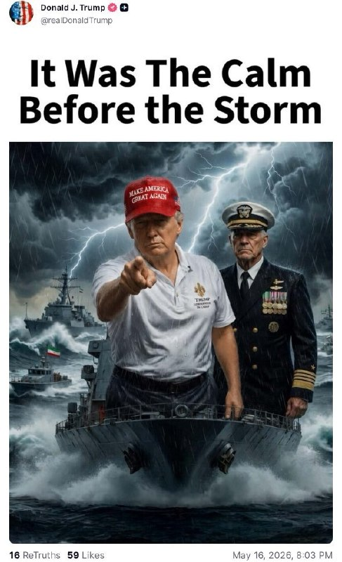

🔴پست ترامپ در تروث‌سوشال:

این آرامش قبل از طوفان بود.

@IranianMinds

## IranianMinds — post 20258

  <a href="telegram/content/IranianMinds_20258_1778971194.mp4" target="_blank">🎬 Download video</a>

🔴دونالد ترامپ در تروث‌سوشال یک انیمیشنی را منتشر کرد که در آن به ناو آمریکایی دستور شلیک به هدفی که پرچم جمهوری اسلامی را دارد داده و می‌گوید در فهرست اهدافمان، آتش.

@IranianMinds

## IranianMinds — post 20257

  

🔴 پست جدید ترامپ که دوباره گرفته رو‌ بایدن یتیم:

@IranianMinds

## IranianMinds — post 20256

🔴ترامپ:

حکومت ایران بهتره که به توافق برسه، اگه این‌‌کارو نکنن، دوران بسیار بدی در انتظارشون خواهد بود.

@IranianMinds

## IranianMinds — post 20255

  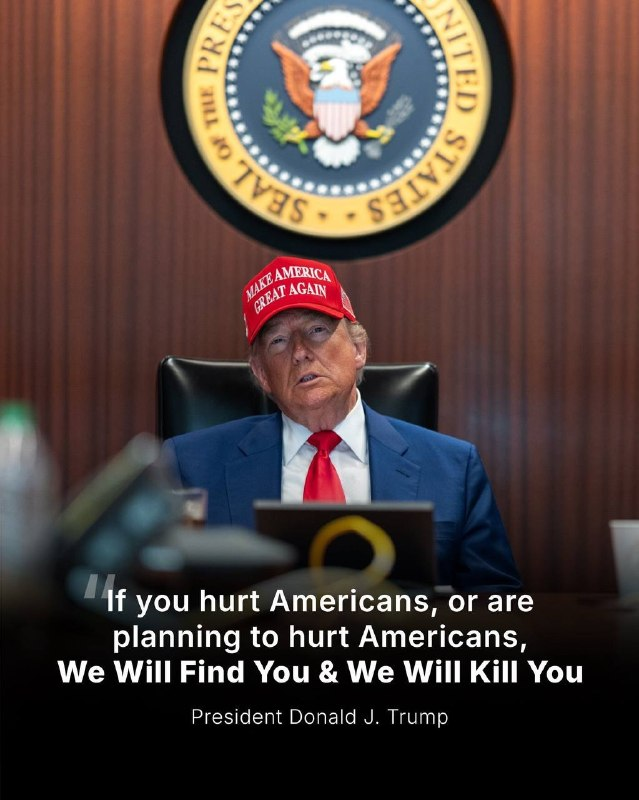

🔴ترامپ:

اگر به آمریکایی‌ها آسیب بزنید، یا در حال برنامه‌ریزی برای آسیب زدن به آمریکا‌یی‌ها باشید، ما شما را پیدا خواهیم کرد و شما را خواهیم کشت.

@IranianMinds

## IranianMinds — post 20254

🔴زمین‌لرزه‌ای به قدرت ۴.۵ ریشتر، دقایقی پیش، گلوگاه در استان مازندران را لرراند.

@IranianMinds

## BBCPersian — post 281243

🔻لبنان: بیش از ۲۹۰۰ نفر از آغاز جنگ در حملات اسرائیل کشته شده‌اند

مقام‌های لبنانی می‌گویند که حملات اسرائیل از زمان آغاز جنگ تاکنون بیش از ۲۹۰۰ کشته در لبنان بر جای گذاشته است؛ از جمله بیش از ۴۰۰ نفر از زمان اجرایی شدن آتش‌بس جان خود را از دست داده‌اند.

اسرائیل هم اعلام کرده است که از زمان آغاز درگیری‌ها با حزب‌الله، ۱۹ سربازش در جنوب لبنان کشته شده‌اند.

حملات اخیر پس از آن انجام شد که نمایندگان اسرائیل و لبنان در واشنگتن مذاکراتی برگزار کردند. دو کشور روابط دیپلماتیک رسمی ندارند اما توافق کردند که آتش‌بس تمدید شود.

حزب‌الله مورد حمایت ایران با این مذاکرات مخالف است و امروز مسئولیت حمله‌ علیه نیروهای اسرائیلی را بر عهده گرفت.

این گروه اسرائیل را متهم کرد که آتش‌بس را نقض می کند.

حزب‌الله در بیانیه امروز اعلام کرد که ایجاد مسیر امنیتی با میانجی‌گری آمریکا، افزوده‌ای جدیدی «به سلسله امتیازهای رایگانی» است که دولت لبنان «به دشمن ارائه می‌کند.»

در این بیانیه آمده است: «بسیاری از لبنانی‌ها تمدید آتش‌بس از طریق این مسیر را ادامه کشتار جاری و پوششی برای تجاوز علیه خود و سرزمینشان می‌دانند.»

ساکنان آواره‌شده جنوب لبنان هم می‌گویند که آتش‌بس در عمل اجرا نمی‌شود.
@BBCPersian

## BBCPersian — post 281242

  

‌🔻مقام‌های کانادا می‌گویند که آزمایش یک شهروند این کشور که با کشتی هوندیوس سفر می‌کرد، برای ابتلا به ویروس هانتا مثبت شده است.

شیوع ویروس هانتا در این کشتی در ماه گذشته تا کنون باعث مرگ سه مسافر آن شده است.

این فرد کانادایی، یکی از چهار نفری است که پس از ترک کشتی در جزیره ونکوور قرنطینه شده بود و حال، علائم خفیفی از این بیماری در او دیده ‌می‌شود.

بانی هنری، مقام ارشد بهداشت استان بریتیش کلمبیا، گفت که این چهار نفر از زمان ورود به کانادا هیچ تماسی با مردم نداشته‌اند.

با ابتلای این فرد، تعداد کل مبتلایان به ویروس هانتا به ۱۱ نفر می‌رسد که همگی از مسافران کشتی هوندیوس هستند.

خانم هنری گفت که یک آزمایشگاه ملی میکروبیولوژی باید جواب آزمایش این فرد را تایید کند.

به گزارش خبرگزاری سی‌بی‌سی، خانم هنری گفت: «هانتا، ویروسی «بسیار متفاوت از سایر ویروس‌های تنفسی است که با آنها سر و کار داشته‌ایم اما آن را دارای پتانسیل همه‌گیری نمی‌دانیم.»

از شش کانادایی که مسافر این کشتی هلندی بودند، دو نفر در خانه خود در استان آنتاریو در قرنطینه هستند.
📷Getty
@BBCPersian

## BBCPersian — post 281241

  

‌🔻مردی در شهر مودنا در شمال ایتالیا با خودرو خود با چندین عابر پیاده برخورد و هشت نفر را زخمی کرد. حال چهار نفر از آنها وخیم گزارش شده است.

یکی از مجروحان زنی است که گفته می‌شود هر دو پایش خرد شده است.

عابران پس از تعقیب راننده خودرو، یک «مرد سی و چند ساله» را دستگیر و به پلیس تحویل دادند.

جورجیا ملونی، نخست‌وزیر ایتالیا، این واقعه را «بسیار جدی» توصیف کرد. همچنین ماسیمو مزتی، شهردار مودنا، در ادامه واکنش خانم ملونی گفت اگر مشخص شود که این یک حمله از پیش برنامه‌ریزی شده بوده، «حتی جدی‌تر» خواهد بود.

این حادثه بعد از ظهر شنبه ۱۶ مه اتفاق افتاد. یک شاهد عینی گفت: «ما دیدیم که خودرو نزدیک می‌شود، به سمت جدول می‌رفت اما ناگهان سرعت گرفت و هنگام برخورد با عابران حداقل ۱۰۰ کیلومتر در ساعت سرعت داشت و ما دیدیم که مردم در حال پرواز هستند.»

شهردار مودنا گفت به نظر می‌رسد که راننده «عمدا به پیاده‌رو رفته، به چند نفر زده و به ویترین یک مغازه کوبیده است».
به گفته شهردار مودنا، فرد بازداشت‌شده یک تبعه ایتالیایی متولد برگامو، اما «اصالتا مغربی» است.

ادامه از:
https://bbc.in/4nxF8zv
📷Reuters
@BBCPersian

## BBCPersian — post 281240

  <a href="https://t.me/bbcpersian/281240" target="_blank">📎 Download file</a>

پادکست برنامه شصت دقیقه روز شنبه ۲۶ اردیبهشت ۱۴۰۵ است
این نسخه رادیویی برنامه شصت دقیقه تلویزیون فارسی بی‌بی‌سی است که هرشب بعد از پخش، با حجم کم از اپلیکیشن‌های پادگیر و صفحه تلگرام بی‌بی‌سی فارسی در دسترس است.
با هشتگ BBCPersianRadio# با ما در ارتباط باشید.
@BBCPersian

## BBCPersian — post 281239

📊بازار سهام ایران پس از توقف ناشی از جنگ از سه‌شنبه بازگشایی می‌شود

یک مقام ارشد سازمان بورس و اوراق بهادار ایران تایید کرد که پس از توقف فعالیت‌ها در دوران جنگ با آمریکا و اسرائیل، بازار سهام آن کشور از روز سه‌شنبه بازگشایی خواهد شد.

حمید یاری، معاون نظارت بر بورس‌ها و ناشران سازمان بورس و اوراق بهادار ایران می‌گوید که «بر اساس هماهنگی‌های صورت‌گرفته و پس از اخذ مجوزهای لازم، مقرر شد بازگشایی بازار سهام، انواع صندوق‌های سرمایه‌گذاری در سهام و مشتقات آن‌ از روز سه‌شنبه ۲۹ اردیبهشت ۱۴۰۵ صورت پذیرد.»

او گفت که توقف فعالیت بازار سهام از شروع جنگ، «با هدف صیانت از دارایی سهامداران، جلوگیری از بروز رفتارهای هیجانی و فراهم آوردن شرایط انجام معامله در این بازار با اطلاعات دقیق‌تر و شفاف‌تر صورت‌ گرفت.»

آقای یاری همچنین می‌گوید که با بازگشایی بازار سهام، «شاهد تکمیل فعالیت همه بخش‌های بازار سرمایه خواهیم بود.»

https://bbc.in/4wpp6f4
@BBCPersian

## BBCPersian — post 281238

  <a href="telegram/content/BBCPersian_281238_1778971199.mp4" target="_blank">🎬 Download video</a>

⭕️آخرین خبرهای مهم روز شنبه ۲۶ اردیبهشت ۱۴۰۵
@BBCPersian

## BBCPersian — post 281237

⭕️آمریکا یک فرمانده شبه‌نظامیان عراقی را به توطئه برای هدف قرار دادن یهودیان در شهرهایی از لندن تا لس‌آنجلس متهم کرد

آمریکا می‌گوید که محمد باقر سعد داوود ساعدی، از فرماندهان شبه‌نظامیان عراقی را به اتهام نقش داشتن در طراحی بیش از ۱۲ حمله «تروریستی» در آمریکای شمالی و اروپا بازداشت و به آمریکا منتقل کرده است.

مقامات قضایی آمریکا گفته‌اند که این حملات در واکنش به جنگ با ایران برنامه‌ریزی شده بود.

این مقام‌های آمریکا همچنین گفتند که «محمد باقر سعد داوود ساعدی، ۳۲ ساله، در حال طراحی حمله به یک کنیسه در نیویورک و دو مرکز یهودی در لس‌آنجلس و اسکاتسدیل بوده است.»

بر اساس شکایت کیفری، آقای ساعدی با شش اتهام مرتبط با تروریسم روبه‌رو است. وکیلش اما می‌گوید که پیگرد او با «انگیزه‌های سیاسی» صورت گرفته است.

مقام‌های آمریکایی، آقای ساعدی را به عنوان یکی از فرماندهان کتائب حزب‌الله معرفی کرده‌اند.

https://bbc.in/3PKX1OQ
@BBCPersian

## BBCPersian — post 281236

  

🔻مسکو می‌گوید اتباع روسی شاغل در نیروگاه اتمی بوشهر را فعلا به طور کامل به ایران برنمی‌گرداند.

الکسی لیخاچف، رئیس شرکت دولتی روس‌اتم، گفت هفته گذشته ایران و آمریکا بار دیگر حملاتی علیه یکدیگر انجام و رسانه‌های آمریکایی هم دوباره از احتمال ازسرگیری درگیری‌ها خبر دادند و ادامه داد گه «تا زمانی که وضعیت روشن نشود، ما حق نداریم درباره بازگشت کامل نیروها به محل نیروگاه تصمیم‌گیری کنیم.»

به گفته او، روس‌اتم در حال آماده‌سازی طرح‌های آتی برای افزایش تعداد نیروهای روسی در نیروگاه اتمی بوشهر است اما در «در عین حال گفت «باید شرایط نظامی را هم در نظر بگیریم.»

محوطه بوشهر که تنها نیروگاه اتمی ایران است، در جریان جنگ اخیر چند بار هدف حمله قرار گرفت اما به ساختمان و تاسیاست اصلی آسیبی نرسید.

روسیه از زمان حمله اسرائیل و آمریکا به ایران در چند مرحله اتباع خود را که در این نیروگاه مشغول به کار هستند، از ایران خارج کرد.

📸NurPhoto via Getty Images

https://bbc.in/4duJS4e
@BBCPersian

## BBCPersian — post 281235

🔻عزالدین حداد‌، فرمانده ارشد حماس در حمله اسرائیل کشته شد

حماس و ارتش اسرائیل تأیید کرده‌اند که عزالدین حداد، فرمانده گردان‌های قسام، شاخه نظامی این گروه، شامگاه جمعه (۱۵ مه، ۲۵ اردیبهشت) در حمله‌ اسرائیل در شهر غزه کشته شده است.

اسرائیل او را یکی از طراحان حملات هفتم اکتبر ۲۰۲۳ خوانده است.

بنیامین نتانیاهو، نخست‌وزیر و اسرائیل کاتس، وزیر دفاع اسرائیل در بیانیه‌ای مشترک گفته‌اند که عزالدین حداد «مسئول قتل، ربایش و زخمی شدن هزاران غیرنظامی اسرائیلی و نیروهای ارتش اسرائیل» بوده است.

مراسم تشییع عزالدین حداد امروز (شنبه) در شهر غزه برگزار شد.

اعضای خانواده‌ آقای حداد هم در حمله هوایی شبانه اسرائیل کشته شدند.

https://bbc.in/3PaM0X0
@BBCPersian

## BBCPersian — post 281234

⚽️دبیرکل فیفا و رئیس فدراسیون فوتبال ایران در استانبول با هم دیدار کردند

دبیرکل فیفا و مهدی تاج، رئیس فدراسیون فوتبال ایران، امروز در استانبول با هم دیدار کردند.

یک منبع آگاه به خبرگزاری رویترز گفته است که ماتیاس گرافستروم قرار بوده در این دیدار درباره حضور ایران در جام جهانی به مقام‌های جمهوری اسلامی ایران «اطمینان‌» بدهد.

قرار است ایران هر سه بازی مرحله گروهی جام جهانی را در ایالات متحده برگزار کند، اما از زمان حمله آمریکا و اسرائیل به ایران در نهم اسفند حضور تیم ملی ایران در این رقابت‌ها که از کمتر از یک ماه دیگر برگزار می‌شود، با ابهام روبه‌رو شده است.

پس از آن‌که مهدی تاج به دلیل ارتباطش با سپاه پاسداران انقلاب اسلامی از ورود به کانادا منع شد، ابهام درباره وضعیت ایران بیشتر شد. او برای شرکت در نشست فیفا که در ونکوور برگزار می‌شد، عازم این کشور شد اما ماموران اجازه ورود او به خاک کانادا را ندادند.

جمهوری اسلامی ایران همزمان با حملات آمریکا و اسرائیل ابتدا اعلام کرده بود که تیم ملی ایران احتمالا در جام جهانی شرکت نمی‌کند اما سپس مقام‌های وزارت ورزش ایران حضور تیم را منوط به تصمیم شورای عالی امنیت ملی کردند.

آمریکا و کانادا، که همراه با مکزیک میزبان مشترک جام جهانی هستند، سپاه پاسداران را یک «نهاد تروریستی» طبقه‌بندی و اعلام کرده‌اند افرادی را که با این نیرو ارتباط دارند، به کشورشان راه نخواهند داد.

تیم ملی فوتبال ایران قرار است دو روز دیگرعازم اردوی آماده‌سازی در ترکیه شود.

https://bbc.in/4nGtXEU
@BBCPersian

## BBCPersian — post 281233

  

بیش از پنجاه کودک در شمال‌شرق نیجریه، در پی حمله به سه مدرسه در روز جمعه ۲۵ اردیبهشت، ربوده شده‌اند. گفته می‌شود بیشتر این کودکان بین دو تا پنج سال سن دارند و از مهدکودک‌ها به زور برده شده‌اند.

والدین این کودکان در روستای «موسا» در ایالت بورنو با نگرانی و اضطراب فراوان در انتظار دریافت خبری از فرزندان خود هستند، در حالی که هیچ گروهی تاکنون مسئولیت این حملات را بر عهده نگرفته است. هم‌زمان گزارش‌هایی نیز از فرار برخی ساکنان منطقه منتشر شده است.

به گفته شاهدان عینی، مهاجمان هنگام فرار با موتورهای خود، از کودکان به‌عنوان سپر انسانی استفاده کردند؛ اقدامی که باعث شد نیروهای امنیتی نتوانند به سوی آن‌ها تیراندازی کنند.
📷Getty
@BBCPersian

## Dirty_Kids — post 389593

  <a href="telegram/content/Dirty_Kids_389593_1778971204.webm" target="_blank">🎬 Download video</a>

☢️خفن ترین و‌ قدیمی ترین  انالیزور  ایران ینی دکتر بت 
👍 
🔴هیچ سایت بتی دوست نداره شما کانال دکتر بت رو پیدا کنین چون خیلی سود میکنید🤷‍♂ رایگان بهترین شرط هارو براتون میذاره حتی هزار تومن هم دریافت نمیکنه روزانه میتونی از پیش بینی فوتبال باهاش پول در بیاری…

## Dirty_Kids — post 389592

  <a href="telegram/content/Dirty_Kids_389592_1778971204.webm" target="_blank">🎬 Download video</a>

☢️خفن ترین و‌ قدیمی ترین  انالیزور  ایران ینی دکتر بت 
👍

🔴هیچ سایت بتی دوست نداره شما کانال دکتر بت رو پیدا کنین چون خیلی سود میکنید🤷‍♂

رایگان بهترین شرط هارو براتون میذاره
حتی هزار تومن هم دریافت نمیکنه
روزانه میتونی از پیش بینی فوتبال باهاش پول در بیاری 👌
A26
اگ اهل پیش بینی فوتبالی این کانال اصلا از دست ندین👇

✅https://t.me/+4_ADqwB9e-QwYjlk

✅https://t.me/+4_ADqwB9e-QwYjlk

## Dirty_Kids — post 389591

  

#بخوابیم

@Dirty_Kids 👻

## Dirty_Kids — post 389590

  <a href="telegram/content/Dirty_Kids_389590_1778971205.mp4" target="_blank">🎬 Download video</a>

اعتراف کارشناس صداوسیما:
نتانیاهو خسته نشده، این یعنی مَرد

@Dirty_Kids 👻

## Dirty_Kids — post 389589

  <a href="telegram/content/Dirty_Kids_389589_1778971206.mp4" target="_blank">🎬 Download video</a>

وقتی میبینم رفیقم به «بله» عادت کرده و پروفایل و استوری میزاره و همش برخطه :

@Dirty_Kids 👻

## Dirty_Kids — post 389588

  <a href="telegram/content/Dirty_Kids_389588_1778971208.mp4" target="_blank">🎬 Download video</a>

مجری: خواهش می‌کنم سلام من رو به مجتبی خامنه‌ای برسونید.

حدادعادل: والا منم به دامادم دسترسی ندارم، از همین‌جا بهش سلام می‌رسونم.

@Dirty_Kids 👻

## Dirty_Kids — post 389587

  

مادر مسئولیت پذیر

@Dirty_Kids 👻

## Dirty_Kids — post 389586

  <a href="telegram/content/Dirty_Kids_389586_1778971210.mp4" target="_blank">🎬 Download video</a>

گویا انفجار شدید در تأسیسات شرکت «تومر» در منطقه بیت‌شمش اسرائیل.
این شرکت مرکز اصلی طراحی و تولید موتور پیشران انواع موشک‌های راهبردی است.

خریت بچه شیعه یا حادثه؟

@Dirty_Kids 👻

## Dirty_Kids — post 389585

‏شاباش های دهه هفتاد هشتاد اینطوری بود که طرف میگفت حالا که دارم هزینه میکنم بذارم دهنش.

@Dirty_Kids 👻

## Dirty_Kids — post 389581

  <a href="telegram/content/Dirty_Kids_389581_1778971211.mp4" target="_blank">🎬 Download video</a>

🔴 تصاویر وایرال شده از یه خانم اهل انگلیس که خواستارِ اخراج مهاجرین از این کشوره.

+ ارزش دانلود: 195 از 100

@Dirty_Kids 👻

## Dirty_Kids — post 389580

  <a href="telegram/content/Dirty_Kids_389580_1778971212.mp4" target="_blank">🎬 Download video</a>

بیرانوند گفته: سرود حکومت را با صدای بلند میخونم… مردم مخالف جمهوری اسلامی در ورزشگاه هم هیچ کاری نمیتونن بکنن!

داداشام و خواهرام در امریکا
مدیونید بزارید آب‌خوش از گلوشون پایین بره... از دم فرودگاه تا هتل، شب قبل بازی جلوی هتل و داخل استادیوم، همه بلیطا هم بخرید تا صادراتیاشون نخرن، دیگه هرکاری در توانتون بکنید خارشونو بگایید

#فوتبالیست_سپاهی

@Dirty_Kids 👻

## Dirty_Kids — post 389579

  

پست جدید ترامپ تو تروث سوشال کنار یه فرمانده نظامی و خطاب به ایران :

این تازه آرامش قبلِ طوفان بود.

مجموع گزارش‌ها، اخبار رسمی، نقل‌وانتقالات نظامی و مصاحبه‌های ترامپ و نتانیاهو در هفته گذشته، نشان می‌دهد هر لحظه باید منتظر آغاز دور جدید حملات به جمهوری اسلامی بود؛ حملاتی که می‌تواند این‌بار با پیاده کردن سربازان آمریکایی در خاک ایران نیز همراه باشد.

@Dirty_Kids 👻

## Dirty_Kids — post 389578

ترامپ:
اگه توافق نشود ایران روز های خیلی سختی در پیش دارد

@Dirty_Kids 👻

## Dirty_Kids — post 389577

  <a href="telegram/content/Dirty_Kids_389577_1778971214.mp4" target="_blank">🎬 Download video</a>

بابای گلشیفته هستن

@Dirty_Kids 👻

## Dirty_Kids — post 389576

  <a href="telegram/content/Dirty_Kids_389576_1778971216.mp4" target="_blank">🎬 Download video</a>

تامی رابینسون (فعال ملی‌گرای بریتانیایی) در تطاهرات لندن عکس شاهزاده رضا پهلوی بالا برد

@Dirty_Kids 👻

## Dirty_Kids — post 389575

  

سال 1374، کل پاساژ علاءالدین: 500 میلیون

سال 1405، آیفون 17 پرومکس: 500 میلیون

@Dirty_Kids 👻

## Dirty_Kids — post 389574

  <a href="telegram/content/Dirty_Kids_389574_1778971219.mp4" target="_blank">🎬 Download video</a>

ترامپ دقایقی پیش با انتشار این ویدئو در تروث‌سوشال در حال تمسخر روافض هزارپدره

خار Ai رو گاییده 😂

@Dirty_Kids 👻

## Hranews — post 112975

تجمع اعتراضی کارگران پتروشیمی پتروناد در بندر امام

❗️
❗️
❗️
❗️
❗️– امروز شنبه ۲۶ اردیبهشت ماه، گروهی از #کارگران شرکت پتروشیمی پتروناد بندر امام، در اعتراض به اخراج ۲۰۰ همکار خود، مقابل دادسرای این شهر #تجمع اعتراضی برگزار کردند.

ادامه مطلب

↘️
@hranews_bot تماس ✉️ - @Hranews کانال هرانا 🆑

## Hranews — post 112974

رهایی یک زندانی از چوبه دار در سلماس

❗️
❗️
❗️
❗️
❗️– یک زندانی در سلماس که پیشتر از بابت اتهام قتل به #اعدام محکوم شده بود، با اعلام رضایت اولیای دم از چوبه دار رهایی یافت.

ادامه مطلب

↘️
@hranews_bot تماس ✉️ - @Hranews کانال هرانا 🆑

## manototv — post 105541

  <a href="telegram/content/manototv_105541_1778971220.mp4" target="_blank">🎬 Download video</a>

‌
دونالد ترامپ، رئیس‌جمهوری آمریکا، تصویری تولیدشده با هوش مصنوعی را در شبکه اجتماعی تروث‌سوشال منتشر کرد که روی آن نوشته شده بود: «این آرامش پیش از طوفان بود.»

در این تصویر، ترامپ در میان ناوهای جنگی و هوایی طوفانی دیده می‌شود؛ پستی که در بحبوحه افزایش تنش‌ها با جمهوری اسلامی و گمانه‌زنی‌ها درباره احتمال ازسرگیری حملات آمریکا و اسرائیل به ایران منتشر شده است.

## manototv — post 105540

  <a href="telegram/content/manototv_105540_1778971220.mp4" target="_blank">🎬 Download video</a>

هند و امارات متحده عربی در جریان سفر نارندرا مودی، نخست‌وزیر هند، به ابوظبی، چند توافق‌نامه در حوزه‌های دفاعی، انرژی و حمل‌ونقل دریایی امضا کردند.

بر اساس این توافق‌ها، دو کشور همکاری در زمینه امنیت دریایی، دفاع سایبری، فناوری‌های پیشرفته، تبادل اطلاعات و صنایع دفاعی را گسترش خواهند داد.

در بخش انرژی نیز توافقی درباره ذخایر راهبردی نفت و ذخیره‌سازی نفت خام هند در فجیره امضا شده است.

این دیدار در حالی انجام شد که امارات پیش‌تر جمهوری اسلامی را به حمله پهپادی و موشکی به فجیره متهم کرده بود؛ حمله‌ای که به آتش‌سوزی در یک پالایشگاه و زخمی شدن سه کارگر هندی منجر شد.

نارندرا مودی در دیدار با محمد بن زاید، رئیس امارات، حملات به امارات را محکوم کرد و دو طرف بر گسترش روابط اقتصادی و امنیتی تاکید کردند.

## manototv — post 105539

  <a href="telegram/content/manototv_105539_1778971222.mp4" target="_blank">🎬 Download video</a>

‌
شاهزاده رضا پهلوی در «نشست آینده تکنولوژی در ایران» گفت اقتصاد آینده ایران نباید بر پایه نفت، بلکه بر مبنای سرمایه‌گذاری داخلی و خارجی و نقش پررنگ بخش خصوصی شکل بگیرد.

او با تاکید بر اهمیت سرمایه‌گذاری در فناوری، هوش مصنوعی، انرژی‌های تجدیدپذیر و گردشگری گفت ایران ظرفیت آن را دارد که از صنعت گردشگری حتی بیش از نفت و گاز درآمد داشته باشد.

شاهزاده رضا پهلوی افزود توسعه زیرساخت‌هایی مانند فرودگاه‌ها، جاده‌ها، هتل‌ها و رسیدگی به مسائل زیست‌محیطی می‌تواند ایران را به مقصدی جذاب برای گردشگران تبدیل کند.

او همچنین با اشاره به محرومیت مناطقی مانند سیستان‌ و بلوچستان و بخش‌هایی از کردستان گفت این مناطق به دلیل تبعیض مذهبی جمهوری اسلامی مورد بی‌توجهی قرار گرفته‌اند، اما با جذب سرمایه‌گذاری می‌توانند به‌سرعت متحول شوند.

شاهزاده رضا پهلوی تاکید کرد ارائه چشم‌اندازی روشن برای بازسازی ایران پس از آزادی سیاسی، یکی از مهم‌ترین چالش‌ها و پروژه‌های پیش‌روی مخالفان جمهوری اسلامی است.

## manototv — post 105538

  <a href="telegram/content/manototv_105538_1778971224.mp4" target="_blank">🎬 Download video</a>

‌
دولت دونالد ترامپ معافیت تحریمی خرید نفت دریایی روسیه را که پس از جنگ آمریکا و اسرائیل با جمهوری اسلامی و بسته شدن تنگه هرمز صادر شده بود، تمدید نکرد.

این معافیت به کشورهایی از جمله هند اجازه می‌داد به خرید نفت روسیه ادامه دهند و برای یک ماه تمدید شده بود، اما روز شنبه به پایان رسید.

اسکات بسنت، وزیر خزانه‌داری آمریکا، پیش‌تر گفته بود این مجوز تمدید نخواهد شد. تا عصر شنبه نیز هیچ تمدیدی در وب‌سایت وزارت خزانه‌داری آمریکا منتشر نشد.

## manototv — post 105537

  <a href="telegram/content/manototv_105537_1778971225.mp4" target="_blank">🎬 Download video</a>

شاهزاده رضا پهلوی در پاسخ به پرسشی درباره زمان بازگشت ایرانیان خارج از کشور، در «نشست آینده تکنولوژی در ایران» گفت سرعت تغییرات در ایران به عملکرد مردم و میزان حمایت و فشار کشورهای تاثیرگذار بستگی دارد.

او با تاکید بر اینکه مردم ایران نباید به نیروی خارجی متکی باشند، گفت هرگونه حمایت بین‌المللی می‌تواند روند تغییر را کوتاه‌تر و آسان‌تر کند، اما ایرانیان خود باید عامل اصلی این تحول باشند.

شاهزاده رضا پهلوی افزود مردم ایران «چهل هزار کشته ندادند» که نتیجه آن تنها یک توافق هسته‌ای یا ادامه جمهوری اسلامی با چهره‌هایی مانند محمدباقر قالیباف باشد و تاکید کرد ایرانیان «کمتر از تغییر کامل نظام» را نخواهند پذیرفت.

شاهزاده رضا پهلوی با اشاره به دولت دونالد ترامپ گفت مخالفان جمهوری اسلامی باید دولت‌های تاثیرگذار، به‌ویژه آمریکا، را قانع کنند که به‌جای توافق دوباره با جمهوری اسلامی، روی مردم ایران سرمایه‌گذاری کنند.

او تاکید کرد راه‌حل‌های اقتصادی، علمی و تکنولوژیک برای آینده ایران وجود دارد و آنچه اکنون اهمیت دارد، «اراده سیاسی و تصمیم‌گیری» دولت‌های تاثیرگذار برای حمایت از آزادی ایران است.

## manototv — post 105536

  <a href="telegram/content/manototv_105536_1778971227.mp4" target="_blank">🎬 Download video</a>

‌
شاهزاده رضا پهلوی در «نشست آینده تکنولوژی در ایران» گفت ایرانیان موفق در سیلیکون‌ولی می‌توانند الگوی توسعه آینده ایران باشند و نشان دهند که با تغییر وضعیت سیاسی، چه فرصت‌هایی برای کشور ایجاد خواهد شد.

او با اشاره به توانایی متخصصان ایرانی در حوزه فناوری و هوش مصنوعی گفت نمونه‌ای مشابه سیلیکون‌ولی حتی می‌تواند در بلوچستان شکل بگیرد و ایران ظرفیت تبدیل شدن به کشوری پیشرفته را دارد.

شاهزاده رضا پهلوی تاکید کرد مشکلات اقتصادی و معیشتی کنونی به دلیل ناتوانی مردم یا کمبود امکانات نیست و افزود: «ایران می‌تواند کره جنوبی باشد؛ اما به‌دلیل وضعیت سیاسی، به کره شمالی تبدیل شده است.»

## manototv — post 105535

  <a href="telegram/content/manototv_105535_1778971229.mp4" target="_blank">🎬 Download video</a>

‌
دونالد ترامپ، رئیس‌جمهوری آمریکا، در گفت‌وگو با شبکه فرانسوی بی‌اف‌ام گفت در صورت نرسیدن به توافق، ایران با «دوران بسیار سختی» روبه‌رو خواهد شد.

ترامپ افزود هنوز مشخص نیست توافقی به‌زودی حاصل می‌شود یا نه، اما تاکید کرد «بهتر است ایران توافق کند.»

## manototv — post 105534

  <a href="telegram/content/manototv_105534_1778971230.mp4" target="_blank">🎬 Download video</a>

خبرگزرای‌های داخل کشور از وقوع زمین‌لرزه‌ ۴.۵ ریشتری در گلوگاه مازندران خبر دادند.

## manototv — post 105533

  <a href="telegram/content/manototv_105533_1778971231.mp4" target="_blank">🎬 Download video</a>

نیویورک‌تایمز گزارش داد مقام‌های ارشد دولت دونالد ترامپ طرح‌هایی برای ازسرگیری حملات نظامی آمریکا به جمهوری اسلامی آماده کرده‌اند؛ حملاتی که در صورت تصمیم نهایی ترامپ، می‌تواند از اوایل هفته آینده آغاز شود.

بر اساس این گزارش، پنتاگون در حال آماده‌سازی دوباره عملیاتی موسوم به «خشم حماسی» است؛ عملیاتی که پس از اعلام آتش‌بس متوقف شده بود. مقام‌های آمریکایی می‌گویند گزینه‌های روی میز شامل حملات گسترده‌تر به اهداف نظامی و زیرساختی جمهوری اسلامی و حتی اعزام نیروهای ویژه برای دستیابی به مواد هسته‌ای مدفون در سایت اصفهان است.

این گزارش می‌افزاید چند صد نیروی ویژه آمریکایی از ماه مارس در خاورمیانه مستقر شده‌اند تا در صورت صدور دستور، در عملیات زمینی احتمالی مشارکت کنند. مقام‌های نظامی آمریکا هشدار داده‌اند چنین عملیاتی می‌تواند با تلفات سنگین همراه باشد.

همزمان شبکه ۱۳ اسرائیل گزارش داد ارتش این کشور در حال ادامه آماده‌سازی‌ها برای احتمال ازسرگیری جنگ با جمهوری اسلامی است و اسرائیل در وضعیت آماده‌باش بالا قرار دارد.

بر اساس این گزارش، ارتش اسرائیل خود را برای سناریوی حملات روزانه ده‌ها موشک از سوی جمهوری اسلامی در روزهای نخست درگیری احتمالی آماده می‌کند.

این گزارش می‌افزاید طرح‌های احتمالی اسرائیل شامل هدف قرار دادن زیرساخت‌ها، تاسیسات انرژی و نیروگاه‌هاست و نیروی هوایی اسرائیل همچنین ممکن است در حملات مشترک، عملیات ترور علیه چهره‌های ارشد را دنبال کند.

## alonews — post 120502

  

🔥
💥اینترنت آزاد و رایگان

🌐
🚫تنها جایی که کانفیگ رایگان میزاره

⬇️
⬇️
@NetAazaadBot
@NetAazaadBot

⚠️هر ساعت 100گیگ شارژ میشه، رباتو داشته باشید تا مطلع بشید

## alonews — post 120500

  <a href="telegram/content/alonews_120500_1778971233.webm" target="_blank">🎬 Download video</a>

👈میخائیل اولیانوف، نماینده روسیه :
کارشناسا میگن آمریکا و اسرائیل ممکنه به‌زودی دوباره به ایران حمله کنن

✅ @AloNews خبر جنگ

## alonews — post 120499

  <a href="telegram/content/alonews_120499_1778971233.mp4" target="_blank">🎬 Download video</a>

👈یادی کنیم از حضور غرور انگیز بیرانوند در دایرکت یک مدل معروف

✅ @AloNews خبر جنگ

## alonews — post 120498

  <a href="telegram/content/alonews_120498_1778971236.webm" target="_blank">🎬 Download video</a>

👈بیرانوند : با صدای بلند و رسا کف آمریکا سرود جمهوری اسلامی ایران رو می‌خونم. مخالفا هم نمی‌تونن کاری بکنن

✅ @AloNews خبر جنگ

## alonews — post 120497

  <a href="telegram/content/alonews_120497_1778971236.webm" target="_blank">🎬 Download video</a>

👈علم الهدی: تو آمریکا 9میلیون آمریکایی پرچم ایران رو دستشون گرفتن

✅ @AloNews خبر جنگ

## alonews — post 120496

  <a href="telegram/content/alonews_120496_1778971237.webm" target="_blank">🎬 Download video</a>

👈شبکه GB News ادعا می‌کند که نخست‌وزیر کیر در حال آماده‌سازی جدول زمانی استعفا است

✅ @AloNews خبر جنگ

## alonews — post 120495

  <a href="telegram/content/alonews_120495_1778971237.webm" target="_blank">🎬 Download video</a>

👈کاربران فضای‌مجازی گفته‌اند که این انفجار بدون هیچ هشدار قبلی به ساکنان مناطق اطراف صورت گرفته است.

🔴کاربران فضای‌مجازی گفته‌اند که سوال‌های بی‌پاسخ زیادی دربارۀ این حادثه وجود دارد

✅ @AloNews خبر جنگ

## alonews — post 120494

  <a href="telegram/content/alonews_120494_1778971237.webm" target="_blank">🎬 Download video</a>

👈مجری صدا وسیما : خواهش می‌کنم سلام من رو به مجتبی خامنه‌ای برسونید.

🔴حدادعادل: والا منم به دامادم دسترسی ندارم، از همین‌جا بهش سلام می‌رسونم.

✅ @AloNews خبر جنگ

## alonews — post 120492

  <a href="telegram/content/alonews_120492_1778971237.webm" target="_blank">🎬 Download video</a>

👈رسانه‌های اسرائیلی از جمله Channel 12 گزارش داده‌اند انفجار بزرگی که در منطقه بیت شِمش دیده و شنیده شد، مربوط به فعالیت شرکت دولتی دفاعی Tomer بوده است.

🔴این شرکت سامانه‌های پیشران موشکی تولید می‌کند؛ از جمله موتور و سیستم‌های مربوط به موشک‌های رهگیر Arrow 2 و Arrow 3 که برای مقابله با موشک‌های بالستیک استفاده می‌شوند.

اما هنوز مشخص نیست چرا این انفجار ساعت ۱۱ شب شنبه انجام شده؛ مخصوصاً بعد از گزارش‌هایی که آخر هفته درباره آماده‌سازی برای حمله احتمالی به ایران منتشر شده بود.

✅ @AloNews خبر جنگ

## alonews — post 120490

  <a href="telegram/content/alonews_120490_1778971238.mp4" target="_blank">🎬 Download video</a>

👈کان نیوز: حادثه بیت شمس اسرائیل یک انفجار کنترل‌شده داخل یک کارخانه غیرنظامی بوده است.

✅ @AloNews خبر جنگ

## alonews — post 120489

  <a href="telegram/content/alonews_120489_1778971238.webm" target="_blank">🎬 Download video</a>

👈رسانه بریتانیایی امواج: این ۱۴ بند شامل خروج نظامی آمریکا از مجاورت ایران، پایان محاصره دریایی، لغو محدودیتهای فروش نفت ظرف ۳۰ روز پس از هر توافق اولیه و یک ترتیبات حاکمیتی جدید برای تنگه هرمز است. 
✅ @AloNews خبر جنگ

## alonews — post 120488

  <a href="telegram/content/alonews_120488_1778971239.webm" target="_blank">🎬 Download video</a>

👈رسانه بریتانیایی امواج: در هفته منتهی به سفر ترامپ به چین، ایران یک چارچوب ۱۴ ماده‌ای برای پایان جنگ، به واشنگتن ارائه کرد. 
🔴یک منبع ارشد سیاسی در تهران که به شرط فاش نشدن نامش صحبت میکرد، به رسانه «امواج مدیا» توضیح داد که این سند شامل ۱۱ ماده‌ای است که…

## alonews — post 120487

  <a href="telegram/content/alonews_120487_1778971239.webm" target="_blank">🎬 Download video</a>

👈رسانه بریتانیایی امواج:
در هفته منتهی به سفر ترامپ به چین، ایران یک چارچوب ۱۴ ماده‌ای برای پایان جنگ، به واشنگتن ارائه کرد.

🔴یک منبع ارشد سیاسی در تهران که به شرط فاش نشدن نامش صحبت میکرد، به رسانه «امواج مدیا» توضیح داد که این سند شامل ۱۱ ماده‌ای است که در ابتدا توسط دولت آمریکا ارائه شده بود، به اضافه سه ماده‌ای که ایران به آن افزوده است.

🔴این پیشنهاد که تا حدودی به دلیل تشدید محاصره دریایی آمریکا علیه ایران – و ظاهراً با ناراحتی ترامپ – به تأخیر افتاد، حاصل دستورات صریح به مذاکره کنندگان بود.

🔴به گفته یک منبع مطلع، پاسخ واشنگتن که از طریق میانجیگران ارسال شده، کل این چارچوب را رد کرده است. گفته می‌شود که آمریکا بار دیگر بر مواضع از پیش تعیین شده خود در مورد پرونده هسته‌ای تأکید کرده و از پذیرش این پیش‌شرط‌ها به عنوان پیش‌نیاز هرگونه مذاکره خودداری نموده است.

🔴با این حال، یک منبع سیاسی دیگر که از جزییات امور مطلع است، چنین توصیفی از وقایع را رد کرد.

✅ @AloNews خبر جنگ

## alonews — post 120485

  <a href="telegram/content/alonews_120485_1778971239.webm" target="_blank">🎬 Download video</a>

👈گزارش‌ها از انفجار و نور بسیار شدید در بیت شِمِش در اسرائیل 
✅ @AloNews خبر جنگ

## alonews — post 120484

  <a href="telegram/content/alonews_120484_1778971239.webm" target="_blank">🎬 Download video</a>

👈 رئیس‌جمهور ترامپ عکسی از خودش و شی جین‌پینگ را در Truth Social منتشر کرد.

✅ @AloNews خبر جنگ

## alonews — post 120483

  <a href="telegram/content/alonews_120483_1778971240.mp4" target="_blank">🎬 Download video</a>

👈گزارش‌ها از انفجار و نور بسیار شدید در بیت شِمِش در اسرائیل

✅ @AloNews خبر جنگ

## alonews — post 120482

  <a href="telegram/content/alonews_120482_1778971240.webm" target="_blank">🎬 Download video</a>

👈ترامپ: این آرامش قبل طوفان بود!

✅ @AloNews خبر جنگ

## alonews — post 120481

  <a href="telegram/content/alonews_120481_1778971240.webm" target="_blank">🎬 Download video</a>

👈کاخ سفید پیامی تهدیدآمیز از ترامپ با عنوان «شوخی نداریم» همراه با تصویری از حضور او در اتاق جنگ منتشر کرد.

🔴در پیام کاخ سفید آمده است: «اگر به آمریکایی‌ها آسیب بزنید، یا برای آسیب‌زدن به آمریکایی‌ها توطئه و طرح‌ریزی کنید، ما شما را خواهیم یافت.»

✅ @AloNews خبر جنگ

<!-- MSG END -->

<!-- NAV START -->

<a href="https://github.com/iocollab20/maxman/blob/main/telegram/content/archive_1.md" style="display:inline-block; padding:6px 12px; margin:0 4px; background-color:#2ea44f; color:white; text-decoration:none; border-radius:4px; font-weight:bold;">صفحه بعد</a>

<!-- NAV END -->
