# خواننده تلگرام

<!-- TOP_NAV START -->

<a href="https://github.com/iocollab20/maxman/blob/main/telegram/content/archive_1.md" style="display:inline-block; padding:6px 12px; margin:0 4px; background-color:#2ea44f; color:white; text-decoration:none; border-radius:4px; font-weight:bold;">صفحه بعد</a>

<!-- TOP_NAV END -->

<!-- MSG START -->

---
📅 بروزرسانی: 1405/03/05 23:07
---

## VahidOOnLine — post 242346

  

♦️فرماندهی مرکزی ایالات متحده (سنتکام) با انتشار بیانیه‌ای در اکس، روز سه‌شنبه، ادعای روزنامه «وال‌استریت‌ ژورنال» مبنی بر ازسرگیری اسکورت کشتی‌های تجاری در تنگه هرمز را تکذیب کرد و نوشت: «ادعای اخیر برخی رسانه‌ها درباره اینکه نیروی دریایی آمریکا هدایت یا کمک به کشتی‌های تجاری را حین عبور از تنگه هرمز آغاز کرده، نادرست است.» سنتکام در ادامه تاکید کرد: «واقعیت این است که پروژه آزادی ازسر گرفته نشده و نیروهای آمریکایی در حال حاضر هیچ کشتی تجاری را در تنگه هرمز اسکورت نمی‌کنند.» پیش از این، وال‌استریت‌ژورنال ادعا کرده بود نیروی دریایی آمریکا هدایت نفت‌کش‌ها و کشتی‌های سرگردان را از مقابل سواحل ایران آغاز کرده و در نخستین اقدام، یک ابرنفت‌کش یونانی حامل دو میلیون بشکه نفت خام را با موفقیت از این آبراهه استراتژیک عبور داده است.
‌🇸🇦 Indypersian

🤖 @VahidOOnLine

## VahidOOnLine — post 242345

  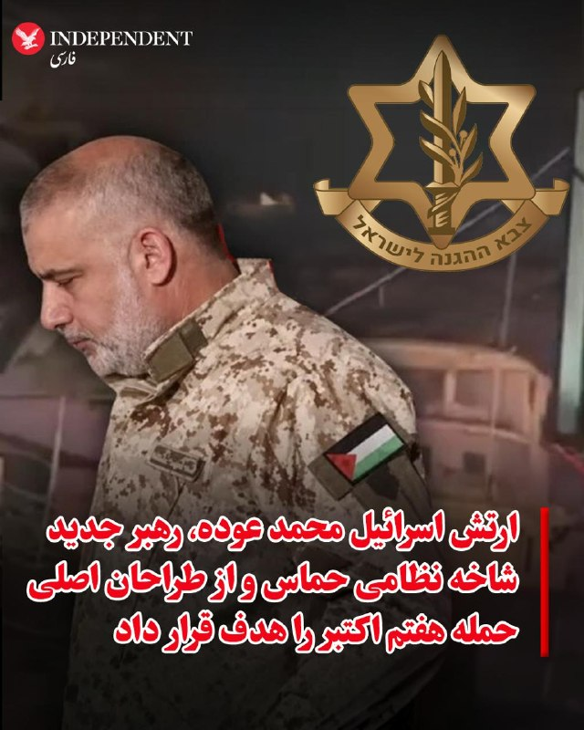

♦️بنیامین نتانیاهو، نخست‌وزیر اسرائیل و یسرائیل کاتز، وزیر دفاع این کشور، در بیانیه‌ای مشترک اعلام کردند که ارتش در جریان یک حمله هوایی در غزه، محمد عوده، فرمانده جدید شاخه نظامی حماس و یکی از طراحان اصلی حمله هفتم اکتبر را هدف قرار داده است. در این بیانیه آمده است که عوده در جریان حمله هفتم اکتبر مسئولیت رئیس ستاد اطلاعات حماس را بر عهده داشت و تنها یک هفته پیش، به عنوان جانشین عزالدین الحداد (که دو هفته قبل کشته شد) منصوب شده بود؛ مقامات اسرائیل با اشاره به اینکه عوده مسئول کشته، زخمی و ربوده شدن بسیاری از شهروندان و سربازان اسرائیلی بوده، تأکید کردند که ارتش و شین‌بت به تعقیب و نابودی تمامی عوامل دخیل در حمله هفتم اکتبر ادامه خواهند داد و دیر یا زود به همه آن‌ها دست خواهند یافت. بر اساس گزارش‌های تکمیلی، محمد عوده که از چهره‌های باسابقه اما مخفی‌کار و اطلاعاتی گردان‌های عزالدین قسام به شمار می‌رفت، پس از کشته شدن فرماندهان پیشین از جمله محمد ضیف و محمد سنوار، از معدود رهبران ارشد باقی‌مانده حماس در نوار غزه بود که به دلیل ملاحظات شدید امنیتی، همواره بدون راننده و محافظ شخصی تردد می‌کرد.
‌🇸🇦 Indypersian

🤖 @VahidOOnLine

## VahidOOnLine — post 242344

🗣روایت شما از اولین روز کاهش محدودیت و قطع اینترنت- سه‌شنبه ۵ خرداد ۱۴۰۶

🔹تازگی تو استان کردستان انگار اینترنت داره وصل میشه، اما فقط وای‌فای.

🔹من بابت وصل شدن اینترنت خوشحال نیستم، چون ۴۰ هزار نفر دیگه هیچ‌وقت آنلاین نمی‌شن. طرح اینترنت پرو شکست خورد. سپاس از کسانی که تن به این خفت و خواری ندادن و متأسفم برای کسانی که بهش تن دادن.

🔹من تازه تونستم وصل بشم. یه دختر دهه‌نودی هستم. حتی منم دیگه خسته شدم، هر روز اوضاع داره بدتر و بدتر میشه. فقط امیدوارم در نهایت همه‌مون آزادی ایرانمون رو ببینیم. جاوید شاه.

🔹بالاخره اینترنت وصل شده، البته با هزار تا بدبختی و سرعت پایین، اونم فقط با مخابرات.

🔹قربون دستت که دستور دادی اینترنت بین‌الملل وصل شه. حالا بی‌زحمت دستور بده اونایی که کسب‌وکار اینترنتیشون نابود شد برگردن سر کارشون، اونایی که زندگیشون از هم پاشید برگردن سر خونه و زندگیشون، اونایی که به خاطر اجاره خونه آواره خیابون شدن برگردن تو خونه‌هاشون.

🔹از وصل شدن اینترنت بین‌الملل برای عموم مردم خرسندم، این حق طبیعی و اولیه هر شهرونده. اتفاقات بسیار خوب و روشنی در انتظار پارسیان و این خاکه، کمی منتظر بمونید. جاوید شاه، پاینده ایران.

🔹بعد چند روز اینترنت‌ها رو باز کردن، فکر کردن می‌تونن با اینترنت گولمون بزنن.

🔹بالاخره بعد از چند وقت تونستیم به اینترنت وصل بشیم، خدا رو شکر. به یاد جاویدنام‌ها.

🔹سلام، بالاخره وصل شدیم، ولی این حق ما نبود که ۸۸ روز قطع باشیم.

🔹از بجنورد: خواستم به همه کسانی که امکان استفاده از اینترنت پرو داشتن ولی شرافتمندانه انتخابش نکردن درود بفرستم. آزادی بیشتر از همه حق شماست.

🔹واسه وصل شدن اینترنت زیاد خوشحال نباشین. اینترنت رو وصل کردن که مزرعه‌های ماینرشون رو فعال کنن و این یعنی روزی هفت، هشت ساعت قطعی برق.

🔹درود، بازگشایی اینترنت رو بعد از ۸۸ روز قطعی گسترده تبریک می‌گم. به امید اینکه روزی شاه رضا پهلوی رو از نزدیک ببینم.

🔹سلام، بعد از ۹۰ روز از محلات، واسه وصل شدن چیزی که حق هر آدمیه باید ذوق کنیم.

🔹الان که اینترنت وصل شده، جاویدنامامون رو بیشتر یاد کنیم. به امید آزادی.

🔹بعد از هشتاد و خورده‌ای روز با بدبختی وصل شدیم. بازم مثل همیشه متوجه شدیم که هیچ‌کس به فکر ما نیست و تهش خودمونیم و خودمون. هر چیزی به حالت قبلش برگرده، ما دیگه برنمی‌گردیم.

🔹امروز (۵ خرداد) وصل شدم بعد از سه ماه. فقط مردم عزیزم، تورو خدا ناامید نشید، این آخرین نبرده.

🔹بعد از ۸۸ روز قطعی اینترنت بالاخره وصل شدم. خواستم بگم ناامید نشید، نور بر تاریکی پیروزه. جاوید شاه.

🔹مردم ایران، اینترنت حق طبیعی ماست. خوشحال باشید، ولی فکر نکنین امتیازیه که بهمون دادن، تسلیم نمیشیم.
‌🏁 🇬🇧 IranintlTV

🤖 @VahidOOnLine

## VahidOOnLine — post 242343

  

شبکه کان اسرائیل گزارش داد در پی گسترش درگیری‌ها در لبنان و همزمان با مذاکرات آمریکا و جمهوری اسلامی، دونالد ترامپ و بنیامین نتانیاهو تلفنی گفت‌وگو کردند.

همزمان کانال ۱۲ اسرائیل خبر داد که گفت‌وگوی ترامپ و نتانیاهو پس از نشست کابینه اسرائیل که حدود دو ساعت و نیم طول کشید، انجام شده است.
‌🏁 🇬🇧 IranintlTV

🤖 @VahidOOnLine

## VahidOOnLine — post 242342

  <a href="telegram/content/VahidOOnLine_242342_1779824249.mp4" target="_blank">🎬 Download video</a>

♦️بنیامین نتانیاهو، نخست‌وزیر اسرائیل، با انتشار بیانیه‌ای در اکس، از هدف قرار گرفتن فرمانده نیروی رضوان در بیروت خبر داد و اعلام کرد که نیروهای ارتش این کشور تاکنون حدود ۲,۵۰۰ شبه‌نظامی حزب‌الله را از پای درآورده‌اند. او با اشاره به آمار تلفات این گروه اظهار داشت: «تنها در طول دوره آتش‌بس، ۷۰۰ شبه‌نظامی حزب‌الله کشته شدند که این تعداد، بیشتر از کل تلفات آن‌ها در جنگ دوم لبنان است.» نتانیاهو با تاکید بر اینکه نیروهای اسرائیلی در حال تکمیل تخریب زیرساخت‌های تروریستی در نزدیکی شهرک‌های مرزی هستند، افزود: «نیروهای گسترده ارتش اسرائیل در عمق خاک لبنان در حال عملیات هستند، مناطق مشرف و استراتژیک را تصرف کرده و در حال مستحکم کردن منطقه امنیتی هستند؛ ما یک لحظه هم از مبارزه با حزب‌الله دست نمی‌کشیم و اقدامات بیشتری در راه است تا امنیت کامل شهروندان اسرائیل تضمین شود.»
‌🇸🇦 Indypersian

🤖 @VahidOOnLine

## VahidOOnLine — post 242341

  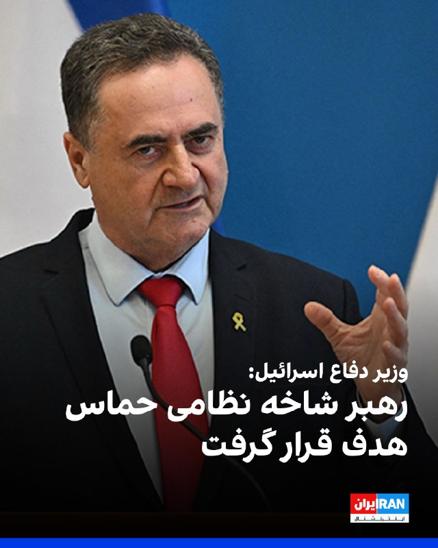

یسرائیل کاتس، وزیر دفاع اسرائیل، در شبکه ایکس اعلام کرد ارتش این کشور به دستور بنیامین نتانیاهو و او، محمد عوده، رهبر شاخه نظامی حماس و از طراحان حمله هفتم اکتبر، را در غزه هدف قرار داده است.

وزیر دفاع اسرائیل اعلام کرد عوده مسئول کشته، ربوده و زخمی شدن شمار زیادی از شهروندان اسرائیلی و نیروهای ارتش این کشور بوده است.

او افزود: «ما به تعقیب همه کسانی که در حمله هفتم اکتبر نقش داشتند ادامه خواهیم داد؛ دیر یا زود، اسرائیل همه آن‌ها را پیدا خواهد کرد.»

همچنینن بنیامین نتانیاهو، نخست‌وزیر اسرائیل اعلام کرد که اسرائیل به فرمانده جدید شاخه نظامی حماس در غزه حمله کرده است.
‌🏁 🇬🇧 IranintlTV

🤖 @VahidOOnLine

## VahidOOnLine — post 242340

ایرانیان ساکن آلمان روز سه‌شنبه در تجمعی در هامبورگ علیه قطع اینترنت و اعدام شهروندان معترض در ایران شعار دادند.
‌🏁 🇬🇧 IranintlTV

🤖 @VahidOOnLine

## VahidOOnLine — post 242339

  

روزنامه نیویورک‌ تایمز به نقل از دو مقام آمریکایی نوشت که حملات نظامی آمریکا به هدافی در جنوب ایران در شامگاه دوشنبه پس از آن انجام شد که تحلیلگران اطلاعاتی مجموعه‌ای از اقدامات نظامی جمهوری اسلامی را شناسایی کردند که به‌طور «بالقوه تهدیدآمیز» بود.

این رسانه در گزارشی کوتاه که شامگاه سه‌شنبه منتشر شد، نوشت این مقام‌ها گفتند جمهوری اسلامی چند پهپاد انتحاری را در نزدیکی شماری از حدود ۲۴ ناو جنگی نیروهای آمریکا در محدوده دریای عمان و دریای عرب به پرواز درآورده بودند. این ناوها در اجرای عملیات محاصره دریایی بندرهای جنوب ایران نقش دارند.

به گفته این منابع که به دلیل حساسیت مسائل عملیاتی نخواستند نامشان فاش شود، تحلیلگران اطلاعاتی آمریکا تحرکاتی را در برخی از مواضع موشک‌های زمین‌به‌هوای جمهوری اسلامی در نزدیکی تنگه هرمز شناسایی کردند که هواپیماهای تهاجمی مستقر در خشکی و ناوهای هواپیمابرِ فعال در عملیات محاصره دریایی را تهدید می‌کرد.

ادامه این گزارش را در وبسایت ایران‌اینترنشنال بخوانید.
‌🏁 🇬🇧 IranintlTV

🤖 @VahidOOnLine

## VahidOOnLine — post 242338

  

♦️دو مقام آمریکایی روز سه‌شنبه پنجم خردادماه،‌به روزنامه نیویورک تایمز گفتند جمهوری اسلامی دوشنبه‌شب پهپادهای تهاجمی را به سمت ناوها و کشتی‌های جنگی آمریکا در خلیج عمان و دریای عرب پرتاب کرده و همین اقدام به حملات متقابل آمریکا علیه اهدافی در جنوب ایران منجر شده است.

به گفته این مقام‌ها، نیروهای جمهوری اسلامی همچنین قایق‌های مین‌گذار را در تنگه هرمز مستقر کرده بودند و ارتش آمریکا پس از رصد این تحرکات، در آنچه «حملات دفاع از خود» توصیف شد، قایق‌ها و محل‌های پرتاب موشک را هدف قرار داد.

نیویورک تایمز نوشت ارتش آمریکا علاوه بر پرواز پهپادها، تحرکات سامانه‌های پدافند هوایی ایران در نزدیکی تنگه هرمز را نیز تهدیدی برای نیروهای خود ارزیابی کرده بود.

این گزارش در حالی منتشر می‌شود که مذاکرات درباره توافق احتمالی برای پایان جنگ و بازگشایی تنگه هرمز ادامه دارد و مقام‌های آمریکایی و جمهوری اسلامی همچنان پیام‌های متفاوتی درباره آینده این گفتگوها ارسال می‌کنند.
‌🇸🇦 Indypersian

🤖 @VahidOOnLine

## VahidOOnLine — post 242337

  <a href="telegram/content/VahidOOnLine_242337_1779824253.mp4" target="_blank">🎬 Download video</a>

یک شهروند در پیامی به ایران اینترنشنال درباره تجمعات شبانه حامیان حکومت گفت که آن‌ها برای برنج و روغن تجمع می‌کنند اما مردم معترض در انقلاب ملی برنج‌ را زیر پای خود له کردند. پیام او با هوش مصنوعی خوانده شده است.
‌🏁 🇬🇧 IranintlTV

🤖 @VahidOOnLine

## VahidOOnLine — post 242336

  

♦️پس از ۸۸ روز قطع اینترنت جهانی در ایران، روز سه‌شنبه، پنجم خردادماه، اتصال کامل اینترنت بین‌المللی در مخابرات برقرار شد. در اولین دقایق اتصال، ایرانیان داخل کشور توانستند از طریق نرم‌افزار واتساپ با عزیزانشان در خارج تماس تصویری بگیرند و همچنین در شبکه‌های اجتماعی تصاویر و ویدیو به اشتراک بگذارند.
«نت‌بلاکس» که وضعیت اینترنت در جهان را رصد می‌کند، در آخرین به‌روزرسانی خود با تایید افزایش مجدد سطح دسترسی کاربران در ایران اعلام کرد که شبکه‌های تلفن همراه و سایر بخش‌های ارتباطی در حال متصل شدن به اینترنت جهانی هستند. این نهاد نظارتی با این حال اشاره کرد که سیستم فیلترینگ کماکان پابرجا است اما کاربران امکان عبور از آن را دارند.
‌🇸🇦 Indypersian

🤖 @VahidOOnLine

## VahidOOnLine — post 242335

  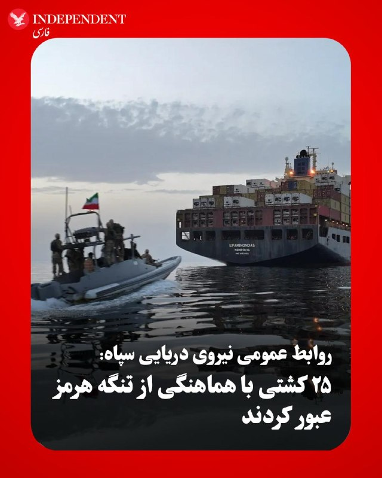

♦️روابط عمومی نیروی دریایی سپاه پاسداران اعلام کرد طی ۲۴ ساعت گذشته، ۲۵ کشتی شامل نفتکش، کشتی‌های کانتینربر و شناورهای تجاری، پس از دریافت مجوز و با هماهنگی این نیرو از تنگه هرمز عبور کرده‌اند.
در بیانیه منتشرشده در روز سه‌شنبه پنجم خردادماه، آمده است که «کنترل هوشمند تنگه هرمز با اقتدار ادامه دارد» و هرگونه اقدام یا «تجاوز» احتمالی با واکنش شدید روبه‌رو خواهد شد.
این اظهارات در حالی مطرح می‌شود که تنش‌ها در منطقه خلیج فارس افزایش یافته است. ساعاتی پیش از انتشار این بیانیه، مارکو روبیو، وزیر خارجه ایالات متحده آمریکا، تاکید کرده بود واشینگتن باز ماندن تنگه هرمز را «به هر طریقی» تضمین خواهد کرد.
روبیو همچنین گفته بود هیچ کشوری، از جمله چین و روسیه، با ایجاد محدودیت یا دریافت عوارض برای عبور کشتی‌ها از این شاهراه مهم انرژی جهان موافق نیستند.
‌🇸🇦 Indypersian

🤖 @VahidOOnLine

## VahidOOnLine — post 242334

  

روابط عمومی نیروی دریایی سپاه پاسداران اعلام کرد که طی شبانه‌روز گذشته ۲۵ فروند کشتی اعم از نفتکش، کانتینربر و سایر کشتی‌های تجاری پس از کسب مجوز از نیروی دریایی سپاه، از تنگه هرمز عبور کردند.

سپاه افزود: کنترل هوشمند تنگه هرمز با اقتدار در حال انجام است و هرگونه تجاوز با ضربات کوبنده پاسخ داده خواهد شد.
‌🏁 🇬🇧 IranintlTV

🤖 @VahidOOnLine

## VahidOOnLine — post 242333

  

گروه نت‌بلاکس در حساب خود در شبکه اجتماعی ایکس اعلام کرد اتصال اینترنت در ایران افزایش بیشتری یافته و به ۸۶ درصد رسیده است، شبکه‌های موبایل و بخش‌های دیگری از اینترنت نیز دوباره به اینترنت جهانی متصل شده‌اند.
نت‌بلاکس افزود «فیلترنت» همچنان برقرار است اما امکان دور زدن آن وجود دارد. همچنین واتس‌اپ اکنون محدود شده و برای دسترسی به آن نیاز به ابزارهای دور زدن فیلتر است و برخی کاربران همچنان به اینترنت جهانی دسترسی ندارند.
‌🏁 🇬🇧 IranintlTV

🤖 @VahidOOnLine

## VahidOOnLine — post 242326

آیا وعده بازگشایی اینترنت عملی می‌شود؟
‌🏁 🇬🇧 ManotoTV

🤖 @VahidOOnLine

## WithYashar — post 12603

عزیمت ترامپ از کاخ سفید به بیمارستان @withyashar

## WithYashar — post 12602

منبعی آگاه به «اتاق جنگ با یاشار» گفت که در شروط توافق این مورد تأکیید شده که ترامپ باید ختنه کند.🤣 @withyashar

## WithYashar — post 12601

## WithYashar — post 12600

تسنیم : فروش نخی سیگار ممنوع شد اتاق اصناف ایران: فروش سیگار نخی و فرآورده‌های دخانی بازشده در تمامی واحدهای صنفی ممنوع شد. @withyashar 😐

## WithYashar — post 12599

تسنیم : فروش نخی سیگار ممنوع شد

اتاق اصناف ایران:
فروش سیگار نخی و فرآورده‌های دخانی بازشده در تمامی واحدهای صنفی ممنوع شد.
@withyashar 😐

## WithYashar — post 12598

رادیو ارتش اسرائیل گزارش داد که دونالد ترامپ، رئیس‌جمهور آمریکا، و بنیامین نتانیاهو، نخست‌وزیر اسرائیل، در حال حاضر در یک تماس تلفنی هستند.
@withyashar

## WithYashar — post 12597

نت بلاکس : ۸۶٪ اینترنت ایران برگشته @withyashar

## WithYashar — post 12596

نیروی دریایی ۳پا: کنترل هوشمند تنگهٔ هرمز با اقتدار درحال انجام است و هرگونه تجاوز با ضربات کوبنده پاسخ داده خواهد شد.
@withyashar

## WithYashar — post 12595

نتانیاهو از ترور هدفمند خبر داد :
همین الان محمد عوده، از فرماندهان شاخه نظامی حماس و یکی از طراحان حمله ۷ اکتبر رو در غزه هدف قرار دادیم
به حساب همه‌شون می‌رسیم
@withyashar

## WithYashar — post 12594

  

نت بلاکس : ۸۶٪ اینترنت ایران برگشته
@withyashar

## WithYashar — post 12593

نیویورک تایمز: ایران با چندین پهپاد انتحاری به چند ناو آمریکایی که از سمت دریای عمان، قصد ورود به تتگه هرمز را داشتند حمله کرده است
@withyashar

## WithYashar — post 12592

## WithYashar — post 12591

کانال 14 اسرائیل به نقل از منابع:
حمله به ایران پس از دریافت «پیام مشخصی» از آمریکا، در این مرحله از دستور کار خارج شده.
@withyashar

## WithYashar — post 12590

  

مارک لوین : «بی بی، برو بزن بترکونشون!»
@withyashar

## WithYashar — post 12589

نت ها اوکی باشه لایو هم شروع میکنم که به امید خدا آخر هفته اگه زد زنده زارتان زورتان رو بگیرم 💥🌶️ این ۵ روز‌آینده بسیار روز های مهمیه ! ببینیم تکیفمون روشن میشههههههههه

## WithYashar — post 12588

## WithYashar — post 12587

## WithYashar — post 12586

نتانیاهو، در بیانیه‌ای اعلام کرد که نیروهای زمینی اسرائیل در حال «گسترش و تعمیق» عملیات این رژیم در لبنان هستند و «در حال تصرف مناطق وسیعی هستند»
@withyashar

## WithYashar — post 12585

کانال ۱۲ عبری:
آمریکا به اسرائیل هشدار داد که به هیچ شکلی به بیروت حمله نکند.
@withyashar 😐

## WithYashar — post 12584

  

ترامپ در تروث : همین الان معاینات پزشکی شش ماهه‌ام را در مرکز پزشکی نظامی والتر رید تمام کردم. همه چیز عالی بود. از پزشکان و کارکنان عالی متشکرم! به کاخ سفید برمی‌گردم. رئیس جمهور دی‌جی‌تی
@withyashar

## mwarmonitor — post 9768

💥 انفجار مخزن مواد شیمیایی در واشنگتن منجر به کشته و زخمی شدن تعدادی از افراد شده است؛ وضعیت برخی از مجروحان وخیم گزارش می‌شود.

@mwarmonitor

## mwarmonitor — post 9767

  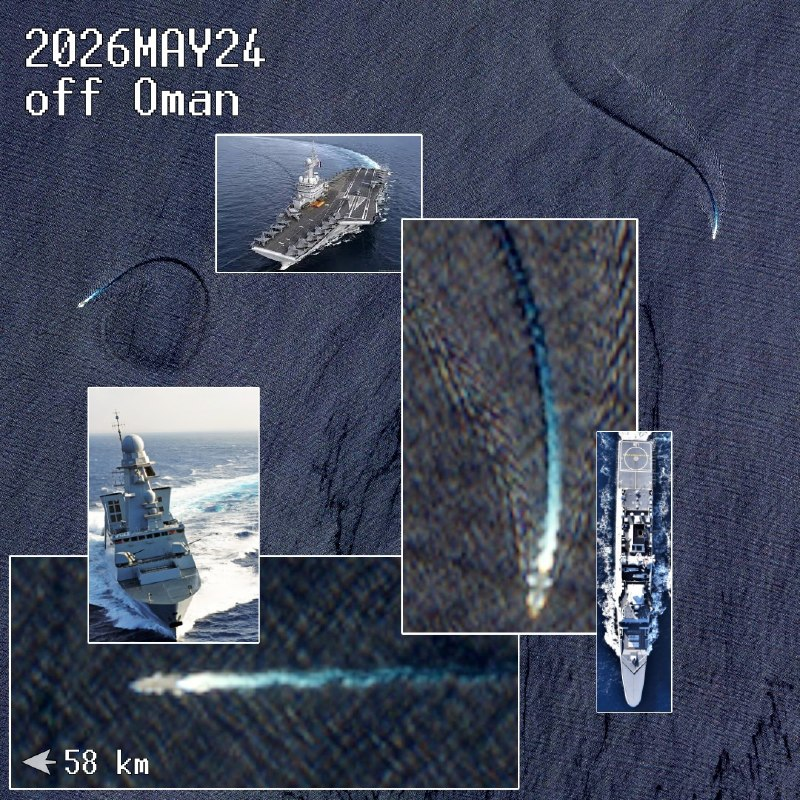

🔴ناوشکن کلاس Horizon CHEVALIER PAUL 🇫🇷 و ناوچه کلاس FREMM POSS ALSACE 🇫🇷 ۲ روز پیش در آب‌های جنوب عمان مشاهده شدند

📍موقعیت ناوشکن: 16.8356, 55.3751
📍موقعیت ناوچه: 16.8513, 56.070

📌این دو شناور در حال عملیات مشترک با ناو هواپیمابر فرانسوی CDG (شارل دوگل) و تحت چارچوب مأموریت‌های نیروی دریایی فرانسه بوده‌اند.

@mwarmonitor

## mwarmonitor — post 9766

🔰 سناتورهای ایالت کارولینای جنوبی با نادیده گرفتن فشارهای دونالد ترامپ برای تصویب نقشه جدید حوزه‌بندی مجلس نمایندگان، بدون بررسی آن جلسه را به پایان رساندند. نیویورک تایمز

@mwarmonitor

## mwarmonitor — post 9765

🔴رادیو ارتش اسرائیل گزارش داد که دونالد ترامپ، رئیس‌جمهور آمریکا، و بنیامین نتانیاهو، نخست‌وزیر اسرائیل، در حال حاضر در یک تماس تلفنی هستند.

@mwarmonitor

## mwarmonitor — post 9764

## mwarmonitor — post 9763

  

⁉️« چرا ایران در اوایل جنگ، بندر دُقم در عمان را هدف قرار داد.

⭕️دلیلش این بود: چند روز قبل از آن، شناورهای نیروی دریایی آمریکا برای سوخت‌گیری و تأمین تدارکات در آنجا پهلو گرفته بودند.

🛰تصاویر ماهواره‌ای زیر نشان می‌دهد که یک کشتی تدارکاتی USNS و یک ناوشکن از کلاس آرلی برک در همان اسکله‌ای حضور داشتند که بعداً مورد حمله قرار گرفت.

🔸«عمان پایگاه لجستیکی عملیات تأمین مجدد نیروهای آمریکا در خلیج فارس بود. چندین بالگرد از دُقم و دیگر بنادر برای این منظور استفاده می‌کردند. پس از هدف قرار گرفتن بندر، این فعالیت‌ها متوقف شد و آمریکا عملیات ناوگان بازرگانی خود را به جیبوتی منتقل کرد.»

@mwarmonitor

## mwarmonitor — post 9762

  

🔴«بر اساس بیانیه نخست‌وزیر و وزیر دفاع، اسرائیل محمد عوده، رهبر جدید شاخه نظامی حماس و رئیس پیشین مقر اطلاعاتی این گروه در عملیات ۷ اکتبر، را در نوار غزه ترور کرده است.»

@mwarmonitor

## mwarmonitor — post 9761

  

✈️یک فروند هواپیمای ترابری سنگین C-5M نیروی هوایی آمریکا پیش‌تر در پایگاه هوایی اوودا فرود آمده است؛ جایی که جنگنده‌های F-22 و سایر هواپیماها مستقر هستند.

🔸به‌ندرت دیده می‌شود که این هواپیماها در پایگاه‌های اسرائیلی فرود بیایند. سامانه‌های پدافند هوایی اضافی؟

@mwarmonitor

## mwarmonitor — post 9760

🔴طبق گزارش کانال (KAN News):

📌حملات اسرائیل به منطقه ضاحیه در بیروت به دلیل مخالفت آمریکا «از روی میز خارج شده است».

📌آمریکا نمی‌خواهد حملات در بیروت روند مذاکرات با ایران را مختل کند.

📌ترامپ در حال از دست دادن صبر خود است زیرا مذاکرات طولانی شده‌اند.

@mwarmonitor

## mwarmonitor — post 9759

🔴دولت ترامپ در حال پیشبرد طرحی است که بر اساس آن از پلوتونیومِ به‌دست‌آمده از کلاهک‌های هسته‌ای برای سوخت‌رسانی به نیروگاه‌های برق استفاده شود — نیویورک تایمز.

@mwarmonitor

## mwarmonitor — post 9758

🔰کشتیرانی تجاری از طریق تنگه هرمز طی ۲۴ ساعت گذشته تا حدی افزایش یافته است، زیرا دست‌کم دو نفتکش غول‌پیکر غیرایرانی از خلیج فارس خارج شده‌اند؛ این تازه‌ترین موج کوچک در جریان عبور انرژی از این آبراه حیاتی است. بلومبرگ

@mwarmonitor

## mwarmonitor — post 9757

🔴‏نخست‌وزیر نتانیاهو در آغاز کابینه سیاسی-امنیتی:
«ما عملیات خود را در لبنان تعمیق می‌دهیم. ارتش اسرائیل با نیروهای زمینی زیادی در حال عملیات است و مناطق کنترل‌شده را تصرف می‌کند. ما در حال تقویت منطقه امنیتی برای محافظت از شهروندان شمال کشور هستیم.

🔹در عین حال، در حال انجام یک تلاش ملی عظیم برای یافتن راه‌حل‌های خلاقانه و نوآورانه علیه پهپادهای انفجاری هستیم.

🔸ما از فرماندهان و سربازان قهرمان خود حمایت و تمجید می‌کنیم. آنها در عمق میدان هستند. ما به شما اعتماد داریم!»

@mwarmonitor

## mwarmonitor — post 9756

  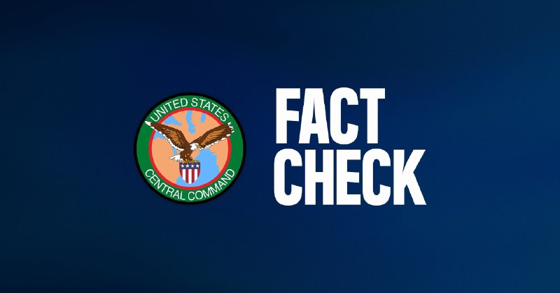

🔴نیروی دریایی آمریکا تحت طرحی تازه با نام «Project Freedom» دوباره هدایت کشتی‌ها را در تنگه هرمز آغاز کرده است. 🔸بر اساس گزارش وال‌استریت ژورنال، یک نفتکش فوق‌سنگین یونانی که ۲ میلیون بشکه نفت خام حمل می‌کرد، اولین کشتی‌ای بوده که از این مسیر عبور داده شده…

## mwarmonitor — post 9755

🔸کانال ۱۴ اسرائیل: برآوردها در اسرائیل این است که توافق با ایران تقریباً به‌طور قطعی شامل لبنان نیز خواهد شد.

@mwarmonitor

## mwarmonitor — post 9754

🔴اشپیگل گزارش می‌دهد که ایالات متحده قصد دارد مشارکت نظامی خود در حمایت از متحدان ناتو در زمان بحران را به‌طور قابل توجهی کاهش دهد؛ از جمله در زمینه جنگنده‌ها، ناوهای جنگی، هواپیماهای سوخت‌رسان در هوا و پهپادها.

🔸بر اساس این گزارش، آمریکا تنها نیمی از تعداد قبلی بمب‌افکن‌های راهبردی را در اختیار ناتو قرار خواهد داد، تعداد جنگنده‌های نیروی هوایی آمریکا را یک‌سوم کاهش می‌دهد، تعداد کمتری ناوشکن در اختیار قرار خواهد داد و دیگر هیچ زیردریایی‌ای در اختیار ناتو نمی‌گذارد.

🔸همچنین گفته شده آمریکا قصد دارد ارائه پهپادهای مسلح را کاهش دهد و اروپا را وادار کند خود پهپادهای شناسایی‌اش را تأمین کند.

@mwarmonitor

## mwarmonitor — post 9753

  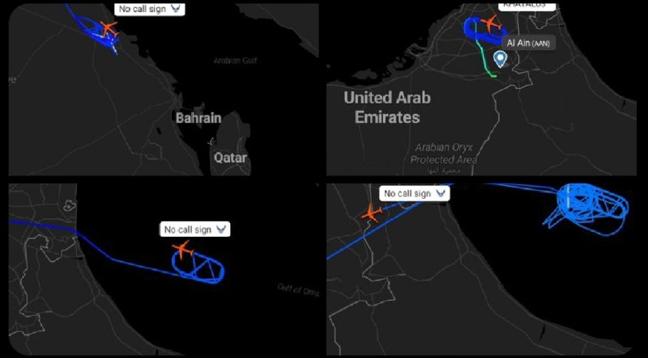

✈️پرواز معنادار تانکرهای سوخت رسان آمریکا در نزدیکی مرزهای آبی ایران پس از برخاستن از تل‌آویو 🔸داده‌های راداری نشان می‌دهند دو فروند هواپیمای سوخت‌رسان راهبردی بوئینگ KC-46A Pegasus متعلق به نیروی هوایی آمریکا (USAF)، با پرواز در حریم هوایی امارات، در بخش…

## mwarmonitor — post 9752

  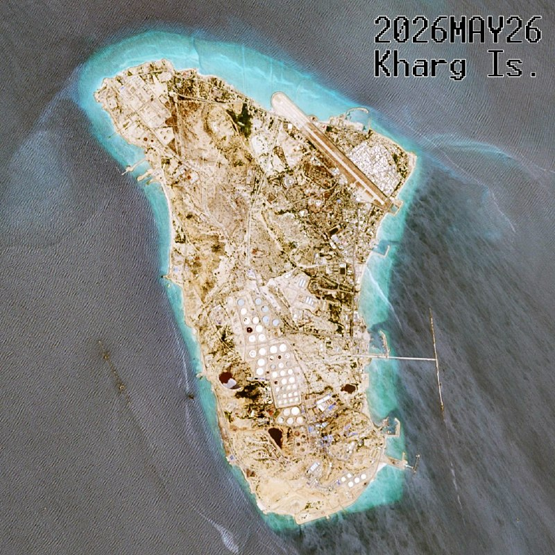

❌هیچ نفتکش نفت خامی امروز در حال بارگیری نفت در جزیره خارگ ایران مشاهده نشده است .

@mwarmonitor

## mwarmonitor — post 9751

📌 دونالد ترامپ قرار است فردا جلسه کابینه خود را در کمپ دیوید برگزار کند؛ اقدامی نادر که شامل سفر به اقامتگاه ریاست‌جمهوری است (در صورت مساعد بودن هوا).

🔸به گفته یک مقام کاخ سفید، انتظار می‌رود تمام اعضای کابینه در این جلسه حضور داشته باشند. نیویورک پست

@mwarmonitor

## mwarmonitor — post 9750

🔴 ترامپ سقف پذیرش پناهندگان را به میزان ۱۰ هزار نفر افزایش می‌دهد تا امکان پذیرش تعداد بیشتری از سفیدپوستان آفریقای جنوبی فراهم شود.

@mwarmonitor

## mwarmonitor — post 9749

🔴(رویترز) – ارتش اسرائیل عملیات زمینی خود در جنوب لبنان را فراتر از خطی که خود اسرائیل چند کیلومتر داخل خاک لبنان و پس از آتش‌بس ۱۶ آوریل با حزب‌الله تعیین کرده بود، گسترش داده است. این موضوع را دو منبع روز سه‌شنبه اعلام کردند.

🔹این منابع جزئیات بیشتری درباره میزان پیشروی فراتر از به‌اصطلاح «خط زرد» ارائه نکردند.

🔹این خط، جدا از «خط آبی» تعیین‌شده توسط سازمان ملل است که مرز لبنان و اسرائیل را پس از عقب‌نشینی اسرائیل در سال ۲۰۰۰ مشخص می‌کند. خط زرد بخشی از طرح ایجاد یک منطقه حائل پیشنهادی به عمق ۵ تا ۱۰ کیلومتر در جنوب لبنان است؛ جایی که نیروهای اسرائیلی همچنان در ده‌ها روستای عمدتاً تخلیه‌شده عملیات انجام می‌دهند.

🔸این اقدام در حالی صورت گرفته که با وجود آتش‌بس اعلام‌شده چند هفته قبل، درگیری‌های مرزی همچنان در حال تشدید است.

@mwarmonitor

## FoxNewsTwitter — post 342281

Fox News (Twitter/X)

Socialist mayor Mamdani just put NYC landlords on notice as he calls for taking “aggressive legal action” against landlords and transferring ownership of chronically neglected buildings to “the community.”

His pitch: crack down on bad owners and remake who controls housing in NYC.

## FoxNewsTwitter — post 342280

  <a href="telegram/content/FoxNewsTwitter_342280_1779824267.mp4" target="_blank">🎬 Download video</a>

Fox News (Twitter/X)

NEW: VP Vance shares a gut-wrenching example of Medicaid fraud uncovered by his task force:

"A man who was supposed to be providing services to allow elderly people to live full and independent lives... What happened instead is that the man who was supposed to provide these services, reimbursed by the Medicaid program, was providing nothing, no services, no help, no check ins."

"The vulnerable elderly man that he was supposed to be protecting and looking after, was reimbursed by the taxpayer in order to do exactly that, that man died."

"That man lived his final moments on this earth, neglected while a fraudster got rich by providing services that he never actually provided."

## FoxNewsTwitter — post 342279

  <a href="telegram/content/FoxNewsTwitter_342279_1779824270.mp4" target="_blank">🎬 Download video</a>

Fox News (Twitter/X)

NOW: Stephen Miller reveals how America's welfare system was ransacked by fraudsters who took advantage of the U.S. and its generous programs meant to help the most vulnerable:

"All of the systems in our country... were set up based on the honor system. They're set up based on the idea that you could trust the average person through their own morality, to abide by the rules and comply with the law."

"We take your word for it. If you fill out a piece of paper and you say your kids are hungry, you are going to get food stamps. We don't check, as a country, if you even have kids. In fact, as basic as that, we don't even check if you even have children, you would just start getting the checks."

"What's happened to our country is we became a society... where you have a large number of people that are not following the honor system, they're not playing by the rules, they're not abiding by our laws. And the amount that has been fleeced from us is in the hundreds of billions of dollars."

## FoxNewsTwitter — post 342278

  <a href="telegram/content/FoxNewsTwitter_342278_1779824273.mp4" target="_blank">🎬 Download video</a>

Fox News (Twitter/X)

NEW: NASA is laying out its long-term vision for a massive lunar base — one that could eventually stretch hundreds of square miles and support humans living and working on the lunar surface.

Officials say the plan centers on building up different assets over time while testing the science of survival in one of the harshest environments known.

## FoxNewsTwitter — post 342277

  <a href="telegram/content/FoxNewsTwitter_342277_1779824275.mp4" target="_blank">🎬 Download video</a>

Fox News (Twitter/X)

BREAKING: VP Vance outlines the billions of dollars in fraud that has been stolen from the American people that his task force has uncovered over the last two months:

"We referred over $22 billion in fraudulent small business loans back to the Treasury for collection. We deferred more than $1.3 billion in fraudulent Medicaid reimbursements."

"We recovered taxpayer funds from the $135 billion stolen after the floodgates were opened in the immediate aftermath of COVID. We have found $6.3 billion in suspected fraudulent government contracts, which were mostly awarded during the last administration."

## FoxNewsTwitter — post 342276

  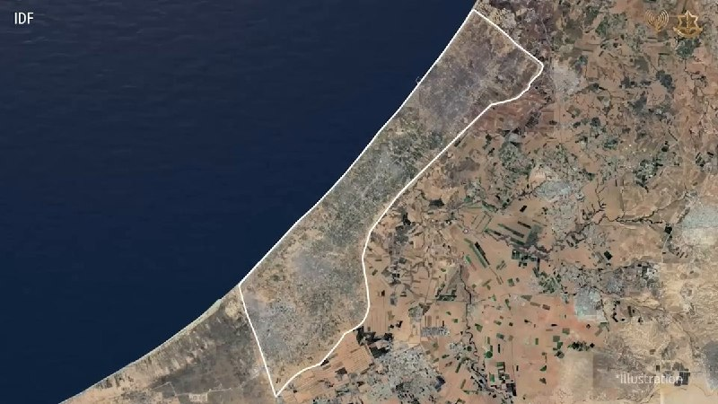

Fox News (Twitter/X)

JUST IN: The IDF says it dismantled nearly 7 miles of underground Hamas tunnel routes in northern Gaza.

The military released a 3D illustration mapping out the tunnel network, showing the scale of what troops say was uncovered during a major engineering operation.

Hundreds of above-ground terrorist infrastructure sites were also dismantled, according to the IDF.

## FoxNewsTwitter — post 342275

  

Fox News (Twitter/X)

WATCH LIVE: VP Vance leads anti-fraud roundtable as crackdown expands https://twitter.com/i/broadcasts/1RJjppbylggKw

## FoxNewsTwitter — post 342274

  

Fox News (Twitter/X)

WATCH LIVE: NASA outlines Moon base progress and industry partnerships https://twitter.com/i/broadcasts/1RKZzzBbdRrKB

## FoxNewsTwitter — post 342273

  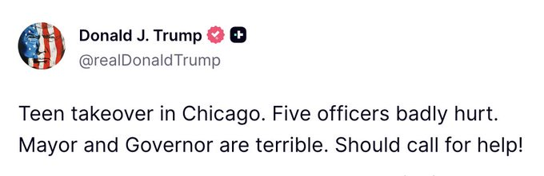

Fox News (Twitter/X)

NEW: President Trump calls out the violent teen takeovers in Chicago that led to five officers being hit by a car while nearly 30 people were shot in the city over Memorial Day weekend:

"Five officers badly hurt. Mayor and Governor are terrible. Should call for help!"

## FoxNewsTwitter — post 342272

  <a href="telegram/content/FoxNewsTwitter_342272_1779824281.mp4" target="_blank">🎬 Download video</a>

Fox News (Twitter/X)

“Those are dangerous!”

HHS Secretary RFK Jr. sharing a wild video of himself grabbing two black racer snakes off Dr. Mehmet Oz’s patio while his wife Cheryl Hines repeatedly warns him to stop.

The snakes can be seen twisting around Kennedy’s hands and biting him multiple times while he tries to remove them from the property.

## FoxNewsTwitter — post 342271

  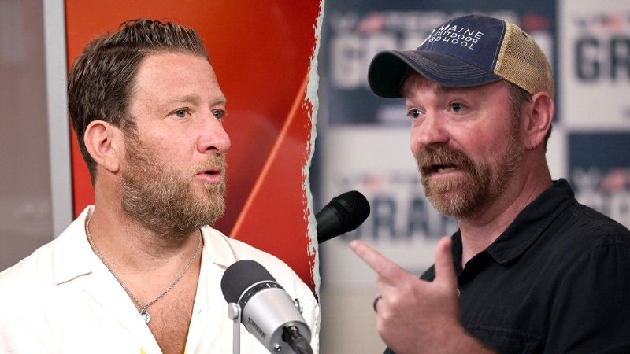

Fox News (Twitter/X)

RT @foxnewspolitics: Dave Portnoy torches Maine Senate candidate's strategist after the operative pitched a Red Sox-themed ad collab — then discovered Portnoy, who is Jewish, had zero interest in promoting a candidate with a Nazi-linked tattoo.

The Barstool founder challenged Graham Platner to a 1-on-1 conversation and told strategist Jeff Coote to 'fire yourself for thinking I'd want to glamorize this clown.'

Meanwhile, Fenway-owned NESN yanked Platner's anti-private-equity ad mid-game over intellectual property concerns.

## FoxNewsTwitter — post 342270

Fox News (Twitter/X)

WATCH: Protesters clash with law enforcement officers outside an ICE facility in Newark, New Jersey, just a day after their initial demonstration turned chaotic.

ICE agents in riot gear arrived Monday afternoon to clear protesters blocking Delaney Hall’s entrance over concerns about detainee treatment. Tensions escalated as protesters formed a human chain, threw objects, and agents used pepper spray while trying to move a military-style vehicle.

Families of detainees began protesting this weekend over alleged poor conditions and inadequate medical care, with a larger organized group joining Monday.

## FoxNewsTwitter — post 342269

‌Fox News (Twitter/X)

Read more:

## FoxNewsTwitter — post 342268

  

Fox News (Twitter/X)

Conservatives say AI chatbots are being weaponized with left-wing media bias as millions rely on them each day.

Critics say today’s AI systems disproportionately pull from “left-wing media and politically charged sources” when generating responses for users, and they argue systems like ChatGPT, Google Gemini, and Claude often downplaying or excluding opposing perspectives altogether.

The concerns go beyond politics, AI systems are already known to sometimes “hallucinate” — confidently generating false but believable information that can quickly erode public trust.

One example that made previously made headlines was when ChatGPT, which is developed by OpenAI, insisted in January nobody named Charlie Kirk was ever assassinated and declared no credible evidence or reporting could substantiate such a claim.

## FoxNewsTwitter — post 342267

  

Fox News (Twitter/X)

JUST IN: President Trump shares results from his six month physical at Walter Reed:

"Everything checked out PERFECTLY. Thank you to the great Doctors and Staff! Heading back to the White House."

## FoxNewsTwitter — post 342266

Fox News (Twitter/X)

BREAKING: President Trump will convene a rare Cabinet meeting at Camp David on Wednesday as negotiations with Iran enter a critical phase.

All Cabinet members are expected to attend the meeting, Fox News has confirmed, including outgoing Director of National Intelligence Tulsi Gabbard.

The gathering comes as the administration weighs next steps in high-stakes negotiations aimed at securing a broader agreement with Tehran amid a fraying ceasefire.

## FoxNewsTwitter — post 342265

Fox News (Twitter/X)

BREAKING: A three-judge federal panel is temporarily blocking Alabama from using a newly proposed congressional map that Republicans hope would improve their chances in a key U.S. House race.

The court ordered the state to keep using the court-approved districts from the 2024 elections while the long-running redistricting case continues.

## FoxNewsTwitter — post 342264

  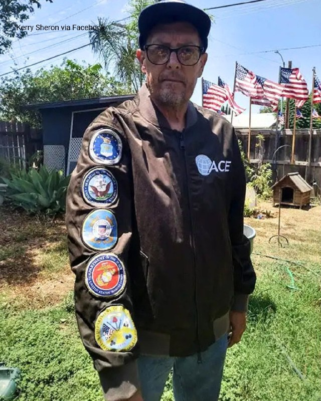

Fox News (Twitter/X)

An Army veteran known locally for decorating his California home with pro-Trump banners and American flags has died days after a brutal assault outside the property, authorities said.

Kerry Sheron, 69, was allegedly attacked by a 32-year-old Navy veteran in what prosecutors described as an unprovoked beating.

The suspect, Thomas Caleb Butler, has pleaded not guilty and remains behind bars as prosecutors weigh upgraded charges following Sheron’s death. Authorities have not confirmed a political motive at this time.

## FoxNewsTwitter — post 342263

  

Fox News (Twitter/X)

Mandatory Ebola screenings have expanded to Atlanta's International Airport.

Travelers arriving from the Democratic Republic of Congo, Uganda and South Sudan are now required to undergo temperature checks and complete a health questionnaire after landing in Atlanta.

If travelers pass the screening, they are cleared to leave the airport but will still be monitored for 21 days by a state health department at their final destination.

This move comes as the current Ebola outbreak overseas has caused at least 220 deaths around the world.

## FoxNewsTwitter — post 342262

  <a href="telegram/content/FoxNewsTwitter_342262_1779824288.mp4" target="_blank">🎬 Download video</a>

Fox News (Twitter/X)

Radical Senate candidate Graham Platner railed against CEOs and tried to win over working class voters while rallying with Bernie Sanders during the Vermont senator's "Fighting Oligarchy Tour."

Platner took aim at wealthy Americans as well as those he says are part of the "Epstein class."

“I believe that we should not be settling for scraps that they throw to us from the table, where they are dining with the Epstein class.”

“I believe that in our country, the voices of working people are far more important than the voices of those who merely have money.”

## pm_afshaa — post 91569

vless://b0f0bd25-1ff4-4644-827d-5f9675d6c5b6@104.253.134.125:21685?encryption=none&security=none&type=ws&path=%2F#PMTV%20NEWS%20%F0%9F%A6%81%E2%98%80%EF%B8%8F

نامحدود بفرستین برا بقیه هم وصل شن

💧 Rainbet.com the #1 Non-KYC Crypto Casino & Sportsbook @rainbetcom

😁 @Pm_Afshaa

## pm_afshaa — post 91568

🔴کلودفلر:ترافیک اینترنت ایران به بالای 90 درصد رسید. واتساپ و ویکی‌پدیا در دسترس قرار گرفتن

💧 Rainbet.com the #1 Non-KYC Crypto Casino & Sportsbook @rainbetcom

😁 @Pm_Afshaa

## pm_afshaa — post 91565

https://t.me/proxy?server=31.220.73.93&port=443&secret=eefd4d1b6a40aef75802cb6569f0615e11636c6f7564666c6172652e636f6d

با این وصل شین فعلا

💧 Rainbet.com the #1 Non-KYC Crypto Casino & Sportsbook @rainbetcom

😁 @Pm_Afshaa

## pm_afshaa — post 91564

نیویورک تایمز: ایران با چندین پهپاد انتحاری به چند ناو آمریکایی که از سمت دریای عمان، قصد ورود به تتگه هرمز رو داشتن حمله کرده

💧 Rainbet.com the #1 Non-KYC Crypto Casino & Sportsbook @rainbetcom

😁 @Pm_Afshaa

## pm_afshaa — post 91563

🔴محمد عوده فرمانده ارشد حماس توسط اسراییل به درک واصل شد

💧 Rainbet.com the #1 Non-KYC Crypto Casino & Sportsbook @rainbetcom

😁 @Pm_Afshaa

## pm_afshaa — post 91562

🔴نتانیاهو مجوز ترور مقامات حزب الله در بیروت را از ترامپ گرفت

💧 Rainbet.com the #1 Non-KYC Crypto Casino & Sportsbook @rainbetcom

😁 @Pm_Afshaa

## pm_afshaa — post 91561

🔴در جریان جلسه کابینه اسراییل: نتانیاهو برای گفت‌وگو با ترامپ جلسه را ترک کرد

💧 Rainbet.com the #1 Non-KYC Crypto Casino & Sportsbook @rainbetcom

😁 @Pm_Afshaa

## pm_afshaa — post 91560

از vpn گیگی 2 میلیونی به گیگی 3 هزار تومنی خوش اومدین

## pm_afshaa — post 91559

99/99999 درصد سال 1405 بدون اینترنت گذشت

## pm_afshaa — post 91558

  <a href="telegram/content/pm_afshaa_91558_1779824291.webm" target="_blank">🎬 Download video</a>

🔴وزارت ارتباطات: اینترنت همراه هم همین امروز وصل میشه و تا فردا، اینترنت به طور کامل به قبل دی‌ماه 1404 برمیگرده.

💧 Rainbet.com the #1 Non-KYC Crypto Casino & Sportsbook @rainbetcom

😁 @Pm_Afshaa

## pm_afshaa — post 91557

  <a href="telegram/content/pm_afshaa_91557_1779824292.webm" target="_blank">🎬 Download video</a>

🔴نت بلاکس: اینترنت ایران بعد از 88 روز به طور کامل برگشت.

💧 Rainbet.com the #1 Non-KYC Crypto Casino & Sportsbook @rainbetcom

😁 @Pm_Afshaa

## pm_afshaa — post 91556

  <a href="telegram/content/pm_afshaa_91556_1779824293.webm" target="_blank">🎬 Download video</a>

🔴کانال 14 اسرائیل به نقل از منابع:
حمله به ایران پس از دریافت «پیام مشخصی» از آمریکا، در این مرحله از دستور کار خارج شده.

💧 Rainbet.com the #1 Non-KYC Crypto Casino & Sportsbook @rainbetcom

😁 @Pm_Afshaa

## pm_afshaa — post 91555

  <a href="telegram/content/pm_afshaa_91555_1779824294.webm" target="_blank">🎬 Download video</a>

🔴صفحه‌ی اسرائیل به فارسی در X:
پیام جدید رهبر نامرئی جمهوری اسلامی: اسرائیل تا 15 سال دیگر وجود نخواهد داشت.

پدرش هم خیلی از این گنده‌گویی‌ها می‌کرد.

💧 Rainbet.com the #1 Non-KYC Crypto Casino & Sportsbook @rainbetcom

😁 @Pm_Afshaa

## pm_afshaa — post 91554

  <a href="telegram/content/pm_afshaa_91554_1779824294.webm" target="_blank">🎬 Download video</a>

🔴کانال 12 اسرائیل:
آمریکا به اسرائیل هشدار داده که به هیچ شکلی به بیروت حمله نکنه.

💧 Rainbet.com the #1 Non-KYC Crypto Casino & Sportsbook @rainbetcom

😁 @Pm_Afshaa

## pm_afshaa — post 91553

  <a href="telegram/content/pm_afshaa_91553_1779824295.webm" target="_blank">🎬 Download video</a>

🔴ترامپ: معاینات شش‌ماهه‌ام رو انجام دادم، نتایجش کاملا عالی و مطلوب بود.

💧 Rainbet.com the #1 Non-KYC Crypto Casino & Sportsbook @rainbetcom

😁 @Pm_Afshaa

## pm_afshaa — post 91552

  <a href="telegram/content/pm_afshaa_91552_1779824296.webm" target="_blank">🎬 Download video</a>

🔴نیویورک تایمز: ترامپ فردا به کمپ دیوید میره تا جلسه‌ای سطح بالا در مورد ایران با سران نظامی و سیاسی این کشور برگزار کنه.

💧 Rainbet.com the #1 Non-KYC Crypto Casino & Sportsbook @rainbetcom

😁 @Pm_Afshaa

## pm_afshaa — post 91551

ببین چیکار کردن که واسه طبیعی‌ترین و عادی‌ترین حقمون تو قرن ۲۱ باید خوشحال بشیم..

## pm_afshaa — post 91550

دلم تنگ شده بود براتون خوش برگشتین❤️
تلگرام بدون شما صفا نداشت..

## pm_afshaa — post 91549

اینترنت خط همراه هم داره وصل میشه.

💧 Rainbet.com the #1 Non-KYC Crypto Casino & Sportsbook @rainbetcom

😁 @Pm_Afshaa

## pm_afshaa — post 91548

  <a href="telegram/content/pm_afshaa_91548_1779824297.webm" target="_blank">🎬 Download video</a>

🔴اسرائیل به دستور نتانیاهو از دیروز حملات و پیشروی‌های خود در جنوب لبنان رو به‌طور قابل‌توجهی افزایش داده و حتی از محدوده‌ای که پیش‌تر به‌عنوان خط توقف تعیین شده بود هم عبور کرده.

طبق گزارش‌ها، هدف اصلی این عملیات، نابودی سایت‌های پهپادهای فیبرنوری در جنوب لبنانه؛ پهپادهایی که نیروهای اسرائیلی رو در منطقه هدف قرار می‌دادن. شدت حملات به حدی بوده که بسیاری از ساکنان جنوب لبنان در حال ترک مناطق مرزی هستن.

💧 Rainbet.com the #1 Non-KYC Crypto Casino & Sportsbook @rainbetcom

😁 @Pm_Afshaa

## iaghapour — post 2635

🔔 
🔔 
🔔

💥
😳
☄️ اینترنت بدون محدودیت رو تجربه کن

⚡️
⚡️🛜 تجربه‌ای نزدیک به استارلینک 
🚀

⚡️
⚡️🛜 با هزینه‌ای نزدیک به خرید مودم 
💵💵

😳
😱کلی امکانات فقط و فقط با خریـــــــــد یک روتر 
😱

🤔
❗️ تاحالا فکر کردی بشه کل خونه‌ت همیشه به اینترنت آزاد وصل باشه،
بدون نیاز به روشن کردن فیلترشکن؟!!؟؟!
❗️
😳

❌ 
✔️ دیگه لازم نیست برای هر دستگاه جدا فیلترشکن روشن کنی

👍
👌 استفاده همزمان چندین نفر با یک اکانت

🔋 کاهش مصرف باتری گوشی و … (افزایش عمر باتری)

🔥 مورد استفاده برای تریدرها _ گیمرها _دفاتر و شرکتها _کارخانه و مصرف حرفه ای خانگی 
💥

🚀
✨ اینترنت آزاد رو برای کل خونه یا محل کارت همیشه روشن داشته باش

💥
💥
☄️ قیمتهای ما اصلا قابل مقایسه با جاهای دیگه نیست ،امتحانش مجانیه و هزینه نمیخواد 
😉

👨‍💻 
👨‍💻 ادمیـــ‌ـــــن : Eternal

🛒 
📱 کانـــــــال ما : Router iran

✔️

## iaghapour — post 2634

میبینم که رو فیلترشکن ها تخفیف زدن :)

هر گیگ رو 10 و 20 هزار تومن دارن میفروشن :)

پولی که بعضی از افراد به جیب زدن تاجر ها نزدن. طرف داخل سرور ایران سایت فروش فیلترشکن داشت! قعطی نداشت. بالای 10 هزار ممبر داشت. اوایل حتی درگاه ریالی داشت. بعد بعضی ها انتظار دارن ما باور کنیم اینا به جایی وصل نبودن!

## iaghapour — post 2633

⭕️ چند خبر کوتاه از رسانه ها

🔸معاون وزیر ارتباطات در پاسخ به زومیت در خصوص زمان بازگشایی اینترنت سیار نیز گفت: «امروز اینترنت همراه نیز وصل خواهد شد.»

با توجه به این اظهارنظر باید منتظر بازگشایی اینترنت همراه تا پایان امروز، سه‌شنبه ۵ خردادماه، در دسترس کاربران قرار بگیرد. هم‌چنین، طبق اعلام‌های قبلی، تا فردا روند بازگشایی اینترنت به وضعیت پیش از دی‌ماه ۱۴۰۴ تکمیل خواهد شد.

🔹نت‌بلاکس بازگشت بخشی از اینترنت ایران را تایید کرد؛ سطح اتصال به ۳۴ درصد رسید

🔸چه ‌وب‌سایت‌هایی در دسترس قرار گرفته‌اند؟ /دیجیاتو
ویکی‌پدیا
اپ‌استور
پینترست (Pinterest)
کنوا (Canva)
نوشن (Notion)
تردز (Threads)
کالاف CallofDuty.com
پابجی (Pubg)
یاهو
دراپ باکس
پلی استیشن
ایکس‌باکس
استیم

🆔 @iAghapour

## iaghapour — post 2632

## iaghapour — post 2631

اینترنت بین‌الملل وصل بشه یجوری از اینترنت استفاده میکنم اختلال بخوره دوباره قطع بشه.🫠

گوشی باید آپدیت بشه.
ویندوز باید آپدیت بشه.
لینوکس باید آپدیت بشه.
برنامه ها باید آپدیت بشه.
و...

حس میکنم شما هم با من هم نظر هستید 🫣😁

## DEJradio — post 5000

  <a href="telegram/content/DEJradio_5000_1779824298.mp4" target="_blank">🎬 Download video</a>

🔺📢 پیام یک شهروند:
یه‌دونه موز خریدم ۱۸۰ هزار تومن!

#موز #تورم
@DEJradio

## DEJradio — post 4999

  <a href="telegram/content/DEJradio_4999_1779824300.webm" target="_blank">🎬 Download video</a>

🔺📢 گیدئون سعار وزیر خارجه اسرائیل، در واکنش به پستی منتسب به مجتبی خامنه‌ای که موجودیت اسرائیل را تهدید کرده بود، در شبکه ایکس نوشت:
«آشنا به نظر می‌رسد. یادم هست فردی با نام‌خانوادگی مشابه قبلا چنین حرف‌هایی می‌زد. راستی، کجایی؟»

خامنه‌ای در پیامی گفته بود، «اسرائیل غده سرطانی است که به پایانش نزدیک می‌شود.»

#موشعلی #موشتبا
@DEJradio

## DEJradio — post 4998

  <a href="telegram/content/DEJradio_4998_1779824301.mp4" target="_blank">🎬 Download video</a>

⭕️ خبر ۲۱
سه‌شنبه ۵ خرداد ۱۴۰۵

#خبر۲۱
@DEJradio

## DEJradio — post 4997

  <a href="telegram/content/DEJradio_4997_1779824304.mp4" target="_blank">🎬 Download video</a>

👑
👑 شاهزاده رضا پهلوی: «با جهان یا بی‌جهان، با اروپا یا بی‌اروپا، با آلمان یا بی‌آلمان، مبارزه ما ادامه خواهد داشت. ما از پا نخواهیم نشست تا زمانی که کشورمان آزاد شود؛ تا زمانی که کرامت مردم‌مان بازگردانده شود؛ تا زمانی که عدالت اجرا شود.»

برلین، ۳ اردیبهشت ۲۵۸۵/۱۴۰۵

#شاهزاده_رضا_پهلوی
#ایران_را_پس_میگیریم
@DEJradio

## DEJradio — post 4996

  <a href="telegram/content/DEJradio_4996_1779824306.mp4" target="_blank">🎬 Download video</a>

🔺🎥 پیام یک شهروند:
نوار بهداشتی زیر ۱۰۰ هزار تومن نیست! یک زمان نوار بهداشتی خارجی ۸۰ هزارتومان بود!

#تورم #نوار_بهداشتی
@DEJradio

## DEJradio — post 4995

  <a href="telegram/content/DEJradio_4995_1779824309.mp4" target="_blank">🎬 Download video</a>

⭕️🎥 مارکو روبیو، وزیر خارجۀ آمریکا، روز سه‌شنبه پنجم خرداد تأکید کرد موضع واشینگتن در قبال مذاکرات با تهران کاملاً شفاف است و گفت یا توافقی مطلوب حاصل می‌شود یا اساساً توافقی در کار نخواهد بود.

#مارکو_روبیو #مذاکرات
@DEJradio

## DEJradio — post 4994

⭕️ لاپید: توافق احتمالی تهران و واشینگتن اهداف اسرائیل از جنگ را برآورده نمی‌کند

یائیر لاپید، رهبر مخالفان دولت مستقر اسرائیل گفت تفاهمی که میان آمریکا و جمهوری اسلامی در حال شکل‌گیری است، برای اسرائیل، منطقه و مردم ایران توافقی بد به شمار می‌رود.
نخست‌وزیر پیشین اسرائیل گفت این توافق هیچ‌یک از اهداف اعلام‌شدۀ اسرائیل از جنگ، از جمله نابودی برنامۀ موشکی و هسته‌ای جمهوری اسلامی و پایان پشتیبانی تهران از گروه‌های نیابتی را برآورده نمی‌کند.
رهبر مخالفان دولت نتانیاهو تأکید کرد کشورش باید آزادی عمل خود را در موازات با عملکرد دولت ایالات متحده، حفظ کند.
مقامات آمریکایی پیش‌تر تأکید کردند توافق با جمهوری اسلامی یا کامل و معنادار انجام می‌شود، یا هیچ توافقی در کار نیست.

#خبر #دژ #مذاکرات #اسرائیل
@DEJradio

## DEJradio — post 4993

⭕️
🌐 نت‌بلاکس اعلام کرد با وجود بازگشت نسبی، اختلال گستردۀ اینترنت در ایران ادامه دارد

نت‌بلاکس روز سه‌شنبه اعلام کرد داده‌های مستقیم نشان داد اتصال به اینترنت در ایران به صورت نسبی برقرار شده است.
این نهاد جهانی پایش اینترنت از سویی نوشت با وجود ابلاغ مصوبۀ بازگشت اینترنت از سوی مسعود پزشکیان، اختلال گسترده در ایران همچنان ادامه دارد.
نت‌بلاکس گزارش داد ایران وارد هشتادوهشتمین روز «خاموشی دیجیتال» شده و بیش از ۲۰۸۸ ساعت انزوای ارتباطی را سپری کرده است.

#خبر #دژ #اینترنت
@DEJradio

## DEJradio — post 4992

⭕️ رسانۀ نزدیک به نهادهای امنیتی: جمهوری اسلامی به دنبال آزادسازی ۲۴ میلیارد دلار است

خبرگزاری حکومتی تسنیم، نزدیک به سپاه پاسداران به نقل از یک منبع آگاه گزارش داد جمهوری اسلامی در مذاکره با آمریکا در پی رفع انسداد از بیست و چهار میلیارد دلار از منابع است.
بر اساس این گزارش، تهران درخواست کرده دوازده میلیارد دلار از این مبلغ، همزمان با رونمایی از تفاهم‌نامۀ احتمالی آزاد شود و بقیه نیز طی شصت روز در دسترس قرار گیرد.
بنا بر ادعای این خبرگزاری نزدیک به نیروهای امنیتی، سفر محمدباقر قالیباف به قطر نیز در همین چارچوب و برای رایزنی درباره نحوۀ دسترسی به این منابع انجام شد.
قطر گزارش‌ها دربارۀ پیشنهاد وام دوازده میلیارد دلاری به جمهوری اسلامی برای تضمین توافق را «نادرست» خوانده است.

#خبر #دژ #قطر #مذاکرات
@DEJradio

## DEJradio — post 4991

⭕️ قوۀ قضائیه ۱۳ مدیر شرکت‌های پتروشیمی را احضار کرد

دادستانی تهران از احضار ۱۳ مدیر شرکت‌های پتروشیمی و سایر شرکت‌ها با اتهام «رفع نکردن تعهدات ارزی» خبر داد.
علی صالحی گفت برخی از این مدیران تفهیم اتهام شده‌اند و برخی دیگر متعهد شده‌اند ظرف مهلت تعیین‌شده، تعهدات ارزی خود را انجام دهند.
بنا بر ادعای دادستان تهران، تاکنون بیش از هفتاد درصد تعهدات ارزی این شرکت‌ها پرداخت شده است.
شماری از صادرکنندگان، ملزم‌اند ارز حاصل از صادرات را به درون کشور بازگردانند.

#خبر #دژ
@DEJradio

## DEJradio — post 4990

⭕️ انفجار و نشت سوخت یک نفتکش در سواحل عمان

به گفتۀ سازمان عملیات تجارت دریایی بریتانیا، داده‌هایی از وقوع انفجار در بخش چپ بدنۀ یک نفتکش در ۶۰ مایلی سواحل مسقط، گزارش شده است.
بر پایۀ گزارش‌ها خدمۀ کشتی سالم‌اند، اما بخشی از سوخت نفتکش به دریا نشت کرده است.
هنوز درمورد علت یا عامل انفجار اطلاعاتی منتشر نشده است.

#خبر #دژ #انفجار
@DEJradio

## DEJradio — post 4989

  <a href="telegram/content/DEJradio_4989_1779824312.webm" target="_blank">🎬 Download video</a>

🔺📢 آیا فضای مجازی بستری مناسب برای شکایت از یکدیگر است؟

کارشناس: پژمان گلچین، پژوهشگر فلسفه

#اینترنت #فضای_مجازی
@DEJradio

## DEJradio — post 4988

  <a href="telegram/content/DEJradio_4988_1779824312.webm" target="_blank">🎬 Download video</a>

🔺📷 دیوان عدالت اداری اجرای بازگشایی اینترنت را موقتا متوقف کرد

پس از آنکه وزارت ارتباطات از رفع انسداد اینترنت طی ۲۴ ساعت آینده، و بر اساس مصوبه «ستاد ویژه ساماندهی و راهبری فضای مجازی» خبر داد، دیوان عدالت اداری وابسته به قوه قضاییه جلوی اجرای این مصوبه را گرفت.

در پی تصویب طرح بازگشایی اینترنت توسط «ستاد فضای مجازی»، دیوان عدالت اداری جمهوری اسلامی طی حکمی دستور توقف اجرای این مصوبه را صادر کرد.

دیوان عدالت اداری در بیانیه‌ای گفته است در پی طرح شکایاتی درباره ابطال «سند ایجاد ستاد ویژه ساماندهی و راهبری فضای مجازی کشور» هیئت تخصصی صنایع و بازرگانی این دیوان «با احراز ضرورت و فوریت موضوع، دستور توقف اجرای این مصوبه را تا زمان رسیدگی به شکایت صادر کرد.»
به گفته این نهاد، تا زمان رسیدگی به شکایت، مصوبات این ستاد غیرقابل اجرا خواهد بود.

گفته شد ستاد راهبری و ساماندهی فضای مجازی، به ریاست محمدرضا عارف، معاون اول مسعود پزشکیان، تشکیل جلسه داده و «بازگشت اینترنت به وضعیت پیش از دی‌ماه ۱۴۰۴» را تصویب کرده است.
در پی این مصوبه، مسعود پزشکیان نیز دستور بازگشایی اینترنت بین‌الملل را به وزیر ارتباطات ابلاغ کرده بود.

#اینترنت #قطع_اینترنت
@DEJradio

## DEJradio — post 4987

  <a href="telegram/content/DEJradio_4987_1779824313.mp4" target="_blank">🎬 Download video</a>

⭕️ نتانیاهو و کاتز نشستی امنیتی با محور جمهوری اسلامی و لبنان برگزار کردند

بنا بر گزارش الجزیرۀ قطر، بنیامین نتانیاهو، نخست‌وزیر اسرائیل، و یسرائیل کاتز، وزیر دفاع این کشور روز سه‌شنبه نشست‌هایی امنیتی را درمورد جبهه‌های نبرد با لبنان و جمهوری اسلامی برگزار کردند.
از سویی ایتامار بن‌گویر، وزیر امنیت داخلی اسرائیل اعلام کرد این کشور اجازه نمی‌دهد ترامپ توافقی بد با جمهوری اسلامی امضا کند.

#خبر #دژ #اسرائیل
@DEJradio

## DEJradio — post 4986

⭕️ وزارت خارجۀ جمهوری اسلامی حملات شامگاه دوشنبۀ آمریکا را «نقض آتش‌بس» خواند

وزارت امور خارجۀ دولت جمهوری اسلامی مدعی شد حملات تازۀ آمریکا در منطقۀ هرمزگان «نقض آشکار آتش‌بس» میان دو کشور به شمار می‌رود و محکوم است.
وزارت امور خارجۀ جمهوری اسلامی همچنین واشینگتن را مسئول «پیامدهای» این حملات معرفی کرد.
سنتکام تأیید کرد ارتش آمریکا در جنوب ایران قایق‌های در حال مین‌گذاری و سایت‌های پرتاب موشک را هدف قرار داده است.
در پی این حملات اعلام شد چهار پاسدار کشته شده‌اند.

#خبر #دژ #تنگه_هرمز
@DEJradio

## DEJradio — post 4985

⭕️ ترامپ با انتشار مطلبی بر صلح از مسیر قدرت تأکید کرد

دونالد ترامپ، رئیس‌ جمهوری آمریکا روز سه‌شنبه در شبکۀ تروث‌سوشال تصویری از خود را با شعار «صلح از راه قدرت» منتشر کرد.
سیاست صلح از راه قدرت، یک دکترین‌ اصلی در دولت ترامپ در قبال جمهوری اسلامی به شمار می‌رود.
بر اساس این رویکرد، دولت آمریکا برای رسیدن به صلح، توان نظامی جمهوری اسلامی در حوزه‌های موشکی، دریایی و هسته‌ای را تضعیف می‌کند.
ترامپ پیش‌تر اعلام کرده واشنگتن یا به یک توافق بزرگ و معنادار با تهران دست می‌یابد، یا هیچ توافقی در کار نیست.

#خبر #دز #ترامپ
@DEJradio

## DEJradio — post 4984

  <a href="telegram/content/DEJradio_4984_1779824315.webm" target="_blank">🎬 Download video</a>

🔺📢 زمان، برگ برنده آمریکا در برابر ایران؛

کارشناس: روح‌الله رحیم‌پور، تحلیلگر سیاسی

#جنگ #مذاکرات
@DEJradio

## DEJradio — post 4983

⭕️ رئیس‌ جمهوری مکزیک: آمریکا نمی‌خواست میزبان اردوی تیم جمهوری اسلامی باشد

کلودیا شین‌بام، رئیس‌ جمهوری مکزیک، اعلام کرد دولت آمریکا تمایلی به میزبانی اردوی تیم ملی فوتبال جمهوری اسلامی ایران برای جام جهانی ۲۰۲۶ نداشت.
او گفت در پی مخالفت واشینگتن، فیفا از مکزیک خواست میزبانی این اردو را برعهده بگیرد دولت مکزیک نیز موافقت کرد.
مهدی تاج، رئیس فدراسیون فوتبال جمهوری اسلامی پیش‌تر گفته بود اردوی «تیم ملی» از آمریکا به شهر تیخوانا در مکزیک منتقل شده است.
احمد دنیامالی، وزیر ورزش دولت جمهوری اسلامی مدعی شد فیفا «قول داده» همۀ بازیکنان و سایر اعضای تیم ویزای آمریکا را دریافت می‌کنند.
هر سه بازی تیم ملی فوتبال جمهوری اسلامی ایران در مرحلۀ گروهی جام جهانی در خاک آمریکا برگزار می‌شود.

#فوتبال #ترامپ #جام_جهانی
@DEJradio

## DEJradio — post 4982

  <a href="telegram/content/DEJradio_4982_1779824316.mp4" target="_blank">🎬 Download video</a>

🔺📢 "زندگی عادی بعد ۱۸ و ۱۹ دی‌ بی‌معناست...

سوشا مکانی دروازه‌بان پیشین تیم ملی

#دی۱۴۰۴
@DEJradio

## DEJradio — post 4981

  <a href="telegram/content/DEJradio_4981_1779824319.webm" target="_blank">🎬 Download video</a>

🚨
🔸 چرخه سرکوب؛ از کشتار تا ممنوعیت سوگواری

گزارش: آیسان قاسم‌پور

#سرکوب #ممنوعیت_سوگواری
@DEJradio

## mamlekate — post 103586

📝 دیوان عدالت مصوبه ستاد فضای مجازی را متوقف کرد؛ وعده بازگشت اینترنت در ابهام

در حالی که مقام‌های دولت جمهوری اسلامی از آغاز روند بازگشایی اینترنت بین‌الملل و اتصال کامل مردم تا ۲۴ ساعت آینده خبر داده بودند، دیوان عدالت اداری (قوه قضاییه) اعلام کرد اجرای مصوبه مربوط به ایجاد «ستاد ویژه ساماندهی و راهبری فضای مجازی کشور» را متوقف کرده است.

@mamlekate

## mamlekate — post 103585

📝 مارکو روبیو درباره مذاکرات با جمهوری اسلامی: امروز گفت‌وگوهایی در قطر جریان داشت

مارکو روبیو، وزیر امورخارجه آمریکا، روز سه‌شنبه در جریان سفر رسمی خود به هند به خبرنگاران گفت: «امروز گفت‌وگوهایی در قطر در جریان بود، بنابراین خواهیم دید که آیا می‌توانیم پیشرفتی داشته باشیم یا خیر.»

📝 واشنگتن در پی فرمولی برای حذف ذخایر اورانیوم ایران بدون انتقال به آمریکا

به گزارش نیویورک پست، مقام‌های آمریکایی در حال بررسی روش‌هایی هستند که ایران بتواند ذخایر اورانیوم با غنای بالا را بدون تحویل مستقیم به واشنگتن از بین ببرد.

📝 چارچوب سه‌مرحله‌ای توافق: بازگشایی هرمز، نابودی اورانیوم، کاهش محاصره و سپس مذاکره بر سر شرایط مذاکره صلح

@mamlekate

## mamlekate — post 103584

📝 سنتکام: به چند سایت پرتاب موشک و قایق در جنوب ایران حمله کردیم

ارتش آمريکا اعلام کرد حملات تازه‌ای را به جنوب ايران انجام داده و سايت‌های موشکی ايران و قايق‌هايی را که «در تلاش برای مين‌گذاری» بودند، هدف قرار داده است.

@mamlekate

## VahidOnline — post 75738

  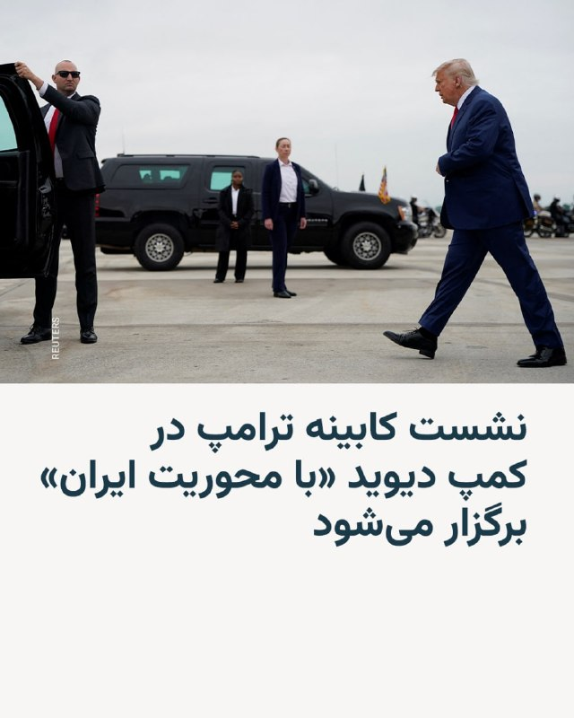

دونالد ترامپ، رئیس‌جمهور آمریکا، قرار است روز چهارشنبه نشستی کم‌سابقه با اعضای کابینه خود در اقامتگاه ریاست‌جمهوری کمپ دیوید برگزار کند؛ نشستی که به گفته یک مقام کاخ سفید، همزمان با نزدیک شدن مذاکرات مربوط به ایران به مرحله‌ای حساس برگزار می‌شود.

خبرگزاری فرانسه با انتشار این خبر نوشت که انتخاب کمپ دیوید، اقامتگاهی دورافتاده در کوهستان‌های مریلند که ترامپ برخلاف بسیاری از رؤسای‌جمهور پیشین کمتر به آن رفت‌وآمد داشته، نشان‌دهنده حساسیت گفت‌وگوهای پیش رو ارزیابی شده است.

روزنامه نیویورک‌پست گزارش داده که موضوع ایران محور اصلی این نشست خواهد بود و همه اعضای کابینه [از جمله تولسی گابارد، مدیر مستعفی اطلاعات ملی] در آن حضور خواهند داشت. بر اساس این گزارش، مسائل اقتصادی نیز در دستور کار قرار دارد.

کمپ دیوید در گذشته صحنه چند تحول مهم دیپلماتیک به رهبری آمریکا بوده، از جمله توافق‌های سال ۱۹۷۸ میان اسرائیل و مصر در دوره جیمی کارتر و نشست ناکام اسرائیلی‌ـفلسطینی در سال ۲۰۰۰ در دوره بیل کلینتون.

این دومین سفر ترامپ به کمپ دیوید در دوره دوم ریاست‌جمهوری او خواهد بود؛ نخستین بار چند روز پیش از حملات آمریکا به برنامه هسته‌ای ایران در خرداد ۱۴۰۴ بود.
@VahidHeadline

📡 @VahidOnline

## VahidOnline — post 75737

  

♦️به گزارش فارس، خبرگزاری وابسته به سپاه، محمدباقر قالیباف، رئیس هیات مذاکره‌کننده جمهوری اسلامی ایران که روز دوشنبه در راس هیاتی با همراهی عباس عراقچی، وزیر امور خارجه و عبدالناصر همتی، رئیس بانک مرکزی، برای رایزنی با مقامات قطری به دوحه سفر کرده بود، عصر سه‌شنبه، پنجم خردادماه، به ایران بازگشت. بر اساس این گزارش، محور اصلی گفتگوهای میان مقامات عالی تهران و دوحه در این سفر، رایزنی درباره بازگشت پول‌های مسدودشده ایران بوده است.
@VahidOOnLine

📡 @VahidOnline

## VahidOnline — post 75736

  

خبرگزاری تسنیم، روز سه‌شنبه، به نقل از منابع خود مدعی شد که طبق متن ۱۴ ماده‌ای یادداشت تفاهم بین ایران و آمریکا، منابع بلوکه‌شده ایران، به میزان ۲۴ میلیارد دلار باید در طول مذاکرات آزاد شود.

آنطور که این رسانه نزدیک به سپاه پاسداران از قول « یک منبع آگاه نزدیک به تیم مذاکره‌کننده» گزارش داده، ایران تأکید دارد که نصف این مبلغ باید با شروع مذاکرات، در دسترس قرار گیرد، و بقیه در طول ۶۰ روز منتقل شود.

این گزارش می‌گوید که سفر اخیر عباس عراقچی و محمدباقر قالیباف به قطر هم برای تفاهم دربارهٔ اجرایی‌سازی این مطالبه، و نحوه دسترسی به ۱۲ میلیارد دلار در گام اول و رفع موانع بوده است.

همزمان، احمد بخشایش اردستانی، عضو کمیسیون امنیت ملی مجلس، مدعی شد که چند روز پیش، قرار بود ۱۲ میلیارد دلار از منابع مسدودشده ایران، از طریق روسیه وارد شود، ولی آمریکایی‌ها مانع این انتقال شدند.

هنوز هیچ مقام رسمی در دولت آمریکا، این ادعاها را تأیید نکرده است.
@VahidHeadline

📡 @VahidOnline

## VahidOnline — post 75732

نت‌بلاکس، نهاد پایش وضعیت اینترنت در جهان، اعلام کرد داده‌های زنده این مجموعه نشان می‌دهد اتصال اینترنت در ایران در هشتاد و هشتمین روز قطعی گسترده، به صورت نسبی در حال بازگشت است؛ هرچند هنوز مشخص نیست این وضعیت پایدار خواهد ماند یا نه.
@VahidHeadline
ساعاتی پیش از این واقعه اخبار دیگری منتشر شده بود:

در حالی که مقام‌های دولت مسعود پزشکیان از آغاز روند اتصال کامل به اینترنت تا ۲۴ ساعت آینده خبر می‌دادند، دیوان عدالت اداری اعلام کرد دستور توقف اجرای مصوبه تشکیل «ستاد ویژه ساماندهی و راهبری فضای مجازی کشور» را صادر کرده است.

این دیوان ظهر سه‌شنبه پنجم خرداد اعلام کرد «به‌دنبال طرح شکایاتی، دستور به توقف مصوبهٔ ایجاد «ستاد ویژهٔ ساماندهی و راهبری فضای مجازی کشور» داده است» و افزود: «تا زمان رسیدگی نهایی به شکایات مطروحه، مصوبات و تصمیمات این ستاد قابل ترتیب اثر نخواهد بود.»

مرکز رسانه قوه قضاییه نیز اعلام کرد دستورات و مصوبات ستاد ویژه «به دلیل بررسی غیرقانونی بودن ساختار ستاد، تا زمان رسیدگی قانونی قابل اجرا نیست».
@VahidHeadline
بعدش:
همزمان با اعلام دیوان عدالت اداری مبنی بر صدور دستور توقف بازگشت اینترنت، ایسنا به نقل از «یک منبع مطلع»، روز سه‌شنبه، پنجم خردادماه، گزارش داد که با صدور دستور اتصال اینترنت از وزیر ارتباطات و فناوری اطلاعات فرآیند اتصال در حال انجام است و طی ۲۴ ساعت این امکان برای همه فراهم خواهد شد.

این درحالی اتفاق افتاد که تنها یک روز پس از مصوبه «ستاد ویژه ساماندهی فضای مجازی» برای «بازگشت اینترنت به وضعیت پیش از دی‌ماه ۱۴۰۴»، دیوان عدالت اداری با صدور دستور موقت، «اجرای مصوبه ایجاد ستاد ویژه ساماندهی فضای مجاری» را متوقف و مصوبات این ستاد را تا زمان رسیدگی نهایی، غیرقابل اجرا اعلام کرد.
همزمان، انتخاب نوشت که کامیار ثقفی، رضا تقی پور، رسول جلیلی و محمد حسن انتظاری تحت راهبری یک مقام ابقا شده دولت ابراهیم رئیسی، «شاکی قضایی» اتصال اینترنت بین‌الملل هستند.
ایران از زمان آغاز جنگ در نهم اسفند، به مدت ۸۸ روز، در خاموشی دیجیتال به سر می‌برد.
@VahidOOnLine
محمدرضا عارف، معاون اول پزشکیان، در شبکه ایکس نوشت پیرو دستور پزشکیان «گام نخست دسترسی آزاد و ضابطه‌مند به فضای مجازی برداشته شد.»
او افزود: «با بازگشایی اینترنت، خدمات هوشمند هموار و مطالبات مردمی که این‌چنین پای کار نظام و ایران ایستادند محقق و موانع توسعه دانش‌بنیان و مرجعیت علمی برداشته می‌شود.»
عارف در متن خود درباره «گام نخست» و وصل شدن اینترنت برای شهروندان توضیحی ارائه نداد.
این در حالی است که پیش‌تر فارس، رسانه وابسته به سپاه نوشت دیوان عدالت اداری اعلام کرد که در پی طرح شکایاتی درباره ابطال «سند ایجاد ستاد ویژه ساماندهی و راهبری فضای مجازی کشور»، هیات تخصصی صنایع و بازرگانی این دیوان، با احراز ضرورت و فوریت موضوع، دستور توقف اجرای این مصوبه را تا زمان رسیدگی به شکایت صادر کرد.
@VahidOOnLine

📡 @VahidOnline

## VahidOnline — post 75731

  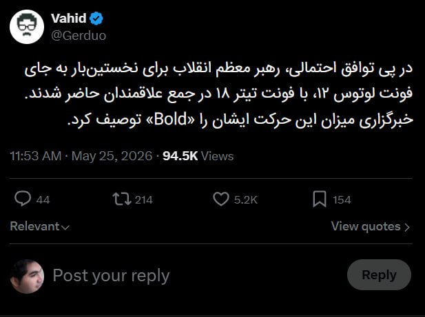

Gerduo 📡 @VahidOnline

## VahidOnline — post 75729

رسانه‌های ایران روز سه‌شنبه پنجم خرداد پیامی منسوب به مجتبی خامنه‌ای، رهبر جمهوری اسلامی، را به‌مناسبت برگزاری مراسم حج منتشر کردند که در آن می‌گوید آمریکا از این پس «نقطه امنی برای استقرار پایگاه نظامی در منطقه نخواهد داشت».

او در این پیام توضیحی دربارهٔ پایگاه‌های آمریکایی مستقر در کشورهای خلیج فارس نکرد اما هشدار داد که «سرزمین‌های منطقه دیگر سپر پایگاه‌های آمریکایی نخواهد بود».

مجتبی خامنه‌ای همچنین با یادآوری ادعای ۱۰ سال پیش پدرش علی خامنه‌ای درباره اسرائیل، مدعی شد این کشور نیز «به مراحل پایانی عمر» خود نزدیک شده و «۲۵ سال بعد از آن تاریخ را نخواهد دید».

از زمان اعلام نام مجتبی خامنه‌ای، به عنوان سومین رهبر جمهوری اسلامی، تصویر یا صدایی از او منتشر نشده و رسانه‌های ایران فقط پیام‌های کتبی را از او منتشر می‌کنند.
@VahidHeadline
در پیام منتسب به مجتبی خامنه‌ای با اشاره به گفته‌های ۱۰ سال پیش علی خامنه‌ای، رهبر کشته شده جمهوری اسلامی، اسرائیل «رژیم متزلزل صهیونی و غده سرطانی» توصیف شده و آمده است: «اسرائیل به مراحل پایانی عمر منحوس خود نزدیک شده و به فضل الهی و مطابق با سخن قاطع و آینده‌نگرِ ده سال قبل رهبر عظیم‌الشأن شهید قدس‌الله‌نفسه‌الزکیه، ۲۵ سال بعد از آن تاریخ را نخواهد دید، ان‌شاءالله.»

این سخنان در حالی عنوان می‌شود که اسرائیل و آمریکا در یک سال گذشته در جریان دو جنگ، مقام‌های عالی‌رتبه سیاسی و نظامی حکومت ازجمله علی خامنه‌ای، رهبر پیشین جمهوری اسلامی، را کشتند، بخش بزرگی از برنامه هسته‌ای جمهوری اسلامی را نابود و تاسیسات و زیرساخت‌های نظامی و اقتصادی ایران را به‌شدت تضعیف کرده‌اند.
@VahidOOnLine

📡 @VahidOnline

## VahidOnline — post 75728

  

سخنگوی وزارت خارجه قطر می‌گوید گزارش‌هایی که ادعا می‌کنند دولت این کشور برای تضمین نهایی‌شدن توافق با ایران، ۱۲ میلیارد دلار به جمهوری اسلامی «پیشنهاد» داده، «کاملاً بی‌اساس» است.

ماجد الانصاری سه‌شنبه پنجم خرداد در شبکه ایکس نوشته که این گزارش‌ها «توسط طرف‌هایی منتشر می‌شوند که به دنبال برهم زدن توافق و تضعیف تلاش‌های دیپلماتیک با هدف کاهش تنش‌ها و تقویت ثبات در منطقه‌اند.»

او افزوده که تلاش‌های دیپلماتیک قطر که با «هماهنگی» شرکای منطقه‌ای انجام می‌شود، «شناخته‌شده و شفاف است».

ماجد الانصاری انتشار این دست روایت‌ها را «تلاش‌های مذبوحانه برای خدشه‌دار کردن اعتبار» دولت قطر نامیده که به گفته او به‌عنوان «یک بازیگر بین‌المللی قابل اعتماد در مسیر دستیابی به صلح» است.
@VahidHeadline

📡 @VahidOnline

## VahidOnline — post 75723

خبرگزاری میزان، وابسته به قوه قضائیه، اعلام کرد غلامرضا خانی‌شکرآب به اتهام «همکاری اطلاعاتی و جاسوسی به نفع اسرائیل» اعدام شده است.
میزان مدعی شده او «سرشبکه عملیاتی موساد» بوده و پس از تأیید حکم در دیوان عالی کشور اعدام شده است.

در روایت قوه‌قضائیه، اتهام‌های سنگینی به او نسبت داده شده است؛ از جمله جذب افراد برای عملیات خرابکارانه، دریافت پول نقد و ارز دیجیتال، تعرض و اسیدپاشی به خودروهای افراد مورد نظر موساد، آتش‌زدن اموال عمومی، تهیه بمب و ارسال آن به تهران، تصویربرداری از نقاط هدف و حتی مأموریت برای فراهم‌کردن مقدمات ترور یک خاخام یهودی در یکی از کشورهای منطقه.

ابهام اصلی پرونده، نحوه انتقال خانی‌شکرآب به ایران است. میزان نوشته او در خارج از کشور شناسایی و با «فریب اطلاعاتی» به داخل کشور هدایت و بازداشت شد.
@VahidHeadline
میزان نوشته است: بر اساس اعترافات متهم، یکی از مهم‌ترین مأموریت‌هایی که سرویس موساد برای وی طراحی کرده بود، اعزام او به یکی از کشورهای منطقه با هدف شناسایی و فراهم‌سازی مقدمات ترور یک خاخام یهودی بوده است.
@VahidHeadline

گزارش دستگاه قضایی اشاره‌ای به تاریخ بازداشت و محاکمهٔ متهم نکرده و در عین حال وی را «از اراذل و اوباش یکی از استان‌های کشور و دارای سوابق نزاع و شرارت» خوانده و ادعا کرده است که او «به دنبال جذب افراد و به‌کارگیری آن‌ها در داخل کشور برای اجرای اقدامات ضد امنیتی بوده است».

از روند محاکمه این متهم گزارشی منتشر نشده و گزارش قوه قضاییه نیز مدارک و مستنداتی از اتهامات ارائه نداده است.

دستگاه قضایی جمهوری اسلامی در ماه‌های اخیر به شکل تقریباً روزانه اقدام به اجرای احکام اعدام معترضان و یا افرادی می‌کند که آن‌ها را به همکاری با آمریکا و اسرائیل متهم می‌کند. برخی نهادهای حقوق‌بشری می‌گویند جمهوری اسلامی از اعدام برای ایجاد فضای ترس و به‌عنوان عامل سرکوب استفاده می‌کند.
@VahidHeadline

📡 @VahidOnline

## VahidOnline — post 75721

با وجود حملات اخیر آمریکا به سامانه‌های موشکی و قایق‌های ایران در خلیج فارس که وضعیت آتش‌بس شکننده را متزلزل‌تر کرده است،‌ مارکو روبیو، وزیر خارجه آمریکا روز سه‌شنبه گفت که توافق با ایران «همچنان امکان‌پذیر است.»

او در هند به خبرنگاران گفت: «امروز مذاکراتی در قطر در جریان بود،‌ و باید دید آیا می‌توانیم شاهد پیشرفتی باشیم یا خیر. فکر می‌کنم بخش زیادی از زمان صرف دقت در کلمات و واژه‌های به کار گرفته در متن اسناد می‌شود، بنابراین چند روز طول خواهد کشید.»

آقای روبیو افزود: «رئیس‌جمهور تمایل خود را برای انجام این کار ابراز کرده است. او یا به یک توافق خوب دست خواهد یافت یا هیچ توافقی نخواهد کرد.»

آقای روبیو به خبرنگاران گفت که تنگه هرمز باید باز باشد.

او گفت که آنها به هر حال این مسیر را باز خواهند کرد و افزود: «آنچه در آنجا اتفاق میافتد،‌ غیرقانونی است و باعث بی‌ثباتی برای جهان و غیرقابل قبول است.»
@VahidHeadline

📡 @VahidOnline

## VahidOnline — post 75720

  

وزارت خارجه آمریکا اواخر دوشنبه به وقت واشنگتن گفت مارکو روبیو وزیر امور خارجه، به در خواست همتای روس خود سرگئی لاوروف، با او صحبت کرد. در این تماس تلفنی، دو وزیر درباره جنگ روسیه و اوکراین، روابط دوجانبه و اوضاع ایران صحبت کردند.
@VahidHeadline

📡 @VahidOnline

## VahidOnline — post 75719

  

realDonaldTrump

📡 @VahidOnline

## VahidOnline — post 75718

  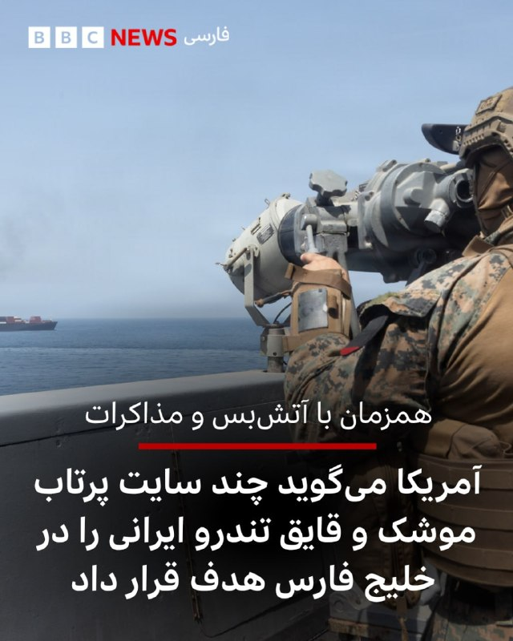

رماندهی مرکزی نیروهای آمریکا - سنتکام - در بیانیه‌ای اعلام کرده است: «نیروهای آمریکا امروز (دوشنبه) در جنوب ایران حملات دفاعی از خود انجام دادند تا از نیروهای ما در برابر تهدیدهای ناشی از نیروهای ایرانی محافظت شود»

در بیانیه سنتکام آمده: «اهداف این حملات شامل سایت های پرتاب موشک و قایق های ایرانی بود که تلاش می‌کردند مین‌گذاری کنند. فرماندهی مرکزی آمریکا ضمن خویشتن‌داری در طول آتش بس جاری، همچنان به دفاع از نیروهای خود ادامه می‌دهد.»

ایران هنوز واکنشی رسمی به این گزارش نشان نداده است، اما برخی از سایت‌های ایرانی از هدف قرار گرفتن دو قایق تندرو سپاه در نزدیکی سواحل خلیج فارس و کشته شدن چند نفر از سرنشینان این قایق‌ها خبر دادند.

نیمه شب دوشنبه به وقت ایران،‌ برخی از ساکنان بندرعباس و شهرهای حاشیه خلیج فارس، از شنیده شدن چند انفجار و فعالیت پدافند ضدهوایی خبر داده بودند.

رسانه‌های رسمی هم این گزارش‌ها را تایید کردند اما اعلام کرده بودند که علت این انفجارها مشخص نیست.
@VahidHeadline
درباره همون وقایع ۲۴ ساعت پیشه که اخبارش تازه داره منتشر میشه ولی بسیاری از منابع جوری جلوه میدن انگار مربوط به ساعت‌های الانه.

احتمالا اون پست ترامپ هم که تصویری از قایق‌های مهندم شده با پرچم جمهوری اسلامی گذاشته بود و نوشته بود «خداحافظ»، در اشاره به همین واقعه همون موقع بوده.
📡 @VahidOnline

## kianmeli1 — post 87684

  

🔴بعد از ۸۸ روز و حدود ۲۰۹۳ ساعت قطعی و انزوای شدید از اینترنت جهانی، اتصال اینترنت در ایران تا حدی برگشته
- ولی هنوز معلوم نیست این وضعیت پایدار بمونه یا نه
https://t.me/kianmeli1

## kianmeli1 — post 87682

  <a href="telegram/content/kianmeli1_87682_1779824324.mp4" target="_blank">🎬 Download video</a>

🔴جان‌باختن علیرضا بیرانوند در بازداشت؛ ابهام در علت مرگ شاعر معترض اهل ایذه

#علیرضا_بیرانوند، شاعر معترض و فعال فرهنگی ۲۵ ساله اهل ایذه، در تاریخ ۱۵ اردیبهشت ۱۴۰۵ در تهران بازداشت شد و بنا بر گزارش‌های منتشرشده، در دوران بازداشت جان باخته است.
نهادهای رسمی علت مرگ او را «مسمومیت» اعلام کرده‌اند، اما فعالان مدنی و منابع مستقل، نسبت به این روایت ابراز تردید کرده و مرگ او را مشکوک و مرتبط با رفتار نهادهای امنیتی می‌دانند.
علیرضا بیرانوند پیش‌تر نیز در جریان اعتراضات سال‌های ۱۳۹۶ و ۱۴۰۱ سابقه بازداشت داشته و به‌عنوان شاعری معترض و فعال فرهنگی شناخته می‌شد.
ابهام در روند بازداشت، نحوه جان‌باختن و نبود شفافیت درباره جزئیات این پرونده، نگرانی‌ها و پرسش‌های بسیاری را در افکار عمومی ایجاد کرده است.

 🎥 ویدیو: گوشه‌ای از مراسم خاکسپاری زندانی #علیرضا_بیرانوند

همسر او، لیلا فتحی، که او هم از شاعران جوان ایذه است، ضمن انتشار این ویدئو نوشته: علیرضا هنوز باور نکردم...
 https://t.me/kianmeli1

## kianmeli1 — post 87681

  

🔴ایران پس از ماه‌ها محدودیت شدید و قطعی اینترنت، دسترسی به اینترنت بین‌المللی را برای مشاغل و کاربران خانگی وای‌فای برقرار کرد.
https://t.me/kianmeli1

## kianmeli1 — post 87680

🔴دستگاه قضایی غلامرضا خانی‌شکرآب را که خارج از ایران ربوده شده بود، اعدام کرد قوه قضائیه اعلام کرد غلامرضا خانی‌شکرآب به اتهام «همکاری اطلاعاتی و جاسوسی به نفع اسرائیل» اعدام شده است. ادعا شده که اتهام‌های منتسب به آقای خانی، از «اقرارهای متهم» مطرح شده؛…

## kianmeli1 — post 87679

  

‏🔴خبرگزاری تسنیم وابسته به سپاه گزارش داد غلامرضا خانی شکراب با اتهام همکاری اطلاعاتی و جاسوسی برای اسرائیل اعدام شده است https://t.me/kianmeli1

## kianmeli1 — post 87678

‏🔴خبرگزاری تسنیم وابسته به سپاه گزارش داد غلامرضا خانی شکراب با اتهام همکاری اطلاعاتی و جاسوسی برای اسرائیل اعدام شده است
https://t.me/kianmeli1

## kianmeli1 — post 87677

‏🔴فرماندار بوشهر اعلام کرد عملیات خنثی‌سازی مهمات عمل‌نکرده در اطراف نیروگاه اتمی بوشهر بین ساعت ۹ تا ۱۵ انجام می‌شود
https://t.me/kianmeli1

## kianmeli1 — post 87676

‏🔴خبرگزاری فارس: دیوان عدالت اداری دستور موقت توقف مصوبهٔ ستاد فضای مجازی را صادر کرد!

‏ستاد فضای مجازی اتصال مجدد اینترنت بین الملل را تصویب کرده بود و قرار بود تا ۲۴ ساعت آینده دسترسی به اینترنت بین الملل برقرار شود
https://t.me/kianmeli1

## kianmeli1 — post 87675

‏🔴معاون سیاست‌گذاری و برنامه‌ریزی توسعه فناوری و ارتباطات و اقتصاد دیجیتال وزارت ارتباطات گفت: دسترسی کامل کاربران تا ۲۴ ساعت آینده برقرار می‌شود
https://t.me/kianmeli1

## kianmeli1 — post 87674

‏🔴ارتش اسرائیل اعلام کرد بامداد گذشته بیش از ۱۰۰ هدف متعلق به حزب‌الله را در دره بقاع و مناطق مختلف جنوب لبنان هدف قرار داده است
https://t.me/kianmeli1

## kianmeli1 — post 87673

‏🔴مدیرکل فرودگاه‌های استان اصفهان گفت: پروازهای فرودگاه بین‌المللی اصفهان پس از ۸۴ روز وقفه دوباره برقرار شده است
https://t.me/kianmeli1

## kianmeli1 — post 87672

🔴 ‏فارس، خبرگزاری وابسته به سپاه، به نقل از یک منبع نزدیک به تیم مذاکره‌کننده نوشت: هیچ مذاکره‌ای بدون واریز پول‌های مسدودشدهٔ ایران امکان‌پذیر نیست
https://t.me/kianmeli1

## kianmeli1 — post 87671

🔴 ‏ایتامار بن‌گویر، وزیر امنیت داخلی اسرائیل: اجازه نخواهیم داد ترامپ توافقی بد با ایران امضا کند
https://t.me/kianmeli1

## kianmeli1 — post 87670

  

🔴گزارش‌هایی که حاکی از «پیشنهاد» ۱۲ میلیارد دلاری قطر به ایران برای تضمین یک توافق است، به هیچ وجه صحت ندارند و توسط طرف‌هایی منتشر می‌شوند که سعی در تخریب توافق و تضعیف تلاش‌های دیپلماتیک جاری برای کاهش تنش و ثبات منطقه‌ای دارند.

نقش دیپلماتیک قطر، در هماهنگی با شرکای منطقه‌ای، به خوبی تثبیت شده و به طور عمومی مستند شده است و چنین روایت‌هایی چیزی بیش از تلاش‌های ناامیدانه برای خدشه‌دار کردن اعتبار قطر به عنوان یک تسهیل‌کننده صلح بین‌المللی مورد اعتماد نیست.
https://t.me/kianmeli1

## kianmeli1 — post 87669

🔴سخنگوی سنتکام به فاکس نیوز:

نیروهای آمریکایی امروز برای محافظت از نیروهای خود در برابر تهدیدات نیروهای ایرانی، حملات دفاع از خود را در جنوب ایران انجام دادند.

اهداف شامل سایت‌های پرتاب موشک و قایق‌های ایرانی بود که سعی در مین‌گذاری داشتند.

فرماندهی مرکزی ایالات متحده همچنان در طول آتش‌بس جاری، ضمن خویشتن‌داری، از نیروهای خود دفاع می‌کند.
https://t.me/kianmeli1

## IranIntlTV — post 339154

  <a href="https://t.me/IranintlTV/339154" target="_blank">📎 Download file</a>

🎧نسخه صوتی چشم‌انداز: مضحکه‌ای به نام رییس‌جمهور در جمهوری اسلامی
@iranintlTV

## IranIntlTV — post 339153

  <a href="telegram/content/IranIntlTV_339153_1779824330.mp4" target="_blank">🎬 Download video</a>

مضحکه‌ای به نام رییس‌جمهور در جمهوری اسلامی

«چشم‌انداز با مهدی مهدوی‌آزاد»

تماشای نسخه کامل این برنامه در یوتیوب:

https://youtu.be/5g8yvPI6ZIg

@iranintltv

## IranIntlTV — post 339152

🗣روایت شما از اولین روز کاهش محدودیت و قطع اینترنت- سه‌شنبه ۵ خرداد ۱۴۰۶

🔹تازگی تو استان کردستان انگار اینترنت داره وصل میشه، اما فقط وای‌فای.

🔹من بابت وصل شدن اینترنت خوشحال نیستم، چون ۴۰ هزار نفر دیگه هیچ‌وقت آنلاین نمی‌شن. طرح اینترنت پرو شکست خورد. سپاس از کسانی که تن به این خفت و خواری ندادن و متأسفم برای کسانی که بهش تن دادن.

🔹من تازه تونستم وصل بشم. یه دختر دهه‌نودی هستم. حتی منم دیگه خسته شدم، هر روز اوضاع داره بدتر و بدتر میشه. فقط امیدوارم در نهایت همه‌مون آزادی ایرانمون رو ببینیم. جاوید شاه.

🔹بالاخره اینترنت وصل شده، البته با هزار تا بدبختی و سرعت پایین، اونم فقط با مخابرات.

🔹قربون دستت که دستور دادی اینترنت بین‌الملل وصل شه. حالا بی‌زحمت دستور بده اونایی که کسب‌وکار اینترنتیشون نابود شد برگردن سر کارشون، اونایی که زندگیشون از هم پاشید برگردن سر خونه و زندگیشون، اونایی که به خاطر اجاره خونه آواره خیابون شدن برگردن تو خونه‌هاشون.

🔹از وصل شدن اینترنت بین‌الملل برای عموم مردم خرسندم، این حق طبیعی و اولیه هر شهرونده. اتفاقات بسیار خوب و روشنی در انتظار پارسیان و این خاکه، کمی منتظر بمونید. جاوید شاه، پاینده ایران.

🔹بعد چند روز اینترنت‌ها رو باز کردن، فکر کردن می‌تونن با اینترنت گولمون بزنن.

🔹بالاخره بعد از چند وقت تونستیم به اینترنت وصل بشیم، خدا رو شکر. به یاد جاویدنام‌ها.

🔹سلام، بالاخره وصل شدیم، ولی این حق ما نبود که ۸۸ روز قطع باشیم.

🔹از بجنورد: خواستم به همه کسانی که امکان استفاده از اینترنت پرو داشتن ولی شرافتمندانه انتخابش نکردن درود بفرستم. آزادی بیشتر از همه حق شماست.

🔹واسه وصل شدن اینترنت زیاد خوشحال نباشین. اینترنت رو وصل کردن که مزرعه‌های ماینرشون رو فعال کنن و این یعنی روزی هفت، هشت ساعت قطعی برق.

🔹درود، بازگشایی اینترنت رو بعد از ۸۸ روز قطعی گسترده تبریک می‌گم. به امید اینکه روزی شاه رضا پهلوی رو از نزدیک ببینم.

🔹سلام، بعد از ۹۰ روز از محلات، واسه وصل شدن چیزی که حق هر آدمیه باید ذوق کنیم.

🔹الان که اینترنت وصل شده، جاویدنامامون رو بیشتر یاد کنیم. به امید آزادی.

🔹بعد از هشتاد و خورده‌ای روز با بدبختی وصل شدیم. بازم مثل همیشه متوجه شدیم که هیچ‌کس به فکر ما نیست و تهش خودمونیم و خودمون. هر چیزی به حالت قبلش برگرده، ما دیگه برنمی‌گردیم.

🔹امروز (۵ خرداد) وصل شدم بعد از سه ماه. فقط مردم عزیزم، تورو خدا ناامید نشید، این آخرین نبرده.

🔹بعد از ۸۸ روز قطعی اینترنت بالاخره وصل شدم. خواستم بگم ناامید نشید، نور بر تاریکی پیروزه. جاوید شاه.

🔹مردم ایران، اینترنت حق طبیعی ماست. خوشحال باشید، ولی فکر نکنین امتیازیه که بهمون دادن، تسلیم نمیشیم.

## IranIntlTV — post 339151

  

شبکه کان اسرائیل گزارش داد در پی گسترش درگیری‌ها در لبنان و همزمان با مذاکرات آمریکا و جمهوری اسلامی، دونالد ترامپ و بنیامین نتانیاهو تلفنی گفت‌وگو کردند.

همزمان کانال ۱۲ اسرائیل خبر داد که گفت‌وگوی ترامپ و نتانیاهو پس از نشست کابینه اسرائیل که حدود دو ساعت و نیم طول کشید، انجام شده است.
https://iranintl.com/202605264065

## IranIntlTV — post 339150

  <a href="telegram/content/IranIntlTV_339150_1779824334.mp4" target="_blank">🎬 Download video</a>

خبرگزاری تسنیم به نقل از یک منبع آگاه نزدیک به تیم مذاکره‌کننده حکومت ایران گزارش داد مذاکره‌کنندگان جمهوری اسلامی به دنبال آزادسازی ۲۴ میلیارد دلار در چارچوب یادداشت تفاهم احتمالی با آمریکا هستند.

گفت‌وگو با علی شیرازی، عضو تحریریه ایران‌اینترنشنال و آرام حسامی استاد علوم سیاسی کالج مونتگومری
@iranintltv

## IranIntlTV — post 339149

  

یسرائیل کاتس، وزیر دفاع اسرائیل، در شبکه ایکس اعلام کرد ارتش این کشور به دستور بنیامین نتانیاهو و او، محمد عوده، رهبر شاخه نظامی حماس و از طراحان حمله هفتم اکتبر، را در غزه هدف قرار داده است.

وزیر دفاع اسرائیل اعلام کرد عوده مسئول کشته، ربوده و زخمی شدن شمار زیادی از شهروندان اسرائیلی و نیروهای ارتش این کشور بوده است.

او افزود: «ما به تعقیب همه کسانی که در حمله هفتم اکتبر نقش داشتند ادامه خواهیم داد؛ دیر یا زود، اسرائیل همه آن‌ها را پیدا خواهد کرد.»

همچنینن بنیامین نتانیاهو، نخست‌وزیر اسرائیل اعلام کرد که اسرائیل به فرمانده جدید شاخه نظامی حماس در غزه حمله کرده است.
https://iranintl.com/202605265269

## IranIntlTV — post 339147

  

روزنامه نیویورک‌ تایمز به نقل از دو مقام آمریکایی نوشت که حملات نظامی آمریکا به هدافی در جنوب ایران در شامگاه دوشنبه پس از آن انجام شد که تحلیلگران اطلاعاتی مجموعه‌ای از اقدامات نظامی جمهوری اسلامی را شناسایی کردند که به‌طور «بالقوه تهدیدآمیز» بود.

این رسانه در گزارشی کوتاه که شامگاه سه‌شنبه منتشر شد، نوشت این مقام‌ها گفتند جمهوری اسلامی چند پهپاد انتحاری را در نزدیکی شماری از حدود ۲۴ ناو جنگی نیروهای آمریکا در محدوده دریای عمان و دریای عرب به پرواز درآورده بودند. این ناوها در اجرای عملیات محاصره دریایی بندرهای جنوب ایران نقش دارند.

به گفته این منابع که به دلیل حساسیت مسائل عملیاتی نخواستند نامشان فاش شود، تحلیلگران اطلاعاتی آمریکا تحرکاتی را در برخی از مواضع موشک‌های زمین‌به‌هوای جمهوری اسلامی در نزدیکی تنگه هرمز شناسایی کردند که هواپیماهای تهاجمی مستقر در خشکی و ناوهای هواپیمابرِ فعال در عملیات محاصره دریایی را تهدید می‌کرد.

ادامه این گزارش را در وبسایت ایران‌اینترنشنال بخوانید.
https://iranintl.com/202605265826

## IranIntlTV — post 339146

  <a href="telegram/content/IranIntlTV_339146_1779824338.mp4" target="_blank">🎬 Download video</a>

۲۴ با فرداد فرحزاد
@iranintltv

## IranIntlTV — post 339145

  <a href="telegram/content/IranIntlTV_339145_1779824340.mp4" target="_blank">🎬 Download video</a>

یک شهروند در پیامی به ایران اینترنشنال درباره تجمعات شبانه حامیان حکومت گفت که آن‌ها برای برنج و روغن تجمع می‌کنند اما مردم معترض در انقلاب ملی برنج‌ را زیر پای خود له کردند. پیام او با هوش مصنوعی خوانده شده است.

## IranIntlTV — post 339144

  <a href="telegram/content/IranIntlTV_339144_1779824342.mp4" target="_blank">🎬 Download video</a>

مهدی مهدوی‌آزاد در برنامه «چشم‌انداز» گفت: «علی خامنه‌ای با نحوه برخورد با جایگاه ریاست‌جمهوری، این مقام را عملا بی‌اعتبار کرده است. مواضع مسعود پزشکیان درباره مذاکره و جنگ جدی گرفته نمی‌شود و حتی عذرخواهی او از کشورهای عربی نیز با واکنش تند داخلی روبه‌رو شد.»
@iranintltv

## IranIntlTV — post 339143

  

🔻سردار آزمون، مهاجم ۳۱ ساله و دومین گلزن برتر تاریخ تیم ملی فوتبال ایران، پس از موضع‌گیری در مخالفت با جمهوری اسلامی، حمایت از اعتراضات مردمی و انتشار تصویری از دیدارش با محمد بن راشد آل مکتوم، حاکم دبی، با انتقاد رسانه‌های حکومتی و نهادهای نزدیک به حکومت روبه‌رو شد و از تیم ملی کنار گذاشته شد.

🔹آزمون پس از کنار گذاشته شدن، با انتشار استوری‌ای برای بازیکنان و کادر فنی تیم ملی آرزوی موفقیت کرد.

🔹عبدالکریم حسین‌زاده، معاون مسعود پزشکیان، در پیامی در ایکس با اشاره به یادداشت سردار آزمون، او را «سرمایه ملی» خواند و خواستار بازگشتش به تیم ملی فوتبال شد.

🔹همچنین روزنامه حکومتی فرهیختگان خواستار عذرخواهی سردار آزمون برای بازگشت به تیم ملی شده است. این روزنامه در یادداشتی نوشت: «اگر قرار به بازگشت او باشد، همه منتظر شنیدن یک عذرخواهی واقعی و صادقانه هستند.»

🔹به نظر شما، سردار آزمون باید به تیم ملی برگردد؟

🔹برای شرکت در این نظرسنجی، به صفحه اینستاگرام ایران اینترنشنال ورزشی مراجعه کنید؛👇🏽

https://www.instagram.com/p/DYz-lhagvot/

@iranintltvsport

## IranIntlTV — post 339142

  

روابط عمومی نیروی دریایی سپاه پاسداران اعلام کرد که طی شبانه‌روز گذشته ۲۵ فروند کشتی اعم از نفتکش، کانتینربر و سایر کشتی‌های تجاری پس از کسب مجوز از نیروی دریایی سپاه، از تنگه هرمز عبور کردند.

سپاه افزود: کنترل هوشمند تنگه هرمز با اقتدار در حال انجام است و هرگونه تجاوز با ضربات کوبنده پاسخ داده خواهد شد.
https://iranintl.com/202605266414

## IranIntlTV — post 339141

  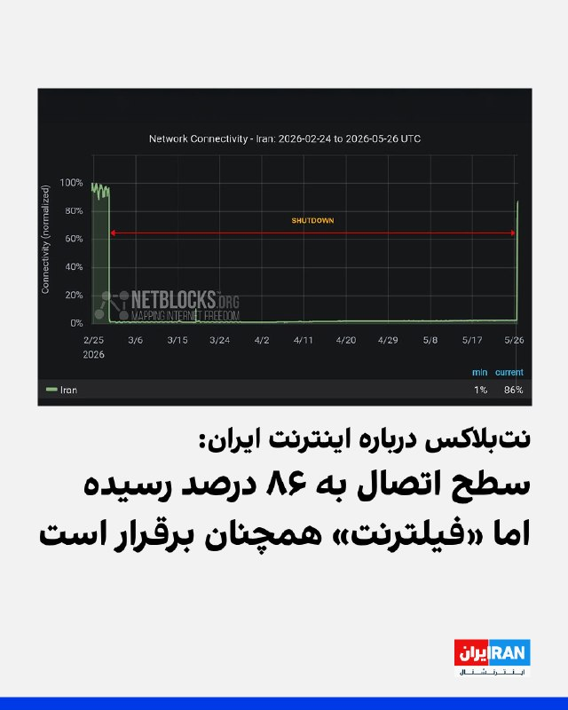

گروه نت‌بلاکس در حساب خود در شبکه اجتماعی ایکس اعلام کرد اتصال اینترنت در ایران افزایش بیشتری یافته و به ۸۶ درصد رسیده است، شبکه‌های موبایل و بخش‌های دیگری از اینترنت نیز دوباره به اینترنت جهانی متصل شده‌اند.
نت‌بلاکس افزود «فیلترنت» همچنان برقرار است اما امکان دور زدن آن وجود دارد. همچنین واتس‌اپ اکنون محدود شده و برای دسترسی به آن نیاز به ابزارهای دور زدن فیلتر است و برخی کاربران همچنان به اینترنت جهانی دسترسی ندارند.
https://iranintl.com/202605268926

## IranIntlTV — post 339140

  <a href="https://t.me/IranintlTV/339140" target="_blank">📎 Download file</a>

🎧نسخه صوتی تیتراول با نیوشا صارمی: آغاز عملیات گسترده زمینی اسراییل در لبنان؛ نشست کمپ‌دیوید درباره ایران
@iranintlTV

## IranIntlTV — post 339139

  <a href="telegram/content/IranIntlTV_339139_1779824348.mp4" target="_blank">🎬 Download video</a>

بر اساس گزارش اختصاصی ایران‌اینترنشنال، مهران محقق، فردی که با خودرو به تجمع ایرانیان در تورنتو حمله کرده بود، یک روز پس از حمله با قید وثیقه آزاد شد و جلسه محاکمه او در اواخر ماه آینده میلادی برگزار می‌شود.

گزارش مهسا مرتضوی، خبرنگار ایران‌اینترنشنال
@iranintltv

## IranIntlTV — post 339138

  

کانال ۱۴ اسرائیل گزارش داد برآوردها در اسرائیل نشان می‌دهد حمله به ایران فعلا از دستور کار خارج شده و ترامپ به دنبال جلوگیری از بی‌ثباتی امنیتی است.

همزمان کانال ۱۲ گزارش داد آمریکا به اسرائیل گفته به بیروت حمله نکند و ساختمان‌ها را در آنجا هدف قرار ندهد.
کانال ۱۲ افزود که یک مقام ارشد اسرائیلی تاکید کرد در صورت فراهم بودن فرصت عملیاتی، مجوز انجام ترورهای هدفمند در بیروت وجود دارد.
https://iranintl.com/202605265818

## IranIntlTV — post 339137

  <a href="telegram/content/IranIntlTV_339137_1779824350.mp4" target="_blank">🎬 Download video</a>

براساس گزارش اختصاصی ایران‌اینترنشنال، محمدباقر قالیباف، رییس مجلس جمهوری اسلامی و رییس هیئت مذاکره‌کننده جمهوری اسلامی، در روزهای گذشته نقشی ویژه در به حاشیه رفتن سعید جلیلی، عضو شورای عالی امنیت ملی، برعهده داشته است.

گفت‌وگو با مسعود کاظمی، روزنامه‌نگار
@iranintltv

## IranIntlTV — post 339136

  <a href="telegram/content/IranIntlTV_339136_1779824353.mp4" target="_blank">🎬 Download video</a>

ایرانیان بریتانیا روز سه‌شنبه با تشکیل تجمعی در مقابل پارلمان بریتانیا علیه اعدام و کشتار شهروندان در ایران شعار داده و خواستار کمک جامعه جهانی شدند. آن‌ها تصویر شاهزاده رضا پهلوی را در تجمع خود قرار دادند.

## IranIntlTV — post 339135

  <a href="telegram/content/IranIntlTV_339135_1779824356.mp4" target="_blank">🎬 Download video</a>

بنیامین نتانیاهو، نخست‌وزیر اسرائیل، اعلام کرد ارتش این کشور با «نیروهای گسترده زمینی» در جنوب لبنان در حال عملیات است و کنترل «مناطق راهبردی» را در دست می‌گیرد.

گفت‌وگو با بابک اسحاقی، خبرنگار ایران‌اینترنشنال
@iranintltv

## IranIntlTV — post 339134

  

🔻تیم ملی فوتبال، در پی انزوای جمهوری اسلامی و انصراف حریفان تدارکاتی، برای چهارمین بار بازی درون‌تیمی برگزار کرد که در آن تیم آبی با نتیجه ۳-۲ تیم سبز را شکست داد.

🔹در ترکیب تیم سبز بازیکنانی چون علیرضا بیرانوند، مهدی طارمی، شجاع خلیل‌زاده، سامان قدوس و علی علیپور حضور داشتند.

🔹کسری طاهری دو بار و آریا یوسفی برای تیم آبی گلزنی کردند و هر دو گل تیم سبز را مهدی طارمی از روی نقطه پنالتی به ثمر رساند.

🔹تیم ملی پیش‌تر قرار بود پیش از جام جهانی مقابل پرتغال، اسپانیا، مقدونیه و آنگولا بازی تدارکاتی برگزار کند، اما همه این تیم‌ها از دیدار با ایران انصراف دادند.

🔹تیم ملی قرار است ۸ خرداد در دیداری تدارکاتی به مصاف گامبیا برود و ۱۴ خرداد نیز در ترکیه برابر تیم ملی مالی بازی کند.

@iranintltvsport

## Shin_Persian — post 6248

Shin ✓ @hey_itsmyturn
Tue, 26 May 2026 18:55:10 UTC

PM @netanyahu has left the ministerial meeting to talk with @POTUS on the phone.

فارسی

نخست‌وزیر @netanyahu جلسه وزرا را برای گفتگوی تلفنی با @POTUS (رئیس‌جمهور ایالات متحده) ترک کرده است.

𝕏 · @shin_persian

## Shin_Persian — post 6247

↩️ Quoted tweet: Fox News ✓ @FoxNews Tue, 26 May 2026 15:17:47 UTC BREAKING: President Trump will convene a rare Cabinet meeting at Camp David on Wednesday as negotiations with Iran enter a critical phase. All Cabinet members are expected to attend the…

## Shin_Persian — post 6246

↩️ Quoted tweet:
Fox News ✓ @FoxNews
Tue, 26 May 2026 15:17:47 UTC

BREAKING: President Trump will convene a rare Cabinet meeting at Camp David on Wednesday as negotiations with Iran enter a critical phase.

All Cabinet members are expected to attend the meeting, Fox News has confirmed, including outgoing Director of National Intelligence Tulsi

↩️ توییت نقل‌قول شده — برای پاسخ، پست زیر را ببینید.

فارسی

فوری: پرزیدنت ترامپ روز چهارشنبه در حالی که مذاکرات با ایران وارد مرحله‌ ای حیاتی می‌شود، یک جلسه نادر هیئت دولت را در کمپ دیوید برگزار خواهد کرد.

فاکس نیوز تایید کرده است که انتظار می‌رود تمام اعضای کابینه در این جلسه شرکت کنند، از جمله تولسی گبرد، مدیر آتی اطلاعات ملی (DNI).

𝕏 · @shin_persian

## Shin_Persian — post 6245

↩️ Quoted tweet: Amichai Stein ✓ @AmichaiStein1 Tue, 26 May 2026 15:09:36 UTC US official to @Jerusalem_Post: U.S. forces are not currently escorting commercial shipping through the Strait of Hormuz. ↩️ توییت نقل‌قول شده — برای پاسخ، پست زیر را ببینید.…

## Shin_Persian — post 6244

↩️ Quoted tweet:
Amichai Stein ✓ @AmichaiStein1
Tue, 26 May 2026 15:09:36 UTC

US official to @Jerusalem_Post: U.S. forces are not currently escorting commercial shipping through the Strait of Hormuz.

↩️ توییت نقل‌قول شده — برای پاسخ، پست زیر را ببینید.

فارسی

یک مقام آمریکایی به @Jerusalem_Post: نیروهای ایالات متحده در حال حاضر کشتی‌های تجاری را در حین عبور از تنگه هرمز اسکورت نمی‌کنند.

𝕏 · @shin_persian

## Shin_Persian — post 6243

OSINTtechnical ✓ @Osinttechnical
Tue, 26 May 2026 14:53:39 UTC

The US has restarted “Project Freedom,” the mission to escort vessels through the contested Strait of Hormuz -WSJ

Project Freedom had been suspended earlier this month after Iran responded by attacking the UAE.

فارسی

ایالات متحده «پروژه آزادی»، مأموریت اسکورت شناورها از طریق تنگه چالش‌برانگیز هرمز را از سر گرفته است. - وال‌استریت ژورنال

پروژه آزادی در اوایل این ماه پس از آنکه ایران با حمله به امارات متحده عربی به آن پاسخ داد، به حالت تعلیق درآمده بود.

𝕏 · @shin_persian

## Shin_Persian — post 6242

↩️ Quoted tweet: Shin ✓ @hey_itsmyturn Wed, 11 Mar 2026 18:40:56 UTC If you're out of Iran you may easily install @PsiphonConduit and provide uncensored internet to Iranian people. It's easily installable on your phone, computer and server. Please do. …

## Shin_Persian — post 6241

↩️ Quoted tweet:
Shin ✓ @hey_itsmyturn
Wed, 11 Mar 2026 18:40:56 UTC

If you're out of Iran you may easily install @PsiphonConduit and provide uncensored internet to Iranian people. It's easily installable on your phone, computer and server.
Please do.
https://conduit.psiphon.ca/en/
Windows:
https://apps.microsoft.com/detail/9p89sj33m3jp?utm_source=conduit_site&hl=en-US&gl=TR
Android:
https://play.google.com/store/apps/details?id=ca.psiphon.conduit
MacOS:

↩️ توییت نقل‌قول شده — برای پاسخ، پست زیر را ببینید.

فارسی

اگر خارج از ایران هستید، می‌توانید به راحتی @PsiphonConduit را نصب کرده و اینترنت بدون سانسور را در اختیار مردم ایران قرار دهید. این برنامه به سادگی بر روی گوشی، کامپیوتر و سرور شما قابل نصب است.
لطفاً این کار را انجام دهید.
https://conduit.psiphon.ca/en/
ویندوز:
https://apps.microsoft.com/detail/9p89sj33m3jp?utm_source=conduit_site&hl=en-US&gl=TR
اندروید:
https://play.google.com/store/apps/details?id=ca.psiphon.conduit
مک‌بوک:

𝕏 · @shin_persian

## Shin_Persian — post 6240

  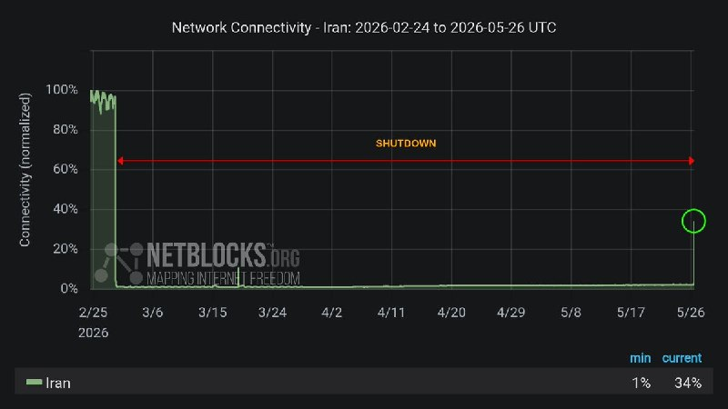

NetBlocks ✓ @netblocks Tue, 26 May 2026 12:54:34 UTC 📈 Confirmed: Live metrics show a partial restoration to internet connectivity in #Iran on day 88, after 2093 hours of near-total isolation from international networks, the longest nationwide internet shutdown…

## Shin_Persian — post 6239

NetBlocks ✓ @netblocks
Tue, 26 May 2026 12:54:34 UTC

📈 Confirmed: Live metrics show a partial restoration to internet connectivity in #Iran on day 88, after 2093 hours of near-total isolation from international networks, the longest nationwide internet shutdown in modern history. It is unclear if the restoration will be sustained.

فارسی

📈 تایید شد: معیارهای لحظه‌ای نشان می‌دهند که در روز ۸۸ام، پس از ۲۰۹۳ ساعت انزوای تقریباً کامل از شبکه‌های بین‌المللی، اتصال به اینترنت در #ایران به طور جزئی برقرار شده است؛ این طولانی‌ترین قطعی سراسری اینترنت در تاریخ مدرن است. هنوز مشخص نیست که آیا این برقراری اتصال پایدار خواهد بود یا خیر.

𝕏 · @shin_persian

## Shin_Persian — post 6238

  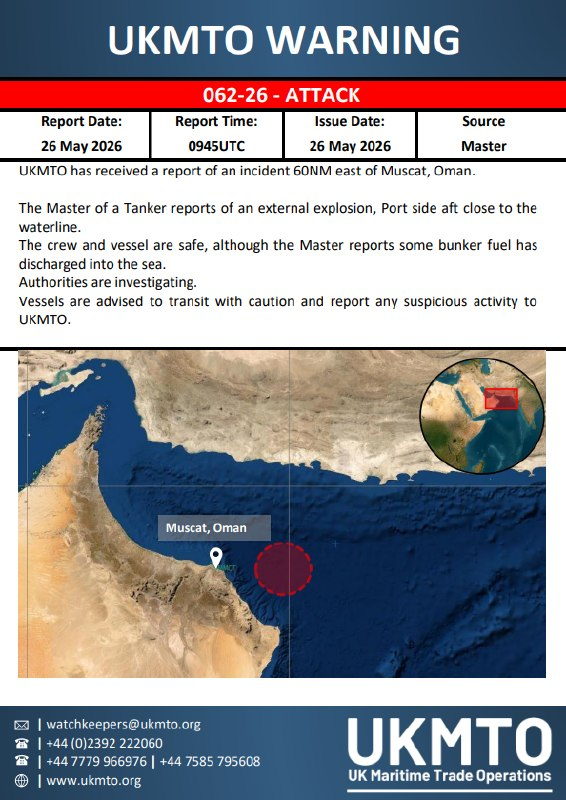

UKMTO Operations Centre @UK_MTO
Tue, 26 May 2026 12:20:56 UTC

UKMTO WARNING 062-26

Click here to view the full warning ⤵️
http://www.ukmto.org/-/media/ukmto/products/20260526-ukmto_warning_062_26.pdf?rev=c6fe9b7b5c8f427fab4d765caf5f8574

#MaritimeSecurity #MarSec

فارسی

هشدار UKMTO 062-26

برای مشاهده متن کامل هشدار اینجا کلیک کنید ⤵️
http://www.ukmto.org/-/media/ukmto/products/20260526-ukmto_warning_062_26.pdf?rev=c6fe9b7b5c8f427fab4d765caf5f8574

#MaritimeSecurity #MarSec

𝕏 · @shin_persian

## Shin_Persian — post 6237

  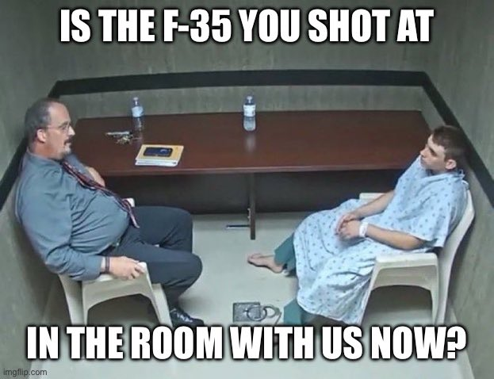

↩️ Quoted tweet: DefenceGeek 🇬🇧 ✓ @DefenceGeek Tue, 26 May 2026 09:11:22 UTC Summary of overnight events in CENTCOM --- Operation EPIC FURY / Project FREEDOM --- Ok so not 100% sure if this is all in the right order, but from what I've gathered: - IRGC…

## Shin_Persian — post 6236

↩️ Quoted tweet:
DefenceGeek 🇬🇧 ✓ @DefenceGeek
Tue, 26 May 2026 09:11:22 UTC

Summary of overnight events in CENTCOM
--- Operation EPIC FURY / Project FREEDOM ---

Ok so not 100% sure if this is all in the right order, but from what I've gathered:

- IRGC boats in the gulf were identified approaching commercial shipping and/or trying to lay mines in the

↩️ توییت نقل‌قول شده — برای پاسخ، پست زیر را ببینید.

فارسی

خلاصه‌ای از حوادث شبانه در سنتکام (ستاد فرماندهی مرکزی ایالات متحده - CENTCOM)
--- عملیات خشم حماسی / پروژه آزادی ---

بسیار خب، ۱۰۰٪ مطمئن نیستم که همه این‌ها به ترتیب درست باشند، اما طبق آنچه گردآوری کرده‌ام:

- قایق‌های سپاه پاسداران انقلاب اسلامی (IRGC) در خلیج [فارس] شناسایی شدند که در حال نزدیک شدن به کشتی‌های تجاری و/یا تلاش برای مین‌گذاری در

𝕏 · @shin_persian

## Shin_Persian — post 6235

Shin ✓ @hey_itsmyturn
Mon, 25 May 2026 23:36:47 UTC

Qatar offers extra all-inclusive, happy-ending-included spa vouchers for Araghchi and Ghalibaf to compensate the US strike on IRGC terror positions in southern Iran.

فارسی

قطر بن‌های تخفیف اضافی اسپا با خدمات کامل و «پایان خوش» را به عراقچی و قالیباف هدیه می‌دهد تا ضربه ایالات متحده به مواضع تروریستی سپاه پاسداران (IRGC) در جنوب ایران را جبران کند.

𝕏 · @shin_persian

## Shin_Persian — post 6234

Jennifer Griffin ✓ @JenGriffinFNC
Mon, 25 May 2026 22:54:25 UTC

CENTCOM spox Capt Tim Hawkins to Fox: “U.S. forces conducted self-defense strikes in southern Iran today to protect our troops from threats posed by Iranian forces. Targets included missile launch sites and Iranian boats attempting to emplace mines. U.S. Central Command continues to defend our forces while using restraint during the ongoing ceasefire.”

فارسی

کاپیتان تیم هاوکینز، سخنگوی سنتکام (فرماندهی مرکزی ایالات متحده) به فاکس‌نیوز گفت: «نیروهای آمریکایی امروز برای محافظت از نیروهایمان در برابر تهدیدات ناشی از نیروهای ایرانی، حملاتی را در قالب دفاع از خود در جنوب ایران انجام دادند. اهداف شامل سایت‌های پرتاب موشک و قایق‌های ایرانی بود که قصد مین‌گذاری داشتند. فرماندهی مرکزی ایالات متحده ضمن رعایت خویشتن‌داری در طول آتش‌بس جاری، به دفاع از نیروهای ما ادامه می‌دهد.»

𝕏 · @shin_persian

## Shin_Persian — post 6233

Shin ✓ @hey_itsmyturn
Mon, 25 May 2026 23:02:20 UTC

So it was US :))

فارسی

پس کار آمریکا بود :))

𝕏 · @shin_persian

## Iliaen — post 4435

درود؛ اکنون که اینترنت تا حدودی متصل شد، این را می‌نویسم.

در این چند هفته اخیر، ترجیح دادم مانند آنان که در ایران به جهان آزاد دسترسی ندارند، من هم برای مدتی دور از شبکه‌های اجتماعی باشم تا شاید برخی از مسائل را نبینم یا حداقل کمتر ببینم.

مشاهده روند فعالیت برخی از دوستان و همچنین زبان جدید جامعه در فقدان حضور ایرانیانِ داخل کشور، عمیقاً من را از ادامه‌ی حضور در این فضا نااُمید کرد و دو راه بیشتر نداشتم؛

یا سکوت و صبر به امید یک بازنگریِ جمعی، یا نقدهایی که شاید آنچنان هم در فضای جدا افتاده از درون ایران، پُرفایده و اثرگذار نبود.

متوجه شدم با قطع و عدم دسترسی یکسان جامعه به اینترنت، علی‌الخصوص اکثریتی که حتی توان خرید وی‌پی‌ان‌های نجومی را ندارند، جنس دغدغه‌ها در کُنش سیاسی ایرانیان بسیار متفاوت از گذشته می‌شود و گاهی آنقدر در فرعیات غرق می‌شوند که اصل هدف را فراموش می‌کنند.

امروز، خوشحالم که می‌بینم اینترنت، هرچند نصفه و نیمه، اما در حال باز شدن است و دوباره کسانی حضور دارند که دغدغه‌هایشان، متمرکز بر آنچه در ایران رُخ می‌دهد است.

نمی‌دانم اینترنت به قبل از جنگ، یا قبل از کشتار دِی برخواهد گشت یا خیر، اما می‌دانم ما هرگز به قبل از آن تاریخ برنخواهیم گشت.

@iliaen

## ManotoTV — post 105830

آیا وعده بازگشایی اینترنت عملی می‌شود؟

## FarsiVOA — post 218737

⚡️در گفت‌وگو با رضا علیجانی، روزنامه‌نگار از پاریس، به فضاسازی رسانه‌ای دولت و حاکمیت درباره بی‌اثر بودن محاصره دریایی و آزادسازی دارایی‌ها پرداختیم. به گفته او، جمهوری اسلامی در مواجهه با آمریکا «گربه‌ای بود که سعی کرد صدای شیر دربیاورد».
@FarsiVOA

## FarsiVOA — post 218736

🔺بیانیه مشترک نتانیاهو و کاتس: به فرمانده جدید شاخه نظامی حماس حمله کردیم

◾️بنیامین نتانیاهو به همراه یسرائیل کاتز، وزیر دفاع وزیر دفاع اسرائیل در شامگاه سه‌شنبه ۵ خرداد با انتشار بیانیه‌ای مشترک، از هدف قرار دادن محمد عوده، فرمانده جدید «کتائب عزالدین قسام» شاخه نظامی حماس در غزه خبر دادند.

⬇️ بیشتر بخوانید:
https://ir.voanews.com/a/ghaza-hamas-7october-irgc-iran/8154137.html
@FarsiVOA

## FarsiVOA — post 218735

⚡️در برنامه تفسیر خبر امروز، مهدی آقازمانی با کارشناسان مهمان، درباره تاکیذ پرزیدنت ترامپ بر نابودی کامل اورانیو غنی شده جمهوری اسلامی، بازه زمانی چند روزه برای رسیدن به تفاهم از سوی وزیر خارجه آمریکا، پیام منتسب به مجتبی خامنه‌ای و تکرار تهدید‌ها و شعارهای رایج در جمهوری اسلامی و گفتگو می‌کند
@FarsiVOA

## FarsiVOA — post 218734

🔺پاسخ سنتکام به ادعاهای رسانه‌ای: آمریکا کشتی‌های تجاری را در تنگه هرمز اسکورت نمی‌کند

◾️فرماندهی مرکزی ایالات متحده، سنتکام، سه‌شنبه ۵ اردیبهشت برخی ادعاهای رسانه‌ای را رد کرد و اعلام کرد که «پروژه آزادی» از سرگرفته نشده است.

⬇️ بیشتر بخوانید:

https://ir.voanews.com/a/centcom-project-freedom-strait-of-hormuz-commercial-ships/8154112.html

## FarsiVOA — post 218733

تیم ملی فوتبال جمهوری اسلامی و چالش بزرگ در جام جهانی ۲۰۲۶: اقامت در مکزیک، بازی در خاک آمریکا؛ گفت‌وگو با فرید اشرفیان

## FarsiVOA — post 218732

  <a href="telegram/content/FarsiVOA_218732_1779824361.mp4" target="_blank">🎬 Download video</a>

ارتش اسرائیل ویدیویی از فعالیت نیروهایش در طول نبرد بیت حانون منتشر کرده است.

بنابر بیانیه ارتش اسرائیل منطقه بیت حانون در شمال نوار غزه یکی از کانون‌های اصلی و پیچیده نبرد در جریان عملیات زمینی بود و تعدادی از نیروهای این ارتش «در دفاع از شهرک‌های نگب غربی و در چارچوب شکست گردان بیت حانون جان خود را از دست دادند.»

ارتش اسرائیل اعلام کرد این منطقه به یکی از پایگاه‌های اصلی سازمان تروریستی حماس تبدیل شده بود و تروریست‌های این سازمان از زیرساخت‌هایی که در دل جمعیت غیرنظامی تعبیه شده بود، فعالیت می‌کردند.

به گفته ارتش اسرائیل زیر خانه‌های مسکونی، مراکز عمومی و مسیرهای تردد، شبکه‌ای گسترده از تونل‌ها ایجاد شده بود که برای اجرای عملیات‌های تروریستی علیه شهروندان و نیروهای ارتش اسرائیل استفاده می‌شد.

## FarsiVOA — post 218731

علی جوانمردی: آیندە مردم ایران پس از توافق احتمالی آمریکا با جمهوری اسلامی

## FarsiVOA — post 218730

اختلاف در اتحادیه اروپا بر سر چین؛ تردید آلمان مانع سیاست واحد تجاری

## FarsiVOA — post 218729

آیا دولت در ساختار «جمهوری اسلامی» توان بازگرداندن اینترنت به مردم را دارد، یا صرفاً ادعاهای تبلیغاتی مطرح می‌کند؟ گفت‌وگو با اشکان خسروپور، پژوهشگر سیاست گذاری اینترنت

## FarsiVOA — post 218728

🔺نتانیاهو: بیش از ۶۰۰ تروریست حزب‌الله از بین برده‌ایم؛ متوقف نمی‌شویم

▪️نخست وزیر اسرائیل سه‌شنبه ۵ خرداد بر ادامه مبارزه با گروه تروریستی حزب‌الله تاکید کرد و گفت ما نه تنها در این راه متوقف نمی‌شویم بلکه من دستور داده‌ام تا فشارها بر این گروه افزایش یابد.

⬇️ بیشتر بخوانید:

https://ir.voanews.com/a/benjamin-netanyahu--israeli-army-/8154038.html/?nocach=1

## FarsiVOA — post 218727

احضار جمعی از سینماگران از جمله هومن سیدی و سعید روستایی به دادسرای فرهنگ و رسانه با اتهام «همکای با دولت متخاصم» در پی افزایش فشار بر هنرمندان؛ گفت‌وگو با مصطفی عزیزی، نویسنده و فیلمساز

## FarsiVOA — post 218726

  <a href="telegram/content/FarsiVOA_218726_1779824364.mp4" target="_blank">🎬 Download video</a>

ارتش اسرائیل تصاویری از شبکه مسیرهای زیرزمینی حماس در بیت حانون منتشر کرد که نیروهای تیپ شمالی و یگان ویژه مهندسی تحت فرماندهی لشگر ۲۵۲، بیش از ۱۱ کیلومتر از آن‌ها را شناسایی و منهدم کردند.

بنابر بیانیه ارتش اسرائیل همچنین صدها زیرساخت تروریستی در سطح زمین نیز نابود شد.

به گفته ارتش اسرائیل منطقه بیت حانون در شمال نوار غزه یکی از کانون‌های اصلی نبرد در جریان عملیات زمینی بود. «در طول جنگ در این منطقه سه کیلومتر دیگر از مسیرهای زیرزمینی نیز منهدم و تعداد زیادی تروریست نیز حذف شدند.»

## FarsiVOA — post 218725

🔺شورای همکاری خلیج فارس: حزب‌الله با تمام اشکال و شاخه‌ها، یک گروه تروریستی به حساب می‌آید

▪️به دنبال انتقاد نعیم قاسم دبیرکل گروه تروریستی حزب‌الله لبنان از اقدامات دولت بحرین، جاسم بدیوی دبیرکل شورای همکاری خلیج فارس، شامگاه شب گذشته ۴ خرداد ۱۴۰۵، ضمن محکوم کردن این سخنان، واکنش تندی به آن نشان داد.

⬇️ بیشتر بخوانید:

https://ir.voanews.com/a/bahrain-lebanon-hezbollah-iran-proxy-war-/8154099.html/?nocach=1

## FarsiVOA — post 218724

  <a href="telegram/content/FarsiVOA_218724_1779824366.mp4" target="_blank">🎬 Download video</a>

ارتش اسرائیل ویدیویی از حملات هوایی به مواضع حزب‌الله در جنوب لبنان منتشر و تاکید کرد نیروهایش به هدف‌گیری زیرساخت‌های این سازمان تروریستی در جنوب لبنان ادامه می‌دهند.

ارتش اسرائیل در ادامه اعلام کرد «تروریست‌هایی که در حال پیشبرد طرح‌های تروریستی علیه نیروهای ما بودند به هلاکت رسیدند و زیرساخت‌هایی که برای شلیک راکت استفاده می‌شدند هدف قرار گرفتند.»

## FarsiVOA — post 218723

در میدان پرسیدیم: چرا ساواک پرویز قلیچ‌خانی، ستاره فوتبال ایران را بازداشت کرد؟

## FarsiVOA — post 218722

جنگ قدرت در مجلس جمهوری اسلامی؛ حمله رسایی و ثابتی به قالیباف و رهبر سوم غایب

## FarsiVOA — post 218721

وضعیت فوق بحرانی پنج «سد» در مناطق مختلف ایران، به‌رغم افزایشی اندک در میزان بارش سالانه گفت‌وگو با منصور سهرابی، متخصص محیط زیست و بوم شناسی

## FarsiVOA — post 218720

سایه جنگ پس از آتش‌بس؛ موج تازه حملات به اردوگاه‌های احزاب کردستان ایران در اقلیم

## FarsiVOA — post 218719

در فاصله شانزده روز تا آغاز جام جهانی ۲۰۲۶، تیم ملی جمهوری اسلامی همچنان با ابهام‌های جدی روبه‌روست؛ از انتقال کمپ از آمریکا به مکزیک گرفته تا بحث ویزا، محدودیت‌های سفر و فشارهای سیاسی.

## FarsiVOA — post 218718

در گفت‌وگو با سارا کرمانیان، پژوهشگر روابط بین‌الملل دانشگاه ساسکس، به حملات «دفاعی» سنتکام در تنگه هرمز و شکاف میان روایت رسانه‌های حکومتی و واکنش محدود میدانی جمهوری اسلامی پرداختیم و بررسی کردیم چگونه سیاست «صلح از طریق قدرت» دولت ترامپ مسیر مذاکرات پایان جنگ را شکل می‌دهد

## DW_Farsi — post 125172

  

🔶 سنتکام شروع دوباره "پروژه آزادی" در تنگه هرمز را تکذیب کرد

در حالی که روزنامه وال‌استریت ژورنال به نقل از مقام‌های نظامی آمریکا که نامشان فاش نشد گزارش داد که این کشور قصد ازسرگیری همراهی کشتی‌های تجاری در تنگه هرمز در قالب "پروژه آزادی" را دارد سنتکام این خبر را تکذیب کرده است.

سنتکام، فرماندهی مرکزی ایالات متحده سه‌شنبه ۲۶ مه طی پیامی در صفحه کاربری خود در شبکه ایکس چنین ادعایی که در گزارش رسانه‌ها بازتاب یافته را "نادرست" خواند و متذکر شد: «پروژه‌ آزادی ازسر گرفته نشده و نیروهای آمریکایی در حال حاضر شناورهای تجاری را در عبور از تنگه هرمز همراهی نمی‌کنند.»
عملیات "پروژه آزادی" اوایل ماه جاری میلادی (مه) تنها ۳۶ ساعت پس از آغاز، متوقف شده بود.

در شرایطی که گفت‌وگوهای میان آمریکا و ایران بر سر تمدید احتمالی آتش‌بس و دستیابی به توافقی گسترده‌تر به مرحله‌ای حساس رسیده، وال‌استریت ژورنال گزارش داده بود که نیروی دریایی آمریکا قصد دارد طی روزهای آینده حدود ۱۲ فروند شناور، از جمله ابرنفت‌کش‌ها و کشتی‌های کانتینری را برای عبور از این آ‌ب‌راه حیاتی حمل‌ونقل نفت، همراهی کند.

@dw_farsi

## DW_Farsi — post 125171

  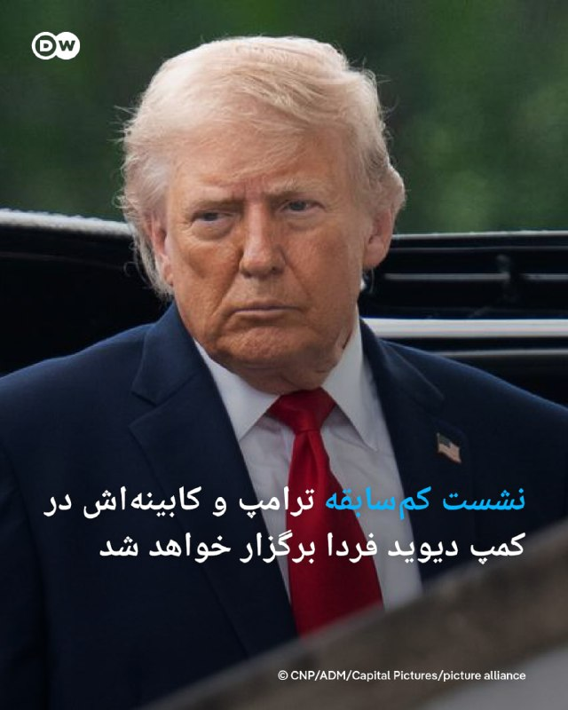

🔶 نشست کم‌سابقه ترامپ و کابینه‌اش در کمپ‌ دیوید فردا برگزار خواهد شد

در حالی که مذاکرات با ایران به مرحله‌ای حساس رسیده است یک مقام کاخ سفید به خبرگزاری فرانسه گفت، دونالد ترامپ، رئیس‌ جمهور آمریکا فردا چهارشنبه ۲۷ مه جلسه کابینه را در اقدامی نادر در کمپ دیوید، اقامت‌گاه ریاست جمهوری برگزار خواهد کرد.

انتخاب این اقامتگاه دورافتاده در کوه‌های ایالت مریلند که ترامپ برخلاف رئیس‌جمهوران پیشین، به‌ندرت از آن استفاده می‌کند، نشان‌دهنده حساس بودن این گفت‌وگوها است.

روزنامه "نیویورک پست" نیز گزارش داد که انتظار می‌رود موضوع ایران محور اصلی این جلسه باشد و تمامی اعضای کابینه در جلسه شرکت کنند. همچنین گفته شده که وضعیت اقتصادی آمریکا هم در دستور کار قرار دارد.

یک مقام کاخ سفید نیز در گفت‌وگو با شبکه خبری "سی‌ان‌بی‌سی" تأیید کرد که ترامپ روز چهارشنبه با تمامی اعضای کابینه خود در کمپ دیوید دیدار خواهد کرد.

این خبر تنها چند ساعت بعد از حملات تازه ایالات متحده به ایران منتشر می‌شود که نگرانی‌ها در مورد توافق صلح را افزایش داده است.

@dw_farsi

## DW_Farsi — post 125170

  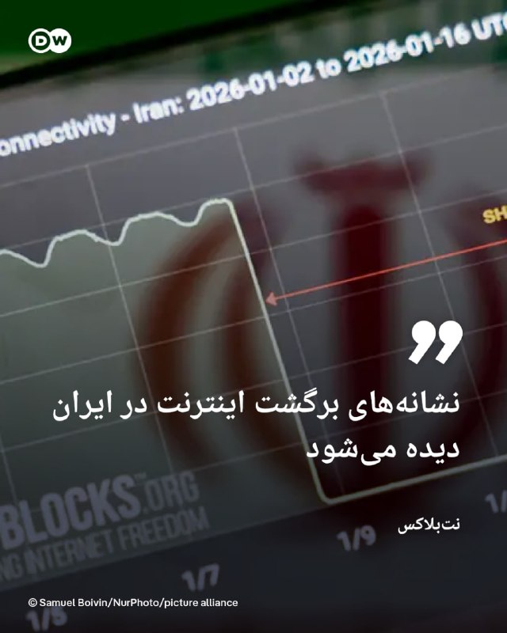

🔶 نت‌بلاکس : نشانه‌های برگشت اینترنت در ایران دیده می‌شود

نت‌بلاکس، نهاد ناظر بر وضعیت اینترنت در جهان اعلام کرد، بالاخره بعد از ۲۰۹۳ ساعت قطعی، نشانه‌هایی از اتصال مجدد اینترنت در ایران دیده می‌شود.

نت‌بلاکس می‌گوید، در ۸۸مین روز و پس از ۲۰۹۳ ساعت قطعی، بخشی از اتصال اینترنت در ایران برقرار شده است.

این نهاد همچنین نوشت، این مدت خاموشی اینترنت در ایران "طولانی‌ترین قطع سراسری" این شبکه جهانی ارتباطی در تاریخ معاصر به شمار می‌رود.

نت‌بلاکس همچنین با ابراز تردید نسبت به ثبات اتصال اینترنت در ایران ادامه داد: «مشخص نیست که این بازگشت ارتباط، پایدار خواهد بود یا نه.»

@dw_farsi

## DW_Farsi — post 125169

  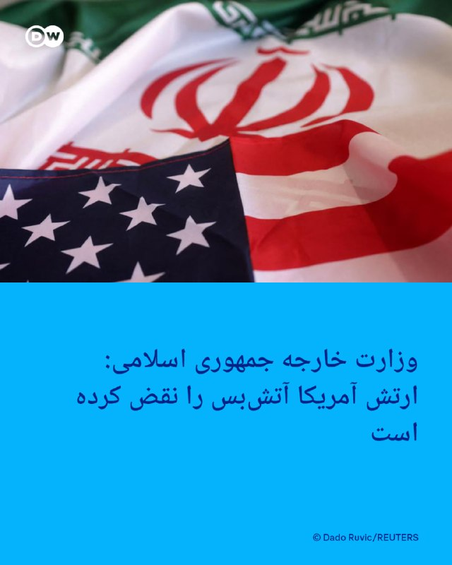

🔶 وزارت خارجه جمهوری اسلامی: ارتش آمریکا آتش‌بس را نقض کرده است

وزارت خارجه ایران طی بیانیه‌ای حملات تازه آمریکا به جنوب کشور را محکوم کرد و آن را "نقض آتش‌بس" اعلام‌شده در ۱۹ فروردین خواند.

در این بیانیه آمده است که ارتش آمریکا با این حملات "مرتکب نقض فاحش آتش‌بس در منطقه هرمزگان شد".

صبح روز سه‌شنبه ۵ خرداد فرماندهی مرکزی ایالات متحده (سنتکام) اعلام کرد که ارتش این کشور در جنوب ایران در "دفاع از خود" عملیاتی انجام داده و مواضع پرتاب موشک و شناورهای ایرانی که "در حال تلاش برای مین‌گذاری بودند" را هدف قرار داده است.

سنتکام افزود که ارتش آمریکا در طول آتش‌بس جاری ضمن خویشتنداری، همچنان به دفاع از نیروهای خود ادامه خواهد داد.

در همین حال در بامداد سه‌شنبه برخی اخبار منتشره در شبکه‌های اجتماعی حاکی از شنیده شدن صدای انفجار و پدافند هوایی در بندرعباس، سیریک و جاسک بود.

رسانه‌های ایران نیز صبح همین روز از "حمله جنگنده‌های آمریکایی به چند شناور ایرانی در جنوب جزیره لارک" و "کشته شدن سه نفر در این حملات" خبر دادند.

@dw_farsi

## DW_Farsi — post 125168

  

🔶 پژوهشگران اسرائيلی: هکرهای منتسب به ایران پشت حمله به حمل‌ونقل لس‌‌آنجلس بودند

پژوهشگران اسرائیلی می‌گویند، هکرهای منتسب به ایران مسئول یک حمله سایبری مخرب در ماه مارس بودند که باعث شد بخش‌هایی از شبکه حمل‌ونقل عمومی شهر لس‌آنجلس از کار بیفتد.

به گفته شرکت امنیت سایبری گمبیت سکیوریتی (Gambit Security) مستقر در تل‌آویو، مهاجمان دست‌کم ۷۰۰ گیگابایت ایمیل، نسخه‌های پشتیبان و سایر فایل‌ها را از سازمان حمل‌ونقل شهری لس‌آنجلس (LACMTA) ربودند.

این شرکت اعلام کرد که داده‌های به‌سرقت‌رفته را پس از آن کشف کرده که به‌طور ناخواسته در اینترنت افشا شدند.

این شرکت می‌گوید، شواهد دیجیتالی حاکی از آن است که سروری که داده‌ها روی آن پیدا شده، به یک عملیات هکری شناخته‌شده قبلی مرتبط بوده که مقام‌ها و پژوهشگران اسرائیلی آن را به تهران نسبت داده بودند.

رویترز که این خبر را منتشر کرده می‌گوید، نمایندگی ایران در سازمان ملل تا کنون به درخواست‌ها برای اظهارنظر پاسخی نداده است.

همچنین اداره ملی سایبری اسرائیل نیز این درخواست‌ها را بی‌پاسخ گذاشته است.

@dw_farsi

## DW_Farsi — post 125167

  

🔶 هشدار مقام سازمان ملل درباره افزایش گرسنگی بر اثر بستن تنگه هرمز

مارتین فریک، مدیر برنامه جهانی غذای سازمان ملل (WFP) در آلمان، اتریش و لیختن‌اشتاین در مورد پیامدهای انسانی و اقتصادی مسدود شدن تنگه هرمز هشداری جدی داده است.

به گزارش وب‌سایت روزنامه استاندارد، فریک در توضیح ابعاد موضوع گفت: «بسته شدن تنگه هرمز از نظر تأثیر، تقریبا به همان شکلی ما را تحت تأثیر قرار می‌دهد که همه‌گیری کووید [ویروس کرونا] یا جنگ تهاجمی روسیه علیه اوکراین ما را تحت تأثیر قرار داد.»

به گفته او، پیامدهای کامل این وضعیت هنوز به‌طور دقیق قابل پیش‌بینی نیست.

فریک به وضعیت اقتصادی شکننده در برخی کشورها اشاره کرده و می‌گوید: «سه میلیارد نفر در کشورهایی زندگی می‌کنند که آن‌قدر بدهکارند که هزینه بازپرداخت بدهی‌هایشان از بودجه‌ای که صرف آموزش یا بهداشت و درمان می‌کنند بیش‌تر است.»

این مقام سازمان ملل هشدار می‌دهد که اگر در چنین کشورهایی قیمت واردات بیش از این افزایش یابد، خانواده‌های بیشتری در معرض خطر سقوط به ورطه گرسنگی قرار خواهند گرفت.

@dw_farsi

## DW_Farsi — post 125166

🔶 دومین مورد تأییدشده ویروس هانتا در اسپانیا

حدود هشت هفته پس از شیوع ویروس هانتا در کشتی تفریحی "هوندیوس"، امروز سه‌شنبه ۲۶ مه (۵ خرداد) دومین مورد ابتلا به این ویروس در اسپانیا تأیید شد.

وزارت بهداشت این کشور اعلام کرد که نتیجه آزمایش یک مسافر اسپانیایی این کشتی کروز که اکنون در قرنطینه است، مثبت بوده است. همچنین تأکید شده است که این مورد جدید «هیچ تغییری در سطح خطر برای عموم مردم ایجاد نمی‌کند.»

بر اساس این گزارش، بیمار اکنون به بخش قرنطینه با سطح بالای حفاظت در یک بیمارستان نظامی منتقل شده است. پیش‌تر نیز نتیجه آزمایش یکی دیگر از مسافران اسپانیایی، اندکی پس از ترک کشتی "هوندیوس" مثبت اعلام شده بود.

در مجموع، پس از تخلیه کشتی، ۱۴ مسافر اسپانیایی "هوندیوس" به یک بیمارستان نظامی در مادرید منتقل و در آنجا بستری شده بودند.

سازمان بهداشت جهانی (WHO) شنبه گذشته اعلام کرد که از زمان شیوع ویروس هانتا در این کشتی تفریحی، در مجموع ۱۲ مورد قطعی یا مشکوک به ابتلا، به این سازمان گزارش شده است.

سه مسافر، از جمله یک زن آلمانی، در پی ابتلا به این ویروس جان باختند.

مقام‌های اسپانیا حدود دو هفته پیش با اجازه لنگر انداختن کشتی "هوندیوس" در نزدیکی جزیره تنریف، بزرگ‌ترین جزیره جزایر قناری، زمینه تخلیه آن را فراهم کردند و مسافران و خدمه از کشتی خارج شدند.

از آن زمان تاکنون، به دلیل دوره نهفتگی طولانی و احتمال مرگبار بودن ابتلا به ویروس هانتا، افراد درگیر در قرنطینه قرار گرفته و تحت مراقبت‌های پزشکی هستند.

شیوع این ویروس خطرناک در جریان سفر کشتی تفریحی "هوندیوس" از جنوبی‌ترین نقطه آرژانتین به مقصد جزایر "کیپ ورد" رخ داد.

ویروس‌های هانتا موجب بیماری‌های شدید تنفسی می‌شوند و هنوز هیچ واکسنی برای مقابله با آنها وجود ندارد. این ویروس‌ها معمولاً از طریق ادرار، مدفوع و بزاق جوندگان آلوده منتقل می‌شوند.

گونه ویروسی که در کشتی "هوندیوس" شیوع پیدا کرد، ویروس "آند" بود. این تنها گونه از ویروس هانتا است که انتقال آن از انسان به انسان به طور قطعی اثبات شده است.

گرچه ویروس‌های هانتا تقریباً در سراسر جهان وجود دارد و گزینه‌های امیدوارکننده‌ای نیز برای واکسن‌ها و روش‌های درمانی آنها در دست بررسی است، اما پژوهشگران برای رساندن آن به مرحله عرضه در بازار، به بودجه بیشتر و نیز شمار بیشتر بیماران نیاز دارند.

@dw_farsi

## DW_Farsi — post 125165

  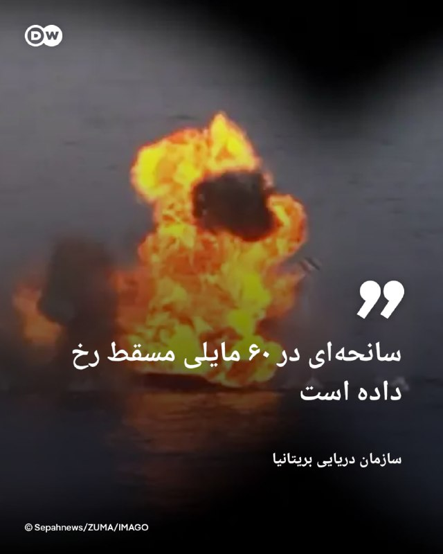

🔶 سازمان دریایی بریتانیا: سانحه‌‌ای در ۶۰ مایلی مسقط رخ داده است

سازمان عملیات تجارت دریایی بریتانیا (UKMTO ) از وقوع سانحه‌ای در فاصله ۶۰ مایلی دریایی شرق مسقط، پایتخت عمان خبر داده است.

به گزارش این سازمان، ناخدای یک نفتکش گزارش داده که یک انفجار خارجی در اطراف این کشتی رخ داده است.

بنا بر این گزارش، خدمه و کشتی در امنیت هستند، اما ناخدا گزارش داده که مقداری از سوخت کشتی به دریا نشت کرده است.

مقامات در حال بررسی این حادثه هستند.

سازمان عملیات تجارت دریایی بریتانیا به تمامی شناورها توصیه کرده که با احتیاط عبور کنند و هرگونه فعالیت مشکوک را به این سازمان گزارش دهند.

@dw_farsi

## DW_Farsi — post 125164

  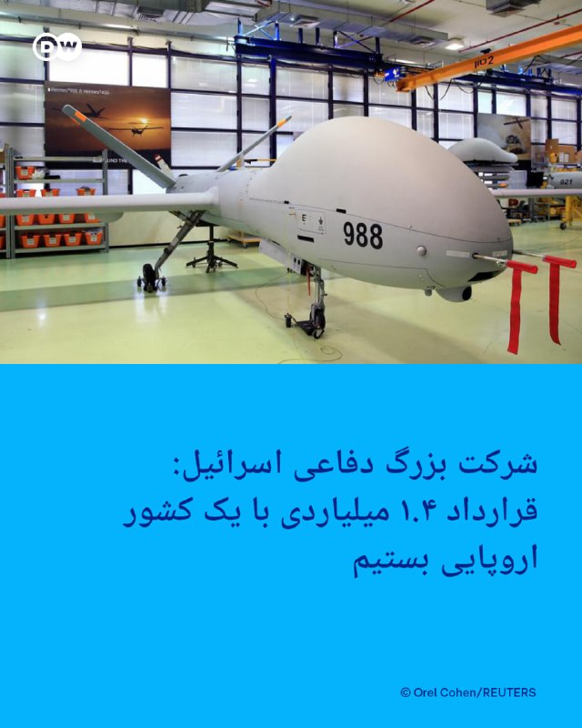

🔶 شرکت بزرگ دفاعی اسرائيل: قرارداد ۱.۴ میلیاردی با یک کشور اروپایی بستیم

شرکت بزرگ دفاعی "البیت سیستمز" (Elbit Systems) اسرائيل اعلام کرده که قراردادی به ارزش ۱.۴ میلیارد دلار با یک کشور اروپایی که نامش فاش نشده بسته تا این کشور، به مجموعه گسترده‌ای از سامانه‌های پیشرفته مجهز شده و از نظر نظامی نوسازی شود.

به گزارش رسانه‌ها، این قرارداد طی یک دوره پنج‌ساله اجرا خواهد شد. هدف از این قرارداد نیز افزایش توان مانور عملیاتی و بقاپذیری نیروها در میدان نبرد عنوان شده است.

بر اساس این قرارداد، کشور اروپایی یادشده به مجموعه‌ای از تجهیزات شامل وسایل نقلیه بدون سرنشین خودکار، سامانه‌های جنگ الکترونیک زمینی، مهمات هدایت‌شونده دقیق توپخانه و حملات هوا به زمین، سامانه‌های نشانه‌گذاری الکترو اپتیکی و سامانه‌های شناسایی مجهز خواهد شد.

تمام این تجهیزات از طریق رادیوهای نرم‌افزار محور(SDR) به یکدیگر متصل خواهند بود.

شرکت هوافضای البیت در بیانیه‌ای اعلام کرد که این سامانه‌ها اثربخشی عملیاتی این کشور را افزایش داده و آن را به سمت تبدیل شدن به یک ارتش پیشرفته و مدرن هدایت خواهند کرد.

@dw_farsi

## DW_Farsi — post 125163

  

🔶 تسنیم: ایران پیگیر آزادسازی ۱۲ میلیارد دلار در شروع اعلام توافق است

تسنیم در خبری اختصاصی به نقل از یک منبع آگاه از تیم مذاکره‌کننده جمهوری اسلامی نوشت که ایران پیگیر آزادسازی ۱۲ میلیارد دلار در شروع اعلام یادداشت تفاهم است.

این خبرگزاری نزدیک به سپاه پاسداران می‌نویسد، این منبع گفته است: «طبق متن ۱۴ ماده‌ای یادداشت تفاهم، منابع بلوکه‌شده ایران باید در طول مذاکرات آزاد شود که این مبلغ ۲۴ میلیارد دلار برآورد شده است.»

به گفته این منبع، جمهوری اسلامی تاکید دارد که نصف این مبلغ یعنی ۱۲ میلیارد دلار باید با شروع اعلام یادداشت تفاهم یا توافق در دسترس قرار گیرد و بقیه در طول ۶۰ روز منتقل شود.

این منبع همچنین گفت که سفر محمدباقر قالیباف، رئیس تیم مذاکره‌کننده ایران به قطر هم "برای تفاهم درباره اجرایی‌سازی این مطالبه و نحوه دسترسی به ۱۲ میلیارد دلار در گام اول و رفع موانع بوده است".

تسنیم به نقل از این منبع ادامه داد: «با توجه به تجربه تفاهم بر سر آزادسازی پول‌های ایران در کره جنوبی و قطر، تاکید بر این بود که مراحل اجرایی با دقت پیگیری شود تا این تجربه مجدد تکرار نشود.»

@dw_farsi

## DW_Farsi — post 125162

  

🔶 دیوان عدالت اداری اجرای بازگشایی اینترنت را موقتا متوقف کرد

در حالی که مقام‌های حکومت ایران خبر از دستور رئیس‌ جمهور برای اجرای مصوبه بازگشایی اینترنت بین‌الملل داده‌اند دیوان عدالت اداری اعلام کرده که دستور توقف موقت اجرای مصوبه "ایجاد ستاد ویژه ساماندهی و راهبری فضای مجازی کشور" را صادر کرده است.

مطابق گزارش خبرگزاری میزان، دیوان عدالت اداری تأکید کرده که این تصمیم را "در پی طرح شکایاتی با خواسته ابطال سند ایجاد این ستاد" اتخاذ کرده و تا زمان رسیدگی نهایی به این شکایات، مصوبات و تصمیمات ستاد ویژه ساماندهی و راهبری فضای مجازی کشور قابل ترتیب اثر نخواهد بود.

روز گذشته بعد از این که خبر تصویب بازگشایی اینترنت بین‌الملل و بازگشت آن به وضعیت دی‌ماه ۱۴۰۴ از سوی این ستاد منتشر شد رسانه‌های ایران از ابلاغ دستور اجرای این مصوبه از سوی مسعود پزشکیان، رئیس‌ دولت جمهوری اسلامی به وزارت ارتباطات خبر دادند.

@dw_farsi

## DW_Farsi — post 125161

🔶 یورش پلیس در ازمیر؛ بازداشت یک شهردار دیگر اپوزیسیون ترکیه

پس از برکناری اوزگور اوزل، رهبر اپوزیسیون ترکیه، از سمت خود توسط دادگاهی در این کشور، افراد بیشتری، از جمله یک شهردار در ازمیر، بازداشت شده‌اند.

به گزارش خبرگزاری ترکیه‌ای دمیرورن، مصطفی گونی، شهردار منطقه گوزل‌باغچه در کلان‌شهر ازمیر از حزب جمهوری‌خواه خلق (CHP) در میان بازداشت‌شدگان است.

طبق گزارش‌ها، پلیس ساختمان شهرداری را مورد بازرسی قرار داده است. همچنین اعلام شده که این یورش در چارچوب تحقیقاتی درباره تخلفات احتمالی در حوزه ساخت‌وساز انجام شده است. رئیس اداره ساخت‌وساز و نیز همسر مصطفی گونی نیز بازداشت شده‌اند.

دادگاهی در آنکارا هفته گذشته کنگره سال ۲۰۲۳ حزب را، که در آن اوزگور اوزل به ریاست حزب جمهوری‌خواه خلق انتخاب شده بود، به دلیل تخلفات احتمالی باطل اعلام کرده و اوزل را از سمتش برکنار کرد.

@dw_farsi

## DW_Farsi — post 125160

🔶 از باتری تا آنتی‌بیوتیک؛ اتکای آلمان به چین در کالاهای حیاتی

بر اساس یک مطالعه جدید، وابستگی آلمان به چین در زمینه کالاهای راهبردی مهمی مانند باتری‌ها، پنل‌های خورشیدی و آنتی‌بیوتیک‌ها در حال افزایش است.

بنا بر اعلام بنیاد "فریدریش ناومان برای آزادی" با استناد به داده‌های اولیه اداره فدرال آمار آلمان، از نظر وزنی، در سال گذشته حدود دو سوم واردات مستقیم باتری‌های یون−لیتیوم این کشور، از چین تأمین شده است. این در حالی است که دو سال پیش این سهم، اندکی کمتر از نصف واردات را تشکیل می‌داد.

بر اساس این گزارش، سهم چین در واردات پنل‌های خورشیدی به آلمان نیز از حدود ۸۹ درصد به نزدیک ۹۳ درصد و در مورد آنتی‌بیوتیک‌ها از بیش از ۶۵ درصد به حدود ۷۳ درصد افزایش یافته است.

@dw_farsi

## DW_Farsi — post 125159

  

🔶 سپاه پاسداران: یک پهپاد آمریکایی را ساقط کردیم

سپاه پاسداران از شناسایی و "انهدام" یک پهپاد آمریکایی خبر داده و گفت یگان‌های پدافندی سپاه همچنین به یک پهپاد و یک جنگنده آمریکایی نیز که وارد حریم هوایی ایران شده بودند، "شلیک" کرده‌‌ است.

در بیانیه سپاه که روز سه‌شنبه پنجم خرداد منتشر شده، ادعا شده است نیروهای سپاه "یک فروند پهپاد MQ9 را شناسایی و ساقط" کردند و "با شلیک به یک فروند پهپاد RQ4 و جنگنده متجاوز F35 آنان را وادار به فرار و خروج از حریم سرزمینی کردند".

سپاه نسبت به نقض آتش‌بس از سوی آمریکا هشدار داده و تأکید کرده است که "حق پاسخ متقابل" را برای خود محفوظ می‌دارد.

در بیانیه سپاه مشخص نشده است که این حوادث چه زمانی رخ داده‌اند.

ارتش آمریکا هنوز به این ادعا واکنشی نشان نداده است.

ستاد فرماندهی مرکزی آمریکا، سنتکام، پیش‌تر با صدور بیانیه‌ای اعلام کرده بود که ارتش آمریکا روز دوشنبه چندین سایت موشکی و شناور را در جنوب ایران که در "حال تلاش برای مین‌گذاری بودند" هدف حمله قرار داده است.

رسانه‌های ایران گزارش داده‌اند که دستکم سه تن از اعضای سپاه در این حملات کشته شدند.

@dw_farsi

## DW_Farsi — post 125158

  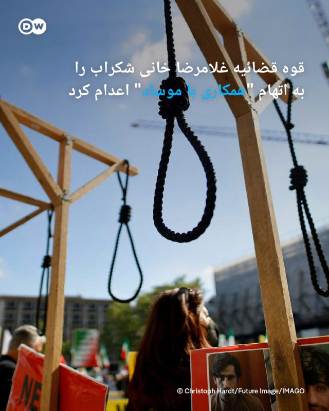

🔶 قوه قضائیه غلامرضا خانی شکراب را به اتهام "همکاری با موساد" اعدام کرد

خبرگزاری میزان از اعدام یک زندانی به نام غلامرضا خانی شکراب به اتهام "همکاری با موساد" در صبح سه‌شنبه، پنجم خرداد (۲۶ مه) خبر داد. در گزارش میزان از این فرد به عنوان "یکی از سرشبکه‌های موساد در خارج از کشور" نام برده و ادعا شده است که او "به دنبال جذب افراد و بکارگیری آن‌ها در داخل کشور برای اجرای اقدامات ضد امنیتی" بوده است.

خبرگزاری قوه قضائیه با استناد به "اعترافات" متهم مدعی شده است که غلامرضا خانی همچنین از طرف موساد برای "ترور یک خاخام یهودی در یک کشور منطقه" مأموریت داشته و پس از "جمع‌آوری اطلاعات" و "ارسال" آنها برای افسر موساد، "با ورود سرویس امنیتی کشور مقصد ناکام مانده و بازداشت شده، اما با نفوذ موساد پس از مدتی آزاد شده است".

در این گزارش گفته شده است که غلامرضا خانی "طی یک عملیات پیچیده و با استفاده از حربه فریب اطلاعاتی" به داخل کشور کشانده شده و توسط "سربازان گمنام امام زمان" بازداشت شده است. به نوشته میزان، حکم اعدام در دیوان عالی کشور تأیید شده بود.

قوه قضائیه جزئیاتی درباره زمان و مکان بازداشت، روند محاکمه، دسترسی به وکیل و شرایط بازجویی و نحوه اخذ اعترافات غلامرضا خانی شکراب منتشر نکرده است.

@dw_farsi

## DW_Farsi — post 125157

🔶 بخشودگی ۱۳۴ هزار دلاری بدهی؛ وعده پوتین برای جذب نیروی جنگ

کرملین چهار سال است نیروهایش را به جنگ علیه اوکراین می‌فرستد؛ جنگی که تلفات سنگینی برای ارتش این کشور به همراه داشته است.

اکنون ولادیمیر پوتین، رئیس جمهور روسیه، برای جبران کمبود نیرو، فرمانی را برای بخشودگی بدهی سربازان جدید و خانواده‌های آنان امضا کرده است.

کرملین شامگاه دوشنبه ۲۵ مه (۴ خرداد) اعلام کرد افرادی که از اول ماه جاری میلادی، مه، قراردادی را با وزارت دفاع روسیه امضا کرده باشند، به همراه همسرانشان از بدهی‌های خود تا سقف ۱۰ میلیون روبل (حدود ۱۳۴ هزار دلار) معاف خواهند شد.

پیش‌شرط این طرح آن است که پیش از این تاریخ، ادعای قانونی برای وصول بدهی‌ها وجود داشته و قرارداد خدمت نیز دست‌کم برای یک سال امضا شده باشد.

@dw_farsi

## DW_Farsi — post 125156

🔶 بازگشت دومین گروه از زنان استرالیایی مرتبط با داعش به کشور

مقام‌های استرالیا امروز سه‌شنبه ۲۶ مه (۵ خرداد) به وقت محلی، اعلام کردند که بازگشت گروهی به این کشور، شامل هفت زن استرالیایی و ۱۲ کودک که با گروه تروریستی "دولت اسلامی" (داعش) مرتبط بوده‌اند، برنامه‌ریزی شده است. این دومین گروه استرالیایی خواهد بود که در ماه جاری یک اردوگاه پناهجویان در سوریه را ترک می‌کند.

تونی برک، وزیر کشور استرالیا، گفت که دولت در روند سفر آنها کمکی ارائه نمی‌کند و هر فردی که مرتکب جرمی شده باشد «می‌تواند انتظار داشته باشد که با تمام قدرت قانون روبه‌رو شود.»

برک در بیانیه‌ای گفت: «اینها افرادی هستند که تصمیم هولناک پیوستن به یک سازمان تروریستی خطرناک را گرفتند و کودکان خود را در وضعیتی غیرقابل توصیف قرار دادند.»

برک نگفته است که این گروه دوم چه زمانی وارد استرالیا خواهد شد. دفتر او نیز تاکنون به درخواست رویترز برای ارائه جزئیات بیشتر پاسخی نداده است.

بنگاه خبررسانی استرالیا گزارش داد که این افراد پنج‌شنبه گذشته اردوگاهی در شمال شرق سوریه را ترک کرده‌اند و ممکن است طی روزهای آینده وارد این کشور شوند.

@dw_farsi

## DW_Farsi — post 125155

  

🔶 مجتبی خامنه‌ای: آمریکا دیگر نقطه امنی برای استقرار پایگاه در منطقه نخواهد داشت

همزمان با آغاز برگزاری مراسم حج رسانه‌های ایران صبح سه‌شنبه، پنجم خرداد، پیامی منتسب به مجتبی خامنه‌ای را منتشر کردند که در آن تهدید کرده است "آمریکا دیگر نقطه امنی برای استقرار پایگاه نظامی در منطقه نخواهد داشت".

رهبر جمهوری اسلامی بدون نام بردن از کشورها یا پایگاه‌های نظامی آمریکا مستقر در خاورمیانه گفته است که "ملت‌ها و سرزمین‌های منطقه، دیگر سپر پایگاه‌های آمریکایی نخواهند بود".

مجتبی خامنه‌ای همچنین با اشاره به اظهارات ده سال پیش پدرش، علی خامنه‌ای، در مورد نابودی اسرائیل هشدار داده است که اسرائیل "به مراحل پایانی عمر خود" نزدیک شده است و "۲۵ سال بعد از آن را نخواهد دید".

رهبر پیشین جمهوری اسلامی سال ۱۳۹۴ در یک سخنرانی مدعی شده بود که اسرائیل "تا ۲۵ سال دیگر در منطقه وجود نخواهد داشت". وبسایت علی خامنه‌ای این جمله را "مهمترین جمله رهبر" در آن سال انتخاب کرد و در پی آن، این شعار از آن پس در تبلیغات حکومتی متعدد به کار گرفته شد و یک تابلوی روزشمار با مضمون "نابودی اسرائیل" نیز در تهران نصب شد.

مجتبی خامنه‌ای پس از کشته شدن پدر، همسر و برخی دیگر از اعضای خانواده‌اش در حملات نهم اسفند آمریکا و اسرائیل به بیت رهبری، در انظار عموم دیده نشده است و تا کنون هیچ پیام صوتی یا تصویری نیز از منتشر نشده است.

غلامعلی حداد عادل، پدر همسر مجتبی خامنه‌ای، اواخر اردیبهشت در یک برنامه تلویزیونی در شبکه خبر، در پاسخ به مجری برنامه که از او خواسته بود تا به مجتبی خامنه‌ای سلام برساند، در واکنشی غیرمنظره گفته بود: «من هم از همین طریق صدا و سیما سلام شما را به ایشان منتقل می‌کنم و امیدوارم برنامه ما را ببینند.»

@dw_farsi

## DW_Farsi — post 125154

  

📸 عکس روز: پناه بردن از خورشید به "دختر خدای خورشید"

رود تاوی منبع اصلی تأمین آب آشامیدنی، مصارف خانگی و کشاورزی برای کل شهر جاموی هند است. تاوی در میان اهالی، رودخانه‌ای است مقدس و بر آن "دختر خدای خورشید" (سوریا پوتری) نام نهاده‌اند. تابش خورشید حالا اما در جامو به حدی است که زنی را واداشته برای خنک شدن به آب تاوی پناه ببرد.

@dw_farsi

## DW_Farsi — post 125152

  

🔶 افزایش قیمت نفت همزمان با حملات جدید آمریکا و تردیدها نسبت به توافق

در پی حملات هوایی جدید آمریکا به جنوب ایران و کاهش خوش‌بینی‌ها نسبت به دستیابی به یک توافق میان ایران و آمریکا، قیمت نفت صبح سه‌شنبه بار دیگر افزایش یافت و بازار سهام نیز دستخوش نوسان شد.

به گزارش رویترز قیمت قراردادهای آتی نفت برنت در معاملات اولیه آسیا بیش از ۱ درصد افزایش پیدا کرد و به ۹۷.۳۲ دلار در هر بشکه رسید. نفت خام وست تگزاس اینترمدیت آمریکا (WTI) نیز نسبت به آخرین قیمت معامله‌شده در روز دوشنبه اندکی افزایش داشت، اما همچنان ۵.۵ درصد پایین‌تر از قیمت پایانی روز جمعه بود.

بانک مرکزی سریلانکا برای مهار تورم و کاهش فشار شدید بر ارز، نرخ بهره پایه را به ۱۰۰ واحد افزایش داد.

معاون رئیس بانک مرکزی ژاپن نیز اعلام کرد که تحولات خاورمیانه در برنامه‌ریزی این بانک برای افزایش نرخ بهره تأثیرگذار خواهد بود.

این احتمال مطرح می‌شود که بانک مرکزی آمریکا تا ماه دسامبر نرخ بهره پایه را ۲۵ واحد افزایش دهد و بانک مرکزی اروپا و بانک انگلستان نیز سیاست‌های پولی خود را انقباضی‌تر کنند.

@dw_farsi

## Persian_Trend_Official — post 15085

کانال رسمی پرشین ترند pinned «https://youtube.com/live/TrPiEz5YpyQ?feature=share»

## Persian_Trend_Official — post 15084

https://youtube.com/live/TrPiEz5YpyQ?feature=share

## Persian_Trend_Official — post 15083

⭕️لایو یوتیوب امشب ساعت ۲۲ برگزار میشود

🫆:Tony

📌 @persian_trend_official
پرشین ترند | متفاوت‌ترین کانال نظامی

## Persian_Trend_Official — post 15082

  <a href="telegram/content/Persian_Trend_Official_15082_1779824381.mp4" target="_blank">🎬 Download video</a>

تصاویری از لاشۀ پهپادی که دیروز با آتش سامانه جديد آرش‌های کمان‌گیر سپاه ساقط شد.

👩‍💻@PhantomDirective

🆔@persian_trend_official
پرشین ترند | متفاوت‌ترین کانال نظامی

## Persian_Trend_Official — post 15081

  

🔴 آمریکا و ارمنستان توافق شراکت راهبردی امضا کردند

▪️ آمریکا و ارمنستان در ایروان توافق شراکت راهبردی امضا کردند.

▪️ مارکو روبیو و آرارات میرزویان توافق‌هایی درباره مواد معدنی راهبردی و کریدور ترانزیتی ۴۳ کیلومتری میان نخجوان و ترکیه امضا کردند.

▪️ این توافق‌ها پیش از انتخابات پارلمانی ارمنستان و پس از تهدیدهای روسیه درباره افزایش قیمت گاز برای ایروان انجام شده است.

▪️ کریدور مورد بحث می‌تواند بخشی از مسیر ارتباطی میان آذربایجان و ترکیه باشد و اهمیت ژئوپلیتیکی بالایی در قفقاز دارد.

🫆:Tony

📌 @persian_trend_official
پرشین ترند | متفاوت‌ترین کانال نظامی

## Persian_Trend_Official — post 15080

⭕️بازگشت هیئت مذاکره کننده کشور از قطر

🔹رئیس مجلس و رئیس هئئت مذاکره کننده کشور که دیروز در راس هیئتی برای رایزنی با مقامات قطری به این کشور سفر کرده بود ساعتی پیش به کشور بازگشتند.
🫆:Tony

📌 @persian_trend_official
پرشین ترند | متفاوت‌ترین کانال نظامی

## Persian_Trend_Official — post 15079

لطفا از عبارت "اینترنت داره به حالت عادی برمیگرده" استفاده نکنید.

ما هیچوقت اینترنت عادی نداشتیم.

در بهترین حالت یه فیلترنت بوده با هزاران محدودیت و مشکل.

📝 Nick

📌 @persian_trend_official
پرشین ترند | متفاوت‌ترین کانال نظامی

## Persian_Trend_Official — post 15078

  <a href="telegram/content/Persian_Trend_Official_15078_1779824385.webm" target="_blank">🎬 Download video</a>

⭕️رخ‌دادن زلزله ۳ و یک دهم ریشتری در خراسان رضوی؛ ۱۶ کیلومتری مشهد

🫆:Tony

📌 @persian_trend_official
پرشین ترند | متفاوت‌ترین کانال نظامی

## Persian_Trend_Official — post 15077

  <a href="telegram/content/Persian_Trend_Official_15077_1779824385.webm" target="_blank">🎬 Download video</a>

💢 نت‌بلاکس تأیید کرد که اینترنت ایران به حدود ۳۴٪ اتصال بازگشته است.

▪️این در روز ۸۸ پس از ۲۰۹۳ ساعت انزوای تقریباً کامل جهانی رخ داده و طولانی‌ترین قطعی سراسری اینترنت در تاریخ مدرن به شمار می‌رود.

🫆:Tony

📌 @persian_trend_official
پرشین ترند | متفاوت‌ترین کانال نظامی

## Persian_Trend_Official — post 15075

  <a href="telegram/content/Persian_Trend_Official_15075_1779824386.webm" target="_blank">🎬 Download video</a>

🔴سازمان UKMTO هشدار صادر کرده است . طبق این هشدار، یک انفجار خارجی روی یک نفتکش در فاصله ۶۰ مایل دریایی شرق مسقط (عمان) در ساعت ۰۹:۴۵ UTC روز ۲۶ مه ۲۰۲۶ رخ داده است.

💢کاپیتان کشتی تأیید کرده که خدمه و خود کشتی در وضعیت امن هستند، هرچند مقداری سوخت کشتی پس از انفجار در قسمت عقب سمت چپ کشتی به دریا ریخته شده است.

💢مقامات در حال تحقیق درباره این حادثه هستند. به همه شناورها در منطقه توصیه می‌شود با احتیاط عبور کنند و هرگونه فعالیت مشکوک را مستقیماً به UKMTO گزارش دهند.

🫆:Tony

📌 @persian_trend_official
پرشین ترند | متفاوت‌ترین کانال نظامی

## Persian_Trend_Official — post 15074

▪️گزارش هایی وجود دارد که

🔴اینترنت بین الملل روی مخابرات باز شد

🫆:Tony

📌 @persian_trend_official
پرشین ترند | متفاوت‌ترین کانال نظامی

## Persian_Trend_Official — post 15073

  <a href="telegram/content/Persian_Trend_Official_15073_1779824387.webm" target="_blank">🎬 Download video</a>

مراحل بازگشایی اینترنت، حسب دستور رئیس جمهور در حال انجام است /بازگشایی ثابت شروع شد

🔹در پی دستور رییس جمهور به وزیر ارتباطات برای بازگشایی اینترنت بین الملل، پیگیری‌های سیتنا تا ساعت ۱۵ امروز سه شنبه (۵ خردادماه) حاکی از ادامه روند بازگشایی است و توقفی در اجرای حکم رئیس جمهور صورت نگرفته است، در همین حال بازگشایی اینترنت بین‌الملل در حوزه ثابت شده است. /سیتنا

🫆:Tony

📌 @persian_trend_official
پرشین ترند | متفاوت‌ترین کانال نظامی

## Persian_Trend_Official — post 15072

  

ایسنا
💢اتصال اینترنت بین الملل در حال پیگیری است

طبق اعلام یک منبع مطلع به ایسنا:
🔹با صدور دستور اتصال اینترنت از وزیر ارتباطات و فناوری اطلاعات پروسه اتصال در حال انجام است و طی 24 ساعت آینده این امکان برای همه فراهم خواهد شد.

🫆:Tony

📌 @persian_trend_official
پرشین ترند | متفاوت‌ترین کانال نظامی

## Persian_Trend_Official — post 15071

  

کامیار ثقفی، رضا تقی پور، رسول جلیلی محمد حسن انتظاری. ▪️شاکیان اتصال اینترنت بین المللی لینک خبر لینک خبر 🫆:Tony 📌 @persian_trend_official پرشین ترند | متفاوت‌ترین کانال نظامی

## Persian_Trend_Official — post 15070

  

🔻رضا تقی پور ♦️وی موتورهای جستجوی خارجی را ابزارهای جاسوسی بیگانگان می‌داند و به دلیل اومانیستی و لیبرالیستی بودن مبنای اینترنت فعلی معتقد است: ▪️این اینترنت برای جوامع، خطرناک است و نیاز به باز تعریف دارد… در نوامبر سال ۲۰۱۲ خبرگزاری‌ها از اضافه شدن نام…

## Persian_Trend_Official — post 15069

  

مدیر صنایع امنیت مخابرات – گروه صنایع مخابرات, سراسری (از ۱۳۶۹ تا ۱۳۷۵) مدیرعامل صنایع الکترونیک شیراز, استان فارس (از ۱۳۷۵ تا ۱۳۸۱) مدیر عامل صنایع مخابرات, سراسری (از ۱۳۸۱ تا ۱۳۸۶) معاون وزیر و رئیس سازمان فضایی کشور, سراسری (از ۱۳۸۶ تا مرداد ۱۳۸۸) وزیر…

## Persian_Trend_Official — post 15068

  

مدیر صنایع امنیت مخابرات – گروه صنایع مخابرات, سراسری (از ۱۳۶۹ تا ۱۳۷۵)
مدیرعامل صنایع الکترونیک شیراز, استان فارس (از ۱۳۷۵ تا ۱۳۸۱)
مدیر عامل صنایع مخابرات, سراسری (از ۱۳۸۱ تا ۱۳۸۶)
معاون وزیر و رئیس سازمان فضایی کشور, سراسری (از ۱۳۸۶ تا مرداد ۱۳۸۸)
وزیر ارتباطات و فناوری اطلاعات, سراسری (از مرداد ۱۳۸۸ تا آذر ۱۳۹۱)
موارد نقض حقوق بشر: مشارکت در سرکوب اعتراضات از طریق سانسور، شنود و اختلال در سیستم های ارتباطی (از مرداد ۱۳۸۸ تا آذر ۱۳۹۱) بیشتر بخوانید
عضو شورای عالی فضای مجازی, سراسری (از بهمن ۱۳۹۱‍ تاکنون)
موارد نقض حقوق بشر: مشارکت در کنترل، سانسور، فیلترینگ و تعقیب کاربران فضای مجازی (از بهمن ۱۳۹۱‍ تاکنون) بیشتر بخوانید
عضو شورای شهر تهران, استان تهران (از خرداد ۱۳۹۲ تا کنون)

## Persian_Trend_Official — post 15067

  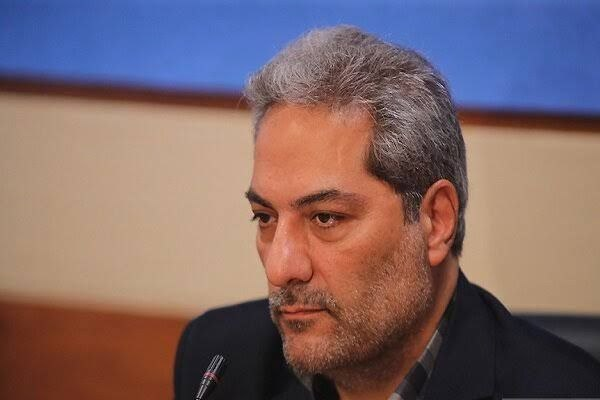

کامیار ثقفی، رضا تقی پور، رسول جلیلی محمد حسن انتظاری. ▪️شاکیان اتصال اینترنت بین المللی لینک خبر لینک خبر 🫆:Tony 📌 @persian_trend_official پرشین ترند | متفاوت‌ترین کانال نظامی

## Persian_Trend_Official — post 15066

  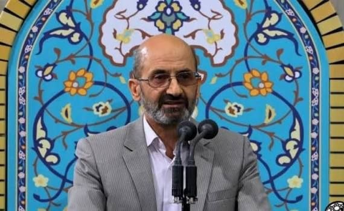

کامیار ثقفی، رضا تقی پور، رسول جلیلی محمد حسن انتظاری. ▪️شاکیان اتصال اینترنت بین المللی لینک خبر لینک خبر 🫆:Tony 📌 @persian_trend_official پرشین ترند | متفاوت‌ترین کانال نظامی

## Persian_Trend_Official — post 15065

  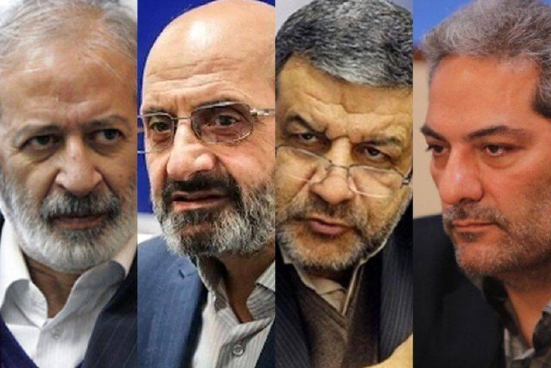

♦️ این ۴ نفر، شاکی قضایی «اتصال اینترنت بین‌الملل» هستند / این افراد تحت راهبری یک مقام ابقا شده‌ دولت مرحوم رئیسی دست به شکایت زده‌اند ♦️خبرنگار «انتخاب» دقایقی پیش کسب اطلاع کرد که ۴ نفر شاکی حقیقیِ «توقف اتصال اینترنت بین‌الملل» هستند. این ۴ نفر که گرایش…

## RadioFarda — post 157587

چگونه جنگ ایران پویایی را به «کواد» بازگرداند

🔸وزیران خارجه «کواد» روز پنجم خرداد برای اولین بار در سال جاری میلادی نشست این گروه را برگزار کردند. در جریان این نشست که در دهلی نو و همزمان با سفر مارکو روبیو، وزیر خارجه آمریکا، به هند برگزار شد، ابتکاراتی در زمینه تامین امنیت دریایی و همچنین دسترسی به مواد معدنی حیاتی مورد بررسی و توافق قرار گرفت.

🔸پس از برگزاری نشست، سوبرامانیام جایشانکار، وزیر خارجه هند در یک نشست خبری اعلام کرد که آن‌ها درباره «تجارت دریایی ایمن و بدون مانع» و همچنین «رعایت دقیق حقوق بین‌الملل» گفت‌وگو کردند.

🔸او مستقیماً به جنگ ایران و بسته شدن تنگهٔ هرمز اشاره نکرد اما گفت: «چهار کشور ما دارای اقتصادهای بازار هستند و به همین دلیل ما قویاً معتقدیم که باید تاب‌آوری اقتصادی تقویت و زنجیره‌های تأمین مستحکم، قابل اعتماد و ایمن شوند».

🔸در حالی که در دومین دورهٔ ریاست‌جمهوری دونالد ترامپ، همکاری‌های چهار کشور آمریکا، استرالیا، ژاپن و هند در چارچوب یک ائتلاف چهارگانه موسوم به «گفت‌وگوی امنیتی چهارجانبه» کمرنگ شده بود، تحولات چند ماه گذشته به ویژه جنگ ایران و بسته شدن تنگهٔ هرمز، اهمیت این ائتلاف را برجسته کرده است.

🔸«گفت‌وگوی امنیتی چهارجانبه» (Quadrilateral Security Dialogue) که اعضا آن را به طور خلاصه «کواد» می‌خوانند، در سال ۲۰۰۷ و به ابتکار شینزو آبه، نخست‌وزیر وقت ژاپن تاسیس شد.

🔸کارشناسان، این گروه را بیشتر یک سازوکار دیپلماتیک در پاسخ به افزایش قدرت اقتصادی و سیاسی چین می‌دانند، اما اکنون که جهان با تهدیدهای متنوع به ویژه در حوزه امنیت دریایی مواجه است، اعضای این گروه در تلاشند که این گفت‌وگوها به اقدام عملی مشخص منجر شود.

🔸هر چهار کشور، دارای دموکراسی، بازار آزاد و دسترسی به اقیانوس‌ها هستند.

🔸گزارش کامل را در وب‌سایت رادیوفردا بخوانید.

@RadioFarda

## RadioFarda — post 157586

  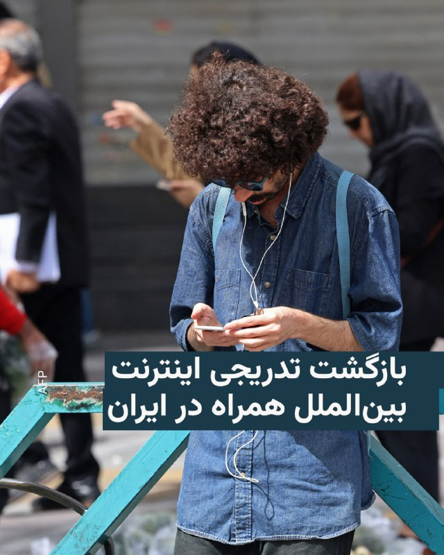

🔸گزارش‌ها از ایران حاکی است که پس از برقراری اینترنت بین‌الملل روی برخی سرویس‌های ثابت، دسترسی کاربران تلفن همراه نیز به اینترنت جهانی به‌تدریج در حال بازگشت است.

🔸منابع خبری داخلی روز سه‌شنبه گزارش دادند که کاربران از برقراری اینترنت بین‌الملل روی تلفن‌های همراه خود خبر داده‌اند. همزمان گزارش‌هایی نیز از دسترسی دوباره به چت‌جی‌پی‌تی روی خطوط همراه اول و ایرانسل منتشر شده است.

🔸پیشتر وزارت ارتباطات اعلام کرده بود که «هماهنگی‌ها برای بازگشایی اینترنت همراه» در حال انجام است. معاون وزیر ارتباطات نیز روز سه‌شنبه گفته بود اینترنت همراه «امروز» وصل خواهد شد.

🔸ایسنا هم گزارش داده است که کاربران سرویس‌های پهن‌باند ثابت، از جمله اف‌تی‌تی‌اچ، وی‌دی‌اس‌ال و ای‌دی‌اس‌ال، اکنون بدون محدودیت به شبکه جهانی اینترنت متصل هستند و «امکان استفاده کامل از وب‌سایت‌ها و خدمات بین‌المللی برای آن‌ها فراهم شده است.» همچنین گزارش شده «اتصال کامل» اینترنت بین‌الملل در مخابرات ایران برقرار شده است.

@RadioFarda

## RadioFarda — post 157585

نتانیاهو: ارتش اسرائیل با «نیروهای گسترده زمینی» در جنوب لبنان عملیات می‌کند

🔸بنیامین نتانیاهو، نخست‌وزیر اسرائیل، روز سه‌شنبه ۵ خرداد گفت ارتش این کشور با «نیروهای گسترده بر روی زمین» در جنوب لبنان در حال عملیات است و «مناطق راهبردی» را در کنترل خود می‌گیرد.

🔸این اظهارات، بر اساس بیانیه‌ای رسمی، در آغاز نشست کابینه امنیتی اسرائیل بیان شد.

🔸سخنان نتانیاهو پس از آن مطرح می‌شود که ارتش اسرائیل عملیات زمینی خود در جنوب لبنان را به فراتر از خط مرزی‌ای گسترش داد که اسرائیل پس از آتش‌بس ۱۶ آوریل با حزب‌الله، چند کیلومتر در داخل خاک لبنان تعیین کرده بود.

🔸بنابر گزارش‌ها، روز سه‌شنبه، پس از هشدار اسرائیل برای تخلیه، چندین حمله شهر نَبَطیه در جنوب لبنان را هدف قرار داد.

🔸همزمان یک مقام نظامی اسرائیل تأیید کرد که عملیات زمینی این کشور به نقاط عمیق‌تری در خاک لبنان گسترش یافته است.

🔸این حملات پس از آن انجام شد که بنیامین نتانیاهو، نخست‌وزیر اسرائیل، روز دوشنبه به ارتش خود دستور داد حملات علیه حزب‌الله را برای «درهم کوبیدن» این گروه مورد حمایت ایران تشدید کند. همان روز در حمله‌ای در شرق لبنان دست‌کم ۱۱ نفر کشته شدند.

🔸به نوشتۀ خبرگزاری فرانسه، در نبطیه پس از هشدار تخلیه، حملات هوایی آغاز شد و ستون‌های دود از چند نقطه در داخل شهر برخاست.

🔸گزارش کامل را در وب‌سایت رادیوفردا بخوانید.

@RadioFarda

## RadioFarda — post 157584

  <a href="https://t.me/radiofarda/157584" target="_blank">📎 Download file</a>

📻بشنوید: ایستگاه ۱۹ با رادیوفردا، پنجم خرداد ۱۴۰۵

@RadioFarda

## RadioFarda — post 157583

  <a href="https://t.me/radiofarda/157583" target="_blank">📎 Download file</a>

روشن شدن آرامِ چراغ اینترنت؛ نشانه انسجام یا انشقاق؟ گفت‌وگو با علی افشاری

🔸ساعات اولیه بعدازظهر روز پنجم خرداد کشمکش رسانه‌ای بر سر اینترنت و وصل شدنِ مجدد آن به اوج رسید. دولت در ایران می‌گفت تا ۲۴ساعت دیگر اینترنت باز می‌شود؛ اما از آن سو دیوان عدالت اداری رای داد که «ستاد ویژه ساماندهی و راهبری فضای مجازی» که رای به اتصال مجدد اینترنت داده بود «ساختاری غیرقانونی» داشته و از این رو اجرای تصمیماتش باید متوقف شود. زورآزمایی دقیقه آخر اما به نظر می‌آید فعلا به نفع دولت پیش رفته و اتصال به اینترنت آغاز شده اما سرنوشت این اتصال مشخص نیست. ارزیابی علی افشاری تحلیلگر سیاسی ساکن واشینگتن دی‌سی را درباره نزاع بر سر موضوع اینترنت در ساختار قدرت ایران بشنوید.

@RadioFarda

## RadioFarda — post 157582

🔸دونالد ترامپ، رئیس‌جمهور آمریکا، قرار است روز چهارشنبه نشستی کم‌سابقه با اعضای کابینه خود در اقامتگاه ریاست‌جمهوری کمپ دیوید برگزار کند؛ نشستی که به گفته یک مقام کاخ سفید، همزمان با نزدیک شدن مذاکرات مربوط به ایران به مرحله‌ای حساس برگزار می‌شود. 🔸خبرگزاری…

## RadioFarda — post 157581

🔸دونالد ترامپ، رئیس‌جمهور آمریکا، قرار است روز چهارشنبه نشستی کم‌سابقه با اعضای کابینه خود در اقامتگاه ریاست‌جمهوری کمپ دیوید برگزار کند؛ نشستی که به گفته یک مقام کاخ سفید، همزمان با نزدیک شدن مذاکرات مربوط به ایران به مرحله‌ای حساس برگزار می‌شود.

🔸خبرگزاری فرانسه با انتشار این خبر نوشت که انتخاب کمپ دیوید، اقامتگاهی دورافتاده در کوهستان‌های مریلند که ترامپ برخلاف بسیاری از رؤسای‌جمهور پیشین کمتر به آن رفت‌وآمد داشته، نشان‌دهنده حساسیت گفت‌وگوهای پیش رو ارزیابی شده است.

🔸روزنامه نیویورک‌پست گزارش داده که موضوع ایران محور اصلی این نشست خواهد بود و همه اعضای کابینه در آن حضور خواهند داشت. بر اساس این گزارش، مسائل اقتصادی نیز در دستور کار قرار دارد.

🔸دونالد ترامپ روز شنبه گفته بود توافق با تهران برای پایان دادن به جنگ خاورمیانه نزدیک است، اما همزمان هشدار داد که در صورت شکست مذاکرات، حملات آمریکا به ایران می‌تواند از سر گرفته شود.

@RadioFarda

## RadioFarda — post 157580

  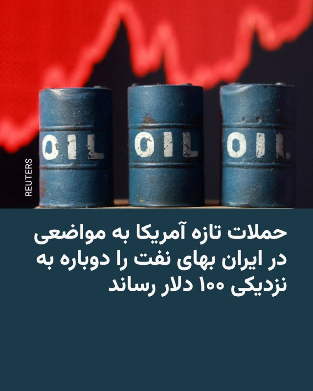

🔸بهای نفت روز سه‌شنبه پس از حملات تازه آمریکا به مواضعی در ایران دوباره افزایش یافت و امیدها به اعلام قریب‌الوقوع توافق برای بازگشایی تنگه هرمز کمرنگ شد.

🔸به نوشته خبرگزار ی فرانسه، در این روز، نفت برنت دریای شمال، شاخص جهانی نفت، بیش از سه درصد بالا رفت و بار دیگر به نزدیکی ۱۰۰ دلار در هر بشکه رسید.

🔸یک روز پیش از آن، انتشار گزارش‌هایی درباره احتمال توافق ایران و آمریکا برای پایان دادن به جنگ و بازگشایی تنگه هرمز، باعث افت بهای نفت به زیر ۱۰۰ دلار و رشد بازارهای سهام شده بود.

🔸ارتش آمریکا اعلام کرده است که به پایگاه‌های موشکی در جنوب ایران و قایق‌هایی که در حال مین‌گذاری بودند حمله کرده است. واشینگتن این حملات را «دفاعی» خوانده، اما ایران آن را نقض آتش‌بس دانسته است.

🔸در بازارهای سهام، وال‌استریت روز سه‌شنبه با رشد محدود آغاز به کار کرد، اما بازارهای اروپایی وضعیتی متفاوت داشتند و شاخص‌های فرانکفورت و پاریس کاهش یافتند. همزمان ارزش دلار تقویت شد.

@RadioFarda

## RadioFarda — post 157579

  

🔸روز سه‌شنبه ۵ خرداد، درپی وصل شدن محدود اینترنت جهانی در ایران، محمدرضا عارف، معاون اول رئیس جمهور، در پیامی گفت که این اقدام «پیرو مأموریت رئیس جمهور»‌ و به عنوان «گام نخست» در این راستا برداشته شده است.

🔸آقای عارف در پیام خود از این اقدام به‌عنوان گامی برای «دسترسی آزاد» به اینترنت جهانی یاد کرده، اما در ادامه، هدف آن را «دسترسی ضابطه‌مند به فضای مجازی» توصیف کرده است.

🔸او در مورد میزان این «ضابطه‌مندی» توضیحی نداده است.

🔸اینترنت در ایران، با وجودی که از قبل با سانسور و اعمال فیلترینگ گسترده روبه‌رو بود، از نهم اسفند پارسال همزمان با شروع جنگ آمریکا و اسرائیل با ایران و به بهانهٔ آن به‌طور کامل قطع شد.

@RadioFarda

## RadioFarda — post 157578

  <a href="https://t.me/radiofarda/157578" target="_blank">📎 Download file</a>

آیا ترامپ از موضع خود در قبال «غبار هسته‌ای» عقب‌نشینی کرد؟ گفت‌وگو با مهران مصطفوی

🔸دونالد ترامپ، رئیس‌جمهور آمریکا، می‌گوید اورانيوم غنی‌شده ایران یا آن‌طور که آن را «غبار هسته‌ای» می‌خواند يا فوری به ايالات متحده تحويل داده خواهد شد تا به آمريکا منتقل و نابود شود، يا ترجيحاً با همکاری و هماهنگی جمهوری اسلامی ايران، در همان محل يا در مکانی ديگر که مورد توافق باشد، نابود خواهد شد». این رویکرد آقای ترامپ و تاکید او به نقش یک نهاد بین‌المللی مانند آژانس بین‌المللی انرژی اتمی از سوی برخی از ناظران به عنوان یک عقب‌نشینی از سوی او ارزیابی شده است. این ناظران به رویکردهایی که پیشتر از سوی رئیس‌جمهور ایالات متحده ابراز شده بود اشاره می‌کنند که گفته بود ذخیره اورانیوم تنها باید به آمریکا تحویل داده شود. درباره این رویکرد تازه دونالد ترامپ ارزیابی مهران مصطفوی استاد فیزیک و شیمی در دانشگاه پاریس را بشنوید.

@RadioFarda

## RadioFarda — post 157577

  <a href="https://t.me/radiofarda/157577" target="_blank">📎 Download file</a>

مردم ایران چگونه می‌توانند آینده را به دست بگیرند؟ گفت‌وگو با نازیلا گلستان

🔸یکی از سناریوهای پیش رو در مسیر تهران و واشینگتن دستیابی به یک توافق یا تفاهم است؛ تفاهمی که مسیر مذاکره بیشتر میان ایران و آمریکا را باز کند و شاید به قراردادی جامع‌تر منجر شود. بعد از ۸۸ روز که از آغاز جنگ می‌گذرد، بسیاری می‌پرسند، مردم در کجای این روند پرنوسان دیپلماتیک قرار دارند، و وضعیت آزادی‌های سیاسی چه می‌شود؟ سرنوشت جمهوری اسلامی در مقابل جامعه مدنی به کجا خواهد انجامید؟ ارزیابی نازیلا گلستان، فعال سیاسی ساکن فرانسه را در این‌باره بشنوید.

@RadioFarda

## RadioFarda — post 157576

  

🔸خبرگزاری تسنیم، روز سه‌شنبه، به نقل از منابع خود مدعی شد که طبق متن ۱۴ ماده‌ای یادداشت تفاهم بین ایران و آمریکا، منابع بلوکه‌شده ایران، به میزان ۲۴ میلیارد دلار باید در طول مذاکرات آزاد شود.

🔸آنطور که این رسانه نزدیک به سپاه پاسداران از قول « یک منبع آگاه نزدیک به تیم مذاکره‌کننده» گزارش داده، ایران تأکید دارد که نصف این مبلغ باید با شروع مذاکرات، در دسترس قرار گیرد، و بقیه در طول ۶۰ روز منتقل شود.

🔸این گزارش می‌گوید که سفر اخیر عباس عراقچی و محمدباقر قالیباف به قطر هم برای تفاهم دربارهٔ اجرایی‌سازی این مطالبه، و نحوه دسترسی به ۱۲ میلیارد دلار در گام اول و رفع موانع بوده است.

🔸همزمان، احمد بخشایش اردستانی، عضو کمیسیون امنیت ملی مجلس، مدعی شد که چند روز پیش، قرار بود ۱۲ میلیارد دلار از منابع مسدودشده ایران، از طریق روسیه وارد شود، ولی آمریکایی‌ها مانع این انتقال شدند.

🔸هنوز هیچ مقام رسمی در دولت آمریکا، این ادعاها را تأیید نکرده است.

@RadioFarda

## RadioFarda — post 157575

  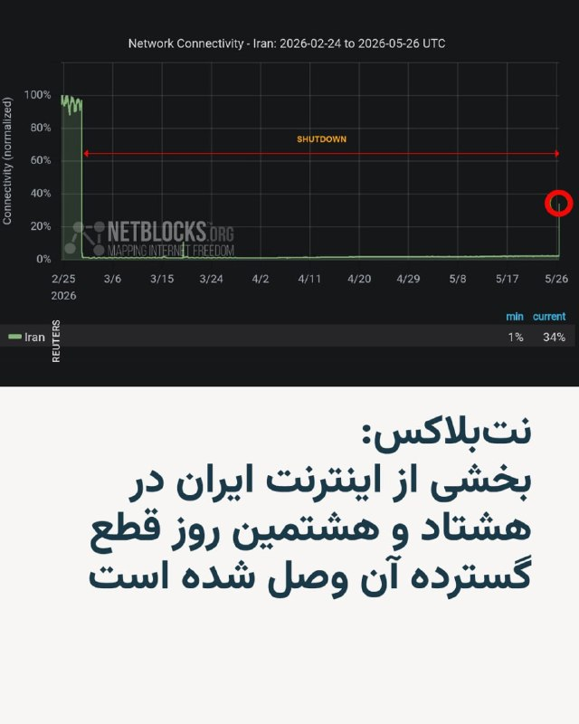

🔸نهاد پایش وضعیت اینترنت در جهان،نت‌بلاکس، اعلام کرد داده‌های زنده شبکه نشان می‌دهد بخشی از دسترسی به اینترنت در ایران در هشتاد و هشتمین روز قطع گسترده و نزدیک به «انزوای کامل» از شبکه جهانی، دوباره برقرار شده است.

🔸نت‌بلاکس در شبکه ایکس نوشت این اختلال که بیش از ۲۰۹۳ ساعت ادامه داشت، طولانی‌ترین قطع سراسری اینترنت در تاریخ مدرن است.

🔸این نهاد همچنین اعلام کرد هنوز مشخص نیست بازگشت دسترسی به اینترنت پایدار خواهد ماند یا نه.

🔸 مقام‌های دولت مسعود پزشکیان از آغاز روند اتصال کامل به اینترنت تا ۲۴ ساعت آینده خبر داده‌اند با این حال دیوان عدالت اداری اعلام کرد دستور توقف اجرای مصوبه تشکیل «ستاد ویژه ساماندهی و راهبری فضای مجازی کشور» را صادر کرده است.

🔸اینترنت در ایران، به‌رغم سانسور و اعمال فیلترینگ گسترده، از نهم اسفند پارسال همزمان با شروع جنگ آمریکا و اسرائیل با ایران و به بهانهٔ آن به‌طور کامل قطع شد.

@RadioFarda

## RadioFarda — post 157574

  

🔸سازمان عملیات تجارت دریایی بریتانیا (UKMTO) اعلام کرد یک نفتکش در ۶۰ مایل دریایی سواحل مسقط، پایتخت عمان، وقوع انفجاری در بخش چپ بدنه کشتی و نزدیک خط آب را گزارش کرده است.

🔸این سازمان روز سه‌شنبه پنجم خرداد اعلام کرد خدمه و خود نفتکش در امنیت هستند، اما بخشی از سوخت کشتی به دریا نشت کرده است.

🔸درباره علت انفجار یا جزئیات بیشتر این حادثه هنوز اطلاعاتی منتشر نشده است.

@RadioFarda

## RadioFarda — post 157573

  

🔸وزارت خارجه جمهوری اسلامی ایران حملات اخیر آمریکا «در منطقه هرمزگان» را «نقض آشکار آتش‌بس» میان دو کشور توصیف و آن را محکوم کرد.

🔸این وزارتخانه روز سه‌شنبه پنجم خرداد در بیانیه‌ای اعلام کرد که آمریکا پس از اعلام آتش‌بس در ۱۹ فروردین، «اقدامات غیرقانونی» از جمله آنچه را «راهزنی دریایی علیه کشتی‌های تجاری ایرانی» خواند، ادامه داده است.

🔸وزارت خارجه ایران همچنین حملات ۴۸ ساعت گذشته آمریکا در منطقه هرمزگان را «تجاوزکارانه» خواند و ایالات متحده را مسئول «پیامدهای» این اقدامات دانست.

🔸ستاد فرماندهی مرکزی آمریکا، سنتکام، پیش‌تر اعلام کرده بود که ارتش ایالات متحده روز دوشنبه در جنوب ایران حملاتی را علیه اهدافی «از جمله قایق‌هایی که در تلاش برای کارگذاری مین بودند و همچنین سایت‌های پرتاب موشک» انجام داده است.

🔸سنتکام این حملات را «اقدامی دفاعی» توصیف کرده و گفته بود آتش‌بس میان دو کشور همچنان ادامه دارد.

@RadioFarda

## RadioFarda — post 157572

هشدار لاوروف به روبیو: شهروندان آمریکایی را از کی‌یف خارج کنید

🔸سرگئی لاوروف، وزیر خارجهٔ روسیه، به مارکو روبیو، وزیر خارجهٔ آمریکا، هشدار داد شهروندان آمریکایی را از کی‌یف خارج کند. هم‌زمان مسکو اعلام کرد حملات «منظم و پیوسته‌ای» را علیه پایتخت اوکراین انجام خواهد داد.

🔸این هشدار یک روز پس از آن مطرح شد که روسیه منطقهٔ کی‌یف را با صدها پهپاد و یک موشک مافوق صوت جدید هدف قرار داد.

🔸وزارت خارجهٔ روسیه روز دوشنبه چهارم خرداد اعلام کرد آقای لاوروف در تماس تلفنی با مارکو روبیو توصیه کرده است کارکنان دیپلماتیک آمریکا و شهروندان آمریکایی کی‌یف را ترک کنند.

🔸مسکو افزایش تهدیدهای خود را به حملهٔ هفتهٔ گذشته به خوابگاه یک مدرسه در منطقهٔ لوهانسک اوکراین که تحت اشغال روسیه است، مرتبط دانسته است. مقام‌های محلی گفته‌اند در این حمله بیش از ۲۰ نفر در شهر استاروبیلسک کشته شدند. روسیه اوکراین را متهم کرده که عمداً یک مرکز غیرنظامی را هدف قرار داده است.

🔸ولادیمیر پوتین، رئیس‌جمهور روسیه، نیز هفتهٔ گذشته در سخنانی با لحنی تند، کی‌یف را به «تروریسم» متهم کرد.

🔸در مقابل، مقام‌های نظامی اوکراین گفته‌اند نیروهای این کشور مقر یک واحد پهپادی روسیه را هدف قرار داده‌اند و ادعای حمله به تأسیسات غیرنظامی را رد کرده‌اند.

🔸کی‌یف و چند شهر دیگر اوکراین روز چهارم خرداد هدف یکی از گسترده‌ترین حملات پهپادی و موشکی ماه‌های اخیر قرار گرفتند. در این حملات دست‌کم سه نفر کشته و ده‌ها نفر زخمی شدند.

🔸روسیه همچنین یک موشک جدید با قابلیت حمل کلاهک هسته‌ای به نام «اورشنیک» را به‌سوی شهری در جنوب کی‌یف شلیک کرد؛ اقدامی که به نظر می‌رسد پیامی هشدارآمیز برای اوکراین بوده است.

🔸گزارش کامل را در وب‌سایت رادیوفردا بخوانید.

@RadioFarda

## RadioFarda — post 157571

  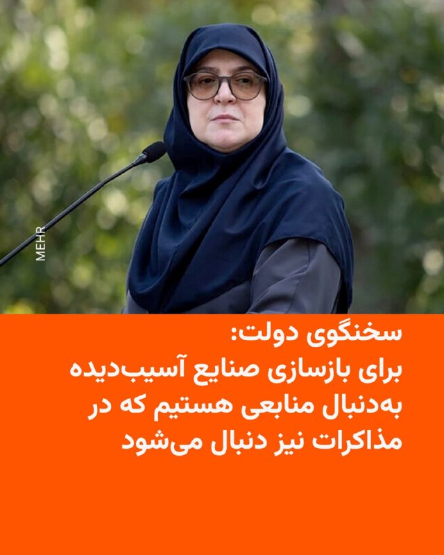

🔸سخنگوی دولت جمهوری اسلامی می‌گوید آن بخش از بازسازی مراکز خسارت‌دیده در جنگ ۴۰ روزه که فوریت دارد، با استفاده از منابع داخلی قابل انجام است اما برای سایر بخش‌ها «به دنبال منابعی هستیم که در موضوع مذاکرات نیز دنبال می‌شود».

🔸فاطمه مهاجرانی روز سه‌شنبه پنجم خرداد در پاسخ به پرسشی دربارهٔ برآورد دولت از میزان آسیب‌های واردشده به زیرساخت‌های صنعت، از اعلام اعداد و ارقام خودداری کرد و گفت ارزیابی خسارت‌های مراکز صنعتی به‌صورت تخصصی در دست بررسی است.

🔸سخنگوی دولت پزشکیان در ادامه گفت: «بخشی از بازسازی‌ها که فوریت دارد، با استفاده از منابع داخلی قابل انجام است و برای سایر بخش‌ها به دنبال منابعی هستیم که در موضوع مذاکرات نیز دنبال می‌شود.»

🔸در گزارش‌های متعدد و متفاوت تأییدنشده‌ای که در روزهای اخیر از متن تفاهم‌نامهٔ مورد بحث ایران و آمریکا منتشر شده، به موضوع دریافت غرامت اشاره‌ای نشده، همزمان اکسیوس گزارش داده که در صورت امضای تفاهم‌نامه برای پایان جنگ، در دورهٔ ۶۰ روزه‌ای که برای مذاکرات در نظر گرفته شده، آزادسازی دارایی‌های مسدودشدهٔ ایران نیز بررسی خواهد شد.

@Radiofarda

## RadioFarda — post 157570

  <a href="https://t.me/radiofarda/157570" target="_blank">📎 Download file</a>

📻بشنوید: ساعت ۱۴ با رادیوفردا، پنجم خرداد ۱۴۰۵‌

@Radiofarda

## RadioFarda — post 157569

زیردریایی‌های هسته‌ای کره جنوبی، «با موافقت آمریکا»، در داخل کشور ساخته خواهد شد

🔸کره جنوبی اعلام کرد این کشور زیردریایی‌های هسته‌ای خود را در داخل کشور خواهد ساخت و قصد دارد نخستین فروند را اواسط دههٔ ۲۰۳۰ به آب بیندازد.

🔸وزیر دفاع کره جنوبی روز سه‌شنبه پنجم خرداد در نشست راهبرد دفاعی با حضور لی جه میونگ، رئیس‌جمهور این کشور، گفت: «ما زیردریایی‌های هسته‌ای را با فناوری خودمان توسعه داده و خواهیم ساخت تا نخستین فروند آن نیمه دوم دههٔ ۲۰۳۰ وارد خدمت عملیاتی خواهد شد.»

🔸کره جنوبی مدت‌ها است در پی دستیابی به زیردریایی هسته‌ای برای مقابله با تهدیدهای فزایندهٔ نظامی کره شمالی است، اما توافق همکاری هسته‌ای کره جنوبی با آمریکا تاکنون محدودیت‌هایی برای این برنامه ایجاد کرده بود.

🔸لی جه میونگ در ماه نوامبر گفته بود سئول در چارچوب توافق امنیتی و تجاری مورد انتظار دو کشور، موافقت واشینگتن را برای ساخت زیردریایی هسته‌ای دریافت کرده است.

🔸این توافق شامل موافقت آمریکا با غنی‌سازی اورانیوم و بازفرآوری سوخت مصرف‌شده نیز می‌شود.

🔸با این حال، هنوز نشانهٔ قطعی دربارهٔ محل ساخت این زیردریایی‌ها وجود نداشت و دونالد ترامپ گفته بود آن‌ها «در همین آمریکای خوب و قدیمی» ساخته خواهند شد.

🔸کره جنوبی که دارای رآکتورهای هسته‌ای است، اعلام کرده در تمام مراحل تأمین و مدیریت اورانیوم با غنای پایین مورد نیاز این زیردریایی‌ها به تعهدات خود در زمینهٔ منع گسترش سلاح‌های هسته‌ای پایبند خواهد بود.

🔸آن گیو بکَ وزیر دفاع این کشور، گفت: «جمهوری کره موضعی قاطع دارد که هیچ نوع سلاح هسته‌ای در اختیار ندارد و آن را توسعه نیز نخواهد داد.»

🔸لی جه میونگ نیز پس از ارائهٔ گزارش وزیر دفاع گفت زیردریایی‌های هسته‌ای «نماد عزم ما برای پذیرش مسئولیت صلح و امنیت در شبه‌جزیرهٔ کره» خواهند بود.

🔸فناوری زیردریایی هسته‌ای آمریکا از حساس‌ترین و به‌شدت محافظت‌شده‌ترین اسرار نظامی این کشور به شمار می‌رود.

🔸نسخه کامل این گزارش را در وب‌سایت رادیوفردا بخوانید.

@RadioFarda

## RadioFarda — post 157568

🔸در حالی که مقام‌های دولت مسعود پزشکیان از آغاز روند اتصال کامل به اینترنت تا ۲۴ ساعت آینده خبر می‌دادند، دیوان عدالت اداری اعلام کرد دستور توقف اجرای مصوبه تشکیل «ستاد ویژه ساماندهی و راهبری فضای مجازی کشور» را صادر کرده است.

🔸این دیوان ظهر سه‌شنبه پنجم خرداد اعلام کرد «به‌دنبال طرح شکایاتی، دستور به توقف مصوبهٔ ایجاد «ستاد ویژهٔ ساماندهی و راهبری فضای مجازی کشور» داده است» و افزود: «تا زمان رسیدگی نهایی به شکایات مطروحه، مصوبات و تصمیمات این ستاد قابل ترتیب اثر نخواهد بود.»

🔸این بیانیه به جزئیات این شکایت از جمله هویت شاکیان و نیز دلیل شکایت اشاره‌ای نکرده است.

🔸مرکز رسانه قوه قضاییه نیز اعلام کرد دستورات و مصوبات ستاد ویژه «به دلیل بررسی غیرقانونی بودن ساختار ستاد، تا زمان رسیدگی قانونی قابل اجرا نیست».

🔸فاطمه مهاجرانی، سخنگوی دولت، هم در همین روز اعلام کرده بود ستاد ویژه فضای مجازی با دستور مسعود پزشکیان و به ریاست محمدرضا عارف تشکیل شده و این ستاد به جمع‌بندی رسیده که «بازگشایی اینترنت انجام شود».

@RadioFarda

## IranianMinds — post 20837

  <a href="https://t.me/IranianMinds/20837" target="_blank">📎 Download file</a>

کانفیگ فوق العاده پرسرعت و قوی مخصوص اینستا و یوتیوب سرعت فضایی مخصوص همراه اول و مخابرات بقیه اینترنت ها هم تست کنید

آموزش اتصال در اندروید

آموزش اتصال در آیفون

حتما شیر بدید بقیه هم متصل شن لطفا دانلود سنگین هم نزنید ❤️‍🔥

@IranianMinds

## IranianMinds — post 20836

خوش برگشتید عزیزان

## IranianMinds — post 20835

  <a href="https://t.me/IranianMinds/20835" target="_blank">📎 Download file</a>

سرور فوق العاده پرسرعت و قوی مخصوص اینستا و یوتیوب سرعت فضایی مخصوص همراه اول مخابرات

آموزش اتصال در اندروید

آموزش اتصال در آیفون

حتما شیر بدید بقیه هم متصل شن لطفا دانلود سنگین هم نزنید ❤️‍🔥

@IranianMinds

## IranianMinds — post 20834

عزیزان بعضی سرورارو بخاطر اینکه به شدت شلوغ میشن بعد یه مدت دیلیت میکنیم و جدید میزاریم پس همرو دانلود داشته باشید که اگه یکی قطع شد به اون یکی وصل شید

برا دوستاتونم همرو بفرستید وصل باشن

## IranianMinds — post 20832

بچه ها همرو تست کنید هر کدوم سرعتش بهتر بود استفاده کنید
شیر بدید بقیه هم وصل شن

## IranianMinds — post 20831

  <a href="https://t.me/IranianMinds/20831" target="_blank">📎 Download file</a>

سرور جدید نامحدود پرسرعت

برای وایفای و همراه اول :)

مناسب اینستا و یوتوب و تلگرام

بفرستید همه وصل بشن

آموزش اتصال در اندروید

آموزش اتصال در آیفون

@IranianMinds

## IranianMinds — post 20830

سرعت خوبه؟

## IranianMinds — post 20829

  <a href="https://t.me/IranianMinds/20829" target="_blank">📎 Download file</a>

کانفیگ فوق العاده پرسرعت و قوی مخصوص اینستا و یوتیوب سرعت فضایی مخصوص همراه اول و مخابرات بقیه اینترنت ها هم تست کنید

آموزش اتصال در اندروید

آموزش اتصال در آیفون

حتما شیر بدید بقیه هم متصل شن لطفا دانلود سنگین هم نزنید ❤️‍🔥

@IranianMinds

## IranianMinds — post 20828

  <a href="https://t.me/IranianMinds/20828" target="_blank">📎 Download file</a>

کانفیگ فوق العاده پرسرعت و قوی مخصوص اینستا و یوتیوب سرعت فضایی مخصوص همراه اول و مخابرات بقیه اینترنت ها هم تست کنید

آموزش اتصال در اندروید

آموزش اتصال در آیفون

حتما شیر بدید بقیه هم متصل شن لطفا دانلود سنگین هم نزنید ❤️‍🔥

@IranianMinds

## IranianMinds — post 20827

بچه ها نگران حجم نباشید نامحدوده شیر بدید فقط بقیه وصل شن کارشون راه بیوفته

## IranianMinds — post 20826

  <a href="https://t.me/IranianMinds/20826" target="_blank">📎 Download file</a>

کانفیگ فوق العاده پرسرعت و قوی مخصوص اینستا و یوتیوب سرعت فضایی مخصوص همراه اول و مخابرات بقیه اینترنت ها هم تست کنید

آموزش اتصال در اندروید

آموزش اتصال در آیفون

حتما شیر بدید بقیه هم متصل شن لطفا دانلود سنگین هم نزنید ❤️‍🔥

@IranianMinds

## IranianMinds — post 20825

‎⁨همراه اول عالی⁩.npvt

## IranianMinds — post 20824

  <a href="https://t.me/IranianMinds/20824" target="_blank">📎 Download file</a>

کانفیگ فوق العاده پرسرعت و قوی مخصوص اینستا و یوتیوب سرعت فضایی مخصوص همراه اول

آموزش اتصال در اندروید

آموزش اتصال در آیفون

حتما شیر بدید بقیه هم متصل شن لطفا دانلود سنگین هم نزنید ❤️‍🔥

@IranianMinds

## IranianMinds — post 20823

  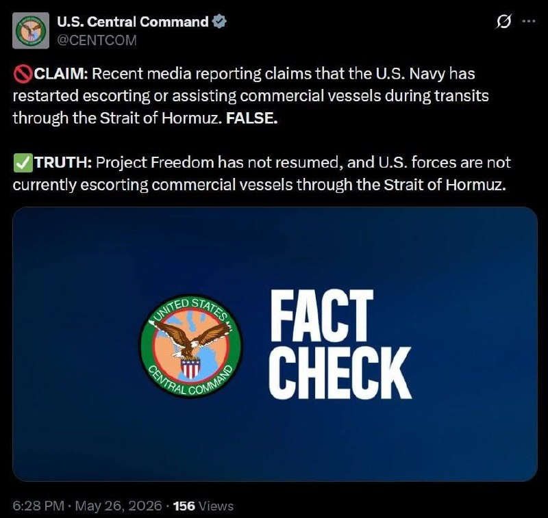

🔴پست سنتکام:

پروژه آزادی از سر گرفته نشده و نیروهای آمریکا فعلأ هیچ کشتی تجاری‌ای را از تنگه هرمز اسکورت نمی‌کنند.

@IranianMinds

## IranianMinds — post 20822

اینترنت داره برمیگرده به قبل از دی ماه

اما ما هرگز برنمیگردیم :)

@IranianMinds

## IranianMinds — post 20821

🔴 فرماندهی مرکزی ایالات متحده ادعا می کند که به عنوان بخشی از محاصره دریایی ایالات متحده علیه ایران که از 13 آوریل آغاز شد، 108 کشتی تجاری را تغییر مسیر داده و 4 فروند را از کار انداخته است.

@IranianMinds

## IranianMinds — post 20820

💯 اگر هنوز ۵۰۰ هزارتومان رو نگرفتی همین الان عضو شو‌ و جایزتو بگیر
نیازی هم به واریز نیست

👍 تنها سایت مورد #تایید ما با بونوس های واقعی

🌐 Winro.io

## IranianMinds — post 20819

  

⭕️ رایگان بدون واریز شرط های فوتبالی ببند از همون اول موجودی 500 هزارتومانه
❌

🎉 500 هزارتومن رایگان فقط با ثبت نام بدون هیچگونه واریزی!

💳 پرداخت مستقیم و سریع بدون واسطه، بدون دردسر، واریز و برداشت در سریع‌ترین زمان ممکن

⌛ پشتیبانی 24 ساعته

🌐 Winro.io

🌐 Winro.io
کانال بونوس های رایگان g5

📱 @winro_io

## IranianMinds — post 20818

🔴وال‌استریت‌ژورنال: نیروی دریایی آمریکا هدایت کشتی‌ها از طریق تنگه هرمز را از سر گرفت. @IranianMinds

## IranianMinds — post 20817

  <a href="telegram/content/IranianMinds_20817_1779824408.mp4" target="_blank">🎬 Download video</a>

🔴جلسه امنیتی نخست‌وزیر نتانیاهو با وزیر دفاع و رئیس ستاد کل ارتش.

@IranianMinds

## BBCPersian — post 282126

🔻نت‌بلاکس از «افزایش» دسترسی به اینترنت در ایران خبر داد

نت‌بلاکس، نهاد ناظر به دسترسی اینترنت در جهان از دسترسی بیشتر به اینترنت از داخل ایران خبر داده است.

این نهاد در یک پیامی نوشت: «ایران، خوش آمدی.»

به‌گفته نت‌بلاکس شبکه‌های تلفن همراه و سایر بخش‌ها دوباره به اینترنت جهانی متصل می‌شوند اما فیلترینگ همچنان پابرجاست هر چند «می‌توان آن را دور زد.»

این نهاد گفته است دسترسی به واتس‌اپ محدود است و برخی از کاربران هنوز به اینترنت متصل نشده‌اند.

ساعاتی پیش نت‌بلاکس برقراری «نسبی» اینترنت در ایران را تائید کرده بود. بعضی از کاربران در داخل ایران هم اتصال به اینترنت را تایید کرده‌اند.

اتصال اینترنت در ایران پس از هشتاد و هشت روز ( ۲۰۹۳ ساعت) قطع «تقریبا کامل» که طولانی‌ترین قطع سراسری اینترنت در تاریخ مدرن است، برقرار شده است.

شرکت مخابرات ایران هم گفته است که کاربران سرویس‌های پهن‌باند ثابت هم‌اکنون بدون محدودیت به شبکه جهانی اینترنت متصل هستند و امکان استفاده کامل از وب‌سایت‌ها و خدمات بین‌المللی برای آنها فراهم شده است.

داده‌های ترافیکی امروز شرکت کنتیک، نیز حاکی از جهش محسوس در افزایش جریان داده به داخل ایران بوده که تا زمان انتشار این گزارش در حال افزایش است.

کنتیک تایید می‌کند که بخشی از این افزایش حاصل دسترسی کاربران به اینترنت ثابت پهن‌باند بوده است.

داگ مادوری، مدیر تحلیل اینترنت در کنتیک، شرکت مستقر در کالیفرنیا برآورد می‌کند که دسترسی به اینترنت جهانی در حال حاضر به حدود ۱۰ درصد میزان قبل از اعتراضات دی ماه رسیده است.

@BBCPersian

## BBCPersian — post 282125

  <a href="https://t.me/bbcpersian/282125" target="_blank">📎 Download file</a>

در برنامه رادیویی جام‌جهان‌نما می‌شنوید:

در شرایطی که ایران همچنان با محدودیت‌های گسترده اینترنتی روبه‌روست، اختلاف نظر میان قوه قضائیه و دولت بر سر بازگشت اتصال به شبکه جهانی بالا گرفته است؛ قوه قضائیه دستور توقف روند اتصال را داده، اما دولت می‌گوید با بازگرداندن اینترنت ثابت، نخستین گام را برداشته است.
همزمان، در میانه مذاکرات برای رسیدن به نوعی تفاهم میان تهران و واشنگتن، تنش‌های میدانی نیز ادامه دارد؛ آمریکا از حمله به مواضع موشکی و قایق‌های ایرانی خبر می‌دهد و سپاه پاسداران اعلام کرده یک پهپاد آمریکایی را سرنگون کرده است.
در همین فضا، دونالد ترامپ موضع تازه‌ای درباره سرنوشت ذخایر اورانیوم غنی‌شده ایران اتخاذ کرده و می‌گوید این ذخایر در محلی مورد توافق دو طرف نابود خواهد شد.
و در حالی که همه این تحولات همزمان جریان دارد، نخست‌وزیر اسرائیل از آغاز دوباره جنگ این کشور با لبنان خبر داده.
برنامه رادیویی جام جهان‌نما هر شب ساعت ۲۰ به وقت ایران، روی موج متوسط ۷۰۲ کیلوهرتز و موج کوتاه ۹۴۶۵ کیلوهرتز پخش می‌شود و تکرار آن را هم می‌توانید ساعت ۲۱:۳۰ روی موج متوسط ۷۰۲ کیلوهرتز و موج کوتاه ۵۳۹۵ کیلوهرتز گوش کنید.

## BBCPersian — post 282124

  <a href="telegram/content/BBCPersian_282124_1779824411.mp4" target="_blank">🎬 Download video</a>

مناسک سالانه حج یکشنبه، سوم خرداد (۲۴ مه) در عربستان سعودی و زیر سایه آتش‌بس شکننده میان آمریکا و ایران شروع شد.
 
مقام‌های سعودی هفته پیش اعلام کردند که بیش از یک میلیون و نیم زائر از خارج این کشور، وارد عربستان شده‌اند که ۱۱ هزار نفر بیش از سال گذشته بیشتر است.
 
این در حالی است که یک ماه پیش و قبل از برقراری آتش‌بس جنگ آمریکا و اسرائیل با ایران، عربستان از جمله کشورهایی بود که مورد حمله تلافی‌جویانه ایران قرار گرفت.
 
وزارت دفاع عربستان هفته گذشته ویدیویی را در شبکه‌های اجتماعی منتشر کرد که سامانه‌های پدافند هوایی را در حومه شهر مکه در غرب این کشور نشان می‌داد و نوشت: «نیروهای پدافند هوایی مسئول حفاظت از آسمان اماکن مقدس و مقابله با همه تهدیدهای هوایی هستند و امنیت و آرامش خاطر مهمانان را تضمین می‌کنند.»
 
با مصادف شدن زمان برگزاری حج امسال با فصل گرما، زائران مناسک امسال را در هوای بسیار گرم حدود ۴۵ درجه سانتی‌گراد برگزار کردند.

@bbcpersian

## BBCPersian — post 282123

  

🔻فرماندهی مرکزی ارتش ایالات متحده، سنتکام، گزارش رسانه‌ها درباره همراهی کشتی‌های تجاری برای عبور در تنگه هرمز را تکذیب کرده است.

این نهاد در پیامی که در شبکه اجتماعی ایکس منتشر کرده، نوشته است گزارش‌های اخیر رسانه‌ها درباره ازسرگیری اسکورت یا کمک به کشتی‌های تجاری در حین عبور از تنگه هرمز توسط ارتش ایالات متحده «نادرست» است.

در ادامه این پیام آمده است «پروژه آزادی از سر گرفته نشده است و نیروهای آمریکایی در حال حاضر، کشتی‌های تجاری را در تنگه هرمز اسکورت نمی‌کنند.»

آمریکا «پروژه آزادی» را پس از تلاش برای شکستن بن‌بست تنگه هرمز معرفی کرده بود.

این طرح یک روز پس از راه‌اندازی تعلیق شد.

@BBCPersian
📷 Getty Images

## BBCPersian — post 282121

🔻نت‌بلاکس، نهاد ناظر دسترسی به اینترنت در جهان، برقراری «نسبی» اینترنت در ایران را تایید کرده است. همچنین رسانه‌ها و‌گروهی از شهروندان هم از دسترسی دوباره به اینترنت جهانی خبر داده‌اند.

شما الان با اینترنت موبایل وصل شده‌اید یا خانگی؟ از چه شهری هستید و کدام اپراتورها و سرویس‌ها بهتر کار می‌کنند؟ سرعت اینترنت چطور است و از وی‌پی‌ان قدیمی استفاده می‌کنید یا جدید؟

برای ما بنویسید روزهای بدون اینترنت چه تاثیری روی زندگی، ارتباط با خانواده و دوستان، سبک زندگی و درآمدتان داشت. اگر هم کسب‌وکار آنلاین دارید، فکر می‌کنید باز شدن دوباره اینترنت جهانی چه تغییری در کار و درآمد شما ایجاد می‌کند.

می‌توانید دیدگاه و تجربه خود را با تلفن یا مستقیم برای ما بفرستید:

پیام‌های متنی، صوتی و ویدیویی خود را با هشتگ #اینترنت به پیامگیرهای تلگرام و واتس‌اپ ما بفرستید

پیامگیر تفلنی:
۰۰۴۴۳۳۰۱۲۳۰۲۱۰

تلگرام:
‏ @BBCShoma
واتس‌اپ:
۰۰۴۴۷۳۴۲۰۳۲۱۱۳

‏Getty Images 📸
‏ @BBCPersian

## BBCPersian — post 282120

🔻سازمان بهداشت جهانی می‌گوید دست‌کم ۶۰۸ نفر در لبنان از آغاز آتش‌بس در حملات اسرائیل کشته شده‌اند.

این در حالی است که وزارت بهداشت لبنان گفته است که تلفات کلی ناشی از حمله اسرائیل از دوم مارس تا ۲۶ مه به ۳۲۱۳ کشته و ۹۷۳۷ زخمی رسیده است.

ارتش اسرائیل هم اعلام کرده است که حزب‌الله از زمان آتش‌بس، پهپادهای انفجاری را به سمت سربازان اسرائیلی و شهرهای شمالی اسرائیل پرتاب کرده و حداقل ۱۱ سرباز را کشته است.

ارتش اسرائیل موج تازه‌ای از حملات هوایی را در سراسر لبنان آغاز کرده است.

بنیامین نتانیاهو با متهم کردن حزب‌الله به حمله پهپادی به نیروهای اسرائیلی گفت به ارتش دستور داده است تا با افزایش حملات خود در لبنان حزب‌الله را «در هم بکوبد.»

او افزود که اسرائیل «در حال جنگ» با این گروه است و در هفته‌های اخیر ۶۰۰ عضو حزب‌الله را کشته است.

@BBCPersian

## BBCPersian — post 282119

🔻قالیباف به ایران بازگشت

رسانه‌های ایران می‌گویند محمدباقر قالیباف، رئیس مجلس شورای اسلامی و مذاکره‌کننده ارشد ایران که دیروز به قطر رفته بود، امروز به ایران بازگشت.

عباس عراقچی، وزیر خارجه و عبدالناصر همتی، رئیس کل بانک مرکزی ایران آقای قالیباف را در این سفر همراهی کردند اما رسانه‌های ایران درباره بازگشت احتمالی آنها گزارشی منتشر نکرده‌اند.

بر اساس گزارش‌های رسمی، سفر گروه ایرانی به قطر با هدف مذاکره بر سر برخی از دارایی‌های ایران بوده که به دلیل تحریم‌های ایالات متحده مسدود شده است.

درباره نتایج این سفر گزارش رسمی منتشر نشده اما رسانه‌ها دیروز گفته بودند تفاهم‌هایی در این زمینه به دست آمده است.

@BBCPersian

## BBCPersian — post 282118

  <a href="https://t.me/bbcpersian/282118" target="_blank">📎 Download file</a>

جاناتان هکت: افسر پیشین تفنگداران دریایی آمریکا - گفت و گوی ویژه
جاناتان هکت، افسر پیشین تفنگداران دریایی آمریکا و نویسنده کتاب «سلاح‌های سایه‌ای ایران»، در این برنامه گفت‌وگو پرده از شبکه پیچیده «جنگ‌های پنهان» سپاه برمی‌دارد؛ جنگی که نه در میدان‌های نبرد،بلکه در سایه‌ها جریان دارد. جاناتان هکت در گفت وگو با فرنازقاضی زاده توضیح می دهد که چگونه سپاه با ایجاد فاصله میان خود و عملیات‌ها،مسئولیت‌گریزی را به یک ابزار تبدیل کرده و در عین حال، با بهره‌گیری از شبکه‌های اطلاعاتی و اقتصادی، تحریم‌ها را نه‌تنها بی‌اثر، بلکه به فرصتی برای تقویت خودبدل کرده است. همچنین به نقش این جنگ‌های پنهان در منطقه پرداخته می‌شود، این‌که چگونه خلأهای قدرت و تصمیمات استراتژیک غرب، به گسترش نفوذ ایران کمک کرده‌اند. در کنار آن، بحث مهم تنگه هرمز و تبدیل شدن آن به اهرم اقتصادی و ژئوپلیتیکی نیز بررسی می‌شود؛ آیا غرب ماهیت واقعی این «جنگ در سایه» را درک کرده است؟ گفت وگوی ویژه این هفته با جاناتان هکت.

@BBCPersian

## BBCPersian — post 282115

🔻گزارش‌ها از آسیب دیدن یک نفت‌کش بر اثر انفجار در نزدیکی سواحل عمان

یک نهاد وابسته به نیروی دریایی بریتانیا که بر مسیرهای کشتیرانی بین‌المللی نظارت دارد، می‌گوید که وقوع یک «انفجار خارجی»، به یک نفت‌کش در نزدیکی سواحل عمان آسیب وارد کرده است.

مرکز عملیات تجارت دریایی بریتانیا که بر مسیرهای کشتیرانی بین‌المللی نظارت دارد، گفت که «خدمه و نفت‌کش سالم هستند، هرچند کاپیتان گزارش داده است که مقداری از سوخت (کشتی) به دریا نشت کرده است.»

به گفته این نهاد ناظر، انفجار در فاصله ۶۰ مایل دریایی از مسقط اتفاق افتاده است.

گفته می‌شود که ایران بخش‌هایی از تنگه هرمز را مین‌گذاری کرده است.

یک پنجم نفت و گاز مایع جهان در شرایط عادی از این آب‌راه عبور می‌کند.

@BBCPersian

## BBCPersian — post 282114

  <a href="telegram/content/BBCPersian_282114_1779824415.mp4" target="_blank">🎬 Download video</a>

🔻هر سال صدها نفر از تپه‌ای با شیب تند در ولز پایین می‌دوند و می‌غلتند تا پنیر ۳/۵ کیلویی دایره‌ای شکلی به ارزش ۷۵ پوند را تصاحب کنند.
 
 مسابقه سالانه «جشنواره غلتاندن پنیر تپه کوپرز» به اوایل قرن ۱۹ برمی‌گردد و در تعطیلات دوم بهاری (اواخر ماه مه) برگزار می‌شود.
 
این جشنواره امروز به شکل ورزشی هیجانی در آمده که می تواند خطرناک هم باشد.
 
این مسابقه، برنامه‌گذار رسمی ندارد و قوانین چندانی هم بر آن حاکم نیست. یک قالب گرد سه کیلویی پنیر را از بالای تپه‌ای پر شیب به پایین غلت می‌دهند و شرکت‌کنندگان دنبال این پنیر، که سرعت آن به حدود ۱۱۰ کیلومتر در ساعت می‌رسد، می‌دوند.
 
برنده امسال این مسابقه، یوتوبری آلمانی به اسم تام کوپکه است که ۲۴ سال سن دارد و سومین سالی است که برنده این مسابقه شده است. برنده زن امسال این مسابقه هم الیس اوگا نام دارد که فرانسوی است.
 
فراوری پنیر  «دابل گلاستر» که در این مسابقه استفاده می‌شود، چندین ساعت زمان می‌برد. این پنیر باید دست‌کم پنج ماه هم در دمای اتاق نگهداری شود تا مقاومت لازم را پیدا کند.

@bbcpersian

## BBCPersian — post 282113

  

🔻نت‌بلاکس، نهاد ناظر دسترسی به اینترنت در جهان، برقراری «نسبی» اینترنت در ایران را تائید کرده است.

این نهاد گفته است که بر اساس «معیارهای زنده»، اتصال اینترنت در ایران پس از هشتاد و هشت روز ( ۲۰۹۳ ساعت) قطع «تقریبا کامل» که طولانی‌ترین قطع سراسری اینترنت در تاریخ مدرن است، تا حدی برقرار شده است.

نت‌بلاکس گفته است: «مشخص نیست که آیا این اتصال پایدار خواهد بود یا خیر.»

محمدرضا عارف، معاون اول مسعود پزشکیان، گفته است: «گام نخست دسترسی آزاد و ضابطه‌مند به فضای مجازی برداشته شد.»

پیشتر رسانه‌های ایران گزارش داده بودند که دیوان عدالت اداری در ایران دستوری صادر کرده است که بر اساس آن، ابلاغیه رئیس‌جمهور ایران برای اتصال مجدد اینترنت فعلا غیرقابل اجرا می‌شود.

مقام‌های دولت ایران پیشتر گفته بودند که قطع اینترنت مصوبه شورای عالی امنیت ملی است و با تصمیم آن دوباره وصل می شود.

ریاست این شورا با رئیس‌جمهور ایران است.

@BBCPersian
📷 REUTERS

## BBCPersian — post 282112

  <a href="telegram/content/BBCPersian_282112_1779824418.mp4" target="_blank">🎬 Download video</a>

🔻سرخط خبرها، سه‌شنبه ۵ خرداد ۱۴۰۵

@BBCPersian

## BBCPersian — post 282111

فاطمه مهاجرانی، سخنگوی دولت ایران در پاسخ به پرسش خبرنگاری درباره پلمب برخی اماکن به دلیل حجاب گفت: «رویکرد ما، رویکرد پذیرش همه مردم است. دولت چنین قراری ندارد و طبیعتا چنین کاری را بررسی می‌کنیم.» پس از آغاز جنگ آمریکا و اسرائیل با ایران، رسانه‌های نزدیک…

## BBCPersian — post 282110

  <a href="telegram/content/BBCPersian_282110_1779824421.mp4" target="_blank">🎬 Download video</a>

فاطمه مهاجرانی، سخنگوی دولت ایران در پاسخ به پرسش خبرنگاری درباره پلمب برخی اماکن به دلیل حجاب گفت: «رویکرد ما، رویکرد پذیرش همه مردم است. دولت چنین قراری ندارد و طبیعتا چنین کاری را بررسی می‌کنیم.»
پس از آغاز جنگ آمریکا و اسرائیل با ایران، رسانه‌های نزدیک به سپاه و حکومت تصاویر متعددی از زنان بدون روسری در تجمع‌های شبانه محکومیت جنگ و حمایت از حکومت منتشر کرده‌اند. از سوی دیگر، همچنان اماکنی از جمله کافه‌ها به دلیل رعایت نکردن حجاب اسلامی پلمب می‌شوند. رویکردهای متناقض حکومت ایران در موضوع حجاب در سال‌های اخیر بحث‌برانگیز بوده است.

خانم مهاجرانی در بخش دیگری از نشست رسانه‌ای هفتگی که امروز پنجم خرداد برگزار شد، در پاسخ به پرسشی درباره تورم، کمبود دارو و مشکلات درمان گفت: «صد در صد تلاش دولت معطوف به معیشت مردم است ولی بدیهی است در شرایط جنگی و در کشوری که تحت سخت‌ترین و خشن‌ترین تحریم‌هاست این اتفاق می‌افتد.»

## BBCPersian — post 282109

  <a href="https://t.me/bbcpersian/282109" target="_blank">📎 Download file</a>

سرخط خبرهای سه‌شنبه ۵ خرداد ۱۴۰۵ از رادیو بی‌بی‌سی

## BBCPersian — post 282108

🔻آغاز مناسک حج با حضور بیش از ۱/۵ میلیون زائر خارجی علی‌رغم بیم از جنگ ایران

🖌دیوید گریتن, بی‌بی‌سی

مسلمانان در حالی مناسک حج سالانه را در عربستان سعودی آغاز کرده‌اند که منطقه عمیقا تحت تاثیر جنگ ایران است.

مقامات سعودی هفته گذشته اعلام کردند که حدود یک میلیون و ۵۱۰ هزار زائر از خارج وارد این کشور شده‌اند.

https://bbc.in/4v9L0Bw
@BBCPersian

## BBCPersian — post 282106

🔻دیوان عدالت اداری در ایران دستوری صادر کرده است که بر اساس آن، ابلاغیه رئیس‌جمهور ایران برای اتصال مجدد اینترنت فعلا غیرقابل اجرا می‌شود.

دیوان عدالت اداری در دستور موقت خود، تشکیل «ستاد ویژه ساماندهی و راهبری فضای مجازی کشور» را غیرقانونی ارزیابی کرده و گفته است تا زمان بررسی نهایی موضوع، دستورات و تصمیم‌های این ستاد نیز قابل اجرا نیست.

دیوان عدالت اداری از مراجع قضایی در ایران است که افراد می توانند از تصمیم‌های دولت یا ماموران دولتی به آنجا شکایت کنند.

مسعود پزشکیان، رئیس‌جمهور ایران، دیروز مصوبه این ستاد را برای اتصال مجدد اینترنت به وزارت ارتباطات ابلاغ کرد و سخنگوی دولت امروز، پیش از دستور دیوان عدالت اداری، وعده داده بود که این مصوبه به‌زودی اجرا می‌شود.

اینترنت ایران که در دی‌ و در جریان سرکوب خونین اعتراضات قطع شد، از نهم اسفند (۲۸ فوریه) و همزمان با حملات اسرائیل و آمریکا دوباره قطع شده که تاکنون ادامه دارد.

📸 Getty

https://bbc.in/4u071Sq
@BBCPersian

## BBCPersian — post 282105

  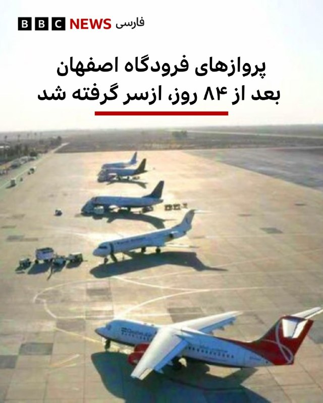

🔻ابوذر ضیایی، مدیرکل فرودگاه‌های استان اصفهان از برقراری مجدد پروازها در فرودگاه بین‌المللی «شهید بهشتی» اصفهان خبر داده است.

این فرودگاه به مدت ۸۴ روز پس از آغاز جنگ آمریکا و اسرائیل با ایران بسته مانده بود.

آقای ضایی گفته است اولین پرواز در مسیر اهواز- اصفهان و مسیر برگشت آن امروز سه‌شنبه (پنجم خرداد) انجام شده است.

فعالیت این فرودگاه البته با محدودیت ساعت روبروست و در حال حاضر از طلوع تا غروب آفتاب پروازها برقرار است.

پروازهای خارجی از ایران هم که از زمان شروع جنگ در نهم اسفند سال گذشته متوقف شده بود، در اوایل اردیبهشت از سر گرفته شد.

حدود دو هفته پیش فرودگاه «امام خمینی» تهران اعلام کرده بود که ۱۳ شرکت هواپیمایی داخلی به ۲۰ مقصد پرواز دارند.

آمریکا و اسرائیل در طول جنگ شماری از فرودگاه‌ها و هواپیماها را در ایران هدف حملات هوایی قرار دادند.

📸 مهر

https://bbc.in/4u071Sq
@BBCPersian

## idfinfarsi — post 11649

  <a href="telegram/content/idfinfarsi_11649_1779824425.mp4" target="_blank">🎬 Download video</a>

🎬 Video

## idfinfarsi — post 11648

  <a href="telegram/content/idfinfarsi_11648_1779824428.mp4" target="_blank">🎬 Download video</a>

🎬 Video

## idfinfarsi — post 11647

‼️ ارتش اسرائیل همچنان به حمله به زیرساخت‌های سازمان تروریستی حزب‌الله در جنوب لبنان ادامه می‌دهد: تروریست‌هایی که در حال پیشبرد طرح‌های تروریستی علیه نیروهای ما بودند به هلاکت رسیدند و زیرساخت‌هایی که برای شلیک راکت استفاده می‌شدند هدف قرار گرفتند

## idfinfarsi — post 11644

  <a href="telegram/content/idfinfarsi_11644_1779824431.mp4" target="_blank">🎬 Download video</a>

سخنگوی ارتش اسرائیل:

یک عملیات مهندسی گسترده در منطقه بیت حانون به پایان رسید: شناسایی و انهدام حدود ۱۱ کیلومتر مسیرهای زیرزمینی

نیروهای تیپ شمالی و یگان ویژه مهندسی تحت فرماندهی لشگر ۲۵۲، در ماه‌های اخیر در منطقه بیت حانون، در شرق خط زرد، برای انهدام سیستماتیک زیرساخت‌های تروریستی در سطح زمین و زیرزمین و دفاع از شهرک‌های نگب غربی فعالیت کرده اند.

در چارچوب این عملیات مهندسی، نیروها صدها حفاری سیستماتیک انجام دادند که از طریق آن بیش از ۱۱ کیلومتر مسیر زیرزمینی را شناسایی و منهدم کردند. همچنین صدها زیرساخت تروریستی در سطح زمین نیز نابود شد.
در جریان نبردهایی که در طول جنگ در این منطقه جریان داشت، سه کیلومتر دیگر از مسیرهای زیرزمینی نیز منهدم شد و تعداد زیادی تروریست توسط یگان‌های مختلفی که در منطقه فعالیت می‌کردند به هلاکت رسیدند.

منطقه بیت حانون در شمال نوار غزه یکی از کانون‌های اصلی و پیچیده نبرد در جریان عملیات زمینی بود. نیروها در این منطقه با تروریست‌ها درگیر شده، با شجاعت و دلاوری عمل کردند و در این راه، تعدادی از نیروهای ارتش اسرائیل در دفاع از شهرک‌های نگب غربی و در چارچوب شکست گردان بیت حانون جان خود را از دست دادند.
این منطقه طی سال‌ها به یکی از پایگاه‌های اصلی تروریستی سازمان تروریستی حماس تبدیل شده بود؛ جایی که تروریست‌های این سازمان از زیرساخت‌هایی که در دل جمعیت غیرنظامی تعبیه شده بود، فعالیت می‌کردند.
در زیر خانه‌های مسکونی، مراکز عمومی و مسیرهای تردد، شبکه‌ای گسترده از تونل‌ها ایجاد شده بود که برای اجرای عملیات‌های تروریستی علیه شهروندان اسرائیل و نیروهای ارتش این کشور مورد استفاده قرار می‌گرفت.

## Dirty_Kids — post 390268

  <a href="telegram/content/Dirty_Kids_390268_1779824434.mp4" target="_blank">🎬 Download video</a>

علی‌رضا دبیر: کارمندان بهایی من‌وتو می‌تونن در صورت بیکاری، تو پارک دانشجو مشغول کار بشن

@Dirty_Kids 👻

## Dirty_Kids — post 390267

بچها با عموهای وی‌پی‌ان فروشتون مهربون باشید، صلح این مملکت به یه گوز بنده.

@Dirty_Kids 👻

## Dirty_Kids — post 390266

فروش سیگار به صورت نخی ممنوع شد
دلیلش واسه این بوده که جوونا راحت به سیگار دسترسی نداشته باشن

+ کصخلا خب یه پاکت میگیرن کامل پاکتو میکشن

@Dirty_Kids 👻

## Dirty_Kids — post 390265

  <a href="telegram/content/Dirty_Kids_390265_1779824435.mp4" target="_blank">🎬 Download video</a>

خلاصه جنگ ۴۰ روزه برای اونایی که تازه نتشون وصل شده:

@Dirty_Kids 👻

## Dirty_Kids — post 390264

  

به مناسبت روز جهانی گوسفند(فردا)، کصننه عرازشه و سیمکارت سفیدا

@Dirty_Kids 👻

## Dirty_Kids — post 390263

انگار از انفرادی آوردنت بند عمومی

@Dirty_Kids 👻

## Dirty_Kids — post 390262

رمز پویای هفت رقمیم
داره از موجودی چهار رقمیم محافظت میکنه...!

@Dirty_Kids 👻

## Dirty_Kids — post 390261

  <a href="telegram/content/Dirty_Kids_390261_1779824437.mp4" target="_blank">🎬 Download video</a>

دوستانی که تازه وصل شدن این چالش تازه اومده، ببینید از دنیا عقب نمونید

@Dirty_Kids 👻

## Dirty_Kids — post 390260

  

ترامپ ۲۱ روز دیگه همزمان با شروع محرم:

@Dirty_Kids 👻

## Dirty_Kids — post 390259

در صورت برقراری اتصال اینترنت، اولین اقدام ضروری این است که سیستم‌عامل تمامی دستگاه‌ها و همچنین همه نرم‌افزارهای نصب‌شده را به آخرین نسخه به‌روزرسانی کنید.

این موضوع را بسیار جدی بگیرید؛ در حال حاضر تهدیدات و آسیب‌پذیری‌های امنیتی گسترده‌ای وجود دارد و بدافزارها به‌طور قابل‌توجهی در شبکه اینترنت ایران در حال انتشار هستند.

@Dirty_Kids 👻

## Dirty_Kids — post 390258

  

با مقاومت اکثریت ملت ایران پروژه سراسر کثافت اینترنت پرو، لغو و صفحه مربوط به آن در سایت همراه اول حذف شد.
و خوشبختانه اونایی که با عجله رفتن زیر کیر آخوند و اینترنت پرو خریدن هم به شکل فجیعی کیر شدن.

@Dirty_Kids 👻

## Dirty_Kids — post 390257

میدونید چرا خانواده‌های ایرانی افسردگی بچه‌هاشونو نمیفهمن؟ چون علائمی که همه جای دنیا نشون‌دهنده‌ی افسردگی شدیده واسه اینا سربه‌زیری و بچه‌ی صالح بودن محسوب میشه . اینکه همش خونه باشیم و با دوستامون وقت نگذرونیم و مسافرت نریم و ساکت و کم حرف باشیم و به خودمون نرسیم و ...

@Dirty_Kids 👻

## Dirty_Kids — post 390255

عکسهای جدید جنیفر لوپز برای فوت فتیشا

[۵۶ سالشههه]

@Dirty_Kids 👻

## Dirty_Kids — post 390254

  <a href="https://t.me/Dirty_Kids/390254" target="_blank">📎 Download file</a>

✅ اپلیکیشن اندروید سایت جهانی دربی بت

💰اولین سایت جهانی با امکان شارژ و برداشت ریالی(کارت به کارت)

🔗 برای ورود فیلترشکن روی کشور مناسب قرار دهید مانند فنلاند و المان و....

😀Telegram Channel
👇
https://t.me/+bcynkEgSW2dlYTc0

## Dirty_Kids — post 390253

  

😤دنبال یه سایت شرط بندی بین المللی بودی که به ایرانیا خدمات بده؟!
⛔

👍دربی بت همون انتخاب  100%

💎ویژگی های سایت جهانی Derby Bet:

⬅️امکان شارژ امن با کارت بانکی

⬅️واریز اول دوبل شارژ می شوید(بونوس۱۰۰٪)

⬅️پر اپشن ترین سایت فعال در ایران

⬅️تسویه حساب کمتر از 5 دقیقه

⬅️برگشت بخشی از باخت به صورت هفتگی

🚨کد هدیه ثبت نام:GG007

⚠️برای دانلود اپلکیشن کلیک کنید
👉

🔔کانال دربی بت :

🪙https://t.me/+bcynkEgSW2dlYTc0

## Dirty_Kids — post 390252

تجربه کانفیگ‌های ۱ گیگ و ۲ گیگی، خفت‌بارترین تجربه‌ کل عمرم بود

عجب حقارتی ...

@Dirty_Kids 👻

## Dirty_Kids — post 390251

چت جی پی تی هم رفع فیلتر شد

## Dirty_Kids — post 390250

  <a href="telegram/content/Dirty_Kids_390250_1779824443.mp4" target="_blank">🎬 Download video</a>

عمو مراد:

«خروج قالیباف از مخفیگاه و سفرش به قطر و علنی شدن حضور علی عبداللهی، فرمانده قرارگاه خاتم الانبیا، پس از چند ماه می‌تواند نشانه امان‌نامه غیر رسمی و موقت ترامپ به فرماندهان سپاه برای رسیدن به یک توافق احتمالی باشد. اگر توافق نشود این امان‌نامه می تواند توسط نیروی هوایی اسراییل باطل شود.»⁩

@Dirty_Kids 👻

## Dirty_Kids — post 390249

  

‏امیرحسین ثابتی، نماینده مجلس:
📍باید از روی جنازه من رد بشوید تا بتوانید اینترنت بین‌الملل را وصل کنید.

ایشالا به زودی همگی رد شیم از روی جنازه تو !

@Dirty_Kids 👻

## Hranews — post 113187

  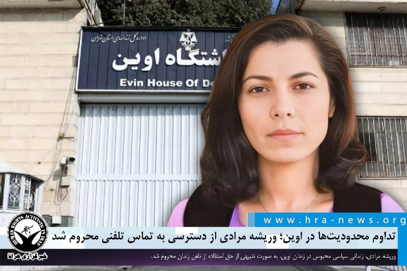

تداوم محدودیت‌ها در اوین؛ وریشه مرادی از دسترسی به تماس تلفنی محروم شد

❗️
❗️
❗️
❗️
❗️ – وریشه مرادی، زندانی سیاسی محبوس در زندان اوین، به صورت تنبیهی از حق استفاده از تلفن زندان محروم شد. این زندانی سیاسی پیشتر نیز از ملاقات با خانواده و وکلای خود محروم شده بود و این محدودیت همچنان ادامه دارد.

به گزارش خبرگزاری هرانا، ارگان خبری مجموعه فعالان حقوق بشر در ایران، وریشه مرادی، زندانی سیاسی محبوس در زندان اوین از حق استفاده از تلفن زندان محروم شد.

براساس اطلاعات دریافتی هرانا، خانم مرادی، از روز جاری به صورت تنبیهی از امکان دسترسی و استفاده از تلفن زندان منع شده‌ است.
یک منبع مطلع در این خصوص اعلام کرد که این اقدام به دنبال سر دادن شعارهای اعتراضی نسبت به اجرای احکام اعدام، در محوطه هواخوری زندان اوین انجام شده است.

ادامه مطلب

#وریشه_مرادی

↘️
@hranews_bot تماس ✉️ -  @Hranews  کانال هرانا 🆑

## Hranews — post 113186

گزارشی از تجمع اعتراضی مال‌باختگان پروژه «نگین غرب»

❗️
❗️
❗️
❗️
❗️ – امروز سه‌شنبه ۵ خردادماه، گروهی از مال‌باختگان پروژه «نگین غرب» با برگزاری #تجمع اعتراضی در تهران، خواستار رسیدگی به مطالبات خود شدند.

ادامه مطلب

↘️
@hranews_bot تماس ✉️ -  @Hranews  کانال هرانا 🆑

## Hranews — post 113185

اجرای حکم اعدام ۲ زندانی در مهاباد و رشت/ رهایی یک زندانی از مجازات مرگ

❗️
❗️
❗️
❗️
❗️ – حکم دو زندانی که پیشتر از بابت اتهامات مرتبط با جرائم مواد مخدر و قتل به #اعدام محکوم شده بودند، در زندان‌‌های مهاباد و لاکان رشت اجرا شد. همچنین، یک زندانی در زندان سنندج که از بابت اتهام قتل به اعدام محکوم شده بود، با کسب رضایت اولیای دم از مجازات اعدام رهایی یافت.

ادامه مطلب

#عبدالقادر_رسولی
#امیرعباس_شکری

↘️
@hranews_bot تماس ✉️ -  @Hranews  کانال هرانا 🆑

## Hranews — post 113184

گزارشی از اخراج کارگران کارخانه زرین غزال شیراز/ از آغاز جنگ، ۴۷۰۰ کارگر در استان قزوین تعدیل شدند

❗️
❗️
❗️
❗️
❗️ – حدود ۵۰ تن از #کارگران کارخانه زرین‌غزال شیراز در حالی توسط کارفرما از محل کار خود اخراج شدند که شماری از آنها در آستانه بازنشستگی قرار داشته‌اند. از سوی دیگر، مدیرکل تعاون، کار و رفاه اجتماعی استان قزوین از #تعدیل و بیکار شدن ۴،۷۰۰ نفر از کارگران و نیروهای کار این استان طی جنگ اخیر خبر داد.

ادامه مطلب

↘️
@hranews_bot تماس ✉️ -  @Hranews  کانال هرانا 🆑

## Hranews — post 113183

همزمان با تفتیش منزل؛ محمود بهشتی به اداره اطلاعات احضار شد

❗️
❗️
❗️
❗️
❗️ – امروز سه شنبه، منزل محمود بهشتی لنگرودی، فعال صنفی معلمان توسط ماموران اطلاعات سپاه مورد تفتیش قرار گرفت. ماموران برخی از لوازم شخصی و دیجیتال آقای بهشتی را ضبط کردند. همزمان با این رویداد، وی به اداره اطلاعات لنگرود #احضار شد.

ادامه مطلب

#محمود_بهشتی_لنگرودی

↘️
@hranews_bot تماس ✉️ -  @Hranews  کانال هرانا 🆑

## Hranews — post 113182

گزارشی از تداوم بازداشت و بی‌خبری از وضعیت رضا امانی‌فر در بوشهر

❗️
❗️
❗️
❗️
❗️– رضا امانی‌فر، فعال صنفی معلمان بوشهر علیرغم گذشت ۵۳ روز از زمان بازداشت، در بلاتکلیفی به‌سر می‌برد. بی‌خبری از سرنوشت و وضعیت پرونده این شهروند، منجر به افزایش نگرانی‌های خانواده وی شده است.
#رضا_امانی‌فر

ادامه مطلب

↘️
@hranews_bot تماس ✉️ -  @Hranews  کانال هرانا 🆑

## Hranews — post 113181

اصغر حاجب از زندان آزاد شد

❗️
❗️
❗️
❗️
❗️– امروز سه شنبه، اصغر حاجب، عضو هیات مدیره کانون صنفی معلمان استان بوشهر با تودیع وثیقه از زندان آزاد شد.
#اصغر_حاجب

ادامه مطلب

↘️
@hranews_bot تماس ✉️ -  @Hranews  کانال هرانا 🆑

## Hranews — post 113180

  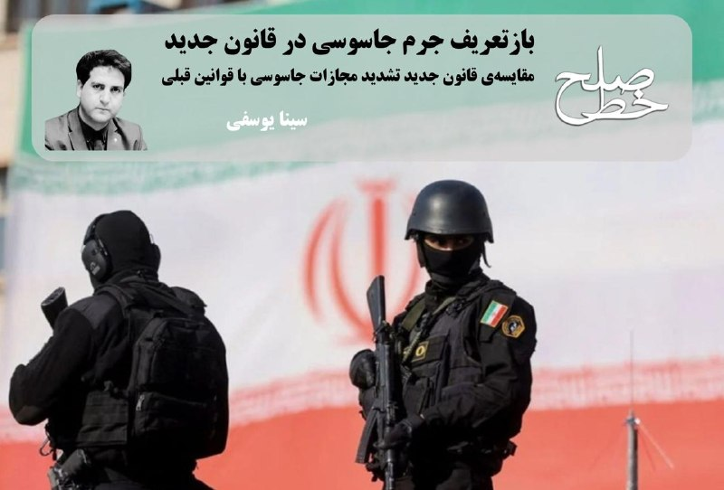

مقایسه‌ی قانون جدید تشدید مجازات جاسوسی با قوانین قبلی/ سینا یوسفی

📡
📡
📡
📡
📡 – در نظام‌های حقوق کیفری معاصر، جرم جاسوسی همواره در زمره‌ی شدیدترین جرائم علیه امنیت کشور طبقه‌بندی شده است، زیرا موضوع آن، تعرض به منافع بنیادین دولت و افشای اطلاعاتی است که می‌تواند امنیت سیاسی، نظامی یا دیپلماتیک کشور را با خطر مواجه سازد. با این حال، شدت اهمیت این جرم هرگز به معنای بی‌نیازی آن از اصول بنیادین حقوق کیفری نبوده است. برعکس، هرچه مجازات‌ها شدیدتر و آثار کیفری گسترده‌تر باشند، ضرورت پایبندی قانون‌گذار به اصولی چون شفافیت، قطعیت، تفسیر مضیق و قابلیت پیش‌بینی قوانین کیفری بیش‌تر می‌شود. در سال‌های اخیر و به‌ویژه در سایه‌ی تشدید تنش‌های منطقه‌ای، گسترش منازعات امنیتی، افزایش اعتراضات مردمی و تشدید نگرانی حاکمیت نسبت به جنگ اطلاعاتی و رسانه‌ای، سیاست جنایی جمهوری اسلامی ایران نیز به‌ تدریج از الگوی سنتی مقابله با جاسوسی فاصله گرفته و به سمت توسعه قلمرو جرائم امنیتی حرکت کرده است. «قانون تشدید مجازات جاسوسی و همکاری با رژیم صهیونیستی و کشورهای متخاصم علیه امنیت و منافع ملی» را باید محصول همین فضای سیاسی و امنیتی دانست. قانونی که اگرچه ظاهراً با هدف مقابله با تهدیدات خارجی و کنترل اشکال نوین همکاری اطلاعاتی تصویب شده، اما در عمل، مفهوم «جاسوسی» را به نحو چشم‌گیری گسترش داده و آن را از یک جرم کلاسیک مبتنی بر انتقال اسرار محرمانه، به مفهومی سیال و موسع در حوزه‌ی امنیت ملی تبدیل کرده است.

در قوانین پیشین –به‌ویژه مواد ۵۰۱ تا ۵۰۵ قانون مجازات اسلامی (بخش تعزیرات)—، مفهوم جاسوسی هرچند خالی از ابهام نبود، اما هم‌چنان بر پایه‌ی عناصر نسبتاً مشخصی استوار بود. محور اصلی این مقررات، دسترسی، تحصیل یا انتقال اطلاعات و اسناد طبقه‌بندی‌شده به نفع دولت یا اشخاص خارجی بود و عنصر مادی جرم عمدتاً ناظر به افشای اسرار یا همکاری اطلاعاتی مستقیم تلقی می‌شد. در واقع، جاسوسی در معنای کلاسیک خود مستلزم نوعی رابطه‌ی مشخص میان مرتکب، اطلاعات محرمانه و طرف خارجی بود. اما قانون جدید این چارچوب سنتی را دگرگون کرده است. در این قانون، دیگر صرفاً انتقال اسناد محرمانه یا همکاری اطلاعاتی مستقیم موضوع جرم‌انگاری نیست، بلکه طیف متنوعی از رفتارهای ارتباطی، رسانه‌ای و فناورانه نیز در قلمرو تهدیدات امنیتی قرار گرفته‌اند. ارسال تصاویر و اطلاعات برای رسانه‌های «معاند»، استفاده از برخی ابزارهای ارتباطی مانند اینترنت ماهواره‌ای، یا حتی همکاری‌های غیرمستقیم با اشخاص و نهادهای مرتبط با دولت‌های متخاصم، همگی در ساختار جدید قانون ذیل منطق مقابله با جاسوسی و همکاری امنیتی تحلیل شده‌اند. نتیجه‌ی این تحول آن است که مرز سنتی میان جاسوسی، فعالیت رسانه‌ای، کنش سیاسی و ارتباطات فرامرزی تا حد زیادی کم‌رنگ شده و قلمرو جرم جاسوسی به حوزه‌هایی تسری یافته که پیش‌تر اساساً در چارچوب جرائم امنیتی کلاسیک قرار نمی‌گرفتند.
#سینا_یوسفی #جاسوسی

ادامه مطلب
لینک به مطلب در وبسایت خط صلح

↘️
@hranews_bot تماس ✉️ - @Hranews کانال هرانا 🆑

## Hranews — post 113178

  <a href="telegram/content/Hranews_113178_1779824448.mp4" target="_blank">🎬 Download video</a>

امروز سه‌شنبه ۵ خردادماه، گروهی از مال‌باختگان پروژه «نگین غرب» با برگزاری تجمعی مقابل دادسرای عمومی و انقلاب ناحیه پنج تهران، نسبت به ادامه بلاتکلیفی پرونده خود اعتراض کردند.

شهروندان معترض بعد از گذشت حدود ۲۲ سال از زمان سرمایه‌گذاریشان، کماکان در بلاتکلیفی بسر میبرند.
#تجمع

↘️
@hranews_bot تماس ✉️ -  @Hranews  کانال هرانا 🆑

## Hranews — post 113177

  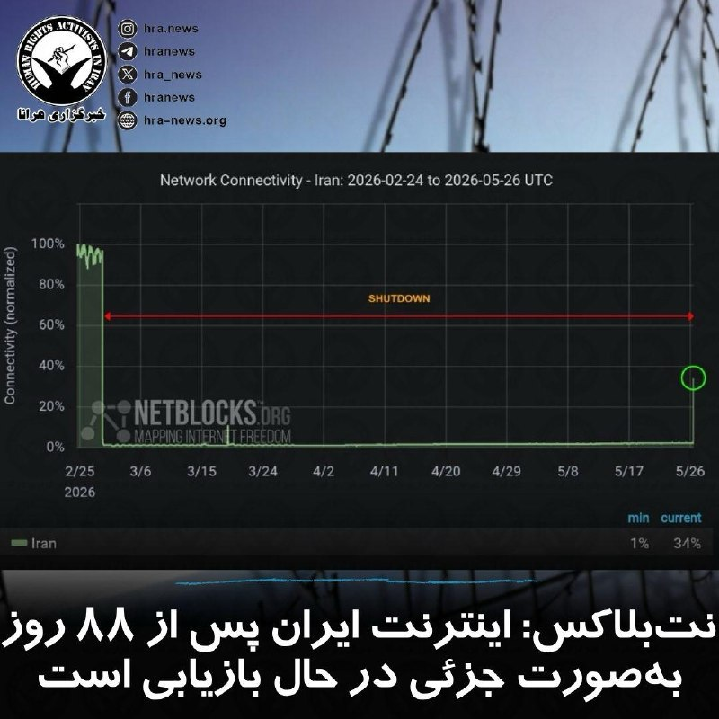

نت‌بلاکس در آخرین به‌روزرسانی خود از وضعیت #اینترنت در ایران نوشت بر اساس داده‌های زنده، در هشتاد و هشتمین روز از قطع اینترنت، اتصال در ایران به‌صورت جزئی در حال بازیابی است؛ این رویداد پس از ۲۰۹۳ ساعت انزوای تقریباً کامل از شبکه‌های بین‌المللی رخ داده است که طولانی‌ترین قطع سراسری اینترنت در تاریخ مدرن محسوب می‌شود. این نهاد ناظر بر وضعیت اینترنت در جهان تاکید می‌کند که هنوز مشخص نیست آیا این بازگشت اتصال پایدار خواهد ماند یا نه.

↘️
@hranews_bot تماس ✉️ -  @Hranews  کانال هرانا 🆑

## Hranews — post 113176

  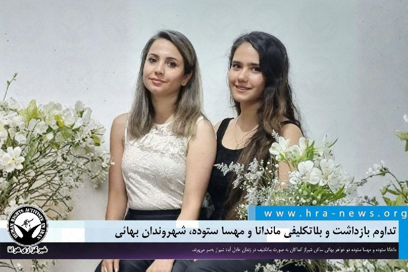

تداوم بازداشت و بلاتکلیفی ماندانا و مهسا ستوده، شهروندان بهائی در زندان عادل آباد

❗️
❗️
❗️
❗️
❗️– ماندانا ستوده و مهسا ستوده دو خواهر بهائی ساکن شیراز نزدیک به دو ماه است که بازداشت شدند و کماکان به صورت بلاتکلیف در زندان عادل آباد شیراز به‌سر می‌برند.

به گزارش خبرگزاری هرانا، ارگان خبری مجموعه فعالان حقوق بشر در ایران، ماندانا ستوده و مهسا ستوده شهروندان بهائی کماکان در بازداشت به سر میبرند.

ماندانا ستوده و مهسا ستوده دو خواهر #بهائی علیرغم گذشت نزدیک به دو ماه از زمان بازداشت کماکان به صورت بلاتکلیف در زندان عادل آباد شیراز نگهداری می شوند.

با وجود پیگیری‌های خانواده این شهروندان از مراجع قضایی، تاکنون رسیدگی مؤثر و نتیجه‌بخشی به پرونده آنان صورت نگرفته است.
#ماندانا_ستوده #مهسا_ستوده

ادامه مطلب

↘️
@hranews_bot تماس ✉️ -  @Hranews  کانال هرانا 🆑

## Hranews — post 113175

  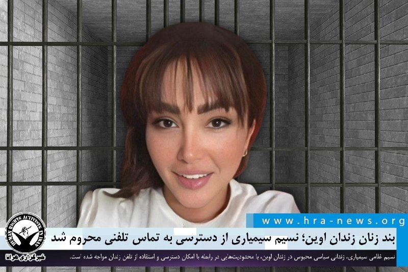

بند زنان زندان اوین؛ نسیم سیمیاری از دسترسی به تماس تلفنی محروم شد

❗️
❗️
❗️
❗️
❗️– نسیم غلامی سیمیاری، زندانی سیاسی محبوس در زندان اوین، به صورت تنبیهی از حق استفاده از تلفن زندان محروم شد. این زندانی همچنین پیش از این نیز از حق ملاقات حضوری با خانواده و وکلای خود به مدت یک هفته محروم شده است.

به گزارش خبرگزاری هرانا، ارگان خبری مجموعه فعالان حقوق بشر در ایران، نسیم غلامی سیمیاری ، زندانی سیاسی محبوس در زندان اوین از حق استفاده از تلفن زندان محروم شد.

یک منبع مطلع در این خصوص به هرانا گفت: نسیم غلامی سیمیاری به دلیل مکالمه با لیندزی فورمن، به صورت تنبیهی از امکان دسترسی و استفاده از تلفن زندان منع شده است. همچنین مسئولین زندان پیشتر نیز این زندانی سیاسی را به دلیل «پوشیدن شلوارک» به مدت یک هفته از حق ملاقات حضوری با خانواده و وکلای خود محروم کرده‌اند.
#نسیم_غلامی_سیمیاری

ادامه مطلب

↘️
@hranews_bot تماس ✉️ -  @Hranews  کانال هرانا 🆑

## Hranews — post 113174

  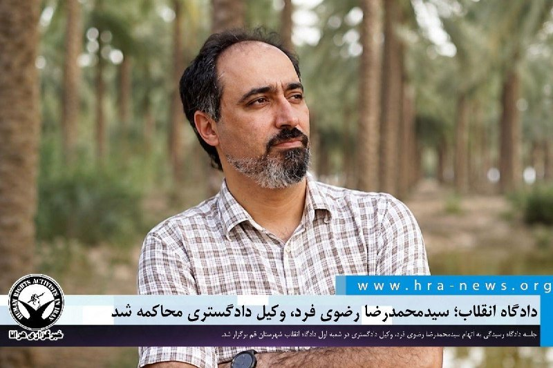

دادگاه انقلاب؛ سیدمحمدرضا رضوی فرد، وکیل دادگستری محاکمه شد

❗️
❗️
❗️
❗️
❗️– امروز سه شنبه ۵ خردادماه، جلسه دادگاه رسیدگی به اتهام سیدمحمدرضا رضوی فرد، وکیل دادگستری در شعبه اول دادگاه انقلاب شهرستان قم برگزار شد.

به گزارش خبرگزاری هرانا، ارگان خبری مجموعه فعالان حقوق بشر در ایران، سیدمحمدرضا رضوی فرد، وکیل دادگستری محاکمه شد.

آقای رضوی‌فرد امروز سه‌شنبه ۵ خردادماه، در شعبه اول دادگاه انقلاب قم از بابت اتهام تبلیغ علیه نظام از خود دفاع کرد.

بر اساس اطلاعات دریافتی، این پرونده با استناد به ماده ۴ قانون تشدید تشکیل شده است؛ ماده‌ای که برخی فعالیت‌های سیاسی، فرهنگی، رسانه‌ای و تبلیغی، از جمله تولید یا انتشار محتواهایی را که به تشخیص دادگاه علیه امنیت ملی تلقی شود، جرم‌انگاری می‌کند. این ماده همچنین ارسال فیلم، تصویر یا اطلاعات به رسانه‌ها و صفحات مجازی بیگانه یا معاند را در صورت تشخیص مغایرت با امنیت ملی، مشمول مجازات می‌داند.
#سیدمحمدرضا_رضوی_فرد

ادامه مطلب

↘️
@hranews_bot تماس ✉️ -  @Hranews  کانال هرانا 🆑

## Hranews — post 113173

  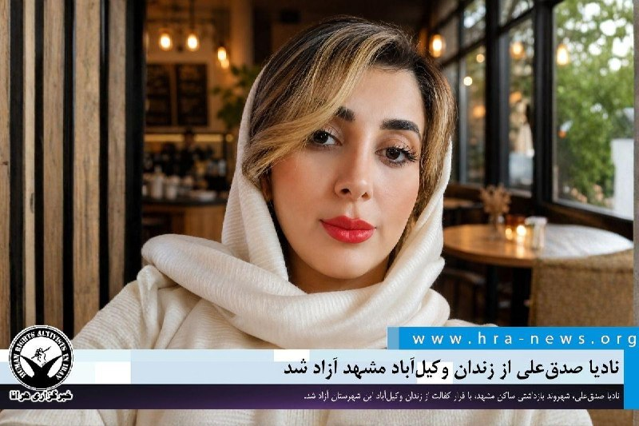

نادیا صدق‌علی از زندان وکیل‌آباد مشهد آزاد شد

❗️
❗️
❗️
❗️
❗️– نادیا صدق‌علی، شهروند بازداشتی ساکن مشهد، با قرار کفالت از زندان وکیل‌آباد این شهرستان آزاد شد.

به گزارش خبرگزاری هرانا، ارگان خبری مجموعه فعالان حقوق بشر در ایران، نادیا صدق‌علی آزاد شد.

بر اساس اطلاعات دریافتی هرانا، آزادی خانم صدق‌علی، اخیراً با قرار کفالت از زندان وکیل‌آباد مشهد صورت گرفته است.
#نادیا_صدق‌علی

ادامه مطلب

↘️
@hranews_bot تماس ✉️ -  @Hranews  کانال هرانا 🆑

## Hranews — post 113172

  

یدالله رحمانی، استاندار کهگیلویه و بویراحمد، با تاکید بر لزوم مدیریت مصرف آب در بخش‌های کشاورزی، شرب و صنعت اعلام کرد که براساس آمار آبفا، ۶۰۰ روستا در این استان با #تنش_آبی مواجه بودند که از این تعداد ۱۲۰ روستا از تنش آبی خارج شدند و برای ۴۸۰ روستای باقی‌مانده، باید برنامه زمان‌بندی دقیقی ارائه شود تا طی سال‌های ۱۴۰۵ و ۱۴۰۶، سالانه ۲۴۰ روستا به تفکیک شهرستان از تنش آبی خارج شوند.

↘️
@hranews_bot تماس ✉️ -  @Hranews  کانال هرانا 🆑

## Hranews — post 113171

  

بر اساس آخرین داده‌های نت‌بلاکس، اکنون هشتادوهشتمین روز متوالی قطع #اینترنت در ایران است؛ محدودیتی که بیش از ۲۰۸۸ ساعت ادامه داشته است.

↘️
@hranews_bot تماس ✉️ -  @Hranews  کانال هرانا 🆑

## Hranews — post 113170

  

علی احمدزاده، کارگردان، فیلمنامه‌نویس و تهیه‌کننده ایرانی، با انتشار مطلبی اعلام کرد که با وجود گذشت حدود ۱۰ ماه از تفتیش منزل و ضبط وسایل شخصی و مدارک هویتی‌اش توسط نهادهای امنیتی، تاکنون موفق به بازپس‌گیری آنها نشده است. این در حالی است که به گفته احمدزاده، برای بازگرداندن این اقلام حکم قضایی صادر شده است.

به گفته وی، ماموران وسایلی به ارزش “چندین میلیارد” تومان، از جمله مدارک شناسایی، کارت‌های بانکی و گذرنامه‌اش را ضبط کرده‌اند. احمدزاده همچنین عنوان کرد که وزارت اطلاعات به او اعلام کرده است تمامی این اقلام ضبط شده و او باید “بدون مدارک هویتی” به زندگی ادامه دهد. او در ادامه، با اشاره به پیگیری‌های قضایی خود نوشت که قاضی پرونده نیز به وی گفته است: “از دست ما دیگر کاری برنمی‌آید، مملکت را ماموران امنیتی می‌گردانند.”
#علی_احمدزاده

↘️
@hranews_bot تماس ✉️ -  @Hranews  کانال هرانا 🆑

## Hranews — post 113169

  

غلامرضا خانی شکراب به اتهام «جاسوسی» اعدام شد

❗️
❗️
❗️
❗️
❗️– مرکز رسانه قوه قضاییه از اجرای حکم اعدام غلامرضا خانی شکراب، زندانی متهم به جاسوسی و فعالیت اطلاعاتی به نفع اسرائیل خبر داد. این حکم پس از تایید در دیوان عالی کشور به اجرا درآمد. بر اساس داده‌های گردآوری‌شده توسط هرانا، همزمان با آغاز درگیری‌های نظامی، روند صدور و اجرای احکام اعدام در پرونده‌های سیاسی و امنیتی افزایش یافته و تاکنون ۳۷ زندانی با این اتهامات در این بازه زمانی اعدام شده‌اند.
#غلامرضا_خانی_شکراب #اعدام

ادامه مطلب

↘️
@hranews_bot تماس ✉️ -  @Hranews  کانال هرانا 🆑

## Hranews — post 113168

  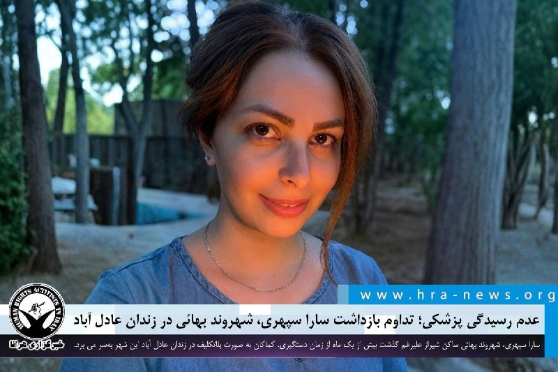

عدم رسیدگی پزشکی؛ تداوم بازداشت سارا سپهری، شهروند بهائی در زندان عادل آباد

❗️
❗️
❗️
❗️
❗️– سارا سپهری، شهروند بهائی ساکن شیراز علیرغم گذشت بیش از یک ماه از زمان دستگیری، کماکان به صورت بلاتکلیف در زندان عادل آباد این شهر به‌سر می برد. همچنین وی دچار مشکلات جسمانی بوده و از دریافت رسیدگی مناسب پزشکی محروم مانده است.

به گزارش خبرگزاری هرانا، ارگان خبری مجموعه فعالان حقوق بشر در ایران، سارا سپهری، شهروند #بهائی در زندان عادل آباد شیراز در بازداشت و بلاتکلیفی بهسر می برد.

یک منبع مطلع نزدیک به خانواده این شهروند بهائی، ضمن تایید این خبر به هرانا گفت: “سارا سپهری ۴۷ روز است که در زندان عادل‌آباد شیراز به‌صورت بلاتکلیف نگهداری می‌شود. او در طول بازداشت دچار خونریزی معده شده و فشار ناشی از بازجویی‌های طولانی‌مدت، بیماری چشمی‌اش را تشدید کرده است. همچنین، عدم دسترسی به دارو و درمان مناسب در هفته‌های اخیر، به وخامت وضعیت جسمی و روحی وی انجامیده و او نیازمند رسیدگی تخصصی پزشکی و اعزام به مراکز درمانی خارج از زندان است.”

ادامه مطلب

#سارا_سپهری

↘️
@hranews_bot تماس ✉️ -  @Hranews  کانال هرانا 🆑

## Hranews — post 113167

  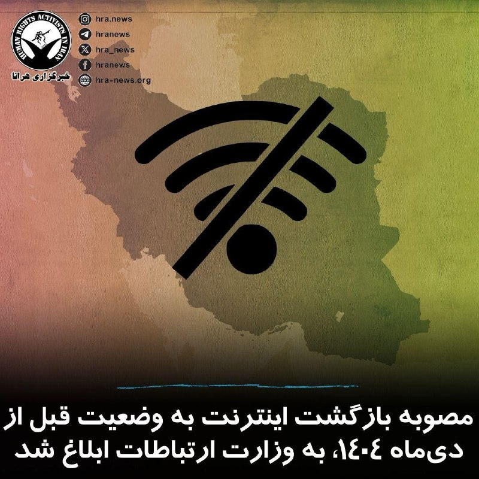

احسان چیت‌ساز، معاون سیاست‌گذاری و برنامه‌ریزی توسعه فاوا و اقتصاد دیجیتال وزارت ارتباطات، اعلام کرد که مصوبه بازگشت #اینترنت کشور به وضعیت پیش از دی‌ماه ۱۴۰۴، توسط رییس‌جمهور تایید و برای اجرا به وزارت ارتباطات ابلاغ شده است.

روز گذشته، ستاد راهبری و ساماندهی فضای مجازی، بازگشت اینترنت به وضعیت پیش از دی‌ماه ۱۴۰۴ را تصویب و برای تایید به رییس‌جمهور ارسال کرده بود.

↘️
@hranews_bot تماس ✉️ -  @Hranews  کانال هرانا 🆑

## manototv — post 105830

آیا وعده بازگشایی اینترنت عملی می‌شود؟

## alonews — post 122916

  <a href="telegram/content/alonews_122916_1779824462.webm" target="_blank">🎬 Download video</a>

👈بروجردی، عضو کمیسیون امنیت ملی و سیاست خارجی مجلس : آزادسازی ۱۲ میلیارد دلار از شروط ابتدایی ایران در مذاکره است

✅ @AloNews خبر جنگ

## alonews — post 122915

  <a href="telegram/content/alonews_122915_1779824462.webm" target="_blank">🎬 Download video</a>

👈کلودفلر: ترافیک اینترنت ایران به بالای ۹۰ درصد رسید. واتساپ و ویکی‌پدیا در دسترس قرار گرفتند

✅ @AloNews خبر جنگ

## alonews — post 122914

  <a href="telegram/content/alonews_122914_1779824462.mp4" target="_blank">🎬 Download video</a>

👈سپاه : فیلمی منتشر کرده که نشان می‌دهد پدافند هوایی ایران یک پهپاد آمریکایی MQ-9 ریپر را در خلیج فارس در سپیده‌دم امروز سرنگون کرده است.

🔴مقامات آمریکایی این سرنگونی را تکذیب کرده‌اند.

✅ @AloNews خبر جنگ

## alonews — post 122913

  <a href="telegram/content/alonews_122913_1779824465.webm" target="_blank">🎬 Download video</a>

⚫
🏆 به دنیای هیجان‌انگیز فوتبال خوش اومدی!

⭐️اینجا قراره باهم لحظه‌به‌لحظه‌ی جام جهانی رو زندگی کنیم؛
از بازی‌های حساس و نتایج داغ گرفته تا حاشیه‌ها، کری‌خونی‌ها و اتفاقاتی که همه درباره‌ش حرف میزنن! 
🔥
🔥

✅ پوشش کامل مسابقات

💀 ترول تیم‌ها و بازیکن‌ها

🎥 ویدیوها و لحظه‌های فان فوتبالی

📊 آمار، ترکیب‌ها و اخبار فوری

🌍 حواشی جذاب از سراسر جام جهانی

📢اینجا فقط یک کانال خبری نیست؛
یک جمع فوتبالیه برای کسایی که فوتبال رو با هیجان، شوخی و احساس واقعی دنبال میکنن 
📛
💟

🆘
🔞 آماده باش چون قراره جام جهانی رو متفاوت تجربه کنیم!

⚡ @Vaarzesh_Plus

⚡ @Vaarzesh_Plus

## alonews — post 122912

سایت پورن هاب به دلیل هجوم کاربران دقایقی قبل از دسترس خارج شد [@AloTweet]

## alonews — post 122911

  <a href="telegram/content/alonews_122911_1779824466.webm" target="_blank">🎬 Download video</a>

👈 نتانیاهو، و ترامپ در حال حاضر در تماس تلفنی هستند، طبق گزارش کانال ۱۲ اسرائیل 
✅ @AloNews خبر جنگ

## alonews — post 122910

  <a href="telegram/content/alonews_122910_1779824466.webm" target="_blank">🎬 Download video</a>

👈ایلان ماسک : وقتشه یه پایگاه بزرگ روی ماه ساخته بشه!

✅ @AloNews خبر جنگ

## alonews — post 122909

  <a href="telegram/content/alonews_122909_1779824466.webm" target="_blank">🎬 Download video</a>

👈پست جدید نت بلاکس در صفحه خودش: خوش برگشتی ایران

✅ @AloNews خبر جنگ

## alonews — post 122908

  <a href="telegram/content/alonews_122908_1779824467.webm" target="_blank">🎬 Download video</a>

👈 نتانیاهو، و ترامپ در حال حاضر در تماس تلفنی هستند، طبق گزارش کانال ۱۲ اسرائیل

✅ @AloNews خبر جنگ

## alonews — post 122907

  <a href="telegram/content/alonews_122907_1779824467.webm" target="_blank">🎬 Download video</a>

👈برای اولین بار سامانه پدافند هوایی بومی «مجید» ایران تو اختیار نیروهای مسلح ارمنستان دیده شده

✅ @AloNews خبر جنگ

## alonews — post 122906

  <a href="telegram/content/alonews_122906_1779824467.webm" target="_blank">🎬 Download video</a>

👈اتاق اصناف ایران: فروش سیگار نخی و فرآورده‌های دخانی بازشده در تمامی واحدهای صنفی ممنوع شد.

✅ @AloNews خبر جنگ

## alonews — post 122905

  <a href="telegram/content/alonews_122905_1779824468.webm" target="_blank">🎬 Download video</a>

👈فارس: تا الان بالای ۹۰ درصد مردم اینترنتشون وصل شده

✅ @AloNews خبر جنگ

## alonews — post 122904

  <a href="telegram/content/alonews_122904_1779824468.webm" target="_blank">🎬 Download video</a>

👈پزشکیان: کشورهای منطقه فهمیده‌اند که اگر میزبان پایگاه‌های آمریکا باشند به‌شدت صدمه می‌بینند

✅ @AloNews خبر جنگ

## alonews — post 122903

  <a href="telegram/content/alonews_122903_1779824468.webm" target="_blank">🎬 Download video</a>

👈نیروی دریایی سپاه: کنترل هوشمند تنگهٔ هرمز با اقتدار درحال انجام است و هرگونه تجاوز با ضربات کوبنده پاسخ داده خواهد شد.

✅ @AloNews خبر جنگ

## alonews — post 122902

  <a href="telegram/content/alonews_122902_1779824469.mp4" target="_blank">🎬 Download video</a>

👈 جی‌دی ونس: همه باید به تقلب اهمیت بدهند. همه باید به ریشه‌کن کردن تقلب اهمیت بدهند. همه باید به صرفه‌جویی در پول مالیات‌دهندگان آمریکایی اهمیت بدهند.

✅ @AloNews خبر جنگ

## alonews — post 122901

  <a href="telegram/content/alonews_122901_1779824470.webm" target="_blank">🎬 Download video</a>

👈بیانیه مشترک نتانیاهو و کاتز: ارتش ،محمد عوده، فرمانده جدید القسام را در غزه هدف قرار داد و ترور کرد

✅ @AloNews خبر جنگ

## alonews — post 122900

  <a href="telegram/content/alonews_122900_1779824471.webm" target="_blank">🎬 Download video</a>

👈 سپاه: طی شبانه روز گذشته ۲۵ فروند کشتی اعم از نفتکش، کانتینربر و سایر کشتی های تجاری پس از کسب مجوز با هماهنگی و تامین امنیت نیروی دریایی سپاه از تنگه هرمز عبور کردند.

✅ @AloNews خبر جنگ

## alonews — post 122896

  <a href="telegram/content/alonews_122896_1779824471.mp4" target="_blank">🎬 Download video</a>

👈اسرائیل حمله‌ای ترور را علیه فرمانده جدید شاخه نظامی حماس، محمد عودا، در محله ریمل شهر غزه انجام داده است.

🔴 در حال حاضر مشخص نیست که این حمله موفقیت‌آمیز بوده یا خیر

✅ @AloNews خبر جنگ

<!-- MSG END -->

<!-- NAV START -->

<a href="https://github.com/iocollab20/maxman/blob/main/telegram/content/archive_1.md" style="display:inline-block; padding:6px 12px; margin:0 4px; background-color:#2ea44f; color:white; text-decoration:none; border-radius:4px; font-weight:bold;">صفحه بعد</a>

<!-- NAV END -->
