# خواننده تلگرام

<!-- TOP_NAV START -->

<a href="https://github.com/iocollab20/maxman/blob/main/telegram/content/archive_1.md" style="display:inline-block; padding:6px 12px; margin:0 4px; background-color:#2ea44f; color:white; text-decoration:none; border-radius:4px; font-weight:bold;">صفحه بعد</a>

<!-- TOP_NAV END -->

<!-- MSG START -->

---
📅 بروزرسانی: 1405/03/03 11:41
---

## VahidOOnLine — post 241895

  <a href="telegram/content/VahidOOnLine_241895_1779610288.mp4" target="_blank">🎬 Download video</a>

بر اساس ویدیوهای ارسال‌شده به ایران‌اینترنشنال گروهی از ایرانیان مقیم فنلاند، علیه جمهوری اسلامی در شهر تورکو تجمع کرده و سرود «ای ایران» را همخوانی کردند.
‌🏁 🇬🇧 IranintlTV

🤖 @VahidOOnLine

## VahidOOnLine — post 241894

  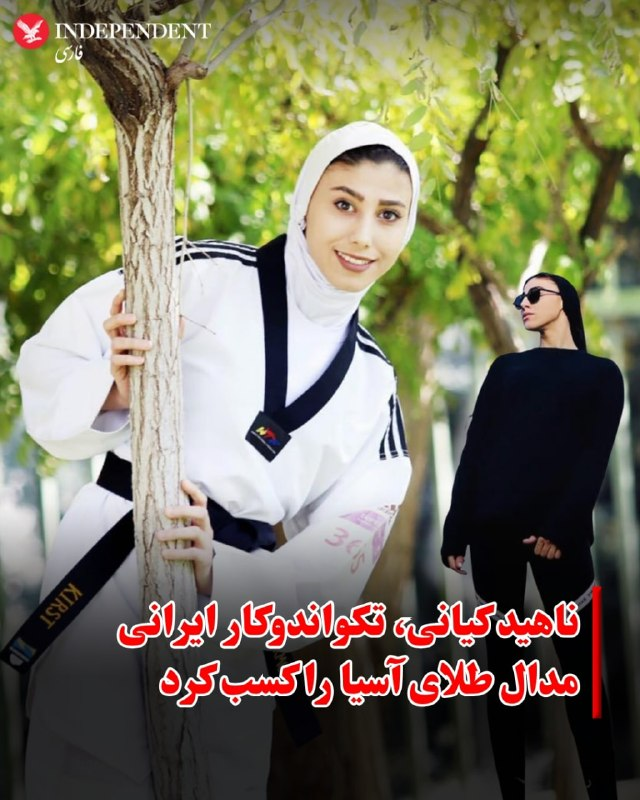

⭕️ ناهید کیانی، تکواندوکار ایرانی مدال طلای آسیا را کسب کرد

♦️ناهید کیانی، نماینده وزن منفی ۵۷ کیلوگرم ایران، در فینال مسابقات تکواندو قهرمانی آسیا در مغولستان مقابل نماینده ازبکستان به میدان رفت و با برتری برابر حریف خود، مدال طلای این رقابت‌ها را کسب کرد.
کیانی که در سال‌های اخیر یکی از چهره‌های مطرح تکواندوی زنان ایران بوده، پیش از این نیز سابقه کسب مدال در رقابت‌های جهانی و آسیایی را در کارنامه خود ثبت کرده است. او با این قهرمانی، یک بار دیگر جایگاه خود را به عنوان یکی از موفق‌ترین ورزشکاران زن ایران در تکواندو تثبیت کرد.
ناهید کیانی پیش‌تر با کسب مدال نقره المپیک پاریس و همچنین مدال طلای بازی‌های آسیایی هانگژو، به یکی از شناخته‌شده‌ترین ورزشکاران زن ایرانی در عرصه بین‌المللی تبدیل شده بود و موفقیت اخیر او در قهرمانی آسیا، ادامه روند درخشان این تکواندوکار ایرانی محسوب می‌شود.
‌🇸🇦 Indypersian

🤖 @VahidOOnLine

## VahidOOnLine — post 241893

  

♦️خبرگزاری فارس، نزدیک به سپاه پاسداران روز یکشنبه سوم خرداد با اشاره به توافق احتمالی میان جمهوری اسلامی و آمریکا، نوشت: در پیش‌نویس توافق احتمالی ایران و آمریکا هیچ بندی درباره «تعهدات هسته‌ای ایران گنجانده نشده و تمام مسائل مرتبط با برنامه هسته‌ای به مذاکرات ۶۰ روزه پس‌از امضای توافق موکول شده است.»

فارس در ادامه تاکید کرده است که «ایران در این توافق هیچ تعهدی برای واگذاری ذخایر هسته‌ای، خروج تجهیزات، تعطیلی تأسیسات یا حتی تعهد به نساختن بمب هسته‌ای وجود ندارد.»

این در حالیست که نیویورک تایمز به نقل از دو مقام آمریکایی گزارش داد، یکی از عناصر کلیدی توافق پیشنهادی میان واشنگتن و تهران، تعهد آشکار ایران به واگذاری ذخایر اورانیوم با غنی‌سازی بالای خود است.
‌🇸🇦 Indypersian

🤖 @VahidOOnLine

## VahidOOnLine — post 241892

  

مارکو روبیو، وزیر خارجه آمریکا در نشست خبری با وزیر خارجه هند گفت: «ممکن است طی ساعات آینده خبرهای خوبی، دست‌کم درباره تنگه هرمز منتشر شود.» وزیر خارجه آمریکا گفت که این کشور به هدف خود برای کاهش قابل توجه توان موشکی جمهوری اسلامی دست یافته است.

او افزود: «طی ۴۸ ساعت گذشته با همکاری شرکای خود در منطقه روی چارچوبی کار کرده‌ایم که در صورت موفقیت، نه تنها به باز ماندن کامل تنگه هرمز بدون عوارض منجر می‌شود بلکه به برخی مسائل اساسی مرتبط با جاه‌طلبی‌های هسته‌ای جمهوری اسلامی نیز خواهد پرداخت.»
iranintl
‌🏁 🇬🇧 IranintlTV

🤖 @VahidOOnLine

## VahidOOnLine — post 241891

  <a href="telegram/content/VahidOOnLine_241891_1779610291.mp4" target="_blank">🎬 Download video</a>

گزارشگرمنوتو: در سالگرد فاجعه متروپل آبادان، جمعی از ایرانیان مقابل کنسولگری جمهوری اسلامی در هامبورگ تجمع کردند.

این تجمع با حضور اعضای حزب پادشاهی‌خواه میهن‌پرستان ایران و شماری از نزدیکان جان‌باختگان متروپل برگزار شد. شرکت‌کنندگان جمهوری اسلامی را به ناکارآمدی، فساد و بی‌توجهی به جان شهروندان متهم کردند.

ساختمان متروپل آبادان در ۲۳ مه ۲۰۲۲ فرو ریخت؛ فاجعه‌ای که جان ده‌ها نفر را گرفت و به نمادی از بی‌مسئولیتی و فساد ساختاری در جمهوری اسلامی تبدیل شد.
‌🏁 🇬🇧 ManotoTV

🤖 @VahidOOnLine

## VahidOOnLine — post 241890

  

تد کروز، سناتور جمهوری‌خواه آمریکا، در پستی در شبکه اجتماعی ایکس از گزارش‌ها درباره احتمال توافق با جمهوری اسلامی ابراز نگرانی کرد.

او با دفاع از تصمیم دونالد ترامپ برای حمله به ایران، مدعی شد این اقدام به «نتایج نظامی فوق‌العاده» منجر شده و گفت اگر نتیجه نهایی، ادامه حاکمیت جمهوری اسلامی، دریافت میلیاردها دلار، امکان غنی‌سازی اورانیوم و کنترل مؤثر بر تنگه هرمز باشد، چنین توافقی «اشتباهی فاجعه‌بار» خواهد بود.

کروز همچنین نوشت جزئیات هنوز در حال روشن شدن است، اما حمایت برخی چهره‌های دولت بایدن از این توافق را «نگران‌کننده» دانست و از ترامپ خواست بر خطوط قرمز خود پافشاری کند.
‌🏁 🇬🇧 ManotoTV

🤖 @VahidOOnLine

## VahidOOnLine — post 241889

  

قوه قضائیه جمهوری اسلامی اعلام کرد مجتبی کیان، زندانی متهم به ارسال اطلاعات مربوط به مراکز تولید صنایع دفاعی، بامداد امروز اعدام شده است.

رسانه‌های وابسته به قوه قضائیه مدعی شده‌اند او در جریان آنچه مقام‌های جمهوری اسلامی «جنگ رمضان» می‌نامند، اطلاعات و مختصات واحدهای مرتبط با صنایع دفاعی را برای شبکه‌های وابسته به آمریکا و اسرائیل ارسال کرده بود.

این ادعاها به‌طور مستقل قابل راستی‌آزمایی نیست و قوه قضائیه جمهوری اسلامی تاکنون جزئیات شفافی از روند بازداشت، دسترسی متهم به وکیل مستقل، نحوه محاکمه و زمان دقیق رسیدگی منتشر نکرده است.

اجرای این حکم در حالی اعلام شده که جمهوری اسلامی در سال‌های اخیر بارها از پرونده‌های امنیتی و اتهام‌های مرتبط با «جاسوسی» برای صدور و اجرای احکام سنگین، از جمله اعدام، استفاده کرده است.
‌🏁 🇬🇧 ManotoTV

🤖 @VahidOOnLine

## VahidOOnLine — post 241888

  

حسن عبدلیان‌پور، رییس مرکز وکلای قوه قضاییه گفت که بزرگ‌ترین خسارت معنوی وارده به ما، کشته شدن «ناجوانمردانه رهبر شهید» در محل کارش به دست آمریکا و اسرائیل است و ما به «خونخواهی امام شهید»، قصد داریم از ۹۰ میلیون مردم ایران برای اقامه دعوی وکالت اخذ کنیم.

او افزود: «در این مسیر کوتاه نمی‌آییم و جنایتکاران را رها نمی‌کنیم و نمی‌گذاریم خون شهدا پایمال شود.»
iranintl
‌🏁 🇬🇧 IranintlTV

🤖 @VahidOOnLine

## VahidOOnLine — post 241887

  <a href="telegram/content/VahidOOnLine_241887_1779610294.mp4" target="_blank">🎬 Download video</a>

ویدیوی رسیده به ایران اینترنشنال نشان می‌دهد روز شنبه دوم خرداد تعدادی از دانش‌آموزان مدارس در خرم‌آباد برای اعتراض به شیوه امتحانات خود و اظهارات مسئولان برای حضوری کردن امتحانات، مقابل ساختمان آموزش و پرورش تجمع کردند. آن‌ها شعار «مجازی مجازی»‌ سر داده و خواستار غیرحضوری شدن امتحانات شدند.
‌🏁 🇬🇧 IranintlTV

🤖 @VahidOOnLine

## VahidOOnLine — post 241886

  

مارکو روبیو، وزیر خارجه آمریکا در نشست خبری با وزیر خارجه هند گفت که آزادی ناوبری و کشتیرانی باید تضمین شود و تنگه هرمز یک آبراه بین‌المللی است و جمهوری اسلامی مالک آن نیست.

روبیو گفت که در مذاکرات با جمهوری اسلامی پیشرفت قابل توجهی حاصل شده اما پیشرفت نهایی حاصل نشده است.
iranintl
‌🏁 🇬🇧 IranintlTV

🤖 @VahidOOnLine

## VahidOOnLine — post 241885

  <a href="telegram/content/VahidOOnLine_241885_1779610296.mp4" target="_blank">🎬 Download video</a>

بر اساس ویدیوهای ارسال‌شده به ایران‌اینترنشنال گروهی از ایرانیان مقیم هلیفکس در کانادا، علیه جمهوری اسلامی تجمع برگزار کردند.
‌🏁 🇬🇧 IranintlTV

🤖 @VahidOOnLine

## VahidOOnLine — post 241884

  

مسعود پزشکیان در نشستی با مدیران سازمان صداوسیما گفت: «هیچ تصمیمی خارج از چارچوب شورای‌عالی امنیت ملی و بدون هماهنگی و اذن رهبری اتخاذ نخواهد شد.»

او افزود: «هنگامی که تصمیمی در حوزه دیپلماسی اتخاذ می‌شود، همه دستگاه‌ها، تریبون‌ها و جریان‌ها باید از آن حمایت کنند.»

او ادامه داد: «همواره تلاش کرده‌ام سخنی بر خلاف نظر رهبری بیان نشود و یا موضعی اتخاذ نگردد که به اختلاف میان ارکان حاکمیت دامن بزند و دشمن از آن سوءاستفاده کند.»
‌🏁 🇬🇧 IranintlTV

🤖 @VahidOOnLine

## VahidOOnLine — post 241883

  <a href="telegram/content/VahidOOnLine_241883_1779610298.mp4" target="_blank">🎬 Download video</a>

ویدیوهای رسیده به ایران‌اینترنشنال نشان می‌دهند گروهی از ایرانیان مقیم هلند شنبه دوم خرداد علیه جمهوری اسلامی در خیابان‌های شهر لاهه راهپیمایی کردند و شعار «مرگ بر سه فاسد، ملا چپی مجاهد» سردادند.
‌🏁 🇬🇧 IranintlTV

🤖 @VahidOOnLine

## VahidOOnLine — post 241882

♦️خبرگزاری فرانسه گزارش داد، ده‌ها نفر در انفجاری که قطاری را در جنوب غربی پاکستان هدف قرار داد، کشته و زخمی شدند.

بنا بر گزارش‌ها روز یکشنبه سوم خرداد انفجاری شدید در نزدیکی یک مرکز امنیتی مشرف به ایستگاه قطار در شهر کویته پاکستان رخ داد.

منابع بیمارستانی گفتند که هشت پیکر از محل حادثه انتقال داده شده و ۳۰ نفر دیگر نیز زخمی هستند.

بابر یوسف‌زی، سخنگوی وزیر کشور، گفت که پس از انفجار در شهر، تمام نهادهای مربوطه در حالت آماده‌باش کامل قرار گرفته‌اند.

او از مردم خواست که برای اطمینان از ایمنی در نزدیکی محل انفجار تجمع نکنند و به تیم‌های امداد و نجات اجازه دهند تا عملیات نجات را بدون مانع انجام دهند.

تاکنون هیچ گروهی مسئولیت انفجار صبح روز یکشنبه در شهر کویته پاکستان را برعهده نگرفته است‌.
‌🇸🇦 Indypersian

🤖 @VahidOOnLine

## VahidOOnLine — post 241881

  <a href="telegram/content/VahidOOnLine_241881_1779610300.mp4" target="_blank">🎬 Download video</a>

بر اساس ویدیوهای رسیده به ایران‌اینترنشنال، ایرانیان مقیم بریتانیا شنبه دوم خرداد علیه جمهوری اسلامی در لندن تجمع کرده و فریاد زدند: «سپاه تروریست است»
‌🏁 🇬🇧 IranintlTV

🤖 @VahidOOnLine

## VahidOOnLine — post 241880

  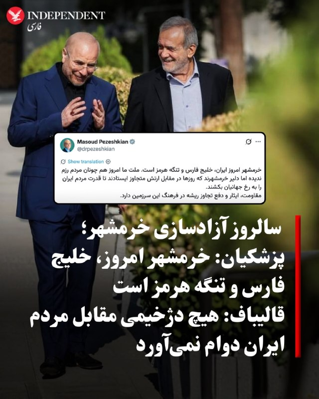

♦️مقام‌های جمهوری اسلامی به مناسبت سوم خرداد، سالروز آزادسازی خرمشهر، پیام‌ها و اظهاراتی منتشر کردند و از این روز به عنوان نماد «مقاومت» و «ایستادگی» یاد کردند.
مسعود پزشکیان، رئیس‌جمهوری اسلامی در شبکه اجتماعی اکس نوشت: «خرمشهر امروز ایران، خلیج فارس و تنگه هرمز است.» او افزود: «ملت ما امروز هم چونان مردم رزم‌ندیده اما دلیر خرمشهرند که روزها در مقابل ارتش متجاوز ایستادند تا قدرت مردم ایران را به رخ جهانیان بکشند. مقاومت، ایثار و دفع تجاوز ریشه در فرهنگ این سرزمین دارد.»
همزمان محمدباقر قالیباف، رئیس مجلس شورای اسلامی، در پیامی به مناسبت سالروز آزادسازی خرمشهر گفت: «هیچ دژخیمی را یارای ایستادن مقابل سربازان عاشق و مومن ایران نیست.»
او در بخشی از پیام خود، سوم خرداد را «طلوع فجر رشادت مجاهدانی» توصیف کرد که «خرمشهر عزیز را از حلقوم جنایتکاری چون صدام و رژیم بعث بیرون کشیدند».
خرمشهر پس از آغاز جنگ ایران و عراق در مهر ۱۳۵۹ به اشغال ارتش عراق درآمد و پس از حدود ۱۹ ماه، در سوم خرداد ۱۳۶۱ و در جریان عملیات «بیت‌المقدس» توسط نیروهای ایرانی بازپس گرفته شد.
‌🇸🇦 Indypersian

🤖 @VahidOOnLine

## VahidOOnLine — post 241879

  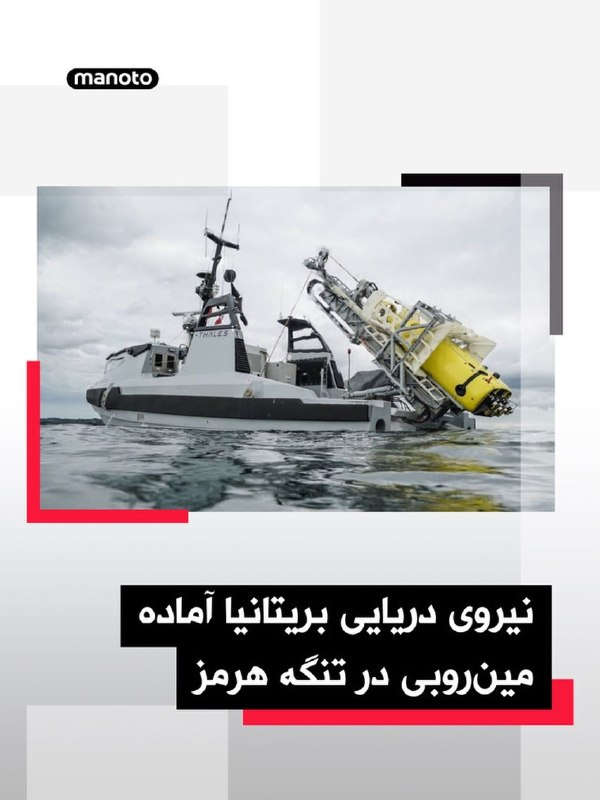

نیروی دریایی بریتانیا اعلام کرده صدها ملوان این کشور در جبل‌الطارق آماده‌اند تا در صورت دستیابی آمریکا و جمهوری اسلامی به توافق صلح، برای پاکسازی احتمالی مین‌ها در تنگه هرمز اعزام شوند.

بر اساس گزارش آسوشیتدپرس، کشتی پشتیبانی آراف‌ای لایم بِی متعلق به نیروی دریایی سلطنتی بریتانیا در جبل‌الطارق مستقر است و با مهمات و پهپادهای دریایی مین‌یاب مجهز به سونار آماده عملیات احتمالی شده است. این مأموریت قرار است با همکاری بریتانیا و فرانسه انجام شود.

اولویت نخست این عملیات، در صورت اجرا، پاکسازی یک مسیر عبور در تنگه هرمز برای خروج حدود ۷۰۰ کشتی عنوان شده است. پس از آن، مسیر مقابل برای ورود کشتی‌ها پاکسازی خواهد شد؛ هرچند مقام‌ها گفته‌اند پاکسازی کامل تنگه ممکن است ماه‌ها یا حتی سال‌ها زمان ببرد.
‌🏁 🇬🇧 ManotoTV

🤖 @VahidOOnLine

## VahidOOnLine — post 241878

  

محمد اسحاق دار، وزیر خارجه پاکستان، اعلام کرد در تماس تلفنی با دونالد ترامپ درباره مذاکرات میان آمریکا و جمهوری اسلامی گفت‌وگو کرده است.

او این گفت‌وگوی «مهم» را «گامی قابل‌توجه به سوی صلح منطقه‌ای» توصیف کرد و گفت دستاوردهای مذاکرات اخیر، زمینه خوش‌بینی نسبت به یک نتیجه مثبت و پایدار را فراهم کرده است.

پاکستان در روزهای اخیر نقش میانجی کلیدی میان آمریکا و جمهوری اسلامی را برعهده داشته است. اسحاق دار همچنین از «رهبری» ترامپ و «تعهد او به گفت‌وگو و دیپلماسی» تقدیر کرد.
‌🏁 🇬🇧 ManotoTV

🤖 @VahidOOnLine

## VahidOOnLine — post 241877

  

سرویس مخفی آمریکا در بیانیه‌ای اعلام کرد فردی مسلح عصر شنبه در نزدیکی خیابان ۱۷ و پنسیلوانیا، در محدوده کاخ سفید، پس از بیرون آوردن سلاح از کیف خود به سمت ماموران تیراندازی کرد.

ماموران سرویس مخفی در پاسخ به او شلیک کردند و مظنون پس از انتقال به بیمارستان جان باخت. در جریان این تیراندازی، یک رهگذر نیز هدف گلوله قرار گرفت. سرویس مخفی گفته هنوز مشخص نیست این فرد با شلیک مظنون زخمی شده یا در تبادل آتش میان او و ماموران.

بر اساس تصاویر منتشرشده از سلینا وانگ، خبرنگار ای‌بی‌سی نیوز، هم‌زمان با شنیده‌شدن صدای تیراندازی در نزدیکی کاخ سفید، خبرنگاران حاضر در محوطه به سمت اتاق نشست خبری منتقل شدند.

سرویس مخفی اعلام کرد هیچ‌یک از نیروهایش در این حادثه آسیب ندیده‌اند. دونالد ترامپ هنگام وقوع تیراندازی در کاخ سفید حضور داشت، اما این حادثه تاثیری بر او یا عملیات حفاظتی نداشته است. تحقیقات درباره این تیراندازی ادامه دارد. جزئیات اصلی با گزارش رویترز و آسوشیتدپرس هم‌خوانی دارد
‌🏁 🇬🇧 ManotoTV

🤖 @VahidOOnLine

## VahidOOnLine — post 241876

  <a href="telegram/content/VahidOOnLine_241876_1779610304.mp4" target="_blank">🎬 Download video</a>

تصاویر منتشرشده از سلینا وانگ، خبرنگار ای‌بی‌سی نیوز، لحظه‌ای را نشان می‌دهد که هم‌زمان با شنیده‌شدن صدای تیراندازی در نزدیکی کاخ سفید، خبرنگاران حاضر در محوطه به سمت اتاق نشست خبری منتقل شدند.

سرویس مخفی آمریکا اعلام کرد یک مرد مسلح در نزدیکی ایست بازرسی خیابان ۱۷ و پنسیلوانیا به سوی ماموران شلیک کرد. ماموران نیز در پاسخ تیراندازی کردند و مظنون که به بیمارستان منتقل شده بود، بعداً جان باخت.

در جریان این تیراندازی یک رهگذر نیز زخمی شد. هنوز مشخص نیست این فرد با شلیک مظنون زخمی شده یا در جریان تبادل آتش. دونالد ترامپ هنگام وقوع حادثه در کاخ سفید بود، اما آسیبی ندید.
‌🏁 🇬🇧 ManotoTV

🤖 @VahidOOnLine

## WithYashar — post 12299

## WithYashar — post 12298

  

B2 رسید
@withyashar

## WithYashar — post 12297

## WithYashar — post 12296

## WithYashar — post 12295

انتقاد تند تد کروز، سناتور مطرح جمهوری‌خواه از اخبار توافق آمریکا و ایران :

به‌شدت نگران چیزهایی هستم که درباره توافق احتمالی با ایران می‌شنویم؛ توافقی که بعضی صداها داخل دولت آمریکا دارن برایش فشار میارن.
تصمیم ترامپ برای حمله به ایران، مهم‌ترین تصمیم دوره دوم ریاست‌جمهوریش بود. او کار درستی انجام داد و ما به نتایج نظامی فوق‌العاده‌ای رسیدیم؛ از جمله نابودی تمام موشک‌ها و پهپادهای ایران و غرق کردن کل نیروی دریایی‌شان.
اگر نتیجه همه این‌ها این باشد که حکومت ایران — که هنوز توسط اسلام‌گراهایی اداره می‌شود که شعار «مرگ بر آمریکا» می‌دهند — حالا میلیاردها دلار دریافت کند، بتواند اورانیوم غنی‌سازی کند و سلاح هسته‌ای توسعه دهد و کنترل مؤثری روی تنگه هرمز داشته باشد، آن وقت این یک اشتباه فاجعه‌بار خواهد بود.
جزئیات هنوز کامل منتشر نشده و امیدوارم گزارش‌های اولیه اشتباه باشند؛ اما اینکه راب مالیِ دولت بایدن از این توافق تعریف کرده، اصلاً امیدوارکننده نیست.
ترامپ به «صلح از طریق قدرت» اعتقاد دارد و رهبری قدرتمند او همین حالا آمریکا را امن‌تر کرده. او باید همچنان محکم بایستد، از آمریکا دفاع کند و خطوط قرمزی را که بارها اعلام کرده، اجرا کند.
@withyashar

## WithYashar — post 12294

دلم میخواد یه ویس بی‌پروا بدم ولی افسوس ….

## WithYashar — post 12293

خامنه ای کپک زد
ترامپ به ما کلک زد🤣
@withyashar

## WithYashar — post 12292

کانال 12 اسرائیل به نقل از یک مقام ارشد اسرائیلی:

توافق احتمالی اصلاً خوب نیست؛ چون به ایرانی‌ها این پیام رو میده که سلاحشون به اندازه بمب هسته‌ای خطرناکه و اونم تنگه هرمزه؛ ترامپ هم فکر میکنه این توافق فقط اقتصادی هست و شامل باز شدن متقابل تنگه هرمز میشه، ولی هر قدمی برای حل مسئله هسته‌ای وابسته به خروج اورانیوم ها هست. و اصلا معلوم نیست بعد از مرحله اول اصلاً چی پیش میاد.
@withyashar

## WithYashar — post 12291

وزیر امور خارجه آمریکا :
«ترامپ اجازه نمیده ایران به سلاح هسته ای دسترسی پیدا کنه احتمالاً جهان در ساعات آینده، به ویژه در مورد تنگه هرمز، اخبار خوبی خواهد شنید»
@withyashar

## WithYashar — post 12290

تسنیم : پیش‌نویس توافق با واشنگتن تصریح می‌کند که وضعیت حاکمیتی تنگه هرمز به شرایط قبل از جنگ برنمی‌گردد و تنها تعداد کشتی‌های عبوری ظرف ۳۰ روز، همزمان با لغو کامل محاصره دریایی و اجرای تعهدات ایالات متحده، به حالت عادی باز می‌گردند. تهران بر حفظ حق حاکمیتی خود بر این تنگه اصرار دارد.
@withyashar

## WithYashar — post 12289

وزیر امور خارجه آمریکا :
«هیچ کشوری نباید از گذرگاه‌های دریایی یا حریم هوایی سوءاستفاده کند و آزادی کشتیرانی باید تضمین شود»
@withyashar

## WithYashar — post 12288

کانال 14 اسرائیل : ایران تنگه رو بدون هیچ عوارضی باز می‌کنه و آمریکا هم هیچ پولی نمی‌ده و تحریمی رو برنمیداره فقط اجازه میده به ایران بتونه یکم نفت بفروشه ، احتمالأ اسرائیل هم حملاتش به لبنان رو قطع میکنه ، خلاصه اگه پذیرفته بشه یه آتش بس 30 الی 60 روزس که برای مذاکره داده شده بدون هیچ امتیازی اجازه نفس کشیدن میده به جهان
@withyashar

## WithYashar — post 12287

اکسیوس؛شرایط پیشنهادی تفاهم‌نامه آمریکا و ایران:
🚨🚨🚨🚨🚨🚨🚨
آتش‌بس ۶۰ روزه بین دو طرف.
بازگشایی تنگه هرمز بدون عوارض.
پاکسازی مین‌های دریایی در تنگه توسط ایران.
رفع محاصره بنادر ایران توسط آمریکا.
معافیت‌های تحریمی که به ایران اجازه صادرات نفت رو میده.
تعهد ایران به مذاکرات درباره تعلیق غنی‌سازی اورانیوم.
مذاکره ایران درباره حذف ذخایر اورانیوم بسیار غنی‌شده.
مذاکره آمریکا درباره رفع تحریم‌ها و آزادسازی دارایی‌های ایران در دوره ۶۰ روزه.
باقی‌موندن نیروهای آمریکایی در منطقه طول مذاکرات.
پایان گزارش‌شده جنگ اسرائیل و حزب‌الله در چارچوب این توافق.
@withyashar

## WithYashar — post 12286

کابینه جنگ اسرائیل امشب تشکیل خواهد داد
@withyashar

## WithYashar — post 12285

  

عکس فرد مهاجم ۲۱ ساله در نزدیکی کاخ‌سفید

@withyashar

## WithYashar — post 12284

احتمال از سرگیری روابط دیپلماتیک ایران و آمریکا

آکسیوس به نقل از مشاوران ترامپ:
رئیس جمهور آماده است در صورت برآورده شدن خواسته‌هایش در مورد برنامه هسته‌ای، روابط با ایران را از سر بگیرد.
@withyashar

## WithYashar — post 12283

  

ترامپ در تروث : از سرویس مخفی و نیروی انتظامی عالی‌مون به خاطر اقدام سریع و حرفه‌ای که امشب علیه یک فرد مسلح در نزدیکی کاخ سفید، که سابقه خشونت‌آمیز و احتمالاً وسواس فکری نسبت به گرامی‌ترین بنای کشورمون داشت، انجام شد، سپاسگزاریم.
فرد مسلح بعد از درگیری با مأموران سرویس مخفی در نزدیکی دروازه‌های کاخ سفید کشته شد.
این اتفاق یک ماه بعد از تیراندازی در ضیافت شام خبرنگاران کاخ سفید رخ داد
برای همه روسای جمهور آینده مهمه که امن‌ترین و مطمئن‌ترین فضایی رو که تاالان در واشنگتن دی سی ساخته شده، داشته باشن.
@withyashar

## WithYashar — post 12282

  <a href="telegram/content/WithYashar_12282_1779610307.webm" target="_blank">🎬 Download video</a>

🎬 Video

## WithYashar — post 12281

تیرانداز به هلاکت رسید و فرد حاضر زنده و هوشیار است. هر دو به بیمارستان منتقل شده‌اند.
@withyashar

## WithYashar — post 12280

  

سرویس مخفی پس از شروع تیراندازی در سمت غرب کاخ سفید به یک مظنون مسلح شلیک کرد، به گزارش فاکس نیوز.

یک عابر پیاده در این حادثه زخمی شد و تأیید شده است که رئیس‌جمهور ترامپ در امنیت است.
@withyashar

## mwarmonitor — post 9616

🔴در حالی که ترافیک دریایی در دوره 30 روزه اختصاص داده شده برای مذاکرات هسته‌ای تسهیل خواهد شد، سوال اساسی همچنان باقی است: آیا ایالات متحده این ترتیبات موقت را خواهد پذیرفت یا بر بازگشایی کامل و بدون قید و شرط تنگه قبل از امضای هرگونه توافقی اصرار خواهد ورزید؟…

## mwarmonitor — post 9615

🔴توافقی ایرانی-آمریکایی در حال شکل‌گیری است: پیچیده‌ترین اختلافات همچنان حل‌نشده باقی مانده‌اند. 🔸نویسنده: علی هاشم خبرنگار الجزیره به گفته چندین منبع منطقه‌ای آشنا با مذاکرات، طرف‌های درگیر در مذاکرات در حال بررسی پیش‌نویس چارچوبی برای یک توافق جامع احتمالی…

## mwarmonitor — post 9614

🔴توافقی ایرانی-آمریکایی در حال شکل‌گیری است: پیچیده‌ترین اختلافات همچنان حل‌نشده باقی مانده‌اند.

🔸نویسنده: علی هاشم خبرنگار الجزیره

به گفته چندین منبع منطقه‌ای آشنا با مذاکرات، طرف‌های درگیر در مذاکرات در حال بررسی پیش‌نویس چارچوبی برای یک توافق جامع احتمالی بین ایران و ایالات متحده هستند. اگر توافق نهایی حاصل شود، این مهمترین گام دیپلماتیک از زمان آتش‌بس با میانجیگری پاکستان خواهد بود که به جنگی تقریباً شش هفته‌ای پایان داد. این جنگ در 28 فوریه با ترور آیت‌الله علی خامنه‌ای، رهبر وقت ایران، در یک حمله هماهنگ علیه مقامات ارشد و زیرساخت‌های حیاتی در داخل ایران آغاز شد.

این جنگ، منطقه را به شیوه‌ای که هیچ‌کس کاملاً پیش‌بینی نکرده بود، تغییر شکل داد. این جنگ حزب‌الله را ظرف چند روز به نبرد مستقیم کشاند و منجر به بسته شدن تنگه هرمز، گلوگاه دریایی که یک پنجم نفت دریایی جهان از آن عبور می‌کند، شد. همچنین باعث یک دور مذاکرات مستقیم بین ایران و ایالات متحده در اسلام‌آباد شد که بدون نتیجه پایان یافت و همزمان یک مسیر مذاکره جداگانه، هرچند شکننده، بین لبنان و اسرائیل را گشود. امروز، با وجود آتش‌بس برقرار شده اما فاقد یک چارچوب روشن و رسمی، به نظر می‌رسد طرفین در تلاشند تا به سمت یک توافق پایدارتر حرکت کنند.

به گفته منابع عرب و ایرانی که با الجدا صحبت کردند، پیش‌نویس توافق شامل توقف خصومت‌ها در تمام جبهه‌ها، از جمله لبنان، آزادسازی میلیاردها دلار از دارایی‌های مسدود شده ایران، لغو محاصره دریایی ایالات متحده و خروج نیروهای آمریکایی از مناطق نزدیک ایران است. در مرحله بعد، طرفین یک دوره 30 روزه برای رسیدن به تفاهم در مورد مسئله هسته‌ای به خود اختصاص می‌دهند و امکان تمدید مذاکرات با توافق متقابل نیز وجود دارد.

دو ضمیمه و یک توافقنامه

ساختار توافق پیشنهادی پیچیده‌تر از یک یادداشت تفاهم واحد است. به گفته یک منبع آگاه از ساختار این توافق، آنچه دونالد ترامپ، رئیس جمهور آمریکا، علناً به آن اشاره کرد، در واقع مربوط به دو ضمیمه جداگانه است که به یادداشت اصلی پیوست خواهند شد، در حالی که مذاکرات در مورد جزئیات آنها هنوز ادامه دارد.

مهم‌ترین نکته در اینجا مسئله زمان‌بندی است. به نظر می‌رسد مفاد مالی و امنیتی به گونه‌ای طراحی شده‌اند که منافع متقابل ملموسی ایجاد کنند که هر دو طرف را وادار می‌کند با چیزی برای از دست دادن وارد مذاکرات هسته‌ای شوند: کاهش تحریم‌ها، کاهش تنش نظامی و بازگشایی تنگه هرمز.

یکی از این پیوست‌ها مربوط به دارایی‌های مسدود شده ایران در خارج از کشور به دلیل تحریم‌های ایالات متحده است. به گفته یک منبع منطقه‌ای سطح بالا، تقریباً ۵۰٪ از این وجوه، یا حدود ۱۲ میلیارد دلار، در حال حاضر در قطر، عراق و ترکیه نگهداری می‌شود. این منبع توضیح داد که قطر «نقش محوری» در پیشبرد این روند مذاکره ایفا کرده است.

در این زمینه، تهران تصمیم گرفت با امضای تفاهم‌نامه جداگانه‌ای با دوحه، به‌ویژه در مورد این وجوه، این نقش را رسمیت بخشد. در سطح وسیع‌تر توافق، نقش قطر دیگر صرفاً میانجی نیست، بلکه به یک جزء ساختاری در روند مذاکرات تبدیل شده است.

هرمز، قلب جنگ

از همان لحظه اول جنگ، تنگه هرمز به نقطه کانونی درگیری ایران، اسرائیل و آمریکا تبدیل شد. ایران عملاً ظرف چند ساعت پس از حملات ۲۸ فوریه، تنگه را بست و اعلام کرد که هیچ کشتی خارجی بدون اجازه ایران اجازه عبور نخواهد داشت. سپاه پاسداران از طریق ارتباطات دریایی هشدارهای مستقیمی را پخش کرد، در حالی که صدها نفتکش در دریا سرگردان بودند و قیمت جهانی نفت به شدت افزایش یافت.

واشنگتن با یک عملیات هوایی که از ۱۹ مارس کشتی‌ها و تأسیسات دریایی ایران را هدف قرار داد، پاسخ داد. پس از شکست مذاکرات در اسلام‌آباد، به رهبری جی. دی. ونس، معاون رئیس‌جمهور آمریکا، و محمد باقر قالیباف، رئیس مجلس ایران، در ماه آوریل، ایالات متحده محاصره دریایی کاملی را بر کشتی‌هایی که به بنادر ایران وارد یا از آنها خارج می‌شدند، اعمال کرد.

بر اساس آتش‌بس اعلام‌شده با میانجیگری پاکستان در ۸ آوریل، ایران به‌طور موقت به برخی کشتی‌ها اجازه عبور داد، اما محاصره آمریکا به‌طور کامل برداشته نشد و ایران دیگر تنگه هرمز را به‌طور کامل باز نکرد. هر طرف، دیگری را به نقض آتش‌بس متهم می‌کرد و ترافیک دریایی بسیار پایین‌تر از سطح قبل از جنگ باقی ماند.

تهران با توجه به مرز مشترک ایران و عمان با تنگه هرمز، پیش‌نویس توافق جدید را صرفاً موضوعی مربوط به ایران و عمان می‌داند و مذاکرات در مورد این موضوع در مسقط آغاز شده است. با این حال، هنوز مشخص نیست که آیا واشنگتن این رویکرد را خواهد پذیرفت یا خیر.

@mwarmonitor

## mwarmonitor — post 9613

🔴رویترز به نقل از یک منبع ایرانی: تهران با تحویل ذخایر اورانیوم با غنای بالا خود موافقت نکرده است.

@mwarmonitor

## mwarmonitor — post 9612

  <a href="telegram/content/mwarmonitor_9612_1779610308.mp4" target="_blank">🎬 Download video</a>

🚀این احتمالاً بهترین نمایی است که تا حالا از امواج ضربه‌ای پرواز اخیر استارشیپ دیده شده.

@mwarmonitor

## mwarmonitor — post 9611

🔸داستان واقعی پشت توافق هسته‌ایِ احتمالی، لبنان است.

🔹اگر آتش‌بس شبیه نوامبر ۲۰۲۴ باشد—جایی که اسرائیل جلوی تقویت و استقرار نیروهای حزب‌الله را می‌گیرد و آن‌ها پاسخی نمی‌دهند—این حالت ایده‌آل است؛ اما احتمال وقوعش کم است.

🔸به‌زودی اسرائیل با یک انتخاب روبه‌رو می‌شود: یا خویشتنداری شبیه ۶ اکتبر، یا یک جنگ فرسایشیِ طولانی‌مدت، یا جنگی تمام‌عیار برای از میان بردن این تهدید.« آمیت سیگال خبرنگار کانال ۱۲ اسرائیل»

@mwarmonitor

## mwarmonitor — post 9610

🚨 شبکه کان اسرائیل:
نتانیاهو درباره توافق با ‎ایران با ترامپ گفت‌وگو کرده و امشب جلسه‌ای با کابینه امنیتی کوچک برگزار خواهد کرد.

@mwarmonitor

## mwarmonitor — post 9609

🚨 آژیرهای هشدار نفوذ پهپاد در شمال اسرائیل فعال شد . i24

@mwarmonitor

## mwarmonitor — post 9608

  

🛰تصاویر ماهواره‌ای با وضوح بالا، نمای روشنی از تجهیزات نیروی هوایی ایالات متحده مستقر در فرودگاه خانیا در جزیره کرت یونان ارائه می‌دهد که شامل موارد زیر است:

✈️۳ فروند هواپیمای شنود و اطلاعات سیگنالی RC-135W Rivet Joint

✈️۶ فروند هواپیمای سوخت‌رسان هوایی KC-135R

✈️۲ فروند هواپیمای جنگ الکترونیک EA-37B Compass Call

@mwarmonitor

## mwarmonitor — post 9607

🔴 گزارش‌هایی از شنیده شدن صدای انفجار در استان (السماوه) در جنوب عراق منتشر شده است؛ جزئیات این حادثه هنوز مشخص نیست.

@mwarmonitor

## mwarmonitor — post 9606

🔴به گزارش Fox News، فردی پس از تیراندازی در نزدیکی کاخ سفید توسط سرویس مخفی ایالات متحده هدف گلوله قرار گرفت. همچنین یک رهگذر نیز در این حادثه تیر خورده است. @mwarmonitor

## mwarmonitor — post 9605

به گفته این مقام آمریکایی، این رهبران شامل محمد بن زاید، رئیس‌جمهور امارات متحده عربی نیز می‌شد. همچنین رهبران عربستان سعودی، قطر، مصر، ترکیه و پاکستان که همگی در تلاش‌های میانجی‌گرانه نقش داشته‌اند، در این تماس حضور داشتند.
پاکستانی‌ها میانجی اصلی بوده‌اند که هدایت این تلاش‌ها بر عهده فیلد مارشال عاصم منیر بود؛ کسی که روزهای جمعه و شنبه در تهران حضور داشت تا این توافق را به سرانجام برساند.
ترامپ در روزهای اخیر میان پیشبرد توافق و یا راه‌اندازی موج گسترده‌ای از حملات علیه ایران مردد بود. تا عصر شنبه، او بیشتر به سمت یک راهکار دیپلماتیک تمایل پیدا کرده بود.
چه چیزهایی را باید زیر نظر داشت؟
این مقام آمریکایی گفت کاخ سفید امیدوار است اختلافات باقی‌مانده در ساعات آینده حل و فصل شود و توافق روز یکشنبه اعلام گردد.
این مقام اشاره کرد اگر ایالات متحده احساس کند ایران در مذاکرات هسته‌ای جدی نیست، این احتمال وجود دارد که توافق حتی تا پایان ۶۰ روز هم دوام نیاورد. از سوی دیگر، ایالات متحده معتقد است بحران اقتصادی ایران انگیزه لازم را برای رسیدن به یک توافق کامل جهت رفع تحریم‌ها و آزادسازی پول‌های بلوکه‌شده‌اش فراهم می‌کند.
این مقام آمریکایی گفت: «جالب خواهد بود که ببینیم ایران واقعاً تا کجا حاضر است پیش برود، اما اگر آن‌ها توانایی و تمایل تغییر مسیر خود را داشته باشند، این مرحله بعدی آن‌ها را مجبور می‌کند تصمیمات حیاتی درباره آینده کشورشان بگیرند.»

📌مشاوران ترامپ می‌گویند اگر خواسته‌های او در رابطه با برنامه هسته‌ای ایران برآورده شود، رئیس‌جمهور آماده است گام‌های بلندی برای بازتنظیمی (Reset) روابط با ایران بردارد و این فرصت را به آن‌ها بدهد تا از پتانسیل اقتصادی کامل خود، که ترامپ آن را «فوق‌العاده بزرگ» می‌داند، بهره‌مند شوند.

@mwarmonitor

## mwarmonitor — post 9604

🔴اختصاصی آکسیوس: جزئیات توافق با ایران که ترامپ در آستانه امضای آن است

🔰به گفته یک مقام آمریکایی، توافقی که ایالات متحده و ایران به امضای آن نزدیک شده‌اند، شامل یک تمدید ۶۰ روزه آتش‌بس است. در این مدت، تنگه هرمز بازگشایی خواهد شد، ایران اجازه خواهد داشت به طور آزادانه نفت بفروشد و مذاکراتی پیرامون محدود کردن برنامه هسته‌ای ایران انجام خواهد گرفت.

چرا این موضوع اهمیت دارد؟
این توافق مانع از تشدید جنگ شده و فشار بر عرضه جهانی نفت را کاهش می‌دهد. با این حال، هنوز مشخص نیست که آیا این تفاهم به یک توافق صلح پایدار منجر خواهد شد که خواسته‌های هسته‌ای پرزیدنت ترامپ را نیز برآورده کند یا خیر.
آخرین وضعیت (State of play)
هم ترامپ و هم میانجی‌ها اشاره کرده‌اند که این توافق ممکن است روز یکشنبه (امروز) اعلام شود؛ اگرچه هنوز نهایی نشده و همچنان احتمال دارد با شکست مواجه شود.
این مقام آمریکایی طرح دقیقی از پیش‌نویس فعلی را ارائه داد که بخش زیادی از آن توسط منابع دیگر نزدیک به گفتگوها تایید شده است.
این جزئیات هنوز از سوی طرف ایرانی تایید نشده است، هرچند تهران نیز سیگنال‌هایی مبنی بر نزدیک شدن به توافق ارسال کرده است.
مفاد توافق چیست؟
هر دو طرف یک یادداشت تفاهم (MOU) امضا خواهند کرد که مدت آن ۶۰ روز خواهد بود و با رضایت دوجانبه قابل تمدید است.
بازگشایی تنگه هرمز: در طول این دوره ۶۰ روزه، تنگه هرمز بدون هیچ‌گونه عوارضی باز خواهد بود و ایران موافقت می‌کند مین‌هایی را که در این تنگه کار گذاشته است، پاکسازی کند تا کشتی‌ها بتوانند به راحتی عبور کنند.
لغو محاصره و معافیت‌های نفتی: در مقابل، ایالات متحده محاصره بنادر ایران را لغو کرده و برخی معافیت‌های تحریمی را صادر می‌کند تا ایران بتواند آزادانه نفت بفروشد.
مقام آمریکایی اذعان کرد که این امر کمکی به اقتصاد ایران خواهد بود، اما در عین حال گفت که گشایش بزرگی نیز برای بازار جهانی نفت ایجاد خواهد کرد.
این مقام گفت هرچه ایرانی‌ها سریع‌تر مین‌ها را پاکسازی کنند و کشتیرانی از سر گرفته شود، محاصره نیز سریع‌تر لغو خواهد شد.
اصل کلیدی ترامپ در این توافق، «امتیاز در ازای عملکرد» (Relief for performance) است.
به گفته این مقام، ایران خواستار آزادسازی فوری دارایی‌های مسدود شده و لغو دائمی تحریمی‌ها بود، اما طرف آمریکایی اعلام کرد که این اتفاق تنها پس از برداشتن گام‌های ملموس رخ خواهد داد.
مسائل هسته‌ای که باید درباره آن‌ها مذاکره شود
به گفته این مقام آمریکایی، پیش‌نویس یادداشت تفاهم شامل تعهداتی از سوی ایران است مبنی بر اینکه هرگز به دنبال سلاح هسته‌ای نرود و درباره تعلیق برنامه غنی‌سازی اورانیوم و همچنین واگذاری ذخایر اورانیوم با غنی‌سازی بالای خود مذاکره کند.
طبق گفته دو منبع مطلع، ایران از طریق میانجی‌ها تعهدات شفاهی به آمریکا داده است که نشان می‌دهد تا چه حد مایل به دادن امتیاز در زمینه تعلیق غنی‌سازی و تحویل مواد هسته‌ای است.
ایالات متحده موافقت خواهد کرد که در طول این دوره ۶۰ روزه درباره لغو تحریم‌ها و آزادسازی دارایی‌های مسدود شده ایران مذاکره کند؛ هرچند این گام‌ها تنها به عنوان بخشی از توافق نهایی و پس از تایید اجرای آن محقق خواهند شد.
نیروهای آمریکایی که در ماه‌های اخیر در منطقه مستقر شده‌اند، در طول این دوره ۶۰ روزه باقی خواهند ماند و تنها در صورت دستیابی به توافق نهایی منطقه را ترک خواهند کرد.
ماجرای پشت پرده (The intrigue)
پیش‌نویس این یادداشت تفاهم همچنین به وضوح نشان می‌دهد که جنگ میان اسرائیل و حزب‌الله در لبنان پایان خواهد یافت.
یک مقام اسرائیلی گفت که بنیامین نتانیاهو، نخست‌وزیر اسرائیل، روز شنبه در تماس تلفنی با ترامپ نسبت به این شرط ابراز نگرانی کرده است. یک مقام آمریکایی نیز تایید کرد که نتانیاهو نسبت به ابعاد دیگری از این توافق ابراز نگرانی کرده، اما مواضع خود را محترمانه و با تکریم مطرح کرده است.
این مقام آمریکایی گفت که این یک «آتش‌بس یک‌طرفه» نخواهد بود و اگر حزب‌الله برای تسلیح مجدد یا تحریک به حملات تلاش کند، به اسرائیل اجازه داده می‌شود برای جلوگیری از آن اقدام کند: «اگر حزب‌الله درست رفتار کند، اسرائیل هم درست رفتار خواهد کرد.»
این مقام آمریکایی با اشاره به نام مستعار نتانیاهو گفت: «بی‌بی ملاحظات داخلی خود را دارد، اما ترامپ باید به منافع ایالات متحده و اقتصاد جهانی فکر کند.»
این توافق چگونه شکل گرفت؟
سه منبع آشنا با این گفتگوها گفتند که پرزیدنت ترامپ روز شنبه در یک تماس کنفرانسی نظر چندین رهبر عرب و مسلمان را درباره این توافق جویا شد و همگی از آن حمایت کردند.

## mwarmonitor — post 9603

📝عجب شاهکار کمدی-استراتژیکی! آقای «کله زرد» بعد از این همه خط‌ونشان و هزینه‌های نجومی روی دست مالیات‌دهندگان آمریکایی، عملاً خاورمیانه را شخم زد تا دوباره همه‌چیز را برگرداند به پله اول؛ منتها با چند صفر اضافه‌تر در حساب بانکی تهران. 🔸این بیانیه هالیوودی…

## mwarmonitor — post 9602

🔹یک مقام سرویس مخفی به CNN گفته است که این نهاد در حال بررسی گزارش‌هایی درباره تیراندازی در تقاطع خیابان ۱۷ و خیابان پنسیلوانیا در شمال‌غرب واشینگتن است؛ محلی که درست در خارج از مجموعه کاخ سفید قرار دارد. @mwarmonitor

## mwarmonitor — post 9601

  <a href="telegram/content/mwarmonitor_9601_1779610310.mp4" target="_blank">🎬 Download video</a>

📝بررسی کارنامه مذهبی که بقای خود را در گرو ترور، سرکوب و ویرانی می‌بیند، هیچ شکلی از تردید را باقی نمی‌گذارد. شیعه سانان رافضی که با بی‌رحمی تمام، اینترنت نود میلیون انسان را ماه‌ها قطع می‌کند، دستش به خون چهل و پنج هزار انسان بیگناه آلوده است و با شلیک موشک به چهار گوشه منطقه، امنیت خاورمیانه را به گروگان می‌گیرد، هرگز به کابل‌های ارتباطی جهان و ابزارهای پیوند بشریت رحم نخواهد کرد. این فرقه، نماد عینی دنائت و تهدیدی افسارگسیخته برای تمدن بشری است؛ تفکری مخرب و ذاتاً جنایت‌کار که اگر به سلاح کشتار جمعی و بمب اتم دست یابد، حتی برای نابودی خود و اطرافیانش نیز درنگ نخواهد کرد. دنیا با جانیانی روبه‌روست که منطقشان چیزی جز قطع شریان‌های حیاتی جامعه جهانی و بازگرداندن انسان‌ها به تاریکی و انزوا نیست.

@mwarmonitor

## FoxNewsTwitter — post 342178

Fox News (Twitter/X)

The White House was placed on lockdown after shots were fired near a checkpoint. President Trump was at the White House during the incident.

The suspect, identified as 21-year-old Nasire Best of Maryland, was shot by Secret Service and died on the way to GW Medical Center. One civilian bystander was injured in the shooting.

Officials said the suspect had previous encounters with Secret Service, including making threats, and also had a history of mental health issues.

No injuries were sustained by Secret Service personnel.

## FoxNewsTwitter — post 342177

  

Fox News (Twitter/X)

BREAKING: The gunman who opened fire near the White House on Saturday afternoon has been identified as 21-year-old Nasire Best of Maryland. He was shot by Secret Service agents and died on the way to the hospital.

Best allegedly had multiple prior encounters with the Secret Service and had a history of mental health issues.

Best was detained by Secret Service on June 26, 2025, for flagging down agents and making threats, and again on July 10, 2025 for entering a restricted area, FOX News has learned.

## FoxNewsTwitter — post 342176

‌Fox News (Twitter/X)

Federal officials have served subpoenas to Marxist political influencer Hasan Piker and CodePink cofounder Susan Medea Benjamin as part of a wider investigation into whether U.S. organizations and leaders violated U.S. laws and sanctions in supporting Cuba's communist regime, Fox News Digital has learned.

## FoxNewsTwitter — post 342175

  <a href="telegram/content/FoxNewsTwitter_342175_1779610312.mp4" target="_blank">🎬 Download video</a>

Fox News (Twitter/X)

NEW: The suspect in the shooting near the White House is dead, and one bystander was wounded, according to the White House. FOX News' Alex Hogan breaks down the moments leading up to the incident.

## FoxNewsTwitter — post 342174

  <a href="telegram/content/FoxNewsTwitter_342174_1779610313.mp4" target="_blank">🎬 Download video</a>

Fox News (Twitter/X)

JUST IN: FOX News' Chad Pergram reports that two people were wounded in a shooting near the White House, and that the lockdown has been lifted.

## FoxNewsTwitter — post 342173

  <a href="telegram/content/FoxNewsTwitter_342173_1779610315.mp4" target="_blank">🎬 Download video</a>

Fox News (Twitter/X)

BREAKING: FOX News' Chad Pergram reports on shots fired near the White House, says Secret Service took down shooter.

## pm_afshaa — post 91368

🔴ربیو:هیچ مسیر آبی بین‌المللی و هیچ فضای هوایی بین‌المللی نباید هرگز توسط هیچ کشوری در جهان استفاده یا ملی‌سازی شود

💧 Rainbet.com the #1 Non-KYC Crypto Casino & Sportsbook @rainbetcom

😁 @Pm_Afshaa

## pm_afshaa — post 91367

  <a href="telegram/content/pm_afshaa_91367_1779610317.webm" target="_blank">🎬 Download video</a>

🔴مارکو روبیو:
احتمالاً امروز اخبار بیشتری درباره ایران منتشر بشه؛ این احتمال وجود داره که جهان در ساعات آینده اخبار خوبی بشنوه.

💧 Rainbet.com the #1 Non-KYC Crypto Casino & Sportsbook @rainbetcom

😁 @Pm_Afshaa

## pm_afshaa — post 91366

  <a href="telegram/content/pm_afshaa_91366_1779610317.webm" target="_blank">🎬 Download video</a>

🔴روبیو، وزیر خارجه آمریکا: زمانی که درگیری با ایران آغاز شد، هدف ما از بین بردن توانایی‌های دریایی و سامانه‌های موشکی آنها بود و به اهداف عملیات دست یافتیم.

ما در 48 ساعت گذشته پیشرفت هایی در طرح کلی که ممکنه بحران تنگه هرمز رو حل کنه، داشتیم.

💧 Rainbet.com the #1 Non-KYC Crypto Casino & Sportsbook @rainbetcom

😁 @Pm_Afshaa

## pm_afshaa — post 91365

  <a href="telegram/content/pm_afshaa_91365_1779610317.webm" target="_blank">🎬 Download video</a>

🔴شرایط پیشنهادی تفاهم‌نامه آمریکا و ایران طبق گزارش آکسیوس : - آتش‌بس 60 روزه بین دو طرف. - بازگشایی تنگه هرمز بدون عوارض. - پاکسازی مین‌های دریایی در تنگه توسط ایران. - رفع محاصره بنادر ایران توسط آمریکا. - معافیت‌های تحریمی که به ایران اجازه صادرات نفت…

## pm_afshaa — post 91364

  <a href="telegram/content/pm_afshaa_91364_1779610318.webm" target="_blank">🎬 Download video</a>

🔴تسنیم: برای حل و فصل موضوع تنگه هرمز و رفع محاصره دریایی یک دوره 30 روزه تعیین میشه. مهلتی 60 روزه برای مذاکرات هسته‌ای تعیین میشه. ایران در حال حاضر با هیچ چیز در زمینه هسته‌ای موافقت نکرده.

💧 Rainbet.com the #1 Non-KYC Crypto Casino & Sportsbook @rainbetcom

😁 @Pm_Afshaa

## pm_afshaa — post 91363

  <a href="telegram/content/pm_afshaa_91363_1779610318.webm" target="_blank">🎬 Download video</a>

🔴تسنیم: پیش‌نویس توافق با واشنگتن تصریح می‌کند که وضعیت حاکمیتی تنگه هرمز به شرایط قبل از جنگ برنمی‌گردد و تنها تعداد کشتی‌های عبوری ظرف ۳۰ روز، همزمان با لغو کامل محاصره دریایی و اجرای تعهدات ایالات متحده، به حالت عادی باز می‌گردند. تهران بر حفظ حق حاکمیتی خود بر این تنگه اصرار داره.

💧 Rainbet.com the #1 Non-KYC Crypto Casino & Sportsbook @rainbetcom

😁 @Pm_Afshaa

## pm_afshaa — post 91362

  <a href="telegram/content/pm_afshaa_91362_1779610319.webm" target="_blank">🎬 Download video</a>

🔴کانال 12 اسرائیل به نقل از یک مقام ارشد اسرائیلی:

توافق احتمالی اصلاً خوب نیست؛ چون به ایرانی‌ها این پیام رو میده که سلاحشون به اندازه بمب هسته‌ای خطرناکه و اونم تنگه هرمزه؛ ترامپ هم فکر میکنه این توافق فقط اقتصادی هست و شامل باز شدن متقابل تنگه هرمز میشه، ولی هر قدمی برای حل مسئله هسته‌ای وابسته به خروج اورانیوم‌ها هست و اصلا معلوم نیست بعد از مرحله اول اصلاً چی پیش میاد.

💧 Rainbet.com the #1 Non-KYC Crypto Casino & Sportsbook @rainbetcom

😁 @Pm_Afshaa

## pm_afshaa — post 91361

  <a href="telegram/content/pm_afshaa_91361_1779610319.webm" target="_blank">🎬 Download video</a>

🔴شرایط پیشنهادی تفاهم‌نامه آمریکا و ایران طبق گزارش آکسیوس :

- آتش‌بس 60 روزه بین دو طرف.
- بازگشایی تنگه هرمز بدون عوارض.
- پاکسازی مین‌های دریایی در تنگه توسط ایران.
- رفع محاصره بنادر ایران توسط آمریکا.
- معافیت‌های تحریمی که به ایران اجازه صادرات نفت رو میده.
- تعهد ایران به مذاکرات درباره تعلیق غنی‌سازی اورانیوم.
- مذاکره ایران درباره حذف ذخایر اورانیوم بسیار غنی‌شده.
- مذاکره آمریکا درباره رفع تحریم‌ها و آزادسازی دارایی‌های ایران در دوره 60 روزه
- باقی‌موندن نیروهای آمریکایی در منطقه طول مذاکرات.
- پایان گزارش‌شده جنگ اسرائیل و حزب‌الله در چارچوب این توافق.

💧Rainbet.com the #1 Non-KYC Crypto Casino & Sportsbook @rainbetcom

😁 @Pm_Afshaa

## pm_afshaa — post 91360

  

مجتبی کیان امروز صبح به دلیل ارسال پیام و دادن مختصات صنایع نظامی به شبکه های ماهواره ای معاند ( ایران اینترنشنال ) توسط جمهوری اسلامی اعدام شد

💧 Rainbet.com the #1 Non-KYC Crypto Casino & Sportsbook @rainbetcom

😁 @Pm_Afshaa

## pm_afshaa — post 91359

🔴کابینه جنگ اسرائیل امشب تشکیل خواهد شد

💧 Rainbet.com the #1 Non-KYC Crypto Casino & Sportsbook @rainbetcom

😁 @Pm_Afshaa

## pm_afshaa — post 91358

عرزشیا براتون سوال نی چرا جنگنده ای که باید بیاد تو کشور حداقل نیم ساعت پرواز کنه و تو این نیم ساعت هیچ راداری هشدار نداد و رهبرتون کتلت شد

## pm_afshaa — post 91357

  

هشدار پمپئو به ترامپ:به نظر می‌رسد توافقی که با ایران در حال انجام است، به‌طور مستقیم از روی نقشه وندی شرمن-رابرت مالی-بن رودز بیرون آمده: به سپاه پاسداران پول بدهید تا یک برنامه سلاح‌های کشتار جمعی بسازد و جهان را ترور کند.
‏این اصلا ربطی به شعار «اول آمریکا» ندارد.
‏موضوع خیلی ساده است:
‏تنگه را باز کنید.
‏دسترسی ایران به پول را قطع کنید.
‏و آن‌قدر توانایی‌های ایران را هدف قرار دهید که دیگر نتواند متحدان ما در منطقه را تهدید کند خیلی دیر شده.
‏وقتشه اقدام کنن

💧 Rainbet.com the #1 Non-KYC Crypto Casino & Sportsbook @rainbetcom

😁 @Pm_Afshaa

## pm_afshaa — post 91355

🔴نیویورک تایمز: ایران موافقت کرده است که ذخیره اورانیوم غنی‌شده خود را به عنوان بخشی از توافق برای پایان دادن به جنگ واگذار کند

💧 Rainbet.com the #1 Non-KYC Crypto Casino & Sportsbook @rainbetcom

😁 @Pm_Afshaa

## pm_afshaa — post 91353

  <a href="telegram/content/pm_afshaa_91353_1779610321.webm" target="_blank">🎬 Download video</a>

🔴ان‌بی‌سی نیوز: هم‌اکنون بیرون کاخ سفید حدود 20 تا 30 تا تیر شلیک شده! سرویس مخفی آمریکا خبرنگارهایی که تو محوطه کاخ سفید بودن رو جمع کرده و برده داخل اتاق کنفرانس خبری تا ازشون محافطت کنه. 
💧 Rainbet.com the #1 Non-KYC Crypto Casino & Sportsbook @rainbetcom…

## pm_afshaa — post 91352

  <a href="telegram/content/pm_afshaa_91352_1779610321.webm" target="_blank">🎬 Download video</a>

🔴ان‌بی‌سی نیوز: هم‌اکنون بیرون کاخ سفید حدود 20 تا 30 تا تیر شلیک شده! سرویس مخفی آمریکا خبرنگارهایی که تو محوطه کاخ سفید بودن رو جمع کرده و برده داخل اتاق کنفرانس خبری تا ازشون محافطت کنه. 
💧 Rainbet.com the #1 Non-KYC Crypto Casino & Sportsbook @rainbetcom…

## pm_afshaa — post 91351

  <a href="telegram/content/pm_afshaa_91351_1779610322.webm" target="_blank">🎬 Download video</a>

🔴ان‌بی‌سی نیوز: هم‌اکنون بیرون کاخ سفید حدود 20 تا 30 تا تیر شلیک شده! سرویس مخفی آمریکا خبرنگارهایی که تو محوطه کاخ سفید بودن رو جمع کرده و برده داخل اتاق کنفرانس خبری تا ازشون محافطت کنه. 
💧 Rainbet.com the #1 Non-KYC Crypto Casino & Sportsbook @rainbetcom…

## mamlekate — post 103575

📝 نیویورک پست از طرح ترور دختر ترامپ توسط سپاه خبر داد

به گزارش نیویورک پست، ایوانکا ترامپ هدف طرح ترور منتسب به فردی آموزش‌دیده از سوی سپاه پاسداران انقلاب اسلامی بوده است. طبق گزارش، هدف از این طرح، انتقام‌گیری به خاطر کشته شدن قاسم سلیمانی بوده است.

@mamlekate

## mamlekate — post 103574

  <a href="telegram/content/mamlekate_103574_1779610322.mp4" target="_blank">🎬 Download video</a>

📝 گزارش‌ها از تیراندازی در نزدیکی کاخ سفید

رسانه‌های آمریکایی از گزارش‌های مربوط به تیراندازی احتمالی در عصر شنبه در نزدیکی چمن شمالی کاخ سفید خبر دادند.

⚡️ ماموران امنیتی و خبرنگاران در خیابان ۱۸ام و پنسیلوانیا (شمال غربی) در واشنگتن دی‌سی، در پی تیراندازی شنبه عصر در نزدیکی کاخ سفید، در منطقه حضور دارند. فرد مظنون در این تیراندازی کشته شد.

farsivoa
@mamlekate

## mamlekate — post 103573

📝 دونالد ترامپ می‌گوید جزئیات یک «یادداشت تفاهم صلح» با جمهوری اسلامی به زودی اعلام می‌شود

دونالد ترامپ، رئيس‌جمهوری آمریکا، شنبه‌ عصر گفت با شماری از رهبران منطقه از جمله مقامات عربستان، قطر، امارات درباره یک یادداشت تفاهم مربوط به صلح ایران صحبت کرده است.

@mamlekate

## VahidOnline — post 75672

  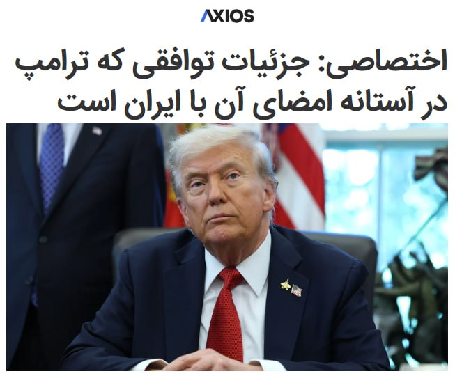

آکسیوس: جزئیات توافقی که ترامپ در آستانه امضای آن با ایران است

ترجمه ماشین:
توافقی که آمریکا و ایران در آستانه امضای آن هستند، شامل تمدید ۶۰ روزه آتش‌بس است؛ دوره‌ای که طی آن تنگه هرمز دوباره باز خواهد شد، ایران می‌تواند نفت خود را آزادانه بفروشد و مذاکراتی برای محدود کردن برنامه هسته‌ای ایران برگزار خواهد شد؛ این را یک مقام آمریکایی گفته است.

🔻چرا مهم است: این توافق از تشدید جنگ جلوگیری می‌کند و فشار بر عرضه جهانی نفت را کاهش می‌دهد. با این حال روشن نیست که آیا به یک توافق صلح پایدار منجر خواهد شد یا نه؛ توافقی که هم‌زمان خواسته‌های هسته‌ای رئیس‌جمهور ترامپ را نیز پوشش دهد.
▪️وضعیت فعلی: هم ترامپ و هم میانجی‌ها گفته‌اند ممکن است این توافق روز یکشنبه اعلام شود، هرچند هنوز نهایی نشده و همچنان ممکن است از هم بپاشد.
▪️این مقام آمریکایی طرح کلی مفصلی از پیش‌نویس فعلی ارائه کرده که بخش عمده آن را منابع دیگر نزدیک به مذاکرات نیز تأیید کرده‌اند.

🔻چه چیزهایی در توافق آمده است؟
دو طرف یک یادداشت تفاهم امضا خواهند کرد که ۶۰ روز اعتبار دارد و با رضایت متقابل قابل تمدید است.
▪️در این دوره ۶۰ روزه، تنگه هرمز بدون عوارض باز خواهد بود و ایران موافقت می‌کند مین‌هایی را که در این تنگه کار گذاشته پاکسازی کند تا کشتی‌ها آزادانه عبور کنند.
▪️در مقابل، آمریکا محاصره بنادر ایران را لغو می‌کند و برخی معافیت‌های تحریمی صادر خواهد کرد تا ایران بتواند نفت خود را آزادانه بفروشد.
▪️این مقام آمریکایی اذعان کرد که این موضوع به سود اقتصاد ایران خواهد بود اما گفت در عین حال کمک قابل توجهی برای بازار جهانی نفت خواهد بود.

🔻این مقام آمریکایی گفت هرچه ایرانی‌ها سریع‌تر مین‌ها را پاکسازی کنند و اجازه دهند کشتیرانی از سر گرفته شود، محاصره هم سریع‌تر لغو خواهد شد.
▪️اصل کلیدی ترامپ در این توافق «امتیازدهی در برابر عملکرد» است.
▪️طبق گفته این مقام، ایران خواستار آزادسازی فوری منابع مالی مسدودشده و لغو دائمی تحریم‌ها بود، اما طرف آمریکایی گفت این موارد فقط پس از ارائه امتیازهای ملموس اجرا خواهد شد.

🔻مسائل هسته‌ای هنوز باید مذاکره شوند
▪️به گفته مقام آمریکایی، پیش‌نویس یادداشت تفاهم شامل تعهد ایران به این است که هرگز به دنبال سلاح هسته‌ای نرود و درباره تعلیق برنامه غنی‌سازی اورانیوم و خارج کردن ذخایر اورانیوم با غنای بالای خود مذاکره کند.
▪️به گفته دو منبع مطلع، ایران از طریق میانجی‌ها تعهدات شفاهی درباره دامنه امتیازهایی که حاضر است در زمینه تعلیق غنی‌سازی و واگذاری مواد هسته‌ای بدهد، به آمریکا ارائه کرده است.
▪️آمریکا موافقت خواهد کرد که در دوره ۶۰ روزه درباره لغو تحریم‌ها و آزادسازی منابع مالی ایران مذاکره کند؛ هرچند این اقدامات فقط در چارچوب توافق نهایی و پس از اجرای قابل راستی‌آزمایی آن عملی خواهند شد.
▪️نیروهای آمریکایی که در ماه‌های اخیر در منطقه مستقر شده‌اند، در دوره ۶۰ روزه در منطقه باقی خواهند ماند و فقط در صورتی خارج می‌شوند که توافق نهایی حاصل شود.

🔻نکته قابل توجه: پیش‌نویس یادداشت تفاهم همچنین تصریح می‌کند که جنگ میان اسرائیل و حزب‌الله در لبنان پایان خواهد یافت.
▪️یک مقام اسرائیلی گفت بنیامین نتانیاهو، نخست‌وزیر اسرائیل، در تماس تلفنی روز شنبه با ترامپ درباره این شرط ابراز نگرانی کرد. او همچنین درباره جنبه‌های دیگر توافق نیز نگرانی‌هایی مطرح کرد، اما به گفته یک مقام آمریکایی، دیدگاه خود را با احترام و لحنی محتاطانه بیان کرد.
▪️مقام آمریکایی گفت این یک «آتش‌بس یک‌طرفه» نخواهد بود و اگر حزب‌الله برای مسلح شدن دوباره یا تحریک حملات تلاش کند، اسرائیل اجازه خواهد داشت برای جلوگیری از آن اقدام کند.
...

🔻چه باید دید: به گفته مقام آمریکایی، کاخ سفید امیدوار است اختلافات نهایی در ساعات آینده حل‌وفصل شود و توافق روز یکشنبه اعلام شود.
▪️این مقام گفت ممکن است توافق حتی کل ۶۰ روز هم دوام نیاورد، اگر آمریکا به این نتیجه برسد که ایران درباره مذاکرات هسته‌ای جدی نیست. از سوی دیگر، آمریکا معتقد است فشار اقتصادی بر ایران انگیزه‌ای برای رسیدن به توافق کامل به‌منظور رفع تحریم‌ها و آزادسازی منابع مالی این کشور ایجاد می‌کند.
▪️این مقام آمریکایی گفت: «دیدنی خواهد بود که ایران واقعا تا کجا حاضر است پیش برود؛ اما اگر آن‌ها توانایی و تمایل تغییر مسیر خود را داشته باشند، این مرحله بعدی آن‌ها را وادار خواهد کرد تصمیم‌های حیاتی درباره این بگیرند که می‌خواهند چه نوع کشوری باشند.»
▪️مشاوران ترامپ می‌گویند اگر خواسته‌های او درباره برنامه هسته‌ای ایران برآورده شود، رئیس‌جمهور آماده است برای بازتنظیم روابط با ایران و دادن فرصت به این کشور برای دنبال کردن ظرفیت کامل اقتصادی‌اش، که به نظر ترامپ «عظیم» است، اقدامات بسیار گسترده‌ای انجام دهد.
axios

📡 @VahidOnline

## VahidOnline — post 75670

اسماعیل بقائی، سخنگوی وزارت امور خارجه، در پیامی در شبکه اجتماعی ایکس با درج تصویر سنگ‌نگاره پیروزی شاپور اول ساسانی بر امپراتور روم، نوشت: «وقتی ایرانیان مهاجمان متوهم را ناکام گذاشتند.»

او در این پیام که کنایه‌ای است به محاصره دریایی بنادر ایران توسط آمریکا نوشت: «رومیان تصور می‌کردند که رم مرکز عالم است؛ اما ایرانیان این توهم را در هم شکستند.»

پیام آقای بقایی که به نحو گسترده‌ای در کانال‌های تلگرامی رسانه‌های حکومتی ایران بازنشر شده است به نظر می‌رسد که با استفاده از سنگ‌نگاره پیروزی شاپور بر امپراتوران روم در نقش رستم استان فارس بازنقش شده است.

آقای بقایی که اخیرا با حکم محمدباقر قالیباف به عنوان سخنگوی هیئت مذاکره‌کننده ایران هم منصوب شده است با اشاره به لشگرکشی مارکوس یولیوس فیلیپوس معروف به فیلیپ عرب، امپراتور روم، علیه امپراتوری ساسانیان، نوشت که لشگرکشی او «منجر به پیروزی رومیان نشد بلکه به صلحی با شروط شاپور اول ختم شد؛ امپراتور ناچار شد با واقعیت کنار بیاید.»
@VahidHeadline

📡 @VahidOnline

## VahidOnline — post 75669

  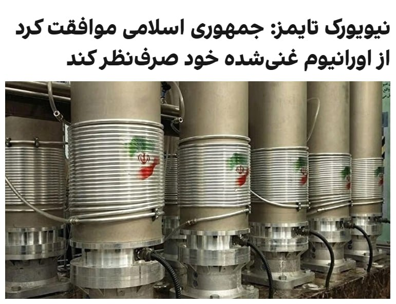

نیویورک تایمز به نقل از دو مقام آمریکایی گزارش داد، یکی از عناصر کلیدی توافق پیشنهادی میان واشنگتن و تهران، تعهد آشکار ایران به واگذاری ذخایر اورانیوم با غنی‌سازی بالای خود است؛

مقامات آمریکایی تصریح کردند که این پیشنهاد هنوز جزئیات دقیق نحوه واگذاری این ذخایر را تعیین نکرده و حل این مسئله را به دور بعدی گفتگوها درباره برنامه هسته‌ای ایران موکول کرده است، اما یک بیانیه کلی که ایران را متعهد به این کار کند، که هدف دیرینه ایالات متحده بوده، برای توافق بسیار حیاتی است، به‌ویژه اگر این توافق کلی با بدبینی جمهوری‌خواهان در کنگره مواجه شود. تا این لحظه، ایران هیچ بیانیه‌ عمومی درباره توافقی که ترامپ اعلام کرده، صادر نکرده است.

تهران در ابتدا با گنجاندن هرگونه توافقی درباره ذخایر اورانیوم غنی‌شده خود در این مرحله اولیه مخالفت کرده و خواستار موکول شدن آن به مرحله دوم گفتگوها بود، اما مذاکره‌کنندگان آمریکایی از طریق واسطه‌ها به صراحت اعلام کردند که بدون دستیابی به توافقی بر سر این ذخایر در فاز اولیه، میز مذاکره را ترک کرده و کارزار نظامی خود را از سر خواهند گرفت.

براساس این گزارش، بخش دیگری از این توافق محتمل شامل آزادسازی میلیاردها دلار از دارایی‌های بلوکه‌شده ایران در خارج از کشور است؛ اما به گفته مقامات آمریکایی، ایران تنها زمانی به بخش عمده این دارایی‌ها که قرار است توسط ایالات متحده و متحدانش در یک صندوق بازسازی قرار گیرد دسترسی پیدا خواهد کرد که با یک توافق هسته‌ای نهایی موافقت کند؛ امری که انگیزه‌ای برای تهران ایجاد می‌کند تا پای میز مذاکره بماند.
@VahidOOnLine

📡 @VahidOnline

## VahidOnline — post 75668

  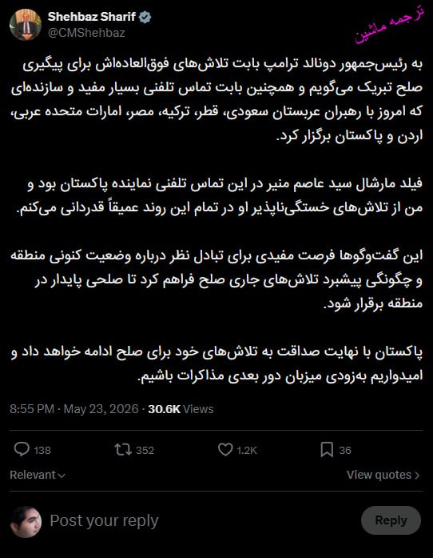

شهباز شریف، نخست‌وزیر پاکستان، ابراز امیدواری کرد پاکستان به‌زودی میزبان دور بعدی گفت‌وگوهای تهران و واشینگتن باشد.
CMShehbaz

📡 @VahidOnline

## VahidOnline — post 75666

توییت‌های تد کروز و لیندسی گراهام در واکنش به اخبار منتشر شده درباره توافق احتمالی
tedcruz, LindseyGrahamSC

📡 @VahidOnline

## VahidOnline — post 75665

  <a href="telegram/content/VahidOnline_75665_1779610323.mp4" target="_blank">🎬 Download video</a>

شنبه عصر، یک تیراندازی در حوالی کاخ سفید خبر روی داد که طی آن دو نفر از جمله یک عابر و فرد مظنون تیر خوردند.

سرویس مخفی ایالات متحده، در گزارشی اعلام کرد که اندکی پس از ساعت ۶ عصر روز شنبه، فردی در محدوده خیابان ۱۷ و خیابان پنسیلوانیا، (شمال غربی) سلاحی را از کیف خود خارج کرد و شروع به تیراندازی کرد.

سرویس مخفی ایالات متحده افزود پلیس سرویس مخفی به تیرانازی او پاسخ داد و به مظنون شلیک کرد.

به گفته سرویس مخفی،‌مظنون به یک بیمارستان محلی منتقل شد، اما در آنجا اعلام شد که جان باخته است.

به گفته این نهاد امنیی، در جریان این تیراندازی، یک عابر نیز مورد اصابت گلوله قرار گرفت و هیچ‌یک از مأموران آسیب ندیدند.

سرویس مخفی که وظیفه حفاظت از رئیس‌جمهوری آمریکا را دارد افزود دونالد ترامپ، رئیس‌جمهوری آمریکا، در زمان حادثه در کاخ سفید حضور داشت.
@VahidHeadline
آپدیت:
رسانه‌های آمریکایی هویت عامل تیراندازی عصر شنبه در مجاورت کاخ سفید را «نصیر بست»، جوان ۲۱ ساله اهل مریلند، معرفی کردند که به عنوان فردی با اختلالات روانی و عاطفی شدید برای ماموران امنیتی شناخته‌شده بوده است.

بر اساس گزارش‌ها، این فرد که پیش از این در ژوئن ۲۰۲۵ با ادعای این‌که «خدا» است یک مسیر ورودی کاخ سفید را مسدود کرده و پس از آن به یک مرکز روان‌پزشکی منتقل شده بود، به دلیل تلاش مجدد برای ورود به حریم کاخ سفید در ژوئیه همان سال، حکم دادگاه مبنی بر «ممنوعیت ورود و نزدیکی به این عمارت» را داشته است.

گزارش‌های تکمیلی نشان می‌دهد که «نصیر بست» دست‌کم در یک پست رسانه‌های اجتماعی تمایل خود را برای آسیب رساندن به دونالد ترامپ ابراز کرده بود؛ او سرانجام پس از نقض حکم دادگاه، نزدیک شدن به ایست بازرسی خیابان هفدهم و پنسیلوانیا و گشودن آتش به سمت ماموران، در تبادل آتش متقابل با نیروهای سرویس مخفی هدف قرار گرفت و در بیمارستان جان باخت.
📷 @VahidOOnLine

📡 @VahidOnline

## IranIntlTV — post 338719

  <a href="telegram/content/IranIntlTV_338719_1779610324.mp4" target="_blank">🎬 Download video</a>

بر اساس ویدیوهای ارسال‌شده به ایران‌اینترنشنال گروهی از ایرانیان مقیم فنلاند، علیه جمهوری اسلامی در شهر تورکو تجمع کرده و سرود «ای ایران» را همخوانی کردند.

## IranIntlTV — post 338718

  

مارکو روبیو، وزیر خارجه آمریکا در نشست خبری با وزیر خارجه هند گفت: «ممکن است طی ساعات آینده خبرهای خوبی، دست‌کم درباره تنگه هرمز منتشر شود.» وزیر خارجه آمریکا گفت که این کشور به هدف خود برای کاهش قابل توجه توان موشکی جمهوری اسلامی دست یافته است.

او افزود: «طی ۴۸ ساعت گذشته با همکاری شرکای خود در منطقه روی چارچوبی کار کرده‌ایم که در صورت موفقیت، نه تنها به باز ماندن کامل تنگه هرمز بدون عوارض منجر می‌شود بلکه به برخی مسائل اساسی مرتبط با جاه‌طلبی‌های هسته‌ای جمهوری اسلامی نیز خواهد پرداخت.»
iranintl.com/202605244321

## IranIntlTV — post 338717

  

حسن عبدلیان‌پور، رییس مرکز وکلای قوه قضاییه گفت که بزرگ‌ترین خسارت معنوی وارده به ما، کشته شدن «ناجوانمردانه رهبر شهید» در محل کارش به دست آمریکا و اسرائیل است و ما به «خونخواهی امام شهید»، قصد داریم از ۹۰ میلیون مردم ایران برای اقامه دعوی وکالت اخذ کنیم.

او افزود: «در این مسیر کوتاه نمی‌آییم و جنایتکاران را رها نمی‌کنیم و نمی‌گذاریم خون شهدا پایمال شود.»
iranintl.com/202605247665

## IranIntlTV — post 338716

  <a href="telegram/content/IranIntlTV_338716_1779610326.mp4" target="_blank">🎬 Download video</a>

ویدیوی رسیده به ایران اینترنشنال نشان می‌دهد روز شنبه دوم خرداد تعدادی از دانش‌آموزان مدارس در خرم‌آباد برای اعتراض به شیوه امتحانات خود و اظهارات مسئولان برای حضوری کردن امتحانات، مقابل ساختمان آموزش و پرورش تجمع کردند. آن‌ها شعار «مجازی مجازی»‌ سر داده و خواستار غیرحضوری شدن امتحانات شدند.

## IranIntlTV — post 338715

  

مارکو روبیو، وزیر خارجه آمریکا در نشست خبری با وزیر خارجه هند گفت که آزادی ناوبری و کشتیرانی باید تضمین شود و تنگه هرمز یک آبراه بین‌المللی است و جمهوری اسلامی مالک آن نیست.

روبیو گفت که در مذاکرات با جمهوری اسلامی پیشرفت قابل توجهی حاصل شده اما پیشرفت نهایی حاصل نشده است.
iranintl.com/202605240620

## IranIntlTV — post 338714

  <a href="telegram/content/IranIntlTV_338714_1779610328.mp4" target="_blank">🎬 Download video</a>

بر اساس ویدیوهای ارسال‌شده به ایران‌اینترنشنال گروهی از ایرانیان مقیم هلیفکس در کانادا، علیه جمهوری اسلامی تجمع برگزار کردند.

## IranIntlTV — post 338713

  

مسعود پزشکیان در نشستی با مدیران سازمان صداوسیما گفت: «هیچ تصمیمی خارج از چارچوب شورای‌عالی امنیت ملی و بدون هماهنگی و اذن رهبری اتخاذ نخواهد شد.»

او افزود: «هنگامی که تصمیمی در حوزه دیپلماسی اتخاذ می‌شود، همه دستگاه‌ها، تریبون‌ها و جریان‌ها باید از آن حمایت کنند.»

او ادامه داد: «همواره تلاش کرده‌ام سخنی بر خلاف نظر رهبری بیان نشود و یا موضعی اتخاذ نگردد که به اختلاف میان ارکان حاکمیت دامن بزند و دشمن از آن سوءاستفاده کند.»
https://iranintl.com/202605244166

## IranIntlTV — post 338712

  <a href="telegram/content/IranIntlTV_338712_1779610331.mp4" target="_blank">🎬 Download video</a>

پیر پولی‌اِور، رهبر حزب محافظه‌کار کانادا، در جمع ایرانیان مقیم ونکوور با اعلام حمایت خود از مردم ایران گفت دولت کانادا در اخراج عوامل جمهوری اسلامی ضعیف عمل کرده و تاکید کرد که به باور او حکومت ایران دیگر مشروعیت ندارد.
@iranintltv

## IranIntlTV — post 338711

  <a href="telegram/content/IranIntlTV_338711_1779610332.mp4" target="_blank">🎬 Download video</a>

ویدیوهای رسیده به ایران‌اینترنشنال نشان می‌دهند گروهی از ایرانیان مقیم هلند شنبه دوم خرداد علیه جمهوری اسلامی در خیابان‌های شهر لاهه راهپیمایی کردند و شعار «مرگ بر سه فاسد، ملا چپی مجاهد» سردادند.

## IranIntlTV — post 338710

  <a href="telegram/content/IranIntlTV_338710_1779610333.mp4" target="_blank">🎬 Download video</a>

بر اساس ویدیوهای رسیده به ایران‌اینترنشنال، ایرانیان مقیم بریتانیا شنبه دوم خرداد علیه جمهوری اسلامی در لندن تجمع کرده و فریاد زدند: «سپاه تروریست است»

## IranIntlTV — post 338709

  

احمد کرمی‌راد، عضو هیات‌مدیره انجمن سازه‌های فولادی، گفت که تولید ۱۱ میلیون تن فولاد در جنگ اخیر مختل شده و طبق آخرین عرضه فولاد مبارکه، قیمت واقعی فولاد به حدود دو برابر رسیده است.

او ادامه داد: «ما به دنبال راهکاری هستیم تا بتوانیم از این بحران عبور کنیم.» او افزود: «تعادل بازار عرضه و تقاضا در حال حاضر از بین رفته است.»
iranintl.com/202605241945

## IranIntlTV — post 338708

  <a href="telegram/content/IranIntlTV_338708_1779610335.mp4" target="_blank">🎬 Download video</a>

ویدیوهای رسیده به ایران‌اینترنشنال نشان می‌دهند گروهی از ایرانیان مقیم استرالیا یکشنبه سوم خرداد علیه جمهوری اسلامی در خیابان‌های شهر سیدنی راهپیمایی کردند و شعار «جانم فدای ایران» سردادند.

## IranIntlTV — post 338707

  <a href="telegram/content/IranIntlTV_338707_1779610337.mp4" target="_blank">🎬 Download video</a>

یک مقام اسرائیلی به کانال ۱۲ این کشور گفت توافق احتمالی میان آمریکا و جمهوری اسلامی شبیه توافقی است که در آن واشینگتن «هزینه را نقد» می‌پردازد و تعهدات طرف مقابل نامشخص می‌ماند.

گفت‌وگو با منشه امیر، کارشناس امور خاورمیانه
@iranintltv

## IranIntlTV — post 338706

  

خبرگزاری تسنیم، وابسته به سپاه پاسداران، با اشاره به توافق احتمالی میان جمهوری اسلامی و آمریکا، نوشت که شنیده‌ها از جزییات تفاهم اولیه «احتمالی»، حاکی است که واشینگتن متعهد خواهد شد در طول دوره مذاکرات، تحریم‌های نفتی ایران را به حالت اسقاط درآورد و جمهوری اسلامی در مقطع کنونی هیچ اقدامی را در حوزه هسته‌ای نپذیرفته است.

این گزارش افزود در صورتی که این تفاهم‌نامه مورد توافق قرار گیرد، بخشی از دارایی‌های بلوکه شده حکومت ایران باید در گام اول آزاد شود.
iranintl.com/202605244256

## IranIntlTV — post 338705

  <a href="telegram/content/IranIntlTV_338705_1779610339.mp4" target="_blank">🎬 Download video</a>

یک شهروند با ارسال پیامی به ایران‌اینترنشنال خطاب به ترامپ می‌گوید: «شما به مردم ایران گفتی کمک در راه است، پس چرا با حکومت کودک‌کش مذاکره می‌کنی؟ تا چه زمانی می‌خواهی به ساز جمهوری اسلامی برقصی؟ آیا زمان نابودی جمهوری اسلامی نرسیده؟ تا کی باید هر روز شاهد اعدام بهترین جوان‌هایمان باشیم؟»

## IranIntlTV — post 338704

  

فداحسین مالکی، عضو کمیسیون امنیت ملی مجلس گفت: «جنگ آینده اگر رخ دهد، دامن آن بسیاری از کشورها را درگیر خواهد کرد؛ خصوصا کشورهای عربی منطقه. اما تلاش پاکستان و تلاش برخی دیگر از کشورها، حتی قطر این است که جنگ از منطقه دور شود؛ زیرا به هر حال تبعات خاص خود را دارد.»

او افزود: «آمریکایی‌ها هنوز نتوانسته‌اند اعتماد جمهوری اسلامی را جلب کنند و کشورهای منطقه هم نگران تبعات سنگین هرگونه جنگ احتمالی هستند.»
iranintl.com/202605240868

## IranIntlTV — post 338703

  

کانال ۱۲ اسرائیل به نقل از یک مقام این کشور نوشت که توافق بدی بین آمریکا و جمهوری اسلامی در حال شکل‌گیری است.

این مقام افزود که در صورت به نتیجه رسیدن این توافق، جمهوری اسلامی می‌تواند تنگه هرمز را به شکلی به کار گیرد که از سلاح هسته‌ای موثرتر باشد.

پیش‌تر اکسیوس به‌نقل از یک مقام آمریکایی گزارش داد توافقی که واشینگتن و تهران در آستانه امضای آن هستند، شامل تمدید ۶۰ روزه آتش‌بس است و در این مدت تنگه هرمز بازگشایی می‌شود، تهران قادر خواهد بود آزادانه نفت بفروشد و مذاکراتی درباره محدود کردن برنامه هسته‌ای ایران انجام می‌شود.
iranintl.com/202605240997

## IranIntlTV — post 338702

  <a href="telegram/content/IranIntlTV_338702_1779610342.mp4" target="_blank">🎬 Download video</a>

نسخه‌های عظیم و بازسازی‌شده از نقاشی‌های میکل‌آنژ در لندن به نمایش درآمده و فضای کلیسای سیستین واتیکان را بازآفرینی کرده‌اند؛ تجربه‌ای که برگزارکنندگان آن را حتی متفاوت از بازدید نسخه اصلی توصیف می‌کنند.

فرزیا ثابتی، خبرنگار ایران‌اینترنشنال، گزارش می‌دهد
@iranintltv

## IranIntlTV — post 338701

  <a href="telegram/content/IranIntlTV_338701_1779610343.mp4" target="_blank">🎬 Download video</a>

نیویورک تایمز به نقل از دو مقام آمریکایی گزارش داد که یکی از محورهای اصلی توافق پیشنهادی میان تهران و واشینگتن، تعهد ایران به تعیین تکلیف ذخایر اورانیوم با غنای بالا است.

گفت‌وگو با روح‌الله رحیم‌پور، روزنامه‌نگار و تحلیل‌گر سیاسی
@iranintltv

## IranIntlTV — post 338700

  <a href="telegram/content/IranIntlTV_338700_1779610344.mp4" target="_blank">🎬 Download video</a>

ارتش اسرائیل اعلام کرد به یک سایت زیرزمینی تولید تسلیحات متعلق به حزب‌الله در دره بقاع و چند منطقه در جنوب و شرق لبنان حمله کرده است. همزمان، حزب‌الله لبنان نیز چندین بار مواضع ارتش اسرائیل و شهرهای مرزی این کشور را با پهپاد هدف قرار داده است.

گزارش اشکان صفایی، خبرنگار ایران‌اینترنشنال
@iranintltv

## ManotoTV — post 105797

  <a href="telegram/content/ManotoTV_105797_1779610345.mp4" target="_blank">🎬 Download video</a>

گزارشگرمنوتو: در سالگرد فاجعه متروپل آبادان، جمعی از ایرانیان مقابل کنسولگری جمهوری اسلامی در هامبورگ تجمع کردند.

این تجمع با حضور اعضای حزب پادشاهی‌خواه میهن‌پرستان ایران و شماری از نزدیکان جان‌باختگان متروپل برگزار شد. شرکت‌کنندگان جمهوری اسلامی را به ناکارآمدی، فساد و بی‌توجهی به جان شهروندان متهم کردند.

ساختمان متروپل آبادان در ۲۳ مه ۲۰۲۲ فرو ریخت؛ فاجعه‌ای که جان ده‌ها نفر را گرفت و به نمادی از بی‌مسئولیتی و فساد ساختاری در جمهوری اسلامی تبدیل شد.

## ManotoTV — post 105796

  

تد کروز، سناتور جمهوری‌خواه آمریکا، در پستی در شبکه اجتماعی ایکس از گزارش‌ها درباره احتمال توافق با جمهوری اسلامی ابراز نگرانی کرد.

او با دفاع از تصمیم دونالد ترامپ برای حمله به ایران، مدعی شد این اقدام به «نتایج نظامی فوق‌العاده» منجر شده و گفت اگر نتیجه نهایی، ادامه حاکمیت جمهوری اسلامی، دریافت میلیاردها دلار، امکان غنی‌سازی اورانیوم و کنترل مؤثر بر تنگه هرمز باشد، چنین توافقی «اشتباهی فاجعه‌بار» خواهد بود.

کروز همچنین نوشت جزئیات هنوز در حال روشن شدن است، اما حمایت برخی چهره‌های دولت بایدن از این توافق را «نگران‌کننده» دانست و از ترامپ خواست بر خطوط قرمز خود پافشاری کند.

## ManotoTV — post 105795

  

قوه قضائیه جمهوری اسلامی اعلام کرد مجتبی کیان، زندانی متهم به ارسال اطلاعات مربوط به مراکز تولید صنایع دفاعی، بامداد امروز اعدام شده است.

رسانه‌های وابسته به قوه قضائیه مدعی شده‌اند او در جریان آنچه مقام‌های جمهوری اسلامی «جنگ رمضان» می‌نامند، اطلاعات و مختصات واحدهای مرتبط با صنایع دفاعی را برای شبکه‌های وابسته به آمریکا و اسرائیل ارسال کرده بود.

این ادعاها به‌طور مستقل قابل راستی‌آزمایی نیست و قوه قضائیه جمهوری اسلامی تاکنون جزئیات شفافی از روند بازداشت، دسترسی متهم به وکیل مستقل، نحوه محاکمه و زمان دقیق رسیدگی منتشر نکرده است.

اجرای این حکم در حالی اعلام شده که جمهوری اسلامی در سال‌های اخیر بارها از پرونده‌های امنیتی و اتهام‌های مرتبط با «جاسوسی» برای صدور و اجرای احکام سنگین، از جمله اعدام، استفاده کرده است.

## ManotoTV — post 105794

  

نیروی دریایی بریتانیا اعلام کرده صدها ملوان این کشور در جبل‌الطارق آماده‌اند تا در صورت دستیابی آمریکا و جمهوری اسلامی به توافق صلح، برای پاکسازی احتمالی مین‌ها در تنگه هرمز اعزام شوند.

بر اساس گزارش آسوشیتدپرس، کشتی پشتیبانی آراف‌ای لایم بِی متعلق به نیروی دریایی سلطنتی بریتانیا در جبل‌الطارق مستقر است و با مهمات و پهپادهای دریایی مین‌یاب مجهز به سونار آماده عملیات احتمالی شده است. این مأموریت قرار است با همکاری بریتانیا و فرانسه انجام شود.

اولویت نخست این عملیات، در صورت اجرا، پاکسازی یک مسیر عبور در تنگه هرمز برای خروج حدود ۷۰۰ کشتی عنوان شده است. پس از آن، مسیر مقابل برای ورود کشتی‌ها پاکسازی خواهد شد؛ هرچند مقام‌ها گفته‌اند پاکسازی کامل تنگه ممکن است ماه‌ها یا حتی سال‌ها زمان ببرد.

## ManotoTV — post 105793

  

محمد اسحاق دار، وزیر خارجه پاکستان، اعلام کرد در تماس تلفنی با دونالد ترامپ درباره مذاکرات میان آمریکا و جمهوری اسلامی گفت‌وگو کرده است.

او این گفت‌وگوی «مهم» را «گامی قابل‌توجه به سوی صلح منطقه‌ای» توصیف کرد و گفت دستاوردهای مذاکرات اخیر، زمینه خوش‌بینی نسبت به یک نتیجه مثبت و پایدار را فراهم کرده است.

پاکستان در روزهای اخیر نقش میانجی کلیدی میان آمریکا و جمهوری اسلامی را برعهده داشته است. اسحاق دار همچنین از «رهبری» ترامپ و «تعهد او به گفت‌وگو و دیپلماسی» تقدیر کرد.

## ManotoTV — post 105792

  

سرویس مخفی آمریکا در بیانیه‌ای اعلام کرد فردی مسلح عصر شنبه در نزدیکی خیابان ۱۷ و پنسیلوانیا، در محدوده کاخ سفید، پس از بیرون آوردن سلاح از کیف خود به سمت ماموران تیراندازی کرد.

ماموران سرویس مخفی در پاسخ به او شلیک کردند و مظنون پس از انتقال به بیمارستان جان باخت. در جریان این تیراندازی، یک رهگذر نیز هدف گلوله قرار گرفت. سرویس مخفی گفته هنوز مشخص نیست این فرد با شلیک مظنون زخمی شده یا در تبادل آتش میان او و ماموران.

بر اساس تصاویر منتشرشده از سلینا وانگ، خبرنگار ای‌بی‌سی نیوز، هم‌زمان با شنیده‌شدن صدای تیراندازی در نزدیکی کاخ سفید، خبرنگاران حاضر در محوطه به سمت اتاق نشست خبری منتقل شدند.

سرویس مخفی اعلام کرد هیچ‌یک از نیروهایش در این حادثه آسیب ندیده‌اند. دونالد ترامپ هنگام وقوع تیراندازی در کاخ سفید حضور داشت، اما این حادثه تاثیری بر او یا عملیات حفاظتی نداشته است. تحقیقات درباره این تیراندازی ادامه دارد. جزئیات اصلی با گزارش رویترز و آسوشیتدپرس هم‌خوانی دارد

## ManotoTV — post 105791

  <a href="telegram/content/ManotoTV_105791_1779610349.mp4" target="_blank">🎬 Download video</a>

تصاویر منتشرشده از سلینا وانگ، خبرنگار ای‌بی‌سی نیوز، لحظه‌ای را نشان می‌دهد که هم‌زمان با شنیده‌شدن صدای تیراندازی در نزدیکی کاخ سفید، خبرنگاران حاضر در محوطه به سمت اتاق نشست خبری منتقل شدند.

سرویس مخفی آمریکا اعلام کرد یک مرد مسلح در نزدیکی ایست بازرسی خیابان ۱۷ و پنسیلوانیا به سوی ماموران شلیک کرد. ماموران نیز در پاسخ تیراندازی کردند و مظنون که به بیمارستان منتقل شده بود، بعداً جان باخت.

در جریان این تیراندازی یک رهگذر نیز زخمی شد. هنوز مشخص نیست این فرد با شلیک مظنون زخمی شده یا در جریان تبادل آتش. دونالد ترامپ هنگام وقوع حادثه در کاخ سفید بود، اما آسیبی ندید.

## ManotoTV — post 105790

  <a href="telegram/content/ManotoTV_105790_1779610350.mp4" target="_blank">🎬 Download video</a>

تماسی از امارات
«می‌گفت مردم ایران عوض شده‌اند…
و این بار باید هوشیارتر، عاقل‌تر و متفاوت‌تر عمل کنند.»

## ManotoTV — post 105789

  <a href="telegram/content/ManotoTV_105789_1779610351.mp4" target="_blank">🎬 Download video</a>

تماسی از سن‌فرانسیسکو:
«می‌گفت با شنیدن صدای شما احساس می‌کنم تو ایرانم…
و از سال‌هایی گفت که با برنامه‌های منوتو خندیده، گریه کرده و زندگی کرده بود.»

## ManotoTV — post 105788

  <a href="telegram/content/ManotoTV_105788_1779610353.mp4" target="_blank">🎬 Download video</a>

تماسی از خارج ایران:
«می‌گفت بسته شدن منوتو برای خیلی‌ها دردناک بود…
و از همراهی و امیدی گفت که این سال‌ها از برنامه‌ها گرفته بودند.

## FarsiVOA — post 218498

  

محمد اسحاق دار، وزیر خارجه پاکستان، اعلام کرد که در مذاکرات میان ایالات متحده و حکومت ایران «پیشرفت معناداری» حاصل شده است.

وزیر خارجه پاکستان روز یکشنبه در شبکه ایکس نوشت که این پیشرفت، زمینه‌ای برای خوش‌بینی فراهم می‌کند که یک نتیجه «مثبت و پایدار» در دسترس باشد.

کمی قبل از آن، شهباز شریف، نخست‌وزیر پاکستان، «تلاش‌های فوق‌العاده» دونالد ترامپ، رئیس‌جمهوری ایالات متحده، برای پیگیری صلح را ستود و افزود که پاکستان همچنان متعهد به ادامه گفت‌وگوهاست و امیدوار است میزبان دور بعدی مذاکرات باشد.

پیشتر رئيس‌جمهوری آمریکا، از «یک یادداشت تفاهم» مربوط به پایان دادن جنگ با جمهوری اسلامی خبر داد و افزود که این توافق همچنین به «مدیریت رضایت‌بخش» اورانیوم غنی‌شده منجر خواهد شد.

پرزیدنت ترامپ بارها بر اراده آمریکا برای جلوگیری از دستیابی حکومت ایران به سلاح اتمی تأکید کرده است.
@FarsiVOA

## FarsiVOA — post 218497

  <a href="telegram/content/FarsiVOA_218497_1779610355.mp4" target="_blank">🎬 Download video</a>

تصاویری از حمله گسترده موشکی و پهپادی روسیه به کی‌یف؛

روسیه بامداد یکشنبه کی‌یف را با موج گسترده‌ای از موشک‌ها و پهپادها هدف قرار داد.

این حمله به گفته مقام‌های اوکراینی به ساختمان‌های مسکونی و مدارس آسیب زد و دست‌کم یک کشته و ۲۰ زخمی در پایتخت برجای گذاشت. سه نفر دیگر نیز در منطقه کی‌یف زخمی شدند.

حمله ساعاتی پس از آن انجام شد که ولودیمیر زلنسکی، رئیس‌جمهور اوکراین، هشدار داده بود روسیه در حال آماده‌سازی یک حمله ترکیبی علیه اوکراین، از جمله کی‌یف، با استفاده احتمالی از موشک بالستیک مافوق‌صوت «اورشنیک» است.

در روزهای گذشته نیز حملات موشکی و پهپادی روسیه به مناطق چرنیهیف، سومی، دنیپرو و زاپوریژیا چندین کشته و زخمی برجای گذاشته بود.
@FarsiVOA

## FarsiVOA — post 218496

  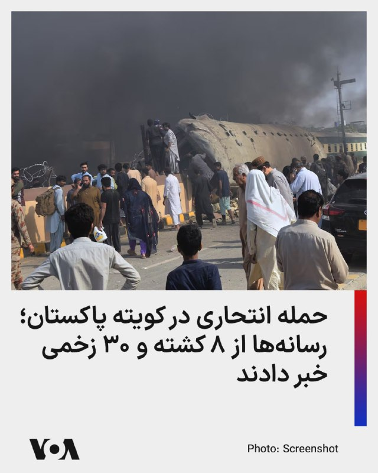

منابع خبری پاکستان گزارش دادند در پی یک حمله انتحاری در شهر کویته، مرکز ایالت بلوچستان، دست‌کم ۸ نفر کشته و ۳۰ نفر دیگر زخمی شدند. این انفجار در محدوده چمن پاتک و نزدیک خط آهن گزارش شده است.

رسانه‌های پاکستانی در ساعات اولیه آمار متفاوتی منتشر کرده بودند. دنیا نیوز پاکستان پیشتر از زخمی شدن دست‌کم ۲۰ نفر خبر داده و نوشته بود انفجار باعث آتش‌سوزی در نزدیکی خط آهن شده، بیمارستان‌ها در آماده‌باش قرار گرفته‌اند و قطار اکسپرس پس از حادثه در ایستگاه کویته متوقف شده است.

ای‌آر‌وای نیوز نیز وقوع انفجار در نزدیکی چمن پاتک را تأیید کرده، اما در گزارش اولیه آمار کشته‌ها را اعلام نکرده بود.

این حمله در ادامه موج ناامنی‌های اخیر در کویته و ایالت بلوچستان رخ می‌دهد. روزنامه داون اوایل ماه مه گزارش داده بود چهار راکت به بخش‌هایی از کویته شلیک شد و سه نفر زخمی شدند.

در ۱۸ مه نیز همین روزنامه از عملیات چهارروزه نیروهای امنیتی در ارتفاعات اطراف کویته خبر داد که در جریان آن، به گفته مقام‌های پاکستانی، ۳۵ شبه‌نظامی کشته شدند.
@FarsiVOA

## FarsiVOA — post 218495

  

اداره‌کل اطلاعات استان فارس مدعی شد «یک شبکه آموزش‌دیده» را که آن را متشکل از «عناصر آشوبگر و تروریستی» خوانده، پیش از هرگونه اقدام در این استان شناسایی و منهدم کرده است.

در اطلاعیه منتشرشده از سوی روابط عمومی این نهاد آمده است که متهمان در ایام جنگ اخیر، برای «توطئه و ترور جمعی از شهروندان» با هدف برهم زدن امنیت استان برنامه‌ریزی کرده بودند.

این ادعا از سوی نهادهای وابسته به جمهوری اسلامی مطرح شده و تاکنون جزئیات مستقلی درباره هویت بازداشت‌شدگان، مستندات پرونده یا روند دادرسی احتمالی منتشر نشده است.
@FarsiVOA

## FarsiVOA — post 218494

🔺حمله گسترده روسیه به کی‌یف پس از هشدار زلنسکی درباره موشک اورشنیک

▪️روسیه بامداد یکشنبه کی‌یف را با موج گسترده‌ای از موشک‌ها و پهپادها هدف قرار داد.

▪️این حمله به گفته مقام‌های اوکراینی به ساختمان‌های مسکونی و مدارس آسیب زد و دست‌کم یک کشته و ۲۰ زخمی در پایتخت برجای گذاشت. سه نفر دیگر نیز در منطقه کی‌یف زخمی شدند.

▪️حمله ساعاتی پس از آن انجام شد که ولودیمیر زلنسکی، رئیس‌جمهور اوکراین، هشدار داده بود روسیه در حال آماده‌سازی یک حمله ترکیبی علیه اوکراین، از جمله کی‌یف، با استفاده احتمالی از موشک بالستیک مافوق‌صوت «اورشنیک» است.

▪️در روزهای گذشته نیز حملات موشکی و پهپادی روسیه به مناطق چرنیهیف، سومی، دنیپرو و زاپوریژیا چندین کشته و زخمی برجای گذاشته بود.

⬇️ بیشتر بخوانید:
https://ir.voanews.com/a/8153267.html

## FarsiVOA — post 218493

  

اداره دفاع مدنی لبنان اعلام کرد تأسیسات منطقه‌ای این نهاد در شهر نبطیه در جنوب لبنان، در حمله اسرائیل تخریب شده است.

به گزارش تایمز اسرائیل، این نهاد گفته ساختمان بر اثر «اصابت مستقیم» فرو ریخته و شمار زیادی از خودروها و تجهیزات امدادی آسیب دیده‌اند.

این گزارش تاکید می‌کند همه نیروهای دفاع مدنی پیش از حمله به محل دیگری منتقل شده بودند و گزارشی از تلفات میان کارکنان منتشر نشده است. ارتش اسرائیل تاکنون درباره این حمله اظهارنظر نکرده است.

این حمله در ادامه تشدید حملات اسرائیل به جنوب لبنان در روزهای اخیر انجام شد. روز جمعه نیز حملات هوایی اسرائیل در جنوب لبنان دست‌کم ۱۰ کشته برجای گذاشت.

با وجود آتش‌بس مورد حمایت آمریکا، رویترز گزارش داده درگیری اسرائیل و حزب‌الله همچنان ادامه دارد و شمار کشته‌شدگان در لبنان از سه هزار نفر گذشته است.
@FarsiVOA

## FarsiVOA — post 218492

🔺از توافق احتمالی تهران-واشنگتن چه می‌دانیم؟

▪️پس از آن که دونالد ترامپ، از «یک یادداشت تفاهم» مربوط به پایان دادن جنگ با جمهوری اسلامی خبر داد، رسانه‌ها گزارش‌های تاییدنشده‌ای از محتوای این توافق منتشر کرده‌اند.

▪️دو مقام آمریکایی به نیویورک تایمز گفته‌اند که حکومت ایران به عنوان بخشی از توافق با ایالات متحده برای پایان دادن به جنگ، پذیرفته است ذخیره اورانیوم با غنای بالای خود را واگذار کند.

▪️همچنین آکسیوس به نقل از یک مقام آمریکایی گزارش داد که ایالات متحده و حکومت ایران به امضای توافقی نزدیک شده‌اند که شامل تمدید آتش‌بس به مدت ۶۰ روز است و در این مدت، تنگه هرمز باز خواهد شد.

▪️این توافق همچنین شامل آتش‌بس میان حزب‌الله و اسرائیل خواهد بود.

⬇️ بیشتر بخوانید:
https://ir.voanews.com/a/8153265.html

## FarsiVOA — post 218491

🔺محاصره آمریکا علیه جمهوری اسلامی به «نقطه عطف» تغییر مسیر ۱۰۰ کشتی رسید

▪️سنتکام، می‌گوید در چهارچوب محاصره دریایی جمهوری اسلامی شمار کشتی‌های مرتبط با جمهوری اسلامی که وادار به تغییر مسیر شده‌اند، به «نقطه عطف» ۱۰۰ فروند رسیده است.

▪️بر اساس این اعلام، پس از شش هفته محاصره دریایی جمهوری اسلامی، بیش از ۱۵ هزار سرباز، ملوان، تفنگدار دریایی و نیروی هوایی آمریکا ۱۰۰ کشتی را تغییر مسیر داده و چهار فروند را از کار انداخته است.

▪️نیروهای نظامی آمریکا در عین حال به ۲۶ کشتی حامل کمک‌های بشردوستانه اجازه عبور به ایران را داده‌اند.

▪️ایالات متحده از اواخر فروردین ۱۴۰۵، محاصره دریایی علیه جمهوری اسلامی ایران را در واکنش به اقدام رژیم ایران در بستن تنگه هرمز آغاز کرده است.

⬇️ بیشتر بخوانید:
https://ir.voanews.com/a/8153263.html

## FarsiVOA — post 218490

  

شهباز شریف، نخست‌وزیر پاکستان، به دونالد ترامپ، رئیس‌جمهوری آمریکا، «به خاطر تلاش‌های فوق‌العاده‌اش برای پیگیری صلح» در میانه تلاش‌ها برای نهایی کردن توافقی جهت پایان دادن به جنگ آمریکا و اسرائیل با ایران، تبریک گفت.

شریف در بیانیه‌ای در شبکه ایکس نوشت که تماس تلفنی «بسیار مفید و سازنده» ترامپ با رهبران منطقه در روز شنبه، «فرصت مفیدی برای تبادل نظر درباره وضعیت کنونی منطقه و چگونگی پیشبرد تلاش‌های جاری برای صلح به منظور برقراری صلحی پایدار در منطقه فراهم کرد.»

او افزود: «پاکستان با نهایت صداقت به تلاش‌های صلح خود ادامه خواهد داد و امیدواریم که خیلی زود میزبان دور بعدی مذاکرات باشیم.»

رئيس‌جمهوری آمریکا، عصر شنبه‌ دوم خرداد به وقت واشنگتن گفت جزئیات نهایی یک یادداشت تفاهم صلح با جمهوری اسلامی «به‌زودی اعلام خواهد شد.»
@FarsiVOA

## FarsiVOA — post 218489

🔺اعدام یک شهروند بازداشت‌شده در ایام جنگ؛ دادرسی شتاب‌زده و اعدام در ۵۰ روز

▪️قوه قضائیه از اعدام مجتبی کیان، به اتهام ارسال اطلاعات مراکز تولید صنایع دفاعی به «دشمن آمریکایی ـ صهیونیستی» خبر داد.

▪️ادعا شده کیان در جریان جنگ اخیر، اطلاعات و مختصات واحدهای مرتبط با تولید قطعات صنایع دفاعی را از طریق پیام به «شبکه‌های وابسته به اسرائیل و آمریکا» ارسال کرده بود.

▪️مجتبی کیان علاوه بر اعدام، به مصادره کلیه اموال محکوم شده بود، و از زمان بازداشت تا اجرای حکم کمتر از ۵۰ روز زمان گذشته است.

▪️عفو بین‌الملل پیشتر هشدار داده بود که نگرانی از اعدام‌های بیشتر افزایش یافته، زیرا مقام‌های جمهوری اسلامی پس از آغاز جنگ خواستار رسیدگی سریع‌تر و مجازات‌های «شدید» برای بازداشت‌شدگان شده‌اند.

⬇️ بیشتر بخوانید:
https://ir.voanews.com/a/8153262.html

## FarsiVOA — post 218488

  <a href="telegram/content/FarsiVOA_218488_1779610358.mp4" target="_blank">🎬 Download video</a>

⚡️گزارش مایکل لیپین، خبرنگار صدای آمریکا از تیراندازی شنبه عصر در اطراف کاخ سفید
@FarsiVOA

## FarsiVOA — post 218487

  <a href="telegram/content/FarsiVOA_218487_1779610359.mp4" target="_blank">🎬 Download video</a>

⚡️ماموران امنیتی و خبرنگاران در خیابان ۱۸ام و پنسیلوانیا (شمال غربی) در واشنگتن دی‌سی، در پی تیراندازی شنبه عصر در نزدیکی کاخ سفید، در منطقه حضور دارند. فرد مظنون در این تیراندازی کشته شد.
@FarsiVOA

## FarsiVOA — post 218486

  <a href="telegram/content/FarsiVOA_218486_1779610359.mp4" target="_blank">🎬 Download video</a>

⚡️اولین تصاویر از چمن شمالی کاخ سفید پس از آن‌که در پی حادثه تیراندازی عصر شنبه، به خبرنگاران اجازه بازگشت به محوطه داده شد.
@FarsiVOA

## FarsiVOA — post 218485

🔺گزارش‌ها از تیراندازی در نزدیکی کاخ سفید؛ سرویس مخفی می‌گوید مظنون کشته شد و یک عابر تیر خورد

▪️شنبه عصر، یک تیراندازی در حوالی کاخ سفید خبر روی داد که طی آن دو نفر از جمله یک عابر و یک فرد مظنون تیر خوردند.

⬇️ بیشتر بخوانید:
https://ir.voanews.com/a/8153104.html
@FarsiVOA

## FarsiVOA — post 218484

  <a href="telegram/content/FarsiVOA_218484_1779610360.mp4" target="_blank">🎬 Download video</a>

⚡️گزارش مایکل لیپین، خبرنگار صدای آمریکا از تیراندازی شنبه عصر در اطراف کاخ سفید
@FarsiVOA

## FarsiVOA — post 218483

🔺گزارش خبرنگار صدای آمریکا از محل تیراندازی در اطراف کاخ سفید؛ صدای ده‌ها گلوله شنیده شد

▪️خبرنگار صدای آمریکا در حوزه کاخ سفید، مایکل لیپین، عصر شنبه از نزدیکی محل تیراندازی در اطراف کاخ سفید گزارش کرد.

⬇️ بیشتر بخوانید:
https://ir.voanews.com/a/8153117.html
@FarsiVOA

## FarsiVOA — post 218482

  <a href="telegram/content/FarsiVOA_218482_1779610360.mp4" target="_blank">🎬 Download video</a>

⚡️ویدیوی صدای آمریکا از حضور نیروهای امنیتی پس از گزارش‌ها از تیراندازی شنبه عصر در نزدیکی کاخ سفید
@FarsiVOA

## FarsiVOA — post 218480

⚡️نیروهای گارد ملی و دیگر ماموران امنیتی شنبه عصر و در پی گزارش‌ها از تیراندازی در اطراف کاخ سفید، در محل استقرار یافتند.
@FarsiVOA

## FarsiVOA — post 218479

⚡️خط قرمز جدید بغداد: دولت علی الزیدی به دنبال انحلال شبه‌نظامیان وابسته به جمهوری اسلامی
@FarsiVOA

## DW_Farsi — post 125071

  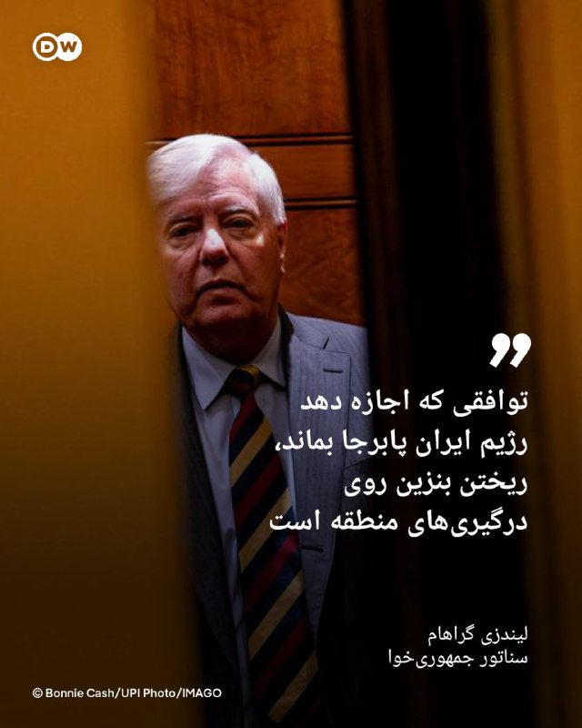

🔶 لیندزی گراهام: توافقی که اجازه دهد رژیم ایران پابرجا بماند، ریختن بنزین روی درگیری‌های منطقه است

لیندزی گراهام، سناتور پرنفوذ جمهوری‌خواه، در پستی در شبکه ایکس در واکنش به اظهارات جدید ترامپ مبنی بر "نهایی شدن توافق" با ایران هشدار داد: «اگر توافقی برای پایان دادن به درگیری با ایران حاصل شود، آن هم به این دلیل که باور بر این است که تنگه هرمز نمی‌تواند در برابر تروریسم ایران محافظت شود و ایران همچنان توانایی تخریب زیرساخت‌های اصلی نفتی خلیج فارس را دارد، در این صورت ایران به‌عنوان یک قدرت برتر تلقی خواهد شد که نیازمند یک راه‌حل دیپلماتیک است.»

او در ادامه نوشت: «این ترکیب، یعنی تصور اینکه ایران توانایی ایجاد ناامنی دائمی در تنگه را دارد و همچنین قادر است آسیب‌های گسترده‌ای به زیرساخت‌های نفتی خلیج فارس وارد کند، نشان‌دهنده تغییر بزرگی در توازن قدرت در منطقه است و در بلندمدت می‌تواند به یک کابوس برای اسرائیل تبدیل شود.»

به گفته گراهام اگر این برداشت‌ها درست باشند، "این پرسش مطرح می‌شود که اصلا چرا جنگ آغاز شد".

او افزود: «به این ایده که نمی‌تو‌ان توانایی ایران برای ایجاد ناامنی در تنگه هرمز را مهار کرد و اینکه منطقه قادر به دفاع از خود در برابر توان نظامی ایران نیست، تردید دارم.»

@dw_farsi

## DW_Farsi — post 125070

  

🔶 قوه قضائیه مجتبی کیان را به اتهام "همکاری با دشمن" اعدام کرد

خبرگزاری میزان، وابسته به قوه قضائیه جمهوری اسلامی، از اعدام مجتبی کیان در بامداد یکشنبه سوم خرداد (۲۴ مه) به اتهام "ارسال اطلاعات مرتبط با واحد‌های صنایع دفاعی کشور به دشمن" خبر داد.

در این گزارش ادعا شده مجتبی کیان در طول جنگ آمریکا و اسرائیل با ایران، "پیام‌های متعددی را به شبکه‌های معاند" ارسال می‌کرد که "از جمله آنها مختصات و اطلاعات محل واحد‌های تولید قطعات مرتبط با صنایع دفاعی کشور بود". در ادبیات حکومت جمهوری اسلامی اصطلاح "شبکه‌های معاند" به رسانه‌ها و شبکه‌های فارسی‌زبان خارج از کشور اشاره دارد.

میزان مدعی شده است که مجتبی کیان "در پیام‌هایی به شبکه وابسته به دشمن، اطلاعات محل شرکت مرتبط با صنایع دفاعی را ارسال کرده" و با قید نام بنیامین نتانیاهو، نخست‌وزیر اسرائیل، "در پیام ارسالی به عوامل این شبکه تأکید می‌کند که موضوع را ’به بی‌بی آمار بده‘".

قوه قضائیه جزئیاتی درباره نحوه دسترسی مجتبی کیان به این اطلاعات، شغل یا جایگاه او نداده و مشخص نکرده است که او چگونه به "اطلاعات مرتبط با صنایع دفاعی" دسترسی داشته است. در این گزارش یکی از "ادله" این پرونده "اعترافات و اقرارهای" متهم عنوان شده است. با این حال قوه قضائیه جزئیاتی درباره شرایط بازجویی و نحوه اخذ این اعترافات منتشر نکرده است.

نهادهای حقوق بشری طی سال‌های گذشته بارها نسبت به پخش و استناد به اعترافات اجباری در پرونده‌های امنیتی در ایران ابراز نگرانی کرده و از احتمال اخذ اعتراف تحت فشار یا شکنجه سخن گفته‌اند.

به نوشته خبرگزاری میزان دادگاه مجتبی کیان در دادگستری استان البرز برگزار شد و با استناد به "ماده یک قانون تشدید مجازات جاسوسی و همکاری" برای او حکم اعدام و مصادره کلیه اموال صادر شد.

@dw_farsi

## DW_Farsi — post 125069

  

🔶 ابراز امیدواری نخست‌وزیر پاکستان به برگزاری دور جدید مذاکرات

شهباز شریف، نخست‌وزیر پاکستان، در واکنش به پست تازه دونالد ترامپ در شبکه تروث سوشال در مورد "نهایی شدن" توافق با ایران، ابراز امیدواری کرد که اسلام‌آباد به‌زودی میزبان دور بعدی مذاکرات میان تهران و واشنگتن باشد.

او با انتشار پیامی در شبکه ایکس از رئیس جمهور آمریکا به دلیل "تلاش‌های فوق‌العاده‌اش برای پیگیری صلح" و "تماس‌‌های تلفنی بسیار سازنده و مفید" با رهبران عربستان، قطر، ترکیه، مصر، امارات متحده عربی، اردن و پاکستان قدردانی کرده و نوشت: «این گفت‌وگوها فرصت مفیدی را برای تبادل نظر در مورد وضعیت فعلی منطقه و چگونگی پیشبرد تلاش‌های جاری برای ایجاد صلح پایدار در منطقه فراهم کرد.»

شهباز شریف تأکید کرد پاکستان به تلاش‌های میانجی‌گرانه خود برای صلح "با نهایت صداقت" ادامه خواهد داد و امیدوار است که میزبان دور بعدی مذاکرات در "آینده‌ای بسیار نزدیک" باشد.

ترامپ در پست خود در تروث سوشال گفته بود که واشنگتن و تهران به مراحل پایانی یک توافق نزدیک شده‌اند که جزئیات آن در "دست بررسی است و به‌زودی اعلام خواهد شد."

@dw_farsi

## DW_Farsi — post 125067

  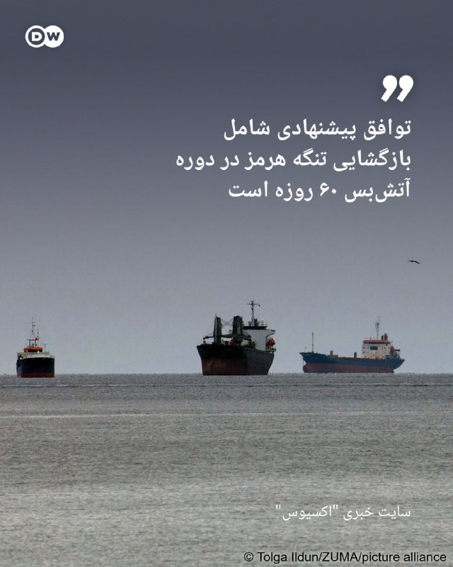

🔶 اکسیوس: توافق پیشنهادی شامل بازگشایی تنگه هرمز در دوره آتش‌بس ۶۰ روزه است

سایت خبری "اکسیوس" روز شنبه به نقل از یک مقام آمریکایی گزارش داد که ایالات متحده و ایران به امضای یک توافق نزدیک شده‌اند که شامل تمدید ۶۰ روزه آتش‌بس است که طی آن تنگه هرمز بازگشایی خواهد شد، ایران می‌تواند آزادانه نفت بفروشد و مذاکراتی در مورد مهار برنامه هسته‌ای انجام خواهد شد.

به نوشته اکسیوس در طول این دوره ۶۰ روزه، تنگه هرمز بدون دریافت عوارض باز خواهد بود و ایران موافقت می‌کند مین‌هایی را که در این تنگه کار گذاشته، پاکسازی کند تا کشتی‌ها بتوانند آزادانه عبور کنند. در مقابل به عنوان بخشی از توافق پیشنهادی آمریکا به محاصره بنادر ایرانی پایان می‌دهد و برخی معافیت‌های تحریمی را صادر می‌کند تا به ایران اجازه دهد آزادانه نفت بفروشد.

این گزارش می‌افزاید که پیش‌نویس توافق همچنین شامل تعهداتی از سوی ایران مبنی بر عدم دستیابی به سلاح هسته‌ای و مذاکره در مورد تعلیق برنامه غنی‌سازی اورانیوم و حذف ذخایر اورانیوم با غنای بالاست.

دو منبع به اکسیوس گفته‌اند که ایران از طریق میانجی‌ها، در مورد میزان امتیازاتی که حاضر است در زمینه تعلیق غنی‌سازی و کنار گذاشتن مواد هسته‌ای ارائه دهد، تعهدات شفاهی به آمریکا داده است.

در این گزارش همچنین آمده است که ایالات متحده موافقت می‌کند در طول دوره ۶۰ روزه تمدید آتش‌بس بر سر لغو تحریم‌ها و آزادسازی دارایی‌های مسدودشده ایران مذاکره کند.

@dw_farsi

## DW_Farsi — post 125065

  

🔶 ترامپ: توافق با ایران تا حد زیادی مذاکره شده است و تنگه هرمز هم باز می‌شود

دونالد ترامپ، رئیس جمهور آمریکا، گفت توافق با ایران به مراحل پایانی رسیده است و این پیشنهاد شامل بازگشایی تنگه هرمز نیز می‌شود، هرچند این توافق "هنوز نهایی نشده است".

ترامپ روز شنبه ۲۳ مه (دوم خرداد) با انتشار پیامی در شبکه تروث سوشال نوشت: «من در دفتر بیضی کاخ سفید هستم؛ جایی که به‌تازگی تماس بسیار خوبی با محمد بن سلمان آل سعود ولیعهد عربستان سعودی، محمد بن زاید آل نهیان رئیس امارات متحده عربی، شیخ تمیم بن حمد بن خلیفه آل ثانی، نخست‌وزیر محمد بن عبدالرحمن بن جاسم بن جابر آل ثانی و وزیر علی الثوادی از قطر، فیلد مارشال سید عاصم منیر احمد شاه از پاکستان، رجب طیب اردوغان رئیس‌جمهور ترکیه، عبدالفتاح السیسی رئیس‌جمهور مصر، ملک عبدالله دوم پادشاه اردن و حمد بن عیسی آل خلیفه پادشاه بحرین درباره جمهوری اسلامی ایران و همه مسائل مرتبط با یک یادداشت تفاهم در خصوص صلح داشتیم.»

ترامپ در ادامه افزود یک توافق "تا حد زیادی" میان ایالات متحده و ایران دیگر کشورهای نا‌م‌برده شده، مذاکره شده و اکنون در انتظار نهایی‌‌سازی قرار دارد.

او همچنین نوشت که با بنیامین نتانیاهو، نخست‌وزیر اسرائیل، نیز گفت‌وگو کرده است که "این تماس نیز بسیار خوب پیش رفته است".

رئیس جمهور آمریکا در پایان پست خود خاطرنشان ساخت: «جنبه‌ها و جزئیات نهایی این توافق در حال حاضر در دست بررسی است و به زودی اعلام خواهد شد. علاوه بر بسیاری دیگر از مفاد این توافق، تنگه هرمز نیز بازگشایی خواهد شد.»

اظهارات ترامپ در حالی مطرح شده است که مقام‌های جمهوری اسلامی گفته بودند هنوز اختلاف‌هایی میان طرف‌ها وجود دارد و موضوع برنامه هسته‌ای ایران در مذاکرات اولیه مطرح نخواهد شد.

@dw_farsi

## Persian_Trend_Official — post 14838

♨️ تسنیم:
تعهد ایران به خروج مواد هسته‌ای یا تعلیق 10-20 ساله در تفاهم‌نامه کذب است.

📝 Nick

📌 @persian_trend_official
پرشین ترند | متفاوت‌ترین کانال نظامی

## Persian_Trend_Official — post 14837

  

⭕️ بنی گانتز، رئیس سابق ستاد کل ارتش اسرائیل (اپوزیسیون نتانیاهو):

دنبال کردن آتش‌بس در لبنان، تحت هیچ شرایطی نباید بخشی از توافق با ایران باشد.

نمی‌شود وضعیتی را پذیرفت که درست وقتی جامعه لبنان دارد از اقدامات حزب‌الله آسیب می‌بیند، اسرائیل اجازه بدهد این وضعیت به سپری برای لبنان تبدیل شود.

روستاهای جنوب لبنان فقط چندصد متر با مطولا، شومیرا و مسگاو عام فاصله دارند و اسرائیل وظیفه دارد از ساکنان خود، بدون وابستگی به هیچ عامل خارجی، دفاع کند.

پذیرفتن آتش‌بس در لبنان به‌عنوان بخشی از توافق با ایران، یک اشتباه راهبردی خواهد بود که تا سال‌ها بهایش را خواهیم پرداخت.

این دقیقاً همان موردی است که اسرائیل باید به آمریکا بگوید: نه.

📝 Nick

📌 @persian_trend_official
پرشین ترند | متفاوت‌ترین کانال نظامی

## Persian_Trend_Official — post 14836

  <a href="telegram/content/Persian_Trend_Official_14836_1779610364.webm" target="_blank">🎬 Download video</a>

https://youtube.com/live/FTUt8HfIdrc?feature=share

## Persian_Trend_Official — post 14834

  <a href="telegram/content/Persian_Trend_Official_14834_1779610364.webm" target="_blank">🎬 Download video</a>

https://youtube.com/live/FTUt8HfIdrc?feature=share

## Persian_Trend_Official — post 14833

  

⭕️ به گزارش فایننشال تایمز، نیروی هوافضای سپاه پاسداران انقلاب اسلامی از تلسان، شبکه تأمین مستقر در امارات متحده عربی، برای به‌دست آوردن تجهیزات پیشرفته ماهواره‌ای چینی مرتبط با برنامه پهپادی خود در اواخر سال 2025 استفاده کرد.

🔴این تجهیزات بعدها در حملات پهپادی ایران در طول جنگ به کار رفت. شرکت مستقر در رأس‌الخیمه حدود 1.8 تن تجهیزات آنتن ماهواره‌ای ساخت چین را از شانگهای به ایران از طریق بندر کانتینری جبل علی در دبی منتقل کرد.

پ.ن: اینم از عاقبت دور زدن تحریم برای ج.ا.

📝 Nick

📌 @persian_trend_official
پرشین ترند | متفاوت‌ترین کانال نظامی

## Persian_Trend_Official — post 14832

  <a href="telegram/content/Persian_Trend_Official_14832_1779610365.mp4" target="_blank">🎬 Download video</a>

دقت کردید باز هم از این شخص هیچ خبری نیست؟ 😁 📝 Nick 📌 @persian_trend_official پرشین ترند | متفاوت‌ترین کانال نظامی

## Persian_Trend_Official — post 14831

🔴 آکسیوس: توافق ۶۰ روزه ایران و آمریکا شامل بازگشایی رایگان تنگه هرمز خواهد بود آکسیوس گزارش داد یادداشت تفاهم ۶۰ روزه پیشنهادی میان ایران و آمریکا شامل بازگشایی تنگه هرمز بدون دریافت عوارض و ازسرگیری صادرات نفت ایران در ازای تمدید آتش‌بس و آغاز مذاکرات هسته‌ای…

## Persian_Trend_Official — post 14830

  <a href="telegram/content/Persian_Trend_Official_14830_1779610366.mp4" target="_blank">🎬 Download video</a>

⭕️ ارتش دفاعی اسرائیل:

‼️در تلاش مستمر برای رفع تهدید: ارتش اسرائیل در روزهای اخیر چندین انبار تسلیحاتی متعلق به سازمان تروریستی حماس را هدف قرار داده و نابود کرد

⭕️نیروهای ارتش اسرائیل تحت فرماندهی جنوب، طی شبانه‌روز گذشته (شنبه)، سه انبار تسلیحات متعلق به سازمان تروریستی حماس را در مرکز نوار غزه هدف قرار داده و منهدم کردند.
در میان تسلیحات موجود در این انبارها که در پی این حمله نابود شد، مواردی چون موشک‌های ضدزره، سلاح‌های سبک، آرپی‌جی (RPG)، جلیقه‌های رزمی و سایر تجهیزات نظامی وجود داشت.

⭕️در رویدادی دیگر در اوایل همین هفته (چهارشنبه)، نیروهای ارتش اسرائیل تحت فرماندهی جنوب یک انبار تسلیحاتی دیگر را در مرکز نوار غزه هدف قرار داده و منهدم کردند که در آن مواد منفجره، راکت‌اندازهای RPG، نارنجک‌های دستی و خشاب‌ها نگهداری می‌شد.

⭕️این تسلیحات برای حمله به نیروهای ارتش اسرائیل که در محدوده خط زرد فعالیت می‌کنند و همچنین غیرنظامیان اسرائیلی در نظر گرفته شده بود و به‌منظور رفع تهدید نابود شد.

⭕️پس از این حملات، انفجارهای ثانویه‌ای شناسایی شد که نشان‌دهنده وجود مهمات در این انبارها بود.

⭕️نیروهای ارتش اسرائیل تحت فرماندهی جنوب مطابق با توافق در منطقه مستقر هستند و به فعالیت خود برای رفع هرگونه تهدید فوری ادامه خواهند داد.

📝 Nick

📌 @persian_trend_official
پرشین ترند | متفاوت‌ترین کانال نظامی

## Persian_Trend_Official — post 14829

  

⭕️ اسرائیل به فارسی:

چرخ روزگار... از پارسال تا امسال.

📝 Nick

📌 @persian_trend_official
پرشین ترند | متفاوت‌ترین کانال نظامی

## Persian_Trend_Official — post 14828

  

انفجار مهیب در کویته پاکستان؛ ۲۳ کشته و ده‌ها زخمی
منابع محلی در پاکستان از وقوع یک انفجار انتحاری در شهر کویته، مرکز ایالت بلوچستان، خبر دادند؛ انفجاری که در نزدیکی ایستگاه قطار و یک مرکز امنیتی رخ داد و دست‌کم ۲۳ کشته و ده‌ها زخمی برجا گذاشت.
این حادثه صبح امروز رخ داد و شدت انفجار به‌حدی بود که خسارت قابل توجهی به خودروهای اطراف، واگن‌های قطار و شماری از ساختمان‌های مسکونی وارد شد. تصاویر منتشرشده از محل، از آوار، دود غلیظ و تخریب گسترده در اطراف نقطه انفجار حکایت دارد.

هم‌زمان، گروه «ارتش آزادی‌بخش بلوچ» شاخه جیاند مسئولیت این حمله را برعهده گرفته و مدعی شده عملیات توسط تیپ مجید انجام شده است.

👩‍💻@PhantomDirective

🆔@persian_trend_official
پرشین ترند | متفاوت‌ترین کانال نظامی

## Persian_Trend_Official — post 14827

  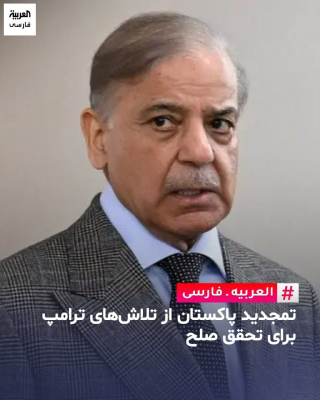

شهباز شریف، نخست‌وزیر پاکستان، به دونالد ترامپ، رئیس‌جمهوری آمریکا، «به خاطر تلاش‌های فوق‌العاده‌اش برای پیگیری صلح» در میانه تلاش‌ها برای نهایی کردن توافقی جهت پایان دادن به جنگ آمریکا و اسرائیل با ایران، تبریک گفت.

به گزارش «رویترز»، شریف تأکید کرد که عاصم منیر، فرمانده ارتش پاکستان، در تماس تلفنی ترامپ با شماری از رهبران منطقه برای بررسی تحولات مربوط به توافق احتمالی، نماینده پاکستان بود.

نخست‌وزیر پاکستان گفت کشورش «با نهایت صداقت به تلاش‌ها برای دستیابی به صلح ادامه خواهد داد» و افزود اسلام‌آباد همچنان نقش میانجی میان واشینگتن و تهران را دنبال می‌کند.

شریف همچنین ابراز امیدواری کرد که پاکستان «به‌زودی میزبان دور بعدی مذاکرات» باشد که نشان‌دهنده تمایل اسلام‌آباد برای ایفای نقشی پررنگ‌تر در گفت‌وگوهای جاری است.

👩‍💻@PhantomDirective

🆔@persian_trend_official
پرشین ترند | متفاوت‌ترین کانال نظامی

## Persian_Trend_Official — post 14826

  

دقت کردید باز هم از این شخص هیچ خبری نیست؟ 😁

📝 Nick

📌 @persian_trend_official
پرشین ترند | متفاوت‌ترین کانال نظامی

## Persian_Trend_Official — post 14825

  

اعدام مجتبی کیان با اتهام «جاسوسی»؛ اجرای حکم در کمتر از ۵۰ روز پس از بازداشت

خبرگزاری میزان، وابسته به قوه قضاییه جمهوری اسلامی، اعلام کرد مجتبی کیان، زندانی سیاسی، پس از تشکیل پرونده‌ای در دادگستری استان البرز به اتهام ارسال اطلاعات مربوط به صنایع نظامی ایران به «دشمن» در جریان جنگ اخیر، اعدام شده است.

بر اساس گزارش منتشرشده، مقام‌های قضایی مدعی شده‌اند که مجتبی کیان اطلاعات مورد نظر را از طریق پیام‌رسانی به «یک شبکه ماهواره‌ای معاند» منتقل کرده بود.

قوه قضاییه همچنین او را به «فعالیت اطلاعاتی برای اسرائیل و آمریکا» متهم کرده و اعلام کرده است که وی علاوه بر حکم اعدام، به مصادره کلیه اموال نیز محکوم شده بود.

طبق اعلام رسمی، از زمان بازداشت مجتبی کیان تا اجرای حکم اعدام او در روز سوم خرداد ۱۴۰۵، کمتر از ۵۰ روز فاصله زمانی وجود داشته است.

حکم اعدام این زندانی در حالی اجرا شد که از روند رسیدگی پرونده او هیچ اطلاعاتی منتشر نشده است. اینکه آیا او وکیل داشته یا خیر، در شرایطی به سر برده و این اتهامات چه اندازه با واقعیت انطباق دارد، مشخص نیست.

جمهوری اسلامی در زوندی ناعادلانه و غیر شفاف شهروندان را به اتهامات مختلف متهم کرده و احکام سنگین صادر می‌کند. شهروندانی بی‌دفاع در برابر حکومتی ظالم و بی‌رحم.

👩‍💻@PhantomDirective

🆔@persian_trend_official
پرشین ترند | متفاوت‌ترین کانال نظامی

## Persian_Trend_Official — post 14823

ساعت 11 به وقت تهران لایو داریم

## Persian_Trend_Official — post 14822

  <a href="telegram/content/Persian_Trend_Official_14822_1779610369.mp4" target="_blank">🎬 Download video</a>

تصاویر ثبت شده لحظه اصابت موشک کروز روسی اسکندر-ک به کی‌یف در صبح امروز .

👩‍💻@PhantomDirective

🆔 @persian_trend_official
پرشین ترند | متفاوت‌ترین کانال نظامی

## Persian_Trend_Official — post 14821

بولتن خبری۲۴ ساعت گذشته پرشین ترند

🇮🇷 ایران

◾️ فرمانده ارتش پاکستان عاصم منیر پس از دیدار دوم با عراقچی، همچنین با قالیباف و پزشکیان دیدار کرد؛ وی روند مذاکرات مثبت خواند؛ سپس تهران را ترک کرد.

◾️ الجزیره: تهران و پاکستان بر سر یک «یادداشت تفاهم» به توافق رسیده‌اند؛ شامل پایان جنگ، بازگشایی تنگه هرمز و خروج نیروهای آمریکایی از منطقه؛ موضوع هسته‌ای به مذاکرات ۳۰ روزه بعدی موکول شده.

◾️ ایران دو پیشنهاد به میانجی پاکستانی ارائه کرده؛ خواستار بحث درباره تحریم‌ها و آزادسازی دارایی‌های مسدودشده پیش از امضای توافق شده است.

◾️ منبع نزدیک به تیم مذاکره‌کننده به فارس: سه موضوع اختلافی هنوز پابرجاست؛ پرونده هسته‌ای، آزادسازی پول‌های بلوکه‌شده، و مدیریت ایران بر تنگه هرمز
◾️ سخنگوی وزارت خارجه: تنگه هرمز به آمریکا ربطی ندارد؛ سازوکار مدیریت آن باید میان ایران و عمان تعریف شود
◾️ عضو کمیسیون امنیت ملی مجلس: در هر توافقی ایران باید غرامت جنگ دریافت کند؛ از مدیریت تنگه هرمز عقب‌نشینی نخواهد شد

◾️ ایران نماینده دائم خود نزد سازمان ملل را مأمور کرد مسئولیت بین‌المللی کشورهای خلیج فارس در تسهیل تجاوز علیه ایران را رسماً مطرح کند

◾️ حزب‌الله: عراقچی بر حمایت «قاطع و تزلزل‌ناپذیر» ایران از این گروه تأکید کرده؛ تهران خواستار گنجانده‌شدن لبنان در هرگونه توافق آتش‌بس است

◾️ جمهوری اسلامی مقر گروه کومله در اربیل عراق را با موشک و پهپاد هدف قرار داد

◾️ نیروی دریایی سپاه: ۲۵ کشتی در شبانه‌روز گذشته با مجوز سپاه از تنگه هرمز عبور کردند؛ تصاویر ماهواره‌ای از توقف ۲۴۰ کشتی در انتظار مجوز عبور خبر می‌دهد
◾️ پروازهای فرودگاه‌های اهواز و ماهشهر از سر گرفته شد.

◾️ مقامات ایران اعلام کردند اینترنت بین‌المللی در حال حاضر بازگشایی نخواهد شد؛ شورای عالی امنیت ملی قطع اینترنت را به دلایل امنیتی تأیید کرده.

◾️ راننده کنسول جمهوری آذربایجان در تبریز در سانحه رانندگی در اتوبان جلفا-تبریز جان باخت.

خبرگزاری قوه قضائیه: مجتبی کیان به اتهام ارسال اطلاعات در جنگ پس از تأیید حکم دیوان عالی کشور اعدام شد.

🇮🇱اسرائیل و خاورمیانه

◾️ اکسیوس: نتانیاهو از توافق در دست بررسی شدیداً نگران است و از ترامپ خواسته دور جدیدی از حملات به ایران آغاز شود؛ اسرائیل در حال اعمال فشار برای مختل کردن توافق است.

◾️ رسانه‌های اسرائیلی: اسرائیل سطح آماده‌باش را کاهش داده؛ برآوردها حاکی از عدم وقوع حمله قریب‌الوقوع به ایران است.

◾️ کانال ۱۳ اسرائیل: اسرائیل اطلاعاتی دریافت کرده که توافق آمریکا با ایران ممکن شده است.

◾️ فرانسه از ورود بن‌گویر، وزیر امنیت داخلی اسرائیل، به خاک خود جلوگیری کرد
◾️ نفتکشی در ۲۰۰ مایل دریایی غرب سوکوترا توسط یک قایق کوچک مورد تهدید قرار گرفت؛ با استقرار تیم امنیتی مسلح، قایق مسیر خود را تغییر داد.

🇺🇸
🇺🇳 آمریکا و جهان

◾️ ترامپ در پست توییتری اعلام کرد با رهبران عربستان، امارات، قطر، پاکستان، ترکیه، مصر، اردن و بحرین درباره ایران گفتگو کرده؛ توافق «تا حد زیادی» نهایی شده و به‌زودی اعلام می‌شود؛ تنگه هرمز بازگشایی خواهد شد.

◾️ اکسیوس: واشنگتن و تهران یادداشت تفاهم ۶۰ روزه امضا خواهند کرد؛ شامل پایان جنگ با حزب‌الله، امکان فروش نفت ایران و توقف محاصره بنادر؛ کاخ سفید امیدوار است توافق امروز یکشنبه اعلام شود.

◾️ نیویورک‌تایمز: یادداشت تفاهم ۲۵ میلیارد دلار از دارایی‌های مسدودشده ایران را آزاد می‌کند؛ مسائل هسته‌ای ظرف ۳۰ تا ۶۰ روز مذاکره خواهد شد.

◾️ فایننشال تایمز: موانع اصلی درخواست ترامپ برای تحویل ۴۴۰ کیلوگرم اورانیوم نزدیک به درجه تسلیحاتی و برچیدن سه سایت هسته‌ای نطنز، فردو و اصفهان است.

◾️ روبیو: ممکن است ایران توافق را در اوایل یکشنبه بپذیرد؛ امروز یا فردا خبری اعلام شود.

◾️ ترامپ با اکسیوس: شانس توافق یا حمله را «۵۰-۵۰» ارزیابی می‌کند؛ امروز با ویتکاف، کوشنر و ونس درباره آخرین پاسخ ایران دیدار خواهد کرد.

◾️ لیندزی گراهام هشدار داد هر توافقی که به بقای حکومت ایران و بازگشت نفوذ منطقه‌ای آن منجر شود خاورمیانه را بی‌ثبات‌تر خواهد کرد.

◾️ وزیر جنگ آمریکا هگست: نیروی هوایی آمریکا برای اعزام به خاورمیانه در آماده‌باش است.

◾️ دن اسکاوینو، معاون دفتر کاخ سفید، ویدیویی از بمب‌افکن‌های مخفی‌کار B-2 منتشر کرد؛ آخرین بار چنین پستی چند ساعت پیش از حمله به ایران منتشر شده بود.

◾️ تیراندازی مقابل کاخ سفید؛ مهاجم با ۳ گلوله به سمت ساختمان توسط سرویس مخفی کشته شد؛ یک عابر مجروح شد؛ ترامپ در سلامت کامل است؛ مهاجم فردی با سابقه اختلال روانی شناخته‌شده بود.

◾️ روسیه با بیش از ۳۰ موشک بالستیک از جمله اورشنیک کی‌یف اوکراین را بمباران کرد؛ این حمله از هفته گذشته برنامه‌ریزی شده بود.

🆔@persian_trend_official
پرشین ترند | متفاوت‌ترین کانال نظامی

## Persian_Trend_Official — post 14820

در این تماس، رهبران عربستان سعودی، قطر، مصر، ترکیه و پاکستان نیز حضور داشتند؛ کشورهایی که همگی در تلاش‌های میانجی‌گرانه نقش داشته‌اند.
پاکستانی‌ها میانجی اصلی بودند؛ با محوریت فیلدمارشال عاصم منیر که روزهای جمعه و شنبه در تهران بود تا تلاش کند این توافق را به مرحله نهایی برساند.
ترامپ در روزهای اخیر میان دو گزینه مردد بود: پیش بردن توافق یا آغاز موج گسترده‌ای از حملات علیه ایران. تا شنبه‌شب، او بیشتر به سمت راه‌حل دیپلماتیک متمایل شده بود.
مرحله بعد چیست؟
کاخ سفید امیدوار است اختلافات باقی‌مانده در ساعات آینده حل شود و توافق روز یکشنبه اعلام گردد. این را مقام ارشد آمریکایی گفته است.
او همچنین گفت ممکن است توافق حتی تمام ۶۰ روز دوام نیاورد، اگر آمریکا به این نتیجه برسد که ایران در مذاکرات مربوط به برنامه هسته‌ای جدی نیست.
از سوی دیگر، آمریکا معتقد است بحران اقتصادی در ایران انگیزه‌ای برای حکومت ایجاد کرده تا برای دستیابی به توافق کامل، رفع تحریم‌ها و آزادسازی دارایی‌ها وارد مسیر جدی‌تری شود.
این مقام آمریکایی گفت:
«جالب خواهد بود ببینیم ایران واقعاً تا چه اندازه حاضر است جلو برود؛ اما اگر ایران توانایی و اراده تغییر مسیر خود را داشته باشد، این مرحله بعدی آن را مجبور خواهد کرد تصمیم‌های بسیار مهمی بگیرد؛ اینکه می‌خواهد به‌عنوان یک کشور چه باشد.»
به گفته مشاوران ترامپ، اگر خواسته‌های او درباره برنامه هسته‌ای ایران برآورده شود، رئیس‌جمهور آمریکا آماده است برای بازتنظیم روابط با ایران بسیار جلو برود و به ایران فرصت دهد ظرفیت کامل اقتصادی خود را آزاد کند؛ ظرفیتی که ترامپ آن را «عظیم» می‌داند.

باراک راوید

## Persian_Trend_Official — post 14819

جزئیات توافق در حال شکل‌گیری میان آمریکا و ایران برای پایان جنگ

توافقی که آمریکا و ایران به امضای آن نزدیک شده‌اند، شامل تمدید ۶۰ روزه آتش‌بس است؛ دوره‌ای که در آن تنگه هرمز دوباره باز خواهد شد، ایران خواهد توانست نفت خود را آزادانه بفروشد و مذاکراتی درباره محدودسازی برنامه هسته‌ای ایران برگزار خواهد شد. این مطلب را یک مقام ارشد آمریکایی اعلام کرده است.
چرا مهم است؟
این توافق می‌تواند مانع تشدید جنگ شود و فشار بر بازار جهانی نفت را کاهش دهد. با این حال، هنوز روشن نیست که آیا این توافق به یک صلح پایدار منجر خواهد شد یا نه؛ صلحی که همزمان بتواند خواسته‌های رئیس‌جمهور ترامپ درباره برنامه هسته‌ای ایران را هم تأمین کند.
وضعیت فعلی
هم ترامپ و هم میانجی‌ها اشاره کرده‌اند که اعلام توافق ممکن است امروز، یکشنبه، انجام شود؛ هرچند توافق هنوز نهایی نشده و همچنان ممکن است فروبپاشد.
این مقام ارشد آمریکایی چارچوبی دقیق از پیش‌نویس فعلی ارائه کرده که بخش زیادی از آن توسط منابع دیگر نزدیک به مذاکرات نیز تأیید شده است.
این جزئیات از سوی طرف ایرانی تأیید نشده، هرچند تهران نیز نشانه‌هایی داده که توافق نزدیک است.
مفاد توافق چیست؟
دو طرف یک یادداشت تفاهم ۶۰ روزه امضا خواهند کرد که با توافق متقابل قابل تمدید خواهد بود.
در طول این ۶۰ روز، تنگه هرمز بدون دریافت عوارض باز خواهد بود و ایران موافقت می‌کند مین‌هایی را که در تنگه کار گذاشته، جمع‌آوری کند تا عبور آزاد کشتی‌ها ممکن شود.
در مقابل، آمریکا محاصره بنادر ایران را برمی‌دارد و برخی معافیت‌های موقت تحریمی صادر می‌کند تا ایران بتواند به مدت ۶۰ روز نفت خود را آزادانه بفروشد.
این مقام آمریکایی پذیرفته که این موضوع برای اقتصاد ایران یک مزیت خواهد بود، اما گفته این اقدام همچنین فشار قابل‌توجهی را از بازار جهانی نفت برمی‌دارد.
او گفت هرچه ایرانی‌ها سریع‌تر مین‌ها را جمع‌آوری کنند و امکان ازسرگیری کشتیرانی در تنگه هرمز را فراهم کنند، محاصره دریایی نیز سریع‌تر برداشته خواهد شد.
به گفته این مقام آمریکایی، اصل کلیدی ترامپ در این توافق این است: «امتیاز در برابر عملکرد».
ایران می‌خواست دارایی‌های مسدودشده فوراً آزاد شود و آمریکا نیز بلافاصله همه تحریم‌ها را به‌صورت دائمی بردارد، اما طرف آمریکایی گفته این اقدامات فقط پس از امتیازدهی ملموس ایران درباره برنامه هسته‌ای انجام خواهد شد.
مسائل هسته‌ای که هنوز باید حل‌وفصل شوند
پیش‌نویس یادداشت تفاهم شامل تعهداتی از سوی ایران است مبنی بر اینکه هرگز برای دستیابی به سلاح هسته‌ای تلاش نکند و درباره تعلیق برنامه غنی‌سازی اورانیوم و خارج کردن ذخایر اورانیوم با غنای بالا از کشور مذاکره کند. این را همان مقام ارشد آمریکایی گفته است.
به گفته دو منبع مطلع، ایران از طریق میانجی‌ها به آمریکا تعهدات شفاهی داده که نشان می‌دهد حاضر است در موضوع تعلیق غنی‌سازی و واگذاری ذخایر اورانیوم غنی‌شده تا چه حد امتیاز بدهد.
آمریکا موافقت خواهد کرد که در طول دوره ۶۰ روزه درباره رفع تحریم‌ها و آزادسازی دارایی‌های ایران مذاکره کند؛ هرچند این اقدامات فقط به‌عنوان بخشی از توافق نهایی و پس از اجرای قابل راستی‌آزمایی آن عملی خواهد شد.
نیروهای آمریکایی که در ماه‌های اخیر به خاورمیانه اعزام شده‌اند، در طول این ۶۰ روز در منطقه باقی خواهند ماند و فقط در صورت دستیابی به توافق نهایی عقب‌نشینی خواهند کرد.
پشت پرده
پیش‌نویس یادداشت تفاهم همچنین روشن می‌کند که جنگ میان اسرائیل و حزب‌الله در لبنان پایان خواهد یافت.
به گفته یک مقام اسرائیلی، بنیامین نتانیاهو، نخست‌وزیر اسرائیل، در تماس تلفنی روز شنبه با ترامپ نسبت به این شرط ابراز نگرانی کرده است. او همچنین درباره بخش‌های دیگر توافق نیز نگرانی‌هایی مطرح کرده، اما موضع خود را محترمانه بیان کرده و در نهایت موضوع را با نوعی تسلیم پذیرفته است؛ این را مقام آمریکایی گفته است.
این مقام آمریکایی تأکید کرد که این یک «آتش‌بس یک‌جانبه» نخواهد بود و اگر حزب‌الله تلاش کند دوباره مسلح شود یا حملاتی را آغاز کند، اسرائیل حق خواهد داشت برای جلوگیری از آن اقدام کند.
او گفت:
«اگر حزب‌الله درست رفتار کند، اسرائیل هم درست رفتار خواهد کرد.»
این مقام آمریکایی همچنین گفت:
«بی‌بی ملاحظات داخلی خودش را دارد، اما ترامپ باید به منافع آمریکا و اقتصاد جهانی فکر کند.»
این توافق چگونه شکل گرفت؟
رئیس‌جمهور ترامپ روز شنبه در یک تماس کنفرانسی، دیدگاه چند رهبر عرب و مسلمان را درباره این توافق جویا شد و همه آن‌ها گفتند از آن حمایت می‌کنند. این را سه منبع آشنا با این تماس اعلام کرده‌اند.
این رهبران شامل محمد بن زاید، رئیس امارات متحده عربی، نیز بودند؛ کسی که به گفته مقام آمریکایی، سخت‌گیرانه‌ترین موضع را در قبال ایران دارد.

## Persian_Trend_Official — post 14818

فرمانده ارتش پاکستان، ایران را ترک کرد تا در روزِ یکشنبه جواب آمریکا را به ایران منتقل و «یادداشت تفاهمِ مشترک» برای «دورانِ سختِ مذاکره هسته‌ای» نوشته و پذیرفته شود؛

محورهای مشترک مورد توافق ایران و آمریکا:
۱. پایانِ جنگ در تمامیِ جبهه‌ها
۲. بازگشایی تنگه توسط ایران در ازای رفع محاصره تنگه از طرف آمریکا
۳. آزادسازیِ بخشی از اموال بلوکه شده ایران (۱۲ میلیارد دلار از ۲۵ میلیارد دلارِ بحث شده)
۴. کم‌رنگ شدن حضور نظامی آمریکا در اطرافِ ایران (مبهم)
۵. فرصت ۳۰ روزه برای مذاکره در باب هسته‌ای

در موردِ محورهای گفته شده نکاتی مطرح است؛
۱. قرار بر این شده که اگر ساز و کار آزادسازی اموال بلوکه شده ایران زمان ببرد، قطر سریعا ۱۲ میلیارد دلار (با ۶ میلیارد دلار کُره که در بانک‌های قطر بلوکه شده) را بپردازد تا فرآیند آزادسازی بطور کامل طی شود.
۲. برخی منابع می‌گویند آمریکا ممکن است رفع محاصره تنگه را با یک پروتکل پذیرفته باشد بدین منظور که کشتی‌هایی که مبدا و مقصدشان ایران است هر روز بصورتِ لیستی چک شوند و در صورت تایید می‌توانند از تنگه هرمز تردد کنند!
۳. آیا آمریکا قصد دارد شریک ایران در مدیریت تنگه هرمز باشد؟! آیا قرار است پایگاهی در عمان تاسیس کند برای مدیریت بر تنگه؟! نقش عمان در مدیریت تنگه چه می‌شود؟! تقسیم‌کار تنگه هرمز میان ایران، عمان و آمریکا چگونه است و با چه درصدی از منافعِ آن؟!
۴. تا کنون کشتی‌هایی که از تنگه عبور کردند عموما از مسیر تعیین شده توسط ایران استفاده کردند؛ این مسیر در این تفاهم مشترک، لحاظ شده است؟! بحث عوارض ایران از کشتی‌های عبوری _که در شرایط فعلی اعمال می‌گردد_ در آینده نیز ادامه دارد یا حذف می‌شود؟!
۵. برداشتن تحریم‌ها در دور اول مذاکرات جایی نداشته و این یعنی برداشتن تحریم‌ها موکول به بخش هسته‌ای مذاکره یا ۳۰ روز مدنظر شده است!
۶. در بحث هسته‌ای آیا ایران غنی سازی ۳.۶۷ را می پذیرد یا ۲۰٪ را؟! میزان تعلیق غنی سازی توسط ایران چند سال است؛ ۵ سال، ۱۰ سال، ۱۵ سال یا ۲۰ سال یا حتی صفر؟! ۴۰۰ کیلو اورانیوم ۶۰٪ در ایران می‌ماند، به چین می‌رود یا روسیه؟! مهم‌تر از همه «آقا مجتبی»، «تعلیقِ بلند مدتِ غنی‌سازی» و «خروج اورانیوم» یا «رقیق‌سازیِ آن» در داخل را می پذیرید؟!
۷. «کاهشِ حضور نظامی آمریکا در اطراف ایران» صرفا به ناوچه‌ها و ناوشکن‌های آمریکا برمی‌گردد یا در مورد پایگاه‌های پرتعداد آمریکا در اطراف ایران هم صدق می‌کند؟!
۸. خسارت جنگ به کشور که اخیر بنا بر گزارش نهادهای اقتصادی دولت از ۹ میلیارد دلار (وزارت اقتصاد) تا ۲۷۰ میلیارد دلار (سازمان برنامه) _بصورتِ خسارت مستقیم و غیرمستقیم_ ذکر شده چه می‌شود؟! از «اخذِ غرامت» منصرف شدیم یا به مذاکرت هسته‌ای پیوند خورده یا قرار است آزادسازی پول‌های بلوکه شده را در ازای «غرامتِ جنگ» بدانیم؟!

جمع بندی نهایی: فارغ از نکات و انتقاداتِ وارده، اگر آمریکا «رفع محاصره تنگه هرمز» را «بدونِ پیش‌شرط» و «پروتکل» بپذیرد (همانطور که عضو ارشد اقتصادی دولت معتقد است در صورت عدم محاصره دریایی می‌توان کشور را گرداند)، مذاکره در مورد «پرونده هسته‌ای ایران» به آینده موکول شود _یعنی آمریکا از توافقِ یکجا بر سر همه مسائل در شرایط فعلی عدول کند_ و به سمتِ «آزاد سازیِ اموال بلوکه شده‌ی ایران» برود، تا اینجای کار «برای ایران»، «بُرد» به حساب می‌آید!

علی قلهکی

📌 @persian_trend_official
پرشین ترند | متفاوت‌ترین کانال نظامی

## Persian_Trend_Official — post 14817

🔴 آکسیوس: توافق ۶۰ روزه ایران و آمریکا شامل بازگشایی رایگان تنگه هرمز خواهد بود

آکسیوس گزارش داد یادداشت تفاهم ۶۰ روزه پیشنهادی میان ایران و آمریکا شامل بازگشایی تنگه هرمز بدون دریافت عوارض و ازسرگیری صادرات نفت ایران در ازای تمدید آتش‌بس و آغاز مذاکرات هسته‌ای است.

بر اساس این گزارش:

▪️ ایران متعهد خواهد شد مین‌های دریایی را از تنگه هرمز پاکسازی کند
▪️ تهران وارد مذاکرات درباره تعلیق غنی‌سازی اورانیوم و انتقال ذخایر اورانیوم با غنای بالا خواهد شد
▪️ آمریکا نیز بخشی از تحریم‌ها را کاهش داده و محاصره بنادر ایران را در طول مدت توافق متوقف می‌کند

همچنین گفته شده:
▪️ این تفاهم به‌عنوان یک چارچوب موقت برای جلوگیری از بازگشت جنگ طراحی شده است

▪️ هدف اصلی آن، حفظ آتش‌بس و ایجاد زمان برای مذاکرات پیچیده‌تر هسته‌ای است

▪️ بازگشایی کامل تنگه هرمز یکی از مهم‌ترین بخش‌های توافق برای بازار جهانی انرژی محسوب می‌شود

با این حال:
▪️ هنوز توافق به‌صورت رسمی امضا یا اعلام نشده است

▪️ اختلافات درباره غنی‌سازی، ذخایر اورانیوم و تضمین‌های امنیتی همچنان پابرجاست

▪️ برخی منابع اسرائیلی نسبت به مفاد توافق و محدودشدن گزینه نظامی علیه ایران ابراز نگرانی کرده‌اند

🫆:Tony

📌 @persian_trend_official
پرشین ترند | متفاوت‌ترین کانال نظامی

## RadioFarda — post 157509

🔸رسانه‌های پاکستان گزارش دادند یک بمب قدرتمند در نزدیکی خط راه‌آهن شهر کویته هم‌زمان با عبور یک قطار مسافربری منفجر شد.

🔸بر اساس اعلام مقام‌های محلی، در این حادثه بیش از ۳۰ نفر زخمی شدند.

🔸پزشکان بیمارستان‌های منطقه حال شماری از مجروحان را وخیم گزارش کردند.

🔸 هنوز جزئیاتی درباره عامل یا انگیزه این انفجار منتشر نشده است.

@RadioFarda

## RadioFarda — post 157508

  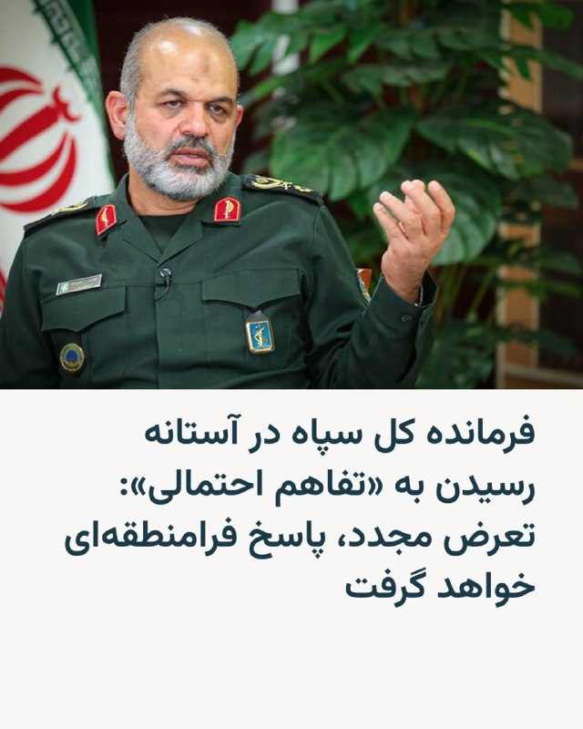

🔸 در حالی که خبرگزاری نزدیک به سپاه پاسداران از نزدیک شدن طرفین به یک «تفاهم اولیه» خبر می‌دهد، فرمانده کل سپاه پاسداران در پیامی به مناسبت روز سوم خرداد که در ایران به عنوان «سالروز آزادسازی خرمشهر» گرامی داشته می‌شود، به آمریکا درباره «تعرض مجدد» هشدار داد.

🔸همزمان خبرگزاری تسنیم، نزدیک به سپاه پاسداران، روز یک‌شنبه از «تفاهم اولیه احتمالی» نوشته و جزئیات آن را بر اساس «شنیده‌ها»ی خود شرح داده است.

🔸 بر اساس گزارش تسنیم که بسیار نزدیک به گزارش سایت اکسیوس از جزئیات تفاهم‌نامه است، در تفاهم‌نامه «یک بازه ۳۰ روزه برای اجرای اقدامات مرتبط با محاصره دریایی و تنگه هرمز در نظر گرفته شده و همزمان، دوره‌ای ۶۰ روزه برای مذاکرات درباره موضوع هسته‌ای تعریف خواهد شد».

🔸 تسنیم در ادامه همچون خبرگزاری فارس نوشته است:‌ «ایران در مقطع کنونی هیچ اقدامی را در حوزه هسته‌ای نپذیرفته است.»

@RadioFarda

## RadioFarda — post 157507

  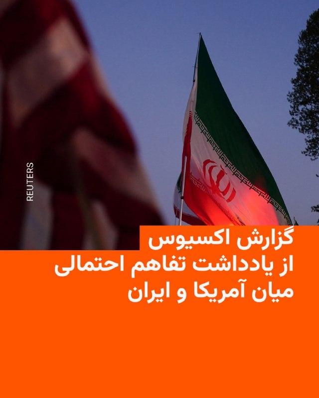

🔸وب‌سایت خبری اکسیوس روز یک‌شنبه در گزارشی به نقل از منابع خود که به نام‌شان اشاره نکرد نوشت که حکومت ایران و ایالات متحده به امضای یک «یادداشت تفاهم ۶۰ روزه» نزدیک شده‌اند.

🔸به طور خلاصه، این تفاهم‌نامه که می‌تواند آتش‌بس را تمدید کرده، تنگه هرمز را باز کرده و به دور جدیدی از مذاکرات اتمی بینجامد توافق نهایی نیست.

🔸بر اساس این تفاهم‌نامه که می‌تواند با توافق طرفین تمدید شود ایران متعهد می‌شود که تنگه هرمز را بدون دریافت عوارض باز کند و مین‌هایی را که احتمالا در آب رها کرده جمع‌آوری کند.

🔸در مقابل،‌ دولت دونالد ترامپ به محاصره بنادر ایران پایان خواهد داد، و ایران را از برخی از تحریم‌ها معاف خواهد کرد تا بتواند نفت خود را در بازار جهانی به فروش برساند.

🔸مسائل اتمی میان ایران و آمریکا در این ۶۰ روز حل نخواهد شد، بلکه تفاهم‌نامه به یک دوره از مذاکره درباره مسائل اتمی ختم خواهد شد که در آن، بنا بر امیدواری موجود، حکومت ایران تعهد می‌کند که هرگز به دنبال سلاح اتمی نباشد و دو طرف درباره تعلیق برنامه عنی‌سازی اورانیوم و انتقال ذخیره اورانیوم ایران گفت‌وگو و مذاکره خواهند کرد.

@RadioFarda

## RadioFarda — post 157506

  

🔸پس از آن که دونالد ترامپ در پیامی در شبکه اجتماعی خود از نهایی شدن جزئیات توافق با جمهوری اسلامی خبر داد، نخست وزیر پاکستان در پیامی در شبکه ایکس برای برگزاری دور جدید مذاکرات ابراز امیدواری کرد و خبرگزاری فارس پیام‌های رئیس جمهور آمریکا را «تبلیغاتی و برای مصرف در داخل آمریکا» توصیف کرد.

🔸دونالد ترامپ، رئیس‌جمهور ایالات متحده، شامگاه شنبه دوم خرداد به وقت تهران اعلام کرد که با رهبران چند کشور خاورمیانه دربارهٔ جمهوری اسلامی ایران و همهٔ موضوعات مرتبط با تفاهم‌نامهٔ صلح گفت‌وگو کرده و توافق با ایران تا حد زیادی نهایی شده است.

🔸با این حال پیام پاکستان به عنوان میانجی اصلی و همین طور خبر فارس به عنوان خبرگزاری نزدیک به سپاه پاسداران در ایران حکایت از آن دارد که راه رسیدن به توافق هنوز به پایان نرسیده است.

🔸همزمان وب‌سایت خبری اکسیوس از آماده شدن پیش‌نویس تفاهم‌نامه‌ای می‌گوید که «ترامپ در شرف امضا کردن است».

🔸ساعاتی پیش خبرگزاری فارس در همین زمینه نوشته بود:‌ «هیچ تعهدی از سوی ایران داده نشده و پروندهٔ هسته‌ای اساساً در این مرحله مورد بحث قرار نگرفته است.»

@RadioFarda

## RadioFarda — post 157505

  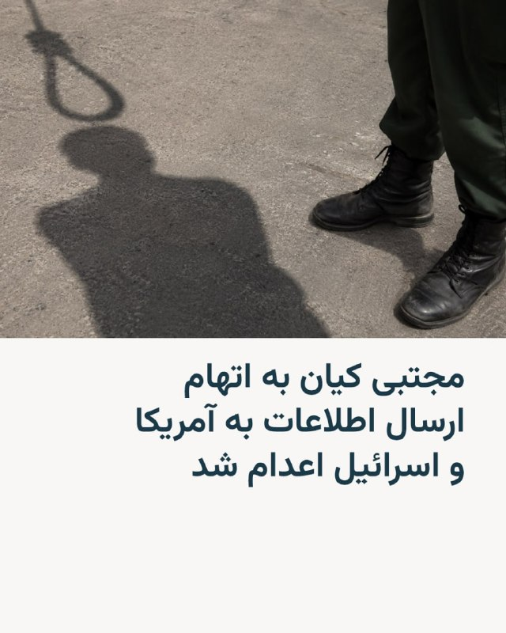

🔸قوه قضاییه جمهوری اسلامی روز یک‌شنبه، سوم خرداد از اعدام فردی به نام مجتبی کیان به عنوان «عامل ارسال اطلاعات مراکز تولید صنایع دفاعی»‌ ایران به آمریکا و اسرائیل خبر داد.

🔸خبرگزاری میزان نوشت که کیان «از عناصر همکار دشمن» بوده که در طول جنگ اخیر «اقدام به ارسال اطلاعات مرتبط با واحدهای صنایع دفاعی کشور» کرده و پس از رسیدگی قضایی در دادگستری استان البرز بامداد یک‌شنبه «پس از تأیید حکم از سوی دیوان عالی کشور... به دار مجازات آویخته شد».

🔸این خبرگزاری هیچ اطلاعاتی درباره حرفه این فرد نداده و مشخص نیست که مجتبی کیان چگونه به «اطلاعات صنایع دفاعی» دسترسی داشته است.

🔸همزمان در ادامه خبر میزان آمده است که او «پیام‌های متعددی را به شبکه‌های معاند» فرستاده است. در ادبیات جمهوری اسلامی، شبکه معاند اشاره به شبکه‌های فارسی‌زبان خارج از کشور دارد.

🔸ایران در ماه‌های اخیر با موج تازه‌ای از اعدام‌ها، بازداشت‌ها و صدور احکام سنگین روبه‌رو بوده است؛ موجی که به گفتهٔ نهادها و سازمان‌های حقوق بشری، در فضای جنگ، بحران امنیتی و اعتراضات، به‌عنوان ابزاری برای ایجاد ترس و کنترل جامعه عمل می‌کند.

@RadioFarda

## RadioFarda — post 157504

🔸تیراندازی در حوالی کاخ سفید در روز شنبه دوم خرداد یک کشته و یک زخمی بر جا گذاشت.

🔸به گزارش سرویس مخفی پس تیراندازی فرد مظنون به سمت ایست بازرسی کاخ سفید، مأموران به سوی او شلیک کردند و او پس از انتقال به بیمارستان جان باخت.

🔸یک مقام انتظامی به رویترز گفت که مظنون به‌عنوان فردی با اختلالات روانی شناسایی شده است.

🔸طبق یک بیانیه سرویس مخفی در جریان تیرانداری یک رهگذر نیز مورد اصابت گلوله قرار گرفت، اما مشخص نیست که این شخص چقدر آسیب دیده و چه کسی به سمت او شلیک کرده است.

🔸بنا بر اعلام سرویس مخفی دونالد ترامپ، رئیس جمهور، در زمان وقوع حادثه در کاخ سفید حضور داشته است و هیچ یک از پرسنل انتظامی زخمی نشده‌اند.

@RadioFarda

## RadioFarda — post 157503

  <a href="https://t.me/radiofarda/157503" target="_blank">📎 Download file</a>

📻بشنوید: سرخط خبرها با رادیوفردا، سوم خرداد ۱۴۰۵‌

@RadioFarda

## IranianMinds — post 20656

  

⚫️ جمهوری اسلامی یکی دیگه از هموطن هامونو هم امروز کشت.

خبرگزاری قوه قضائیه جمهوری اسلامی اعلام کرد مجتبی کیان امروز صبح به دلیل ارسال پیام و دادن مختصات صنایع نظامی به شبکه های ماهواره ای معاند ( ایران اینترنشنال ) اعدام شد.

@IranianMinds

## IranianMinds — post 20655

این اخباری که داره میاد با هیچکدوم از حرف های ترامپ و کلا باورهاش سازگار نیست. همه چیز مشکوکه و باید صبر کنیم خود ترامپ درباره جزییاتش صحبت بکنه.

وگرنه باراک اوباما بدون ریختن خون یک نفر و بدون هیچ جنگی توافقی بهتر از این با جمهوری امضا کرد

تازه تنگه هرمز هم بسته نشد
نفت هم گرون نشد
پایگاه های آمریکا هم آسیب ندیدن
کشور های منطقه هم آسیب ندیدن

جهان بینی آمریکا، مخصوصا جمهوری خواهان اصلا اجازه چنین توافقی نمیده.
حتی اگر توافق بشه، بعد از خارج کردن اورانیوم جمهوری اسلامی به احتمال زیاد بهشون حمله میشه

## IranianMinds — post 20654

🔴 فوری

تنش ها در میان مقامات آمریکایی در حال افزایش است زیرا توافق نامه صلح ترامپ در آینده با ایران واکنش ها را برانگیخته است.
بسیاری از افراد پر نفود جمهوری خواه مخالفت شدید خود را با این توافق اعلام کرده اند.

@IranianMinds

## IranianMinds — post 20653

  

🔴 هشدار شدید پمپئو به ترامپ:

‏به نظر می‌رسد توافقی که با ایران در حال انجام است، به‌طور مستقیم از روی نقشه وندی شرمن-رابرت مالی-بن رودز بیرون آمده: به سپاه پاسداران پول بدهید تا یک برنامه سلاح‌های کشتار جمعی بسازد و جهان را ترور کند.
‏این اصلا ربطی به شعار «اول آمریکا» ندارد.
‏موضوع خیلی ساده است:
‏تنگه را باز کنید.
‏دسترسی ایران به پول را قطع کنید.
‏و آن‌قدر توانایی‌های ایران را هدف قرار دهید که دیگر نتواند متحدان ما در منطقه را تهدید کند.
‏خیلی دیر شده.
‏وقتشه اقدام کنند.

@IranianMinds

## IranianMinds — post 20651

🔴 توییت‌های تد کروز و لیندسی گراهام در واکنش به اخبار منتشر شده درباره توافق احتمالی

@IranianMinds

## IranianMinds — post 20650

آمریکای جهان‌خوار به ما که رسید شد گیاهخوار

@IranianMinds

## IranianMinds — post 20649

🔴 ترامپ :

«از سرویس مخفی و مجری قانون بزرگ ما برای اقدام سریع و حرفه ای که امروز عصر علیه مرد مسلحی در نزدیکی کاخ سفید انجام شد، که سابقه خشونت آمیز و احتمال وسواس احتمالی نسبت به ارزشمندترین ساختار کشورمان داشت، سپاسگزاریم. مرد مسلح پس از تبادل آتش با ماموران سرویس مخفی در نزدیکی دروازه های کاخ سفید کشته شد. این رویداد یک ماه از تیراندازی در مراسم شام خبرنگاران کاخ سفید حذف شده است و نشان می‌دهد که برای همه روسای جمهور آینده چقدر مهم است که امن‌ترین و امن‌ترین فضایی را که در نوع خود در واشنگتن دی سی ساخته شده است، داشته باشند.

@IranianMinds

## BBCPersian — post 281935

🔻 مخالفت روزنامه کیهان با برگشتن تنگه هرمز به وضعیت پیش از جنگ

حسین شریعتمداری، مدیر مسئول روزنامه کیهان، در یادداشتی درباره برگشتن تنگه هرمز به وضعیت پیش از جنگ، نوشت: «تنگه هرمز بخشی از آب‌های سرزمینی ایران است و این حق قانونی برای کشورمان محفوظ است که از کشتی‌ها و شناورهای عبورکننده از آب‌های سرزمینی خود عوارض عبور بگیرد.»

«این روزها در برخی از اخبار و گزارش‌ها به عبور ده‌ها کشتی از تنگه هرمز اشاره می‌شود با این تأکید که عبور آنها با کسب اجازه و تحت کنترل نیروی دریادل سپاه پاسداران صورت می‌پذیرد اما توضیحی داده نمی‌شود که آیا از این کشتی‌ها و شناورها، حق عبور نیز دریافت می‌شود یا نه؟ اگر پاسخ منفی است، باید آن را غفلت از یک اقدام ضروری تلقی کرد. چرا که عوارض عبور، حق قانونی ایران اسلامی است و نباید نادیده گرفته شود.»

او در انتها از تیم مذاکره کننده انتقاد کرد: «همین جا باید از اظهارات برخی از دیپلمات‌ها و تیم مذاکره‌کننده کشورمان گلایه کرد که انگار قرار است بعد از پایان جنگ، شرایط و قوانین حاکم بر تنگه به حالت پیش از جنگ بازگردد. و انگار نه انگار که اِعمال حاکمیت ایران بر تنگه هرمز، حق قانونی و قطعی کشورمان است‌.»

https://bbc.in/4nJgJqO
@BBCPersian

## BBCPersian — post 281934

🔻 دستفروشی در ایران؛ خوداشتغالی برای بقا و مبارزه شخصی با فقر

علی رمضانیان - روزنامه‌نگار
پدیده دستفروشی در ایران دیگر صرفا یک شغل حاشیه‌ای و موقت برای اقشار کم‌ درآمد محسوب نمی‌شود؛ بلکه در سال‌های اخیر به یکی از آشکارترین نشانه‌های بحران اقتصادی، گسترش فقر و فرسایش طبقه متوسط تبدیل شده است.

در شهرهای بزرگ ایران، از تهران و مشهد تا اهواز، تبریز، شیراز و کرج، دستفروشان اکنون به بخشی جدایی‌ناپذیر از چهره خیابان‌ها، متروها، پیاده‌روها و حتی بزرگراه‌ها بدل شده‌اند.

بسیاری از کارشناسان اقتصادی معتقدند رشد فزاینده دستفروشی، بازتاب مستقیم بیکاری، سقوط قدرت خرید خانوارها، گسترش اقتصاد غیررسمی، فرار مالیاتی، کاهش امنیت شغلی و تضعیف تدریجی بازار رسمی کار است.

https://bbc.in/4fF8Yjz
@BBCPersian

## BBCPersian — post 281933

🔻 وزارت اطلاعات ایران می‌گوید ۱۵ نفر را در استان فارس دستگیر کرده است

اداره کل اطلاعات استان فارس گفت که ۱۵ نفر را در این استان دستگیر کرده که از «عناصر آشوبگر و تروریستی» بوده‌اند.

به گفته این اداره، این «یک شبکه آموزش دیده» بود و از این افراد «مقادیری سلاح مهمات، ابزارهای خرابکاری برای هدف قرار دادن اماکن دولتی و تجمعات مردمی کشف و ضبط گردید.»

https://bbc.in/4uoSII9
@BBCPersian

## BBCPersian — post 281932

🔻 اسرائیل: در ۲۴ ساعت گذشته سه انبار سلاح حماس را در نوار غزه منهدم کردیم

ارتش اسرائیل می‌گوید در شبانه‌روز گذشته «به سه انبار سلاح حماس در مرکز نوار غزه حمله و آنها را منهدم» کرده است.

به گفته اسرائیل در این انبارها «موشک‌های ضد تانک، سلاح‌های دوربرد، آرپی‌جی، جلیقه‌های ضدگلوله و تجهیزات جنگی» وجود داشت.

روز چهارشنبه هم ارتش اسرائیل یک انبار دیگر حماس را از بین برده بود.

ارتش اسرائیل در پایان اعلام این خبر گفته «مطابق با توافق آتش‌بس» همچنان به فعالیت ادامه خواهد داد و «به عملیات خود برای رفع هرگونه تهدید فوری ادامه» می‌دهد.

https://bbc.in/4dsLOLV
@BBCPersian

## BBCPersian — post 281931

  

🔻انفجاری بزرگ در نزدیکی یک قطار که از گذرگاه چمن در شهر کویته در ایالت بلوچستان پاکستان عبور می‌کرد، تعداد زیادی کشته و ده‌ها نفر زخمی برجا گذاشت.

یک مقام ارشد پلیس بلوچستان و یکی از مسئولان این ایالت به محمد کاظم، خبرنگار بی‌بی‌سی اردو، گفت تاکنون کشته شدن ۲۰ نفر در این انفجار تأیید شده و دست‌کم ۷۰ نفر زخمی شده‌اند.
در پی این حادثه، در بیمارستان‌های شهر کویته وضعیت اضطراری اعلام شده است.

تصاویر منتشرشده پس از حادثه نشان می‌دهد که چندین خودرو در نزدیکی خط آهن آتش‌ گرفته‌اند و واگن‌های قطار نیز روی ریل واژگون شده‌اند.

گروه جدایی‌طلب «ارتش آزادیبخش بلوچ» مسئولیت این حمله را به عهده گرفته‌ است.

بیشتر بخوانید:

https://bbc.in/43vfz8U
@BBCPersian

## BBCPersian — post 281930

🔻 کشته شدن یک کارمند کنسولگری جمهوری آذربایجان در تصادف جاده‌ای

رسانه‌های ایران گزارش کرده‌اند که رامیل عمران‌اُف، کارمند بخش کنسولگری جمهوری آذربایجان در تبریز، در یک سانحه رانندگی در محور مرند - جلفا جان خود را از دست داده است.

حبیب آبراهه، رئیس پلیس راه آذربایجان شرقی، گفته است این تصادف در ساعت ۱۲:۵۰ روز شنبه رخ داد و «در این حادثه یک دستگاه سواری کیا اسپورتیج با پلاک دیپلماتیک جمهوری آذربایجان با یک دستگاه کامیون میکسر حمل بتن برخورد کرد.»

https://bbc.in/4o5dKtb
@BBCPersian

## BBCPersian — post 281929

  

‌ ‌ ‌
استیون چونگ، مدیر ارتباطات کاخ سفید، در واکنش به انتقادهای مایک پمپئو از توافق احتمالی با ایران، در شبکه اجتماعی ایکس حمله تندی به وزیر خارجه پیشین آمریکا کرد.

آقای چونگ نوشت: «مایک پمپئو هیچ درکی از موضوع ندارد. بهتر است دهانش را ببندد و کار واقعی را به حرفه‌ای‌ها واگذار کند.»

او همچنین گفت آقای پمپئو «در جریان اتفاقات نیست» و به همین دلیل «نمی‌داند چه می‌گذرد.»

این واکنش پس از آن مطرح شد که مایک پمپئو در پیامی در ایکس، توافق احتمالی با ایران را شبیه سیاست‌های دولت جو بایدن توصیف کرد و هشدار داد که چنین توافقی می‌تواند به ایران امکان دسترسی به منابع مالی، ادامه غنی‌سازی اورانیوم و نفوذ بیشتر بر تنگه هرمز را بدهد.

اظهارات آقای چونگ در حالی مطرح می‌شود که دونالد ترامپ ساعاتی پیش گفته بود بخش عمده توافق با ایران «مذاکره شده» و بازگشایی تنگه هرمز هم شامل آن خواهد بود.

https://bbc.in/49LCGzK
📷EPA/Shutterstock
@BBCPersian

## BBCPersian — post 281928

  

‌ ‌ ‌ ‌
خبرگزاری میزان، وابسته به قوه‌ قضائیه ایران خبر از اعدام مجتبی کیان، به اتهام «فعالیت اطلاعاتی» برای اسرائیل و آمریکا در جنگ اخیر داده است.

قوه قضائیه جمهوری اسلامی گفته که مجتبی کیان «در طول جنگ رمضان اقدام به ارسال اطلاعات مرتبط با واحد‌های صنایع دفاعی کشور به دشمن می‌کرد.»

به گفته رسانه دستگاه قضایی آقای کیان در طول جنگ اخیر «پیام‌های متعددی را به شبکه‌های معاند» ارسال می‌کرده «که از جمله آنها، مختصات و اطلاعات محل واحد‌های تولید قطعات مرتبط با صنایع دفاعی کشور بود.»

میزان تاکید کرده که یکی از دلایل صدور حکم اعدام برای آقای کیان «اعترافات» او پیش از دادگاه و در دادگاه بوده است.

نهادهای حقوق بشر از دادرسی‌های ناعادلانه، نقض حقوق متهم و موج اعدام‌ها بر اساس «اعترافات» زیر شکنجه و فشار برای صدور احکام اعدام در ایران ابراز نگرانی کرده‌اند.

https://bbc.in/4a0m5Ir
📷Getty
@BBCPersian

## BBCPersian — post 281927

🔻سی‌بی‌اس: مظنون تیراندازی در نزدیکی کاخ سفید سابقه درگیری با سرویس مخفی داشت

منابع آگاه به سی‌بی‌اس نیوز شریک خبری بی‌بی‌سی، گفتند که مظنون کشته‌شده در تیراندازی بیرون کاخ سفید، شناسایی شده است و نامش «نصیر بِست» و ۲۱ ساله بود.

https://bbc.in/4wGRQA5
@BBCPersian

## BBCPersian — post 281926

🔻تد کروز: توافقی که به ایران امکان کنترل تنگه هرمز بدهد، اشتباهی فاجعه‌بار است

تد کروز، سناتور جمهوری‌خواه آمریکا، در واکنش به گزارش‌ها درباره توافق احتمالی با ایران، در شبکه اجتماعی ایکس نوشت که نسبت به آنچه «توافق ایران» خوانده می‌شود و به گفته او برخی در دولت آمریکا در حال پیشبرد آن هستند، «عمیقا نگران» است.

او نوشت که تصمیم دونالد ترامپ برای حمله به ایران «مهم‌ترین تصمیم» دوره دوم ریاست‌جمهوری او بود و افزود که آمریکا «نتایج نظامی فوق‌العاده‌ای» به دست آورده است؛ از جمله به گفته او نابودی همه موشک‌ها و پهپادهای ایران و غرق کردن تمام نیروی دریایی آن کشور.

سناتور کروز می‌گوید که اسلامگرایان حاکم بر ایران، همچنان شعار «مرگ بر آمریکا» سر می‌دهند و نوشت که اگر نتیجه این تحولات آن باشد که این حکومت بعد از این توافق «میلیاردها دلار دریافت کند، اورانیوم غنی‌سازی کند و سلاح هسته‌ای توسعه دهد و کنترل موثر بر تنگه هرمز داشته باشد، این یک اشتباه فاجعه‌بار خواهد بود.»

او همچنین نوشت که جزئیات توافق هنوز در حال روشن شدن است، اما این‌که راب مالی، نماینده پیشین دولت جو بایدن در امور ایران، از آن حمایت کرده «دلگرم‌کننده نیست.»

سناتور کروز در پایان گفت که دونالد ترامپ به «صلح از مسیر قدرت» باور دارد و باید به دفاع از آمریکا و اجرای «خطوط قرمز» اعلام‌شده ادامه دهد.

https://bbc.in/4dIXh98
@BBCPersian

## BBCPersian — post 281925

  

🔻مایک جانسون، رئیس مجلس نمایندگان آمریکا، از توافق در حال شکل‌گیری با ایران حمایت کرد و در شبکه اجتماعی ایکس نوشت تنها دونالد ترامپ می‌توانست ایران را «پای میز مذاکره» بیاورد.

آقای جانسون نوشت: «از این‌که می‌شنویم توافق صلح با ایران در حال شکل‌گیری است، بسیار دلگرم شده‌ایم و منتظریم جزئیات بیشتری درباره آن منتشر شود.»

او همچنین افزود: «تحت رهبری رئیس‌جمهور ترامپ، کشور ما قدرتمندتر، در صحنه جهانی محترم‌تر و امن‌تر از هر زمان دیگری است.»

📸 Reuters

https://bbc.in/4dIXh98
@BBCPersian

## BBCPersian — post 281924

🔻اختلاف جمهوری‌خواهان بر سر توافق احتمالی ترامپ با ایران

اعلام دونالد ترامپ، رئیس جمهور آمریکا مبنی بر «تا حد زیادی مذاکره شدن» توافق با ایران، که به گفته او شامل بازگشایی تنگه هرمز نیز می‌شود، واکنش‌های متفاوتی را در میان جمهوری‌خواهان و متحدان سیاسی او در آمریکا برانگیخته است.

https://bbc.in/4nPu9BJ
@BBCPersian

## BBCPersian — post 281923

🔻دنیس راس: ایران در آینده از تنگه هرمز به‌عنوان اهرم فشار استفاده خواهد کرد

دنیس راس، دیپلمات باسابقه و مذاکره کننده سابق آمریکایی در شبکه اجتماعی ایکس نوشت که توافق در حال شکل‌گیری درباره بازگشایی تنگه هرمز است.

او نوشت: «ما محاصره خود را برمی‌داریم و آن‌ها اجازه عبور همه کشتی‌ها را می‌دهند؛ همان‌طور که پیش از جنگ برقرار بود.»

آقای راس افزود که قرار است طی ۶۰ روز آینده درباره برنامه هسته‌ای ایران مذاکره شود؛ توافقی که هدف آن پایان دادن به این برنامه نیست، بلکه محدود کردن آن است.

او همچنین مدعی شد که ایران در آینده از تنگه هرمز به‌عنوان اهرم فشار استفاده خواهد کرد.

https://bbc.in/4dIXh98
@BBCPersian

## BBCPersian — post 281922

🔻لیندزی گراهام: توافقی که به بقای حکومت ایران منجر شود بر درگیری‌های منطقه بنزین می‌ریزد

لیندزی گراهام، سناتور ارشد جمهوری‌خواه آمریکا، در پیامی در شبکه اجتماعی ایکس نوشت که اگر در منطقه چنین برداشت شود که توافق با ایران به حکومت آن کشور امکان بقا و قدرتمندتر شدن در گذر زمان را می‌دهد، در واقع «بر درگیری‌های لبنان و عراق بنزین ریخته‌ایم.»

او افزود توافقی که این تصور را ایجاد کند که ایران می‌تواند بقا پیدا کند و در آینده توان کنترل تنگه هرمز را داشته باشد، حزب‌الله در لبنان و شبه‌نظامیان شیعه در عراق را «به‌شدت تقویت خواهد کرد.»

پست سناتور گراهام بعد از آن است که دونالد ترامپ، رئیس جمهور آمریکا اعلام کرد که گفت‌وگوهای «بسیار خوبی» با شماری از رهبران منطقه داشته است اما جنبه‌ها و جزئیات نهایی توافق با ایران همچنان در حال بررسی است و «به‌زودی» اعلام خواهد شد.

آقای ترامپ همچنین گفت که در چارچوب این توافق، تنگه هرمز بازگشایی خواهد شد.

https://bbc.in/4dIXh98
@BBCPersian

## BBCPersian — post 281921

  

به‌گزارش خبرگزاری فرانسه، شهباز شریف، نخست‌وزیر پاکستان، ابراز امیدواری کرد که کشورش به‌زودی میزبان دور بعدی مذاکرات صلح میان ایران و آمریکا باشد.

آقای شریف در پیامی در شبکه اجتماعی ایکس نوشت: «پاکستان با نهایت صداقت به تلاش‌های صلح خود ادامه خواهد داد و امیدواریم خیلی زود میزبان دور بعدی گفت‌وگوها باشیم.»

به گزارش خبرگزاری رویترز، نخست‌وزیر پاکستان همچنین از دونالد ترامپ به‌دلیل «تلاش‌های فوق‌العاده برای پیگیری صلح»، تقدیر کرد و گفت که گفت‌وگوی تلفنی آقای ترامپ با رهبران عربستان سعودی، قطر، ترکیه، مصر، امارات متحده عربی، اردن و پاکستان «بسیار مفید و سازنده» بوده است.

به گفته آقای شریف، فیلد مارشال عاصم منیر، فرمانده کل ارتش و نیروهای مسلح پاکستان، نماینده آن کشور در تماس تلفنی با آقای ترامپ بود و از «تلاش‌های خستگی‌ناپذیر» او در تمام روند مذاکرات قدردانی کرد.

نخست‌وزیر پاکستان افزود که این گفت‌وگوها فرصتی برای تبادل نظر درباره وضعیت کنونی منطقه و پیشبرد تلاش‌ها برای دستیابی به صلحی پایدار فراهم کرده است.

📸 Reuters

https://bbc.in/4dIXh98
@BBCPersian

## BBCPersian — post 281919

🔻اسماعیل بقائی، سخنگوی وزارت امور خارجه، در پیامی در شبکه اجتماعی ایکس با درج تصویر سنگ‌نگاره پیروزی شاپور اول ساسانی بر امپراتور روم، نوشت: «وقتی ایرانیان مهاجمان متوهم را ناکام گذاشتند.»

او در این پیام که کنایه‌ای است به محاصره دریایی بنادر ایران توسط آمریکا نوشت: «رومیان تصور می‌کردند که رم مرکز عالم است؛ اما ایرانیان این توهم را در هم شکستند.»

پیام آقای بقایی که به نحو گسترده‌ای در کانال‌های تلگرامی رسانه‌های حکومتی ایران بازنشر شده است به نظر می‌رسد که با استفاده از سنگ‌نگاره پیروزی شاپور بر امپراتوران روم در نقش رستم استان فارس بازنقش شده است.

آقای بقایی که اخیرا با حکم محمدباقر قالیباف به عنوان سخنگوی هیئت مذاکره‌کننده ایران هم منصوب شده است با اشاره به لشگرکشی مارکوس یولیوس فیلیپوس معروف به فیلیپ عرب، امپراتور روم، علیه امپراتوری ساسانیان، نوشت که لشگرکشی او «منجر به پیروزی رومیان نشد بلکه به صلحی با شروط شاپور اول ختم شد؛ امپراتور ناچار شد با واقعیت کنار بیاید.»

📸 REUTERS/ IRIMFA_SPOX

https://bbc.in/4dIXh98
@BBCPersian

## BBCPersian — post 281918

  

🔻ایران در جریان جام جهانی امسال، اردوی تیم ملی خود را در شهر مرزی تیخوانا در مکزیک برپا خواهد کرد. این اقدام پس از آن‌ است که فیفا با درخواست انتقال محل اردو از ایالت آریزونا موافقت کرد.

به گزارش رویترز مهدی تاج، رئیس فدراسیون فوتبال ایران، در ویدیویی که در حساب تلگرام فدراسیون منتشر شد گفت: «ما در کمپ تیخوانا مستقر خواهیم شد؛ جایی در نزدیکی اقیانوس آرام و در مرز مکزیک و آمریکا.»

او افزود که این تغییر می‌تواند از مشکلات مربوط به ویزا جلوگیری کند و اعضای تیم خواهند توانست با پروازهای مستقیم ایران‌ایر به مکزیک سفر کنند.

رویترز می‌گوید که فیفا به درخواستش برای اظهار نظر پاسخ نداده است.

ایران نخستین دو مسابقه خود در گروه جی را در لس‌آنجلس برگزار خواهد کرد؛ برابر نیوزیلند در ۲۵ خرداد و بلژیک در ۳۱ خرداد، و سپس ۵ تیر در سیاتل به مصاف مصر خواهد رفت.

مهدی تاج گفت که فاصله پروازی میان تیخوانا و محل بازی‌های تیم در لس‌آنجلس حدود ۵۵ دقیقه است و این شهر نسبت به اردوی قبلی برنامه‌ریزی‌شده در آریزونا به محل مسابقات نزدیک‌تر است.

📸 Reuters

https://bbc.in/4dIXh98
@BBCPersian

## BBCPersian — post 281910

🖌بی‌بی‌سی موندو:

🔻اف‌بی‌آی به تازگی اعلام کرده است که برای دریافت اطلاعات منجر به بازداشت و محاکمه مونیکا ویت، عضو پیشین نیروهای مسلح و مامور سابق ضدجاسوسی آمریکا، ۲۰۰ هزار دلار جایزه تعیین کرده است.

مونیکا ویت در فوریه ۲۰۱۹ از سوی یک هیئت منصفه فدرال در واشنگتن به جاسوسی، از جمله از طریق انتقال اطلاعات مربوط به دفاع ملی به حکومت ایران، متهم شد.

اف‌بی‌آی در بیانیه‌ای در ۱۴ مه ۲۰۲۶ اعلام کرد که همچنان در تلاش برای یافتن این فرد است که بر اساس اطلاعات موجود در کیفرخواست او، در سال ۲۰۱۳ به ایران پناهنده شده است.

📸GettyImages/ FBI

https://bbc.in/4dFATNH
@BBCPersian

## idfinfarsi — post 11629

  <a href="telegram/content/idfinfarsi_11629_1779610376.mp4" target="_blank">🎬 Download video</a>

‼️به طول حدود ۱۰۰ متر: نیروهای تیپ ۸۱۰ یک مسیر زیرزمینی متعلق به سازمان تروریستی حزب‌الله را منهدم کردند

⭕️نیروهای تیپ «کوهستان‌ها» (۸۱۰) تحت فرماندهی لشکر ۲۱۰، در منطقه کوه دوو در لبنان برای شناسایی و انهدام زیرساخت‌های تروریستی سازمان تروریستی حزب‌الله در حال فعالیت هستند.

⭕️این نیروها با همکاری یگان مهندسی ویژه، یک مسیر زیرزمینی به طول حدود ۱۰۰ متر را شناسایی و منهدم کردند؛ مسیری که شامل چهار اتاق اقامت بود و توسط تروریست‌های سازمان تروریستی حزب‌الله مورد استفاده قرار می‌گرفت.

⭕️ارتش اسرائیل به فعالیت خود علیه تهدیدات علیه شهروندان این کشور و نیروهایش ادامه خواهد داد و مطابق با دستورالعمل‌های سطوح سیاسی عمل می‌کند.

## idfinfarsi — post 11628

  <a href="telegram/content/idfinfarsi_11628_1779610378.mp4" target="_blank">🎬 Download video</a>

‼️در تلاش مستمر برای رفع تهدید: ارتش اسرائیل در روزهای اخیر چندین انبار تسلیحاتی متعلق به سازمان تروریستی حماس را هدف قرار داده و نابود کرد

⭕️نیروهای ارتش اسرائیل تحت فرماندهی جنوب، طی شبانه‌روز گذشته (شنبه)، سه انبار تسلیحات متعلق به سازمان تروریستی حماس را در مرکز نوار غزه هدف قرار داده و منهدم کردند.
در میان تسلیحات موجود در این انبارها که در پی این حمله نابود شد، مواردی چون موشک‌های ضدزره، سلاح‌های سبک، آرپی‌جی (RPG)، جلیقه‌های رزمی و سایر تجهیزات نظامی وجود داشت.

⭕️در رویدادی دیگر در اوایل همین هفته (چهارشنبه)، نیروهای ارتش اسرائیل تحت فرماندهی جنوب یک انبار تسلیحاتی دیگر را در مرکز نوار غزه هدف قرار داده و منهدم کردند که در آن مواد منفجره، راکت‌اندازهای RPG، نارنجک‌های دستی و خشاب‌ها نگهداری می‌شد.

⭕️این تسلیحات برای حمله به نیروهای ارتش اسرائیل که در محدوده خط زرد فعالیت می‌کنند و همچنین غیرنظامیان اسرائیلی در نظر گرفته شده بود و به‌منظور رفع تهدید نابود شد.

⭕️پس از این حملات، انفجارهای ثانویه‌ای شناسایی شد که نشان‌دهنده وجود مهمات در این انبارها بود.

⭕️نیروهای ارتش اسرائیل تحت فرماندهی جنوب مطابق با توافق در منطقه مستقر هستند و به فعالیت خود برای رفع هرگونه تهدید فوری ادامه خواهند داد.

## Dirty_Kids — post 390061

  

ما چه‌ها از سر که نگذروندیم!

@Dirty_Kids 👻

## Dirty_Kids — post 390060

  

ولا حق داری 🫠💅

@Dirty_Kids 👻

## Dirty_Kids — post 390059

  <a href="telegram/content/Dirty_Kids_390059_1779610380.mp4" target="_blank">🎬 Download video</a>

چالش booty transitior دسته جمعی

@Dirty_Kids 👻

## Dirty_Kids — post 390058

  <a href="telegram/content/Dirty_Kids_390058_1779610381.mp4" target="_blank">🎬 Download video</a>

خدمت دوستانی که پنیک (خایه) کردن از مذاکرات

جهت یادوآری باید هر ماه اینو ببینید

+ من که فکر میکنم بعد سفر ترامپ به چین، چین داره اینارو تسلیم میکنه ولی با حفظ آبرو، ترامپم خرش از پل بگذره «اورانیوم» اینارو ول نمیکنه

@Dirty_Kids 👻

## Dirty_Kids — post 390057

  

دست خدا عیان شد
جیمی کارتر جوان شد!

@Dirty_Kids 👻

## Dirty_Kids — post 390056

  <a href="telegram/content/Dirty_Kids_390056_1779610382.webm" target="_blank">🎬 Download video</a>

☢️خفن ترین و‌ قدیمی ترین  انالیزور  ایران ینی دکتر بت 
👍 
🔴هیچ سایت بتی دوست نداره شما کانال دکتر بت رو پیدا کنین چون خیلی سود میکنید🤷‍♂ رایگان بهترین شرط هارو براتون میذاره حتی هزار تومن هم دریافت نمیکنه روزانه میتونی از پیش بینی فوتبال باهاش پول در بیاری…

## Dirty_Kids — post 390055

  <a href="telegram/content/Dirty_Kids_390055_1779610383.webm" target="_blank">🎬 Download video</a>

☢️خفن ترین و‌ قدیمی ترین  انالیزور  ایران ینی دکتر بت 
👍

🔴هیچ سایت بتی دوست نداره شما کانال دکتر بت رو پیدا کنین چون خیلی سود میکنید🤷‍♂

رایگان بهترین شرط هارو براتون میذاره
حتی هزار تومن هم دریافت نمیکنه
روزانه میتونی از پیش بینی فوتبال باهاش پول در بیاری 👌
A2
اگ اهل پیش بینی فوتبالی این کانال اصلا از دست ندین👇

✅https://t.me/+4_ADqwB9e-QwYjlk

✅https://t.me/+4_ADqwB9e-QwYjlk

## Dirty_Kids — post 390054

  

#بخوابیم

@Dirty_Kids 👻

## Dirty_Kids — post 390053

  

آخرین آپدیت از نمودار محبوبیت ترامپ:

@Dirty_Kids 👻

## Dirty_Kids — post 390052

جدی مملکت عالیه. در ۴-۵ ماه اخیر هرکس اندازه بضاعت خودش کیر شد. هیچ دسته یا گروهی رو نمیتونی پیدا کنی که کیر نشده باشه.

@Dirty_Kids 👻

## Dirty_Kids — post 390051

شما اگه امیدوار باشی ایران بهترین جا برای کیر شدنه…

@Dirty_Kids 👻

## Dirty_Kids — post 390050

‏می‌رفتی عروسی پسرت به قر می‌دادی جای این کسشرا!

@Dirty_Kids 👻

## Dirty_Kids — post 390049

  

اتاق جنگ اسرائیل:
ایرانِ آزاد 🦁☀️

@Dirty_Kids 👻

## Hranews — post 113124

یک زن در کرج توسط همسرش به قتل رسید

❗️
❗️
❗️
❗️
❗️ – روز گذشته، یک مرد در کرج با استفاده از سلاح گرم همسر خود را به #قتل رساند. متهم پس از ساعاتی بازداشت شد.

ادامه مطلب

#زن_کشی

↘️
@hranews_bot تماس ✉️ -  @Hranews  کانال هرانا 🆑

## Hranews — post 113123

  

مجتبی کیان به اتهام «جاسوسی» اعدام شد

❗️
❗️
❗️
❗️
❗️ – مرکز رسانه قوه قضاییه از اجرای حکم #اعدام مجتبی کیان، زندانی متهم به #جاسوسی و فعالیت اطلاعاتی به نفع اسرائیل و آمریکا خبر داد. این حکم بامداد امروز پس از تایید در دیوان عالی کشور به اجرا درآمد. بر اساس داده‌های گردآوری‌شده توسط هرانا، همزمان با آغاز درگیری‌های نظامی، روند صدور و اجرای احکام اعدام در پرونده‌های سیاسی و امنیتی افزایش یافته و تاکنون ۳۵ زندانی با این اتهامات در این بازه زمانی اعدام شده‌اند.

ادامه مطلب

#مجتبی_کیان

↘️
@hranews_bot تماس ✉️ -  @Hranews  کانال هرانا 🆑

## manototv — post 105797

  <a href="telegram/content/manototv_105797_1779610384.mp4" target="_blank">🎬 Download video</a>

گزارشگرمنوتو: در سالگرد فاجعه متروپل آبادان، جمعی از ایرانیان مقابل کنسولگری جمهوری اسلامی در هامبورگ تجمع کردند.

این تجمع با حضور اعضای حزب پادشاهی‌خواه میهن‌پرستان ایران و شماری از نزدیکان جان‌باختگان متروپل برگزار شد. شرکت‌کنندگان جمهوری اسلامی را به ناکارآمدی، فساد و بی‌توجهی به جان شهروندان متهم کردند.

ساختمان متروپل آبادان در ۲۳ مه ۲۰۲۲ فرو ریخت؛ فاجعه‌ای که جان ده‌ها نفر را گرفت و به نمادی از بی‌مسئولیتی و فساد ساختاری در جمهوری اسلامی تبدیل شد.

## manototv — post 105796

  

تد کروز، سناتور جمهوری‌خواه آمریکا، در پستی در شبکه اجتماعی ایکس از گزارش‌ها درباره احتمال توافق با جمهوری اسلامی ابراز نگرانی کرد.

او با دفاع از تصمیم دونالد ترامپ برای حمله به ایران، مدعی شد این اقدام به «نتایج نظامی فوق‌العاده» منجر شده و گفت اگر نتیجه نهایی، ادامه حاکمیت جمهوری اسلامی، دریافت میلیاردها دلار، امکان غنی‌سازی اورانیوم و کنترل مؤثر بر تنگه هرمز باشد، چنین توافقی «اشتباهی فاجعه‌بار» خواهد بود.

کروز همچنین نوشت جزئیات هنوز در حال روشن شدن است، اما حمایت برخی چهره‌های دولت بایدن از این توافق را «نگران‌کننده» دانست و از ترامپ خواست بر خطوط قرمز خود پافشاری کند.

## manototv — post 105795

  

قوه قضائیه جمهوری اسلامی اعلام کرد مجتبی کیان، زندانی متهم به ارسال اطلاعات مربوط به مراکز تولید صنایع دفاعی، بامداد امروز اعدام شده است.

رسانه‌های وابسته به قوه قضائیه مدعی شده‌اند او در جریان آنچه مقام‌های جمهوری اسلامی «جنگ رمضان» می‌نامند، اطلاعات و مختصات واحدهای مرتبط با صنایع دفاعی را برای شبکه‌های وابسته به آمریکا و اسرائیل ارسال کرده بود.

این ادعاها به‌طور مستقل قابل راستی‌آزمایی نیست و قوه قضائیه جمهوری اسلامی تاکنون جزئیات شفافی از روند بازداشت، دسترسی متهم به وکیل مستقل، نحوه محاکمه و زمان دقیق رسیدگی منتشر نکرده است.

اجرای این حکم در حالی اعلام شده که جمهوری اسلامی در سال‌های اخیر بارها از پرونده‌های امنیتی و اتهام‌های مرتبط با «جاسوسی» برای صدور و اجرای احکام سنگین، از جمله اعدام، استفاده کرده است.

## manototv — post 105794

  

نیروی دریایی بریتانیا اعلام کرده صدها ملوان این کشور در جبل‌الطارق آماده‌اند تا در صورت دستیابی آمریکا و جمهوری اسلامی به توافق صلح، برای پاکسازی احتمالی مین‌ها در تنگه هرمز اعزام شوند.

بر اساس گزارش آسوشیتدپرس، کشتی پشتیبانی آراف‌ای لایم بِی متعلق به نیروی دریایی سلطنتی بریتانیا در جبل‌الطارق مستقر است و با مهمات و پهپادهای دریایی مین‌یاب مجهز به سونار آماده عملیات احتمالی شده است. این مأموریت قرار است با همکاری بریتانیا و فرانسه انجام شود.

اولویت نخست این عملیات، در صورت اجرا، پاکسازی یک مسیر عبور در تنگه هرمز برای خروج حدود ۷۰۰ کشتی عنوان شده است. پس از آن، مسیر مقابل برای ورود کشتی‌ها پاکسازی خواهد شد؛ هرچند مقام‌ها گفته‌اند پاکسازی کامل تنگه ممکن است ماه‌ها یا حتی سال‌ها زمان ببرد.

## manototv — post 105793

  

محمد اسحاق دار، وزیر خارجه پاکستان، اعلام کرد در تماس تلفنی با دونالد ترامپ درباره مذاکرات میان آمریکا و جمهوری اسلامی گفت‌وگو کرده است.

او این گفت‌وگوی «مهم» را «گامی قابل‌توجه به سوی صلح منطقه‌ای» توصیف کرد و گفت دستاوردهای مذاکرات اخیر، زمینه خوش‌بینی نسبت به یک نتیجه مثبت و پایدار را فراهم کرده است.

پاکستان در روزهای اخیر نقش میانجی کلیدی میان آمریکا و جمهوری اسلامی را برعهده داشته است. اسحاق دار همچنین از «رهبری» ترامپ و «تعهد او به گفت‌وگو و دیپلماسی» تقدیر کرد.

## manototv — post 105792

  

سرویس مخفی آمریکا در بیانیه‌ای اعلام کرد فردی مسلح عصر شنبه در نزدیکی خیابان ۱۷ و پنسیلوانیا، در محدوده کاخ سفید، پس از بیرون آوردن سلاح از کیف خود به سمت ماموران تیراندازی کرد.

ماموران سرویس مخفی در پاسخ به او شلیک کردند و مظنون پس از انتقال به بیمارستان جان باخت. در جریان این تیراندازی، یک رهگذر نیز هدف گلوله قرار گرفت. سرویس مخفی گفته هنوز مشخص نیست این فرد با شلیک مظنون زخمی شده یا در تبادل آتش میان او و ماموران.

بر اساس تصاویر منتشرشده از سلینا وانگ، خبرنگار ای‌بی‌سی نیوز، هم‌زمان با شنیده‌شدن صدای تیراندازی در نزدیکی کاخ سفید، خبرنگاران حاضر در محوطه به سمت اتاق نشست خبری منتقل شدند.

سرویس مخفی اعلام کرد هیچ‌یک از نیروهایش در این حادثه آسیب ندیده‌اند. دونالد ترامپ هنگام وقوع تیراندازی در کاخ سفید حضور داشت، اما این حادثه تاثیری بر او یا عملیات حفاظتی نداشته است. تحقیقات درباره این تیراندازی ادامه دارد. جزئیات اصلی با گزارش رویترز و آسوشیتدپرس هم‌خوانی دارد

## manototv — post 105791

  <a href="telegram/content/manototv_105791_1779610388.mp4" target="_blank">🎬 Download video</a>

تصاویر منتشرشده از سلینا وانگ، خبرنگار ای‌بی‌سی نیوز، لحظه‌ای را نشان می‌دهد که هم‌زمان با شنیده‌شدن صدای تیراندازی در نزدیکی کاخ سفید، خبرنگاران حاضر در محوطه به سمت اتاق نشست خبری منتقل شدند.

سرویس مخفی آمریکا اعلام کرد یک مرد مسلح در نزدیکی ایست بازرسی خیابان ۱۷ و پنسیلوانیا به سوی ماموران شلیک کرد. ماموران نیز در پاسخ تیراندازی کردند و مظنون که به بیمارستان منتقل شده بود، بعداً جان باخت.

در جریان این تیراندازی یک رهگذر نیز زخمی شد. هنوز مشخص نیست این فرد با شلیک مظنون زخمی شده یا در جریان تبادل آتش. دونالد ترامپ هنگام وقوع حادثه در کاخ سفید بود، اما آسیبی ندید.

## manototv — post 105790

  <a href="telegram/content/manototv_105790_1779610389.mp4" target="_blank">🎬 Download video</a>

تماسی از امارات
«می‌گفت مردم ایران عوض شده‌اند…
و این بار باید هوشیارتر، عاقل‌تر و متفاوت‌تر عمل کنند.»

## manototv — post 105789

  <a href="telegram/content/manototv_105789_1779610390.mp4" target="_blank">🎬 Download video</a>

تماسی از سن‌فرانسیسکو:
«می‌گفت با شنیدن صدای شما احساس می‌کنم تو ایرانم…
و از سال‌هایی گفت که با برنامه‌های منوتو خندیده، گریه کرده و زندگی کرده بود.»

## manototv — post 105788

  <a href="telegram/content/manototv_105788_1779610392.mp4" target="_blank">🎬 Download video</a>

تماسی از خارج ایران:
«می‌گفت بسته شدن منوتو برای خیلی‌ها دردناک بود…
و از همراهی و امیدی گفت که این سال‌ها از برنامه‌ها گرفته بودند.

## alonews — post 122256

  <a href="telegram/content/alonews_122256_1779610393.webm" target="_blank">🎬 Download video</a>

👈نخست‌وزیر بریتانیا: از پیشرفت به سمت توافق بین آمریکا و ایران استقبال می‌کنم

🔴ما به توافقی نیاز داریم که به جنگ پایان دهد

🔴ما با شرکای بین‌المللی خود برای غنیمت شمردن این فرصت و دستیابی به یک راه‌حل دیپلماتیک بلندمدت همکاری خواهیم کرد

✅ @AloNews خبر جنگ

## alonews — post 122255

  <a href="telegram/content/alonews_122255_1779610393.mp4" target="_blank">🎬 Download video</a>

👈مارکو روبیو: هیچ مسیر آبی بین‌المللی و هیچ فضای هوایی بین‌المللی نباید هرگز توسط هیچ کشوری در جهان ملی‌سازی شود. این نباید هرگز به عنوان یک هنجار جدید پذیرفته شود.

✅ @AloNews خبر جنگ

## alonews — post 122254

  <a href="telegram/content/alonews_122254_1779610395.webm" target="_blank">🎬 Download video</a>

👈منبع ارشد ایرانی به رویترز: تهران با تحویل ذخیره اورانیوم بسیار غنی شده خود موافقت نکرده است.مسئله هسته‌ای ایران بخشی از توافق اولیه نیست.

✅ @AloNews خبر جنگ

## alonews — post 122253

  <a href="telegram/content/alonews_122253_1779610395.webm" target="_blank">🎬 Download video</a>

👈روبیو: پیشرفت بزرگی در مورد بحران با ایران حاصل شده است

🔴این احتمال وجود دارد که جهان در ساعات آینده اخبار خوبی بشنود

✅ @AloNews خبر جنگ

## alonews — post 122252

  <a href="telegram/content/alonews_122252_1779610395.webm" target="_blank">🎬 Download video</a>

👈روبیو، وزیر خارجه آمریکا: پس از همکاری با کشورهای خلیج فارس، در مورد ایران پیشرفت کرده‌ایم

🔴 احتمالاً اخبار بیشتری درباره ایران امروز منتشر شود

✅ @AloNews خبر جنگ

## alonews — post 122251

  <a href="telegram/content/alonews_122251_1779610395.webm" target="_blank">🎬 Download video</a>

👈ترامپ، سال ۲۰۲۰ میلادی: ایران هرگز جنگی را نبرده، اما هرگز مذاکره‌ای را هم نباخته است

✅ @AloNews خبر جنگ

## alonews — post 122250

اخبار جنگ الونیوز AloNews pinned a photo

## alonews — post 122249

  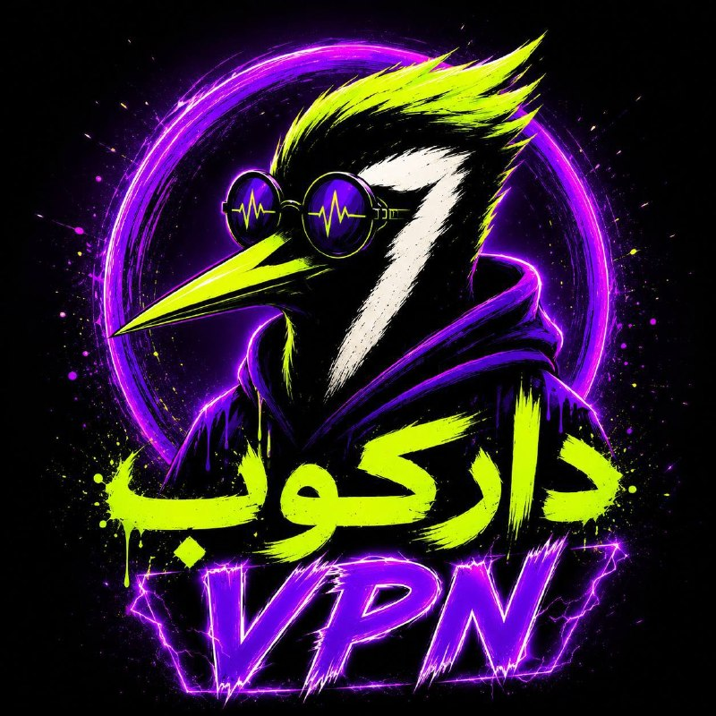

🔴🔴گیگی ۱۴۹ تومن🔴🔴
🔴🔴گیگی ۱۴۹ تومن🔴🔴
🔴🔴گیگی ۱۴۹ تومن🔴🔴
______________________

لینک سابسکریشن ✅

تست رایگان✅

بدون محدودیت کاربر و زمان✅

تضمین عودت وجه✅

@darkoob_config1
@darkoob_config1
@darkoob_config1

## alonews — post 122248

  <a href="telegram/content/alonews_122248_1779610396.webm" target="_blank">🎬 Download video</a>

👈پزشکیان: بنده نسبت به مشکلات اقتصادی و معیشتی مردم، به‌ویژه آسیب‌هایی که در پی شرایط جنگی تشدید شده، احساس مسئولیت جدی دارم و با تمام توان در حال تلاش برای کاهش فشارها بر مردم هستم.

✅ @AloNews خبر جنگ

## alonews — post 122247

  <a href="telegram/content/alonews_122247_1779610396.webm" target="_blank">🎬 Download video</a>

👈پزشکیان: آنچه در مقاطع حساس، ضامن حفظ و ثبات کشور بوده، همبستگی و همدلی مردم و ارکان نظام است.

🔴با وجود مسائل و مشکلات متعدد، از بیان بسیاری از مطالب صرف‌نظر می‌کنم تا مبادا زمینه تفرقه و اختلاف فراهم شود. امروز حفظ وحدت و انسجام ملی به‌مراتب مهم‌تر از مسائل نظامی و امنیتی است

🔴همواره تلاش کرده‌ام سخنی بر خلاف نظر مقام معظم رهبری بیان نشود و یا موضعی اتخاذ نگردد که به اختلاف میان ارکان حاکمیت دامن بزند و دشمن از آن سوءاستفاده کند.

🔴هر سخن، تحلیل یا موضعی که از هر تریبونی، به‌ویژه صدا و سیما، منجر به ایجاد شکاف و تفرقه در جامعه شود، در عمل آب ریختن به آسیاب دشمن است

🔴گاهی برخی کارشناسان در رسانه ملی سخنانی مطرح می‌کنند که با واقعیت‌های جاری کشور و روندهای موجود فاصله جدی دارد، اما دولت به‌منظور جلوگیری از اختلاف و حفظ آرامش جامعه، از واکنش و موضع‌گیری پرهیز می‌کند

✅ @AloNews خبر جنگ

## alonews — post 122246

  <a href="telegram/content/alonews_122246_1779610397.webm" target="_blank">🎬 Download video</a>

👈‌فارس: بررسی متن نهایی‌شده توافق احتمالی، نشان می‌دهد آمریکا و متحدانش متعهد می‌شوند که به هیچ وجه به ایران یا متحدانش حمله نکنند.

🔴در مقابل، ایران نیز متعهد شده که خود و متحدانش به آمریکا و متحدان آن حملۀ نظامی پیش دستانه نداشته باشند.

🔴طبق پیش‌نویس توافق، طرفین بر سر آزادسازی تمام یا بخشی از پول‌های مسدودشدهٔ ایران به منظور ورود به مذاکره توافق کرده‌اند

🔴همچنین طبق این پیش‌نویس، امکان تردد در تنگهٔ هرمز به تعداد قبل از جنگ و با مدیریت ایران، همزمان با برداشتن محاصرهٔ دریایی فراهم می‌شود.

🔴علاوه بر این، تحریم‌های نفت، گاز، پتروشیمی و مشتقات آن در دورهٔ مذاکره به‌طور موقت لغو می‌شود تا ایران بتواند آزادانه به فروش محصولات خود بپردازد.

✅ @AloNews خبر جنگ

## alonews — post 122245

  <a href="telegram/content/alonews_122245_1779610397.webm" target="_blank">🎬 Download video</a>

👈خبرگزاری معتبر تسنیم: پیش نویس توافق با واشنگتن مقرر می‌کند که وضعیت حاکمیتی تنگه هرمز به شرایط پیش از جنگ باز نگردد و تنها تعداد کشتی‌های عبوری ظرف ۳۰ روز بازیابی شود، که همزمان با رفع کامل محاصره دریایی و اجرای تعهدات آمریکا است. تهران بر حفظ حق حاکمیتی خود بر این تنگه تأکید دارد

✅ @AloNews خبر جنگ

## alonews — post 122244

  <a href="telegram/content/alonews_122244_1779610397.webm" target="_blank">🎬 Download video</a>

👈العربی الجديد به نقل از منبع ایرانی:
پیش‌نویس توافق بین تهران و واشنگتن شامل پایان جنگ در تمام جبهه‌ها از جمله لبنان است
 

🔴بخش بزرگی از دارایی‌های مسدود شده ایران در خارج آزاد خواهد شد و محاصره دریایی برداشته شده و تنگه هرمز بازگشایی می‌شود

🔴 وضعیت موجود در پرونده هسته‌ای و تحریم‌ها حفظ خواهد شد
 

🔴 تهران در دوره ۶۰ روزه از کاهش تحریم‌ها برای فروش نفت خود بهره‌مند خواهد شد
 

🔴 هنوز برخی اختلافات برای حل شدن قبل از اعلام توافق موقت باقی است و توپ در زمین آمریکاست
 

🔴هیچ چیز را نمی‌توان تضمین شده یا نهایی دانست مگر اینکه همه جزئیات توافق شود

✅ @AloNews خبر جنگ

## alonews — post 122243

  <a href="telegram/content/alonews_122243_1779610397.webm" target="_blank">🎬 Download video</a>

👈راضیه عالیشوندی، معاون امور بین‌الملل و حقوق بشردوستانه جمعیت هلال‌احمر: محموله‌های کمک‌های بشردوستانه کشورهای عراق، ازبکستان و قزاقستان وارد ایران شد.

🔴این کمک‌ها شامل اقلام غذایی، دارویی و تجهیزات پزشکی است.

🔴این کمک‌ها در راستای حمایت از عملیات امدادی و تامین نیازهای اقشار آسیب‌پذیر در اختیار جمعیت هلال‌احمر قرار گرفته است

✅ @AloNews خبر جنگ

## alonews — post 122242

  <a href="telegram/content/alonews_122242_1779610397.webm" target="_blank">🎬 Download video</a>

👈نخست‌وزیر پاکستان، شہباز شریف: من به رئیس‌جمهور دونالد ترامپ بابت تلاش‌های فوق‌العاده‌اش برای پیگیری صلح و برگزاری یک تماس تلفنی بسیار مفید و سازنده در اوایل امروز با رهبران عربستان سعودی، قطر، ترکیه، مصر، امارات، اردن و پاکستان تبریک می‌گویم.

🔴فیلد مارشال سید عاصم منیر نماینده پاکستان در این تماس تلفنی بود و من از تلاش‌های بی‌وقفه او در طول کل این فرایند بسیار قدردانی می‌کنم.

🔴این گفتگوها فرصتی مفید برای تبادل نظر درباره وضعیت کنونی منطقه و چگونگی پیشبرد تلاش‌های جاری برای صلح به منظور آوردن صلح پایدار در منطقه فراهم کرد.

🔴پاکستان تلاش‌های صلح خود را با نهایت صداقت ادامه خواهد داد و امیدواریم به زودی میزبان دور بعدی مذاکرات باشیم.

✅ @AloNews خبر جنگ

## alonews — post 122241

  <a href="telegram/content/alonews_122241_1779610397.webm" target="_blank">🎬 Download video</a>

👈 مونیکا ویت کیست؛ نظامی سابق آمریکایی که به جاسوسی برای ایران متهم شد و اف‌بی‌آی برای او جایزه تعیین کرد

🔴 اف‌بی‌آی به تازگی اعلام کرده است که برای دریافت اطلاعات منجر به بازداشت و محاکمه مونیکا ویت، عضو پیشین نیروهای مسلح و مامور سابق ضدجاسوسی آمریکا، ۲۰۰ هزار دلار جایزه تعیین کرده است.

✅ @AloNews خبر جنگ

## alonews — post 122240

  <a href="telegram/content/alonews_122240_1779610397.webm" target="_blank">🎬 Download video</a>

👈آزادسازی نیمی از دارایی‌های بلوکه‌شده ایران به ارزش ۱۲ میلیارد دلار نیز در این چارچوب این یادداشت تفاهم پیش‌بینی شده است.

✅ @AloNews خبر جنگ

## alonews — post 122239

  <a href="telegram/content/alonews_122239_1779610397.webm" target="_blank">🎬 Download video</a>

👈کابینه جنگ اسرائیل امشب تشکیل جلسه میده

✅ @AloNews خبر جنگ

## alonews — post 122238

  <a href="telegram/content/alonews_122238_1779610398.webm" target="_blank">🎬 Download video</a>

👈تتر دوباره رفت بالا و الان 170,500

✅ @AloNews خبر جنگ

## alonews — post 122237

  <a href="telegram/content/alonews_122237_1779610398.webm" target="_blank">🎬 Download video</a>

👈تشکر ترامپ از سرویس مخفی برای دستگیری تیرانداز دیشب: از سرویس مخفی و نیروی انتظامی عالی‌مون به خاطر اقدام سریع و حرفه‌ای که امشب علیه یک فرد مسلح در نزدیکی کاخ سفید، که سابقه خشونت‌آمیز و احتمالاً وسواس فکری نسبت به گرامی‌ترین بنای کشورمون داشت، انجام شد، سپاسگزاریم.

🔴فرد مسلح بعد از درگیری با مأموران سرویس مخفی در نزدیکی دروازه‌های کاخ سفید کشته شد.

🔴این اتفاق یک ماه بعد از تیراندازی در ضیافت شام خبرنگاران کاخ سفید رخ داد
برای همه روسای جمهور آینده مهمه که امن‌ترین و مطمئن‌ترین فضایی رو که تاالان در واشنگتن دی سی ساخته شده، داشته باشن

✅ @AloNews خبر جنگ

<!-- MSG END -->

<!-- NAV START -->

<a href="https://github.com/iocollab20/maxman/blob/main/telegram/content/archive_1.md" style="display:inline-block; padding:6px 12px; margin:0 4px; background-color:#2ea44f; color:white; text-decoration:none; border-radius:4px; font-weight:bold;">صفحه بعد</a>

<!-- NAV END -->
