# خواننده تلگرام

<!-- TOP_NAV START -->

<a href="https://github.com/iocollab20/maxman/blob/main/telegram/content/archive_1.md" style="display:inline-block; padding:6px 12px; margin:0 4px; background-color:#2ea44f; color:white; text-decoration:none; border-radius:4px; font-weight:bold;">صفحه بعد</a>

<!-- TOP_NAV END -->

<!-- MSG START -->

---
📅 بروزرسانی: 1405/02/25 00:33
---

## VahidOOnLine — post 240189

♦️کاظم غریب‌آبادی، معاون حقوقی و بین‌المللی وزارت خارجه جمهوری اسلامی، در اجلاس وزرای خارجه کشورهای عضو بریکس در دهلی‌نو، با اشاره به حمله نظامی مشترک آمریکا و اسرائیل علیه اهداف نظامی جمهوری اسلامی گفت: «ما خواهان موضعی یکپارچه در گروه بریکس بر پایه مخالفت با هدف قرار دادن نظامی کشورهای عضو و تقویت اصول امنیت و ثبات میان کشورهای این گروه هستیم.»

او تاکید کرد کشورهای عضو بریکس باید در برابر اقدام‌های نظامی علیه اعضای این گروه، موضعی هماهنگ و مشترک اتخاذ کنند.
‌🇸🇦 Indypersian

🤖 @VahidOOnLine

## VahidOOnLine — post 240188

  

وزارت خارجه قطر به العربیه اعلام کرد چند پهپاد ایرانی را در نزدیکی حریم هوایی خود سرنگون کرده است. این وزارتخانه افزود در تماس‌های خود با جمهوری اسلامی بر ضرورت بازگشایی تنگه هرمز تأکید کرده و ابراز امیدواری کرده است توافقی برای تضمین امنیت منطقه‌ای حاصل شود.

وزارت خارجه قطر همچنین گفت کشورهای خلیج فارس خواهان بازگشایی تنگه هرمز و توقف حملات جمهوری اسلامی هستند و از تلاش‌های دیپلماتیک حمایت کرده و بر پرهیز از جنگ تأکید دارند.
‌🏁 🇬🇧 IranintlTV

🤖 @VahidOOnLine

## VahidOOnLine — post 240187

  

♦️خبرگزاری رویترز گزارش داد نارندرا مودی، نخست وزیر هند، در چارچوب یک سفر منطقه‌ای و با هدف مقابله با پیامدهای بحران انرژی، روز جمعه راهی ابوظبی می‌شود تا با محمد بن زاید آل نهیان، رئیس امارات متحده عربی، دیدار و گفتگو کند. این سفر در حالی انجام می‌شود که افزایش جهانی قیمت نفت بر اثر تنش‌های خاورمیانه، فشار شدیدی بر ذخایر ارزی دهلی نو وارد کرده و مودی را به اتخاذ سیاست‌های ریاضتی و کاهش واردات واداشته است.

در این دیدار، طرفین درباره همکاری‌های راهبردی در حوزه انرژی و ثبات بازار سوخت رایزنی خواهند کرد. هند به عنوان یکی از بزرگترین واردکنندگان انرژی جهان، به دنبال تضمین امنیت تامین سوخت و کاهش تاثیر نوسانات قیمتی بر اقتصاد داخلی خود است. مودی پس از پایان گفتگوها در امارات، برای گسترش پیوندهای تجاری و پیگیری توافقات اقتصادی با اتحادیه اروپا، عازم کشورهای هلند، سوئد، نروژ و ایتالیا خواهد شد.
‌🇸🇦 Indypersian

🤖 @VahidOOnLine

## VahidOOnLine — post 240186

  

ابراهیم عزیزی، رییس کمیسیون امنیت ملی مجلس، از تدوین طرحی با عنوان «اقدام متقابل نیروهای نظامی و امنیتی جمهوری اسلامی» خبر داد که در آن پرداخت پاداش ۵۰ میلیون یورویی برای کشتن دونالد ترامپ، رییس‌جمهوری آمریکا، پیش‌بینی شده است.
 
عزیزی گفت همان‌طور که ترامپ دستور داد علی خامنه‌ای را بکشند، او باید «به دست هر مسلمان و آزاده‌ای مورد برخورد قرار بگیرد.»

او افزود در این طرح پیش‌بینی شده اگر افراد حقیقی یا حقوقی «این رسالت دینی و اعتقادی» را انجام دهند، دولت موظف است ۵۰ میلیون یورو پاداش بپردازد.

رییس کمیسیون امنیت ملی مجلس گفت جمهوری اسلامی معتقد است دونالد ترامپ، بنیامین نتانیاهو، نخست‌وزیر اسرائیل و برد کوپر، فرمانده سنتکام، باید به دلیل اقدامی که به کشته شدن علی خامنه‌ای منجر شد، «مورد برخورد و اقدام متقابل» قرار بگیرند؛ زیرا این را حق خود می‌داند.
‌🏁 🇬🇧 IranintlTV

🤖 @VahidOOnLine

## VahidOOnLine — post 240185

  

♦️شبکه خبری آی۲۴ نیوز گزارش داد امارات متحده عربی پس از انتشار خبر سفر محرمانه بنیامین نتانیاهو به ابوظبی، اعتراض شدید دیپلماتیک خود را به اسرائیل منتقل کرده است.
بر اساس این گزارش، این پیام اعتراضی از سوی محمد آل خاجه، سفیر امارات متحده عربی در اسرائیل، به مقام‌های شورای امنیت ملی اسرائیل در دفتر نخست‌وزیری این کشور منتقل شده است.
یک منبع آگاه به آی۲۴ نیوز گفت: «اماراتی‌ها بسیار خشمگین بودند. این نخستین بار نیست که اطلاعات حساس از دفتر نخست‌وزیری اسرائیل درز می‌کند. به همین دلیل است که نتانیاهو سال‌ها به امارات متحده عربی سفر نکرده بود.»
آی۲۴ نیوز همچنین نوشت امارات متحده عربی با وجود گسترش همکاری‌های امنیتی با اسرائیل، از جمله استقرار سامانه «گنبد آهنین» و سفر مقام‌های ارشد امنیتی اسرائیل به ابوظبی، همچنان تلاش می‌کند روابط خود با اسرائیل را کم‌حاشیه نگه دارد.
‌🇸🇦 Indypersian

🤖 @VahidOOnLine

## VahidOOnLine — post 240184

  

نشست کمیته نیروهای مسلح سنا با حضور ارشدترین مقام‌ نظامی آمریکا در خاورمیانه با تمرکز بر چالش خلع سلاح حزب‌الله، گروه مسلح لبنانی مورد حمایت جمهوری اسلامی، به پایان رسید.

راجر ویکر، سناتور جمهوری‌خواه ایالت میسیسیپی و رییس این کمیته، در این نشست از دریاسالار برد کوپر، که فرماندهی سنتکام را بر عهده دارد، ‌پرسید آیا تهاجم اسرائیل به خاک لبنان ضروری بوده است یا نه.

کوپر پاسخ داد: «این یکی از گزینه‌ها در میان گزینه‌هاست، از میان گزینه‌های اندکی که برای حل مشکل حزب‌الله وجود دارد.»

ویکر در ادامه گفت: «اگر حزب‌الله بتواند از بین برده شود، برای اسرائیل، لبنان و ایالات متحده یک دستاورد عظیم خواهد بود.»

در هفته‌های اخیر حزب‌الله به‌طور مداوم موشک‌هایی به سمت اسرائیل شلیک کرده و اسرائیل نیز یک تهاجم زمینی به جنوب لبنان انجام داده که بر حزب‌الله متمرکز بوده اما به گزارش رسانه‌ها، باعث آواره شدن ساکنان این منطقه شده است.
‌🏁 🇬🇧 IranintlTV

🤖 @VahidOOnLine

## VahidOOnLine — post 240183

  

♦️ابراهیم عزیزی، رئیس کمیسیون امنیت ملی و سیاست خارجی مجلس روز پنجشنبه ۲۴ اردیبهشت از اختصاص پاداش ۵۰ میلیون یورویی برای کشتن دونالد ترامپ رئیس جمهوری آمریکا خبر داد.
عزیزی با اشاره به طرحی با عنوان اقدام متقابل توسط نیروهای نظامی و امنیتی گفت: «پیش بینی کرده‌ایم که دولت به هر فرد حقیقی و حقوقی که این رسالت دینی (کشتن ترامپ) را انجام دهد به عنوان پاداش ۵۰ میلیون یورو بپردازد.»
رئیس کمیسیون امنیت ملی و سیاست خارجی مجلس در برنامه دایره قانون گفت: چند طرح را از زمان شروع جنگ سوم، آماده کردیم که طرح اقدام متقابل توسط نیروهای نظامی و امنیتی از جمله آنها است.
او با پلید خواندن دونالد ترامپ افزود: «ما معتقد هستیم که رئیس‌جمهور پلید آمریکا و نخست‌وزیر نحس و ننگین اسرائیل و فرمانده سنتکام باید مورد برخورد و اقدام متقابل قرار بگیرند. همان اقدامی که منتهی به شهادت امام شهید ما شد زیرا این حق ما است.»
‌🇸🇦 Indypersian

🤖 @VahidOOnLine

## VahidOOnLine — post 240182

  

♦️دریادار برد کوپر، فرمانده ستاد مرکزی نیروهای مسلح آمریکا (سنتکام)، روز پنجشنبه ۲۴ اردیبهشت در کمیته نیروهای مسلح سنا اعلام کرد که نیروهای آمریکایی استفاده از مهمات پیشرفته و گران‌قیمت برای سرنگونی پهپادهای جمهوری اسلامی را متوقف کرده‌اند.

ذخایر محدود سامانه‌های تسلیحاتی گران‌قیمت این کشور، از جمله موشک‌های رهگیر پیشرفته، در طول جنگ با جمهوری اسلامی به موضوعی بحث‌برانگیز تبدیل شده بود. پیش از این، نیروهای آمریکایی از این تسلیحات برای مقابله با پهپادهای ایرانی استفاده می‌کردند، اما کوپر می‌گوید ارتش آمریکا اکنون به استفاده از مهمات ارزان‌تر روی آورده است.

این دریادار ارشد خاطرنشان کرد که تنها ۱۰ درصد از پهپادهای ایران باقی مانده است.
‌🇸🇦 Indypersian

🤖 @VahidOOnLine

## VahidOOnLine — post 240181

  <a href="telegram/content/VahidOOnLine_240181_1778792620.mp4" target="_blank">🎬 Download video</a>

تماسی از ایران:
«می‌گفت بیمه عملاً داروها، مخصوصاً انسولین رو پوشش نمی‌ده…
و هزینه‌ها چند برابر شده.
می‌گفت دارو هست، اما برای خیلی‌ها دیگه قابل تهیه نیست.»
‌🏁 🇬🇧 ManotoTV

🤖 @VahidOOnLine

## VahidOOnLine — post 240180

  

ابراهیم عزیزی، رییس کمیسیون امنیت ملی مجلس، گفت: «به دشمنان هشدار می‌دهیم اگر دچار خطای محاسباتی شده و به امنیت ما خدشه‌ای وارد کنند، امنیت آن‌ها را در هر کجای جهان که باشد، سلب خواهیم کرد. آماده‌ایم در تنگه هرمز و سایر میادین، بار دیگر دشمن را شکست بدهیم.»

او افزود: «امروز دشمن در تنگه هرمز در حال غرق‌شدن و تجربه شکست دیگری است و پیام ما به دشمن این است که هر اقدام محاسبه‌نشده، پاسخی دردناک به همراه خواهد داشت.»
‌🏁 🇬🇧 IranintlTV

🤖 @VahidOOnLine

## VahidOOnLine — post 240179

  

♦️اداره تحقیقات فدرال آمریکا، اف‌بی‌آی روز پنجشنبه ۲۴ اردیبهشت اعلام کرد برای اطلاعاتی که منجر به دستگیری و پیگرد قانونی مونیکا ویت، عضو سابق سرویس اطلاعاتی ایالات متحده و مأمور ضداطلاعات این کشور که در فوریه ۲۰۱۹ به اتهام جاسوسی، از جمله انتقال اطلاعات دفاع ملی به دولت ایران، متهم شده بود، ۲۰۰ هزار دلار پاداش تعیین کرده است.
به گفته اف‌بی‌آی، مونیکا ویت که در سال ۲۰۱۳ به ایران پناهنده شده اطلاعات مرتبط با دفاع ملی ایالات متحده را در اختیار جمهوری اسلامی قرار داده است.
این افسر پیشین اطلاعاتی و مامور ویژه دفتر تحقیقات ویژه نیروی هوایی آمریکا، بین سال‌های ۱۹۹۷ تا ۲۰۰۸ در ارتش آمریکا خدمت کرد و سپس تا سال ۲۰۱۰ به‌عنوان پیمانکار دولت آمریکا فعالیت داشت.
بنا بر اعلام اف‌بی‌آی سوابق نظامی و فعالیت قراردادی ویت،‌ دسترسی او به اطلاعات محرمانه و فوق محرمانه مربوط به اطلاعات و ضداطلاعات خارجی، از جمله هویت واقعی نیروهای مخفی آمریکا را فراهم کرد.
 این گزارش تاکید می‌کند ویت عمدا اطلاعاتی را به ایران ارائه داده که پرسنل آمریکایی و خانواده‌هایشان را که در خارج از کشور مستقر هستند، به خطر می‌اندازد.
‌🇸🇦 Indypersian

🤖 @VahidOOnLine

## VahidOOnLine — post 240178

  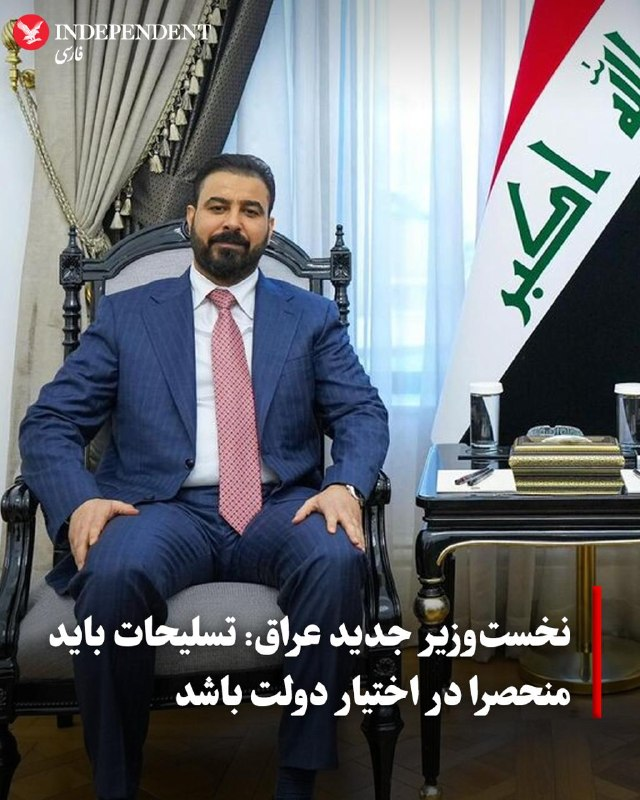

♦️به گزارش خبرگزاری دولتی عراق (INA)، علی الزیدی، نخست‌وزیر جدید عراق که دولت او روز پنجشنبه ۲۴ اردیبهشت موفق به کسب رای اعتماد شد، متعهد شد که انحصار سلاح در اختیار دولت را تضمین کند.

خبرگزاری INA به نقل از دفتر رسانه‌ای پارلمان گزارش داد که برنامه دولتی الزیدی شامل «اصلاح ساختار امنیتی از طریق محدود کردن مالکیت سلاح به کنترل دولت و تقویت توانمندی‌های نیروهای امنیتی» است.

ایالات متحده به عنوان یکی از بازیگران کلیدی در عرصه سیاسی عراق، اخیرا فشارهای خود را بر بغداد افزایش داده است تا گروه‌های مورد حمایت جمهوری اسلامی را که واشنگتن آن‌ها را به عنوان سازمان‌های تروریستی می‌شناسد، خلع سلاح کند.
‌🇸🇦 Indypersian

🤖 @VahidOOnLine

## VahidOOnLine — post 240177

  <a href="telegram/content/VahidOOnLine_240177_1778792623.mp4" target="_blank">🎬 Download video</a>

تماسی از ایران:
«می‌گفت برای زنده نگه داشتن پدرش حتی کپسول اکسیژن هم پیدا نمی‌شد…
و بیمارستان، با اون حال وخیم، مرخصش کرد چون تخت لازم داشت.
‌🏁 🇬🇧 ManotoTV

🤖 @VahidOOnLine

## VahidOOnLine — post 240176

  

♦️ به گزارش وال‌استریت ژورنال و بر اساس داده‌های گروه دریایی «ویندوارد» (Windward)، روز پنجشنبه ۲۴ اردیبهشت یک نفت‌کش کلاس «پاناماکس» در جزیره خارگ در حال بارگیری است. این اولین بارگیری تایید شده در این ترمینال حیاتی نفت ایران از تاریخ ۷ مه (۱۷ اردیبهشت) تاکنون محسوب می‌شود.

شرکت ویندوارد اعلام کرد که تصاویر ماهواره‌ای از حضور این شناور در کنار ترمینال شرقی جزیره را ثبت کرده است. این شرکت همچنین شناسایی حدود ۲۰ «نفت‌کش شبح» (نفت‌کش‌هایی که سیستم ردیابی خود را خاموش کرده‌اند) را گزارش داده که در مناطق مجاور به حالت آماده‌باش توقف کرده‌اند.

جزیره خارگ، واقع در شمال خلیج فارس، هسته اصلی صنعت نفت ایران است و بخش اعظم صادرات نفت خام از طریق آن ذخیره و بارگیری می‌شود. پیش از این، اسکات بسنت، وزیر خزانه‌داری آمریکا، اعلام کرده بود که ایران به دلیل دشواری در فروش و تخلیه نفت صادراتی، به مدت سه روز هیچ بارگیری در این جزیره نداشته است. نفت‌کش‌های کلاس پاناماکس ظرفیتی معادل ۴۰۰ هزار تا ۵۵۰ هزار بشکه نفت دارند.
‌🇸🇦 Indypersian

🤖 @VahidOOnLine

## VahidOOnLine — post 240175

  

به گزارش ان‌بی‌سی، مجلس نمایندگان آمریکا عصر پنجشنبه درباره یک قطعنامه اختیارات جنگی رای‌گیری خواهد کرد؛ قطعنامه‌ای که رییس‌جمهور آمریکا را ملزم می‌کند نیروهای مسلح ایالات متحده را از درگیری‌ها علیه جمهوری اسلامی خارج کند.

بر اساس این گزارش، این قطعنامه با حمایت جاش گاتهایمر، نماینده دموکرات ایالت نیوجرسی ارائه شده و همه دموکرات‌هایی که پیش‌تر با قطعنامه‌های اختیارات جنگی درباره ایران مخالفت کرده بودند، اکنون به‌عنوان هم‌حامی آن ثبت شده‌اند.

دموکرات‌ها برای موفقیت در تصویب این قطعنامه، به حمایت جمهوری‌خواهان بیشتری فراتر از تام مَسی، نماینده جمهوری‌خواه ایالت کنتاکی نیاز خواهند داشت. او تنها جمهوری‌خواهی بود که از آخرین قطعنامه اختیارات جنگی درباره ایران که در نهایت شکست خورد، حمایت کرده بود.
‌🏁 🇬🇧 IranintlTV

🤖 @VahidOOnLine

## VahidOOnLine — post 240174

  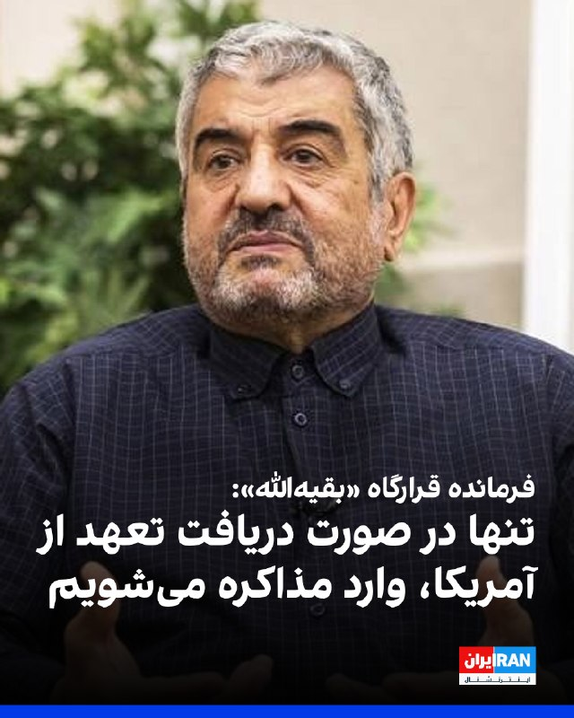

محمدعلی جعفری، فرمانده قرارگاه «بقیه‌الله» سپاه پاسداران، در ویدیویی که بخش‌هایی از آن را خبرگزاری تسنیم منتشر کرده، گفت: «جمهوری اسلامی بدون اقدامات اعتمادساز از سوی آمریکا وارد مذاکرات نمی‌شود و آغاز دوباره جنگ قطعا به ضرر آمریکاست».

جعفری افزود: «دونالد ترامپ از متن‌های ارسالی تیم مذاکره‌کننده جمهوری اسلامی خوشش نمی‌آید، اما راه بهتری جز پذیرش شروط تهران ندارد».

او گفت جمهوری اسلامی در «گام اول» با آمریکا مذاکره نمی‌کند و از طریق پاکستان در حال تبادل پیام بر اساس شروط خود است.

فرمانده قرارگاه «بقیه‌الله» سپاه پاسداران، گفت جمهوری اسلامی ابتدا اقدامات اعتمادساز خود را اعلام می‌کند و از «دشمن» تعهد می‌گیرد و تنها در صورت دریافت تعهد، وارد مذاکره می‌شود.
‌🏁 🇬🇧 IranintlTV

🤖 @VahidOOnLine

## VahidOOnLine — post 240173

  

روزنامه فایننشال‌تایمز به‌نقل از دیپلمات‌ها و منابع آگاه گزارش داد که عربستان سعودی درباره ایده یک پیمان عدم‌تجاوز میان کشورهای خاورمیانه و جمهوری اسلامی گفت‌وگو کرده است.

به‌نوشته این روزنامه، کشورهای خلیج فارس به‌ویژه از زمان آغاز جنگ آمریکا و اسرائیل علیه ایران نگران بوده‌اند که پس از پایان درگیری و کاهش حضور نظامی گسترده آمریکا در منطقه، با یک حکومت اسلامی زخمی اما تندروتر در همسایگی خود باقی بمانند.

فایننشال‌تایمز پنج‌شنبه ۲۴ اردیبهشت نوشت عربستان سعودی ایده یک پیمان عدم‌تجاوز میان کشورهای خاورمیانه و ایران را در چارچوب رایزنی‌ها با متحدان درباره نحوه مدیریت تنش‌های منطقه‌ای پس از پایان جنگ آمریکا و اسرائیل با جمهوری اسلامی مطرح کرده است.

دو دیپلمات غربی به این روزنامه گفتند ریاض در حال بررسی فرآیند هلسینکی دهه ۱۹۷۰ به‌عنوان یک الگوی احتمالی است؛ فرآیندی که در دوران جنگ سرد به کاهش تنش‌ها در اروپا کمک کرد.

ادامه این گزارش را در وبسایت ایران‌اینترنشنال بخوانید
‌🏁 🇬🇧 IranintlTV

🤖 @VahidOOnLine

## VahidOOnLine — post 240172

  <a href="telegram/content/VahidOOnLine_240172_1778792627.mp4" target="_blank">🎬 Download video</a>

♦️دونالد ترامپ، رئیس‌جمهوری آمریکا، در مصاحبه با شان هنیتی از شبکه فاکس نیوز اعلام کرد که شی جین‌پینگ، رئیس‌جمهوری چین، با قاطعیت تاکید کرده است که کشورش هیچ‌گونه تجهیزات نظامی در اختیار جمهوری اسلامی قرار نخواهد داد. ترامپ این اظهارنظر رهبر چین را یک «بیانیه بزرگ» توصیف کرد که با جدیت بیان شده است.

رئیس‌جمهوری آمریکا در ادامه افزود که پکن به‌دلیل خرید حجم بالای نفت، خواستار بازگشایی تنگه هرمز و تداوم روابط تجاری خود است. ترامپ همچنین به نارضایتی شی جین‌پینگ از سیستم دریافت عوارض توسط جمهوری اسلامی در این آبراه اشاره کرد و با لحنی انتقادی گفت کشور ایران که اکنون «نابود شده» است، مشخص نیست این پول‌ها را کجا هزینه می‌کند. او خاطرنشان کرد که اگرچه چین خواستار بازگشایی مسیر است، اما در واقع ابتدا ایران مسیر رفت و آمد در این تنگه را مسدود کرد و سپس آمریکا محاصره دریایی را در نظر گرفت.
‌🇸🇦 Indypersian

🤖 @VahidOOnLine

## VahidOOnLine — post 240171

  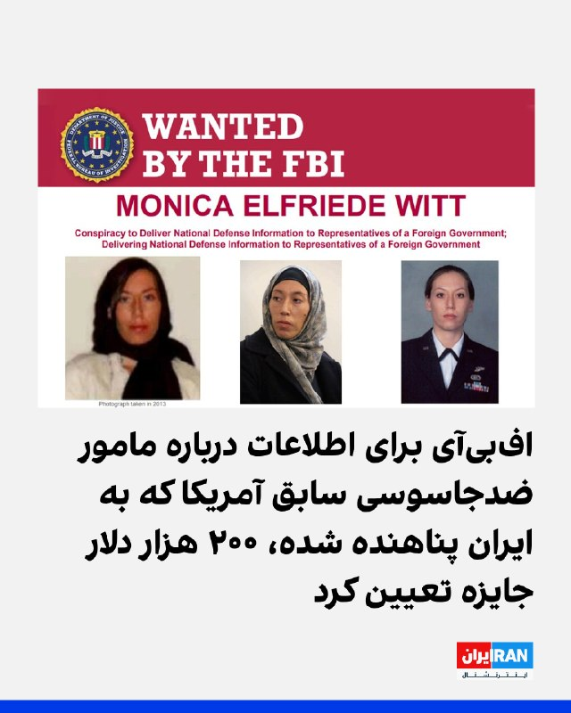

اف‌بی‌آی اعلام کرد برای ارائه اطلاعات درباره مونیکا ویت، مامور سابق ضدجاسوسی آمریکا که در سال ۲۰۱۳ به ایران پناهنده شده، ۲۰۰ هزار دلار جایزه تعیین کرده است.

به گفته اف‌بی‌آی، او اطلاعات مرتبط با دفاع ملی ایالات متحده را در اختیار جمهوری اسلامی قرار داده است.

ویت، افسر پیشین اطلاعاتی نیروی هوایی آمریکا و مامور ویژه دفتر تحقیقات ویژه نیروی هوایی، بین سال‌های ۱۹۹۷ تا ۲۰۰۸ در ارتش آمریکا خدمت کرد و سپس تا سال ۲۰۱۰ به‌عنوان پیمانکار دولت آمریکا فعالیت داشت.

سوابق نظامی و فعالیت قراردادی او موجب شده بود به اطلاعات محرمانه و فوق‌محرمانه در حوزه اطلاعات خارجی و ضدجاسوسی، از جمله هویت واقعی نیروهای مخفی آمریکا، دسترسی داشته باشد.
‌🏁 🇬🇧 IranintlTV

🤖 @VahidOOnLine

## VahidOOnLine — post 240169

  

♦️وال استریت ژورنال روز پنجشنبه ۲۴ اردیبهشت گزارش داد که دو نفت‌کش ژاپنی پس از گفتگوهای مستقیم سانائه تاکایچی، نخست‌وزیر ژاپن، با مقامات ارشد جمهوری اسلامی موفق به عبور ایمن از تنگه هرمز شدند. تاکایچی در پیامی اعلام کرد که دولت او هماهنگی‌های متعددی از جمله «ارتباط مستقیم با مسعود پزشکیان» انجام داده است تا امنیت تردد کشتی‌های ژاپنی را تضمین کند.

داده‌های ردیابی نشان می‌دهد نفت‌کش غول‌پیکر «انئوس اندوور» (Eneos Endeavor) متعلق به شرکت NYK Line، که از دوشنبه گذشته سیگنال‌های خود را قطع کرده بود، روز چهارشنبه از تنگه هرمز عبور کرده و راهی بندر «کی‌یره» در ژاپن شده است. این کشتی از اواخر فوریه با محموله نفت کویت در منطقه متوقف شده بود. همچنین نفت‌کش دیگر ژاپنی به نام «ایدمیتسو مارو» (Idemitsu Maru) اواخر آوریل از این آبراه عبور کرده و در مسیر بازگشت به بندر ناگویا است.

نخست‌وزیر ژاپن خاطرنشان کرد که این کشور برای تامین امنیت انرژی خود، سه‌چهارم نیاز ماه ژوئن را از منابع جایگزین مانند ایالات متحده تامین کرده و بخشی از ذخایر استراتژیک نفت خود را نیز آزاد خواهد کرد.
‌🇸🇦 Indypersian

🤖 @VahidOOnLine

## WithYashar — post 11247

طبق گزارش‌های امروز، هرتزوگ رئیس جمهور اسرائیل حضور حضوری خود در نیویورک را لغو کرده و گفته به دلیل «شرایطی که مانع سفر شده» نمی‌تواند به آمریکا بیاید.
اما این سفر یک سفر رسمی سیاسی به کاخ سفید نبود،بلکه مربوط به شرکت او در مراسم فارغ‌التحصیلی «Jewish Theological Seminary» در نیویورک بود.

در عین حال، خبر جداگانه‌ای هم درباره سفر احتمالی بنیامین ناتانیاهو به آمریکا وجود داشت که دفتر او گفته بود هنوز برنامه قطعی‌ای برایش نهایی نشده است
@withyashar

## WithYashar — post 11246

طبق گزارش فاکس نیوز : رئیس‌جمهور ترامپ و هیئت همراهش در طول سفر به چین از تلفن‌ها و لپ‌تاپ‌های جایگزین استفاده کردند به دلیل نگرانی‌هایی که داشتند مبنی بر اینکه مقامات چینی ممکن است از آن‌ها برای نصب نرم‌افزار جاسوسی استفاده کنند
@withyashar

## WithYashar — post 11245

همینجور این پیغام میاد دم همتون گرم مخصوصا عزیزی که یاد کرد از من🥹🙌🏾❤️‍🩹 میامممم میاممم

## WithYashar — post 11244

یکی اومد رو خط برنامه کامبیز تو اینترنشنال گفتش از همه مجریای اینترنشنال تشکر میکنم ، حتی یاشار وار روم توی تلگرام ک خیلیا اخبارا رو ازونجا دنبال میکنن دمتون گرم

## WithYashar — post 11242

دیده شده پهپاد شناسایی و صدای پدافند غرب تهران
@withyashar

## WithYashar — post 11241

اعتراضات کوبا شروع شد کشور در حال فروپاشی

طبق گزارش‌ها، شبکه برق کوبا در بامداد امروز دچار فروپاشی شد و مناطق شرقی از جمله شهر مهم سانتیاگو دِ کوبا بدون برق ماندند. مردم به خیابان آمدند، قابلمه‌ها را به هم کوبیدند، زباله آتش زدند و شعار «برق را وصل کنید» سر دادند.
دولت کوبا علت اصلی را تحریم‌ها و فشار آمریکا بر صادرات سوخت به کوبا می‌داند. رسانه‌هایی مانند رویترز و گاردین نوشته‌اند که پس از تهدیدهای جدید دولت ترامپ علیه کشورهایی که به کوبا سوخت می‌فرستند، ارسال نفت از ونزوئلا و مکزیک کاهش یافته و کوبا عملاً ذخیره سوختش را از دست داده است. وزیر انرژی کوبا گفته:
«ما مطلقاً هیچ گازوئیل و هیچ نفت کوره‌ای نداریم.»
در بعضی مناطق مردم تا ۲۰ یا حتی ۲۲ ساعت در روز برق ندارند. این وضعیت باعث خراب شدن مواد غذایی، اختلال در بیمارستان‌ها، حمل‌ونقل و حتی تعطیلی برخی خدمات عمومی شده است.
@withyashar

## WithYashar — post 11240

  <a href="telegram/content/WithYashar_11240_1778792630.mp4" target="_blank">🎬 Download video</a>

پیروزی بزرگ برای‌ ترامپ ، فاکس نیوز تایید کرد رئیس جمهور چین، شی جین پینگ دستور داد در مورد ایران، «هر چیزی که ترامپ نیاز دارد» را به آمریکا بدهید.

از ‌آمریکا سویای بیشتری بخرید.

نفت بیشتری از آمریکا بخرید.

از آمریکا گاز مایع طبیعی بیشتری بخرید.

۲۰۰ جت بوئینگ ۷۳۷ مکس بخرید.
@withyashar

## WithYashar — post 11239

خبر خوب 😍

## WithYashar — post 11238

  <a href="telegram/content/WithYashar_11238_1778792632.mp4" target="_blank">🎬 Download video</a>

نتانیاهو: دشمنان ما به دنبال نابودی همه ما هستند. همه ما
آنها بین راست و چپ، سکولار و مذهبی، یهودی و عرب تفاوتی قائل نمی‌شوند.
@withyashar
نتانیاهو: اورشلیم را تحت حاکمیت اسرائیل برای همیشه حفظ خواهیم کرد

## WithYashar — post 11237

## WithYashar — post 11236

سومین دور مذاکرات مستقیم لبنان و اسرائیل در واشنگتن آغاز شد
@withyashar

## WithYashar — post 11235

ترامپ اعلام کرد که انتظار می‌رود پکن ۲۰۰ هواپیما از بوئینگ سفارش دهد.
@withyashar

## WithYashar — post 11234

کان نیوز : مقامات ارشد ارتش اسرائیل و سنتکام هفته گذشته جلسه داشتن و منتظرن ببینن فردا ترامپ بعد اتمام سفرش چه تصمیمی میگیره
@withyashar

## WithYashar — post 11233

  <a href="telegram/content/WithYashar_11233_1778792633.mp4" target="_blank">🎬 Download video</a>

اتاق جنگ با یاشار ، شواهد نشان دهنده حمله غافلگیر کننده برای کتلت پزون است
@withyashar

## WithYashar — post 11232

  <a href="telegram/content/WithYashar_11232_1778792635.mp4" target="_blank">🎬 Download video</a>

در سال ۱۹۷۲، شهبانو فرح پهلوی به دعوت رسمی دولت چین به این کشور سفر کرد؛ سفری تاریخی و بی‌سابقه که در اوج جنگ سرد، نماد دیپلماسی بی‌طرفانه ایران بود
@withyashar

## mwarmonitor — post 9100

  <a href="telegram/content/mwarmonitor_9100_1778792637.mp4" target="_blank">🎬 Download video</a>

📝 گویا «بیت» در یک دگردیسی انتحاری، از مداح به دلقک تغییر کاربری داده و «خاله محمود» را به عنوان آخرین سلاح کشتار جمعیِ آبرو، راهیِ میدان کرده است. این استندآپ‌کمدیِ تهوع‌آور، مرثیه‌ای است بر نظامی که برای بقا، ماله را کنار گذاشته و با میکروفون به جانِ شعور ملت افتاده است.

🔸وقتی وقاحت به سقف می‌چسبد، اصلا دور از انتظار نیست که در پرده‌ی بعدی، این سوپرمنِ ماله‌کشی را با ریش سه تیغ و استایل لش ببینیم که در حالِ رپ کردنِ قطعه‌ی حماسیِ «آقام تو فریزه» است؛ اجرایی که لابد قرار است انجمادِ مغزی و تحجرِ سیستم را به عنوان «ثباتِ انقلابی» به خوردِ مخاطب بدهد. خاله محمود با این لودگی‌های سفارشی، ثابت کرد که در سیرکِ قدرت، هرچه دلقک‌تر باشی و با ریتمِ «شش‌وهشت» روی ویرانه‌ها برقصی، به سفره‌ی چربِ نظام نزدیک‌تری. این نه هنر است و نه کمدی؛ این رقصِ بی‌شرمانه‌ی لاشخورهایی است که می‌خواهند با شوخی‌هایِ تاریخ‌مصرف‌گذشته، بوی تعفنِ سیاست را پنهان کنند.

@mwarmonitor

## mwarmonitor — post 9099

  

📝 اف‌بی‌آی برای سرِ این ضعیفه، ۲۰۰ هزار دلار مژدگانی گذاشته؛ زنی که سال ۲۰۱۳ از ناف آمریکا فرار کرد تا خودش را به آغوشِ گرمِ آخوندها بیندازد. این خائنِ وطن‌فروش که اطلاعات امنیت ملی آمریکا را مثل تحفه‌ای بی‌مقدار زیر پای دولت ایران ریخت، قطعاً حالا با نامی مستعار مثل «پارمیدا» در حوالی اندرزگو در حال دور دور می‌باشد. شک نکنید با پولی که از فروختنِ رفقای سابقش به جیب زده، آن چهره‌ی سنگیِ توی عکس را زیر تیغ جراحان زیبایی کوبیده و ساخته تا ردّ خیانتش را پشت دماغِ عمل‌کرده و ژلِ لب پنهان کند. پیدا کردنِ کسی که برای یک «صور به آخوند زدن» کل زندگی‌اش را به لجن کشیده، در تهرانِ امروز که پر از چهره‌های فیک و هویت‌های فروشی است، پاداش کلانی می‌طلبد.

@mwarmonitor

## mwarmonitor — post 9098

🔴 فیننشال تایمز: عربستان سعودی در جریان گفت‌وگوها با متحدانش درباره مدیریت تنش‌های منطقه‌ای پس از پایان جنگ در ایران، ایده‌ی یک پیمان «عدم تجاوز» میان کشورهای خاورمیانه و ایران را مطرح کرده است.

@mwarmonitor

## mwarmonitor — post 9097

  

✈️📡 هواپیمای RC-135V Rivet Joint (شماره 64-14848) در حال انجام مأموریت بر فراز خلیج فارس است و در حال جمع‌آوری اطلاعات اطلاعاتی درباره ایران می‌باشد. 📝این هواپیما به‌تنهایی می‌تواند هشدار ورود به مرحله پیش از درگیری باشد؛ وقتی پروازهای روزانه و مستمر آواکس…

## mwarmonitor — post 9096

  

🇺🇸رئیس‌جمهور دونالد ترامپ در روز اول کاری خود، ممنوعیت دولت بایدن برای صدور مجوز صادرات LNG (گاز طبیعی مایع) را لغو کرد.

🇺🇸امروز، ایالات متحده بزرگ‌ترین تولیدکننده و صادرکننده گاز طبیعی در جهان است و پیش‌بینی می‌شود صادرات LNG این کشور تا پایان دهه تقریباً دو برابر شود.

@mwarmonitor

## mwarmonitor — post 9095

🇦🇪بیانیه: امارات حمله تروریستی به کشتی با پرچم هند در سواحل عمان را به شدت محکوم می‌کند

🇦🇪دولت امارات متحده عربی حمله تروریستی که کشتی حامل پرچم هند را در نزدیکی سواحل سلطنت عمان هدف قرار داد، با شدیدترین تعابیر محکوم کرد.

🇦🇪وزارت امور خارجه در بیانیه‌ای تأکید کرد که این حمله تهدیدی بزرگ برای ایمنی دریانوردی جهانی و تنش‌زایی خطرناکی است که ثبات آبراه‌های حیاتی را هدف قرار می‌دهد.

🇦🇪امارات همبستگی خود را با جمهوری دوست، هند، و حمایت کامل خود را از تمامی اقداماتی که منجر به حفاظت از امنیت و سلامت کشتی‌ها و منافع این کشور می‌شود، ابراز داشت.

🇦🇪این وزارتخانه همچنین تأکید کرد که این حمله نقض آشکار قطعنامه شماره ۲۸۱۷ شورای امنیت است که بر آزادی دریانوردی و رد هدف قرار دادن کشتی‌های تجاری یا مختل کردن مسیرهای دریایی بین‌المللی تأکید دارد. وزارت خارجه خاطرنشان کرد که هدف قرار دادن دریانوردی تجاری و استفاده از تنگه هرمز به عنوان ابزاری برای فشار یا باج‌خواهی اقتصادی، اقدامی راهزنانه محسوب شده و تهدیدی مستقیم برای ثبات منطقه، ملت‌های آن و امنیت انرژی جهانی است.

@mwarmonitor

## FoxNewsTwitter — post 341754

  <a href="telegram/content/FoxNewsTwitter_341754_1778792640.mp4" target="_blank">🎬 Download video</a>

Fox News (Twitter/X)

NEW: President Trump tells @seanhannity that Chinese President Xi Jinping offered to assist the U.S. in negotiating with Iran to reopen the Strait of Hormuz.

Trump notes that China’s significant oil interests play a major role in its desire to keep the critical waterway open and stable.

“President Xi would like to see a deal made. He would like to see a deal made. And he did offer, he said, ‘If I can be of any help at all, I would like to be of help.’”

"He said 'If I could be of any help whatsoever, I would like to help.'"

The full interview airs tonight at 9 p.m. ET on 'Hannity.'

## FoxNewsTwitter — post 341753

  <a href="telegram/content/FoxNewsTwitter_341753_1778792641.mp4" target="_blank">🎬 Download video</a>

Fox News (Twitter/X)

Bulldozers flatten hundreds of illegal mopeds in NYC.

The NYPD took a dramatic step in its sweeping crackdown on vehicles increasingly linked to violent crime.

Police Commissioner Jessica Tisch says many of the bikes are uninsured, carry fake or altered plates, and have become a growing public safety threat because criminals use their speed and anonymity to flee police.

The stark warning comes after investigators linked illegal mopeds and scooters to multiple robberies and even the shooting death of a 7-month-old girl last month.

Officials say the more than 200 crushed bikes represent only a small portion of the more than 5,700 illegal mopeds and scooters the NYPD seizes so far this year, nearly 10% more than at the same time last year.

## FoxNewsTwitter — post 341752

  <a href="telegram/content/FoxNewsTwitter_341752_1778792642.mp4" target="_blank">🎬 Download video</a>

Fox News (Twitter/X)

A wild police chase in Georgia ends when police perform a PIT maneuver, sending the fleeing U-Haul truck flying onto its side.

Sheriff's deputies were forced to chase the U-Haul in and out of traffic.

Authorities identified the driver as Damian Jones, who was reportedly wanted in other counties and accused of driving recklessly, hitting a truck, and nearly striking several vehicles during the pursuit.

Investigators say drugs were found inside the vehicle, and Jones was taken into custody following the crash.

No major injuries were reported.

## FoxNewsTwitter — post 341751

Fox News (Twitter/X)

NEW: Vice President JD Vance squares off with a local reporter over the scale of corruption in Maine, warning that current fraud findings are just the "tip of the iceberg."

REPORTER: "My question is, what else do you got? What else has your task force flagged that we should be concerned about? Because those amounts are a lot, 46 million, 1.7 million, but they don't really compare to California and Minnesota."

VANCE: "Ladies and gentlemen, we've got biased reporters in all states. It's okay. Trust me, I can handle I can handle it... I suspect we are going to find hundreds of millions of more dollars every single month that we look in the state of Maine, because this is not a state that takes it seriously."

## FoxNewsTwitter — post 341750

  <a href="telegram/content/FoxNewsTwitter_341750_1778792644.mp4" target="_blank">🎬 Download video</a>

Fox News (Twitter/X)

WATCH: Vice President JD Vance jokes with the crowd after thanking citizen journalists for exposing fraud across the country like Nick Shirley and the 'Quality Learing Center':

"When we really got wind of what was going on in Minneapolis, it was because somebody showed up at the 'Quality Learing Center.' We've got a guy over there- did you get a good education at the 'Quality Learing Center,' sir?"

"He said he's a graduate with honors of the 'Quality Learing Center.' I congratulate you, but I don't think it's that hard if we're being honest."

## FoxNewsTwitter — post 341749

  <a href="telegram/content/FoxNewsTwitter_341749_1778792646.mp4" target="_blank">🎬 Download video</a>

Fox News (Twitter/X)

JUST IN: Vice President JD Vance exposes a "shocking" lack of accountability at the Department of Justice, claiming million-dollar fraud cases were ignored by the Biden administration.

"Let's say a person defrauded all of you for a million bucks. To many of our Department of Justice leaders under the Biden administration, they said that was too low level to actually go after. So, I mean, how many of you would like the federal government to hand you $1 million?"

## FoxNewsTwitter — post 341748

  <a href="telegram/content/FoxNewsTwitter_341748_1778792647.mp4" target="_blank">🎬 Download video</a>

Fox News (Twitter/X)

NEW: Vice President JD Vance defends America’s social safety net while warning that unchecked fraud is destroying the "spirit of generosity" that sustains it.

"We don't want low income kids to not be able to afford a bite to eat. We want to make sure that if you're a poor child or a poor family, you get an opportunity to see a doctor, even if money is particularly tight."

"But you know what destroys those programs and not just destroys those programs, but destroys the spirit of generosity that makes those programs possible? It's when local officials and state officials and federal officials, it's when they let the fraudsters take advantage of you instead of fighting for you."

## FoxNewsTwitter — post 341747

  <a href="telegram/content/FoxNewsTwitter_341747_1778792649.mp4" target="_blank">🎬 Download video</a>

Fox News (Twitter/X)

HAPPENING NOW: Vice President JD Vance blasts Maine’s "festering" fraud crisis, blaming Governor Janet Mills and former President Joe Biden for the state's decline.

"Why did Maine go from a state that did not have a serious fraud problem, to one where I can honestly say it's one of the worst states in the union?"

"Number one is Janet Mills, and number two is Joe Biden. And thankfully, thankfully, one of them has already been kicked to the curb and one is on her way out the door exactly as it should be."

## FoxNewsTwitter — post 341746

  <a href="telegram/content/FoxNewsTwitter_341746_1778792650.mp4" target="_blank">🎬 Download video</a>

Fox News (Twitter/X)

BREAKING: Vice President JD Vance exposes massive fraud rings involving hospice care and services for autistic children, alleging billions are being stolen from vulnerable Americans.

"We have seen people go out there and say that they're providing services to autistic children, when in reality they maybe don't have any children at all, or they certainly don't have autistic children."

"What happened to the autistic children and their families who actually need those services and need a competent government to ensure that they're doing the right thing?"

## FoxNewsTwitter — post 341745

  <a href="telegram/content/FoxNewsTwitter_341745_1778792652.mp4" target="_blank">🎬 Download video</a>

Fox News (Twitter/X)

NEW: Vice President JD Vance gets a chuckle from the crowd after a person yells about dead people voting while the VP was talking about fraud in the United States:

"Unfortunately, they vote for Democrats. They don't vote for us my friends.”

## FoxNewsTwitter — post 341744

  <a href="telegram/content/FoxNewsTwitter_341744_1778792653.mp4" target="_blank">🎬 Download video</a>

Fox News (Twitter/X)

NOW: Vice President JD Vance reveals his reaction when President Trump asked him to oversee taking on America's fraud problem:

"When the president of the United States said, 'JD, we have got a fraud problem and I want you to tackle it.' I was so proud and so happy to be able to do it, because I realized that fraud isn't just about saving money. It's not just about protecting taxpayers. It's about protecting you."

## FoxNewsTwitter — post 341743

Fox News (Twitter/X)

"So when you make campaign statements, those aren't true? You're not being honest with your voters? ...What you said to the voters is not real. Doesn't count."

Rep. Jim Jordan hammers Fairfax County Commonwealth's Attorney Stephen Descano over the removal of campaign promises from his website about taking “immigration consequences” into account while handling cases.

Jordan blasts the prosecutor after an illegal immigrant with a lengthy criminal history was released by police and allegedly killed a man in his home a day later.

## FoxNewsTwitter — post 341742

  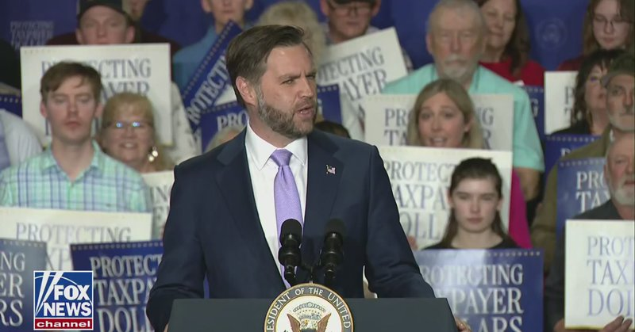

Fox News (Twitter/X)

WATCH LIVE: VP Vance delivers remarks on Trump admin's fraud crackdown https://twitter.com/i/broadcasts/1kKzDMmkkYXJv

## FoxNewsTwitter — post 341741

  <a href="telegram/content/FoxNewsTwitter_341741_1778792655.mp4" target="_blank">🎬 Download video</a>

Fox News (Twitter/X)

“Tend to your faith not just when you’re broken, but when you’re whole.”

Eric Church returned to his alma mater, UNC Chapel Hill, and gave graduates a message bigger than music:

The country star told graduates that faith is the “low E” of life: the foundation every chord rests on, especially when the world gets overwhelming.

## FoxNewsTwitter — post 341740

  <a href="telegram/content/FoxNewsTwitter_341740_1778792657.mp4" target="_blank">🎬 Download video</a>

Fox News (Twitter/X)

FIRST ON FOX: Buster Murdaugh was spotted Thursday on the porch of his South Carolina home, one day after the South Carolina Supreme Court ruled that misconduct by a court official tainted his father, Alex Murdaugh’s, 2023 trial.

The ruling overturned Alex Murdaugh’s murder conviction, which had sent him to prison for life.

Despite the legal win Wednesday, Murdaugh will not be walking free - he remains behind bars serving lengthy sentences for a string of financial crimes that cemented his fall from power.

Murdaugh was sentenced to 27 years in state prison after pleading guilty to 22 financial crimes. He also got 40 years in federal prison for fraud-related charges, which he is serving at the same time. | @FoxTrueCrime @FoxUSNews

## pm_afshaa — post 90758

🔴آغاز اعتراضات مردمی در کوبا

💧 Rainbet.com the #1 Non-KYC Crypto Casino & Sportsbook @rainbetcom

😁 @Pm_Afshaa

## pm_afshaa — post 90757

🔴کانال 12 اسراییل: اسرائیل سطح هشدار را به اوج می‌رساند تا برای احتمال از سرگیری جنگ با ایران پس از بازگشت ترامپ از چین آماده شود

💧 Rainbet.com the #1 Non-KYC Crypto Casino & Sportsbook @rainbetcom

😁 @Pm_Afshaa

## pm_afshaa — post 90756

ایسنا : با قیمت قطعی خودرو باید خداحافظی کنید،چون تو جدیدترین طرح فروش ایران‌خودرو و سایپا،خریداران باید نیمی از مبلغ خودرو رو امروز بپردازن بدون اینکه بدونن در زمان تحویل چه قیمتی در انتظارشونه

💧 Rainbet.com the #1 Non-KYC Crypto Casino & Sportsbook @rainbetcom

😁 @Pm_Afshaa

## pm_afshaa — post 90754

🔴کارشناس کانال 14 اسرائیل: رژیم ایران به شدت به پول نیاز داره و در حال انجام تماس‌های مخفی و مستقیم با دولت ترامپه

💧 Rainbet.com the #1 Non-KYC Crypto Casino & Sportsbook @rainbetcom

😁 @Pm_Afshaa

## pm_afshaa — post 90753

  <a href="telegram/content/pm_afshaa_90753_1778792658.webm" target="_blank">🎬 Download video</a>

🔴اوباما درباره برنامه هسته‌ای ایران:
ما بدون شلیک یک گلوله آن را متوقف کردیم. 97 درصد اورانیوم آنها رو خارج کردیم. هیچ بحثی وجود نداره که آن توافق رو کار کرد و لازم نبود ما عده زیادی آدم بکشیم یا تنگه هرمز رو ببندیم.

💧 Rainbet.com the #1 Non-KYC Crypto Casino & Sportsbook @rainbetcom

😁 @Pm_Afshaa

## pm_afshaa — post 90752

  <a href="telegram/content/pm_afshaa_90752_1778792658.webm" target="_blank">🎬 Download video</a>

🔴پیت هگست:

علیرغم آنچه ممکن است در رسانه ها بشنوید، آمریکا در حال افول نیست. ما همچنان قوی‌ترین قدرت نظامی روی زمین هستیم، اما این قدرت مستلزم تجدید است.

با تهدیدهای جهانی که دائماً در حال تغییر هستند، زمان آن فرا رسیده است که یک سرمایه گذاری 1.5 تریلیون دلاری انجام دهید، یک پیش پرداخت نسلی.

این سرمایه‌گذاری تضمین می‌کند که ایالات متحده قدرت و قدرت بازدارندگی بی‌نظیری در برابر هر دشمنی را برای نسل‌های آینده حفظ کند.

💧 Rainbet.com the #1 Non-KYC Crypto Casino & Sportsbook @rainbetcom

😁 @Pm_Afshaa

## pm_afshaa — post 90751

  <a href="telegram/content/pm_afshaa_90751_1778792659.webm" target="_blank">🎬 Download video</a>

🔴کانال 12 به نقل از یک منبع:
اسرائیل وضعیت آماده باش خود را به منظور آمادگی برای احتمال تجدید جنگ ایران پس از بازگشت ترامپ از چین به اوج رسوند.

ارتش اسرائیل در تدارک تهاجمی و تدافعی برای احتمال از سرگیری فوری جنگ ایرانه.

💧 Rainbet.com the #1 Non-KYC Crypto Casino & Sportsbook @rainbetcom

😁 @Pm_Afshaa

## pm_afshaa — post 90750

  <a href="telegram/content/pm_afshaa_90750_1778792659.webm" target="_blank">🎬 Download video</a>

🔴ترامپ: رئیس‌جمهور شی مایله که شاهد یک توافق باشه. او گفت: اگه بتونم کمکی داشته باشم، دوست دارم کمک کنم.

هر کسی که این مقدار نفت میخره، مشخصاً نوعی رابطه داره و او دوست داره تنگه هرمز رو باز ببینه.

💧 Rainbet.com the #1 Non-KYC Crypto Casino & Sportsbook @rainbetcom

😁 @Pm_Afshaa

## pm_afshaa — post 90749

🎙️آیا رئیس جمهور شی از ترامپ درخواست کرده بود که به تایوان سلاح نفروشه؟

مارکو روبیو: خوب، این موضوع در گذشته مورد بحث قرار گرفته. اساساً در بحث امروز مطرح نشد. ما میدونیم که موضع آنها در این مورد چیست.

💧 Rainbet.com the #1 Non-KYC Crypto Casino & Sportsbook @rainbetcom

😁 @Pm_Afshaa

## pm_afshaa — post 90748

  <a href="telegram/content/pm_afshaa_90748_1778792660.webm" target="_blank">🎬 Download video</a>

🔴ترامپ: چین موافقت کرد 200 هواپیمای بوئینگ خریداری کنه.

💧 Rainbet.com the #1 Non-KYC Crypto Casino & Sportsbook @rainbetcom

😁 @Pm_Afshaa

## pm_afshaa — post 90747

  <a href="telegram/content/pm_afshaa_90747_1778792660.webm" target="_blank">🎬 Download video</a>

🔴حمید رسایی، نماینده تهران:
دولت قصد داره سهمیه بنزین هزار و ۵۰۰ تومنی و ۳ هزار تومنی رو کاهش بده و قیمت بنزین پنج هزار تومانی رو به ۱۵ تا ۲۰ هزار تومان افزایش بده.

💧 Rainbet.com the #1 Non-KYC Crypto Casino & Sportsbook @rainbetcom

😁 @Pm_Afshaa

## iaghapour — post 2611

  

💠 Mega Center 💠

🪩📈 ابزار مورد نیاز شما در دنیای کریپتو و تریدینگ / احراز هویت پلتفرم های خارجی

از افتتاح حساب های ارزی بین المللی
تا پکیج مدارک لازم جهت احراز هویت صرافی ها و سایت های خارجی
صدور مستر کارت و ویزا کارت و خدمات ارزی
سیم کارت های فیزیکی خارجی
خدمات وریفای تضمینی صرافی ها
ولت های فیزیکی معتبر و ...

👨‍💻لینک دسترسی ها و ارتباط :
www.megacenterx.com      
www.megacenterx.com
www.megacenterx.com

https://t.me/megacenter0
https://t.me/megacenter0

@Megav_admin22
@Megav_admin22

در صورت بالا نیامدن سایت ، بدون وی پی ان امتحان نمایید ✅

## iaghapour — post 2609

کل ریپازیتوری گیت هاب علیرضا که شامل X-UI و S-UI میشد بسته شده و هنوز دلیلش مشخص نیست.

## DEJradio — post 4636

  <a href="telegram/content/DEJradio_4636_1778792661.mp4" target="_blank">🎬 Download video</a>

🔺📢 "قیمت دارو سرسام‌آور شده، حکومت فقط دنبال جنگ‌افروزی است

یک شهروند از سمنان با ارسال یک ویدیو در پیامی نوشت: "ساکن سمنان هستم و براتون گزارشی می‌فرستم از افزایش قیمت دارو. این چند تا دارو رو دیروز از داروخانه به قیمت ۳ میلیون تومن خریدم درحالیکه پارسال قیمتش نصف این بود. درآمد ماهیانه من با این قیمت‌های سرسام آور تناسبی نداره و این به این معناست که برای خرید دارو باید از بقیه مایحتاج خودم و سه فرزندم صرف نظر کنم. این حکومت بی‌کفایت نه تنها که به فکر تامین نیازهای ما نیست بلکه با این جنگ افروزی‌هاش فقط اقتصاد کشور و درآمد مردم رو بیش از پیش نابود میکنه!"

#دارو #تورم
@DEJradio

## DEJradio — post 4635

  <a href="telegram/content/DEJradio_4635_1778792663.mp4" target="_blank">🎬 Download video</a>

🔺📢 "ما گرسنه‌ایم ولی از جنگ سیر

یک شهروند از تهران با ارسال ویدیویی از حرکت اعتراضی، نوشت گرانی زندگی مردم را مختل کرده است و بسیاری به نان شب محتاج‌اند اما حکومت انگار نه انگار که مردم چطور زندگی می‌کنند.

#تورم #جنگ
@DEJradio

## kianmeli1 — post 87410

  

🔴روزنامه اعتماد مدعی شد: اینترنت بین الملل خرداد ماه وصل می‌ شود
https://t.me/kianmeli1

## kianmeli1 — post 87409

  

🔴رئیس کمیسیون امنیت ملی مجلس، از پیشنهاد تعیین جایزه ۵۰ میلیون یورویی برای کشتن دونالد ترامپ، بنیامین نتانیاهو و فرمانده سنتکام خبر داده است.
https://t.me/kianmeli1

## kianmeli1 — post 87408

  <a href="telegram/content/kianmeli1_87408_1778792665.mp4" target="_blank">🎬 Download video</a>

🔴 کاتس وزیر دفاع اسرائیل  :
ماموریت ما کامل نشده است.

ما برای احتمال اینکه ممکن است مجبور به اقدام دوباره شویم - شاید حتی به زودی - آماده‌ایم.

اگر اهداف تأمین نشوند، دوباره اقدام خواهیم کرد.
   https://t.me/kianmeli1

## kianmeli1 — post 87407

  

🔴 ترامپ می‌گوید شی جین‌پینگ، رئیس‌جمهور چین، به او گفته است که چین تجهیزات نظامی به ایران ارائه نخواهد داد و از توافق صلح حمایت کرده است.

ترامپ همچنین می‌گوید که رئیس‌جمهور شی پیشنهاد میانجیگری برای کاهش تنش‌ها به منظور بازگشایی تنگه هرمز را داده است.
https://t.me/kianmeli1

## kianmeli1 — post 87406

  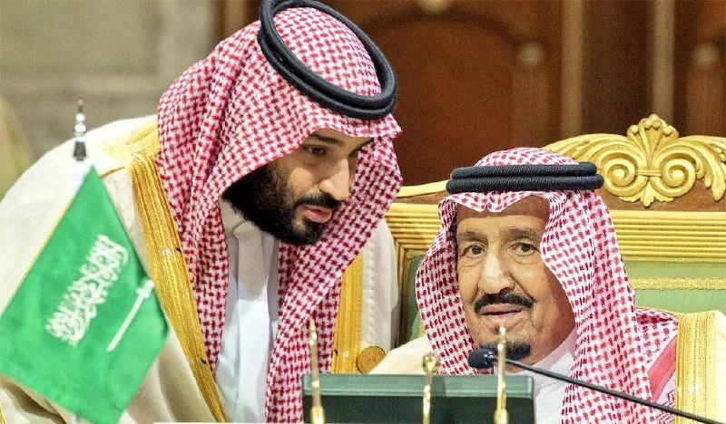

🔴عربستان سعودی می‌خواهد با ایران پیمان عدم تجاوز امضا کند.

این در حالی است که ایران در طول جنگ به خاک عربستان سعودی حمله کرده است.
https://t.me/kianmeli1

## kianmeli1 — post 87405

  

🔴به گزارش رویترز، عربستان سعودی به رئیس جمهور ترامپ گفته است که جنگ با ایران باید پایان یابد و تنگه هرمز باید باز بماند و در صورت ادامه بحران، نسبت به «زیان‌های اقتصادی غیرقابل اندازه‌گیری» هشدار داده است.
https://t.me/kianmeli1

## kianmeli1 — post 87404

  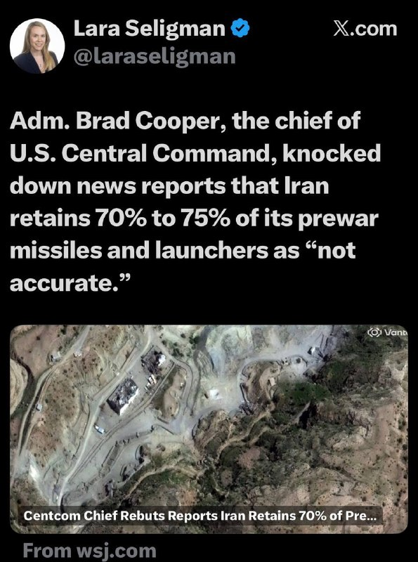

🔴دریاسالار برد کوپر، رئیس فرماندهی مرکزی ایالات متحده، گزارش‌های خبری مبنی بر اینکه ایران ۷۰ تا ۷۵ درصد از موشک‌ها و پرتابگرهای قبل از جنگ خود را حفظ کرده است، «غیردقیق» خواند و آنها را رد کرد.
https://t.me/kianmeli1

## kianmeli1 — post 87403

  

🔴ایران از همه کشورهای عضو بریکس می‌خواهد که جنگ آمریکا و اسرائیل علیه خود را محکوم کنند.
https://t.me/kianmeli1

## kianmeli1 — post 87402

  

🔴به گزارش خبرگزاری AXIOS، مقامات اسرائیلی می‌گویند که در طول این آخر هفته، اسرائیل در بالاترین سطح آمادگی قرار خواهد گرفت، زیرا این کشور منتظر تصمیم رئیس جمهور ترامپ در مورد از سرگیری جنگ علیه ایران است.
https://t.me/kianmeli1

## IranIntlTV — post 337219

  

وزارت خارجه قطر به العربیه اعلام کرد چند پهپاد ایرانی را در نزدیکی حریم هوایی خود سرنگون کرده است. این وزارتخانه افزود در تماس‌های خود با جمهوری اسلامی بر ضرورت بازگشایی تنگه هرمز تأکید کرده و ابراز امیدواری کرده است توافقی برای تضمین امنیت منطقه‌ای حاصل شود.

وزارت خارجه قطر همچنین گفت کشورهای خلیج فارس خواهان بازگشایی تنگه هرمز و توقف حملات جمهوری اسلامی هستند و از تلاش‌های دیپلماتیک حمایت کرده و بر پرهیز از جنگ تأکید دارند.
https://iranintl.com/202605149165

## IranIntlTV — post 337218

  

ابراهیم عزیزی، رییس کمیسیون امنیت ملی مجلس، از تدوین طرحی با عنوان «اقدام متقابل نیروهای نظامی و امنیتی جمهوری اسلامی» خبر داد که در آن پرداخت پاداش ۵۰ میلیون یورویی برای کشتن دونالد ترامپ، رییس‌جمهوری آمریکا، پیش‌بینی شده است.
 
عزیزی گفت همان‌طور که ترامپ دستور داد علی خامنه‌ای را بکشند، او باید «به دست هر مسلمان و آزاده‌ای مورد برخورد قرار بگیرد.»

او افزود در این طرح پیش‌بینی شده اگر افراد حقیقی یا حقوقی «این رسالت دینی و اعتقادی» را انجام دهند، دولت موظف است ۵۰ میلیون یورو پاداش بپردازد.

رییس کمیسیون امنیت ملی مجلس گفت جمهوری اسلامی معتقد است دونالد ترامپ، بنیامین نتانیاهو، نخست‌وزیر اسرائیل و برد کوپر، فرمانده سنتکام، باید به دلیل اقدامی که به کشته شدن علی خامنه‌ای منجر شد، «مورد برخورد و اقدام متقابل» قرار بگیرند؛ زیرا این را حق خود می‌داند.
https://iranintl.com/202605147997

## IranIntlTV — post 337217

  

نشست کمیته نیروهای مسلح سنا با حضور ارشدترین مقام‌ نظامی آمریکا در خاورمیانه با تمرکز بر چالش خلع سلاح حزب‌الله، گروه مسلح لبنانی مورد حمایت جمهوری اسلامی، به پایان رسید.

راجر ویکر، سناتور جمهوری‌خواه ایالت میسیسیپی و رییس این کمیته، در این نشست از دریاسالار برد کوپر، که فرماندهی سنتکام را بر عهده دارد، ‌پرسید آیا تهاجم اسرائیل به خاک لبنان ضروری بوده است یا نه.

کوپر پاسخ داد: «این یکی از گزینه‌ها در میان گزینه‌هاست، از میان گزینه‌های اندکی که برای حل مشکل حزب‌الله وجود دارد.»

ویکر در ادامه گفت: «اگر حزب‌الله بتواند از بین برده شود، برای اسرائیل، لبنان و ایالات متحده یک دستاورد عظیم خواهد بود.»

در هفته‌های اخیر حزب‌الله به‌طور مداوم موشک‌هایی به سمت اسرائیل شلیک کرده و اسرائیل نیز یک تهاجم زمینی به جنوب لبنان انجام داده که بر حزب‌الله متمرکز بوده اما به گزارش رسانه‌ها، باعث آواره شدن ساکنان این منطقه شده است.
https://iranintl.com/202605140569

## IranIntlTV — post 337216

  <a href="telegram/content/IranIntlTV_337216_1778792671.mp4" target="_blank">🎬 Download video</a>

با شروع دور جدید مذاکرات مستقیم اسرائیل و لبنان در واشینگتن، مقام‌های لبنانی خواستار آتش‌بس فوری و توقف حملات اسرائیل به جنوب لبنان شدند. اسرائیل می‌گوید هدف مذاکرات، خلع سلاح حزب‌الله و رسیدن به توافق صلح است؛ در حالی‌ که تنش‌ها همچنان ادامه دارد.
@iranintltv

## IranIntlTV — post 337215

  <a href="https://t.me/IranintlTV/337215" target="_blank">📎 Download file</a>

🎧نسخه صوتی ۲۴ با فرداد فرحزاد: همکاری چین و آمریکا برای بازگشایی تنگه هرمز
@iranintlTV

## IranIntlTV — post 337214

  

ابراهیم عزیزی، رییس کمیسیون امنیت ملی مجلس، گفت: «به دشمنان هشدار می‌دهیم اگر دچار خطای محاسباتی شده و به امنیت ما خدشه‌ای وارد کنند، امنیت آن‌ها را در هر کجای جهان که باشد، سلب خواهیم کرد. آماده‌ایم در تنگه هرمز و سایر میادین، بار دیگر دشمن را شکست بدهیم.»

او افزود: «امروز دشمن در تنگه هرمز در حال غرق‌شدن و تجربه شکست دیگری است و پیام ما به دشمن این است که هر اقدام محاسبه‌نشده، پاسخی دردناک به همراه خواهد داشت.»
https://iranintl.com/202605142365

## IranIntlTV — post 337213

  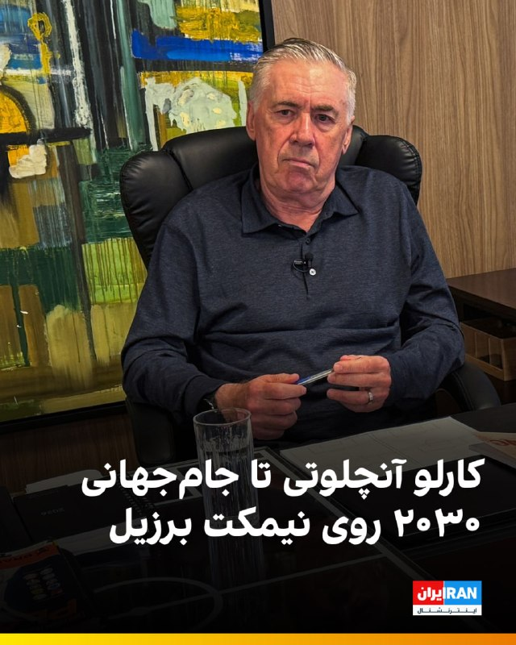

🔻فدراسیون فوتبال برزیل قرارداد کارلو آنچلوتی، سرمربی تیم ملی این کشور، را تا پایان جام جهانی ۲۰۳۰ تمدید کرد.

🔹آنچلوتی ۶۶ ساله که اردیبهشت ۱۴۰۴ پس از جدایی از رئال مادرید هدایت برزیل را بر عهده گرفت، تمدید قراردادش را در ویدیویی که فدراسیون فوتبال برزیل منتشر کرد، تایید کرد.

🔹او گفت: «یک سال پیش به برزیل آمدم و از همان لحظه اول فهمیدم فوتبال برای این کشور چه معنایی دارد. ما می‌خواهیم تیم ملی برزیل را دوباره به بالاترین سطح فوتبال جهان برگردانیم.»

🔹قرار است آنچلوتی دوشنبه فهرست نهایی تیم ملی برزیل برای جام جهانی را اعلام کند.

🔹سمیر شعود، رییس فدراسیون فوتبال برزیل، تمدید قرارداد آنچلوتی را «روزی تاریخی» برای فوتبال این کشور توصیف کرد و گفت این تصمیم بخشی از برنامه برزیل برای ساخت تیمی «مدرن و رقابتی» است.

🔹برزیل با هدایت آنچلوتی در ۱۰ مسابقه به پنج پیروزی، سه شکست و دو تساوی رسیده است. این تیم در جام جهانی ۲۰۲۶ با اسکاتلند، مراکش و هائیتی هم‌گروه خواهد بود.

@iranintltvsport

## IranIntlTV — post 337212

  <a href="https://t.me/IranintlTV/337212" target="_blank">📎 Download file</a>

🎧نسخه صوتی دومینو: شمارش معکوس برای آغاز جنگی دیگر
@iranintlTV

## IranIntlTV — post 337211

  

به گزارش ان‌بی‌سی، مجلس نمایندگان آمریکا عصر پنجشنبه درباره یک قطعنامه اختیارات جنگی رای‌گیری خواهد کرد؛ قطعنامه‌ای که رییس‌جمهور آمریکا را ملزم می‌کند نیروهای مسلح ایالات متحده را از درگیری‌ها علیه جمهوری اسلامی خارج کند.

بر اساس این گزارش، این قطعنامه با حمایت جاش گاتهایمر، نماینده دموکرات ایالت نیوجرسی ارائه شده و همه دموکرات‌هایی که پیش‌تر با قطعنامه‌های اختیارات جنگی درباره ایران مخالفت کرده بودند، اکنون به‌عنوان هم‌حامی آن ثبت شده‌اند.

دموکرات‌ها برای موفقیت در تصویب این قطعنامه، به حمایت جمهوری‌خواهان بیشتری فراتر از تام مَسی، نماینده جمهوری‌خواه ایالت کنتاکی نیاز خواهند داشت. او تنها جمهوری‌خواهی بود که از آخرین قطعنامه اختیارات جنگی درباره ایران که در نهایت شکست خورد، حمایت کرده بود.
https://iranintl.com/202605147731

## IranIntlTV — post 337210

  <a href="telegram/content/IranIntlTV_337210_1778792675.mp4" target="_blank">🎬 Download video</a>

۲۴ با فرداد فرحزاد
@iranintltv

## IranIntlTV — post 337209

  

محمدعلی جعفری، فرمانده قرارگاه «بقیه‌الله» سپاه پاسداران، در ویدیویی که بخش‌هایی از آن را خبرگزاری تسنیم منتشر کرده، گفت: «جمهوری اسلامی بدون اقدامات اعتمادساز از سوی آمریکا وارد مذاکرات نمی‌شود و آغاز دوباره جنگ قطعا به ضرر آمریکاست».

جعفری افزود: «دونالد ترامپ از متن‌های ارسالی تیم مذاکره‌کننده جمهوری اسلامی خوشش نمی‌آید، اما راه بهتری جز پذیرش شروط تهران ندارد».

او گفت جمهوری اسلامی در «گام اول» با آمریکا مذاکره نمی‌کند و از طریق پاکستان در حال تبادل پیام بر اساس شروط خود است.

فرمانده قرارگاه «بقیه‌الله» سپاه پاسداران، گفت جمهوری اسلامی ابتدا اقدامات اعتمادساز خود را اعلام می‌کند و از «دشمن» تعهد می‌گیرد و تنها در صورت دریافت تعهد، وارد مذاکره می‌شود.
https://iranintl.com/202605145338

## IranIntlTV — post 337208

  <a href="https://t.me/IranintlTV/337208" target="_blank">📎 Download file</a>

🎧نسخه صوتی اخبار شبانگاهی | پنجشنبه ۲۴ اردیبهشت
@iranintlTV

## IranIntlTV — post 337207

  

روزنامه فایننشال‌تایمز به‌نقل از دیپلمات‌ها و منابع آگاه گزارش داد که عربستان سعودی درباره ایده یک پیمان عدم‌تجاوز میان کشورهای خاورمیانه و جمهوری اسلامی گفت‌وگو کرده است.

به‌نوشته این روزنامه، کشورهای خلیج فارس به‌ویژه از زمان آغاز جنگ آمریکا و اسرائیل علیه ایران نگران بوده‌اند که پس از پایان درگیری و کاهش حضور نظامی گسترده آمریکا در منطقه، با یک حکومت اسلامی زخمی اما تندروتر در همسایگی خود باقی بمانند.

فایننشال‌تایمز پنج‌شنبه ۲۴ اردیبهشت نوشت عربستان سعودی ایده یک پیمان عدم‌تجاوز میان کشورهای خاورمیانه و ایران را در چارچوب رایزنی‌ها با متحدان درباره نحوه مدیریت تنش‌های منطقه‌ای پس از پایان جنگ آمریکا و اسرائیل با جمهوری اسلامی مطرح کرده است.

دو دیپلمات غربی به این روزنامه گفتند ریاض در حال بررسی فرآیند هلسینکی دهه ۱۹۷۰ به‌عنوان یک الگوی احتمالی است؛ فرآیندی که در دوران جنگ سرد به کاهش تنش‌ها در اروپا کمک کرد.

ادامه این گزارش را در وبسایت ایران‌اینترنشنال بخوانید
https://iranintl.com/202605143675

## IranIntlTV — post 337206

  

اف‌بی‌آی اعلام کرد برای ارائه اطلاعات درباره مونیکا ویت، مامور سابق ضدجاسوسی آمریکا که در سال ۲۰۱۳ به ایران پناهنده شده، ۲۰۰ هزار دلار جایزه تعیین کرده است.

به گفته اف‌بی‌آی، او اطلاعات مرتبط با دفاع ملی ایالات متحده را در اختیار جمهوری اسلامی قرار داده است.

ویت، افسر پیشین اطلاعاتی نیروی هوایی آمریکا و مامور ویژه دفتر تحقیقات ویژه نیروی هوایی، بین سال‌های ۱۹۹۷ تا ۲۰۰۸ در ارتش آمریکا خدمت کرد و سپس تا سال ۲۰۱۰ به‌عنوان پیمانکار دولت آمریکا فعالیت داشت.

سوابق نظامی و فعالیت قراردادی او موجب شده بود به اطلاعات محرمانه و فوق‌محرمانه در حوزه اطلاعات خارجی و ضدجاسوسی، از جمله هویت واقعی نیروهای مخفی آمریکا، دسترسی داشته باشد.
https://iranintl.com/202605148135

## IranIntlTV — post 337204

  <a href="telegram/content/IranIntlTV_337204_1778792678.mp4" target="_blank">🎬 Download video</a>

برد کوپر، فرمانده سنتکام، برای پاسخ به سوالات نمایندگان در جلسه کمیته نیروهای مسلح سنای آمریکا حاضر شد.

او گفت توانایی جمهوری اسلامی برای تهدید همسایگان و منافع آمریکا در منطقه به‌طور چشمگیری کاهش یافته است.

گزارش مرضیه حسینی، خبرنگار ایران‌اینترنشنال
@iranintltv

## IranIntlTV — post 337203

  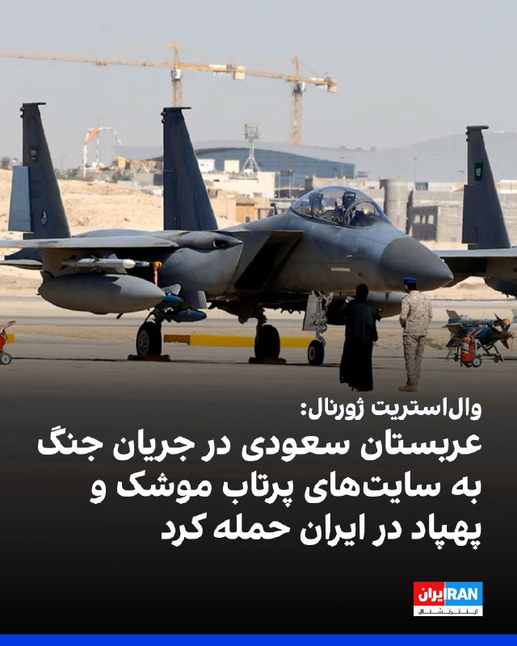

وال‌استریت ژورنال به نقل از چند مقام آمریکایی و چند مقام کشورهای خلیج فارس گزارش داد عربستان سعودی پس از آن‌که تهران تاسیسات انرژی و زیرساخت‌های غیرنظامی این کشور را هدف قرار داد، به‌طور محرمانه حملاتی علیه جمهوری اسلامی انجام داده است.
به گفته یکی از این مقام‌ها، نیروی هوایی عربستان سعودی چندین حمله علیه اهدافی از جمله سایت‌های پرتاب پهپاد و موشک جمهوری اسلامی انجام داده است.
همچنین برخی منابع گفتند جنگنده‌های عربستان سعودی اهدافی در عراق مرتبط با شبه‌نظامیان مورد حمایت جمهوری اسلامی را نیز هدف قرار داده‌اند.
https://iranintl.com/202605147123

## IranIntlTV — post 337202

  

🔻پس از گذشت بیش از ۷۰ روز از آغاز جنگ آمریکا و اسرائیل با جمهوری اسلامی و تعطیلی ۷۵ روزه فوتبال باشگاهی در ایران، بازی‌های هفته بیست‌وچهارم لیگ دسته اول با برگزاری هشت دیدار از سر گرفته شد و تیم مس شهربابک توانست با نتیجه ۱ بر صفر مس کرمان را شکست دهد و صدرنشین باقی بماند.

🔹آخرین دیدار باشگاهی فوتبال ایران جمعه ۸ اسفند و یک روز پیش از آغاز جنگ برگزار شد و چهار دیدار از هفته بیست و سوم لیگ برتر انجام شد.

🔹در دیگر بازی‌های هفته بیست‌وچهارم، دیدارهای پارس جنوبی و هوادار، صنعت نفت آبادان و آریو اسلامشهر، شهرداری نوشهر و فرد البرز و همچنین سایپا و مس سونگون با تساوی بدون گل به پایان رسید.

🔹نود ارومیه نیز با نتیجه ۱ بر صفر شناورسازی قشم را شکست داد و دیدار نیروی زمینی و داماش گیلان به دلیل حاضر نشدن تیم گیلانی، ۳ بر صفر به سود نیروی زمینی اعلام شد.

🔹نساجی مازندران، دیگر تیم مدعی صعود به لیگ برتر، جمعه ۲۵ اردیبهشت به مصاف بعثت کرمانشاه می‌رود.

🔹پیش از این، محمدمهدی فروردین، رییس کمیسیون ورزش مجلس بخاطر شرایط امنیتی و اقتصادی خواستار لغو تمام لیگ‌های فوتبال ایران شده بود.

@iranintltvsport

## IranIntlTV — post 337200

روایت شما از زندگی در آتش‌بس- پنجشنبه ۲۵ اردیبهشت ۱۴۰۵

🔹از گرگان: چند ماهه اعلام کردن حقوق ارتش و بازنشسته‌ها رو تا ۵۰ درصد بیشتر می‌کنن. زیاد نکردن که هیچ، چند روز هم دیرتر واریز کردن. امیدتون به نابودی اینا باشه. جاوید شاه.
🔹در کاشان به بچه‌های حدود ۱۰ ساله آموزش کار با کلاش می‌دن. واقعا این تو همه جای دنیا قفله.
🔹پرچم‌چرخانی و اشغال خیابون‌ها توسط جیره‌خوارهای جمهوری اسلامی مساوی با مصرف سوخت و پول ملت بیچاره‌ست.
🔹معاون اول پزشکیان گفته از بازگشت نخبه‌ها استقبال می‌کنیم. آخه مردک! می‌خواید برگردن که به جرم جاسوسی اعدام‌شون کنید؟
🔹از الوند قزوین: تو هیچ داروخانه‌ای قرص‌های اعصاب مثل سرترالین و غیره پیدا نمی‌شه. خیلی از این قرص‌ها عوارض ترک دارن. چه کسی جوابگوست؟
🔹از چهارمحال: گرونی بیداد کرده. یک کیلو بذر لوبیا سبز شده دو میلیون تومان.
🔹شعار فیفا جدایی فوتبال از سیاسته و به همین دلیل داره برای ویزای تیم رژیم تلاش می‌کنه. یکی بهش بگه به خاطر خوشحالی شکست تیم جمهوری اسلامی در جام ۲۰۲۲، جوان‌های زیادی کشته و مجروح شدن.
🔹ایدئولوژی و فلسفه جمهوری اسلامی ضدبشری و ضدانسانیته. انسان‌های داخل ایران برده‌شونن و خارج از ایران دشمن‌شون.
🔹اسنپ گرفتم، زانتیا بود. ایست بازرسی نگهش داشتن. وقتی راننده گفت اسنپم، با کمال تعجب گفتن کی آخه با زانتیا میره اسنپ! راننده هم گفت چیکار کنم، بی‌پولیه. ببینید چیکار کردن با مردم.
🔹۷۰ روزه نت‌ها قطعه. کسانی که آنلاین‌شاپ داشتن از کار بیکار شدن. خیلی‌ها مثل معلم زبان خودم می‌گفت قبل جنگ ۱۸ شاگرد داشتم و بعد جنگ ۳ شاگرد. قیمت دلار ۱۸۰٬۰۰۰ تومانه.
🔹اسکله شهید رجایی بندرعباس که معروف بود به دروازه طلایی، ترمینال‌های مادر سینا و بتا که جرثقیل‌های گانتری‌کرین مستقر هستن، واردات و صادرات اصلی کشور کلا تعطیل شده. اگر ادامه‌دار باشه به‌زودی قحطی کل کشور رو فرا می‌گیره.
🔹خوزستان شرکت‌های بهره‌برداری فلرهای نفتی رو با بیشترین حد فعال کردن و مشغول سوزاندن و هدر دادن سوخت هستن. چرا؟ چون توان و تجهیزات برای تسویه و استفاده بهینه از سوخت استخراج‌شده رو ندارن. دقت کنید شهرهای خوزستان در صدر پرخطر بودن آلودگی هوا هستن.
🔹اگه می‌گن قطعی اینترنت به‌خاطر مسائل امنیتیه، پس فروش انبوه اینترنت پرو چیه؟ اینترنت پرو امنیت رو به خطر نمی‌ندازه؟ و کسانی که رفتن پرو گرفتن، خائن هستن.
🔹محدودیت‌های زیادی روی برنامه شاد هست. برای ارسال تکالیف هم باید تایم زیادی بذاریم. احساس ناامنی افکار دانش‌آموزها رو به هم ریخته. آموزش‌وپرورش واقعا بی‌برنامه‌ست.
🔹من یک تولیدکننده محتوا تو اینستاگرام و یوتیوب بودم. بعد از قطعی اینترنت زندگیم نابود شده. همه‌چیز خیلی گرونه. کاری هم که خودمون با جون‌کندن راه انداختیم ازمون گرفتن.

## IranIntlTV — post 337199

  

نخست‌وزیر جدید عراق، علی الزیدی، پنجشنبه تنها با بخشی از اعضای کابینه خود سوگند یاد کرد، زیرا قانون‌گذاران نتوانستند بر سر پست‌های کلیدی از جمله وزارت کشور و وزارت دفاع به توافق برسند.

خبرگزاری رویترز گزارش داد که باسم محمد به‌عنوان وزیر جدید نفت کشور منصوب شد و فؤاد حسین نیز در دولت جدید در سمت وزیر خارجه ابقا شد.

پارلمان عراق در مجموع به ۱۴ وزیر پیشنهادی رای اعتماد داد.
https://iranintl.com/202605145356

## IranIntlTV — post 337198

  

منوچهر متکی، نماینده مجلس و وزیر خارجه پیشین جمهوری اسلامی، خطاب به بحرین گفت: «الان در آتش‌بس هستیم؛ دعا کنید جنگی در نگیرد، اما اگر جنگ شد و دوباره پایگاه‌های آمریکا را برای حمله به ما در اختیار بگذارید، آنچنان می‌زنیم که نامتان را فراموش کنید و خاک بحرین را توی توبره می‌کنیم.»

متکی گفت بحرین و برخی کشورهای منطقه با در اختیار گذاشتن امکانات و پایگاه‌ها به آمریکا، حملات علیه جمهوری اسلامی را تسهیل کردند و پس از حملات آمریکا و اسرائیل، به جای همدردی با ما به‌خاطر کشته شدن علی خامنه‌ای، با تحریک ایالات متحده در شورای امنیت علیه تهران قطعنامه تصویب کردند.

او همچنین گفت بحرین تلاش کرده بود در اجلاس بین‌المجالس در استانبول نیز مصوبه‌ای علیه جمهوری اسلامی به تصویب برساند، اما تهران با «تدبیر دیپلماتیک» و همراهی برخی کشورها مانع رای‌گیری درباره آن شد.

متکی این اظهارات را در روایت تازه خود از تنش لفظی با هیات بحرین در اجلاس بین‌المجالس استانبول بیان کرد و گفت آن زمان، پس از آن‌که نماینده بحرین جمهوری اسلامی را به «حمله ظالمانه» به بحرین و کشورهای عربی متهم کرد، این پاسخ را به او داده بود.
https://iranintl.com/20

## ManotoTV — post 105464

  <a href="telegram/content/ManotoTV_105464_1778792681.mp4" target="_blank">🎬 Download video</a>

تماسی از ایران:
«می‌گفت بیمه عملاً داروها، مخصوصاً انسولین رو پوشش نمی‌ده…
و هزینه‌ها چند برابر شده.
می‌گفت دارو هست، اما برای خیلی‌ها دیگه قابل تهیه نیست.»

## ManotoTV — post 105463

  <a href="telegram/content/ManotoTV_105463_1778792683.mp4" target="_blank">🎬 Download video</a>

تماسی از ایران:
«می‌گفت برای زنده نگه داشتن پدرش حتی کپسول اکسیژن هم پیدا نمی‌شد…
و بیمارستان، با اون حال وخیم، مرخصش کرد چون تخت لازم داشت.

## ManotoTV — post 105462

  <a href="telegram/content/ManotoTV_105462_1778792684.mp4" target="_blank">🎬 Download video</a>

روزنامه فایننشال‌تایمز گزارش داده عربستان سعودی در حال بررسی طرحی برای ایجاد یک توافق امنیتی «عدم تجاوز» میان جمهوری‌اسلامی و کشورهای خاورمیانه است؛ توافقی که قرار است پس از پایان قطعی جنگ آمریکا و اسرائیل با ایران مطرح شود.
بر اساس این گزارش، این پیمان الگویی مشابه توافق هلسینکی در سال ۱۹۷۵ خواهد داشت؛ توافقی که میان آمریکا، کشورهای اروپایی و اتحاد جماهیر شوروی سابق امضا شده بود.
یک دیپلمات عرب به فایننشال‌تایمز گفته موفقیت چنین توافقی به کشورهایی بستگی دارد که در آن حضور خواهند داشت.
او گفته است: «اگر اسرائیل در این توافق حضور نداشته باشد، ممکن است نتیجه معکوس بدهد، چون بعد از ایران، اسرائیل از نگاه بسیاری عامل اصلی تنش در منطقه محسوب می‌شود. اما ایران از منطقه حذف نمی‌شود و به همین دلیل عربستان چنین طرحی را دنبال می‌کند.»
این گزارش همچنین به نقل از دو دیپلمات دیگر نوشته امارات متحده عربی ممکن است تمایلی به پیوستن به چنین توافقی نداشته باشد؛ کشوری که پس از امضای توافق ابراهیم در سال ۲۰۲۰، روابط نزدیکی با اسرائیل برقرار کرده است.

## ManotoTV — post 105461

  <a href="telegram/content/ManotoTV_105461_1778792685.mp4" target="_blank">🎬 Download video</a>

تدابیر امنیتی ویژه در سفر ترامپ به چین؛ استفاده از گوشی‌های موقتی برای جلوگیری از جاسوسی سایبری
رسانه‌های آمریکایی گزارش داده‌اند اعضای هیئت همراه دونالد ترامپ در سفر به پکن، برای جلوگیری از خطرات جاسوسی سایبری، از تلفن‌های موقتی و لپ‌تاپ‌های ویژه با دسترسی محدود استفاده می‌کنند.
بر اساس این گزارش‌ها، مقام‌های آمریکایی، دستیاران ترامپ و برخی مدیران شرکت‌های بزرگ فناوری از جمله ایلان ماسک و تیم کوک، دستگاه‌های شخصی خود را به چین نبرده‌اند و به‌جای آن از تجهیزات موسوم به «Burner Phone» و «Clean Device» استفاده می‌کنند.
گفته می‌شود نگرانی اصلی، احتمال شنود یا هک اطلاعات از طریق شبکه‌های اینترنتی، وای‌فای هتل‌ها، شارژرها و زیرساخت‌های ارتباطی در چین است.
این اقدام بخشی از پروتکل‌های امنیتی آمریکا برای سفرهای رسمی به چین به شمار می‌رود، اما رسانه‌ها می‌گویند این بار تدابیر امنیتی با حساسیت بیشتری اجرا شده است. مقام‌های آمریکایی در چنین سفرهایی فرض را بر این می‌گذارند که «هیچ چیز در چین امن نیست.»

## ManotoTV — post 105460

  <a href="telegram/content/ManotoTV_105460_1778792685.mp4" target="_blank">🎬 Download video</a>

عبدالحلیم خان، امام جماعت ۵۴ ساله ساکن شرق لندن، به‌دلیل تجاوز و آزار جنسی چندین زن و دختر، از جمله کودکان زیر ۱۳ سال، به حبس ابد محکوم شد.

پلیس متروپولیتن اعلام کرد او بین سال‌های ۲۰۰۴ تا ۲۰۱۵ از موقعیت مذهبی خود سوءاستفاده کرده و زنان و دخترانی حتی ۱۲ ساله را هدف قرار داده است.

خان در ماه فوریه در دادگاه «اسنرز‌بروک» به ۹ فقره تجاوز، چهار مورد آزار جنسی، دو مورد آزار جنسی کودک زیر ۱۳ سال، پنج مورد تجاوز به کودک زیر ۱۳ سال و یک مورد تعرض جنسی محکوم شد.

قاضی پرونده گفت او «پشت ظاهر تقدس و دینداری، به شکلی هیولاوار از زنانی که به او اعتماد داشتند سوءاستفاده کرده است.»

بر اساس اعلام دادستانی بریتانیا، خان به قربانیان می‌گفت توسط «جن» یا نیروهای ماورایی تسخیر شده و از این ادعا برای سوءاستفاده جنسی استفاده می‌کرد.

دادستان‌ها همچنین گفتند قربانیان از ترس «جادوی سیاه» و تهدیدهای او، سال‌ها موضوع را پنهان نگه داشته بودند.

یکی از قربانیان در بیانیه‌ای خطاب به دادگاه گفت: «برای من، خان انسان نیست؛ تجسم شر است.»

پلیس لندن اعلام کرد پرونده زمانی آغاز شد که کوچک‌ترین قربانی در سال ۲۰۱۸ موضوع را به معلم مدرسه‌اش گزارش داد.

## ManotoTV — post 105459

  <a href="telegram/content/ManotoTV_105459_1778792686.mp4" target="_blank">🎬 Download video</a>

فرمانده سنتکام اعلام کرد توان جمهوری‌اسلامی برای تهدید همسایگان و منافع آمریکا در منطقه به‌طور چشمگیری تضعیف شده است.
دریادار برد کوپر، فرمانده سنتکام، در جلسه‌ای در سنای آمریکا گفت: «تهدید ایران به‌طور قابل‌توجهی کاهش یافته و دیگر مانند گذشته قادر به تهدید شرکای منطقه‌ای یا آمریکا در همه حوزه‌ها نیست.»
او افزود نیروهای نیابتی جمهوری‌اسلامی در ۳۰ ماه پیش از جنگ اخیر بیش از ۳۵۰ حمله علیه نیروها و دیپلمات‌های آمریکایی انجام داده بودند؛ حملاتی که به گفته او به کشته شدن چهار سرباز آمریکایی منجر شد.
کوپر همچنین مدعی شد گروه‌هایی مانند حماس، حزب‌الله و حوثی‌ها اکنون از حمایت تسلیحاتی و لجستیکی جمهوری‌اسلامی جدا شده‌اند.
این فرمانده آمریکایی گفت ارتش آمریکا دیگر برای مقابله با پهپادهای جمهوری‌اسلامی از مهمات گران‌قیمت و پیشرفته استفاده نمی‌کند و به‌جای آن سراغ گزینه‌های ارزان‌تر رفته است.
به گفته او، جمهوری‌اسلامی تنها حدود ۱۰ درصد از پهپادهای خود را در اختیار دارد. با وجود آتش‌بس شکننده یک‌ماهه، درگیری‌های پراکنده میان نیروهای ایرانی و آمریکایی همچنان ادامه دارد.

## ManotoTV — post 105457

  <a href="telegram/content/ManotoTV_105457_1778792687.mp4" target="_blank">🎬 Download video</a>

دونالد ترامپ در گفت‌وگو با شان هنیتی گفت شی جین‌پینگ، رئیس‌جمهوری چین، متعهد شده به جمهوری اسلامی تجهیزات نظامی ارائه نکند.

ترامپ گفت: «او گفت قرار نیست تجهیزات نظامی بدهد؛ این حرف بزرگی است.»

رئیس‌جمهوری آمریکا در ادامه افزود چین همچنان بخش زیادی از نفت خود را از ایران خریداری می‌کند و مایل است این روند ادامه پیدا کند.

ترامپ همچنین گفت شی جین‌پینگ خواهان باز ماندن تنگه هرمز و جلوگیری از اختلال در عبور و مرور کشتی‌هاست.

## FarsiVOA — post 217774

🔺پاداش ۲۰۰هزار دلاری اف‌بی‌آی برای اطلاعات منجر به دستگیری مامور سابق آمریکایی؛ مونیکا ویت به جاسوسی برای رژیم ایران متهم است

◾️پلیس فدرال آمریکا، اف‌بی‌آی اعلام کرد که برای دریافت اطلاعاتی که منجر به دستگیری و محاکمه مونیکا ویت شود، ۲۰۰ هزار دلار پاداش گذاشته است.

⬇️ بیشتر بخوانید:
https://ir.voanews.com/a/8150083.html
@FarsiVOA

## FarsiVOA — post 217773

🔺حمله «حزب‌الله» به اسرائيل هم‌‌زمان با آغاز سومین دور مذاکرات صلح با لبنان در واشنگتن

◾️ارتش اسرائيل روز پنج‌شنبه گفت که حزب‌الله به نقض آتش‌بس ادامه می‌دهد. ارتش اسرائيل در بیانیه‌ای در این روز منتشر کرد گفت که هشدارهایی در چندین منطقه در شمال اسرائيل فعال شد.

⬇️ بیشتر بخوانید:
https://ir.voanews.com/a/8150080.html
@FarsiVOA

## FarsiVOA — post 217772

  

⚡️ستاد فرماندهی مرکزی آمریکا، سنتکام، عصر پنج‌شنبه با انتشار تصویری از تمرین‌های نظامی نیروهای آمریکایی گفت این نیروها در راستای اجرای محاصره دریایی جمهوری اسلامی تاکنون مسیر ۷۲ کشتی تجاری را تغییر داد‌ه‌اند‌ و ۴ کشتی را نیز از کار انداختند.
@FarsiVOA

## FarsiVOA — post 217771

🔺اعتصاب غذای یک بریتانیایی در زندان اوین؛ رژیم ایران کرگ فورمن را «ملاقات ممنوع» کرده است

◾️کرگ فورمن، شهروند بریتانیایی زندانی در اوین، در اعتراض به محرومیت از ملاقات و محدودیت‌های اعمال‌شده علیه خود و همسرش، اعتصاب غذا کرده است.

⬇️ بیشتر بخوانید:
https://ir.voanews.com/a/iran-prison-british-tourists-visit-evin/8150052.html
@FarsiVOA

## FarsiVOA — post 217770

⚡️از سفره‌های خالی تا حواشی بی‌پایان تیم فوتبال جمهوری اسلامی؛ واکنش کاربران در شبکه‌های اجتماعی
@FarsiVOA

## FarsiVOA — post 217769

⚡️نهادهای حقوق بشری گزارش دادند عرفان عربی، دانشجوی ۲۰ ساله، به ۸ سال حبس محکوم شده. مهدی شفاخواه،⁩ مربی داوطلب کودکان کار هم بازداشت شده است

@FarsiVOA

## FarsiVOA — post 217768

⚡️حمله گسترده روسیه به اوکراین و زنگ خطر ناتو در رزمایش سوئد
@FarsiVOA

## FarsiVOA — post 217767

⚡️همزمان با اعدام بازداشت‌شدگان، توقیف اموال شهروندان با اتهام‌های امنیتی، و ادامه خاموشی اینترنت، فتوای تازه برای پرداخت وجوهات به مجتبی خامنه‌ایِ ناپدید از انظار، موج تازه‌ای از واکنش‌ها را به‌دنبال داشته است. منتقدان می‌گویند جمهوری اسلامی همچنان سرگرم حفظ ساختار قدرت و منابع مالی خود است.
@FarsiVOA

## FarsiVOA — post 217766

🔺تحولات نشست پکن و داده‌های اقتصادی تازه زیر ذره‌بین سرمایه‌‌گذاران

◾️قراردادهای آتیِ شاخص اس اند پی ۵۰۰ و نزدک، روز پنجشنبه، با رشد قابل توجه انویدیا به رکورد جدیدی دست یافتند. همچنین، سرمایه‌ گذاران نگاه خود را به تحولات نشست حساس آمریکا و چین و انتشار داده‌های اقتصادی دوختند.

⬇️ بیشتر بخوانید:
https://ir.voanews.com/a/stock-index-developments-in-the-us-china-summit/8150046.html
@FarsiVOA

## FarsiVOA — post 217765

  <a href="telegram/content/FarsiVOA_217765_1778792688.mp4" target="_blank">🎬 Download video</a>

⚡️نازیلا گلستان در برنامه تفسیر خبر: بازماندگان جمهوری اسلامی باید به سمت و سوی مردم برگردند
@FarsiVOA

## FarsiVOA — post 217764

🔺هشدار دوباره وزارت خارجه آمریکا درباره سفر به کشورهای «پرخطر»؛ ایران هم در فهرست است

◾️وزارت امور خارجه ایالات متحده آمریکا روز پنجشنبه ۲۴ اردیبهشت هشدارهای پیشین خود درباره سفر به کشورهای روسیه، کره‌شمالی، افغانستان، و جمهوری اسلامی ایران را تکرار کرد و این کشورها را برای شهروندان آمریکایی، «پرخطر» دانست.

⬇️ بیشتر بخوانید:
https://ir.voanews.com/a/high-risk-countries-us-department-of-state-travel-warning/8150070.html
@FarsiVOA

## FarsiVOA — post 217763

پرزیدنت ترامپ: شی جین‌پینگ متعهد شده که به جمهوری اسلامی تجهیزات نظامی نفرستد

## FarsiVOA — post 217762

  <a href="telegram/content/FarsiVOA_217762_1778792688.mp4" target="_blank">🎬 Download video</a>

داریوش سجادی در برنامه تفسیر خبر می‌گوید که فرصتی برای وساطت چین بین جمهوری اسلامی و آمریکا وجود ندارد

## FarsiVOA — post 217761

گزارش فریبا مودت درباره جزئیات روز نخست دیدار پرزیدنت ترامپ با رئیس جمهوری چین

## FarsiVOA — post 217760

شکریا برادوست در برنامه تفسیر خبر: تمرکز بر ملی‌گرایی در چین افزایش یافته است

## FarsiVOA — post 217759

🔺پرزیدنت ترامپ: رئیس جمهوری چین گفته که به رژیم ایران تجهیزات نظامی نخواهد داد

◾️پرزیدنت ترامپ می‌گوید که شی جین‌پینگ، رئیس‌ جمهوری چین، متعهد شده است پس از مذاکرات سطح بالای دو رهبر، ارسال تجهیزات نظامی برای رژیم ایران را متوقف کند.

⬇️ بیشتر بخوانید:

https://ir.voanews.com/a/iran-us-trump-china-chi-weapon-hannity-/8150025.html?withmediaplayer=1

## FarsiVOA — post 217758

🔺علی فالح الزیدی نخست‌وزیر جدید عراق شد

▪️پارلمان عراق روز پنجشنبه ۲۴ اردیبهشت، به دولت جدید این کشور به ریاست علی فالح الزیدی و ۱۴ وزیر کابینه او رای اعتماد داد.

⬇️ بیشتر بخوانید:

https://ir.voanews.com/a/iraq-new-prime-minister-ali-alfateh-alzeidi-iran/8150045.html/?nocach=1

## FarsiVOA — post 217757

🔺تعیین پاداش ۱۵ میلیون دلاری برای اطلاعات درباره شبکه‌‌های مالی سپاه پاسداران

◾️وزارت امور خارجه ایالات متحده آمریکا روز پنجشنبه ۲۴ اردیبهشت، با انتشار بیانیه‌ای اعلام کرد که در چارچوب برنامه «پاداش برای عدالت» این وزارتخانه «۱۵ میلیون دلار پاداش برای اطلاعات درباره شبکه‌‌های مالی سپاه پاسداران در نظر گرفته شده است.»

⬇️ بیشتر بخوانید:

https://ir.voanews.com/a/million-bounty-iran-irgc-award/8150041.html?withmediaplayer=1

## FarsiVOA — post 217756

🔺فرمانده سنتکام: عملیات «خشم حماسی» ۹۰ درصد توانایی نظامی رژیم ایران را از بین برد

▪️کمیته نیروهای مسلح سنا روز پنجشنبه ۲۴ اردیبهشت یک جلسه استماع را با حضور دریابد برد کوپر، رئیس فرماندهی مرکزی آمریکا (سنتکام)، و ژنرال داگوین اندرسون، رئیس فرماندهی آفریقای ایالات متحده آمریکا (آفریکام) برگزار کرد. یکی از محورهای اصلی این جلسه موضوع اقدام نظامی ایالات متحده علیه جمهوری اسلامی و موضوعات مرتبط با آن بود. صدای آمریکا مشروح این جلسه را با ترجمه همزمان پخش کرد.

⬇️ بیشتر بخوانید:

https://ir.voanews.com/a/adm-brad-cooper-senate-hearing-iran-epic-fury/8149979.html?withmediaplayer=1%2F%3Fnocach%3D1

## FarsiVOA — post 217755

کمیته نیروهای مسلح سنا روز پنجشنبه ۲۴ اردیبهشت یک جلسه استماع را با حضور دریابد برد کوپر، فرمانده سنتکام، و ژنرال داگوین اندرسون، فرمانده آفریکام، برگزار کرد. یکی از محورهای اصلی این جلسه اقدام نظامی آمریکا علیه رژیم ایران بود. صدای آمریکا این جلسه را با ترجمه همزمان پژواک کیومرثی پخش کرد.

## DW_Farsi — post 124712

  

🔶 روبیو: ترامپ درباره ایران با شی گفتگو کرد، اما کمکی نخواست
 
مارکو روبیو، وزیر امور خارجه آمریکا، اعلام کرد که ، دونالد ترامپ رئیس‌جمهور آمریکا در دیدار با شی جین‌پینگ همتای چینی خود موضوع ایران را مطرح کرده است، اما "هیچ درخواستی" از او نداشته است.
 
روبیو در مصاحبه با شبکه "ان‌بی‌سی نیوز" گفت: «ما از چین درخواست کمک نمی‌کنیم. به کمک آن‌ها نیازی نداریم.»
 
او افزود که چین نیز با آمریکا هم‌نظر است ایران نباید به سلاح هسته‌ای دست پیدا کند و مقام‌های چینی این موضوع را در دیدارهای خود با هیئت آمریکایی مطرح کرده‌اند.
 
وزیر خارجه آمریکا همچنین گفت مقام‌های چینی به تیم آمریکایی اعلام کرده‌اند که "با نظامی‌سازی تنگه هرمز مخالف هستند و از ایجاد سیستم دریافت عوارض در این آبراه حمایت نمی‌کنند".
 
روبیو در پایان تاکید کرد که دست‌کم در این موضوع، آمریکا و چین با یکدیگر هم‌نظر و هم‌موضع هستند.
 
@dw_farsi

## DW_Farsi — post 124711

🔶 جام ۱۹۵۴ • فرانس پوشکاش، گلزن اسطوره‌ای قرن بیستم
 
فرانس پوشکاش در فاصله‌ سال‌های ۱۹۵۰ تا ۱۹۵۴ کاپیتان تیم ملی فوتبال مجارستان بود، تیمی که با "نسل طلایی" بازیکنان مجار می‌خواست و می‌توانست قله‌ فوتبال جهان را فتح کند. این آرزو اما با "معجزه‌ی برن" در سال ۱۹۵۴، نقش بر آب شد.
 
مجارستان در آن سال در فینال جام جهانی در سوئیس در میان شگفتی همگان مغلوب آلمان شد و پوشکاش و یارانش در حسرت مقام قهرمانی ماندند.
 
پوشکاش در تاریخ دوم آوریل سال ۱۹۲۷ در "کیش‌پشت" واقع در نزدیکی بوداپست زاده شد. نام واقعی او "فرانس پورتسلد" بود. پدر پوشکاش نیز بازیکن و مربی فوتبال بود. پوشکاش که در بازی فوتبال استعداد شگرفی داشت، زیر نظر پدر و با تمرینات مداوم، در پانزده سالگی مستقیما به تیم بزرگسالان باشگاه شهر خود منتقل شد.
 
از آنجا که در تیم خود از همه جوان‌تر و کوچک‌تر بود، همبازی‌ها به او لقب "پوشکاش اوکسی" دادند که به معنای "برادر کوچک" بود. البته نام پوشکاش به واژه‌ی مجاری "پوشکا" به معنای تفنگ نیز شبیه بود که قدرت شلیک را تداعی می‌کرد.
@dw_farsi

## DW_Farsi — post 124710

  

🔶 وزیر خزانه‌داری آمریکا: در سه روز گذشته هیچ نفتی در جزیره خارک بارگیری نشد
 
اسکات بسنت، وزیر خزانه‌داری ایالات متحده آمریکا روز پنج‌شنبه ۲۴ اردیبهشت (۱۴ مه) اعلام کرد تولید نفت ایران عملا متوقف شده است.
 
وزیر خزانه‌داری آمریکا در گفت‌وگو با شبکه سی‌ان‌بی‌سی (CNBC) گفت طی سه روز گذشته هیچ بارگیری نفتی در جزیره خارک، یکی از مراکز اصلی صادرات نفت ایران، انجام نشده است.
 
بسنت افزود: «ما معتقدیم مخازن ذخیره‌سازی آن‌ها پر شده است. هیچ کشتی خارج نمی‌شود و هیچ کشتی‌ هم وارد نمی‌شود، بنابراین آن‌ها دیگر قادر نیستند نفت را "روی آب" ذخیره کنند.»
 
ایالات متحده در واکنش به اقدام تهران در مسدود کردن تنگه هرمز، بنادر ایران را محاصره کرده است.
 
بسنت با اشاره به تصاویر ماهواره‌ای گفت که ایران "شروع به کاهش و تعطیلی بخشی از تولید نفت خود کرده است"؛ اقدامی که او آن را نتیجه مستقیم محاصره آمریکا دانست.
  
پس از جنگ آمریکا و اسرائیل علیه ایران این کشور با افزایش بی‌سابقه تورم روبه‌رو شده است. ارزش ریال به پایین‌ترین سطح تاریخی خود سقوط کرده است.
 
@dw_farsi

## DW_Farsi — post 124709

  

🔶 بدرقه تیم ملی فوتبال ایران برای جام جهانی با شعار "مرگ بر آمریکا"
 
مراسم بدرقه تیم ملی فوتبال ایران برای جام جهانی شامگاه چهارشنبه ۲۳ اردیبهشت (۱۳ مه) در میدان انقلاب تهران با "شعار مرگ بر آمریکا" برگزار شد.
 
این مسابقات از ۱۱ ژوئن تا ۱۹ ژوئیه در سه کشور آمریکا، کانادا و مکزیک برگزار می‌شود.
 
برخی بازیکنان حرفه‌ای و مطرح از جمله سردار آزمون در میان اعضای حاضر تیم ملی دیده نمی‌شوند. این موضوع انتقادهای زیادی را در داخل کشور برانگیخت. پیروز قربانی سرمربی فجر در برنامه لایو "ورزش سه" از سردار آزمون فوتبالیست مشهور حمایت کرد و گفت "سردار آزمون برای ایران ۵۰ گل زده و بارها پرچم ایران را بالا برده"است.
 
مراسم بدرقه در حالی‌ برگزار شده است که همچنان نگرانی‌ها درباره ورود تیم ملی فوتبال جمهوری اسلامی به ایالات متحده و شرکت در این رقابت‌ها همچنان ادامه دارد.
 
مهدی تاج، رئیس فدراسیون فوتبال ایران به دلیل ارتباط با سپاه پاسداران انقلاب اسلامی، اجازه ورود به کانادا برای شرکت در کنگره فیفا را دریافت نکرد.
 
در این تجمع پرچم حزب‌الله لبنان هم به احتزاز درآمد.
@dw_farsi

## DW_Farsi — post 124708

  

🔶 غریب‌آبادی در نشست بریکس: امارات یک متجاوز است
 
در اجلاس وزرای خارجه کشورهای عضو بریکس در دهلی‌نو، کاظم غریب‌آبادی، معاون وزیر خارجه ایران اعلام کرد امارات در "تسهیل اقدامات نظامی علیه ایران" نقش داشته و این کشور نمی‌تواند خود را در جایگاه قربانی معرفی کند.
 
او همچنین با استناد به قطعنامه ۱۹۷۴ مجمع عمومی سازمان ملل گفت: «کشورهایی که به متجاوز کمک کنند نیز در چارچوب حقوق بین‌الملل مسئول شناخته می‌شوند.»
 
به گفته غریب‌آبادی ایران پیش از آغاز درگیری‌ها دست‌کم "بیش از ۱۲۰ یادداشت رسمی دیپلماتیک" به شورای امنیت ارسال کرده و "بیش از ۵۰۰ صفحه سند و مدرک" در این زمینه ارائه داده است.
 
او همچنین مدعی شد "بیش از ۱۳۰ هزار هدف غیرنظامی" و "حدود ۴ هزار کشته غیرنظامی" در جریان حملات علیه ایران ثبت شده است.
 
معاون وزیر خارجه ایران یادآور شد تهران پیش از هرگونه درگیری، به کشورهای منطقه از جمله امارات هشدار داده و اعلام کرده بود در صورت همکاری با طرف‌های متخاصم، اقدامات دفاعی انجام خواهد داد.
 
@dw_farsi

## Persian_Trend_Official — post 14169

  <a href="telegram/content/Persian_Trend_Official_14169_1778792691.mp4" target="_blank">🎬 Download video</a>

شبتون بخیر ❤️🥱

📝 Nick

📌 @persian_trend_official
پرشین ترند | متفاوت‌ترین کانال نظامی

## Persian_Trend_Official — post 14168

  <a href="telegram/content/Persian_Trend_Official_14168_1778792693.webm" target="_blank">🎬 Download video</a>

🔴 جایزه جمهوری اسلامی برای کشتن ترامپ

🔹عزیزی، رئیس کمیسیون امنیت ملی مجلس: پیش بینی کرده‌ایم دولت به هر کسی که این رسالت دینی (کشتن ترامپ) را انجام دهد، به عنوان پاداش ۵۰ میلیون یورو بپردازد

🫆:Tony

📌 @persian_trend_official
پرشین ترند | متفاوت‌ترین کانال نظامی

## Persian_Trend_Official — post 14167

  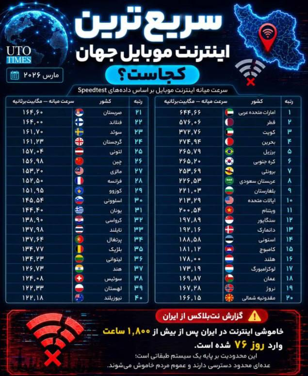

⭕️سریعترین اینترنت های جهان در یک نگاه...

📌خاموشی اینترنت هم در ایران به بیش از 1800 ساعت رسیده و وارد روز ۷۷ ام شده

🫆:Tony

📌 @persian_trend_official
پرشین ترند | متفاوت‌ترین کانال نظامی

## Persian_Trend_Official — post 14166

⭕️بولتن خبری و شبانه پرشین ترند

🔻🔻🔻🔻🔻🔻🔻🔻🔻

💢 دیدار ترامپ و شی جین‌پینگ در پکن با محوریت ایران، تایوان و تنگه هرمز
────────── ──
💢 شی جین‌پینگ: تایوان خط قرمز چین است
────────── ──
💢 ترامپ: برای پایان جنگ با ایران به کمک چین نیاز نداریم
────────── ──
💢 چین: روابط با آمریکا مهم‌ترین رابطه جهان است
────────── ──
💢 روبیو: چین باید ایران را به عقب‌نشینی وادار کند
────────── ──
💢 واشینگتن‌پست: چین از جنگ ایران سود راهبردی می‌برد
────────── ──
💢 آتش‌بس ایران و آمریکا در آستانه فروپاشی
────────── ──
💢 عراقچی: تنگه هرمز را آمریکا بسته است، نه ایران
────────── ──
💢 ابراهیم رضایی: غنی‌سازی ۹۰ درصدی یکی از گزینه‌های ایران است
────────── ──
💢 ادعای توقیف یک شناور نزدیک فجیره توسط ایران
────────── ──
💢 امارات اطراف مخازن نفتی دبی موانع ضدپهپادی نصب کرد
────────── ──
💢 تنش تازه میان ایران و کویت بر سر بازداشت ۴ ایرانی
────────── ──
💢 رویترز: جنگنده‌های سعودی مواضع گروه‌های عراقی را هدف قرار دادند
────────── ──
💢 روسیه یکی از بزرگ‌ترین حملات جنگ را علیه اوکراین انجام داد
────────── ──
💢 شلیک بیش از ۱۴۰۰ پهپاد و ۵۰ موشک روسی به اوکراین
────────── ──
💢 روسیه زیردریایی‌های هسته‌ای بوری را با تور ضدپهپاد پوشاند
────────── ──
💢 انتشار تصاویر آزمایش موشک سارمات روسیه
────────── ──
💢 مشاهده سامانه پدافندی چینی در دست سرباز اوکراینی
────────── ──
💢 چین تولید جنگنده پنهانکار جی-۲۰ را با کارخانه تمام‌خودکار افزایش داد
────────── ──
💢 طوفان مرگبار در هند ده‌ها کشته برجای گذاشت
────────── ──
💢 وزیر بهداشت دولت بریتانیا علیه استارمر استعفا داد

🫆:Tony

📌 @persian_trend_official
پرشین ترند | متفاوت‌ترین کانال نظامی

## Persian_Trend_Official — post 14164

  

🔴وزیر بهداشت انگلیس استعفا کرد؛ شورش در کابینه استارمر

🔹وس استریتینگ، وزیر بهداشت انگلیس روز پنجشنبه با صدور نامه‌ای به کی‌یر استارمر نخست‌وزیر این کشور از سمت خود استعفا داد.

🔹او با بیان اینکه «اعتماد خود را به رهبری» نخست‌وزیر از دست داده تصریح کرد که به باور او ماندن در دولت اقدامی «ناپسند» خواهد بود.

🔹استارمر از زمانی که حزب کارگر در انتخابات محلی انگلستان و پارلمان اسکاتلند و ولز شکست سنگینی خورد، با شورش در حزب خود مواجه شده است.

🔹نزدیک به ۹۰ نماینده کارگر به طور علنی خواستار استعفای او شده‌اند. استریتینگ اولین عضو کابینه استارمر است که از زمان شروع این شورش استعفا می‌دهد.

🔹در روزهای گذشته دفتر نخست‌وزیری انگلیس که در داونینگ استریت مستقر است بارها تأکید کرده که استارمر قصد استعفا ندارد.

🔹او روز دوشنبه در سخنرانی خود قول داد که در پست خود بماند و گفت تغییر رهبری، بریتانیا را دوباره به «هرج‌ومرجی» فرو خواهد برد که در دوران حزب محافظه‌کار حاکم بود.

🫆:Tony

📌 @persian_trend_official
پرشین ترند | متفاوت‌ترین کانال نظامی

## Persian_Trend_Official — post 14163

  

🔴 ابراهیم عزیزی، رییس کمیسیون امنیت ملی مجلس،

💢اماده‌ایم در تنگه هرمز و سایر میادین، بار دیگر دشمن را شکست بدهیم.»

💢به دشمنان هشدار می‌دهیم اگر دچار خطای محاسباتی شده و به امنیت ما خدشه‌ای وارد کنند، امنیت آن‌ها را در هر کجای جهان که باشد، سلب خواهیم کرد

💢او افزود: «امروز دشمن در تنگه هرمز در حال غرق‌شدن و تجربه شکست دیگری است و پیام ما به دشمن این است که هر اقدام محاسبه‌نشده، پاسخی دردناک به همراه خواهد داشت.»

🫆:Tony

📌 @persian_trend_official
پرشین ترند | متفاوت‌ترین کانال نظامی

## Persian_Trend_Official — post 14162

  <a href="telegram/content/Persian_Trend_Official_14162_1778792695.mp4" target="_blank">🎬 Download video</a>

🔴 تهدید کویت توسط عضو کمیسیون امنیت ملی مجلس

علی خضریان:
🔹کویت فراموش نکند که تنها در ۹۰ دقیقه توسط صدام تسخیر شد و امروز هم حد و حدود خود را بداند که جمهوری اسلامی بسیار قدرتمند است.

🫆:Tony

📌 @persian_trend_official
پرشین ترند | متفاوت‌ترین کانال نظامی

## Persian_Trend_Official — post 14161

https://youtube.com/live/SFBV2nP6Gs4?feature=share

## Persian_Trend_Official — post 14160

  <a href="https://t.me/persian_trend_official/14160" target="_blank">📎 Download file</a>

فایل صوتی لایو اول
نسخه کم حجم - 8.26 مگابایت

اتاق جنگ پنجشنبه 24 اردیبهشت | توافق چین و آمریکا در مورد ایران

📝 Nick

📌 @persian_trend_official
پرشین ترند | متفاوت‌ترین کانال نظامی

## Persian_Trend_Official — post 14159

  

🇺🇸🇨🇳 لی جون، بنیان‌گذار و مدیرعامل شرکت شیائومی، در حال گرفتن عکس سلفی با ایلان ماسک، ثروتمندترین فرد جهان و تاریخ.

📝 Nick

📌 @persian_trend_official
پرشین ترند | متفاوت‌ترین کانال نظامی

## Persian_Trend_Official — post 14156

  <a href="telegram/content/Persian_Trend_Official_14156_1778792697.webm" target="_blank">🎬 Download video</a>

🔴اسرائیل در حال توزیع تورهای ضد پهپاد به نیروهای خود در جنوب لبنان برای مقابله با پهپادهای FPV حزب‌الله است.

▪️تا کنون ۱۵۸٬۰۰۰ متر مربع نصب شده و ۱۸۸٬۰۰۰ متر مربع دیگر در سفارش است.

🫆:Tony

📌 @persian_trend_official
پرشین ترند | متفاوت‌ترین کانال نظامی

## Persian_Trend_Official — post 14155

https://youtube.com/live/SFBV2nP6Gs4?feature=share

## Persian_Trend_Official — post 14154

تا دقایقی دیگه لایو شروع میشه

## Persian_Trend_Official — post 14153

  <a href="telegram/content/Persian_Trend_Official_14153_1778792697.webm" target="_blank">🎬 Download video</a>

❤️ اگر از مخاطبان پرشین ترند هستید و تلگرام پرمیوم دارید،
با بوست کردن کانال کمک بزرگی به رشد و دیده‌شدن بیشتر پرشین ترند می‌کنید.
این بوست‌ها باعث می‌شود امکانات بیشتری برای انتشار محتوا، استوری و قابلیت‌های ویژه کانال فعال شود و در شرایط فعلی، به ادامه پوشش سریع و تحلیل‌های روزانه کمک زیادی می‌کند.
🙏 اگر مایل بودید، از طریق لینک زیر کانال را بوست کنید:
https://t.me/boost/persian_trend_official
📌 @persian_trend_official
پرشین ترند | متفاوت‌ترین کانال نظامی

## RadioFarda — post 157193

🔸همزمان با دیدار روسای جمهور آمریکا و چین در پکن، رهبران ۲۶ کشور روز پنجشنبه با انتشار بیانیه‌ای بار دیگر خواستار بازگشت وضعیت عادی دریانوردی در تنگه هرمز شدند. 🔸این بیانیه توسط کشورهایی مانند بریتانیا، فرانسه، بحرین، کانادا، آلمان، ژاپن، قطر و کره جنوبی…

## RadioFarda — post 157192

  

🔸همزمان با دیدار روسای جمهور آمریکا و چین در پکن، رهبران ۲۶ کشور روز پنجشنبه با انتشار بیانیه‌ای بار دیگر خواستار بازگشت وضعیت عادی دریانوردی در تنگه هرمز شدند.

🔸این بیانیه توسط کشورهایی مانند بریتانیا، فرانسه، بحرین، کانادا، آلمان، ژاپن، قطر و کره جنوبی صادر شده است.

🔸رهبران این کشورها در بیانیه خود بر «تعهد خود به استفاده از ظرفیت‌های جمعی دیپلماتیک، اقتصادی و نظامی برای حمایت از آزادی ناوبری در تنگه هرمز» تأکید کردند.

🔸در این بیانیه آمده است: «ناوبری باید مطابق با مفاد کنوانسیون حقوق دریاهای سازمان ملل متحد (UNCLOS) و قوانین بین‌المللی آزاد باشد.»

@RadioFarda

## RadioFarda — post 157191

  

🔸وزارت خارجه آمریکا اعلام کرد واشینگتن با همکاری ونزوئلا، بریتانیا و آژانس بین‌المللی انرژی اتمی، محموله‌ای از اورانیوم غنی‌شده با غنای بالا را از راکتور تحقیقاتی تعطیل‌شده RV-1 در ونزوئلا خارج کرده است.

🔸بر اساس بیانیه وزارت خارجه آمریکا، این مواد هسته‌ای که بخشی از برنامه تاریخی «اتم برای صلح» آمریکا بود، اواخر آوریل بسته‌بندی و سپس از طریق بریتانیا به مرکز «ساوانا ریور» در کارولینای جنوبی منتقل شد.

🔸آمریکا این اقدام را بخشی از تلاش‌های جهانی برای کاهش خطرات هسته‌ای توصیف کرده و گفته عملیات در مدت چند ماه، و سریع‌تر از برنامه اولیه، انجام شده است.

🔸طبق اعلام اداره امنیت هسته‌ای ملی آمریکا، در این عملیات حدود ۱۳.۵ کیلوگرم اورانیوم با غنای بالاتر از ۲۰ درصد از ونزوئلا خارج شده است.

@RadioFarda

## RadioFarda — post 157190

آغاز به کار دولت جدید عراق؛ پارلمان درباره ۹ وزیر کابینۀ علی الزیدی به توافق نرسید

🔸علی الزیدی، نخست‌وزیر جدید عراق، روز پنج‌شنبه ۲۴ اردیبهشت در حالی سوگند یاد کرد که کابینه او به‌صورت ناقص تشکیل شد و نمایندگان پارلمان نتوانستند در مورد برخی سمت‌های کلیدی، از جمله وزارتخانه‌های کشور و دفاع، به توافق برسند.

🔸به گفته نمایندگان پارلمان که با خبرگزاری رویترز گفت‌وگو کردند، باسم محمد به‌عنوان وزیر جدید نفت عراق منصوب شد و فؤاد حسین نیز در دولت جدید در سمت وزیر امور خارجه ابقا شد.

🔸پارلمان با ۱۴ وزیر کابینه جدید موافقت کرد، اما دربارهٔ چندین سمت باقی‌مانده، از جمله وزارتخانه‌های کشور و دفاع، به اجماع نرسید.

🔸نمایندگان گفتند جلسه پارلمان شاهد مشاجره‌های تندی بود، پس از آنکه برخی از نمایندگان به تأیید نامزد وزارت کشور اعتراض کردند.

🔸مقداد الخفاجی، نماینده پارلمان، به رویترز گفت: «پارلمان ۱۴ وزارتخانه را تأیید کرد، در حالی که تعیین تکلیف ۹ وزارتخانه دیگر به تعویق افتاده است. سه مورد از آنها امروز موفق به کسب رأی اعتماد پارلمان نشدند.»

🔸دونالد ترامپ، رئیس‌جمهور آمریکا، پیش‌تر در تماس تلفنی با الزیدی حمایت قاطع خود را از او اعلام کرد. این پس از آن بود که «چارچوب هماهنگی» شامل ائتلاف گروه‌های سیاسی شیعه عراق در ماه آوریل الزیدی را به‌عنوان نامزد نخست‌وزیری معرفی کرد و ۳۰ روز به او فرصت داد تا دولت تشکیل دهد.

🔸این ائتلاف قدرتمند شیعی پیشتر نوری‌المالکی نخست‌وزیر پیشین و نزدیک به حکومت ایران را نامزد پست نخست‌وزیری کرده بود؛ موضوعی که واکنش تند و تهدیدآمیز دونالد ترامپ را به‌دنبال داشت.

🔸 گزارش کامل را در وب‌سایت رادیوفردا بخوانید.

@RadioFarda

## RadioFarda — post 157189

  <a href="https://t.me/radiofarda/157189" target="_blank">📎 Download file</a>

چرا عمومی شدن سفر نتانیاهو به امارات، برای اسرائیل مهم است؟ گفت‌وگو با حبیب حسینی‌فرد

🔸آیا بنیامین نتانیاهو نخست‌وزیر اسرائیل در میانه جنگ با ایران به امارات متحده عربی سفر کرده است؟ پاسخ دفتر نخست‌وزیر اسرائیل به این پرسش مثبت است اما وزارت خارجه امارات متحده عربی در بیانیه‌ای ادعای دفتر بنیامین نتانیاهو، در این زمینه را تکذیب کرده است. دفتر نخست‌وزیر اسرائیل با اعلام خبر سفر گفته بود دیدار به یک «پیشرفت تاریخی» در روابط میان دو کشور منجر شده است. اما ابوظبی با تکذیب آن می‌گوید روابط امارات با اسرائیل «علنی» است و «بر پایه توافقات غیرشفاف یا غیررسمی بنا نشده است». خبر پیرامون این سفر و تکذیب آن در میانه گزارش‌هایی منتشر شده که از حمله تلافی‌جویانه امارات متحده عربی به ایران و همچنین استفاده این کشور از سامانه ضدموشکی گنبد آهنین اسرائیل مورد توجه قرار گرفته است. ارزیابی حبیب حسینی‌فرد تحلیلگر امور بین‌الملل را در آلمان درباره این تحولات بشنوید.

@RadioFarda

## RadioFarda — post 157188

  <a href="https://t.me/radiofarda/157188" target="_blank">📎 Download file</a>

«همزیستی» با محکومان به اعدام در گفت‌وگو با اسماعیل عبدی

🔸زندگی ایرانی گویی با نام زندان گره خورده‌ است. هر روز خبری از بازداشت، آزادی و اعدام در میان سرخط‌ها به چشم می‌خورد. اما زندانی که ما درباره آن می‌شنویم با زندانی که یک فرد محبوس پشت دیوارها و میله‌های آن تجربه می‌کند بسیار فاصله دارد و ما کمتر از تجربه روزمره زندانیان مطلع می‌شویم. در این روزها که هر روز خبر از اجرای یک یا چند حکم اعدام منتشر می‌شود با یک زندانی سیاسی پیشین درباره این تجربه گفت‌وگو کرده‌ایم که تجربه هم‌بندی و زندگی با محکومان به اعدام را از جمله در بند ۳۵۰ زندان اوین داشته است؛ اسماعیل عبدی دبیرپیشین کانون صنفی معلمان تهران بوده و حدود ده سال از زندگی خود را در زندان‌های ایران سپری کرده و هم اکنون ساکن شهر فرانکفورت در آلمان است.

@RadioFarda

## RadioFarda — post 157187

  <a href="https://t.me/radiofarda/157187" target="_blank">📎 Download file</a>

📻بشنوید: ایستگاه ۱۹ با رادیوفردا، ۲۴ اردیبهشت ۱۴۰۵

@RadioFarda

## IranianMinds — post 20149

  

🔴کان‌نیوز:

اسرائیل معتقد است که ترامپ وقتی از چین برگرده، درباره حمله مجدد به ایران تصمیم‌گیری میکنه.

@IranianMinds

## IranianMinds — post 20148

🔴 خبرگزاری ایسنا : از الان دیگه باید با قیمت قطعی خودرو خداحافظی کنید؛ در طرح جدید ایران ‌خودرو و سایپا، خریداران باید نصف پول رو از اول بدن بدون اینکه حتی بفهمن قیمت نهایی زمان تحویل خودرو براشون چقدره ! @IranianMinds

## IranianMinds — post 20147

ShirOKhorshid-2026.05.14.apk

## IranianMinds — post 20146

  

🔴 خبرگزاری ایسنا :

از الان دیگه باید با قیمت قطعی خودرو خداحافظی کنید؛

در طرح جدید ایران ‌خودرو و سایپا، خریداران باید نصف پول رو از اول بدن بدون اینکه حتی بفهمن قیمت نهایی زمان تحویل خودرو براشون چقدره !

@IranianMinds

## IranianMinds — post 20145

  <a href="telegram/content/IranianMinds_20145_1778792700.mp4" target="_blank">🎬 Download video</a>

🔴 کارشناس کانال ۱۴ اسرائیل:

رژیم ایران در حال انجام تماس‌هایی به صورت مخفی و مستقیم با دولت ترامپ هست و به شدت احتیاج به پول داره.

@IranianMinds

## IranianMinds — post 20144

  <a href="telegram/content/IranianMinds_20144_1778792702.mp4" target="_blank">🎬 Download video</a>

🔴 نتانیاهو:

ما اورشلیم را برای همیشه تحت حاکمیت اسرائیل حفظ خواهیم کرد.

@IranianMinds

## IranianMinds — post 20142

🔴 روبیو، وزیرخارجه آمریکا: ترامپ از رئیس جمهور چین کمکی نخواست و آمریکا به کمک چین نیازی نداره.

@IranianMinds

## IranianMinds — post 20141

  

:( موضوع امیدوار بودن یا نبودن نیست. وقتی که قدرت تصمیم‌گیری در دست دیگران است، وقتی که ما نمی‌توانیم در تصمیم‌گیری آنها دخالت کنیم، تنها کاری که می‌توان انجام داد، تحمل کردن است.

@IranianMinds

## IranianMinds — post 20140

  

گیر چه عقب مونده‌هایی افتادیم

ننگ ۵۰۰ ساله روحانیت رو از تاریخ ایران پاک باید کنیم

@IranianMinds

## IranianMinds — post 20139

  <a href="telegram/content/IranianMinds_20139_1778792705.mp4" target="_blank">🎬 Download video</a>

این هنرمند و کمدین آمریکایی، با طنز استندآپ، ۴۷ سال حکومت ننگین جمهوری اسلامی در ایران را به سخره می‌گیرد و به‌خوبی چهره فاسد و سرکوبگر این حکومت را افشا می‌کند. او همچنین از انقلاب و مبارزه مردم ایران برای آزادی حمایت می‌کند.
درود بر آزادی‌خواهان سراسر جهان.

@IranianMinds

## BBCPersian — post 281058

‌ ‌ ‌ ‌ ‌ حساب محمدباقر قالیباف، رئیس مجلس شورای اسلامی ایران، در پستی تازه به گزارش روز گذشته درباره تورم و افزایش نرخ بهره در آمریکا به عنوان یکی از پیامدهای جنگ با ایران واکنش نشان داده و خطاب به دونالد ترامپ، رئیس جمهور آمریکا نوشته است: «پس شما در حال…

## BBCPersian — post 281057

  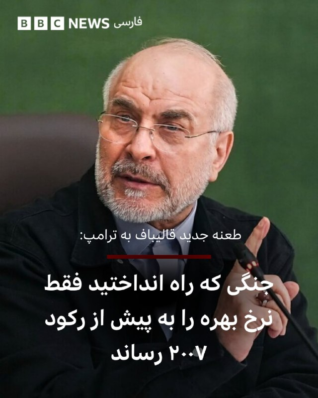

‌ ‌ ‌ ‌ ‌
حساب محمدباقر قالیباف، رئیس مجلس شورای اسلامی ایران، در پستی تازه به گزارش روز گذشته درباره تورم و افزایش نرخ بهره در آمریکا به عنوان یکی از پیامدهای جنگ با ایران واکنش نشان داده و خطاب به دونالد ترامپ، رئیس جمهور آمریکا نوشته است:

«پس شما در حال تأمین مالی (پیت) هگست، مجری تلویزیونی شکست‌خورده، با نرخ‌هایی هستید که از سال ۲۰۰۷ بی‌سابقه بوده، تا او بتواند در حیاط خلوت ما در تنگه هرمز، نقش «وزیر جنگ» را بازی کند؟»

حساب کاربری آقای قالیباف که از زمان آغاز جنگ آمریکا و اسرائیل علیه ایران، بارها واکنش‌های اغلب همراه با طعنه خطاب به دونالد ترامپ مورد توجه قرار گرفته است، در ادامه پست روز پنجشنبه - ۲۴ اردیبهشت - نوشته است:

«می‌دانید چه چیزی دیوانه‌کننده‌تر از بدهی ۳۹ تریلیون دلاری است؟ این که برای تامین مالی این جنگ‌، نرخ بهره‌ای به اندازه دوران پیش از بحران مالی جهانی در سال ۲۰۰۸ بپردازید و در نهایت فقط یک بحران مالی جهانی جدید نصیب‌تان شود.»

https://bbc.in/4f6noJB
📷shahraranews
@BBCPersian

## BBCPersian — post 281056

  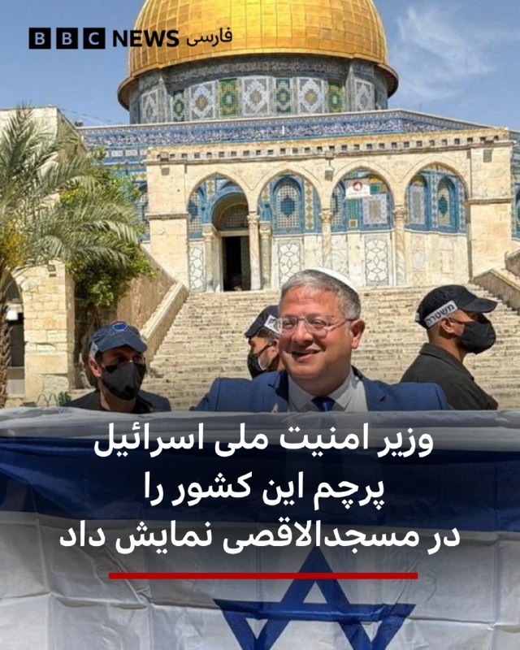

‌🔻ایتامار بن گوویر، وزیر امنیت ملی اسرائیل، که گرایشات راست افراطی دارد، قوانین دیرینه اماکن مذهبی این کشور را زیر پا گذاشته و یک پرچم اسرائیل را در کنار مسجدالاقصی به حرکت درآورده است. یهودیان به این مکان، کوه معبد می‌گویند.

در فیلمی که از این وزیر اسرائیلی بعد از برافراشتن پرچم اسرائیل گرفته شده، دیده می‌شود که او رقص‌کنان، آواز «کوه معبد در دستان ماست» را سرمی‌دهد. پس از آن، ده‌ها هزار اسرائیلی در یک مراسم سالیانه مذهبی و ملی در بخش قدیمی بیت‌المقدس راهپیمایی کردند.

«راهپیمایی پرچم» به مناسبت سالگرد تصرف بیت‌المقدس شرقی ا‌ز سوی اسرائیل در جنگ سال ۱۹۶۷ برگزار می‌شود.

خبرنگار بی‌بی‌سی در بیت‌المقدس می‌گوید این مراسم معمولا با خشونت و شعارهای نژادپرستانه علیه ساکنان فلسطینی این منطقه از بیت‌المقدس همراه است.

امسال، ده‌ها فعال صلح‌طلب اسرائیل تلاش کردند با این آزار و اذیت‌ها مقابله کنند.

📷Reuters
https://bbc.in/490B5pq

@BBCPersian

## BBCPersian — post 281055

  <a href="telegram/content/BBCPersian_281055_1778792707.mp4" target="_blank">🎬 Download video</a>

🔻آخرین خبرهای مهم روز پنجشنبه ۲۴ اردیبهشت ۱۴۰۵
@BBCPersian

## BBCPersian — post 281054

  <a href="telegram/content/BBCPersian_281054_1778792709.mp4" target="_blank">🎬 Download video</a>

🔻مادری که در سال گذشته دخترش را به دلیل یک عارضه قلبی از دست داده بود موفق شد پس از مرگ او دستانش را دوباره بگیرد.

جرجی وقتی ۱۷ سال داشت فرم اهدای عضو را پر کرده بود و یک سال پیش، پس از مرگ او اعضای بدنش به فردی که هر چهار دست و پای خود را از دست داده بود پیوند داده شد و حالا مادر جرجی دستان دخترش را در جان فردی که او نجات داده است می‌تواند دوباره ببیند و لمس کند.

فردی که جرجی اعضای بدنش را به او اهدا کرده بود می‌گوید که حالا و پس از پیوند عضو استقلال عمل زیادی دارد و می‌تواند خیلی از کارها را انجام دهد.

برای مادر جرجی در دست گرفتن دستان دخترش پس از از دست دادن او تجربه‌ای بی‌نظیر و خارق‌العاده است.
@BBCPersian

## BBCPersian — post 281046

‌🖊وایر دیویس، خبرنگار امور خاورمیانه
در,گزارش از عصاعصه، کرانه غربی

🔻محمد عصاعصه تازه پس از خاکسپاری حسین، پدر ۸۰ ساله‌اش، به خانه بازگشته بود که چند کودک دوان‌دوان وارد خانه شدند و فریاد زدند: «شهرک‌نشین‌ها دارند قبر را می‌کنند.»

در روستای کوچک عصاعصه، نزدیک جنین در کرانه غربی، روستایی که خانواده نام خود را از آن گرفته است، حسین پیش از مرگش به دلایل طبیعی، چهره‌ای شناخته‌شده و بسیار محترم بود.

طبق شعائر اسلامی، این مرد سالخورده، که پیش‌تر تاجر دام بود و ۱۰ فرزند داشت، در قبری ساده در گورستانی روی تپه‌ای کوچک، در سوی دیگر روستا و دور از خانه، به خاک سپرده شد.

محمد می‌گوید برای اطمینان از این‌ که مشکلی در روند خاکسپاری پیش نیاید، پیشاپیش از یک پایگاه نظامی اسرائیل در نزدیکی محل، برای برگزاری مراسم خاکسپاری اجازه گرفته بود.

اما کمتر از نیم ساعت بعد، محمد و برادرانش بار دیگر به ورودی گورستان بازگشتند و با صحنه‌ای هولناک روبه‌رو شدند.

متن کامل خبر در لینک زیر:
https://bbc.in/4tFB41J
📷BBC Images/ Getty Images/ AFP via Getty Images

@BBCPersian

## BBCPersian — post 281045

🔻سومین دور مذاکرات لبنان و اسرائیل در واشنگتن آغاز شد

🔻نمایندگان دولت‌های اسرائیل و لبنان سومین دور از مذاکرات خود را درواشنگتن آغاز کرده‌اند. این مذاکرات در حالی آغاز شده که آتش‌بس لبنان چند روز دیگر به پایان می‌رسد.

اسرائیل امروز هم در جنوب لبنان به حملات خود به چندین هدف که می‌گوید متعلق به حزب‌الله است، ادامه داد و چندین اسرائیلی هم با یک پهپاد انفجاری حزب‌الله مجروح شدند.

گروه حزب‌الله که تحت حمایت ایران است، در مذاکرات واشنگتن شرکت ندارد و آن را رد کرده است.

در حالی که دولت لبنان از اسرائیل خواسته است به حملات خود به خاک لبنان پایان دهد، اسرائیل خواهان خلع سلاح حزب‌الله است.

در دوره آتش‌بس، صدها نفر از مردم لبنان در حملات روزانه اسرائیل کشته شده‌اند و حزب‌الله هم به راکت‌پراکنی به داخل اسرائیل ادامه داده است.
https://bbc.in/3PHiUyz
@BBCPersian

## BBCPersian — post 281044

  <a href="https://t.me/bbcpersian/281044" target="_blank">📎 Download file</a>

🔻پادکست جام جهان‌نما پنجشنبه ۲۴ اردیبهشت ۱۴۰۵

🔻در این برنامه می‌شنوید:
دیدار دو ساعته ترامپ و شی در پکن... کاخ سفید می‌گوید آمریکا و چین بر سر باز شدن تنگه هرمز توافق دارند
همزمان در ایران گزارش‌ها از عبور بیشتر کشتی‌های چینی از تنگه هرمز حکایت دارد خبرگزاری فارس نوشته تهران به درخواست پکن این مجوز را صادر کرده نزدیکتر شدن آمریکا و چین، معادله جنگ را به نفع کدام‌ طرف تغییر می‌دهد؟
نشست وزیران خارجه بریکس در هند زیر سایه تنش میان اعضا... عراقچی در حاشیه این نشست، امارات را متهم کرد که مستقیم در اقدام تجاوزکارانه علیه ایران دست داشته
و... تکذیب سفر نتانیاهو به امارات در میانه جنگ ایران از سوی ابوظبی.... تهران با وجود این، هشدار داد دشمنی با ایران قماری احمقانه است

این برنامه رادیویی را می‌توانید هر شب ساعت ۲۰ به وقت ایران، روی موج متوسط ۷۰۲ کیلوهرتز و موج کوتاه ۹۴۶۵ کیلوهرتز بشنوید.
تکرار برنامه را هم می‌توانید ساعت ۲۱:۳۰ روی موج متوسط ۷۰۲ کیلوهرتز و موج کوتاه ۵۳۹۵ کیلوهرتز گوش کنید.
@BBCPersian

## BBCPersian — post 281043

🔻تدابیر تازه هند برای مقابله با اختلال در عرضه سوخت از خاورمیانه

🔻مقامات دهلی‌نو، پایتخت هند، اقداماتی را برای صرفه‌جویی در مصرف سوخت اعلام کرده‌اند.

این تدابیر در پی درخواست نارندرا مودی، نخست‌وزیر هند برای کاهش مصرف انرژی جهت مقابله با اختلال در عرضه سوخت از خاورمیانه در نظر گرفته شده است.

بر اساس این اقدامات که قرار است به مدت سه ماه اجرا شود، کارکنان ادارات دولتی دو روز در هفته «از خانه» کار خواهند کرد. سفرهای رسمی کاهش می‌یابد و استفاده از وسایل نقلیه شخصی هم کمتر خواهد شد.

همچنین در چارچوب این اقدامات، تمام رویدادهای عمومی و رسمی بزرگ لغو شده است و دولت هم خرید خودروهای جدید بنزینی، دیزلی و گاز طبیعی را به مدت شش ماه متوقف خواهد کرد.

نخست‌وزیر هند روز یکشنبه گفت که کشورش باید ارز کمتری را برای واردات سوخت هزینه کند.

https://bbc.in/4nraZ4K
@BBCPersian

## BBCPersian — post 281042

🔻دیدار عراقچی و لاوروف در حاشیه اجلاس وزرای خارجه بریکس

🔻وزارت خارجه روسیه اعلام کرد که سرگئی لاوروف، وزیر خارجه آن کشور، در حاشیه نشست وزرای خارجه کشورهای بریکس در دهلی نو، با همتای ایرانی خود عباس عراقچی دیدار و گفت‌وگو کرده است.

بنابر این گزارش، طرفین «به طور عمیق و محرمانه» درباره روند مذاکرات با هدف حل و فصل جنگ خاورمیانه تبادل نظر کردند.

وزارت خارجه روسیه می‌گوید که آقای لاوروف در این دیدار بر اهمیت حفظ آتش‌بس و صلح شکننده و همچنین جلوگیری از اختلال در تلاش‌های سیاسی و دیپلماتیک برای دستیابی به توافق جامع ایران و آمریکا تاکید کرد.

بر اساس این گزارش، سرگئی لاوروف در این دیدار بار دیگر آمادگی روسیه را برای ارائه تسهیلات به طرفین جهت یافتن و اجرای راه‌حل‌های قابل قبول دوجانبه اعلام کرد.

وزارت خارجه روسیه می‌گوید که دو طرف همچنین در مورد مسائل جاری همکاری‌های دوجانبه بحث و گفت‌وگو کرده و تعهد متقابل خود را برای تقویت مستمر مشارکت جامع راهبردی بین دو کشور، تایید کردند.

https://bbc.in/43cQEqw
@BBCPersian

## BBCPersian — post 281041

  

‌🔻‌روابط عمومی سپاه پاسداران اکنون با تایید گزارش‌های پیشین می‌گوید «با تصمیم جمهوری اسلامی، امکان عبور تعدادی از کشتی‌های چینی از تنگه هرمز با رعایت پروتکل مدیریت ایرانی تنگه میسر شد.»

بر اساس این بیانیه، پس از پیگیری‌های وزیر خارجه چین و سفیر این کشور در ایران، «در نهایت جمع‌بندی شد که تعدادی کشتی چینی مورد درخواست این کشور پس از تفاهم درباره پروتکل‌های مدیریت ایرانی تنگه از این منطقه عبور کنند که این عبور از شب گذشته آغاز شده است.»

بر اساس گزارش‌ها، ایران از شب گذشته به کشتی‌های چینی بیشتری اجازه عبور از تنگه هرمز را داده است.

خبرگزاری فارس به نقل از یک منبع آگاه گزارش داده است که این اقدام به دنبال درخواست‌های وزیر امور خارجه چین و سفیر پکن در ایران انجام شده است.

خبرگزاری فارس نوشته طی روزهای گذشته دست‌کم شش نفتکش و کشتی فله‌بر با مالکیت یا بهره‌برداری عملیاتی چین از تنگه هرمز عبور کرده‌اند.

بی‌بی‌سی وریفای هم تایید کرده که دستکم یک ابرنفتکش چین روز گذشته از تنگه هرمز عبور کرده است.

عکس استفاده شده آرشیوی است.

📷NurPhoto via Getty Images
https://bbc.in/4fl3qdR

@BBCPersian

## BBCPersian — post 281040

🔻ونگارد: کشتی توقیف شده از سوی ایران یک «انبار مهمات شناور» است

🔻پیشتر در مورد توقیف یک کشتی در نزدیکی امارات گزارش کرده بودیم که اکنون جزئیات بیشتری در مورد آن منتشر شده است.

به گزارش شرکت مدیریت ریسک دریایی «ونگارد»، یک کشتی که به عنوان «انبار مهمات شناور» در دریای عمان فعالیت می‌کرده، توسط نیروهای نظامی ایران توقیف شده است.

سازمان عملیات تجارت دریایی بریتانیا اعلام کرد که این کشتی اکنون «در مسیر آب‌های سرزمینی ایران» قرار دارد.

بی‌بی‌سی وریفای با بررسی داده‌های ردیابی کشتی‌ها از سامانه «مارین ترافیک» تایید کرده که این شناور که ونگارد آن را «هویی چوان» با پرچم هندوراس معرفی کرده، آخرین بار روز چهارشنبه در فاصله ۷۰ کیلومتری شمال شرق فجیره در امارات متحده عربی موقعیتش را مخابره کرده است.

اپراتورهای «هویی چوان» به ونگارد گفته‌اند که این کشتی به عنوان اسلحه‌خانه شناور فعالیت می‌کرده و در آن برای شرکت‌های امنیتی که از کشتی‌ها در برابر حملات دزدان دریایی محافظت می‌کنند، سلاح نگهداری می‌شده است.

بی‌بی‌سی وریفای نمی‌تواند تایید کند چه محموله‌ای در این کشتی بوده یا در اختیار چه کسانی بوده است.

بی‌بی‌سی پیشتر گزارش داده بود که این گونه شناورها در دریای سرخ، خلیج عدن و دریای عمان مستقر می‌شوند تا محافظان امنیتی بتوانند به راحتی سلاح و مهمات خود را تحویل گرفته یا تحویل دهند.

https://bbc.in/438NvYU
@BBCPersian

## BBCPersian — post 281039

  

🔻دونالد ترامپ می‌گوید که شی جین‌پینگ، رئیس‌جمهور چین، پیشنهاد داده تا پکن برای بازگشایی تنگه هرمز کمک کند.

آقای ترامپ،‌ پس از مذاکراتش در پکن به فاکس نیوز گفت که آقای شی به او گفته «به هر شکلی که بتواند مایل به این کار است.»

او افزود که رئیس‌جمهور چین همچنین به او اطمینان داده که پکن هیچ کمک نظامی به ایران در جنگ با اسرائیل و آمریکا ارسال نخواهد کرد.

پیش‌تر، شی جین‌پینگ در ضیافت رسمی به افتخار آقای ترامپ گفته بود که آمریکا و چین باید «شریک باشند، نه رقیب» و روابط دو کشور را «مهم‌ترین رابطه جهان» توصیف کرده بود.

آقای ترامپ نیز لحن مثبتی در قبال این دیدار داشت و از رهبر چین برای سفر به کاخ سفید در ماه سپتامبر دعوت کرد.

دو رئیس‌جمهور حدود دو ساعت گفت‌وگو کردند؛ مذاکراتی که کاخ سفید آن را «مثبت» توصیف کرده و گفته تمرکز آن بر تقویت روابط اقتصادی بوده است.

📷Getty Images
https://bbc.in/4uaHPJP

@BBCPersian

## idfinfarsi — post 11580

  <a href="telegram/content/idfinfarsi_11580_1778792712.mp4" target="_blank">🎬 Download video</a>

🎬 Video

## idfinfarsi — post 11579

در طول ۲۴ ساعت گذشته: ارتش اسرائیل حدود ۶۵ زیرساخت را هدف قرار داد و بیش از ۲۰ تروریست از سازمان تروریستی حزب‌الله را در جنوب لبنان به هلاکت رساند

ارتش اسرائیل به اقدامات خود برای از بین بردن تهدیدها علیه شهروندان اسرائیل و نیروهای ارتش اسرائیل در جنوب لبنان ادامه می‌دهد.

در طول ۲۴ ساعت گذشته، ارتش اسرائیل از هوا و زمین بیش از ۶۵ زیرساخت متعلق به سازمان تروریستی حزب‌الله را در چندین منطقه در جنوب لبنان هدف قرار داد.

از جمله زیرساخت‌های هدف قرارگرفته می‌توان به انبارهای تسلیحات، مواضع دیده‌بانی، مقرهای فرماندهی و سایر زیرساخت‌هایی اشاره کرد که تروریست‌های این سازمان از آن‌ها برای پیشبرد طرح‌های تروریستی علیه نیروهای ارتش اسرائیل و کشور اسرائیل استفاده می‌کردند.

همچنین بیش از ۲۰ تروریست از این سازمان در سراسر جنوب لبنان به هلاکت رسیدند.

## Dirty_Kids — post 389469

  <a href="telegram/content/Dirty_Kids_389469_1778792713.mp4" target="_blank">🎬 Download video</a>

چون دل‌تون برای سخنگوی اسکل الانبیا تنگ شده میدونم

@Dirty_Kids 👻

## Dirty_Kids — post 389468

  

اره داداش، امریکا تایوان رو میده به چین و ایران رو ازش میگیره.

@Dirty_Kids 👻

## Dirty_Kids — post 389467

  

آخرین ورژن خفت و خواری بچه‌شیعه:
رزمایش گذاشتن، هلی‌کوپتر نداشتن، بنرشو چاپ کردن گذاشتن اون وسط.

@Dirty_Kids 👻

## Dirty_Kids — post 389466

  

اصلی ترین سوالی که برای من پیش میاد که چرا تو همون ایران زیر کیر آخوند نمیخوابید ؟؟ چرا مهاجرت میکنید از راه دور برای آخوند دهنی میزنید ؟؟

این جک و جنده آزادی‌رو دوست دارن ولی اعتقاد دارن ملت ایران لیاقت ندارن فقط برای خودشون خوبه

@Dirty_Kids 👻

## Dirty_Kids — post 389465

  <a href="telegram/content/Dirty_Kids_389465_1778792715.mp4" target="_blank">🎬 Download video</a>

هنوز که هنوزه این ویدئو از درگیری چندتا ایرانی تو جاده ساحلیِ چالوس تو پیج‌های خارجی داره دست به دست میشه و تو اکسپلوره؛

@Dirty_Kids 👻

## Dirty_Kids — post 389464

  

خبرگزاری دانشجو : شما فقط نحوه دست دادن رئیس‌جمهور چین با پرفسور رئیسی و ترامپ رو مقایسه کنی، متوجه قدرت ایران میشید... +کسخلیت و کونده‌پروگری اینا حدی نداره :))))) چین فروختتشون توافق کرده با امریکا استقبال بی نظیر کردن از ترامپ بعد رئیسی گوزو ۶ کلاسه‌رو…

## Dirty_Kids — post 389463

  <a href="telegram/content/Dirty_Kids_389463_1778792716.mp4" target="_blank">🎬 Download video</a>

خبرگزاری دانشجو :
شما فقط نحوه دست دادن رئیس‌جمهور چین با پرفسور رئیسی و ترامپ رو مقایسه کنی، متوجه قدرت ایران میشید...

+کسخلیت و کونده‌پروگری اینا حدی نداره :)))))
چین فروختتشون توافق کرده با امریکا
استقبال بی نظیر کردن از ترامپ
بعد رئیسی گوزو ۶ کلاسه‌رو همه میریدن بهش از پوتین بگیر تا شی دارن مقایسه میکنن


@Dirty_Kids 👻

## Dirty_Kids — post 389462

  

رسایی؛ نماینده‌ی مجلس:

دولت قصد داره میزان سهمیه ماهانه بنزین ۱۵۰۰ تومنی و ۳۰۰۰ تومنی رو کاهش بده و قیمت بنزین ۵۰۰۰ تومنی رو هم به ۲۰۰۰۰ تومن برسونه.

@Dirty_Kids 👻

## Dirty_Kids — post 389458

ده‌هزار تا عکس داره یکی از یکی زیباتر

@Dirty_Kids 👻

## Dirty_Kids — post 389456

ریدم=)))))))))

@Dirty_Kids 👻

## Dirty_Kids — post 389455

✖️ سایت بین المللی bet120x 
✖️  
👍دارای مجوز رسمی Gambling Judge سوئد
👍       
💳شارژ حساب از طریق ارز و یووچر و پرمیوم ووچر 
💳تسویه حساب دلاری سریع 💊بیمه شرط میکس 
⚠️فروش شرط 
🔔ویرایش شرط                    
3️⃣
2️⃣ 
🎁20%هدیه واریز از طریق ارز و ووچر ┅━━━━━━━━━━━…

## Dirty_Kids — post 389454

  

✖️ سایت بین المللی bet120x 
✖️

 
👍دارای مجوز رسمی Gambling Judge سوئد
👍
     

💳شارژ حساب از طریق ارز و یووچر و پرمیوم ووچر

💳تسویه حساب دلاری سریع
💊بیمه شرط میکس

⚠️فروش شرط

🔔ویرایش شرط                    
3️⃣
2️⃣

🎁20%هدیه واریز از طریق ارز و ووچر
┅━━━━━━━━━━━

🎁 10%برگشت باخت به صورت روزانه

🎁 10%برگشت باخت به صورت هفتگی

🎁10%برگشت باخت به صورت ماهانه

💻ادرس ورود به سایت:
https://bet120x.com/fa/?btag=971470
➖➖➖➖➖
   
👈 آموزش واریز و برداشت دلاری
👉

🔪کانال اطلاع رسانی:
👇

✈️https://t.me/+1Wv5nGY_a54xNzlk

## Dirty_Kids — post 389453

  

گیر چه عقب مونده‌هایی افتادیم

ننگ ۵۰۰ ساله روحانیت رو از تاریخ ایران پاک باید کنیم

@Dirty_Kids 👻

## Dirty_Kids — post 389452

  <a href="telegram/content/Dirty_Kids_389452_1778792719.mp4" target="_blank">🎬 Download video</a>

هنوز رد خونت روشه ...
#پرهام_آقامحمدی

@Dirty_Kids 👻

## Dirty_Kids — post 389451

  

🌪وقتی اینترنت طوفانیه... کافیه بادبان ها رو بکشی تا

⚫️با بالاترین کیفیت ممکن
⚡️ 

⚫️100 هزار تومان شارژ هدیه 
🎁

⚫️پایین ترین قیمت گیگی 250
🌐 

⚫️و ارائه پورسانت %10 در ازای هر معرفی
💼

بتونی یه اتصال پایدار با پشتیبانی 24 ساعته داشته باشی
🚀

بادبان راهتو باز می‌کنه
⛵️

G24

🛡@BadBan_VPN | کانال 

🤖@BadBan_VPNBot | ربات 

📞@BadBan_VPNSupport | پشتیبانی

## Hranews — post 112946

گزارشی از تعدیل گسترده کارکنان شهربازی‌های کشور

❗️
❗️
❗️
❗️
❗️– رئیس انجمن شهربازی‌داران ایران اعلام کرد دستکم نیمی از نیروهای شاغل در این صنف، در پی افزایش هزینه‌ها و شرایط ماه‌های گذشته تعدیل شده‌اند.

ادامه مطلب

↘️
@hranews_bot تماس ✉️ - @Hranews کانال هرانا 🆑

## Hranews — post 112945

فقدان ایمنی کار؛ مصدومیت ۶ کارگر در آرادان و کاشان

❗️
❗️
❗️
❗️
❗️– در سایه فقدان ایمنی محیط و شرایط نامناسب کار، پنج #کارگر در آرادان بر اثر یک حادثه دچار مسمومیت شدند و یک کارگر در کاشان در پی وقوع حادثه‌ای، دچار مجروحیت و قطع عضو شد.

ادامه مطلب

↘️
@hranews_bot تماس ✉️ - @Hranews کانال هرانا 🆑

## manototv — post 105464

  <a href="telegram/content/manototv_105464_1778792720.mp4" target="_blank">🎬 Download video</a>

تماسی از ایران:
«می‌گفت بیمه عملاً داروها، مخصوصاً انسولین رو پوشش نمی‌ده…
و هزینه‌ها چند برابر شده.
می‌گفت دارو هست، اما برای خیلی‌ها دیگه قابل تهیه نیست.»

## manototv — post 105463

  <a href="telegram/content/manototv_105463_1778792722.mp4" target="_blank">🎬 Download video</a>

تماسی از ایران:
«می‌گفت برای زنده نگه داشتن پدرش حتی کپسول اکسیژن هم پیدا نمی‌شد…
و بیمارستان، با اون حال وخیم، مرخصش کرد چون تخت لازم داشت.

## manototv — post 105462

  <a href="telegram/content/manototv_105462_1778792723.mp4" target="_blank">🎬 Download video</a>

روزنامه فایننشال‌تایمز گزارش داده عربستان سعودی در حال بررسی طرحی برای ایجاد یک توافق امنیتی «عدم تجاوز» میان جمهوری‌اسلامی و کشورهای خاورمیانه است؛ توافقی که قرار است پس از پایان قطعی جنگ آمریکا و اسرائیل با ایران مطرح شود.
بر اساس این گزارش، این پیمان الگویی مشابه توافق هلسینکی در سال ۱۹۷۵ خواهد داشت؛ توافقی که میان آمریکا، کشورهای اروپایی و اتحاد جماهیر شوروی سابق امضا شده بود.
یک دیپلمات عرب به فایننشال‌تایمز گفته موفقیت چنین توافقی به کشورهایی بستگی دارد که در آن حضور خواهند داشت.
او گفته است: «اگر اسرائیل در این توافق حضور نداشته باشد، ممکن است نتیجه معکوس بدهد، چون بعد از ایران، اسرائیل از نگاه بسیاری عامل اصلی تنش در منطقه محسوب می‌شود. اما ایران از منطقه حذف نمی‌شود و به همین دلیل عربستان چنین طرحی را دنبال می‌کند.»
این گزارش همچنین به نقل از دو دیپلمات دیگر نوشته امارات متحده عربی ممکن است تمایلی به پیوستن به چنین توافقی نداشته باشد؛ کشوری که پس از امضای توافق ابراهیم در سال ۲۰۲۰، روابط نزدیکی با اسرائیل برقرار کرده است.

## manototv — post 105461

  <a href="telegram/content/manototv_105461_1778792724.mp4" target="_blank">🎬 Download video</a>

تدابیر امنیتی ویژه در سفر ترامپ به چین؛ استفاده از گوشی‌های موقتی برای جلوگیری از جاسوسی سایبری
رسانه‌های آمریکایی گزارش داده‌اند اعضای هیئت همراه دونالد ترامپ در سفر به پکن، برای جلوگیری از خطرات جاسوسی سایبری، از تلفن‌های موقتی و لپ‌تاپ‌های ویژه با دسترسی محدود استفاده می‌کنند.
بر اساس این گزارش‌ها، مقام‌های آمریکایی، دستیاران ترامپ و برخی مدیران شرکت‌های بزرگ فناوری از جمله ایلان ماسک و تیم کوک، دستگاه‌های شخصی خود را به چین نبرده‌اند و به‌جای آن از تجهیزات موسوم به «Burner Phone» و «Clean Device» استفاده می‌کنند.
گفته می‌شود نگرانی اصلی، احتمال شنود یا هک اطلاعات از طریق شبکه‌های اینترنتی، وای‌فای هتل‌ها، شارژرها و زیرساخت‌های ارتباطی در چین است.
این اقدام بخشی از پروتکل‌های امنیتی آمریکا برای سفرهای رسمی به چین به شمار می‌رود، اما رسانه‌ها می‌گویند این بار تدابیر امنیتی با حساسیت بیشتری اجرا شده است. مقام‌های آمریکایی در چنین سفرهایی فرض را بر این می‌گذارند که «هیچ چیز در چین امن نیست.»

## manototv — post 105460

  <a href="telegram/content/manototv_105460_1778792724.mp4" target="_blank">🎬 Download video</a>

عبدالحلیم خان، امام جماعت ۵۴ ساله ساکن شرق لندن، به‌دلیل تجاوز و آزار جنسی چندین زن و دختر، از جمله کودکان زیر ۱۳ سال، به حبس ابد محکوم شد.

پلیس متروپولیتن اعلام کرد او بین سال‌های ۲۰۰۴ تا ۲۰۱۵ از موقعیت مذهبی خود سوءاستفاده کرده و زنان و دخترانی حتی ۱۲ ساله را هدف قرار داده است.

خان در ماه فوریه در دادگاه «اسنرز‌بروک» به ۹ فقره تجاوز، چهار مورد آزار جنسی، دو مورد آزار جنسی کودک زیر ۱۳ سال، پنج مورد تجاوز به کودک زیر ۱۳ سال و یک مورد تعرض جنسی محکوم شد.

قاضی پرونده گفت او «پشت ظاهر تقدس و دینداری، به شکلی هیولاوار از زنانی که به او اعتماد داشتند سوءاستفاده کرده است.»

بر اساس اعلام دادستانی بریتانیا، خان به قربانیان می‌گفت توسط «جن» یا نیروهای ماورایی تسخیر شده و از این ادعا برای سوءاستفاده جنسی استفاده می‌کرد.

دادستان‌ها همچنین گفتند قربانیان از ترس «جادوی سیاه» و تهدیدهای او، سال‌ها موضوع را پنهان نگه داشته بودند.

یکی از قربانیان در بیانیه‌ای خطاب به دادگاه گفت: «برای من، خان انسان نیست؛ تجسم شر است.»

پلیس لندن اعلام کرد پرونده زمانی آغاز شد که کوچک‌ترین قربانی در سال ۲۰۱۸ موضوع را به معلم مدرسه‌اش گزارش داد.

## manototv — post 105459

  <a href="telegram/content/manototv_105459_1778792725.mp4" target="_blank">🎬 Download video</a>

فرمانده سنتکام اعلام کرد توان جمهوری‌اسلامی برای تهدید همسایگان و منافع آمریکا در منطقه به‌طور چشمگیری تضعیف شده است.
دریادار برد کوپر، فرمانده سنتکام، در جلسه‌ای در سنای آمریکا گفت: «تهدید ایران به‌طور قابل‌توجهی کاهش یافته و دیگر مانند گذشته قادر به تهدید شرکای منطقه‌ای یا آمریکا در همه حوزه‌ها نیست.»
او افزود نیروهای نیابتی جمهوری‌اسلامی در ۳۰ ماه پیش از جنگ اخیر بیش از ۳۵۰ حمله علیه نیروها و دیپلمات‌های آمریکایی انجام داده بودند؛ حملاتی که به گفته او به کشته شدن چهار سرباز آمریکایی منجر شد.
کوپر همچنین مدعی شد گروه‌هایی مانند حماس، حزب‌الله و حوثی‌ها اکنون از حمایت تسلیحاتی و لجستیکی جمهوری‌اسلامی جدا شده‌اند.
این فرمانده آمریکایی گفت ارتش آمریکا دیگر برای مقابله با پهپادهای جمهوری‌اسلامی از مهمات گران‌قیمت و پیشرفته استفاده نمی‌کند و به‌جای آن سراغ گزینه‌های ارزان‌تر رفته است.
به گفته او، جمهوری‌اسلامی تنها حدود ۱۰ درصد از پهپادهای خود را در اختیار دارد. با وجود آتش‌بس شکننده یک‌ماهه، درگیری‌های پراکنده میان نیروهای ایرانی و آمریکایی همچنان ادامه دارد.

## manototv — post 105457

  <a href="telegram/content/manototv_105457_1778792725.mp4" target="_blank">🎬 Download video</a>

دونالد ترامپ در گفت‌وگو با شان هنیتی گفت شی جین‌پینگ، رئیس‌جمهوری چین، متعهد شده به جمهوری اسلامی تجهیزات نظامی ارائه نکند.

ترامپ گفت: «او گفت قرار نیست تجهیزات نظامی بدهد؛ این حرف بزرگی است.»

رئیس‌جمهوری آمریکا در ادامه افزود چین همچنان بخش زیادی از نفت خود را از ایران خریداری می‌کند و مایل است این روند ادامه پیدا کند.

ترامپ همچنین گفت شی جین‌پینگ خواهان باز ماندن تنگه هرمز و جلوگیری از اختلال در عبور و مرور کشتی‌هاست.

## alonews — post 120048

  <a href="telegram/content/alonews_120048_1778792727.webm" target="_blank">🎬 Download video</a>

👈یدیعوت آحارونوت: اسرائیل می‌خواد اگه درگیری با ایران دوباره شروع بشه،تمرکزش روی زدن زیرساخت‌ها و اهداف انرژی باشه

✅ @AloNews خبر جنگ

## alonews — post 120047

  <a href="telegram/content/alonews_120047_1778792727.webm" target="_blank">🎬 Download video</a>

🔴فوری/سفر هفته آینده رئیس جمهور اسرائیل به آمریکا به طور ناگهانی لغو شد.

✅ @AloNews خبر جنگ

## alonews — post 120046

  

عجیب ترین توافق نامه ازدواج که توی دوران جنگ رقم خورد:

[@AloTweet]

## alonews — post 120045

تعرفه سرویس های Vip 
⭕️ 
✅ 1 گیگابایت 
⬅️ 235/000 تومان 
✅ 3 گیگابایت 
⬅️ 735/000 تومان استارلینک Vip 
💫 
🌟 
⭐️ 5 گیگابایت 
⬅️ 1/150/000 تومان 
⭐️ 10 گیگابایت 
⬅️ 2/350/000 تومان ویژگی های سرویس های Vip : 
❤️‍🔥 
✅    متصل در تمامی دستگاه و اپراتور ها 
✅    مناسب استفاده…

## alonews — post 120044

  <a href="telegram/content/alonews_120044_1778792727.webm" target="_blank">🎬 Download video</a>

👈سنتکام: از آغاز محاصره دریایی بنادر ایران، 72 کشتی تجاری را منحرف و 4 کشتی را از کار انداختیم

✅ @AloNews خبر جنگ

## alonews — post 120043

  <a href="telegram/content/alonews_120043_1778792727.webm" target="_blank">🎬 Download video</a>

👈وزارت خارجه قطر: ما به طور کامل از تلاش‌های پاکستان برای میانجیگری بین آمریکا و ایران حمایت می‌کنیم

✅ @AloNews خبر جنگ

## alonews — post 120042

  <a href="telegram/content/alonews_120042_1778792727.webm" target="_blank">🎬 Download video</a>

👈سوپر اپ روبیکا بیش از یک ساعته قطع شده

✅ @AloNews خبر جنگ

## alonews — post 120041

  <a href="telegram/content/alonews_120041_1778792728.webm" target="_blank">🎬 Download video</a>

👈محمدباقر قالیباف: پس شما به هگست، مجری تلویزیونی شکست‌خورده، بودجه‌ای می‌دهید که از سال ۲۰۰۷ بی‌سابقه است، تا بتواند در حیاط خلوت ما در هرمز نقش وزیر جنگ را بازی کند؟

🔴می‌دانی چه چیزی دیوانه‌کننده‌تر از ۳۹ تریلیون دلار بدهی است؟ پرداخت حق بیمه پیش از بحران مالی جهانی برای حمایت از یک بازی نقش‌آفرینی زنده (LARP) و تنها چیزی که به دست می‌آوری یک بحران مالی جهانی جدید است.

✅ @AloNews خبر جنگ

## alonews — post 120040

  <a href="telegram/content/alonews_120040_1778792728.webm" target="_blank">🎬 Download video</a>

👈رئیس‌جمهور ترامپ و هیئت همراهش در طول سفر به چین از تلفن‌ها و لپ‌تاپ‌های جایگزین استفاده کردند به دلیل نگرانی‌هایی که داشتند مبنی بر اینکه مقامات چینی ممکن است از آن‌ها برای نصب نرم‌افزار جاسوسی استفاده کنند، طبق گزارش فاکس نیوز.

✅ @AloNews خبر جنگ

## alonews — post 120039

  <a href="telegram/content/alonews_120039_1778792728.webm" target="_blank">🎬 Download video</a>

👈العربی الجدید: حمله انتحاری، پایگاه نظامی ارتش در منطقه باجور در شمال غربی پاکستان را هدف قرار داد.

✅ @AloNews خبر جنگ

## alonews — post 120038

  <a href="telegram/content/alonews_120038_1778792728.webm" target="_blank">🎬 Download video</a>

👈میدل ایست : ارتش دفاعی اسرائیل از فردا که ترامپ چین رو ترک می‌کنه، به بالاترین حالت آماده‌باش وارد میشه

✅ @AloNews خبر جنگ

## alonews — post 120037

  <a href="telegram/content/alonews_120037_1778792728.webm" target="_blank">🎬 Download video</a>

👈طبق گزارش بی‌بی‌سی، شناوری که ایران امروز توقیف کرد، «هوی چوان» نام دارد.
هوی چوان یکی از چندین کشتی شبح نظامی چین است که پکن از آن‌ها برای پشتیبانی از ارتش‌ها و شبه‌نظامیان در سراسر جهان استفاده می‌کند.

🔴این شناور توسط پیمانکاران نظامی خصوصی چین برای کمک به اسکورت کشتی‌های تجاری در دریای عرب و دور زدن دزدی دریایی، حوثی‌ها و سومالی به کار گرفته می‌شد

✅ @AloNews خبر جنگ

## alonews — post 120036

  <a href="telegram/content/alonews_120036_1778792728.webm" target="_blank">🎬 Download video</a>

👈بدل شاه فقید در تهران رویت شد

✅ @AloNews خبر جنگ

## alonews — post 120035

  <a href="telegram/content/alonews_120035_1778792728.webm" target="_blank">🎬 Download video</a>

👈اعتراضات در کوبا آغاز شده
این اعتراضات در حالی آغاز شد که دولت کوبا برق مناطق شرقی این کشور را به طور نامحدود قطع کرد.

🔴دولت اعلام کرد که "مطلقاً سوختی باقی نمانده است" و وضعیت اکنون "بحرانی" است.

✅ @AloNews خبر جنگ

## alonews — post 120034

  <a href="telegram/content/alonews_120034_1778792728.mp4" target="_blank">🎬 Download video</a>

👈لیندسی گراهام، سناتور مطرح آمریکایی با آشغال نامیدن متحدان چین از جمله ایران و روسیه، از این کشور برای باز کردن تنگه هرمز درخواست کمک کرد!

✅ @AloNews خبر جنگ

## alonews — post 120033

  <a href="telegram/content/alonews_120033_1778792730.webm" target="_blank">🎬 Download video</a>

👈رسایی:
قالیباف بدون هیچ دلیلی مجلس رو بسته

✅ @AloNews خبر جنگ

## alonews — post 120031

اسرائیل کاتز، وزیر دفاع اسرائیل:
لامین یامال تصمیم گرفت با این حرکتش علیه اسرائیل یه جو بزرگ درست کنه و به تنش‌ها دامن بزنه.
کسایی که از این مدل رفتارها حمایت می‌کنن باید از خودشون بپرسن آیا این کار انسانی و اخلاقیه یا نه!؟
من به عنوان وزیر دفاع اسرائیل مقابل توهین به اسرائیل و مردم یهودی سکوت نمی‌کنم.
از باشگاه بارسلونا میخوام از این حواشی فاصله بگیره و اجازه هیچ‌گونه حمایتی از تروریسم رو نده
@AloSport

## alonews — post 120030

اخبار جنگ الونیوز AloNews pinned «تعرفه سرویس های Vip 
⭕️ 
✅ 1 گیگابایت 
⬅️ 235/000 تومان 
✅ 3 گیگابایت 
⬅️ 735/000 تومان استارلینک Vip 
💫 
🌟 
⭐️ 5 گیگابایت 
⬅️ 1/150/000 تومان 
⭐️ 10 گیگابایت 
⬅️ 2/350/000 تومان ویژگی های سرویس های Vip : 
❤️‍🔥 
✅    متصل در تمامی دستگاه و اپراتور ها 
✅    مناسب استفاده…»

## alonews — post 120029

  <a href="telegram/content/alonews_120029_1778792730.webm" target="_blank">🎬 Download video</a>

👈زمین‌لرزه‌ای به بزرگی ۳.۵ ریشتر ساعت ۲۲:۲۹:۴۸ شامگاه پنجشنبه ۲۴ اردیبهشت حوالی قلعه قاضی در استان هرمزگان به وقوع پیوست

✅ @AloNews خبر جنگ

<!-- MSG END -->

<!-- NAV START -->

<a href="https://github.com/iocollab20/maxman/blob/main/telegram/content/archive_1.md" style="display:inline-block; padding:6px 12px; margin:0 4px; background-color:#2ea44f; color:white; text-decoration:none; border-radius:4px; font-weight:bold;">صفحه بعد</a>

<!-- NAV END -->
